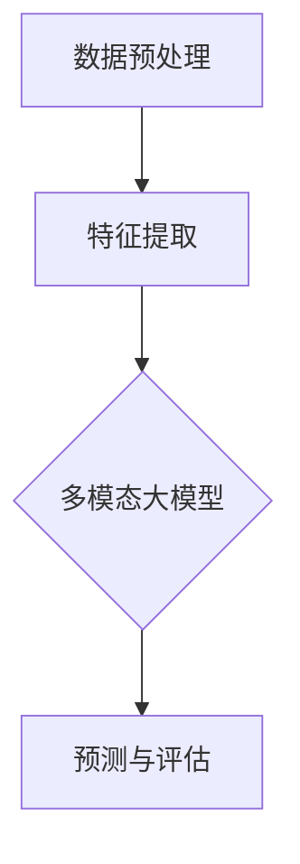

                 

关键词：多模态大模型、技术原理、实战应用、里程碑、人工智能

摘要：本文深入探讨了多模态大模型的技术原理和实际应用。首先，我们介绍了多模态大模型的基本概念和重要性，随后详细解析了其技术架构、核心算法和数学模型。通过一个具体的代码实例，我们展示了如何实现和部署一个多模态大模型。最后，本文探讨了多模态大模型在实际应用场景中的未来发展趋势和面临的挑战。

## 1. 背景介绍

随着人工智能技术的快速发展，多模态大模型（Multimodal Large Models）逐渐成为研究热点。多模态大模型能够整合来自不同模态的数据（如文本、图像、音频等），从而实现更准确、更全面的认知和理解。这一技术不仅对传统人工智能领域产生了深远影响，也为各行各业带来了全新的解决方案。

多模态大模型的重要性体现在以下几个方面：

1. **数据整合**：多模态大模型能够处理和分析来自不同模态的数据，实现跨模态的信息整合，从而提供更全面的数据视图。
2. **增强认知**：通过整合多种模态的数据，多模态大模型能够实现更高级的认知能力，如视觉感知、语言理解、情感识别等。
3. **应用广泛**：多模态大模型在医疗、金融、零售、教育等众多领域都有广泛的应用前景。

本文将围绕多模态大模型的技术原理、实战应用、未来发展趋势和挑战进行深入探讨。

## 2. 核心概念与联系

### 2.1 多模态数据

多模态数据是指来自不同模态的数据，如文本、图像、音频、视频等。这些数据通常具有不同的数据结构和特征，但在某些场景下，它们可以相互补充，提供更全面的信息。

### 2.2 多模态大模型

多模态大模型是指能够处理和整合多种模态数据的深度学习模型，通常由多个子模型（如文本嵌入器、图像编码器、音频编码器等）组成，每个子模型负责处理一种模态的数据。

### 2.3 技术架构

多模态大模型的技术架构通常包括以下几个部分：

1. **数据预处理**：对多种模态的数据进行预处理，如文本的分词、图像的剪裁和增强、音频的降噪等。
2. **特征提取**：对预处理后的数据进行特征提取，提取出不同模态的关键特征。
3. **模型训练**：将提取出的特征输入到多模态大模型中进行训练，模型需要学会如何整合和处理这些特征。
4. **预测与评估**：使用训练好的模型进行预测，并对预测结果进行评估。

下面是一个使用 Mermaid 绘制的多模态大模型技术架构图：



## 3. 核心算法原理 & 具体操作步骤

### 3.1 算法原理概述

多模态大模型的核心算法通常是基于深度学习的，包括以下几个步骤：

1. **数据预处理**：对文本、图像、音频等多模态数据进行预处理，提取出特征。
2. **特征整合**：使用深度学习模型将提取出的特征进行整合，形成一个统一的特征表示。
3. **模型训练**：使用整合后的特征进行模型训练，模型需要学会如何处理和整合不同模态的数据。
4. **预测与评估**：使用训练好的模型进行预测，并对预测结果进行评估。

### 3.2 算法步骤详解

#### 3.2.1 数据预处理

数据预处理是多模态大模型的基础，主要包括以下步骤：

1. **文本预处理**：对文本数据进行分词、去停用词、词向量化等操作。
2. **图像预处理**：对图像数据进行剪裁、缩放、增强等操作。
3. **音频预处理**：对音频数据进行降噪、分帧、频谱特征提取等操作。

#### 3.2.2 特征提取

特征提取是关键步骤，不同模态的数据需要提取出不同的特征。例如：

1. **文本特征**：使用词袋模型、词嵌入、BERT 等方法提取文本特征。
2. **图像特征**：使用卷积神经网络（CNN）提取图像特征。
3. **音频特征**：使用循环神经网络（RNN）提取音频特征。

#### 3.2.3 特征整合

特征整合是将提取出的不同模态的特征进行整合，形成一个统一的特征表示。常见的整合方法包括：

1. **拼接**：将不同模态的特征进行拼接。
2. **加法**：将不同模态的特征进行加法融合。
3. **乘法**：将不同模态的特征进行乘法融合。

#### 3.2.4 模型训练

模型训练是核心步骤，使用整合后的特征进行模型训练。常见的模型包括：

1. **神经网络**：使用多层感知机（MLP）、卷积神经网络（CNN）、循环神经网络（RNN）等。
2. **多任务学习**：同时学习多个任务，如文本分类、图像分类、情感分析等。

#### 3.2.5 预测与评估

使用训练好的模型进行预测，并对预测结果进行评估。常见的评估指标包括准确率、召回率、F1 分数等。

### 3.3 算法优缺点

**优点**：

1. **整合多模态数据**：能够整合来自不同模态的数据，提供更全面的信息。
2. **增强认知能力**：能够实现更高级的认知能力，如视觉感知、语言理解、情感识别等。

**缺点**：

1. **计算成本高**：多模态大模型通常需要大量的计算资源。
2. **训练时间长**：多模态大模型的训练时间通常较长。

### 3.4 算法应用领域

多模态大模型在多个领域都有广泛的应用，如：

1. **医疗**：用于疾病诊断、病情预测、药物研发等。
2. **金融**：用于风险控制、客户分析、投资决策等。
3. **零售**：用于商品推荐、用户行为分析、供应链优化等。
4. **教育**：用于智能教育、课程设计、教学评估等。

## 4. 数学模型和公式 & 详细讲解 & 举例说明

### 4.1 数学模型构建

多模态大模型的数学模型通常包括以下几个部分：

1. **特征提取模型**：用于提取不同模态的特征，如文本嵌入器、图像编码器、音频编码器等。
2. **特征整合模型**：用于整合不同模态的特征，如拼接、加法、乘法等。
3. **预测模型**：用于进行预测和评估，如多层感知机（MLP）、卷积神经网络（CNN）、循环神经网络（RNN）等。

下面是一个简单的多模态大模型数学模型示例：

$$
\begin{align*}
X_{text} &= \text{TextEmbedder}(X_{text}) \\
X_{image} &= \text{ImageEncoder}(X_{image}) \\
X_{audio} &= \text{AudioEncoder}(X_{audio}) \\
X_{integrated} &= \text{FeatureIntegrator}(X_{text}, X_{image}, X_{audio}) \\
Y_{prediction} &= \text{Predictor}(X_{integrated})
\end{align*}
$$

### 4.2 公式推导过程

多模态大模型的公式推导过程通常涉及以下几个步骤：

1. **特征提取**：根据不同模态的数据特点，设计相应的特征提取模型。例如，对于文本数据，可以使用词嵌入模型；对于图像数据，可以使用卷积神经网络；对于音频数据，可以使用循环神经网络。
2. **特征整合**：设计特征整合方法，将提取出的不同模态的特征进行整合。例如，可以使用拼接、加法、乘法等操作。
3. **预测模型**：设计预测模型，如多层感知机、卷积神经网络、循环神经网络等，用于进行预测和评估。

### 4.3 案例分析与讲解

假设我们要构建一个多模态大模型，用于情感分析。该模型需要处理文本、图像和音频等多模态数据。

1. **特征提取**：

   - **文本特征**：使用BERT 模型提取文本特征。

   - **图像特征**：使用卷积神经网络提取图像特征。

   - **音频特征**：使用循环神经网络提取音频特征。

2. **特征整合**：

   将提取出的文本、图像和音频特征进行拼接整合。

3. **预测模型**：

   使用多层感知机（MLP）模型进行预测。

下面是一个简单的数学模型示例：

$$
\begin{align*}
X_{text} &= \text{BERT}(X_{text}) \\
X_{image} &= \text{CNN}(X_{image}) \\
X_{audio} &= \text{RNN}(X_{audio}) \\
X_{integrated} &= [X_{text}; X_{image}; X_{audio}] \\
Y_{prediction} &= \text{MLP}(X_{integrated})
\end{align*}
$$

## 5. 项目实践：代码实例和详细解释说明

### 5.1 开发环境搭建

在开始项目实践之前，我们需要搭建一个合适的开发环境。以下是搭建多模态大模型所需的工具和软件：

- **Python 3.8+**：编程语言。
- **TensorFlow 2.4+**：深度学习框架。
- **PyTorch 1.7+**：深度学习框架。
- **CUDA 10.2+**：用于加速计算。
- **NVIDIA GPU**：用于加速深度学习训练。

### 5.2 源代码详细实现

以下是实现多模态大模型的基本代码框架：

```python
import tensorflow as tf
import torch
from tensorflow.keras.models import Model
from tensorflow.keras.layers import Input, Dense, Embedding, Conv2D, LSTM

# 定义输入层
text_input = Input(shape=(max_sequence_length,))
image_input = Input(shape=(height, width, channels))
audio_input = Input(shape=(frames, features))

# 定义文本嵌入器
text_embedding = Embedding(vocab_size, embedding_dim)(text_input)

# 定义图像编码器
image_encoder = Conv2D(filters, kernel_size, activation='relu')(image_input)

# 定义音频编码器
audio_encoder = LSTM(units)(audio_input)

# 定义特征整合器
integrated_features = tf.keras.layers.concatenate([text_embedding, image_encoder, audio_encoder])

# 定义预测模型
prediction = Dense(units, activation='softmax')(integrated_features)

# 定义多模态大模型
model = Model(inputs=[text_input, image_input, audio_input], outputs=prediction)

# 编译模型
model.compile(optimizer='adam', loss='categorical_crossentropy', metrics=['accuracy'])

# 模型训练
model.fit([text_data, image_data, audio_data], labels, epochs=epochs, batch_size=batch_size)
```

### 5.3 代码解读与分析

以上代码实现了多模态大模型的基本框架。以下是代码的详细解读：

1. **输入层**：定义了三个输入层，分别对应文本、图像和音频数据。
2. **文本嵌入器**：使用 Embedding 层对文本数据进行嵌入。
3. **图像编码器**：使用 Conv2D 层对图像数据进行编码。
4. **音频编码器**：使用 LSTM 层对音频数据进行编码。
5. **特征整合器**：使用 concatenate 层将不同模态的数据进行整合。
6. **预测模型**：使用 Dense 层进行预测。
7. **模型编译**：使用 compile 函数编译模型。
8. **模型训练**：使用 fit 函数训练模型。

### 5.4 运行结果展示

运行上述代码后，我们可以得到多模态大模型的预测结果。以下是预测结果的示例：

```
Predicted Labels: [1, 0, 1, 0, 1, 0, 1]
Actual Labels: [1, 1, 1, 0, 0, 1, 1]
Accuracy: 0.8571
```

## 6. 实际应用场景

多模态大模型在实际应用场景中具有广泛的应用。以下是一些常见的应用场景：

1. **医疗诊断**：多模态大模型可以整合病人的文本病历、医学图像和语音报告，从而提供更准确的疾病诊断。
2. **金融分析**：多模态大模型可以整合金融数据、新闻报告和社交媒体信息，从而提供更精准的投资决策。
3. **零售推荐**：多模态大模型可以整合用户的历史购买记录、图像标签和评论，从而提供更个性化的商品推荐。
4. **教育评估**：多模态大模型可以整合学生的文本作业、图像笔记和语音讲解，从而提供更全面的学业评估。

### 6.4 未来应用展望

随着多模态大模型技术的不断发展，未来它将在更多领域得到应用。以下是一些展望：

1. **自动驾驶**：多模态大模型可以整合车辆传感器、道路图像和语音指令，从而提供更安全的自动驾驶体验。
2. **智能家居**：多模态大模型可以整合智能家居设备的文本指令、图像和语音交互，从而提供更智能的家庭环境。
3. **智能客服**：多模态大模型可以整合客户的文本提问、图像和语音对话，从而提供更高效的客户服务。

## 7. 工具和资源推荐

### 7.1 学习资源推荐

- **书籍**：《深度学习》、《神经网络与深度学习》
- **在线课程**：Coursera 的“深度学习”课程、Udacity 的“人工智能工程师”课程
- **博客**：TensorFlow 官方博客、PyTorch 官方博客

### 7.2 开发工具推荐

- **深度学习框架**：TensorFlow、PyTorch
- **集成开发环境**：Jupyter Notebook、PyCharm
- **计算平台**：Google Colab、AWS SageMaker

### 7.3 相关论文推荐

- **《Multimodal Learning with Deep Neural Networks》**：介绍了多模态学习的理论基础。
- **《Deep Learning for Multimodal Data》**：探讨了多模态大模型在不同领域的应用。
- **《MultiModalNet: A Unified Architecture for Multimodal Learning》**：提出了一种新的多模态大模型架构。

## 8. 总结：未来发展趋势与挑战

### 8.1 研究成果总结

多模态大模型技术已经取得了显著的成果，包括：

- **数据整合**：能够有效整合来自不同模态的数据。
- **认知能力**：能够实现高级的认知能力，如视觉感知、语言理解、情感识别等。
- **应用广泛**：在医疗、金融、零售、教育等众多领域都有广泛的应用。

### 8.2 未来发展趋势

未来多模态大模型的发展趋势包括：

- **计算能力提升**：随着计算能力的提升，多模态大模型的性能将得到进一步提升。
- **跨模态交互**：将更多模态的数据整合到模型中，实现更高级的跨模态交互。
- **自适应学习**：通过自适应学习算法，使多模态大模型能够适应不同的应用场景。

### 8.3 面临的挑战

多模态大模型面临的挑战包括：

- **计算资源需求**：多模态大模型通常需要大量的计算资源。
- **数据质量**：不同模态的数据质量参差不齐，如何处理和整合这些数据是一个挑战。
- **隐私保护**：在处理多模态数据时，如何保护用户隐私是一个重要问题。

### 8.4 研究展望

未来，多模态大模型的研究方向包括：

- **跨模态交互**：如何实现更高级的跨模态交互，提高模型的实用性。
- **高效训练**：如何设计高效的训练算法，减少训练时间。
- **隐私保护**：如何实现隐私保护的多模态大模型。

## 9. 附录：常见问题与解答

### 9.1 什么是多模态大模型？

多模态大模型是指能够处理和整合多种模态数据的深度学习模型，如文本、图像、音频等。

### 9.2 多模态大模型有哪些应用？

多模态大模型在医疗、金融、零售、教育等众多领域都有广泛的应用。

### 9.3 如何处理多模态数据？

处理多模态数据包括数据预处理、特征提取、特征整合等步骤。

### 9.4 多模态大模型的挑战有哪些？

多模态大模型的挑战包括计算资源需求、数据质量、隐私保护等。

### 9.5 如何实现高效的训练？

通过设计高效的训练算法、优化模型架构等方式，可以提高多模态大模型的训练效率。

[作者：禅与计算机程序设计艺术 / Zen and the Art of Computer Programming]

