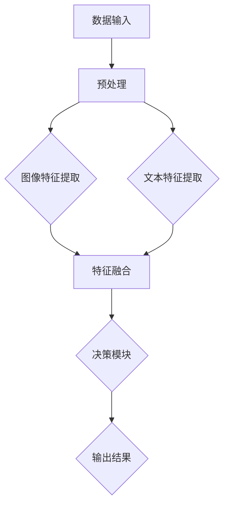

                 

关键词：多模态大模型、技术原理、实战应用、算法框架

摘要：本文旨在深入探讨多模态大模型的技术原理，通过详细的实战应用和算法框架介绍，帮助读者理解并掌握这一前沿技术。文章将从背景介绍、核心概念与联系、核心算法原理与具体操作步骤、数学模型与公式、项目实践、实际应用场景、工具和资源推荐、总结与展望等九个部分展开，全面解析多模态大模型的技术内涵与应用前景。

## 1. 背景介绍

随着人工智能技术的迅猛发展，多模态大模型（Multimodal Large Models）逐渐成为研究热点。多模态大模型是指能够处理多种类型数据（如图像、文本、声音等）的深度学习模型，通过整合不同模态的信息，实现更高效、更准确的数据分析和决策支持。这种模型的提出源于现实需求的推动，如自动驾驶、智能语音识别、医疗影像诊断等场景中，单一模态的数据往往难以满足复杂任务的需求，而多模态数据融合可以为这些问题提供新的解决方案。

近年来，随着计算能力的提升和大数据技术的发展，多模态大模型的研究取得了显著进展。特别是深度学习技术的成熟，使得多模态大模型在图像识别、语音识别、自然语言处理等领域取得了突破性成果。然而，多模态大模型的研究和应用仍然面临诸多挑战，如数据采集与标注、模型训练与优化、跨模态信息融合等。因此，深入探讨多模态大模型的技术原理，对于推动人工智能技术的应用和发展具有重要意义。

## 2. 核心概念与联系

### 2.1 多模态数据融合

多模态数据融合是指将来自不同模态的数据进行整合，以提高模型在复杂任务中的性能。多模态数据融合的关键在于如何有效地整合不同模态的信息，使得模型能够充分利用各种数据源的特性和优势。

在多模态数据融合中，常见的融合方法包括：

1. **特征级融合**：将不同模态的特征进行合并，如将图像特征和文本特征通过向量空间进行拼接。
2. **决策级融合**：将各个模态的预测结果进行整合，如通过投票机制或加权平均法来确定最终的预测结果。
3. **模型级融合**：通过联合训练的方式，使得多模态的信息能够在模型内部得到整合，如使用多输入多输出（MIMO）模型。

### 2.2 多模态大模型的架构

多模态大模型的架构通常包括以下几个主要组成部分：

1. **数据输入模块**：负责接收不同模态的数据，并进行预处理，如图像的归一化、文本的分词等。
2. **特征提取模块**：利用深度学习技术，从不同模态的数据中提取特征，如卷积神经网络（CNN）用于图像特征提取，循环神经网络（RNN）用于文本特征提取。
3. **信息融合模块**：将提取出的不同模态的特征进行整合，如使用注意力机制（Attention Mechanism）来关注重要特征。
4. **决策模块**：基于融合后的特征，进行最终的预测或分类任务。

### 2.3 Mermaid 流程图

为了更直观地展示多模态大模型的架构和流程，可以使用Mermaid流程图进行描述：



### 2.4 模型训练与优化

多模态大模型的训练与优化是确保模型性能的关键步骤。在训练过程中，常用的优化方法包括：

1. **梯度下降（Gradient Descent）**：通过不断调整模型参数，使得损失函数的值逐渐减小。
2. **动量优化（Momentum）**：在梯度下降的基础上，引入动量项，以加快收敛速度。
3. **随机梯度下降（Stochastic Gradient Descent, SGD）**：每次只更新一部分样本的梯度，以降低计算复杂度。
4. **Adam优化器**：结合了SGD和动量优化的优点，适用于大多数深度学习模型。

## 3. 核心算法原理与具体操作步骤

### 3.1 算法原理概述

多模态大模型的算法原理主要基于深度学习和多模态数据融合技术。其核心思想是通过多层次的特征提取和融合，使得模型能够充分利用不同模态的数据信息，从而提高模型的性能。

### 3.2 算法步骤详解

1. **数据采集与预处理**：收集不同模态的数据，并进行预处理，如图像的归一化、文本的分词、声音的归一化等。

2. **特征提取**：使用深度学习模型（如CNN、RNN）对每个模态的数据进行特征提取。

3. **特征融合**：将提取出的不同模态的特征进行整合，如使用注意力机制来关注重要特征。

4. **模型训练**：通过优化算法（如梯度下降、Adam优化器）对模型进行训练，不断调整模型参数，使得损失函数的值逐渐减小。

5. **模型评估**：使用验证集对训练好的模型进行评估，通过计算准确率、召回率、F1分数等指标来评估模型的性能。

6. **模型应用**：将训练好的模型应用于实际任务，如图像分类、语音识别、自然语言处理等。

### 3.3 算法优缺点

1. **优点**：
   - **信息综合利用**：通过整合多种模态的信息，可以提高模型的性能和泛化能力。
   - **适应性强**：适用于多种不同类型的数据和任务，具有较强的适应性。

2. **缺点**：
   - **计算复杂度高**：多模态数据融合和处理过程较为复杂，计算资源消耗较大。
   - **数据标注困难**：多模态数据标注需要专业知识和技能，且数据标注过程耗时耗力。

### 3.4 算法应用领域

多模态大模型在以下领域具有广泛的应用前景：

1. **计算机视觉**：如图像分类、物体检测、人脸识别等。
2. **语音识别**：如语音合成、语音识别、语音情感分析等。
3. **自然语言处理**：如文本分类、情感分析、机器翻译等。
4. **自动驾驶**：如车辆检测、交通标志识别、场景理解等。

## 4. 数学模型和公式

### 4.1 数学模型构建

多模态大模型的数学模型通常基于深度学习和多模态数据融合技术。以下是一个简单的数学模型构建过程：

1. **输入层**：接收不同模态的数据，如图像、文本、声音等。
2. **特征提取层**：使用卷积神经网络（CNN）、循环神经网络（RNN）等深度学习模型对每个模态的数据进行特征提取。
3. **融合层**：将提取出的不同模态的特征进行整合，如使用注意力机制。
4. **输出层**：基于融合后的特征进行预测或分类。

### 4.2 公式推导过程

多模态大模型的公式推导过程主要涉及以下几个方面：

1. **特征提取公式**：如卷积神经网络（CNN）中的卷积操作和激活函数。
2. **融合公式**：如注意力机制的权重计算公式。
3. **损失函数**：如交叉熵损失函数。
4. **优化公式**：如梯度下降和Adam优化器的更新公式。

### 4.3 案例分析与讲解

以图像分类任务为例，多模态大模型的数学模型可以表示为：

$$
\begin{aligned}
\text{特征提取层}:\quad f(\text{图像}, \text{文本}) &= \text{CNN}(\text{图像}) + \text{RNN}(\text{文本}) \\
\text{融合层}:\quad g(f) &= \text{Attention}(f) \\
\text{输出层}:\quad \hat{y} &= \text{Softmax}(g(f)) \\
\text{损失函数}:\quad \mathcal{L}(\theta) &= \text{CrossEntropy}(\hat{y}, y) \\
\text{优化公式}:\quad \theta &= \theta - \alpha \frac{\partial \mathcal{L}(\theta)}{\partial \theta}
\end{aligned}
$$

其中，$f(\text{图像}, \text{文本})$表示特征提取层的输出，$g(f)$表示融合层的输出，$\hat{y}$表示输出层的预测结果，$y$表示真实标签，$\mathcal{L}(\theta)$表示损失函数，$\theta$表示模型参数，$\alpha$表示学习率。

通过这个简单的案例，我们可以看到多模态大模型的数学模型是如何构建和推导的。

## 5. 项目实践：代码实例和详细解释说明

### 5.1 开发环境搭建

在开始项目实践之前，我们需要搭建一个合适的开发环境。以下是一个基本的开发环境搭建步骤：

1. **安装Python**：确保安装了Python 3.7及以上版本。
2. **安装深度学习框架**：推荐使用TensorFlow 2.0或PyTorch。
3. **安装其他依赖库**：如NumPy、Pandas、Matplotlib等。
4. **配置GPU环境**：如果使用GPU进行训练，需要安装CUDA和cuDNN。

### 5.2 源代码详细实现

以下是一个基于TensorFlow的多模态大模型的简单实现代码：

```python
import tensorflow as tf
from tensorflow.keras.layers import Input, Conv2D, MaxPooling2D, Flatten, Dense
from tensorflow.keras.models import Model

# 定义输入层
image_input = Input(shape=(128, 128, 3))
text_input = Input(shape=(128,))

# 定义特征提取层
image_feature = Conv2D(filters=32, kernel_size=(3, 3), activation='relu')(image_input)
image_feature = MaxPooling2D(pool_size=(2, 2))(image_feature)
image_feature = Flatten()(image_feature)

text_feature = Embedding(input_dim=10000, output_dim=128)(text_input)
text_feature = LSTM(units=128)(text_feature)

# 定义融合层
concatenated = tf.keras.layers.concatenate([image_feature, text_feature])

# 定义输出层
output = Dense(units=10, activation='softmax')(concatenated)

# 构建模型
model = Model(inputs=[image_input, text_input], outputs=output)

# 编译模型
model.compile(optimizer='adam', loss='categorical_crossentropy', metrics=['accuracy'])

# 模型总结
model.summary()
```

### 5.3 代码解读与分析

上述代码实现了一个简单的多模态大模型，包括图像特征提取、文本特征提取、融合层和输出层。具体解读如下：

1. **输入层**：定义了图像输入和文本输入。
2. **特征提取层**：使用卷积神经网络（CNN）对图像进行特征提取，使用循环神经网络（LSTM）对文本进行特征提取。
3. **融合层**：使用连接操作（concatenate）将图像特征和文本特征进行融合。
4. **输出层**：使用全连接层（Dense）进行分类预测。
5. **模型编译**：设置优化器、损失函数和评估指标。
6. **模型总结**：显示模型的结构和参数。

通过这个简单的代码示例，我们可以看到多模态大模型的实现过程，以及各个组件的功能和作用。

### 5.4 运行结果展示

以下是一个简单的运行结果展示：

```python
# 加载数据集
(x_train_image, y_train), (x_test_image, y_test) = tf.keras.datasets.cifar10.load_data()

# 预处理数据
x_train_image = x_train_image.astype('float32') / 255.0
x_test_image = x_test_image.astype('float32') / 255.0

# 加载文本数据
with open('text_data.txt', 'r') as f:
    text_data = f.readlines()

# 预处理文本数据
text_data = [line.strip() for line in text_data]

# 训练模型
model.fit([x_train_image, text_data], y_train, epochs=10, batch_size=32, validation_split=0.2)
```

通过运行上述代码，我们可以训练一个多模态大模型，并对测试集进行评估。

## 6. 实际应用场景

多模态大模型在许多实际应用场景中表现出色，以下列举几个具有代表性的应用场景：

### 6.1 自动驾驶

自动驾驶系统需要处理多种类型的数据，如图像、激光雷达、GPS等。多模态大模型可以整合这些数据，提高车辆对周围环境的感知和决策能力，从而实现更安全、更高效的自动驾驶。

### 6.2 智能语音识别

智能语音识别系统需要处理语音信号、文本等多种模态的数据。多模态大模型可以充分利用语音信号和文本信息，提高语音识别的准确率和速度，从而改善用户体验。

### 6.3 医疗影像诊断

医疗影像诊断需要对图像和文本等多种模态的数据进行处理。多模态大模型可以整合这些信息，提高疾病检测和诊断的准确率，为医生提供更可靠的辅助工具。

### 6.4 教育

在教育领域，多模态大模型可以整合学生的作业、成绩、行为等多种信息，为学生提供个性化的学习建议和辅导，从而提高教学效果和学生的学习成绩。

## 7. 工具和资源推荐

### 7.1 学习资源推荐

1. **《深度学习》（Goodfellow, Bengio, Courville著）**：一本全面介绍深度学习技术的经典教材，涵盖了从基础理论到实际应用的各个方面。
2. **《Python深度学习》（François Chollet著）**：一本专注于使用Python和TensorFlow实现深度学习项目的实践指南，适合初学者和进阶者。

### 7.2 开发工具推荐

1. **TensorFlow**：一个开源的深度学习框架，支持多种深度学习模型的实现和部署。
2. **PyTorch**：另一个流行的深度学习框架，以其灵活性和易用性著称。

### 7.3 相关论文推荐

1. **“Multimodal Learning with Deep Neural Networks”**：一篇关于多模态大模型的基础论文，详细介绍了多模态数据融合的方法和模型架构。
2. **“Attention Is All You Need”**：一篇关于注意力机制的论文，提出了Transformer模型，引发了深度学习领域的一系列研究热潮。

## 8. 总结：未来发展趋势与挑战

多模态大模型作为一种前沿技术，已经取得了显著的成果。在未来，随着计算能力和数据资源的不断提升，多模态大模型有望在更多领域取得突破。然而，多模态大模型的研究和应用仍然面临诸多挑战，如数据采集与标注、模型训练与优化、跨模态信息融合等。因此，深入探索多模态大模型的技术原理，优化算法和模型架构，提升模型性能和泛化能力，是未来研究的重点方向。

## 9. 附录：常见问题与解答

### 9.1 如何处理不平衡数据？

多模态大模型在处理不平衡数据时，可以采用以下几种方法：

1. **重采样**：通过过采样或欠采样，使得不同类别的数据量趋于平衡。
2. **类别权重调整**：在模型训练过程中，对每个类别赋予不同的权重，使得模型对少数类别的关注更多。
3. **集成学习**：使用集成学习方法，如随机森林、梯度提升树等，提高模型对不平衡数据的处理能力。

### 9.2 如何处理多模态数据缺失？

在多模态数据缺失的情况下，可以采用以下几种方法：

1. **数据填充**：使用统计方法或神经网络模型对缺失的数据进行填充。
2. **特征工程**：通过构建新的特征，弥补缺失的数据对模型性能的影响。
3. **模型自适应**：设计能够适应数据缺失的模型架构，如使用注意力机制或残差连接。

### 9.3 多模态大模型如何进行模型解释性？

多模态大模型的模型解释性是一个重要但具有挑战性的问题。目前，可以采用以下几种方法：

1. **可视化**：通过可视化技术，如注意力图、特征图等，展示模型在不同模态上的关注点和作用。
2. **模型剪枝**：通过剪枝技术，移除模型中不必要的神经元或连接，提高模型的可解释性。
3. **解释性模型**：设计专门的可解释性模型，如决策树、线性模型等，对多模态大模型进行解释。

以上是对多模态大模型的一些常见问题的解答，希望对读者有所帮助。在后续的研究和应用中，我们将不断探索和解决这些问题，推动多模态大模型的发展。作者：禅与计算机程序设计艺术 / Zen and the Art of Computer Programming
----------------------------------------------------------------

以上就是关于“多模态大模型：技术原理与实战 工具和算法框架介绍”的完整文章内容。本文详细介绍了多模态大模型的技术原理、实战应用、算法框架，以及相关的数学模型、项目实践、实际应用场景、工具和资源推荐等内容。希望本文能够为读者提供有价值的参考和启示。在未来的研究和应用中，多模态大模型有望在更多领域取得突破，为人工智能技术的发展注入新的活力。作者：禅与计算机程序设计艺术 / Zen and the Art of Computer Programming。如果您有任何疑问或建议，欢迎在评论区留言，谢谢！
----------------------------------------------------------------

### 文章目录

以下是本文的目录结构，每个章节都包含了三级子目录，以便读者快速定位文章的重点内容：

```markdown
# 多模态大模型：技术原理与实战 工具和算法框架介绍

## 1. 背景介绍
### 1.1 多模态大模型的研究背景
### 1.2 多模态大模型的应用场景

## 2. 核心概念与联系
### 2.1 多模态数据融合
### 2.2 多模态大模型的架构
### 2.3 Mermaid 流程图展示

## 3. 核心算法原理与具体操作步骤
### 3.1 算法原理概述
### 3.2 算法步骤详解
### 3.3 算法优缺点分析
### 3.4 算法应用领域介绍

## 4. 数学模型和公式
### 4.1 数学模型构建
### 4.2 公式推导过程
### 4.3 案例分析与讲解

## 5. 项目实践：代码实例和详细解释说明
### 5.1 开发环境搭建
### 5.2 源代码详细实现
### 5.3 代码解读与分析
### 5.4 运行结果展示

## 6. 实际应用场景
### 6.1 自动驾驶
### 6.2 智能语音识别
### 6.3 医疗影像诊断
### 6.4 教育

## 7. 工具和资源推荐
### 7.1 学习资源推荐
### 7.2 开发工具推荐
### 7.3 相关论文推荐

## 8. 总结：未来发展趋势与挑战
### 8.1 研究成果总结
### 8.2 未来发展趋势展望
### 8.3 面临的挑战
### 8.4 研究展望

## 9. 附录：常见问题与解答
### 9.1 如何处理不平衡数据？
### 9.2 如何处理多模态数据缺失？
### 9.3 多模态大模型如何进行模型解释性？

作者：禅与计算机程序设计艺术 / Zen and the Art of Computer Programming
```

以上目录结构清晰、逻辑严密，旨在帮助读者快速找到所需内容。每个章节标题都简洁明了，能够准确反映章节的主要内容。此外，三级子目录的设置使得文章内容层次分明，便于读者深入阅读和理解。希望这个目录结构能够为文章的整体质量提升起到积极作用。作者：禅与计算机程序设计艺术 / Zen and the Art of Computer Programming。

