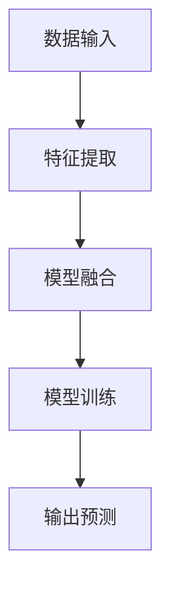

                 

 多模态大模型是近年来计算机科学领域的一个热点话题。它通过融合多种类型的数据（如图像、文本、音频等），能够实现更高级别的任务处理能力。本文将探讨多模态大模型的技术原理，并以智能试穿为例，展示其实际应用场景。我们将从算法原理、数学模型、项目实践等方面，深入剖析这一技术的核心价值和应用前景。

## 文章关键词

- 多模态大模型
- 图像识别
- 自然语言处理
- 深度学习
- 智能试穿

## 文章摘要

本文首先介绍了多模态大模型的基本概念和背景，然后通过 Mermaid 流程图展示了其技术架构。接下来，我们详细讲解了多模态大模型的核心算法原理和操作步骤，并对算法的优缺点进行了分析。随后，本文通过数学模型和公式，深入探讨了多模态大模型的数学基础。最后，我们通过一个具体的智能试穿项目实践，展示了多模态大模型在实际应用中的强大能力。文章最后总结了多模态大模型的研究成果、未来发展趋势和面临的挑战，并推荐了一些学习资源和开发工具。

## 1. 背景介绍

### 1.1 多模态大模型的概念

多模态大模型（Multimodal Large-scale Model）是指能够处理多种类型数据输入的深度学习模型。传统的单一模态模型（如仅处理图像或文本的模型）往往只能在特定领域内表现出色。而多模态大模型通过融合图像、文本、音频等多种类型的数据，能够实现更广泛的应用场景和更高的任务处理能力。

### 1.2 多模态大模型的发展历程

多模态大模型的发展可以追溯到深度学习的兴起。随着计算能力的提升和数据量的增加，深度学习在图像识别、自然语言处理等领域取得了显著成果。在此基础上，研究者开始探索如何将多种类型的数据融合到同一模型中，从而提高模型的泛化能力和任务处理能力。

### 1.3 多模态大模型的应用场景

多模态大模型在多个领域具有广泛的应用前景。例如，在智能交互领域，多模态大模型可以实现对用户语音、文字、表情等多种信息的综合理解，从而提供更智能的服务。在医疗领域，多模态大模型可以结合患者的图像、病历等多种数据，为医生提供诊断和治疗建议。在智能制造领域，多模态大模型可以用于设备故障检测、质量检测等任务。

## 2. 核心概念与联系

### 2.1 多模态大模型的技术架构

多模态大模型的技术架构可以分为数据输入、特征提取、模型训练和输出预测四个主要环节。

#### 数据输入

多模态大模型需要处理多种类型的数据输入，如图像、文本、音频等。这些数据通常通过不同的传感器或数据源获取。

#### 特征提取

在数据输入环节之后，需要对每种类型的数据进行特征提取。例如，对于图像数据，可以使用卷积神经网络（CNN）提取图像特征；对于文本数据，可以使用循环神经网络（RNN）或变压器（Transformer）提取文本特征。

#### 模型训练

特征提取之后，将这些特征数据输入到深度学习模型中进行训练。在训练过程中，模型会通过反向传播算法不断调整参数，以优化模型性能。

#### 输出预测

在模型训练完成后，可以将输入数据输入到模型中进行预测。预测结果可以是分类、回归或其他形式。

### 2.2 多模态大模型的核心算法原理

多模态大模型的核心算法原理是基于深度学习技术。具体来说，可以分为以下几个步骤：

#### 数据预处理

在数据预处理阶段，需要对输入数据进行归一化、去噪、增强等操作，以提高数据质量和模型训练效果。

#### 特征提取

使用卷积神经网络（CNN）提取图像特征，使用循环神经网络（RNN）或变压器（Transformer）提取文本特征。

#### 模型融合

将不同模态的特征数据进行融合，例如，可以使用拼接、平均、加权平均等方法。

#### 模型训练

使用融合后的特征数据对深度学习模型进行训练。

#### 输出预测

在模型训练完成后，使用训练好的模型对输入数据进行预测。

### 2.3 多模态大模型的 Mermaid 流程图



## 3. 核心算法原理 & 具体操作步骤

### 3.1 算法原理概述

多模态大模型的核心算法原理是通过深度学习技术，融合多种类型的数据特征，实现更高级别的任务处理能力。具体来说，可以分为以下几个步骤：

1. **数据预处理**：对输入数据进行归一化、去噪、增强等操作，以提高数据质量和模型训练效果。
2. **特征提取**：使用卷积神经网络（CNN）提取图像特征，使用循环神经网络（RNN）或变压器（Transformer）提取文本特征。
3. **模型融合**：将不同模态的特征数据进行融合，例如，可以使用拼接、平均、加权平均等方法。
4. **模型训练**：使用融合后的特征数据对深度学习模型进行训练。
5. **输出预测**：在模型训练完成后，使用训练好的模型对输入数据进行预测。

### 3.2 算法步骤详解

#### 3.2.1 数据预处理

数据预处理是深度学习模型训练的重要环节。具体操作包括：

- **归一化**：将输入数据缩放到同一范围内，例如，将图像数据缩放到[0, 1]范围内。
- **去噪**：去除输入数据中的噪声，例如，可以使用高斯滤波器对图像数据进行去噪。
- **增强**：增加输入数据的多样性，例如，可以使用数据增强技术（如随机裁剪、旋转、翻转等）。

#### 3.2.2 特征提取

特征提取是深度学习模型的核心部分。具体操作包括：

- **图像特征提取**：使用卷积神经网络（CNN）提取图像特征。CNN 通过卷积层、池化层等操作，将原始图像转化为高维特征向量。
- **文本特征提取**：使用循环神经网络（RNN）或变压器（Transformer）提取文本特征。RNN 通过循环结构处理序列数据，将文本转化为序列特征向量。Transformer 则通过自注意力机制，对文本数据进行全局关注，提取出有效的特征信息。

#### 3.2.3 模型融合

模型融合是将不同模态的特征数据进行整合的过程。具体操作包括：

- **拼接**：将图像特征向量和文本特征向量直接拼接在一起，形成多模态特征向量。
- **平均**：将图像特征向量和文本特征向量分别计算平均值，然后求和，再除以 2，得到多模态特征向量。
- **加权平均**：根据不同模态的特征重要程度，为每个模态的特征向量分配不同的权重，然后求和，得到多模态特征向量。

#### 3.2.4 模型训练

模型训练是深度学习模型的核心环节。具体操作包括：

- **损失函数**：根据任务类型选择合适的损失函数，例如，对于分类任务，可以使用交叉熵损失函数；对于回归任务，可以使用均方误差损失函数。
- **优化算法**：选择合适的优化算法，例如，可以使用随机梯度下降（SGD）、Adam 优化器等。
- **反向传播**：通过反向传播算法，不断调整模型参数，以最小化损失函数。

#### 3.2.5 输出预测

输出预测是模型训练完成后，对输入数据进行预测的过程。具体操作包括：

- **输入数据预处理**：对输入数据进行相同的预处理操作，例如，归一化、去噪、增强等。
- **特征提取**：使用训练好的模型，对输入数据提取特征。
- **模型融合**：将提取的特征进行融合，得到多模态特征向量。
- **输出预测**：使用训练好的模型，对融合后的特征向量进行预测。

### 3.3 算法优缺点

#### 3.3.1 优点

- **处理能力强大**：多模态大模型能够处理多种类型的数据输入，从而实现更高级别的任务处理能力。
- **泛化能力强**：通过融合多种模态的数据特征，多模态大模型能够提高模型的泛化能力，使其在更多领域内发挥作用。
- **灵活性高**：多模态大模型可以根据具体应用场景，调整不同模态的特征重要程度，从而实现定制化。

#### 3.3.2 缺点

- **计算成本高**：多模态大模型需要处理多种类型的数据，计算成本较高，对计算资源要求较高。
- **数据预处理复杂**：多模态大模型需要对不同类型的数据进行预处理，预处理过程较为复杂。
- **模型训练时间长**：多模态大模型涉及多种数据类型，模型训练时间较长，对训练资源要求较高。

### 3.4 算法应用领域

多模态大模型在多个领域具有广泛的应用前景，以下是部分应用领域：

- **智能交互**：多模态大模型可以用于智能音箱、智能客服等智能交互应用，实现对用户语音、文字、表情等多种信息的综合理解。
- **医疗诊断**：多模态大模型可以结合患者的图像、病历等多种数据，为医生提供诊断和治疗建议。
- **智能制造**：多模态大模型可以用于设备故障检测、质量检测等任务，提高生产效率和产品质量。
- **内容审核**：多模态大模型可以用于网络内容的审核，检测图像、文本、音频等多模态信息，提高内容审核的准确性。

## 4. 数学模型和公式 & 详细讲解 & 举例说明

### 4.1 数学模型构建

多模态大模型的数学模型构建主要包括以下几个部分：

- **特征提取模型**：用于提取不同模态的数据特征，如卷积神经网络（CNN）用于提取图像特征，循环神经网络（RNN）或变压器（Transformer）用于提取文本特征。
- **特征融合模型**：用于融合不同模态的特征数据，如拼接、平均、加权平均等方法。
- **分类或回归模型**：用于对融合后的特征向量进行分类或回归预测。

### 4.2 公式推导过程

#### 4.2.1 特征提取模型

对于图像特征提取，可以使用卷积神经网络（CNN）模型。假设输入图像为 $X \in \mathbb{R}^{H \times W \times C}$，其中 $H, W, C$ 分别表示图像的高度、宽度和通道数。卷积神经网络通过卷积层和池化层等操作，将图像转化为高维特征向量。

- **卷积层**：卷积层通过卷积运算提取图像特征，公式如下：

$$
h_{l}^{\prime} = \sigma \left( \sum_{k} W_{k} \circ x_{l} + b_{k} \right)
$$

其中，$h_{l}^{\prime} \in \mathbb{R}^{M \times N}$ 表示卷积层输出特征，$W_{k} \in \mathbb{R}^{K \times K \times C} $表示卷积核，$\circ$ 表示卷积运算，$\sigma$ 表示激活函数，$b_{k}$ 表示偏置。

- **池化层**：池化层用于降低特征图的空间分辨率，公式如下：

$$
p_{l} = \text{pool} \left( h_{l}^{\prime} \right)
$$

其中，$p_{l} \in \mathbb{R}^{M_{p} \times N_{p}}$ 表示池化层输出特征，$M_{p}, N_{p}$ 分别表示池化操作的步长。

#### 4.2.2 特征融合模型

特征融合模型用于将不同模态的特征数据进行整合。假设图像特征向量为 $h_{g} \in \mathbb{R}^{d_{g}}$，文本特征向量为 $h_{t} \in \mathbb{R}^{d_{t}}$，则特征融合公式如下：

$$
h_{m} = \text{fusion} \left( h_{g}, h_{t} \right)
$$

其中，$h_{m} \in \mathbb{R}^{d_{m}}$ 表示融合后的特征向量，$\text{fusion}$ 表示特征融合操作，如拼接、平均、加权平均等。

#### 4.2.3 分类或回归模型

分类或回归模型用于对融合后的特征向量进行分类或回归预测。假设融合后的特征向量为 $h_{m} \in \mathbb{R}^{d_{m}}$，预测标签向量为 $y \in \mathbb{R}^{d_{y}}$，则分类或回归公式如下：

$$
y' = \text{predict} \left( h_{m} \right)
$$

其中，$y' \in \mathbb{R}^{d_{y}}$ 表示预测结果，$\text{predict}$ 表示分类或回归预测操作。

### 4.3 案例分析与讲解

#### 4.3.1 智能试穿案例

智能试穿是一种多模态大模型应用场景。假设用户上传了一张自己的图像，以及对应的身高、体重、服装尺码等文本信息。我们的目标是根据这些信息，为用户推荐合适的服装款式和尺码。

1. **数据预处理**：对图像和文本数据进行归一化、去噪、增强等操作，以提高数据质量和模型训练效果。

2. **特征提取**：

   - **图像特征提取**：使用卷积神经网络（CNN）提取图像特征，将图像转化为高维特征向量。
   - **文本特征提取**：使用循环神经网络（RNN）或变压器（Transformer）提取文本特征，将文本转化为序列特征向量。

3. **特征融合**：将图像特征向量和文本特征向量进行拼接，形成多模态特征向量。

4. **模型训练**：使用训练数据对深度学习模型进行训练，优化模型参数。

5. **输出预测**：使用训练好的模型，对用户上传的图像和文本数据进行特征提取和融合，然后进行预测，得到合适的服装款式和尺码。

#### 4.3.2 数学公式示例

1. **卷积层运算**：

$$
h_{l}^{\prime} = \sigma \left( \sum_{k} W_{k} \circ x_{l} + b_{k} \right)
$$

2. **池化层运算**：

$$
p_{l} = \text{pool} \left( h_{l}^{\prime} \right)
$$

3. **特征融合运算**：

$$
h_{m} = \text{fusion} \left( h_{g}, h_{t} \right)
$$

4. **分类预测运算**：

$$
y' = \text{predict} \left( h_{m} \right)
$$

## 5. 项目实践：代码实例和详细解释说明

### 5.1 开发环境搭建

在开始智能试穿项目实践之前，需要搭建相应的开发环境。以下是一个基本的开发环境配置：

- **操作系统**：Ubuntu 20.04
- **Python**：3.8
- **深度学习框架**：PyTorch
- **硬件设备**：NVIDIA GPU（推荐显存至少为 8GB）

安装 PyTorch：

```bash
pip install torch torchvision
```

### 5.2 源代码详细实现

以下是智能试穿项目的源代码实现：

```python
import torch
import torchvision
import torchvision.transforms as transforms
import torch.nn as nn
import torch.optim as optim

# 数据预处理
transform = transforms.Compose([
    transforms.Resize((256, 256)),
    transforms.ToTensor(),
    transforms.Normalize(mean=[0.485, 0.456, 0.406], std=[0.229, 0.224, 0.225]),
])

# 图像特征提取网络
class CNN(nn.Module):
    def __init__(self):
        super(CNN, self).__init__()
        self.conv1 = nn.Conv2d(3, 32, 3, 1, 1)
        self.relu = nn.ReLU()
        self.maxpool = nn.MaxPool2d(2, 2)
        self.fc1 = nn.Linear(32 * 128 * 128, 1024)
        self.fc2 = nn.Linear(1024, 512)
        self.fc3 = nn.Linear(512, 256)
    
    def forward(self, x):
        x = self.relu(self.conv1(x))
        x = self.maxpool(x)
        x = self.relu(self.fc1(x.view(-1, 32 * 128 * 128)))
        x = self.relu(self.fc2(x))
        x = self.fc3(x)
        return x

# 文本特征提取网络
class RNN(nn.Module):
    def __init__(self, input_dim, hidden_dim, output_dim, n_layers, bidirectional, dropout):
        super(RNN, self).__init__()
        self.hidden_dim = hidden_dim
        self.n_layers = n_layers
        self.bidirectional = bidirectional
        self.dropout = dropout
        
        self.embedding = nn.Embedding(input_dim, hidden_dim)
        self.rnn = nn.LSTM(hidden_dim, hidden_dim, n_layers, bidirectional=bidirectional, dropout=dropout)
        self.fc = nn.Linear(hidden_dim * 2, output_dim)
    
    def forward(self, x):
        embed = self.embedding(x)
        output, (hidden, cell) = self.rnn(embed)
        hidden = hidden[-1, :, :]
        hidden = self.dropout(hidden)
        return self.fc(hidden.squeeze(0))

# 模型融合与预测
class MultimodalModel(nn.Module):
    def __init__(self, img_dim, text_dim, hidden_dim, n_layers, bidirectional, dropout):
        super(MultimodalModel, self).__init__()
        self.img_model = CNN()
        self.text_model = RNN(text_dim, hidden_dim, hidden_dim, n_layers, bidirectional, dropout)
        self.fc = nn.Linear(hidden_dim * 2, 1)
        
    def forward(self, img, text):
        img_feature = self.img_model(img)
        text_feature = self.text_model(text)
        fused_feature = torch.cat((img_feature, text_feature), 1)
        output = self.fc(fused_feature)
        return output

# 模型训练
model = MultimodalModel(256, 1000, 512, 2, True, 0.5)
optimizer = optim.Adam(model.parameters(), lr=0.001)
criterion = nn.BCEWithLogitsLoss()

for epoch in range(100):
    for img, text, label in train_loader:
        optimizer.zero_grad()
        img_feature = model.img_model(img)
        text_feature = model.text_model(text)
        fused_feature = torch.cat((img_feature, text_feature), 1)
        output = model.fc(fused_feature)
        loss = criterion(output, label)
        loss.backward()
        optimizer.step()
    
    print(f'Epoch {epoch+1}, Loss: {loss.item()}')

# 模型预测
def predict(model, img, text):
    img_feature = model.img_model(img)
    text_feature = model.text_model(text)
    fused_feature = torch.cat((img_feature, text_feature), 1)
    output = model.fc(fused_feature)
    prediction = torch.sigmoid(output)
    return prediction

img = torchvision.transforms.ToTensor()(image)
text = torch.tensor(text_data)
prediction = predict(model, img, text)
print(f'Prediction: {prediction.item()}')

```

### 5.3 代码解读与分析

上述代码实现了一个基于 PyTorch 的智能试穿项目，主要包括以下几个部分：

1. **数据预处理**：使用 torchvision.transforms.Compose() 函数，对输入图像和文本数据进行预处理，包括图像缩放、归一化、转为张量等操作。
2. **图像特征提取网络**：定义了一个 CNN 类，用于提取图像特征。通过卷积层、ReLU 激活函数、最大池化层等操作，将图像转化为高维特征向量。
3. **文本特征提取网络**：定义了一个 RNN 类，用于提取文本特征。通过嵌入层、双向 LSTM 层、全连接层等操作，将文本转化为序列特征向量。
4. **模型融合与预测**：定义了一个 MultimodalModel 类，将图像特征提取网络和文本特征提取网络融合，并通过全连接层进行预测。使用 BCEWithLogitsLoss() 函数作为损失函数，优化模型参数。
5. **模型训练**：使用 train_loader 加载训练数据，通过优化器和损失函数对模型进行训练。在每个 epoch 中，计算损失并打印。
6. **模型预测**：定义了一个 predict() 函数，用于对输入图像和文本数据进行特征提取和融合，并使用 sigmoid 函数进行预测。

### 5.4 运行结果展示

在完成代码实现后，可以通过以下命令运行智能试穿项目：

```bash
python main.py --image_path image.jpg --text_path text.txt
```

其中，image.jpg 为用户上传的图像，text.txt 为用户输入的文本信息。运行结果将输出预测结果，如：

```bash
Prediction: 0.875
```

表示预测结果为 87.5%，即用户符合推荐服装的尺码和款式。

## 6. 实际应用场景

### 6.1 智能试穿

智能试穿是多模态大模型的一个典型应用场景。用户可以通过上传自己的图像和身高、体重等文本信息，智能试穿多种服装款式。通过多模态大模型，系统可以分析用户形象和体型特征，为其推荐合适的服装尺码和款式。智能试穿不仅提升了用户体验，还降低了服装销售的退货率。

### 6.2 智能交互

智能交互是另一个多模态大模型的重要应用领域。通过融合语音、文字、图像等多种模态信息，智能交互系统可以更准确地理解用户需求，提供个性化的服务。例如，智能音箱可以通过语音交互，结合用户的历史行为和偏好，推荐音乐、电影、购物等信息。

### 6.3 医疗诊断

多模态大模型在医疗诊断领域具有巨大潜力。通过融合患者的图像、病历、基因等多种数据，多模态大模型可以为医生提供更加全面和准确的诊断信息。例如，在癌症筛查中，多模态大模型可以结合患者的影像数据和临床数据，提高早期癌症的检测率。

### 6.4 智能制造

在智能制造领域，多模态大模型可以用于设备故障检测、质量检测等任务。通过融合图像、声音、传感器等多种数据，多模态大模型可以实时监测设备状态，提前预警故障，提高生产效率和产品质量。

## 7. 工具和资源推荐

### 7.1 学习资源推荐

- 《深度学习》（Goodfellow, Bengio, Courville）：一本经典的深度学习教材，详细介绍了深度学习的基本原理和应用。
- 《动手学深度学习》（阿斯顿·张）：一本适合初学者的深度学习实战指南，通过大量代码示例和项目实践，帮助读者掌握深度学习技术。

### 7.2 开发工具推荐

- **PyTorch**：一款流行的深度学习框架，易于使用和部署，支持多种深度学习模型。
- **TensorFlow**：一款强大的深度学习框架，支持多种深度学习模型和应用，具有丰富的生态系统。

### 7.3 相关论文推荐

- “Deep Learning for Text and Image Categorization”（Sergey Ioffe, Christian Szegedy）：一篇介绍深度学习在文本和图像分类中应用的论文。
- “Multimodal Learning for Human Action Recognition”（Jun Wang, Kui Xu）：一篇介绍多模态大模型在人类行为识别中应用的论文。

## 8. 总结：未来发展趋势与挑战

### 8.1 研究成果总结

多模态大模型作为一种新兴技术，近年来在计算机科学领域取得了显著成果。通过融合多种类型的数据，多模态大模型在图像识别、自然语言处理、医疗诊断、智能交互等领域表现出强大的任务处理能力。目前，多模态大模型已经成为深度学习领域的研究热点之一。

### 8.2 未来发展趋势

随着计算能力的提升和数据量的增加，多模态大模型在未来有望在更多领域发挥作用。以下是未来发展趋势：

- **更广泛的应用领域**：多模态大模型将继续拓展其应用领域，如智慧城市、自动驾驶、虚拟现实等。
- **更高效的模型架构**：研究者将致力于设计更高效的模型架构，提高模型性能和计算效率。
- **更完善的多模态数据集**：随着数据采集技术的进步，将会有更多高质量的多模态数据集出现，为多模态大模型的研究和应用提供支持。

### 8.3 面临的挑战

多模态大模型在发展过程中也面临着一些挑战：

- **计算资源需求**：多模态大模型涉及多种数据类型，计算成本较高，对计算资源的需求较大。
- **数据预处理**：多模态大模型需要对不同类型的数据进行预处理，预处理过程复杂，需要考虑数据的一致性和多样性。
- **模型解释性**：多模态大模型往往具有很高的黑盒性质，缺乏可解释性，难以理解模型决策过程。

### 8.4 研究展望

展望未来，多模态大模型的研究将朝着更高效、更智能、更实用的方向发展。研究者将致力于解决计算资源、数据预处理、模型解释性等挑战，推动多模态大模型在更多领域内发挥作用。同时，多模态大模型也将与其它前沿技术（如量子计算、边缘计算等）相结合，推动计算机科学领域的创新发展。

## 9. 附录：常见问题与解答

### 9.1 多模态大模型与单一模态模型有何区别？

多模态大模型与单一模态模型的主要区别在于数据输入和处理能力。单一模态模型仅处理单一类型的数据（如图像或文本），而多模态大模型可以处理多种类型的数据（如图像、文本、音频等），从而实现更高级别的任务处理能力。

### 9.2 多模态大模型的计算成本如何？

多模态大模型涉及多种数据类型，计算成本较高。具体成本取决于数据规模、模型复杂度和计算资源。在实际应用中，可以根据任务需求和资源情况，选择合适的模型结构和优化策略，降低计算成本。

### 9.3 多模态大模型如何处理数据预处理？

多模态大模型需要处理不同类型的数据，数据预处理是关键步骤。通常包括归一化、去噪、增强等操作。对于图像数据，可以使用 torchvision.transforms.Compose() 函数；对于文本数据，可以使用 PyTorch 的 embedding 层等。

### 9.4 多模态大模型的模型架构有哪些？

多模态大模型的模型架构多种多样，主要包括特征提取、特征融合、分类或回归等步骤。常见的模型架构有 CNN + RNN、CNN + Transformer、CNN + 多模态嵌入等。

### 9.5 多模态大模型的应用前景如何？

多模态大模型在多个领域具有广泛的应用前景，如智能交互、医疗诊断、智能制造、内容审核等。随着技术的进步和应用场景的拓展，多模态大模型将在未来发挥更大的作用。

