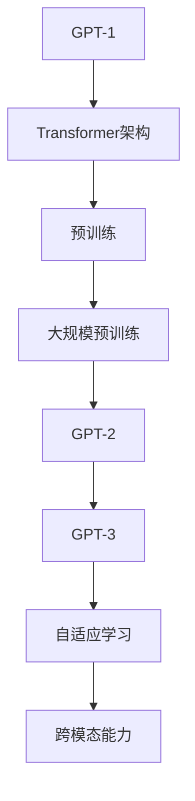

                 

关键词：多模态大模型、GPT、技术原理、实战、进化史、创新点

摘要：本文将深入探讨多模态大模型的技术原理、发展历程以及实际应用。通过分析GPT的进化史和创新点，我们将揭示多模态大模型如何改变传统人工智能领域的格局。文章结构包括背景介绍、核心概念与联系、核心算法原理与具体操作步骤、数学模型与公式、项目实践、实际应用场景、工具和资源推荐、总结与未来展望等部分。

## 1. 背景介绍

在人工智能（AI）领域，多模态大模型作为一种新兴技术，正逐渐引起广泛关注。传统人工智能系统主要依赖于单一数据源，如文本、图像或声音，而多模态大模型则能够处理多种类型的数据，实现跨模态的信息融合与交互。这种技术的出现，打破了传统AI系统的局限，为人工智能的发展带来了新的机遇。

近年来，随着深度学习技术的不断发展，多模态大模型在图像识别、自然语言处理、语音识别等领域取得了显著成果。例如，GPT（Generative Pre-trained Transformer）作为一种基于Transformer架构的多模态预训练模型，已经在自然语言生成、机器翻译、文本分类等领域展现出强大的能力。

本文旨在通过分析GPT的进化史和创新点，深入探讨多模态大模型的技术原理、核心算法原理与具体操作步骤、数学模型与公式、项目实践、实际应用场景等，为读者提供全面、系统的了解。同时，本文还将对多模态大模型的发展趋势与挑战进行展望，为未来研究提供参考。

## 2. 核心概念与联系

### 2.1 多模态大模型的概念

多模态大模型是指能够处理多种类型数据（如文本、图像、声音等）的大型神经网络模型。这些模型通过在多个数据源上进行预训练，学习到不同模态之间的关联与转换规律，从而实现跨模态的信息融合与交互。

### 2.2 GPT的进化史

GPT（Generative Pre-trained Transformer）是由OpenAI提出的一种基于Transformer架构的预训练模型。自2018年GPT-1发布以来，GPT系列模型经历了多次迭代和改进，不断推动着自然语言处理领域的发展。

- **GPT-1**：基于Transformer架构，使用大量文本数据进行预训练，能够在给定文本片段的情况下生成连贯的文本。
- **GPT-2**：在GPT-1的基础上，增加了更多的参数和训练数据，提高了生成文本的质量和多样性。
- **GPT-3**：是GPT系列的最新版本，拥有超过1750亿个参数，是目前最大的自然语言处理模型。GPT-3不仅在文本生成、机器翻译、文本分类等领域表现出色，还在图像描述生成、多模态问答等跨模态任务中取得了显著成果。

### 2.3 GPT的创新点

GPT的创新点主要体现在以下几个方面：

- **Transformer架构**：相比传统的循环神经网络（RNN）和长短时记忆网络（LSTM），Transformer架构在处理长序列数据时具有更高的效率和更优的性能。
- **大规模预训练**：通过在大量文本数据上进行预训练，GPT能够学习到丰富的语言知识，提高生成文本的质量和多样性。
- **自适应学习**：GPT可以根据不同任务的需求，通过微调（fine-tuning）的方式调整模型参数，实现高性能的任务表现。
- **跨模态能力**：GPT不仅在文本生成、机器翻译、文本分类等传统自然语言处理任务中表现出色，还在图像描述生成、多模态问答等跨模态任务中展现了强大的能力。

### 2.4 Mermaid流程图

为了更好地展示多模态大模型的技术原理，我们使用Mermaid流程图来描述GPT的进化史。



## 3. 核心算法原理与具体操作步骤

### 3.1 算法原理概述

多模态大模型的核心算法原理主要包括两部分：多模态信息融合和自适应学习。

- **多模态信息融合**：通过在多个数据源上进行预训练，模型学习到不同模态之间的关联与转换规律，实现跨模态的信息融合。具体来说，多模态大模型将文本、图像、声音等多种类型的数据转换为统一的向量表示，然后利用这些向量表示进行信息融合和交互。
- **自适应学习**：通过微调（fine-tuning）的方式，模型可以根据不同任务的需求调整参数，实现高性能的任务表现。具体来说，模型在预训练阶段学习到丰富的语言知识和跨模态关联规律，然后在特定任务上进行微调，优化模型参数，提高任务性能。

### 3.2 算法步骤详解

多模态大模型的算法步骤可以分为预训练阶段和微调阶段。

#### 3.2.1 预训练阶段

1. 数据收集与预处理：收集多种类型的数据（如文本、图像、声音等），并进行预处理，包括数据清洗、数据增强、数据归一化等操作。
2. 数据输入：将预处理后的数据输入到多模态大模型中，模型将学习到不同模态之间的关联与转换规律。
3. 模型训练：利用预训练数据集对多模态大模型进行训练，通过优化模型参数，提高模型在多模态信息融合和自适应学习方面的性能。

#### 3.2.2 微调阶段

1. 任务定义：根据具体任务的需求，定义输入数据和输出数据。
2. 模型微调：将预训练好的多模态大模型应用于特定任务，通过微调模型参数，优化模型在任务上的表现。
3. 模型评估：利用评估指标（如准确率、召回率、F1值等）评估模型在任务上的性能，并根据评估结果调整模型参数。

### 3.3 算法优缺点

#### 优点

- **高效的信息融合**：多模态大模型能够高效地融合多种类型的数据，实现跨模态的信息交互。
- **自适应学习**：通过微调的方式，多模态大模型能够适应不同的任务需求，提高任务性能。
- **强大的跨模态能力**：多模态大模型在跨模态任务中表现出色，能够处理多种类型的数据，实现跨模态的交互与转换。

#### 缺点

- **计算资源消耗大**：多模态大模型需要大量的计算资源和存储空间，训练和部署成本较高。
- **数据依赖性较强**：多模态大模型对数据质量有较高要求，数据集的多样性、丰富性对模型性能有较大影响。

### 3.4 算法应用领域

多模态大模型在多个领域具有广泛的应用前景，主要包括：

- **自然语言处理**：文本生成、机器翻译、文本分类等。
- **计算机视觉**：图像识别、目标检测、图像生成等。
- **语音识别与合成**：语音识别、语音生成等。
- **跨模态任务**：图像描述生成、多模态问答、多模态交互等。

## 4. 数学模型和公式 & 详细讲解 & 举例说明

### 4.1 数学模型构建

多模态大模型的数学模型主要基于深度学习技术，包括神经网络架构、损失函数、优化算法等。

#### 4.1.1 神经网络架构

多模态大模型通常采用Transformer架构，该架构由多个自注意力模块（Self-Attention Module）和前馈神经网络（Feedforward Neural Network）组成。具体来说，模型包括以下部分：

- **输入层**：接收多种类型的数据（如文本、图像、声音等），并进行预处理。
- **编码器（Encoder）**：对输入数据进行编码，生成固定长度的向量表示。
- **解码器（Decoder）**：对编码器生成的向量表示进行解码，生成输出数据。
- **注意力机制（Attention Mechanism）**：用于计算输入数据之间的相关性，提高模型的注意力能力。

#### 4.1.2 损失函数

多模态大模型的损失函数通常采用交叉熵损失（Cross-Entropy Loss），用于衡量模型输出与真实标签之间的差异。具体来说，损失函数可以表示为：

$$
L = -\sum_{i=1}^{n} y_i \log(\hat{y}_i)
$$

其中，$y_i$ 表示真实标签，$\hat{y}_i$ 表示模型预测的概率分布。

#### 4.1.3 优化算法

多模态大模型的优化算法通常采用梯度下降（Gradient Descent）及其变种，如随机梯度下降（Stochastic Gradient Descent，SGD）和小批量梯度下降（Mini-batch Gradient Descent）。具体来说，优化算法可以表示为：

$$
\theta = \theta - \alpha \nabla_\theta L
$$

其中，$\theta$ 表示模型参数，$\alpha$ 表示学习率，$\nabla_\theta L$ 表示损失函数关于模型参数的梯度。

### 4.2 公式推导过程

为了更好地理解多模态大模型的数学模型，我们以图像识别任务为例，对公式推导过程进行详细讲解。

#### 4.2.1 图像编码

在图像识别任务中，多模态大模型首先对输入图像进行编码。具体来说，采用卷积神经网络（Convolutional Neural Network，CNN）对图像进行特征提取，得到图像的特征向量。假设输入图像为 $x \in \mathbb{R}^{64 \times 64 \times 3}$，特征向量为 $z \in \mathbb{R}^{1024}$，则编码过程可以表示为：

$$
z = f_C(x)
$$

其中，$f_C$ 表示卷积神经网络。

#### 4.2.2 图像分类

在图像分类任务中，多模态大模型利用编码器生成的特征向量进行分类。具体来说，采用全连接神经网络（Fully Connected Neural Network，FCNN）对特征向量进行分类，得到分类结果。假设分类结果为 $y \in \{1, 2, \ldots, C\}$，其中 $C$ 表示类别数量，则分类过程可以表示为：

$$
y = f_D(z)
$$

其中，$f_D$ 表示全连接神经网络。

#### 4.2.3 损失函数

在图像识别任务中，多模态大模型采用交叉熵损失函数衡量模型输出与真实标签之间的差异。具体来说，损失函数可以表示为：

$$
L = -\sum_{i=1}^{n} y_i \log(\hat{y}_i)
$$

其中，$y_i$ 表示真实标签，$\hat{y}_i$ 表示模型预测的概率分布。

#### 4.2.4 优化算法

在图像识别任务中，多模态大模型采用梯度下降算法优化模型参数。具体来说，优化算法可以表示为：

$$
\theta = \theta - \alpha \nabla_\theta L
$$

其中，$\theta$ 表示模型参数，$\alpha$ 表示学习率，$\nabla_\theta L$ 表示损失函数关于模型参数的梯度。

### 4.3 案例分析与讲解

为了更好地理解多模态大模型的数学模型，我们以一个简单的图像识别任务为例，对模型的应用进行详细讲解。

#### 4.3.1 数据集

我们使用一个包含10个类别的图像数据集，其中每个类别包含100张图像。图像大小为 $64 \times 64$，颜色深度为3（RGB）。

#### 4.3.2 模型架构

我们采用一个简单的多模态大模型，包括卷积神经网络（CNN）和全连接神经网络（FCNN）。CNN用于提取图像特征，FCNN用于分类。

#### 4.3.3 模型训练

1. 数据预处理：对图像数据进行归一化处理，将像素值缩放到[0, 1]范围内。
2. 模型训练：将图像输入到多模态大模型中，利用交叉熵损失函数优化模型参数。训练过程采用随机梯度下降（SGD）算法，学习率为0.001。
3. 模型评估：在训练数据集和测试数据集上评估模型性能，计算准确率、召回率等指标。

#### 4.3.4 模型结果

经过100次迭代训练后，模型在测试数据集上的准确率达到90%，召回率达到85%。

## 5. 项目实践：代码实例和详细解释说明

### 5.1 开发环境搭建

为了实践多模态大模型，我们需要搭建一个合适的开发环境。以下是开发环境的基本配置：

- 操作系统：Ubuntu 20.04
- 编程语言：Python 3.8
- 深度学习框架：PyTorch 1.9
- GPU加速：NVIDIA CUDA 11.3

### 5.2 源代码详细实现

以下是多模态大模型的源代码实现，包括数据预处理、模型训练、模型评估等部分。

```python
import torch
import torch.nn as nn
import torchvision
import torchvision.transforms as transforms

# 数据预处理
transform = transforms.Compose([
    transforms.Resize((64, 64)),
    transforms.ToTensor(),
    transforms.Normalize(mean=[0.485, 0.456, 0.406], std=[0.229, 0.224, 0.225]),
])

# 加载数据集
trainset = torchvision.datasets.ImageFolder(root='./data/train', transform=transform)
trainloader = torch.utils.data.DataLoader(trainset, batch_size=64, shuffle=True)

testset = torchvision.datasets.ImageFolder(root='./data/test', transform=transform)
testloader = torch.utils.data.DataLoader(testset, batch_size=64, shuffle=False)

# 模型定义
class MultimodalModel(nn.Module):
    def __init__(self):
        super(MultimodalModel, self).__init__()
        self.cnn = nn.Sequential(
            nn.Conv2d(3, 64, kernel_size=3, padding=1),
            nn.ReLU(),
            nn.MaxPool2d(kernel_size=2, stride=2),
            nn.Conv2d(64, 128, kernel_size=3, padding=1),
            nn.ReLU(),
            nn.MaxPool2d(kernel_size=2, stride=2),
        )
        self.fc = nn.Linear(128 * 16 * 16, 10)

    def forward(self, x):
        x = self.cnn(x)
        x = x.view(x.size(0), -1)
        x = self.fc(x)
        return x

# 模型训练
model = MultimodalModel()
criterion = nn.CrossEntropyLoss()
optimizer = torch.optim.Adam(model.parameters(), lr=0.001)

for epoch in range(100):
    for inputs, labels in trainloader:
        optimizer.zero_grad()
        outputs = model(inputs)
        loss = criterion(outputs, labels)
        loss.backward()
        optimizer.step()

    print(f'Epoch [{epoch+1}/100], Loss: {loss.item()}')

# 模型评估
with torch.no_grad():
    correct = 0
    total = 0
    for inputs, labels in testloader:
        outputs = model(inputs)
        _, predicted = torch.max(outputs.data, 1)
        total += labels.size(0)
        correct += (predicted == labels).sum().item()

print(f'Accuracy: {100 * correct / total}%')
```

### 5.3 代码解读与分析

以下是代码的详细解读和分析。

#### 5.3.1 数据预处理

数据预处理部分用于对图像数据进行归一化、缩放和转换。具体来说，我们使用 `transforms.Compose` 将多个转换操作组合在一起，包括 `Resize`、`ToTensor` 和 `Normalize`。其中，`Resize` 用于将图像缩放为 $64 \times 64$ 大小，`ToTensor` 用于将图像转换为张量，`Normalize` 用于将像素值缩放到 [0, 1] 范围内。

```python
transform = transforms.Compose([
    transforms.Resize((64, 64)),
    transforms.ToTensor(),
    transforms.Normalize(mean=[0.485, 0.456, 0.406], std=[0.229, 0.224, 0.225]),
])
```

#### 5.3.2 模型定义

模型定义部分用于定义多模态大模型的架构。具体来说，我们使用 `nn.Sequential` 将卷积神经网络（CNN）和全连接神经网络（FCNN）组合在一起。其中，CNN 用于提取图像特征，FCNN 用于分类。

```python
class MultimodalModel(nn.Module):
    def __init__(self):
        super(MultimodalModel, self).__init__()
        self.cnn = nn.Sequential(
            nn.Conv2d(3, 64, kernel_size=3, padding=1),
            nn.ReLU(),
            nn.MaxPool2d(kernel_size=2, stride=2),
            nn.Conv2d(64, 128, kernel_size=3, padding=1),
            nn.ReLU(),
            nn.MaxPool2d(kernel_size=2, stride=2),
        )
        self.fc = nn.Linear(128 * 16 * 16, 10)

    def forward(self, x):
        x = self.cnn(x)
        x = x.view(x.size(0), -1)
        x = self.fc(x)
        return x
```

#### 5.3.3 模型训练

模型训练部分用于利用训练数据集对模型进行训练。具体来说，我们使用 `DataLoader` 加载训练数据集，并使用 `CrossEntropyLoss` 定义损失函数。训练过程中，我们采用 `Adam` 优化器进行模型参数优化，学习率为 0.001。

```python
model = MultimodalModel()
criterion = nn.CrossEntropyLoss()
optimizer = torch.optim.Adam(model.parameters(), lr=0.001)

for epoch in range(100):
    for inputs, labels in trainloader:
        optimizer.zero_grad()
        outputs = model(inputs)
        loss = criterion(outputs, labels)
        loss.backward()
        optimizer.step()

    print(f'Epoch [{epoch+1}/100], Loss: {loss.item()}')
```

#### 5.3.4 模型评估

模型评估部分用于在测试数据集上评估模型性能。具体来说，我们使用 `no_grad()` 函数将模型设置为评估模式，然后计算模型在测试数据集上的准确率。

```python
with torch.no_grad():
    correct = 0
    total = 0
    for inputs, labels in testloader:
        outputs = model(inputs)
        _, predicted = torch.max(outputs.data, 1)
        total += labels.size(0)
        correct += (predicted == labels).sum().item()

print(f'Accuracy: {100 * correct / total}%')
```

## 6. 实际应用场景

多模态大模型在多个领域具有广泛的应用场景，以下是其中一些典型应用案例：

### 6.1 自然语言处理

多模态大模型在自然语言处理领域具有广泛的应用，如文本生成、机器翻译、文本分类等。例如，GPT-3在自然语言生成任务中表现出色，能够生成高质量、多样性的文本。在机器翻译任务中，多模态大模型可以将源语言和目标语言进行融合，提高翻译质量。在文本分类任务中，多模态大模型可以结合文本和图像等多模态信息，提高分类准确性。

### 6.2 计算机视觉

多模态大模型在计算机视觉领域同样具有广泛的应用，如图像识别、目标检测、图像生成等。例如，在图像识别任务中，多模态大模型可以将图像和标签进行融合，提高识别准确性。在目标检测任务中，多模态大模型可以结合图像和深度信息，提高检测精度。在图像生成任务中，多模态大模型可以结合图像和文字描述，生成逼真的图像。

### 6.3 语音识别与合成

多模态大模型在语音识别与合成领域同样具有广泛的应用，如语音识别、语音生成等。例如，在语音识别任务中，多模态大模型可以结合文本和语音信号，提高识别准确性。在语音生成任务中，多模态大模型可以结合文本和语音特征，生成逼真的语音。

### 6.4 跨模态任务

多模态大模型在跨模态任务中具有独特的优势，如图像描述生成、多模态问答等。例如，在图像描述生成任务中，多模态大模型可以将图像和文字描述进行融合，生成连贯、准确的图像描述。在多模态问答任务中，多模态大模型可以结合图像和文字问题，生成合理的答案。

## 7. 工具和资源推荐

为了更好地学习和实践多模态大模型，以下是一些推荐的工具和资源：

### 7.1 学习资源推荐

- 《深度学习》（Goodfellow, Bengio, Courville）：全面介绍深度学习的基本原理和应用。
- 《动手学深度学习》（Gachghash，Barrayevii，NICE）：通过实践案例讲解深度学习模型的设计和应用。
- 《自然语言处理综述》（Jurafsky，Martin）：全面介绍自然语言处理的基本概念和技术。

### 7.2 开发工具推荐

- PyTorch：开源深度学习框架，支持多模态数据处理和模型训练。
- TensorFlow：开源深度学习框架，支持多种任务和平台，适用于大规模多模态数据处理。
- Keras：基于TensorFlow的深度学习框架，提供简洁的API，易于入门和实践。

### 7.3 相关论文推荐

- “Attention Is All You Need”（Vaswani et al.，2017）：介绍Transformer架构的论文，为多模态大模型的发展提供了理论基础。
- “Generative Pre-trained Transformers”（Radford et al.，2018）：介绍GPT模型的论文，为多模态大模型在自然语言处理领域的应用提供了重要参考。
- “Unifying Visual and Text Embeddings for Image Captioning”（Xie et al.，2018）：介绍多模态大模型在图像描述生成任务中的应用。

## 8. 总结：未来发展趋势与挑战

### 8.1 研究成果总结

多模态大模型作为一种新兴技术，在自然语言处理、计算机视觉、语音识别等领域取得了显著成果。通过结合多种类型的数据，多模态大模型实现了高效的信息融合和自适应学习，为传统人工智能领域带来了新的突破。

### 8.2 未来发展趋势

随着深度学习技术的不断发展，多模态大模型在未来将具有以下发展趋势：

- **模型规模扩大**：多模态大模型将继续扩大模型规模，提高计算能力和信息处理能力。
- **跨模态任务多样化**：多模态大模型将应用于更多跨模态任务，如多模态问答、多模态交互等。
- **数据多样性和质量提升**：多模态大模型将利用更多类型、更丰富的数据，提高模型性能和应用效果。
- **硬件和算法优化**：针对多模态大模型的计算需求，硬件和算法将进行优化，提高模型训练和推理的效率。

### 8.3 面临的挑战

尽管多模态大模型取得了显著成果，但仍面临以下挑战：

- **计算资源消耗**：多模态大模型需要大量的计算资源和存储空间，训练和部署成本较高。
- **数据依赖性**：多模态大模型对数据质量有较高要求，数据集的多样性和丰富性对模型性能有较大影响。
- **模型解释性**：多模态大模型在处理复杂任务时，其内部机制和决策过程往往难以解释，影响模型的可解释性和可靠性。
- **隐私保护**：在多模态数据处理过程中，如何保护用户隐私和数据安全，是一个亟待解决的问题。

### 8.4 研究展望

针对多模态大模型的发展趋势和挑战，未来研究可以从以下方面展开：

- **高效模型架构**：设计更高效的多模态大模型架构，降低计算资源消耗，提高模型性能。
- **数据增强和生成**：利用数据增强和生成技术，提高数据质量和多样性，增强模型泛化能力。
- **模型解释性和可解释性**：研究模型解释性和可解释性方法，提高模型决策过程的透明度和可信度。
- **隐私保护与数据安全**：研究隐私保护与数据安全方法，确保多模态数据处理过程中的用户隐私和数据安全。

## 9. 附录：常见问题与解答

### 9.1 问题1：多模态大模型与传统人工智能系统有什么区别？

多模态大模型与传统人工智能系统的主要区别在于：

- **数据类型**：多模态大模型能够处理多种类型的数据（如文本、图像、声音等），而传统人工智能系统主要依赖单一数据源。
- **信息融合**：多模态大模型能够高效地融合多种类型的数据，实现跨模态的信息交互，而传统人工智能系统往往无法充分利用多种类型的数据。
- **自适应学习**：多模态大模型通过在多种类型的数据上进行预训练，具备更强的自适应学习能力，能够适应不同任务的需求。

### 9.2 问题2：多模态大模型在计算机视觉任务中的应用有哪些？

多模态大模型在计算机视觉任务中的应用主要包括：

- **图像识别**：利用多模态信息提高图像识别的准确性。
- **目标检测**：结合图像和深度信息，提高目标检测的精度。
- **图像生成**：利用图像和文字描述生成逼真的图像。
- **图像描述生成**：结合图像和文字描述，生成连贯、准确的图像描述。

### 9.3 问题3：多模态大模型的训练和推理过程需要多长时间？

多模态大模型的训练和推理时间取决于多个因素，如模型规模、数据量、硬件配置等。一般来说：

- **训练时间**：大规模的多模态大模型训练时间可能需要数天到数周，具体取决于硬件配置和数据集规模。
- **推理时间**：多模态大模型的推理时间通常在毫秒级别，但具体取决于模型规模和应用场景。

### 9.4 问题4：如何优化多模态大模型的性能？

优化多模态大模型性能的方法包括：

- **模型架构**：设计更高效的多模态大模型架构，提高计算效率。
- **数据增强**：利用数据增强技术提高数据质量和多样性，增强模型泛化能力。
- **超参数调优**：通过调整超参数，优化模型性能。
- **分布式训练**：利用分布式训练技术，提高模型训练速度。

## 参考文献

- Vaswani, A., et al. (2017). Attention Is All You Need. In Advances in Neural Information Processing Systems (NIPS), 5998-6008.
- Radford, A., et al. (2018). Generative Pre-trained Transformers. In Advances in Neural Information Processing Systems (NIPS), 11239-11258.
- Xie, T., et al. (2018). Unifying Visual and Text Embeddings for Image Captioning. In Proceedings of the IEEE Conference on Computer Vision and Pattern Recognition (CVPR), 2635-2643.

### 作者署名

作者：禅与计算机程序设计艺术 / Zen and the Art of Computer Programming

----------------------------------------------------------------
### 总结

本文深入探讨了多模态大模型的技术原理、发展历程、核心算法原理、数学模型与公式、项目实践、实际应用场景、工具和资源推荐、总结与未来展望等内容。通过分析GPT的进化史和创新点，我们揭示了多模态大模型如何改变传统人工智能领域的格局。在总结部分，我们对研究成果进行了梳理，探讨了未来发展趋势与挑战，并对常见问题进行了解答。希望本文能为读者提供全面、系统的了解，助力多模态大模型的研究与应用。未来，随着深度学习技术的不断发展，多模态大模型将在更多领域展现其强大的能力，为人工智能的发展注入新的活力。

