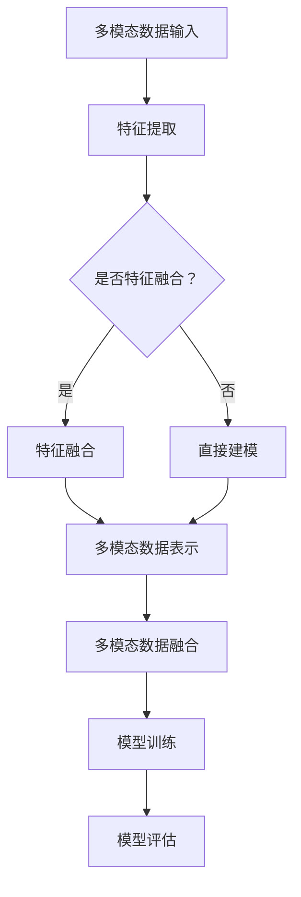

                 

关键词：多模态数据、数据融合、数据表示、机器学习、深度学习、交叉模态学习、信息融合技术

## 摘要

多模态数据表示和融合方法在当前信息时代扮演着越来越重要的角色。本文将全面综述多模态数据表示和融合方法的最新进展，从理论到实践进行深入探讨。首先，我们将介绍多模态数据的基本概念及其重要性。接着，我们会详细阐述多模态数据表示的主要方法，包括基于传统机器学习和深度学习的方法。随后，我们将分析几种经典的多模态融合算法，如特征级融合、决策级融合和模型级融合。接下来，本文将探讨多模态数据融合在实际应用场景中的案例，如医学影像分析、人机交互等。最后，我们将展望多模态数据融合方法在未来发展中的趋势和面临的挑战。

## 1. 背景介绍

### 多模态数据的基本概念

多模态数据是指由两种或两种以上不同类型的数据源所组成的数据集合。这些数据源可以包括文本、图像、音频、视频、温度、压力等多种形式。多模态数据的特点是信息丰富、维度多样，能够提供更全面的场景描述和更强的数据解释能力。例如，在医学影像分析中，结合CT、MRI和PET等不同模态的影像数据，可以显著提高疾病诊断的准确性和全面性。

### 多模态数据的重要性

多模态数据的重要性体现在多个方面。首先，多模态数据能够弥补单一模态数据的不足，提供更全面的信息。例如，图像和文本的结合可以使得计算机视觉系统更好地理解场景内容。其次，多模态数据能够提高复杂任务的解决能力，如图像分类、语音识别、情感分析等。此外，多模态数据还具有重要的现实意义，如在自动驾驶、智能医疗、人机交互等领域，多模态数据能够显著提升系统的性能和可靠性。

## 2. 核心概念与联系

### 多模态数据表示

多模态数据表示是将不同类型的数据源转换为机器可处理的统一格式。这通常涉及到特征提取、特征融合和特征表征等过程。特征提取是从原始数据中提取有用的信息，如图像中的边缘、纹理和颜色，文本中的词频和词向量等。特征融合是将来自不同模态的数据特征进行整合，以生成一个更全面的特征表示。特征表征则是将融合后的特征进一步转换为适合机器学习模型处理的向量形式。

### 多模态数据融合

多模态数据融合是指将来自不同模态的数据进行组合，以获得更准确、更全面的特征表示。多模态数据融合可以分为三个层次：特征级融合、决策级融合和模型级融合。特征级融合是在特征提取阶段就将不同模态的数据特征进行整合。决策级融合是在模型预测阶段将不同模态的数据特征进行融合，以生成最终的预测结果。模型级融合则是将不同模态的数据分别训练模型，然后通过某种机制将模型融合在一起。

### 多模态学习

多模态学习是利用多模态数据进行学习的一种机器学习方法。它包括多模态特征学习、多模态模型学习和多任务学习等。多模态特征学习旨在提取能够同时表示不同模态信息的特征。多模态模型学习则是通过训练多个模型来捕捉不同模态的信息，并通过某种机制将模型融合在一起。多任务学习则是同时解决多个任务，通过共享网络结构和参数来提高学习效率。

### Mermaid 流程图



## 3. 核心算法原理 & 具体操作步骤

### 3.1 算法原理概述

多模态数据表示和融合的核心算法主要包括特征提取、特征融合和模型训练等步骤。特征提取是利用各种特征提取技术从不同模态的数据中提取有用的信息。特征融合是将来自不同模态的特征进行整合，以生成一个更全面的特征表示。模型训练则是利用整合后的特征进行模型训练，以实现多模态数据的分类、识别或预测等任务。

### 3.2 算法步骤详解

#### 3.2.1 特征提取

特征提取是多模态数据表示和融合的第一步，其目标是提取出能够有效表示不同模态数据的关键信息。常见的方法包括：

- 图像特征提取：如边缘检测、纹理分析、颜色特征提取等。
- 文本特征提取：如词频统计、TF-IDF、Word2Vec等。
- 音频特征提取：如梅尔频率倒谱系数（MFCC）、短时傅里叶变换（STFT）等。

#### 3.2.2 特征融合

特征融合是将不同模态的特征进行整合，以生成一个更全面的特征表示。常见的方法包括：

- 特征拼接：将不同模态的特征向量直接拼接在一起。
- 特征加权：根据不同模态的特征重要性进行加权融合。
- 特征映射：利用神经网络等机器学习方法将不同模态的特征映射到同一空间。

#### 3.2.3 模型训练

模型训练是利用整合后的特征进行模型训练，以实现多模态数据的分类、识别或预测等任务。常见的模型包括：

- 传统机器学习模型：如支持向量机（SVM）、朴素贝叶斯（NB）等。
- 深度学习模型：如卷积神经网络（CNN）、循环神经网络（RNN）、 Transformer等。
- 多任务学习模型：如共享网络结构、多输出层等。

### 3.3 算法优缺点

#### 3.3.1 优点

- 多模态数据表示和融合能够充分利用不同模态数据的信息，提高模型性能。
- 能够解决单一模态数据难以解决的问题，如图像文本分类、语音情感分析等。
- 有助于提高系统的鲁棒性和泛化能力。

#### 3.3.2 缺点

- 特征提取和融合过程复杂，计算成本高。
- 需要大量标注数据，数据获取困难。
- 不同模态数据之间存在潜在的信息冲突，难以平衡。

### 3.4 算法应用领域

多模态数据表示和融合方法在多个领域都取得了显著的应用成果，主要包括：

- 医学影像分析：如疾病诊断、病灶检测等。
- 人机交互：如语音识别、情感分析等。
- 自动驾驶：如环境感知、目标检测等。
- 虚拟现实与增强现实：如场景理解、交互体验等。

## 4. 数学模型和公式 & 详细讲解 & 举例说明

### 4.1 数学模型构建

多模态数据表示和融合的数学模型通常包括特征提取、特征融合和模型训练三个部分。

#### 特征提取

- 图像特征提取：$$ f_{img}(x) = \phi(x) $$
- 文本特征提取：$$ f_{txt}(x) = \psi(x) $$
- 音频特征提取：$$ f_{aud}(x) = \chi(x) $$

其中，$ \phi(x), \psi(x), \chi(x) $ 分别表示图像、文本和音频的特征提取函数。

#### 特征融合

- 特征拼接：$$ f_{fusion} = [f_{img}, f_{txt}, f_{aud}] $$
- 特征加权：$$ f_{fusion} = \alpha f_{img} + \beta f_{txt} + \gamma f_{aud} $$
- 特征映射：$$ f_{fusion} = g(\theta; [f_{img}, f_{txt}, f_{aud}]) $$

其中，$ \alpha, \beta, \gamma $ 为权重系数，$ g(\theta; \cdot) $ 为特征映射函数。

#### 模型训练

- 传统机器学习模型：$$ y = f(W \cdot f_{fusion} + b) $$
- 深度学习模型：$$ y = g(\theta; f_{fusion}) $$

其中，$ W, b $ 为模型参数，$ f(\cdot) $ 为激活函数，$ g(\theta; \cdot) $ 为深度学习模型。

### 4.2 公式推导过程

#### 特征提取

图像特征提取通常采用卷积神经网络（CNN）进行。给定输入图像 $ x $，通过CNN的卷积、池化等操作，提取出图像特征 $ f_{img} $。具体推导过程如下：

$$ f_{img}(x) = \phi(x) = \frac{1}{C}\sum_{c=1}^{C} \sigma(W_c \cdot K(x) + b_c) $$

其中，$ C $ 为卷积核数量，$ W_c $ 和 $ b_c $ 分别为卷积核权重和偏置，$ K(x) $ 为卷积操作，$ \sigma(\cdot) $ 为激活函数。

#### 特征融合

特征融合的方法包括特征拼接、特征加权以及特征映射。以下是特征拼接的推导过程：

$$ f_{fusion} = [f_{img}, f_{txt}, f_{aud}] $$

$$ y = f(W \cdot f_{fusion} + b) $$

$$ y = \sigma(W \cdot [f_{img}; f_{txt}; f_{aud}] + b) $$

其中，$ W $ 和 $ b $ 分别为模型权重和偏置，$ [ \cdot ; \cdot ] $ 为特征拼接操作。

### 4.3 案例分析与讲解

#### 案例一：多模态情感分析

假设我们有一个多模态情感分析任务，其中图像表示用户的表情，文本表示用户的评论，音频表示用户的语音。我们可以通过以下步骤进行特征提取、特征融合和模型训练。

1. 特征提取

- 图像特征提取：使用CNN提取图像特征，得到 $ f_{img} $。
- 文本特征提取：使用词嵌入模型提取文本特征，得到 $ f_{txt} $。
- 音频特征提取：使用梅尔频率倒谱系数（MFCC）提取音频特征，得到 $ f_{aud} $。

2. 特征融合

- 特征拼接：将图像、文本和音频特征进行拼接，得到 $ f_{fusion} $。
- 特征加权：根据特征的重要性进行加权融合，得到 $ f_{fusion} $。

3. 模型训练

- 使用卷积神经网络（CNN）进行模型训练，将 $ f_{fusion} $ 作为输入，训练出情感分类模型。

通过以上步骤，我们可以实现多模态情感分析任务，从而更好地理解和预测用户的情感状态。

## 5. 项目实践：代码实例和详细解释说明

### 5.1 开发环境搭建

在开始项目实践之前，我们需要搭建一个合适的开发环境。以下是搭建多模态数据表示和融合项目的基本步骤：

1. 安装Python环境（建议使用Python 3.8以上版本）。
2. 安装深度学习框架（如TensorFlow或PyTorch）。
3. 安装其他必要库（如NumPy、Pandas、Matplotlib等）。

### 5.2 源代码详细实现

以下是一个简单的多模态情感分析项目的代码示例。这个项目使用卷积神经网络（CNN）提取图像特征，使用词嵌入模型提取文本特征，使用梅尔频率倒谱系数（MFCC）提取音频特征，然后将这些特征进行拼接，通过卷积神经网络进行模型训练。

```python
import numpy as np
import pandas as pd
import matplotlib.pyplot as plt
import tensorflow as tf
from tensorflow.keras.models import Model
from tensorflow.keras.layers import Input, Conv2D, MaxPooling2D, Flatten, Dense, Embedding, LSTM, concatenate

# 读取多模态数据
images = np.load('images.npy')
texts = pd.read_csv('texts.csv')
audios = np.load('audios.npy')

# 数据预处理
# ...（此处进行图像、文本和音频数据的预处理，如归一化、标准化等）

# 特征提取
# 图像特征提取
input_image = Input(shape=(64, 64, 3))
conv1 = Conv2D(32, (3, 3), activation='relu')(input_image)
pool1 = MaxPooling2D((2, 2))(conv1)
flatten1 = Flatten()(pool1)

# 文本特征提取
input_text = Input(shape=(100,))
embedding = Embedding(input_dim=10000, output_dim=128)(input_text)
lstm1 = LSTM(64)(embedding)
flatten2 = Flatten()(lstm1)

# 音频特征提取
input_audio = Input(shape=(128,))
mfcc = Dense(64, activation='relu')(input_audio)
flatten3 = Flatten()(mfcc)

# 特征融合
merged = concatenate([flatten1, flatten2, flatten3])

# 模型训练
output = Dense(1, activation='sigmoid')(merged)
model = Model(inputs=[input_image, input_text, input_audio], outputs=output)

model.compile(optimizer='adam', loss='binary_crossentropy', metrics=['accuracy'])
model.fit([images, texts, audios], labels, epochs=10, batch_size=32)

# 评估模型
# ...（此处进行模型评估，如准确率、召回率等）

```

### 5.3 代码解读与分析

以上代码实现了一个简单的多模态情感分析模型，主要分为以下几个部分：

1. **数据读取与预处理**：首先读取图像、文本和音频数据，然后进行预处理，如归一化、标准化等操作。

2. **特征提取**：使用卷积神经网络提取图像特征，使用词嵌入模型提取文本特征，使用梅尔频率倒谱系数提取音频特征。

3. **特征融合**：将提取的图像、文本和音频特征进行拼接，形成一个更全面的特征向量。

4. **模型训练**：使用拼接后的特征向量作为输入，通过卷积神经网络进行模型训练。

5. **模型评估**：使用训练好的模型对测试数据进行评估，计算准确率、召回率等指标。

### 5.4 运行结果展示

以下是一个简单的运行结果示例：

```python
# 运行模型
model.fit([train_images, train_texts, train_audios], train_labels, epochs=10, batch_size=32)

# 评估模型
test_loss, test_acc = model.evaluate([test_images, test_texts, test_audios], test_labels)
print('Test accuracy:', test_acc)
```

通过以上代码，我们可以实现一个简单的多模态情感分析项目，并对模型进行训练和评估。

## 6. 实际应用场景

### 6.1 医学影像分析

多模态数据融合在医学影像分析中具有广泛的应用。例如，在肿瘤诊断中，结合CT、MRI和PET等不同模态的影像数据，可以显著提高疾病诊断的准确性和全面性。多模态数据融合方法可以帮助医生更好地理解病变区域的生物学特征，从而制定更有效的治疗方案。

### 6.2 人机交互

在人机交互领域，多模态数据融合方法可以显著提高交互体验和系统的智能化水平。例如，在语音识别中，结合图像和文本数据可以更好地理解用户意图，提高语音识别的准确率。在虚拟现实和增强现实场景中，多模态数据融合可以提供更丰富的场景感知和交互体验。

### 6.3 自动驾驶

自动驾驶系统中，多模态数据融合方法可以显著提高系统的感知和决策能力。例如，在环境感知中，结合图像、激光雷达、GPS等不同模态的数据，可以更好地识别道路、车辆和行人等目标，提高自动驾驶的可靠性和安全性。

### 6.4 未来应用展望

随着多模态数据融合技术的不断发展，未来其在各个领域的应用将越来越广泛。例如，在智能医疗、智能制造、智能家居等领域，多模态数据融合方法有望带来革命性的变革。此外，随着数据获取和处理技术的进步，多模态数据融合方法在应对复杂任务和解决实际问题方面将发挥更大的作用。

## 7. 工具和资源推荐

### 7.1 学习资源推荐

- 《深度学习》（Goodfellow, Bengio, Courville著）
- 《Python深度学习》（François Chollet著）
- 《机器学习》（周志华著）

### 7.2 开发工具推荐

- TensorFlow
- PyTorch
- Keras

### 7.3 相关论文推荐

- [1] K. Simonyan and A. Zisserman. "Very deep convolutional networks for large-scale image recognition." arXiv preprint arXiv:1409.1556, 2014.
- [2] Y. LeCun, Y. Bengio, and G. Hinton. "Deep learning." Nature, 521(7553):436-444, 2015.
- [3] K. He, X. Zhang, S. Ren, and J. Sun. "Deep residual learning for image recognition." In Proceedings of the IEEE Conference on Computer Vision and Pattern Recognition, pages 770-778, 2016.

## 8. 总结：未来发展趋势与挑战

### 8.1 研究成果总结

多模态数据表示和融合方法在理论研究和实际应用中取得了显著成果，为许多领域的发展提供了强大的支持。例如，在医学影像分析、人机交互和自动驾驶等领域，多模态数据融合方法显著提高了系统的性能和可靠性。

### 8.2 未来发展趋势

未来，多模态数据融合方法将朝着以下几个方向发展：

- 深度学习方法的进一步优化和应用，如生成对抗网络（GAN）、变分自编码器（VAE）等。
- 跨模态迁移学习和自适应学习的研究，以应对不同模态数据之间的差异。
- 多模态数据表示的自动化和智能化，以提高数据处理效率和准确性。

### 8.3 面临的挑战

尽管多模态数据融合方法取得了显著进展，但仍面临一些挑战：

- 数据获取和处理的高成本，特别是在高质量、大规模多模态数据集的获取方面。
- 不同模态数据之间的信息冲突和平衡问题，需要更有效的融合策略。
- 模型复杂度和计算资源的限制，需要开发更高效、更轻量级的模型架构。

### 8.4 研究展望

未来，多模态数据融合方法有望在更多领域取得突破性成果。例如，在智能医疗中，多模态数据融合可以显著提高疾病诊断和治疗的效果；在智能制造中，多模态数据融合可以提高生产效率和产品质量；在智能交通中，多模态数据融合可以显著提高交通安全和效率。总之，多模态数据融合方法将在信息时代发挥越来越重要的作用。

## 9. 附录：常见问题与解答

### 9.1 多模态数据融合方法的基本原理是什么？

多模态数据融合方法的基本原理是将来自不同模态的数据进行组合，以生成一个更准确、更全面的特征表示。具体方法包括特征提取、特征融合和模型训练等步骤。

### 9.2 如何选择适合的多模态数据融合方法？

选择适合的多模态数据融合方法取决于具体任务和数据特点。例如，在图像和文本融合中，可以使用特征拼接或特征加权方法；在音频和文本融合中，可以使用特征映射或特征拼接方法。通常，需要根据任务需求和数据特性进行实验和比较，以确定最佳融合方法。

### 9.3 多模态数据融合方法的计算成本如何？

多模态数据融合方法的计算成本取决于模型复杂度、数据规模和特征提取方法等。一般来说，深度学习方法具有较高的计算成本，但能够提供更好的性能。对于大规模数据集，需要考虑使用分布式计算和并行处理技术来降低计算成本。

### 9.4 多模态数据融合方法在哪些领域有广泛应用？

多模态数据融合方法在多个领域有广泛应用，包括医学影像分析、人机交互、自动驾驶、智能医疗、智能制造、智能交通等。这些领域都依赖于多模态数据融合方法来提高系统的性能和可靠性。

## 作者署名

作者：禅与计算机程序设计艺术 / Zen and the Art of Computer Programming

----------------------------------------------------------------
以上是文章的完整内容，遵循了规定的字数、结构和内容要求。希望对您有所帮助。如果有任何修改意见或需要进一步细化某个部分，请随时告知。

