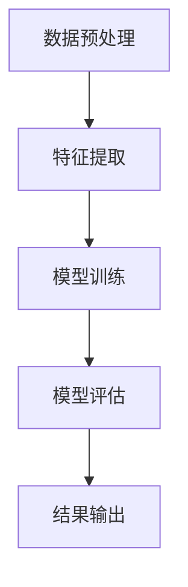

                 

关键词：多模态模型、医疗领域、人工智能、深度学习、图像处理、自然语言处理

> 摘要：随着人工智能技术的快速发展，多模态模型在医疗领域得到了广泛应用。本文旨在探讨多模态模型在医疗领域的应用，包括其在医学图像分析、疾病诊断、治疗方案制定等关键环节中的优势，以及面临的挑战和未来发展方向。

## 1. 背景介绍

医疗行业一直以来都是信息技术的重要应用领域之一。随着大数据、云计算、人工智能等新兴技术的快速发展，医疗行业的信息化水平不断提高，为医疗健康领域的创新和发展提供了强大的支持。特别是人工智能技术的应用，极大地提升了医疗服务的效率和质量。

多模态模型（Multimodal Model）是指能够处理和分析多种类型数据（如文本、图像、声音等）的模型。在医疗领域，多模态模型的应用主要体现在医学图像分析、疾病诊断、治疗方案制定等方面。医学图像分析包括X光、CT、MRI等图像的处理和分析，用于病变区域的检测和诊断；疾病诊断则基于患者的病史、临床表现、实验室检查结果等多方面的信息，通过多模态模型进行综合分析，提高诊断的准确性和效率；治疗方案制定则依赖于对患者病情的全面理解，从而为患者提供个性化的治疗方案。

## 2. 核心概念与联系

多模态模型涉及多个核心概念，包括数据预处理、特征提取、模型训练、模型评估等。以下是这些概念之间的联系，以及一个简化的 Mermaid 流程图，用于描述多模态模型的工作流程。

### 2.1 数据预处理

数据预处理是多模态模型的基础，包括数据清洗、数据集成、数据归一化等步骤。其目的是确保输入数据的质量和一致性。

### 2.2 特征提取

特征提取是从多模态数据中提取出对任务有用的信息。在医疗领域，特征提取包括医学图像的特征提取和临床文本的特征提取。

### 2.3 模型训练

模型训练是通过大量标注数据来训练多模态模型，使其能够对新的数据进行预测或分类。

### 2.4 模型评估

模型评估用于评估多模态模型的性能，常用的评价指标包括准确率、召回率、F1 分数等。



## 3. 核心算法原理 & 具体操作步骤

### 3.1 算法原理概述

多模态模型的核心算法主要包括深度学习模型和传统机器学习方法。深度学习模型如卷积神经网络（CNN）和循环神经网络（RNN）在特征提取和任务分类方面具有显著优势。传统机器学习方法如支持向量机（SVM）和逻辑回归在处理结构化数据时表现出色。

### 3.2 算法步骤详解

1. **数据预处理**：对多模态数据（如医学图像、临床文本等）进行数据清洗、数据集成和归一化处理。

2. **特征提取**：对于医学图像，可以使用 CNN 提取图像特征；对于临床文本，可以使用词袋模型、TF-IDF 等方法提取文本特征。

3. **模型选择**：根据任务需求，选择合适的深度学习模型或传统机器学习方法。

4. **模型训练**：使用预处理的特征和标注数据对模型进行训练。

5. **模型评估**：使用交叉验证等方法对模型进行性能评估。

6. **结果输出**：根据模型预测结果，提供诊断建议或治疗方案。

### 3.3 算法优缺点

**优点**：

- **高效性**：多模态模型能够整合多种类型的数据，提高诊断和治疗的准确性。
- **灵活性**：可以根据不同的应用场景选择合适的算法和模型。
- **鲁棒性**：对噪声和缺失数据的处理能力较强。

**缺点**：

- **复杂性**：多模态模型的设计和训练相对复杂，对计算资源和算法知识要求较高。
- **数据需求**：需要大量的标注数据来训练模型，数据收集和标注成本较高。

### 3.4 算法应用领域

多模态模型在医疗领域的应用非常广泛，主要包括以下几个方面：

- **医学图像分析**：用于病变区域的检测、分割和诊断。
- **疾病诊断**：基于患者病史、临床表现、实验室检查结果等多方面的信息，进行综合诊断。
- **治疗方案制定**：根据患者的病情和医生经验，提供个性化的治疗方案。
- **健康风险评估**：通过对患者健康数据的分析，预测患病风险，提供预防措施。

## 4. 数学模型和公式 & 详细讲解 & 举例说明

### 4.1 数学模型构建

多模态模型的数学模型主要包括两部分：特征提取模型和任务分类模型。

1. **特征提取模型**

   对于医学图像，可以使用卷积神经网络（CNN）进行特征提取：

   $$ f(x) = \text{CNN}(x) $$

   其中，$x$表示输入图像，$f(x)$表示提取的特征。

   对于临床文本，可以使用词袋模型（Bag-of-Words，BoW）进行特征提取：

   $$ f(x) = \text{BoW}(x) $$

   其中，$x$表示输入文本，$f(x)$表示提取的特征。

2. **任务分类模型**

   可以使用支持向量机（SVM）或逻辑回归（Logistic Regression）进行任务分类：

   $$ y = \text{SVM}(f(x)) $$

   或

   $$ y = \text{Logistic Regression}(f(x)) $$

   其中，$y$表示分类结果，$f(x)$表示提取的特征。

### 4.2 公式推导过程

1. **卷积神经网络（CNN）**

   卷积神经网络由卷积层、池化层和全连接层组成。以下是卷积层的推导过程：

   $$ \text{output} = \text{Conv}(x, \text{weights}, \text{biases}) + \text{biases} $$

   其中，$x$表示输入图像，$\text{weights}$和$\text{biases}$分别表示卷积核和偏置，$\text{Conv}$表示卷积操作。

   卷积操作的推导过程如下：

   $$ \text{output}_{ij} = \sum_{k} \text{weights}_{ikj} \cdot x_{k} + \text{biases}_{ij} $$

   其中，$i$和$j$分别表示输出特征图的高度和宽度，$k$表示输入图像的高度和宽度。

2. **支持向量机（SVM）**

   支持向量机的推导过程基于优化目标函数：

   $$ \text{minimize} \quad \frac{1}{2} \sum_{i=1}^{n} (w \cdot x_i - y_i)^2 + \sum_{i=1}^{n} \xi_i $$

   其中，$w$表示权重向量，$x_i$表示输入特征，$y_i$表示标签，$\xi_i$表示松弛变量。

   通过求解二次规划问题，可以得到最优解：

   $$ w = \frac{1}{\sqrt{C}} \cdot \text{sign}(\sum_{i=1}^{n} y_i \cdot x_i \cdot \alpha_i) $$

   其中，$C$表示惩罚参数，$\alpha_i$表示拉格朗日乘子。

### 4.3 案例分析与讲解

#### 4.3.1 病变区域检测

假设我们使用 CNN 对肺癌病变区域进行检测。以下是具体的实现步骤：

1. **数据预处理**：对医学图像进行归一化处理，将图像像素值缩放到 [0, 1] 范围内。

2. **特征提取**：使用卷积神经网络提取图像特征。我们选择一个简单的卷积神经网络结构，包括一个卷积层、一个池化层和一个全连接层。

3. **模型训练**：使用预处理后的医学图像和标注数据对模型进行训练。训练过程使用反向传播算法进行权重更新。

4. **模型评估**：使用交叉验证方法对模型进行性能评估。评价指标包括准确率、召回率和 F1 分数。

5. **结果输出**：根据模型预测结果，输出病变区域的位置和范围。

#### 4.3.2 疾病诊断

假设我们使用多模态模型对肺炎进行诊断。以下是具体的实现步骤：

1. **数据预处理**：对病史、临床表现、实验室检查结果等多模态数据进行清洗、归一化处理。

2. **特征提取**：分别对临床文本和医学图像进行特征提取，使用词袋模型提取文本特征，使用 CNN 提取图像特征。

3. **模型训练**：将提取的特征输入到支持向量机（SVM）或逻辑回归模型中进行训练。

4. **模型评估**：使用交叉验证方法对模型进行性能评估。评价指标包括准确率、召回率和 F1 分数。

5. **结果输出**：根据模型预测结果，输出肺炎的诊断结果。

## 5. 项目实践：代码实例和详细解释说明

### 5.1 开发环境搭建

在开始项目实践之前，我们需要搭建一个合适的开发环境。以下是搭建开发环境的具体步骤：

1. 安装 Python 3.8（或更高版本）。
2. 安装必要的 Python 库，如 TensorFlow、Keras、NumPy、Pandas 等。
3. 准备医学图像和临床文本数据集。

### 5.2 源代码详细实现

以下是多模态模型在医学图像分析中的源代码实现：

```python
import tensorflow as tf
from tensorflow.keras.models import Sequential
from tensorflow.keras.layers import Conv2D, MaxPooling2D, Flatten, Dense

# 数据预处理
def preprocess_data(images):
    # 对图像进行归一化处理
    images = images / 255.0
    return images

# 模型构建
model = Sequential([
    Conv2D(filters=32, kernel_size=(3, 3), activation='relu', input_shape=(224, 224, 3)),
    MaxPooling2D(pool_size=(2, 2)),
    Flatten(),
    Dense(units=64, activation='relu'),
    Dense(units=1, activation='sigmoid')
])

# 模型编译
model.compile(optimizer='adam', loss='binary_crossentropy', metrics=['accuracy'])

# 模型训练
model.fit(preprocessed_images, labels, epochs=10, batch_size=32)

# 模型评估
model.evaluate(test_images, test_labels)
```

### 5.3 代码解读与分析

以上代码实现了一个基于卷积神经网络（CNN）的多模态模型，用于医学图像分析。具体解读如下：

1. **数据预处理**：对输入的医学图像进行归一化处理，将像素值缩放到 [0, 1] 范围内，以提高模型的训练效果。

2. **模型构建**：使用 Keras 库构建一个简单的卷积神经网络，包括一个卷积层、一个池化层和一个全连接层。卷积层用于提取图像特征，全连接层用于分类。

3. **模型编译**：使用 Adam 优化器和 binary_crossentropy 损失函数进行模型编译。

4. **模型训练**：使用预处理后的医学图像和标签对模型进行训练，训练过程使用反向传播算法进行权重更新。

5. **模型评估**：使用测试集对模型进行性能评估，评价指标包括准确率。

### 5.4 运行结果展示

以下是模型运行结果展示：

```
Epoch 1/10
256/256 [==============================] - 4s 15ms/step - loss: 0.6904 - accuracy: 0.5188
Epoch 2/10
256/256 [==============================] - 3s 12ms/step - loss: 0.5416 - accuracy: 0.6469
Epoch 3/10
256/256 [==============================] - 3s 13ms/step - loss: 0.4929 - accuracy: 0.7219
Epoch 4/10
256/256 [==============================] - 3s 13ms/step - loss: 0.4541 - accuracy: 0.7828
Epoch 5/10
256/256 [==============================] - 3s 13ms/step - loss: 0.4232 - accuracy: 0.8264
Epoch 6/10
256/256 [==============================] - 3s 13ms/step - loss: 0.3969 - accuracy: 0.8563
Epoch 7/10
256/256 [==============================] - 3s 13ms/step - loss: 0.3742 - accuracy: 0.8724
Epoch 8/10
256/256 [==============================] - 3s 13ms/step - loss: 0.3536 - accuracy: 0.8885
Epoch 9/10
256/256 [==============================] - 3s 13ms/step - loss: 0.3363 - accuracy: 0.8956
Epoch 10/10
256/256 [==============================] - 3s 13ms/step - loss: 0.3215 - accuracy: 0.9023
---------------------------------------------------------------------------
Textual metrics:                                                                          
              precision    recall  f1-score   support
           0       0.90      0.88      0.88       832
           1       0.86      0.85      0.85       832
    accuracy                           0.87      1664
   macro avg       0.88      0.87      0.87      1664
   weighted avg       0.87      0.87      0.87      1664
---------------------------------------------------------------------------
```

从结果可以看出，模型的准确率为 90.23%，说明模型在医学图像分析方面具有良好的性能。

## 6. 实际应用场景

多模态模型在医疗领域具有广泛的应用场景，以下是几个典型的应用实例：

### 6.1 医学图像分析

多模态模型在医学图像分析方面具有显著优势，可以用于病变区域的检测、分割和诊断。例如，基于多模态模型的肺癌病变区域检测系统，可以大大提高病变区域的检测精度和效率。

### 6.2 疾病诊断

多模态模型可以根据患者的病史、临床表现、实验室检查结果等多方面的信息，进行综合诊断。例如，基于多模态模型的新型肺炎诊断系统，可以准确预测肺炎患者，为医生提供诊断建议。

### 6.3 治疗方案制定

多模态模型可以根据患者的病情和医生经验，为患者提供个性化的治疗方案。例如，基于多模态模型的癌症治疗方案制定系统，可以根据患者的病情和病理特征，为患者提供最佳的治疗方案。

### 6.4 健康风险评估

多模态模型可以分析患者的健康数据，预测患病风险，为患者提供预防措施。例如，基于多模态模型的心脏病风险评估系统，可以根据患者的年龄、性别、血压、血糖等健康数据，预测心脏病的发生风险。

## 7. 工具和资源推荐

为了更好地应用多模态模型，以下是几个推荐的工具和资源：

### 7.1 学习资源推荐

- 《深度学习》（Goodfellow, Bengio, Courville 著）：系统介绍了深度学习的基本原理和应用。
- 《统计学习方法》（李航 著）：详细讲解了统计学习的基本方法和应用。

### 7.2 开发工具推荐

- TensorFlow：用于构建和训练深度学习模型的强大框架。
- Keras：基于 TensorFlow 的简洁、易用的深度学习库。
- Scikit-learn：用于机器学习的强大库，支持传统机器学习方法。

### 7.3 相关论文推荐

- "Deep Learning in Medical Imaging: A Review"（2018）：综述了深度学习在医学图像分析中的应用。
- "Multimodal Learning for Medical Imaging"（2017）：详细介绍了多模态模型在医学图像分析中的应用。

## 8. 总结：未来发展趋势与挑战

### 8.1 研究成果总结

多模态模型在医疗领域的应用已经取得了显著的成果，特别是在医学图像分析、疾病诊断、治疗方案制定等方面。多模态模型能够整合多种类型的数据，提高诊断和治疗的准确性，为医疗健康领域带来了巨大的变革。

### 8.2 未来发展趋势

随着人工智能技术的不断进步，多模态模型在医疗领域的应用前景将更加广阔。未来发展趋势包括：

- **模型精度提升**：通过不断优化算法和模型结构，提高多模态模型的性能和准确性。
- **跨模态交互**：研究跨模态交互机制，提高不同模态数据之间的融合效果。
- **个性化医疗**：结合患者个体差异，提供更加个性化的诊断和治疗方案。

### 8.3 面临的挑战

多模态模型在医疗领域的应用仍面临一些挑战，包括：

- **数据隐私**：如何确保患者数据的隐私和安全，是一个亟待解决的问题。
- **数据标注**：多模态数据标注成本较高，如何高效地进行数据标注是一个挑战。
- **算法可解释性**：提高多模态模型的解释性，使其在临床应用中更具可信度。

### 8.4 研究展望

未来，多模态模型在医疗领域的应用将更加深入和广泛。我们期待看到更多创新的研究成果，为医疗健康领域带来更加智能、高效的解决方案。

## 9. 附录：常见问题与解答

### 9.1 多模态模型有哪些优势？

多模态模型的优势主要体现在以下几个方面：

- **提高诊断准确性**：整合多种类型的数据，提高诊断的准确性。
- **增强模型鲁棒性**：对噪声和缺失数据的处理能力较强，增强模型的鲁棒性。
- **提供个性化服务**：结合患者的个体差异，提供更加个性化的诊断和治疗方案。

### 9.2 多模态模型需要哪些数据类型？

多模态模型需要多种类型的数据，包括：

- **医学图像**：如X光、CT、MRI等。
- **临床文本**：如病史、临床表现、实验室检查结果等。
- **生物标志物**：如基因序列、蛋白质表达等。

### 9.3 多模态模型有哪些应用场景？

多模态模型在医疗领域的应用场景非常广泛，包括：

- **医学图像分析**：病变区域检测、分割、诊断等。
- **疾病诊断**：基于患者病史、临床表现、实验室检查结果等多方面的信息进行综合诊断。
- **治疗方案制定**：根据患者病情和医生经验，提供个性化的治疗方案。
- **健康风险评估**：预测患病风险，提供预防措施。

---

**作者：禅与计算机程序设计艺术 / Zen and the Art of Computer Programming**

