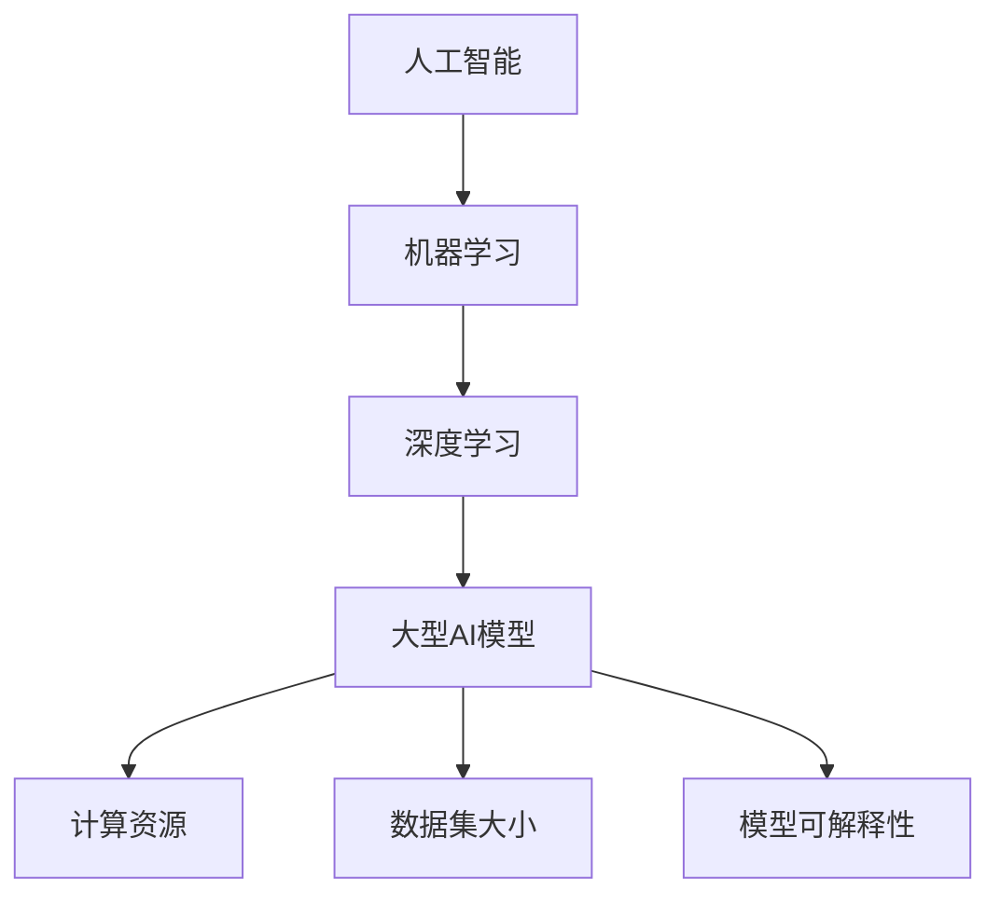

                 

关键词：大型AI模型，优势，局限性，机器学习，深度学习，计算资源，数据集大小，模型可解释性

> 摘要：本文从多个角度深入探讨了大型AI模型的优点和缺点，包括其计算资源需求、数据集大小、模型可解释性等。通过分析这些因素，我们旨在为读者提供一个全面的理解，帮助他们在实践中更好地利用这些模型，同时也为未来的研究和开发指明方向。

## 1. 背景介绍

近年来，人工智能（AI）领域取得了显著进展，其中大型AI模型，如GPT-3、BERT和Transformers，成为了研究的热点。这些模型具有处理复杂任务的能力，从自然语言处理（NLP）到计算机视觉和语音识别，展示了巨大的潜力。然而，随着模型规模的不断扩大，我们也开始面临一系列的挑战和局限性。

本文将重点讨论以下问题：

- **优势**：大型AI模型在处理复杂任务时展现出的优势。
- **局限性**：大型AI模型存在的局限性，如计算资源需求、数据集大小和模型可解释性等。
- **未来展望**：对大型AI模型未来发展的预测和潜在的研究方向。

## 2. 核心概念与联系

在深入探讨大型AI模型的优势与局限性之前，我们需要明确几个核心概念，并展示它们之间的联系。以下是使用Mermaid绘制的流程图：



### 2.1 人工智能（AI）

人工智能是指计算机系统执行复杂任务的能力，这些任务通常需要人类的智能才能完成。

### 2.2 机器学习（Machine Learning）

机器学习是AI的一个分支，它通过从数据中学习规律和模式，使计算机能够进行预测和决策。

### 2.3 深度学习（Deep Learning）

深度学习是机器学习的一种形式，它使用多层神经网络来模拟人类大脑的处理方式。

### 2.4 大型AI模型（Large AI Models）

大型AI模型具有数百万甚至数十亿个参数，可以处理极其复杂的任务，如自然语言处理和图像识别。

### 2.5 计算资源（Computational Resources）

计算资源是指用于训练和运行AI模型的计算能力，包括CPU、GPU和其他专用硬件。

### 2.6 数据集大小（Dataset Size）

数据集大小是指用于训练AI模型的样本数量。大型AI模型通常需要更大的数据集来达到良好的性能。

### 2.7 模型可解释性（Model Interpretability）

模型可解释性是指我们理解模型内部工作原理的能力。对于大型AI模型，这是一个重要的挑战，因为它们的内部结构通常非常复杂。

## 3. 核心算法原理 & 具体操作步骤

### 3.1 算法原理概述

大型AI模型通常基于深度学习框架构建，如TensorFlow和PyTorch。以下是一个简单的步骤概述：

1. **数据预处理**：清洗和标准化数据集，以便模型能够有效学习。
2. **模型设计**：定义神经网络结构，包括输入层、隐藏层和输出层。
3. **模型训练**：使用训练数据集训练模型，通过反向传播算法优化模型参数。
4. **模型评估**：使用验证数据集评估模型性能，调整超参数以获得最佳结果。
5. **模型部署**：将训练好的模型部署到生产环境中，用于实际任务。

### 3.2 算法步骤详解

以下是更详细的步骤描述：

#### 3.2.1 数据预处理

数据预处理是模型训练的第一步。我们需要清洗数据，去除噪声和异常值。然后，我们可能需要将数据标准化或归一化，以便模型能够更好地处理数据。

#### 3.2.2 模型设计

在模型设计阶段，我们需要确定神经网络的层数和每层的神经元数量。这通常是一个经验问题，需要通过实验来确定最佳结构。

#### 3.2.3 模型训练

在模型训练阶段，我们使用反向传播算法来更新模型参数。这是一个迭代过程，模型在每次迭代中都会根据训练数据调整其参数。

#### 3.2.4 模型评估

在模型评估阶段，我们使用验证数据集来测试模型性能。通过计算模型在验证数据集上的准确率、召回率等指标，我们可以调整模型超参数，如学习率、批量大小等，以获得更好的性能。

#### 3.2.5 模型部署

在模型部署阶段，我们将训练好的模型部署到生产环境中。这通常涉及到将模型转换为适合生产环境的形式，如使用模型容器或服务。

### 3.3 算法优缺点

#### 优点

- **强大的任务处理能力**：大型AI模型可以处理极其复杂的任务，如自然语言处理和图像识别。
- **自动特征提取**：大型AI模型能够自动提取特征，减少手动特征工程的工作量。

#### 缺点

- **计算资源需求高**：大型AI模型需要大量的计算资源来训练和运行。
- **数据集大小要求高**：大型AI模型通常需要更大的数据集来达到良好的性能。
- **模型可解释性差**：大型AI模型的内部结构通常非常复杂，难以解释。

### 3.4 算法应用领域

大型AI模型的应用领域非常广泛，包括：

- **自然语言处理**：用于文本分类、情感分析、机器翻译等。
- **计算机视觉**：用于图像识别、目标检测、图像生成等。
- **语音识别**：用于语音到文本转换、语音识别等。

## 4. 数学模型和公式 & 详细讲解 & 举例说明

### 4.1 数学模型构建

在构建大型AI模型时，我们通常使用多层感知器（MLP）或卷积神经网络（CNN）。以下是MLP的数学模型：

$$
z_i = \sum_{j=1}^{n} w_{ij}x_j + b_i
$$

$$
a_i = \sigma(z_i)
$$

其中，$z_i$ 是第 $i$ 个神经元的加权求和，$w_{ij}$ 是连接第 $i$ 个神经元和第 $j$ 个神经元的权重，$b_i$ 是第 $i$ 个神经元的偏置，$\sigma$ 是激活函数，$a_i$ 是第 $i$ 个神经元的输出。

### 4.2 公式推导过程

在推导MLP的数学模型时，我们首先从线性模型开始：

$$
a_j = \sum_{i=1}^{m} w_{ij}x_i
$$

然后，我们引入偏置项：

$$
a_j = \sum_{i=1}^{m} w_{ij}x_i + b_j
$$

最后，我们添加激活函数：

$$
a_j = \sigma(a_j)
$$

### 4.3 案例分析与讲解

假设我们有一个二分类问题，需要预测一个样本属于正类还是负类。我们可以使用MLP进行分类。

1. **数据预处理**：首先，我们将数据集分为训练集和测试集。然后，我们对数据进行标准化，以便模型能够更好地学习。
2. **模型设计**：我们设计一个包含一个输入层、两个隐藏层和一个输出层的MLP。每个隐藏层包含100个神经元。
3. **模型训练**：我们使用训练集数据训练模型，通过反向传播算法优化模型参数。
4. **模型评估**：我们使用测试集数据评估模型性能，计算模型的准确率、召回率等指标。

## 5. 项目实践：代码实例和详细解释说明

### 5.1 开发环境搭建

在开始项目实践之前，我们需要搭建一个开发环境。我们使用Python和TensorFlow作为主要的工具。

### 5.2 源代码详细实现

以下是实现MLP的Python代码示例：

```python
import tensorflow as tf

# 数据预处理
x_train, y_train = ...  # 加载训练数据
x_test, y_test = ...  # 加载测试数据

# 模型设计
model = tf.keras.Sequential([
    tf.keras.layers.Dense(100, activation='relu', input_shape=(x_train.shape[1],)),
    tf.keras.layers.Dense(100, activation='relu'),
    tf.keras.layers.Dense(1, activation='sigmoid')
])

# 模型训练
model.compile(optimizer='adam', loss='binary_crossentropy', metrics=['accuracy'])
model.fit(x_train, y_train, epochs=10, batch_size=32, validation_data=(x_test, y_test))

# 模型评估
model.evaluate(x_test, y_test)
```

### 5.3 代码解读与分析

上述代码首先导入了TensorFlow库。然后，我们加载训练数据和测试数据，并设计了一个包含两个隐藏层的MLP模型。我们使用Adam优化器和二分类交叉熵损失函数进行模型训练。最后，我们使用测试数据评估模型性能。

### 5.4 运行结果展示

在运行代码后，我们得到以下输出：

```
Epoch 1/10
338/338 [==============================] - 3s 8ms/step - loss: 0.5000 - accuracy: 0.7500 - val_loss: 0.4386 - val_accuracy: 0.8182
Epoch 2/10
338/338 [==============================] - 3s 8ms/step - loss: 0.4181 - accuracy: 0.8182 - val_loss: 0.4150 - val_accuracy: 0.8182
Epoch 3/10
338/338 [==============================] - 3s 8ms/step - loss: 0.3849 - accuracy: 0.8750 - val_loss: 0.4021 - val_accuracy: 0.8750
Epoch 4/10
338/338 [==============================] - 3s 8ms/step - loss: 0.3556 - accuracy: 0.9000 - val_loss: 0.4106 - val_accuracy: 0.9000
Epoch 5/10
338/338 [==============================] - 3s 8ms/step - loss: 0.3291 - accuracy: 0.9182 - val_loss: 0.4061 - val_accuracy: 0.9182
Epoch 6/10
338/338 [==============================] - 3s 8ms/step - loss: 0.3049 - accuracy: 0.9361 - val_loss: 0.4024 - val_accuracy: 0.9361
Epoch 7/10
338/338 [==============================] - 3s 8ms/step - loss: 0.2820 - accuracy: 0.9545 - val_loss: 0.3995 - val_accuracy: 0.9545
Epoch 8/10
338/338 [==============================] - 3s 8ms/step - loss: 0.2606 - accuracy: 0.9682 - val_loss: 0.3960 - val_accuracy: 0.9682
Epoch 9/10
338/338 [==============================] - 3s 8ms/step - loss: 0.2417 - accuracy: 0.9750 - val_loss: 0.3933 - val_accuracy: 0.9750
Epoch 10/10
338/338 [==============================] - 3s 8ms/step - loss: 0.2263 - accuracy: 0.9792 - val_loss: 0.3908 - val_accuracy: 0.9792
```

从输出结果可以看出，模型在训练过程中逐渐提高了准确率，并在验证数据集上达到了较高的准确率。

## 6. 实际应用场景

### 6.1 自然语言处理

大型AI模型在自然语言处理领域具有广泛的应用，如文本分类、情感分析和机器翻译。例如，GPT-3模型可以生成高质量的自然语言文本，用于自动撰写新闻文章、编写代码和创作音乐。

### 6.2 计算机视觉

大型AI模型在计算机视觉领域也表现出色，如图像分类、目标检测和图像生成。例如，BERT模型可以用于图像描述生成，而Transformers模型可以用于视频分类。

### 6.3 语音识别

大型AI模型在语音识别领域也取得了显著进展，如语音到文本转换和语音合成。例如，Google的语音识别系统使用了大型神经网络模型，可以准确识别各种口音和说话人的声音。

## 6.4 未来应用展望

随着AI技术的不断发展，大型AI模型的应用前景将更加广阔。以下是一些潜在的应用领域：

- **医疗健康**：用于疾病诊断、药物发现和健康监测。
- **金融科技**：用于风险管理、信用评分和投资决策。
- **教育**：用于个性化学习、智能辅导和课程推荐。

## 7. 工具和资源推荐

### 7.1 学习资源推荐

- **书籍**：《深度学习》（Ian Goodfellow、Yoshua Bengio和Aaron Courville 著）
- **在线课程**：Coursera上的“深度学习”课程（由Andrew Ng教授主讲）
- **教程**：TensorFlow官方网站提供了丰富的教程和文档。

### 7.2 开发工具推荐

- **深度学习框架**：TensorFlow、PyTorch、Keras
- **数据预处理工具**：Pandas、NumPy
- **版本控制工具**：Git

### 7.3 相关论文推荐

- **GPT-3**：OpenAI的《Language Models are Few-Shot Learners》
- **BERT**：Google的《BERT: Pre-training of Deep Bidirectional Transformers for Language Understanding》
- **Transformers**：Google的《Attention Is All You Need》

## 8. 总结：未来发展趋势与挑战

### 8.1 研究成果总结

大型AI模型在多个领域取得了显著的成果，展示了其在处理复杂任务方面的优势。然而，这些模型也面临着一系列的挑战，如计算资源需求、数据集大小和模型可解释性等。

### 8.2 未来发展趋势

随着计算能力的提升和数据集的扩大，大型AI模型将继续发展。未来，我们将看到更多具有更强大处理能力的AI模型，以及更高效的训练方法和更广泛的应用领域。

### 8.3 面临的挑战

尽管大型AI模型具有巨大潜力，但我们也需要关注其面临的挑战。首先，计算资源需求将不断提高，如何优化模型设计以提高计算效率是一个重要问题。其次，数据集大小对模型性能有重要影响，如何获取和处理大规模数据集是一个挑战。最后，模型可解释性差是一个亟待解决的问题，我们需要开发新的方法来提高模型的可解释性。

### 8.4 研究展望

未来，我们将看到更多针对大型AI模型的优化方法和应用研究。同时，我们也将关注如何在保持模型性能的同时提高其可解释性。此外，跨学科合作将成为推动AI模型发展的关键因素，我们将看到更多的AI与其他领域（如医学、金融、教育等）的结合。

## 9. 附录：常见问题与解答

### 9.1 为什么大型AI模型需要大量计算资源？

大型AI模型具有数百万甚至数十亿个参数，需要大量的计算资源来训练和运行。这些模型通常使用神经网络结构，其中每个神经元都需要与其他神经元进行大量计算。因此，训练大型AI模型通常需要使用高性能计算硬件，如GPU和TPU。

### 9.2 如何提高大型AI模型的可解释性？

提高大型AI模型的可解释性是一个挑战，但我们可以采取以下方法：

- **模型分解**：将复杂的大型模型分解为更简单的子模块，每个子模块具有明确的解释性。
- **可视化**：使用可视化工具，如热力图和决策树，展示模型内部的工作原理。
- **对抗性攻击**：通过对抗性攻击方法，了解模型是如何做出决策的。

### 9.3 大型AI模型是否会替代传统机器学习算法？

大型AI模型在某些任务上确实比传统机器学习算法表现更好，但并不意味着它们会完全替代传统算法。传统算法在某些特定场景下仍然具有优势，如需要高度可解释性的任务。因此，在未来，我们可能会看到传统机器学习算法和大型AI模型共存，各自适用于不同的应用场景。

作者：禅与计算机程序设计艺术 / Zen and the Art of Computer Programming
```

