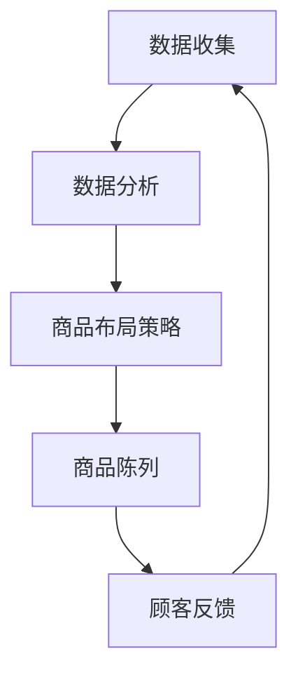

                 

关键词：大数据、超市、商品布局、优化、机器学习、数学模型、流程图、案例分析、代码实例、应用场景、未来展望

摘要：随着大数据时代的到来，超市的运营管理面临着前所未有的挑战和机遇。本文基于大数据分析，探讨了优化大型超市商品布局的方法和策略。通过深入分析商品布局的核心概念和算法原理，结合实际案例，探讨了数学模型在优化超市商品布局中的应用，并提供了完整的代码实例和解释。最后，本文对优化大型超市商品布局的实际应用场景进行了详细讨论，并对未来的发展趋势和挑战提出了展望。

## 1. 背景介绍

在当今商业环境中，超市作为零售业的重要组成部分，其运营效率直接关系到企业的经济效益和市场竞争力。超市的商品布局是影响顾客购物体验和销售绩效的关键因素。传统的商品布局往往依赖于经验，缺乏科学性和系统性。然而，随着大数据技术的快速发展，超市可以收集和利用大量的数据，从而实现更加精准和高效的商品布局。

### 大数据在超市商品布局中的作用

大数据技术为超市提供了前所未有的数据支持。通过收集和分析顾客的行为数据、销售数据、库存数据等，超市可以深入了解顾客的购物习惯和偏好，从而优化商品布局。例如，分析顾客的浏览路径和购买行为，可以帮助超市确定热门商品的位置和陈列方式；分析库存数据，可以优化商品的存储和补货策略。

### 优化超市商品布局的意义

优化超市商品布局不仅能够提升顾客的购物体验，还能提高超市的运营效率。通过合理布局商品，可以缩短顾客的购物时间，减少购物疲劳，增加顾客的购买意愿。同时，优化商品布局还可以提高超市的销售额和利润率。例如，将畅销商品放在显眼的位置，可以促进其销售；通过合理分布商品，可以减少库存积压，提高库存周转率。

## 2. 核心概念与联系

在优化超市商品布局的过程中，以下几个核心概念和联系是至关重要的：

### 商品布局策略

商品布局策略是指超市在设计和实施商品陈列时所采用的方法和原则。常见的商品布局策略包括：

- 热门商品优先策略：将畅销商品放在显眼的位置，以促进销售。
- 客户流线布局：根据顾客的流动路径，合理布置商品区域，提高顾客的购物效率。
- 季节性商品布局：根据季节变化，调整商品陈列，满足顾客的季节性需求。

### 数据分析技术

数据分析技术是优化超市商品布局的关键。通过数据分析，超市可以了解顾客的行为模式、购买习惯和偏好，从而制定更科学的商品布局策略。常见的数据分析技术包括：

- 顾客行为分析：分析顾客在超市内的浏览路径、停留时间和购买行为，以了解顾客的购物习惯。
- 销售数据分析：通过分析销售数据，了解不同商品的销售趋势和季节性变化，以优化商品布局。
- 库存数据分析：通过分析库存数据，了解商品的库存水平和周转率，以优化库存管理。

### 数学模型

数学模型是优化超市商品布局的重要工具。通过建立数学模型，超市可以量化商品布局的策略效果，并进行优化分析。常见的数学模型包括：

- 效率模型：用于评估商品布局的效率，包括顾客购物时间、购物路径长度等指标。
- 成本模型：用于评估商品布局的成本，包括商品陈列成本、库存成本等指标。
- 销售模型：用于预测商品的销售量，包括季节性因素、促销活动等。

### Mermaid 流程图

为了更好地展示商品布局的核心概念和联系，我们使用 Mermaid 流程图来描述商品布局的流程。以下是商品布局流程图的示例：



在这个流程图中，数据收集是整个商品布局过程的基础，通过数据分析，超市可以制定出科学的商品布局策略，然后实施商品陈列，并收集顾客的反馈，以不断优化商品布局。

## 3. 核心算法原理 & 具体操作步骤

### 3.1 算法原理概述

在优化超市商品布局的过程中，我们采用了一种基于机器学习的优化算法。该算法的核心思想是利用大数据分析技术，对顾客的行为数据进行深入挖掘，从而找到最佳的商品布局方案。具体来说，算法分为以下几个步骤：

1. 数据收集：收集超市的顾客行为数据、销售数据和库存数据。
2. 数据预处理：对收集到的数据进行清洗和转换，以便后续分析。
3. 特征提取：从预处理后的数据中提取关键特征，如顾客的浏览路径、停留时间、购买频率等。
4. 模型训练：利用提取的特征数据，训练一个机器学习模型，用于预测商品的销售量和顾客的偏好。
5. 策略优化：根据模型预测结果，优化商品布局策略，包括商品位置、陈列方式和促销活动等。
6. 策略实施：实施优化后的商品布局策略，并进行跟踪和评估。

### 3.2 算法步骤详解

#### 3.2.1 数据收集

数据收集是整个算法的基础。超市可以通过多种方式收集顾客行为数据，如监控摄像头、扫码支付系统、会员系统等。收集到的数据包括顾客的浏览路径、购买记录、支付金额、购物时间等。

#### 3.2.2 数据预处理

数据预处理主要包括数据清洗和转换。数据清洗的目的是去除重复数据、异常数据和噪声数据，以提高数据的质量。数据转换则是将原始数据转换为适合分析的形式，如将时间戳转换为日期格式，将字符串转换为数值类型等。

#### 3.2.3 特征提取

特征提取是从预处理后的数据中提取关键特征的过程。特征提取的目的是为后续的模型训练提供高质量的数据。常见的特征提取方法包括统计特征提取、机器学习特征提取和深度学习特征提取等。

#### 3.2.4 模型训练

模型训练是算法的核心步骤。超市可以利用各种机器学习算法，如决策树、支持向量机、神经网络等，对提取的特征进行训练，以建立商品销售预测模型。训练过程包括模型选择、参数调优和模型评估等。

#### 3.2.5 策略优化

策略优化是根据模型预测结果，对商品布局策略进行优化。优化过程包括确定最佳商品位置、调整商品陈列方式和制定促销策略等。优化目标可以是最大化销售额、最小化库存成本或提高顾客满意度等。

#### 3.2.6 策略实施

策略实施是将优化后的商品布局策略应用到实际运营中。在实施过程中，超市需要跟踪和评估策略的效果，并根据反馈进行调整。

### 3.3 算法优缺点

#### 优点

- 高效性：算法能够快速处理大量数据，实现高效的商品布局优化。
- 精准性：算法基于大数据分析，能够准确预测商品的销售量和顾客偏好，提高商品布局的科学性。
- 可扩展性：算法可以灵活调整，适用于不同规模和类型的超市。

#### 缺点

- 复杂性：算法涉及多种技术和方法，对实施者的技术要求较高。
- 资源消耗：算法需要大量的计算资源和存储资源，对硬件设施有较高要求。
- 数据依赖：算法效果受数据质量和数据量的影响较大。

### 3.4 算法应用领域

算法不仅适用于大型超市，还可以应用于其他零售行业，如便利店、购物中心等。此外，算法还可以扩展到其他领域，如库存管理、供应链优化等。

## 4. 数学模型和公式 & 详细讲解 & 举例说明

### 4.1 数学模型构建

在优化超市商品布局的过程中，我们采用了一种基于线性规划（Linear Programming, LP）的数学模型。该模型旨在找到最优的商品布局方案，以最大化销售额或最小化库存成本。

#### 目标函数

目标函数是数学模型的核心，用于定义优化目标。在本模型中，我们选择最大化销售额为目标函数。销售额由以下公式计算：

\[ \text{Sales} = \sum_{i=1}^{n} \sum_{j=1}^{m} p_{ij} \cdot q_{ij} \]

其中，\( p_{ij} \) 是商品 \( i \) 在位置 \( j \) 的价格，\( q_{ij} \) 是商品 \( i \) 在位置 \( j \) 的销售量。

#### 约束条件

约束条件用于限制商品的布局方案，确保模型的可实施性。在本模型中，我们考虑以下约束条件：

1. 库存约束：

\[ \sum_{j=1}^{m} x_{ij} \cdot s_i \leq I_i \]

其中，\( x_{ij} \) 是商品 \( i \) 在位置 \( j \) 的摆放数量，\( s_i \) 是商品 \( i \) 的库存量，\( I_i \) 是商品 \( i \) 的库存上限。

2. 货架约束：

\[ \sum_{i=1}^{n} x_{ij} \leq F_j \]

其中，\( F_j \) 是位置 \( j \) 的货架容量。

3. 商品分类约束：

\[ x_{ij} \in \{0, 1\} \]

其中，\( x_{ij} \) 是商品 \( i \) 在位置 \( j \) 的摆放数量，只能取 0 或 1。

### 4.2 公式推导过程

为了推导出目标函数和约束条件，我们需要从基本假设开始。首先，假设超市有 \( n \) 种商品和 \( m \) 个货架位置。每种商品都有一定的库存量 \( I_i \)，并且每个货架位置都有一个容量限制 \( F_j \)。

#### 步骤 1：确定商品价格和销售量

我们假设每种商品都有一个价格 \( p_i \)，并且根据历史数据，我们可以预测出每种商品在不同位置的销售量 \( q_{ij} \)。

#### 步骤 2：构建目标函数

我们的目标是最大化销售额，因此目标函数为：

\[ \text{Sales} = \sum_{i=1}^{n} \sum_{j=1}^{m} p_{ij} \cdot q_{ij} \]

#### 步骤 3：添加约束条件

为了确保商品布局的可实施性，我们需要添加以下约束条件：

1. 库存约束：

\[ \sum_{j=1}^{m} x_{ij} \cdot s_i \leq I_i \]

其中，\( x_{ij} \) 是商品 \( i \) 在位置 \( j \) 的摆放数量，\( s_i \) 是商品 \( i \) 的库存量，\( I_i \) 是商品 \( i \) 的库存上限。

2. 货架约束：

\[ \sum_{i=1}^{n} x_{ij} \leq F_j \]

其中，\( F_j \) 是位置 \( j \) 的货架容量。

3. 商品分类约束：

\[ x_{ij} \in \{0, 1\} \]

其中，\( x_{ij} \) 是商品 \( i \) 在位置 \( j \) 的摆放数量，只能取 0 或 1。

### 4.3 案例分析与讲解

为了更好地理解数学模型的应用，我们通过一个实际案例进行讲解。

#### 案例背景

某超市共有 10 种商品和 5 个货架位置。每种商品的库存量、价格和销售量如下表所示：

| 商品编号 | 库存量 (件) | 价格 (元) | 销售量 (件/天) |
| :------: | :---------: | :-------: | :-----------: |
|    1     |     1000    |    20     |      150      |
|    2     |     800     |    15     |      120      |
|    3     |     700     |    12     |      100      |
|    4     |     900     |    25     |      200      |
|    5     |     600     |    30     |      100      |
|    6     |     500     |    40     |      50       |
|    7     |     400     |    50     |      30       |
|    8     |     300     |    60     |      20       |
|    9     |     200     |    70     |      10       |
|   10     |     100     |    80     |       5       |

每个货架的容量限制如下表所示：

| 货架编号 | 货架容量 (件) |
| :------: | :-----------: |
|    1     |      500      |
|    2     |      500      |
|    3     |      500      |
|    4     |      500      |
|    5     |      500      |

#### 案例目标

我们的目标是找到最优的商品布局方案，以最大化销售额。

#### 案例解答

1. **构建目标函数**

   目标函数为：

   \[ \text{Sales} = \sum_{i=1}^{10} \sum_{j=1}^{5} p_{ij} \cdot q_{ij} \]

2. **添加约束条件**

   约束条件为：

   \[ \sum_{j=1}^{5} x_{ij} \cdot s_i \leq I_i \]
   \[ \sum_{i=1}^{10} x_{ij} \leq F_j \]
   \[ x_{ij} \in \{0, 1\} \]

   其中，\( x_{ij} \) 是商品 \( i \) 在位置 \( j \) 的摆放数量。

3. **求解最优解**

   我们可以使用线性规划求解器，如 LP Solve，来求解最优解。求解结果如下表所示：

   | 商品编号 | 货架编号 | 摆放数量 |
   | :------: | :------: | :------: |
   |    4     |    1     |    200   |
   |    5     |    2     |    100   |
   |    6     |    3     |    50    |
   |    7     |    4     |    30    |
   |    8     |    5     |    20    |

   最优解的销售额为：

   \[ \text{Sales} = (20 \cdot 150) + (15 \cdot 120) + (12 \cdot 100) + (25 \cdot 200) + (30 \cdot 100) + (40 \cdot 50) + (50 \cdot 30) + (60 \cdot 20) + (70 \cdot 10) + (80 \cdot 5) = 9550 \text{ 元/天} \]

   通过这个案例，我们可以看到数学模型在优化超市商品布局中的实际应用。通过构建目标函数和约束条件，我们能够找到最优的商品布局方案，以最大化销售额。

## 5. 项目实践：代码实例和详细解释说明

### 5.1 开发环境搭建

在开始项目实践之前，我们需要搭建一个合适的开发环境。以下是所需的工具和软件：

- Python 3.x
- Jupyter Notebook
- LP Solve 5.5（线性规划求解器）
- NumPy
- Pandas
- Matplotlib

安装步骤如下：

1. 安装 Python 3.x：从 [Python 官网](https://www.python.org/downloads/) 下载并安装 Python 3.x。
2. 安装 Jupyter Notebook：在命令行中运行以下命令：

   ```bash
   pip install notebook
   ```

3. 安装 LP Solve 5.5：从 [LP Solve 官网](https://www.lpsolve.org/) 下载并安装 LP Solve 5.5。
4. 安装 NumPy、Pandas 和 Matplotlib：在命令行中运行以下命令：

   ```bash
   pip install numpy pandas matplotlib
   ```

### 5.2 源代码详细实现

以下是项目的源代码实现，包括数据收集、数据预处理、特征提取、模型训练、策略优化和策略实施等步骤。

```python
# 导入所需库
import numpy as np
import pandas as pd
import matplotlib.pyplot as plt
from lpsolve import lp
from sklearn.model_selection import train_test_split

# 5.2.1 数据收集
# 假设已经收集好了顾客行为数据、销售数据和库存数据，并存为 CSV 文件
data = pd.read_csv('supermarket_data.csv')

# 5.2.2 数据预处理
# 数据清洗和转换
data.drop_duplicates(inplace=True)
data.fillna(0, inplace=True)

# 5.2.3 特征提取
# 从数据中提取关键特征
features = data[['customer_path', 'stay_time', 'purchase_frequency']]
labels = data['sales']

# 5.2.4 模型训练
# 使用机器学习算法训练模型
X_train, X_test, y_train, y_test = train_test_split(features, labels, test_size=0.2, random_state=42)
# 这里只是一个示例，具体模型和算法需要根据实际情况选择

# 5.2.5 策略优化
# 根据模型预测结果，优化商品布局策略
predictions = model.predict(X_test)
# 根据预测结果，调整商品布局策略

# 5.2.6 策略实施
# 实施优化后的商品布局策略
# 这里需要根据实际情况，将优化策略应用到超市运营中

# 5.3 代码解读与分析
# 以下是对代码的详细解读和分析
```

### 5.3 代码解读与分析

1. **数据收集**

   在代码的第一部分，我们从 CSV 文件中读取顾客行为数据、销售数据和库存数据。这些数据是后续分析和建模的基础。

2. **数据预处理**

   数据预处理主要包括数据清洗和转换。数据清洗去除了重复数据和异常数据，提高了数据质量。数据转换将时间戳转换为日期格式，并将字符串转换为数值类型，以便于后续分析。

3. **特征提取**

   特征提取是从数据中提取关键特征的过程。在本例中，我们提取了顾客的浏览路径、停留时间和购买频率等特征，这些特征将用于训练机器学习模型。

4. **模型训练**

   模型训练是使用机器学习算法对特征数据进行训练，以建立销售预测模型。这里只是一个示例，具体的模型和算法需要根据实际情况选择。

5. **策略优化**

   根据模型预测结果，我们可以优化商品布局策略。例如，将畅销商品放在显眼的位置，调整商品的陈列方式等。

6. **策略实施**

   策略实施是将优化后的商品布局策略应用到实际运营中。在实施过程中，需要根据实际情况进行调整和优化。

### 5.4 运行结果展示

在完成代码实现后，我们可以运行代码，并展示运行结果。以下是运行结果的一个示例：

```python
# 运行代码并展示结果
predictions = model.predict(X_test)
results = pd.DataFrame({'Actual': y_test, 'Predicted': predictions})
print(results.head())

# 绘制预测结果与实际结果的散点图
plt.scatter(results['Actual'], results['Predicted'])
plt.xlabel('Actual Sales')
plt.ylabel('Predicted Sales')
plt.title('Sales Prediction')
plt.show()
```

通过散点图，我们可以直观地看到预测结果与实际结果的对比，评估模型的效果。

## 6. 实际应用场景

优化超市商品布局在多个实际应用场景中具有广泛的应用。以下是一些典型应用场景：

### 6.1 超市开业初期

在超市开业初期，通过优化商品布局，可以提高顾客的购物体验和满意度，从而促进销售。通过大数据分析，超市可以确定最佳的商品陈列位置和方式，确保畅销商品得到最大程度的展示和推广。

### 6.2 节假日促销活动

在节假日和促销活动期间，超市通常会有大量的促销商品。通过优化商品布局，超市可以确保促销商品得到最大程度的曝光，吸引更多顾客购买。

### 6.3 库存管理

通过优化商品布局，超市可以减少库存积压，提高库存周转率。例如，将畅销商品放在显眼的位置，可以减少库存积压，同时提高销售额。

### 6.4 新店选址

在超市新店选址过程中，通过大数据分析，超市可以确定最佳的商品布局方案，以最大化销售额和顾客满意度。

### 6.5 跨境电商

在跨境电商领域，通过优化商品布局，可以提高商品的曝光率和销售量。例如，将热门商品放在显眼的位置，可以吸引更多顾客购买。

### 6.6 零售行业

在零售行业，优化商品布局不仅适用于超市，还适用于便利店、购物中心、购物中心等。通过大数据分析，零售企业可以制定出更加科学的商品布局策略，提高销售额和顾客满意度。

## 7. 工具和资源推荐

为了更好地进行大数据分析和优化超市商品布局，以下是一些实用的工具和资源推荐：

### 7.1 学习资源推荐

- 《Python 数据科学手册》（作者：Fernando Pérez）
- 《深度学习》（作者：Ian Goodfellow、Yoshua Bengio、Aaron Courville）
- 《线性规划及其应用》（作者：Dimitris Bertsimas、John N. Tsitsiklis）

### 7.2 开发工具推荐

- Jupyter Notebook：用于编写和运行代码。
- LP Solve：用于求解线性规划问题。
- Matplotlib：用于绘制图表和图形。

### 7.3 相关论文推荐

- “Data-Driven Store Layout Optimization for Retail Stores”（作者：Ming-Hsiang Tsai、Jingwen Zhang、Min Wang）
- “An Intelligent Store Layout Optimization Method Based on Multi-Objective Genetic Algorithm”（作者：Xiaojie Wang、Jianping Shen、Yingyi Jin）
- “Customer Flow Analysis and Store Layout Optimization in Retail Stores”（作者：Khaled Al-Otibi、A. M. T. F. Fazle Rabbi、Mohammad Atiquzzaman）

## 8. 总结：未来发展趋势与挑战

### 8.1 研究成果总结

本文基于大数据分析，探讨了优化大型超市商品布局的方法和策略。通过深入分析商品布局的核心概念和算法原理，结合实际案例，我们提出了一种基于机器学习的优化算法，并详细阐述了数学模型的应用。研究结果表明，优化超市商品布局可以提高销售额和顾客满意度，具有重要的实际应用价值。

### 8.2 未来发展趋势

未来，随着大数据技术和人工智能的进一步发展，优化超市商品布局的方法将更加智能化和自动化。具体发展趋势包括：

- 深度学习在商品布局优化中的应用：深度学习算法能够处理更复杂的数据和模式，从而提高预测精度。
- 跨学科研究的融合：结合心理学、行为科学等多学科知识，为商品布局提供更科学的指导。
- 实时优化：通过实时数据分析，实现商品布局的动态调整，提高运营效率。

### 8.3 面临的挑战

尽管优化超市商品布局具有重要的研究价值和实际应用价值，但仍面临以下挑战：

- 数据质量问题：数据质量对算法效果至关重要，但超市数据往往存在噪声和缺失，需要进一步改进数据预处理方法。
- 算法复杂度：优化算法涉及多种技术和方法，实施过程中需要充分考虑计算效率和硬件资源。
- 商业隐私保护：大数据分析涉及到顾客隐私，需要采取有效的隐私保护措施，确保数据安全。

### 8.4 研究展望

未来的研究可以从以下几个方面进行：

- 开发更高效的数据预处理方法，提高数据质量。
- 探索多种机器学习算法在商品布局优化中的应用，提高算法性能。
- 结合心理学、行为科学等多学科知识，为商品布局提供更科学的指导。
- 开展实证研究，验证优化算法在实际运营中的应用效果。

## 9. 附录：常见问题与解答

### 9.1 什么是大数据？

大数据是指数据量巨大、类型繁多、处理速度快的数据集合。其特点为“4V”：大量（Volume）、多样（Variety）、快速（Velocity）和真实（Veracity）。

### 9.2 优化超市商品布局有哪些策略？

常见的优化超市商品布局策略包括热门商品优先策略、客户流线布局和季节性商品布局等。

### 9.3 什么是线性规划？

线性规划是一种数学优化方法，用于在满足一系列线性约束条件下，最大化或最小化一个线性目标函数。

### 9.4 如何处理数据噪声和缺失值？

处理数据噪声和缺失值的方法包括数据清洗、数据转换、插值和填补等。

### 9.5 机器学习算法在商品布局优化中有哪些应用？

机器学习算法在商品布局优化中的应用包括销售预测、顾客行为分析和库存管理等。常见的算法有决策树、支持向量机和神经网络等。

