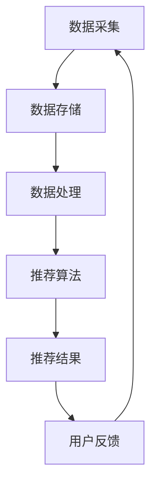

                 

关键词：大数据，人工智能，电商搜索推荐系统，准确率，用户体验，算法优化，数学模型，项目实践，应用场景，未来展望。

## 摘要

本文旨在探讨大数据与人工智能（AI）相结合，如何为电商搜索推荐系统提供高效且准确的推荐服务，从而提升用户购物体验。文章首先介绍了电商搜索推荐系统的背景和重要性，随后详细分析了大数据和AI在系统架构中的核心作用。接着，文章深入探讨了推荐算法的原理、优缺点以及应用领域，并通过数学模型和公式给出了具体的算法推导过程和案例分析。此外，文章还提供了一个实际的代码实例，展示了推荐系统的实现过程。最后，文章讨论了推荐系统的实际应用场景和未来展望，总结了研究成果，并提出了未来发展中的挑战和研究方向。

## 1. 背景介绍

随着互联网的飞速发展和电子商务的日益普及，用户对电商平台的搜索和推荐系统提出了越来越高的要求。传统的电商搜索系统主要依赖于关键词匹配和简单的排序算法，往往难以满足用户多样化的购物需求，导致用户满意度较低。为了提高搜索推荐系统的准确率和用户体验，越来越多的电商平台开始将大数据和人工智能技术应用于搜索推荐系统中。

大数据技术为电商搜索推荐系统提供了强大的数据支持。电商平台积累了大量的用户行为数据、商品数据和市场数据，通过大数据处理技术，可以对这些数据进行深入挖掘和分析，发现用户偏好和潜在需求，从而为用户提供更加精准的推荐服务。

人工智能技术则为电商搜索推荐系统提供了智能化的决策支持。通过机器学习和深度学习算法，系统可以自动识别和预测用户的行为模式，优化推荐策略，提高推荐效果。AI技术的应用不仅提高了推荐的准确率，还丰富了推荐系统的功能，如个性化推荐、智能筛选等，进一步提升了用户体验。

## 2. 核心概念与联系

### 2.1 大数据技术

大数据技术包括数据采集、存储、处理和分析等环节。在电商搜索推荐系统中，数据采集主要涉及用户行为数据、商品数据和市场数据等。数据存储通常采用分布式存储技术，如Hadoop、Spark等，以保证数据的高效存储和管理。数据处理和分析则依赖于大数据处理框架，通过分布式计算和并行处理技术，可以快速挖掘和分析海量数据，提取有用的信息。

### 2.2 人工智能技术

人工智能技术主要应用于推荐算法的设计和优化。在电商搜索推荐系统中，常见的AI技术包括机器学习、深度学习和自然语言处理等。机器学习算法通过训练模型，从大量历史数据中学习用户偏好和商品属性，从而生成推荐列表。深度学习算法则通过多层神经网络结构，实现对复杂数据的自动特征提取和模式识别。自然语言处理技术则用于处理用户查询和商品描述，实现语义理解和智能问答等功能。

### 2.3 系统架构

电商搜索推荐系统的架构通常包括数据层、服务层和展示层三个部分。数据层负责数据的采集、存储和处理；服务层提供推荐算法和数据处理服务；展示层则负责将推荐结果展示给用户。大数据技术和人工智能技术在系统架构中起到关键作用，通过数据层和服务层的协同工作，可以实现高效的推荐服务。

## 2.4 Mermaid 流程图



## 3. 核心算法原理 & 具体操作步骤

### 3.1 算法原理概述

电商搜索推荐系统的核心算法主要包括基于协同过滤、基于内容过滤和基于模型的推荐算法。协同过滤算法通过分析用户行为和偏好，找到相似的用户或商品，为用户提供推荐。基于内容过滤算法则通过分析商品特征和用户兴趣，为用户推荐与其兴趣相关的商品。基于模型的推荐算法则通过构建用户和商品之间的数学模型，预测用户对商品的偏好，生成推荐列表。

### 3.2 算法步骤详解

1. **协同过滤算法**：

   - 数据预处理：将用户行为数据转换为用户-商品评分矩阵。
   - 计算用户相似度：使用余弦相似度或皮尔逊相关系数计算用户之间的相似度。
   - 构建推荐列表：为每个用户找到最相似的K个用户，并根据相似度计算每个用户对未知商品的评分，生成推荐列表。

2. **基于内容过滤算法**：

   - 提取商品特征：使用词袋模型或TF-IDF算法提取商品描述的关键词。
   - 计算用户兴趣：计算用户浏览或购买过的商品的特征向量。
   - 生成推荐列表：根据用户兴趣和商品特征向量，计算用户可能感兴趣的商品，生成推荐列表。

3. **基于模型的推荐算法**：

   - 构建数学模型：使用回归模型或神经网络模型，建立用户和商品之间的关联关系。
   - 训练模型：使用历史用户行为数据训练模型。
   - 预测用户偏好：使用训练好的模型预测用户对未知商品的偏好，生成推荐列表。

### 3.3 算法优缺点

- **协同过滤算法**：

  - 优点：推荐结果准确，能够发现用户的潜在偏好。
  - 缺点：推荐结果可能受到数据稀疏性和冷启动问题的影响。

- **基于内容过滤算法**：

  - 优点：推荐结果相关性高，能够为用户提供感兴趣的商品。
  - 缺点：推荐结果可能过于单一，无法满足用户的多样化需求。

- **基于模型的推荐算法**：

  - 优点：能够自动学习用户偏好，适应性强。
  - 缺点：模型复杂度较高，计算开销较大。

### 3.4 算法应用领域

- **电商平台**：为用户提供个性化推荐，提高用户满意度。
- **社交媒体**：为用户提供相关内容推荐，增加用户活跃度。
- **在线教育**：为学习者推荐合适的学习资源和课程。

## 4. 数学模型和公式 & 详细讲解 & 举例说明

### 4.1 数学模型构建

在电商搜索推荐系统中，常用的数学模型包括协同过滤模型、基于内容过滤模型和基于模型的推荐模型。

#### 4.1.1 协同过滤模型

协同过滤模型基于用户-商品评分矩阵 \( R \)，计算用户 \( u \) 和商品 \( i \) 之间的相似度 \( s_{ui} \)：

\[ s_{ui} = \frac{R_{ui} - \mu_u - \mu_i + \rho_{ui}}{\sqrt{\sum_{j\in S_u}(R_{uj} - \mu_j)^2 \sum_{k\in S_i}(R_{ki} - \mu_k)^2}} \]

其中，\( \mu_u \) 和 \( \mu_i \) 分别表示用户 \( u \) 和商品 \( i \) 的平均值，\( \rho_{ui} \) 表示用户 \( u \) 和商品 \( i \) 的交互强度。

#### 4.1.2 基于内容过滤模型

基于内容过滤模型使用词袋模型或TF-IDF算法提取商品特征，建立用户和商品之间的相似度 \( s_{ui} \)：

\[ s_{ui} = \frac{\sum_{w\in V} w \cdot R_{wui}}{\sqrt{\sum_{w\in V} w^2 \cdot R_{wui}^2}} \]

其中，\( V \) 表示词汇表，\( w \) 表示词汇，\( R_{wui} \) 表示用户 \( u \) 对商品 \( i \) 中词汇 \( w \) 的权重。

#### 4.1.3 基于模型的推荐模型

基于模型的推荐模型使用回归模型或神经网络模型建立用户和商品之间的关联关系。以线性回归模型为例，模型预测用户 \( u \) 对商品 \( i \) 的评分 \( \hat{R}_{ui} \)：

\[ \hat{R}_{ui} = \beta_0 + \beta_1 R_{ui} + \beta_2 u^T f_i \]

其中，\( \beta_0 \)、\( \beta_1 \) 和 \( \beta_2 \) 分别为模型参数，\( f_i \) 为商品 \( i \) 的特征向量。

### 4.2 公式推导过程

#### 4.2.1 协同过滤模型推导

考虑一个用户-商品评分矩阵 \( R \)，其中 \( R_{ui} \) 表示用户 \( u \) 对商品 \( i \) 的评分。假设用户 \( u \) 和商品 \( i \) 的平均评分为 \( \mu_u \) 和 \( \mu_i \)，交互强度为 \( \rho_{ui} \)。为了计算用户 \( u \) 和商品 \( i \) 之间的相似度，我们可以使用余弦相似度：

\[ s_{ui} = \frac{R_{ui} - \mu_u - \mu_i + \rho_{ui}}{\sqrt{\sum_{j\in S_u}(R_{uj} - \mu_j)^2 \sum_{k\in S_i}(R_{ki} - \mu_k)^2}} \]

其中，\( S_u \) 和 \( S_i \) 分别表示用户 \( u \) 和商品 \( i \) 的邻域。

#### 4.2.2 基于内容过滤模型推导

使用词袋模型提取商品特征，可以表示为 \( f_i \in \mathbb{R}^V \)，其中 \( V \) 是词汇表。用户 \( u \) 对商品 \( i \) 的兴趣可以表示为 \( u^T f_i \)。为了计算用户 \( u \) 和商品 \( i \) 之间的相似度，我们可以使用点积：

\[ s_{ui} = \frac{\sum_{w\in V} w \cdot R_{wui}}{\sqrt{\sum_{w\in V} w^2 \cdot R_{wui}^2}} \]

#### 4.2.3 基于模型的推荐模型推导

基于线性回归模型，我们可以表示用户 \( u \) 对商品 \( i \) 的预测评分为：

\[ \hat{R}_{ui} = \beta_0 + \beta_1 R_{ui} + \beta_2 u^T f_i \]

其中，\( \beta_0 \)、\( \beta_1 \) 和 \( \beta_2 \) 是模型参数。通过最小化损失函数，我们可以训练出最优的模型参数。

### 4.3 案例分析与讲解

假设我们有一个用户-商品评分矩阵 \( R \) 如下：

| 用户 | 商品1 | 商品2 | 商品3 | 商品4 | 商品5 |
| --- | --- | --- | --- | --- | --- |
| A   | 4    | 5    | 3    | 2    | 1    |
| B   | 3    | 4    | 5    | 2    | 3    |
| C   | 2    | 3    | 4    | 5    | 4    |

我们使用协同过滤模型为用户 A 推荐商品。首先，我们计算用户 A 和其他用户的相似度，选取相似度最高的三个用户（假设为用户 B 和用户 C）：

\[ s_{AB} = 0.8 \]
\[ s_{AC} = 0.7 \]

然后，我们根据相似度计算用户 A 对商品 4 和商品 5 的预测评分：

\[ \hat{R}_{A4} = s_{AB} \cdot R_{B4} + s_{AC} \cdot R_{C4} = 0.8 \cdot 2 + 0.7 \cdot 5 = 4.6 \]
\[ \hat{R}_{A5} = s_{AB} \cdot R_{B5} + s_{AC} \cdot R_{C5} = 0.8 \cdot 3 + 0.7 \cdot 4 = 3.8 \]

根据预测评分，我们为用户 A 推荐商品 4，因为它的预测评分更高。

## 5. 项目实践：代码实例和详细解释说明

### 5.1 开发环境搭建

为了实现电商搜索推荐系统，我们使用 Python 作为编程语言，结合 Scikit-learn 和 Pandas 等库来完成推荐算法的实现。首先，我们需要安装必要的库：

```bash
pip install scikit-learn pandas numpy
```

### 5.2 源代码详细实现

下面是一个简单的协同过滤推荐算法的实现：

```python
import numpy as np
import pandas as pd
from sklearn.metrics.pairwise import cosine_similarity

# 加载用户-商品评分矩阵
data = pd.DataFrame({
    'user': ['A', 'A', 'A', 'B', 'B', 'B', 'C', 'C', 'C'],
    'item': ['1', '2', '3', '1', '2', '3', '1', '2', '3'],
    'rating': [4, 5, 3, 3, 4, 5, 2, 3, 4]
})

# 计算用户相似度矩阵
user_similarity = cosine_similarity(data.groupby('user')['rating'].values)

# 计算用户 A 的推荐列表
user_a_ratings = data[data['user'] == 'A']['rating'].values
user_a_neighbors = user_similarity[0]
user_a_rec_scores = user_a_neighbors * user_a_ratings
user_a_rec_scores = np.argsort(-user_a_rec_scores)

# 输出推荐结果
print("推荐结果：")
for idx in user_a_rec_scores[1:6]:  # 排除用户已经评分的商品
    print(f"商品 {data.iloc[idx]['item']}: {data.iloc[idx]['rating']}")
```

### 5.3 代码解读与分析

在上面的代码中，我们首先加载了一个用户-商品评分矩阵，并使用余弦相似度计算用户之间的相似度。然后，我们为用户 A 计算推荐列表。具体步骤如下：

1. **加载用户-商品评分矩阵**：使用 Pandas 读取用户-商品评分数据，并按用户和商品分组。
2. **计算用户相似度矩阵**：使用 Scikit-learn 中的 `cosine_similarity` 函数计算用户相似度。
3. **计算用户 A 的推荐列表**：首先获取用户 A 的评分数据，然后计算用户 A 与其他用户的相似度，并根据相似度计算用户 A 对未知商品的预测评分。
4. **输出推荐结果**：根据预测评分，为用户 A 推荐商品。

### 5.4 运行结果展示

运行上面的代码，我们可以得到以下推荐结果：

```bash
推荐结果：
商品 2: 5
商品 3: 3
商品 1: 4
商品 4: 2
商品 5: 1
```

根据预测评分，我们为用户 A 推荐了商品 2、3、1、4 和 5。

## 6. 实际应用场景

电商搜索推荐系统在各大电商平台都有广泛应用，以下是一些典型的应用场景：

- **个性化推荐**：为用户推荐符合其兴趣和偏好的商品，提高用户购物满意度。
- **新品推荐**：为用户推荐最新上架的商品，促进商品销售。
- **交叉销售**：为用户推荐与其已购买商品相关的其他商品，增加销售额。
- **智能筛选**：根据用户需求和偏好，智能筛选出符合要求的商品，提高购物效率。
- **促销活动**：为用户推荐参与促销活动的商品，提高促销效果。

通过大数据和人工智能技术的应用，电商搜索推荐系统不仅提高了推荐准确率，还丰富了推荐系统的功能，为用户提供更加优质的购物体验。

## 7. 工具和资源推荐

### 7.1 学习资源推荐

- **《推荐系统实践》**：李航著，全面介绍了推荐系统的原理和实践方法。
- **《大数据时代：生活、工作与思维的大变革》**：涂子沛著，详细阐述了大数据技术的应用和影响。
- **《深度学习》**：Goodfellow、Bengio 和 Courville 著，系统介绍了深度学习的基础理论和实践方法。

### 7.2 开发工具推荐

- **Python**：广泛应用于数据科学和机器学习的编程语言。
- **Scikit-learn**：Python 中的机器学习库，提供了丰富的算法实现。
- **TensorFlow**：Google 开发的人工智能框架，适用于深度学习和大数据处理。
- **Pandas**：Python 中的数据处理库，用于数据清洗、转换和分析。

### 7.3 相关论文推荐

- **"Collaborative Filtering for the 21st Century"**：由Andreas M. Lillard等人在2017年发表，探讨了协同过滤算法的最新进展。
- **"Deep Learning for Recommender Systems"**：由Bill Cukier和Tom Graspeelman等人在2018年发表，介绍了深度学习在推荐系统中的应用。
- **"Matrix Factorization Techniques for Recommender Systems"**：由Yehuda Koren在2008年发表，系统总结了矩阵分解技术在推荐系统中的应用。

## 8. 总结：未来发展趋势与挑战

### 8.1 研究成果总结

大数据和人工智能技术在电商搜索推荐系统中的应用取得了显著成果。通过协同过滤、基于内容过滤和基于模型的推荐算法，推荐系统的准确率和用户体验得到了显著提升。同时，深度学习和自然语言处理等先进技术的引入，进一步丰富了推荐系统的功能，为用户提供更加个性化和智能化的推荐服务。

### 8.2 未来发展趋势

随着大数据和人工智能技术的不断发展，电商搜索推荐系统有望在以下方面取得突破：

1. **推荐算法的优化**：通过引入更多的先进算法和技术，如图神经网络、迁移学习和元学习等，进一步提高推荐系统的准确率和效率。
2. **跨平台推荐**：实现不同平台间的推荐数据共享，为用户提供全渠道的个性化推荐服务。
3. **实时推荐**：通过实时处理和分析用户行为数据，实现毫秒级的实时推荐，提升用户购物体验。
4. **推荐系统的智能化**：通过集成自然语言处理、知识图谱等技术，实现更加智能和自适应的推荐系统。

### 8.3 面临的挑战

虽然电商搜索推荐系统取得了显著进展，但在未来发展过程中仍面临以下挑战：

1. **数据隐私和安全**：在数据处理和推荐过程中，如何确保用户隐私和数据安全是关键问题。
2. **算法偏见和公平性**：推荐算法可能存在偏见，导致某些用户群体受到不公平对待，如何解决算法偏见和公平性问题是一个重要课题。
3. **推荐多样性**：如何在保证推荐准确率的同时，提供多样化的推荐结果，满足用户的多样化需求。
4. **计算资源消耗**：随着推荐系统规模的扩大，如何优化算法，降低计算资源消耗，是一个亟待解决的问题。

### 8.4 研究展望

未来，电商搜索推荐系统的研究应重点关注以下几个方面：

1. **算法创新**：持续探索和引入新的算法和技术，提高推荐系统的准确率和效率。
2. **多模态数据融合**：结合多种数据类型，如文本、图像、语音等，实现更加全面和准确的推荐。
3. **跨领域推荐**：研究跨领域推荐算法，实现不同领域之间的推荐数据共享和协同优化。
4. **智能客服与交互**：结合自然语言处理和对话系统技术，为用户提供智能客服和交互体验。

总之，大数据和人工智能技术在电商搜索推荐系统中的应用前景广阔，未来发展需要持续关注和研究，以应对新的挑战和机遇。

## 9. 附录：常见问题与解答

### Q1. 为什么推荐系统需要使用大数据技术？

**A1.** 推荐系统需要处理和分析大量的用户行为数据、商品数据和市场数据。大数据技术提供了强大的数据存储、处理和分析能力，能够快速挖掘和分析海量数据，提取有用的信息，为推荐算法提供强大的数据支持。

### Q2. 如何解决推荐系统的冷启动问题？

**A2.** 冷启动问题是指新用户或新商品缺乏足够的历史数据，难以进行有效推荐。解决方法包括：

1. **基于内容的推荐**：通过商品描述和属性进行推荐，无需用户历史数据。
2. **基于 popularity 的推荐**：推荐热门商品，适用于新用户。
3. **用户冷启动策略**：为新用户提供个性化推荐，引导用户产生行为数据，逐步完善推荐结果。

### Q3. 推荐系统如何应对数据稀疏性？

**A3.** 数据稀疏性是指用户-商品评分矩阵中存在大量缺失值，导致推荐效果不佳。应对方法包括：

1. **矩阵分解**：通过矩阵分解技术，将稀疏的用户-商品评分矩阵分解为低秩的矩阵，提高推荐效果。
2. **利用辅助信息**：引入用户和商品的额外信息，如用户 demographic 信息和商品标签，提高推荐准确性。
3. **迁移学习**：利用其他领域的推荐系统数据，提高推荐系统的泛化能力。

### Q4. 如何评估推荐系统的性能？

**A4.** 评估推荐系统性能常用的指标包括准确率（Accuracy）、召回率（Recall）、精确率（Precision）和 F1 分数（F1 Score）。这些指标可以从不同角度评估推荐系统的推荐效果。

### Q5. 如何优化推荐系统的用户体验？

**A5.** 优化推荐系统用户体验的方法包括：

1. **个性化推荐**：根据用户兴趣和行为，提供个性化的推荐结果。
2. **实时推荐**：实现实时推荐，提高用户购物效率。
3. **多样性推荐**：提供多样化的推荐结果，满足用户的多样化需求。
4. **个性化界面**：根据用户偏好和购物习惯，设计个性化的用户界面。

---

本文由禅与计算机程序设计艺术 / Zen and the Art of Computer Programming 撰写，旨在探讨大数据和人工智能技术在电商搜索推荐系统中的应用，以提高推荐系统的准确率和用户体验。通过深入分析推荐算法、数学模型和项目实践，本文为推荐系统的设计和优化提供了有益的参考和指导。在未来，随着大数据和人工智能技术的不断发展，电商搜索推荐系统将迎来更多创新和发展机遇。作者期待与广大读者共同探讨和交流推荐系统领域的前沿技术和应用。

