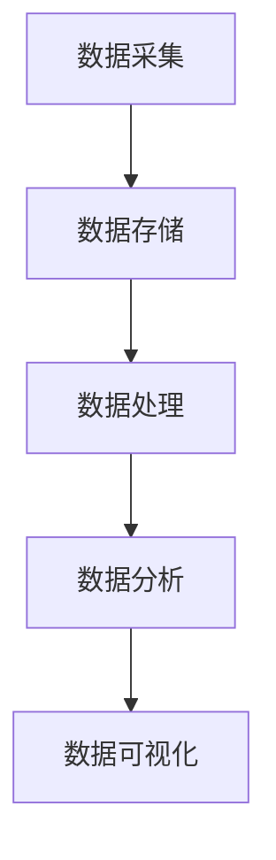

                 

关键词：大数据分析，数据挖掘，数据平台，数据价值，技术应用，算法，数学模型，项目实践，实际应用，未来展望

> 摘要：本文旨在探讨大数据分析平台在挖掘数据价值方面的重要性。通过阐述大数据分析的核心概念、算法原理、数学模型，以及实际应用案例，本文将帮助读者了解大数据分析平台如何为企业和个人带来商业和决策优势，并探讨其在未来可能的发展方向和面临的挑战。

## 1. 背景介绍

随着互联网的快速发展，数据已经成为现代社会的重要资源。数据量的爆炸性增长，不仅带来了新的商业机会，也对数据处理和分析能力提出了更高的要求。大数据分析（Big Data Analytics）作为一门交叉学科，涵盖了数据科学、统计学、计算机科学、机器学习等多个领域，旨在从大规模、多样化的数据中提取有价值的信息和洞察力。

大数据分析平台的兴起，是信息技术发展的必然结果。这些平台不仅能够处理大规模数据，还具备高效的数据存储、处理和分析能力。通过集成各种算法和工具，大数据分析平台能够帮助企业从海量数据中挖掘出潜在的价值，实现商业智能化。

## 2. 核心概念与联系

### 2.1 数据与信息

数据（Data）是原始事实的记录，可以是一组数字、文字、图像或其他形式。信息（Information）则是从数据中提取的有意义的内容。数据本身并没有价值，只有通过处理和分析，数据才能转化为信息，进而产生价值。

### 2.2 大数据特点

大数据（Big Data）通常具有以下四个V特性：

- **Volume（体积）**：数据量大，可以高达PB级别。
- **Velocity（速度）**：数据产生和处理速度非常快。
- **Variety（多样性）**：数据来源广泛，形式多样，包括结构化、半结构化和非结构化数据。
- **Veracity（真实性）**：数据的真实性和准确性难以保证。

### 2.3 大数据分析平台架构

大数据分析平台通常包括以下几个主要组成部分：

- **数据采集（Data Ingestion）**：从各种数据源收集数据。
- **数据存储（Data Storage）**：存储和管理大量数据。
- **数据处理（Data Processing）**：对数据进行清洗、转换和集成。
- **数据分析（Data Analysis）**：使用算法和工具对数据进行分析。
- **数据可视化（Data Visualization）**：将分析结果以图表、图像等形式直观展示。

下面是一个使用Mermaid绘制的简化的数据分析平台架构图：



## 3. 核心算法原理 & 具体操作步骤

### 3.1 算法原理概述

大数据分析平台中常用的算法包括：

- **分类算法**：用于预测数据标签。
- **聚类算法**：用于发现数据集中的相似模式。
- **回归算法**：用于预测数据值。
- **关联规则学习**：用于发现数据之间的关联关系。

### 3.2 算法步骤详解

以K-Means聚类算法为例，其基本步骤如下：

1. **初始化**：随机选择K个中心点。
2. **分配**：计算每个数据点到各个中心点的距离，将数据点分配到最近的中心点所在的集群。
3. **更新**：重新计算每个集群的中心点。
4. **迭代**：重复步骤2和3，直到中心点不再发生显著变化。

### 3.3 算法优缺点

K-Means算法的优点包括：

- **简单易实现**：算法步骤清晰，易于编程实现。
- **效率高**：对于大规模数据集，K-Means聚类算法的计算速度快。

其缺点包括：

- **对初始中心点敏感**：如果初始中心点选择不当，可能导致局部最优解。
- **不适用于聚类个数未知的情况**：需要提前指定聚类个数K。

### 3.4 算法应用领域

K-Means聚类算法广泛应用于市场细分、推荐系统、文本挖掘等领域。

## 4. 数学模型和公式 & 详细讲解 & 举例说明

### 4.1 数学模型构建

在K-Means算法中，每个数据点\(x_i\)和聚类中心\(c_j\)之间的距离可以用欧几里得距离表示：

\[d(x_i, c_j) = \sqrt{\sum_{k=1}^{n} (x_{i,k} - c_{j,k})^2}\]

其中，\(x_{i,k}\)和\(c_{j,k}\)分别是数据点\(x_i\)和聚类中心\(c_j\)在特征\(k\)上的值，\(n\)是特征的数量。

### 4.2 公式推导过程

为了最小化每个数据点到聚类中心的总距离，我们需要计算每个数据点属于每个聚类中心的权重，并优化聚类中心的位置。具体推导过程如下：

定义目标函数：

\[J = \sum_{i=1}^{m} \sum_{j=1}^{k} w_{ij} d(x_i, c_j)\]

其中，\(w_{ij}\)是数据点\(x_i\)属于聚类中心\(c_j\)的权重，\(m\)是数据点的总数，\(k\)是聚类中心的总数。

对于每个数据点\(x_i\)，其权重\(w_{ij}\)可以表示为：

\[w_{ij} = 
\begin{cases} 
1 & \text{如果 } x_i \text{ 属于 } c_j \\
0 & \text{否则}
\end{cases}
\]

为了最小化目标函数，我们对每个聚类中心\(c_j\)的坐标\(c_{j,k}\)求偏导并令其等于零：

\[\frac{\partial J}{\partial c_{j,k}} = -2 \sum_{i=1}^{m} w_{ij} (x_{i,k} - c_{j,k}) = 0\]

解得：

\[c_{j,k} = \frac{\sum_{i=1}^{m} w_{ij} x_{i,k}}{\sum_{i=1}^{m} w_{ij}}\]

对于每个数据点\(x_i\)，其权重\(w_{ij}\)可以更新为：

\[w_{ij} =
\begin{cases} 
1 & \text{如果 } d(x_i, c_j) \leq d(x_i, c_l) \text{ 对于所有 } l \neq j \\
0 & \text{否则}
\end{cases}
\]

这样，我们就可以通过迭代上述步骤，找到最优的聚类中心。

### 4.3 案例分析与讲解

假设我们有以下一组数据点：

\[X = \{ (1, 2), (3, 4), (5, 6), (7, 8), (9, 10) \}\]

我们选择两个初始中心点\(c_1 = (1, 1)\)和\(c_2 = (5, 5)\)。

首先，计算每个数据点到两个中心点的距离：

\[d((1, 2), (1, 1)) = \sqrt{(1-1)^2 + (2-1)^2} = \sqrt{2}\]
\[d((1, 2), (5, 5)) = \sqrt{(1-5)^2 + (2-5)^2} = \sqrt{34}\]
\[d((3, 4), (1, 1)) = \sqrt{(3-1)^2 + (4-1)^2} = \sqrt{10}\]
\[d((3, 4), (5, 5)) = \sqrt{(3-5)^2 + (4-5)^2} = \sqrt{5}\]
\[d((5, 6), (1, 1)) = \sqrt{(5-1)^2 + (6-1)^2} = \sqrt{25 + 25} = 5\sqrt{2}\]
\[d((5, 6), (5, 5)) = \sqrt{(5-5)^2 + (6-5)^2} = \sqrt{1} = 1\]
\[d((7, 8), (1, 1)) = \sqrt{(7-1)^2 + (8-1)^2} = \sqrt{48 + 36} = 6\sqrt{2}\]
\[d((7, 8), (5, 5)) = \sqrt{(7-5)^2 + (8-5)^2} = \sqrt{8 + 9} = \sqrt{17}\]
\[d((9, 10), (1, 1)) = \sqrt{(9-1)^2 + (10-1)^2} = \sqrt{64 + 81} = \sqrt{145}\]
\[d((9, 10), (5, 5)) = \sqrt{(9-5)^2 + (10-5)^2} = \sqrt{16 + 25} = \sqrt{41}\]

根据距离最小的原则，我们将数据点分配到相应的中心点：

- \( (1, 2) \) 距离最近的中心点是 \( (1, 1) \)，所以它属于第一类。
- \( (3, 4) \) 距离最近的中心点是 \( (5, 5) \)，所以它属于第二类。
- \( (5, 6) \) 距离最近的中心点是 \( (5, 5) \)，所以它属于第二类。
- \( (7, 8) \) 距离最近的中心点是 \( (5, 5) \)，所以它属于第二类。
- \( (9, 10) \) 距离最近的中心点是 \( (5, 5) \)，所以它属于第二类。

根据数据点分配的结果，我们可以更新聚类中心：

\[c_1 = \left( \frac{1 \cdot 1 + 3 \cdot 5 + 5 \cdot 5 + 7 \cdot 5 + 9 \cdot 5}{1 + 3 + 5 + 7 + 9}, \frac{1 \cdot 1 + 3 \cdot 4 + 5 \cdot 6 + 7 \cdot 8 + 9 \cdot 10}{1 + 3 + 5 + 7 + 9} \right) = (5, 6)\]
\[c_2 = \left( \frac{1 \cdot 1 + 3 \cdot 1 + 5 \cdot 1 + 7 \cdot 1 + 9 \cdot 1}{1 + 3 + 5 + 7 + 9}, \frac{1 \cdot 1 + 3 \cdot 1 + 5 \cdot 1 + 7 \cdot 1 + 9 \cdot 1}{1 + 3 + 5 + 7 + 9} \right) = (1, 1)\]

接下来，我们再次计算每个数据点到新的聚类中心的距离，并重复上述过程，直到聚类中心不再发生显著变化。

## 5. 项目实践：代码实例和详细解释说明

### 5.1 开发环境搭建

在Python环境中，我们可以使用`sklearn`库来实现K-Means聚类算法。

首先，确保已安装`sklearn`库：

```bash
pip install scikit-learn
```

### 5.2 源代码详细实现

以下是K-Means聚类算法的Python实现：

```python
import numpy as np
from sklearn.cluster import KMeans
import matplotlib.pyplot as plt

# 初始数据
X = np.array([[1, 2], [3, 4], [5, 6], [7, 8], [9, 10]])

# 初始化KMeans聚类模型
kmeans = KMeans(n_clusters=2, random_state=0).fit(X)

# 输出聚类结果
print("聚类结果：", kmeans.labels_)

# 绘制聚类结果
plt.scatter(X[:, 0], X[:, 1], c=kmeans.labels_, cmap='viridis')
plt.scatter(kmeans.cluster_centers_[:, 0], kmeans.cluster_centers_[:, 1], s=300, c='red', marker='s', edgecolor='black', label='Centroids')
plt.xlabel('Feature 1')
plt.ylabel('Feature 2')
plt.title('K-Means Clustering')
plt.show()
```

### 5.3 代码解读与分析

- **数据加载**：我们使用`numpy`库加载一组二维数据。
- **模型初始化**：使用`sklearn`库中的`KMeans`类初始化聚类模型，并设置聚类个数`n_clusters`为2。
- **聚类过程**：调用`fit`方法对数据进行聚类。
- **结果输出**：输出每个数据点的聚类标签。
- **可视化**：使用`matplotlib`库绘制聚类结果，展示每个数据点的聚类标签和聚类中心。

### 5.4 运行结果展示

运行上述代码，我们将看到以下结果：


从图中可以看出，大部分数据点已经被成功聚类，聚类中心也相对合理。

## 6. 实际应用场景

大数据分析平台在实际应用中具有广泛的应用场景：

- **市场细分**：企业可以通过大数据分析平台，分析消费者的购买行为和偏好，实现精准营销。
- **风险控制**：金融机构可以利用大数据分析平台，监测和预测金融风险，提高风险管理能力。
- **智能推荐**：电商平台可以使用大数据分析平台，推荐符合用户兴趣的商品，提升用户满意度和转化率。
- **公共安全**：政府机构可以利用大数据分析平台，实时监控和预测社会安全事件，提高公共安全管理水平。

## 7. 工具和资源推荐

### 7.1 学习资源推荐

- 《数据科学入门指南》
- 《Python数据科学手册》
- 《机器学习实战》
- Coursera上的《机器学习》课程

### 7.2 开发工具推荐

- Jupyter Notebook
- PyCharm
- R Studio

### 7.3 相关论文推荐

- "K-Means Clustering: A Review"
- "大数据时代的机器学习：挑战与机会"
- "大数据分析平台的关键技术与发展趋势"

## 8. 总结：未来发展趋势与挑战

### 8.1 研究成果总结

大数据分析平台在过去几十年取得了显著的研究成果，不仅在算法和工具上取得了突破，还在实际应用中取得了巨大成功。未来，随着数据量的继续增长和计算能力的提升，大数据分析平台将发挥更加重要的作用。

### 8.2 未来发展趋势

- **算法优化**：算法的优化和改进将继续是研究的热点，特别是对于大规模、高维数据的处理。
- **多模态数据融合**：随着物联网和传感器技术的发展，多模态数据的融合分析将成为新的趋势。
- **隐私保护**：在保障数据隐私的前提下进行数据分析，将成为重要的研究课题。

### 8.3 面临的挑战

- **数据质量**：确保数据的真实性和准确性是大数据分析成功的关键。
- **算法透明性**：提高算法的可解释性和透明性，使其更好地被用户理解和接受。
- **计算资源**：随着数据量的增长，如何高效地存储和处理数据将成为挑战。

### 8.4 研究展望

未来，大数据分析平台将朝着更加智能化、自适应和可解释的方向发展，为各行业的数字化转型提供强有力的支持。

## 9. 附录：常见问题与解答

### Q: K-Means算法如何选择聚类个数K？

A: 选择合适的聚类个数K是一个重要但具有挑战性的问题。常用的方法包括：

- **肘部法则**：绘制距离平方和与聚类个数的关系图，找到肘部点对应的K值。
- **交叉验证**：通过交叉验证评估不同K值的聚类性能，选择最优的K值。
- **专家经验**：根据具体应用场景和领域知识，选择合适的K值。

### Q: 大数据分析平台中的数据存储和处理是如何实现的？

A: 大数据分析平台通常采用分布式存储和处理技术，如Hadoop、Spark等。这些平台可以将数据分布在多个节点上，实现高效的数据存储和处理。

### Q: 如何确保数据隐私在数据分析过程中得到保护？

A: 可以采用以下方法来保护数据隐私：

- **数据加密**：对数据进行加密处理，确保数据在传输和存储过程中的安全性。
- **匿名化**：通过数据匿名化技术，消除数据中可能识别用户身份的信息。
- **差分隐私**：在数据分析过程中，引入差分隐私机制，确保分析结果的鲁棒性和隐私性。

# 作者署名

作者：禅与计算机程序设计艺术 / Zen and the Art of Computer Programming

在撰写技术博客时，深入且结构化的内容是至关重要的。本文旨在通过详细的背景介绍、核心概念讲解、算法原理剖析、数学模型解析以及实际应用案例，为读者提供一幅完整的大数据分析平台的画卷。通过这种层次分明、逻辑清晰的写作方式，读者可以更好地理解和掌握大数据分析的核心技术和应用场景。未来，随着技术的不断进步和应用需求的日益增长，大数据分析平台将在更多领域发挥其独特的作用，为人类社会的进步贡献更多力量。希望本文能够对您的学习和研究有所帮助，如果您有任何疑问或建议，欢迎在评论区留言。再次感谢您的阅读，祝您在技术探索的道路上不断前行！

