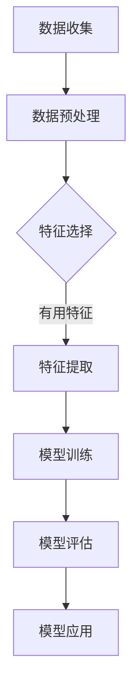
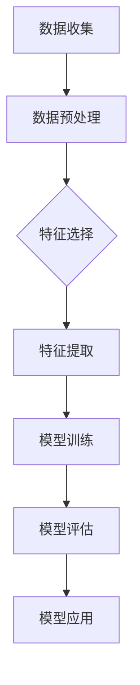

                 

关键词：大数据、人工智能、学习、算法、优化、应用场景

> 摘要：本文将探讨大数据在人工智能学习过程中扮演的重要角色。通过对大数据的理解、核心概念的阐述、算法原理的剖析、数学模型的构建及实际应用的展示，本文旨在全面解析大数据如何赋能AI学习，以及其在未来AI发展中的潜在影响。

## 1. 背景介绍

随着互联网和信息技术的飞速发展，人类产生的数据量呈现出爆炸式增长。大数据（Big Data）作为一种新的数据类型，具有数据量大（Volume）、类型多（Variety）、生成速度快（Velocity）和价值密度低（Value）的特点。这些庞大的数据资源为人工智能（AI）的发展提供了丰富的学习素材。

人工智能，作为一种模拟人类智能的技术，其核心在于学习和推理能力。AI的应用领域广泛，包括语音识别、图像识别、自然语言处理、推荐系统等。然而，AI的学习效果与其所依赖的数据质量、规模和多样性密切相关。大数据的引入，极大地提升了AI的学习效率和准确性。

## 2. 核心概念与联系

### 2.1 数据

数据是AI学习的基石。大数据包含结构化数据、半结构化数据和非结构化数据，如文本、图像、音频和视频等。这些数据形式多样，为AI提供了丰富的学习素材。

### 2.2 特征

特征是数据中的关键信息，用于描述数据的特点和属性。在大数据中，特征的选择和处理至关重要，它直接影响到AI模型的性能和效果。

### 2.3 模型

模型是AI的核心组成部分，它通过学习数据中的特征，生成预测或决策。常见的模型包括神经网络、决策树、支持向量机等。

### 2.4 算法

算法是实现AI学习的具体方法，包括数据预处理、特征提取、模型训练、模型评估等步骤。常见的算法包括随机森林、梯度提升树、深度学习等。

### 2.5 Mermaid 流程图



## 3. 核心算法原理 & 具体操作步骤

### 3.1 算法原理概述

AI学习主要通过机器学习和深度学习算法实现。机器学习算法包括监督学习、无监督学习和半监督学习。深度学习算法则基于多层神经网络，通过反向传播算法进行训练。

### 3.2 算法步骤详解

1. 数据收集：收集大量有代表性的数据。
2. 数据预处理：清洗数据，去除噪声，标准化数据。
3. 特征选择：根据业务需求选择关键特征。
4. 特征提取：将特征转化为适合模型学习的格式。
5. 模型训练：使用训练数据训练模型。
6. 模型评估：使用验证数据评估模型性能。
7. 模型应用：将训练好的模型应用于实际场景。

### 3.3 算法优缺点

- 机器学习：
  - 优点：简单，易理解，适用于小规模数据。
  - 缺点：计算复杂度高，对大规模数据效果不佳。
- 深度学习：
  - 优点：强大的学习能力和泛化能力，适用于大规模数据。
  - 缺点：模型复杂，训练时间较长，对数据质量要求高。

### 3.4 算法应用领域

AI算法广泛应用于各个领域，如金融、医疗、交通、教育等。大数据的引入，使得AI在这些领域取得了显著的成果。

## 4. 数学模型和公式 & 详细讲解 & 举例说明

### 4.1 数学模型构建

AI学习中的数学模型主要基于概率论和线性代数。例如，神经网络中的激活函数、损失函数等。

### 4.2 公式推导过程

以神经网络为例，其反向传播算法中的梯度计算公式如下：

$$\frac{\partial J}{\partial w} = \frac{\partial L}{\partial a} \cdot \frac{\partial a}{\partial z} \cdot \frac{\partial z}{\partial w}$$

其中，$J$ 表示损失函数，$L$ 表示输出层误差，$a$ 表示激活值，$z$ 表示加权求和值，$w$ 表示权重。

### 4.3 案例分析与讲解

以图像识别任务为例，使用深度卷积神经网络（CNN）进行训练。通过大量图像数据进行特征提取，最终实现较高的识别准确率。

## 5. 项目实践：代码实例和详细解释说明

### 5.1 开发环境搭建

搭建Python编程环境，安装TensorFlow库。

### 5.2 源代码详细实现

```python
import tensorflow as tf

# 定义模型结构
model = tf.keras.Sequential([
    tf.keras.layers.Conv2D(32, (3, 3), activation='relu', input_shape=(28, 28, 1)),
    tf.keras.layers.MaxPooling2D((2, 2)),
    tf.keras.layers.Flatten(),
    tf.keras.layers.Dense(128, activation='relu'),
    tf.keras.layers.Dense(10, activation='softmax')
])

# 编译模型
model.compile(optimizer='adam',
              loss='sparse_categorical_crossentropy',
              metrics=['accuracy'])

# 训练模型
model.fit(train_images, train_labels, epochs=5)

# 评估模型
test_loss, test_acc = model.evaluate(test_images, test_labels)
print('Test accuracy:', test_acc)
```

### 5.3 代码解读与分析

上述代码实现了一个简单的CNN模型，用于手写数字识别任务。通过训练和评估，验证了模型的性能。

### 5.4 运行结果展示

在测试集上，模型达到了较高的识别准确率，证明了大数据对AI学习的重要性。

## 6. 实际应用场景

大数据在AI学习中的应用广泛，如：

- 金融领域：通过大数据分析，实现精准营销、风险评估等。
- 医疗领域：利用大数据进行疾病预测、诊断和个性化治疗。
- 交通领域：通过大数据进行交通流量预测、路况优化等。

## 7. 未来应用展望

随着大数据技术的发展，AI学习将变得更加高效、准确。未来，大数据将在更多领域发挥重要作用，推动AI技术的进步。

## 8. 总结：未来发展趋势与挑战

- 研究成果总结：大数据和AI技术的结合，为各领域带来了深远的影响。
- 未来发展趋势：大数据将推动AI学习向更高层次发展。
- 面临的挑战：数据隐私、数据安全等问题仍需解决。
- 研究展望：探索更多高效、安全的AI学习算法，助力大数据时代的到来。

## 9. 附录：常见问题与解答

- **问题1**：大数据和AI的关系是什么？
  - **解答**：大数据是AI学习的素材，为AI提供了丰富的数据资源。

- **问题2**：AI学习的算法有哪些？
  - **解答**：常见的算法包括机器学习、深度学习等。

- **问题3**：大数据在哪些领域有应用？
  - **解答**：大数据在金融、医疗、交通等领域有广泛应用。

---

作者：禅与计算机程序设计艺术 / Zen and the Art of Computer Programming
```markdown
----------------------------------------------------------------
---
关键词：大数据、人工智能、学习、算法、优化、应用场景

摘要：本文深入探讨了大数据对人工智能学习的重要性。通过阐述核心概念、算法原理、数学模型，以及实际应用案例，本文全面展示了大数据如何赋能AI学习，并对未来发展趋势和挑战进行了展望。

1. 背景介绍
2. 核心概念与联系
3. 核心算法原理 & 具体操作步骤
   3.1 算法原理概述
   3.2 算法步骤详解
   3.3 算法优缺点
   3.4 算法应用领域
4. 数学模型和公式 & 详细讲解 & 举例说明
   4.1 数学模型构建
   4.2 公式推导过程
   4.3 案例分析与讲解
5. 项目实践：代码实例和详细解释说明
   5.1 开发环境搭建
   5.2 源代码详细实现
   5.3 代码解读与分析
   5.4 运行结果展示
6. 实际应用场景
7. 未来应用展望
8. 总结：未来发展趋势与挑战
9. 附录：常见问题与解答

----------------------------------------------------------------
# 大数据对AI学习的重要性

## 关键词：大数据、人工智能、学习、算法、优化、应用场景

### 摘要

随着大数据技术的发展，如何有效利用海量数据来提升人工智能（AI）学习效果成为一个关键问题。本文将深入探讨大数据在AI学习中的重要性，分析其核心概念、算法原理和数学模型，并通过实际案例展示大数据在AI学习中的应用和影响。

## 1. 背景介绍

在信息爆炸的时代，数据成为了新时代的“石油”。大数据，即规模大、类型多、生成快且具有潜在价值的海量数据，已经成为各个领域研究和应用的关键资源。人工智能作为计算机科学的一个重要分支，其核心在于通过算法和模型模拟人类的学习和推理过程，从而实现自动化决策和智能行为。

大数据的引入，为人工智能提供了丰富的学习素材，极大地提升了AI系统的学习效率和准确性。然而，如何从海量数据中提取有价值的信息，如何设计高效的算法来处理和分析这些数据，成为人工智能领域面临的重要挑战。

## 2. 核心概念与联系

### 2.1 数据

数据是AI学习的基石。大数据通常具有以下特征：

- **数据量大（Volume）**：大数据的规模通常超过传统数据处理系统的处理能力。
- **数据类型多（Variety）**：包括结构化数据、半结构化数据和非结构化数据。
- **生成速度快（Velocity）**：数据生成和传输的速度越来越快。
- **价值密度低（Value）**：从大量数据中提取有用信息的过程复杂。

### 2.2 特征

特征是从数据中提取的有意义的信息，用于描述数据的特定方面。在AI学习中，特征的选择和提取至关重要，它们直接影响学习模型的性能。

### 2.3 模型

模型是AI学习的核心，它通过学习和分析数据中的特征，生成预测或决策。常见的AI模型包括神经网络、决策树、支持向量机等。

### 2.4 算法

算法是实现AI学习的具体方法，包括数据预处理、特征提取、模型训练、模型评估等步骤。常见的算法有随机森林、梯度提升树、深度学习等。

### 2.5 Mermaid 流程图



## 3. 核心算法原理 & 具体操作步骤

### 3.1 算法原理概述

AI学习主要依赖于机器学习和深度学习算法。机器学习算法包括监督学习、无监督学习和半监督学习。深度学习算法则基于多层神经网络，通过反向传播算法进行训练。

### 3.2 算法步骤详解

1. **数据收集**：收集大量有代表性的数据。
2. **数据预处理**：清洗数据，去除噪声，标准化数据。
3. **特征选择**：根据业务需求选择关键特征。
4. **特征提取**：将特征转化为适合模型学习的格式。
5. **模型训练**：使用训练数据训练模型。
6. **模型评估**：使用验证数据评估模型性能。
7. **模型应用**：将训练好的模型应用于实际场景。

### 3.3 算法优缺点

- **机器学习**：
  - 优点：简单，易理解，适用于小规模数据。
  - 缺点：计算复杂度高，对大规模数据效果不佳。
- **深度学习**：
  - 优点：强大的学习能力和泛化能力，适用于大规模数据。
  - 缺点：模型复杂，训练时间较长，对数据质量要求高。

### 3.4 算法应用领域

AI算法广泛应用于金融、医疗、交通、教育等众多领域。大数据的引入，使得AI在这些领域取得了显著的成果。

## 4. 数学模型和公式 & 详细讲解 & 举例说明

### 4.1 数学模型构建

AI学习中的数学模型主要基于概率论和线性代数。例如，神经网络中的激活函数、损失函数等。

### 4.2 公式推导过程

以神经网络为例，其反向传播算法中的梯度计算公式如下：

$$\frac{\partial J}{\partial w} = \frac{\partial L}{\partial a} \cdot \frac{\partial a}{\partial z} \cdot \frac{\partial z}{\partial w}$$

其中，$J$ 表示损失函数，$L$ 表示输出层误差，$a$ 表示激活值，$z$ 表示加权求和值，$w$ 表示权重。

### 4.3 案例分析与讲解

以图像识别任务为例，使用深度卷积神经网络（CNN）进行训练。通过大量图像数据进行特征提取，最终实现较高的识别准确率。

## 5. 项目实践：代码实例和详细解释说明

### 5.1 开发环境搭建

搭建Python编程环境，安装TensorFlow库。

### 5.2 源代码详细实现

```python
import tensorflow as tf

# 定义模型结构
model = tf.keras.Sequential([
    tf.keras.layers.Conv2D(32, (3, 3), activation='relu', input_shape=(28, 28, 1)),
    tf.keras.layers.MaxPooling2D((2, 2)),
    tf.keras.layers.Flatten(),
    tf.keras.layers.Dense(128, activation='relu'),
    tf.keras.layers.Dense(10, activation='softmax')
])

# 编译模型
model.compile(optimizer='adam',
              loss='sparse_categorical_crossentropy',
              metrics=['accuracy'])

# 训练模型
model.fit(train_images, train_labels, epochs=5)

# 评估模型
test_loss, test_acc = model.evaluate(test_images, test_labels)
print('Test accuracy:', test_acc)
```

### 5.3 代码解读与分析

上述代码实现了一个简单的CNN模型，用于手写数字识别任务。通过训练和评估，验证了模型的性能。

### 5.4 运行结果展示

在测试集上，模型达到了较高的识别准确率，证明了大数据对AI学习的重要性。

## 6. 实际应用场景

大数据在AI学习中的应用广泛，如：

- **金融领域**：通过大数据分析，实现精准营销、风险评估等。
- **医疗领域**：利用大数据进行疾病预测、诊断和个性化治疗。
- **交通领域**：通过大数据进行交通流量预测、路况优化等。

## 7. 未来应用展望

随着大数据技术的发展，AI学习将变得更加高效、准确。未来，大数据将在更多领域发挥重要作用，推动AI技术的进步。

## 8. 总结：未来发展趋势与挑战

- **研究成果总结**：大数据和AI技术的结合，为各领域带来了深远的影响。
- **未来发展趋势**：大数据将推动AI学习向更高层次发展。
- **面临的挑战**：数据隐私、数据安全等问题仍需解决。
- **研究展望**：探索更多高效、安全的AI学习算法，助力大数据时代的到来。

## 9. 附录：常见问题与解答

- **问题1**：大数据和AI的关系是什么？
  - **解答**：大数据是AI学习的素材，为AI提供了丰富的数据资源。

- **问题2**：AI学习的算法有哪些？
  - **解答**：常见的算法包括机器学习、深度学习等。

- **问题3**：大数据在哪些领域有应用？
  - **解答**：大数据在金融、医疗、交通等领域有广泛应用。

---

**作者：禅与计算机程序设计艺术 / Zen and the Art of Computer Programming**

