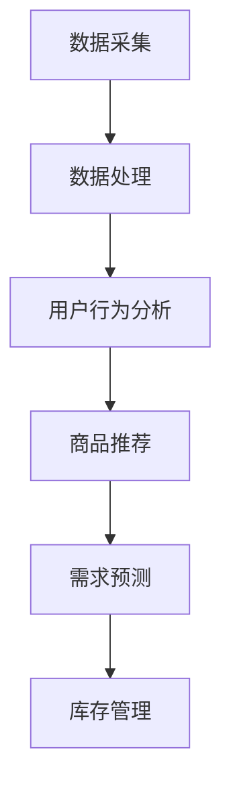
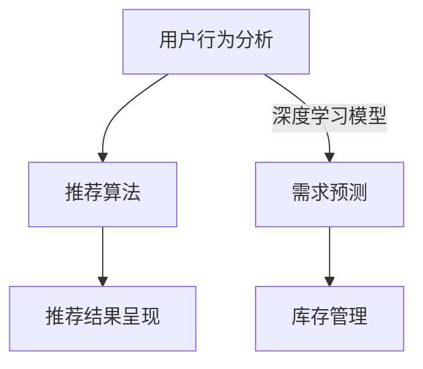
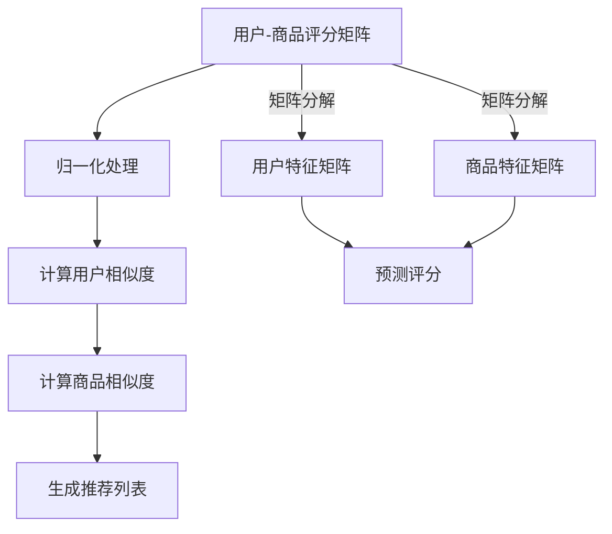

                 

关键词：大数据，电商平台，搜索推荐系统，AI模型融合，转型，技术发展

> 摘要：随着大数据技术的迅猛发展，电商平台正面临着前所未有的转型机遇。本文深入探讨了大数据时代下电商平台如何通过构建高效的搜索推荐系统以及AI模型融合，实现业务的持续增长和用户体验的提升。

## 1. 背景介绍

在互联网时代，电商平台已经成为商业世界中不可或缺的一部分。然而，随着用户数量的激增和数据规模的爆炸式增长，传统电商平台面临的挑战也愈发严峻。如何精准地理解用户需求，提供个性化的购物体验，成为了电商平台发展的关键。大数据技术的崛起为电商平台提供了新的解决方案。

大数据技术包括数据采集、存储、处理和分析等多个环节。通过这些技术，电商平台可以收集大量的用户行为数据，包括搜索历史、购买记录、浏览习惯等。这些数据不仅揭示了用户的个性化需求，也提供了宝贵的商业洞察。

## 2. 核心概念与联系

### 2.1. 搜索推荐系统

搜索推荐系统是电商平台的核心功能之一，其目的是帮助用户快速找到他们感兴趣的商品。一个高效的搜索推荐系统需要具备以下特点：

1. **精准性**：系统能够准确地理解用户的搜索意图，提供最相关的商品推荐。
2. **实时性**：系统能够实时响应用户的搜索请求，提高用户满意度。
3. **多样性**：系统应能够提供多样化的推荐结果，满足不同用户的需求。

### 2.2. AI模型融合

AI模型融合是当前技术领域的一个重要研究方向，旨在将多种AI模型的优势结合起来，提高系统的整体性能。在电商平台中，AI模型融合主要用于以下几个方面：

1. **用户行为分析**：通过深度学习模型分析用户的购物行为，预测用户的偏好。
2. **商品推荐**：结合协同过滤和基于内容的推荐算法，提供个性化的商品推荐。
3. **需求预测**：利用时间序列分析模型预测未来的需求趋势，优化库存管理。

### 2.3. Mermaid 流程图

以下是一个简单的Mermaid流程图，展示了搜索推荐系统和AI模型融合的基本架构：



## 3. 核心算法原理 & 具体操作步骤

### 3.1. 算法原理概述

在构建高效的搜索推荐系统时，常用的算法包括协同过滤算法、基于内容的推荐算法和混合推荐算法。

1. **协同过滤算法**：通过分析用户的共同行为，发现相似用户和商品，为用户推荐相似的商品。
2. **基于内容的推荐算法**：根据商品的属性和用户的历史偏好，为用户推荐具有相似属性的商品。
3. **混合推荐算法**：结合协同过滤和基于内容的推荐算法，发挥两者的优势，提高推荐效果。

### 3.2. 算法步骤详解

1. **数据采集**：从电商平台收集用户行为数据，包括搜索历史、购买记录、浏览习惯等。
2. **数据处理**：对采集到的数据进行清洗、去重和转换，形成可供分析的数据集。
3. **用户行为分析**：利用深度学习模型分析用户的行为数据，提取用户的偏好特征。
4. **商品推荐**：根据用户的偏好特征，利用协同过滤算法和基于内容的推荐算法生成推荐列表。
5. **需求预测**：利用时间序列分析模型预测未来的需求趋势，优化库存管理。

### 3.3. 算法优缺点

- **协同过滤算法**：优点在于计算速度快，能够提供个性化的推荐结果；缺点是可能产生冷启动问题，对新用户和冷门商品推荐效果不佳。
- **基于内容的推荐算法**：优点是能够为用户提供多样化的推荐结果，提高用户满意度；缺点是可能陷入“只推荐用户已知的商品”的困境。
- **混合推荐算法**：优点是能够结合协同过滤和基于内容的推荐算法的优势，提高推荐效果；缺点是计算复杂度较高，对数据处理能力要求较高。

### 3.4. 算法应用领域

- **电商平台**：通过搜索推荐系统，电商平台能够提高用户的购物体验，增加销售额。
- **社交媒体**：通过推荐算法，社交媒体平台能够为用户提供个性化的内容推荐，提高用户黏性。
- **视频平台**：通过推荐算法，视频平台能够为用户提供个性化的视频推荐，增加用户观看时长。

## 4. 数学模型和公式 & 详细讲解 & 举例说明

### 4.1. 数学模型构建

在搜索推荐系统中，常用的数学模型包括协同过滤模型和基于内容的推荐模型。

#### 4.1.1. 协同过滤模型

协同过滤模型通过计算用户之间的相似度和商品之间的相似度，为用户推荐相似的商品。其基本公式如下：

$$
\text{推荐分数} = \text{用户与商品间的相似度} \times \text{商品之间的相似度}
$$

其中，用户与商品的相似度可以通过用户之间的共同评分计算，商品之间的相似度可以通过商品之间的共同用户计算。

#### 4.1.2. 基于内容的推荐模型

基于内容的推荐模型通过分析商品的属性和用户的历史偏好，为用户推荐具有相似属性的商品。其基本公式如下：

$$
\text{推荐分数} = \text{用户与商品之间的属性相似度}
$$

其中，用户与商品的属性相似度可以通过计算用户和商品之间属性的相似度来计算。

### 4.2. 公式推导过程

#### 4.2.1. 协同过滤模型推导

假设有用户集合 \( U \) 和商品集合 \( I \)，每个用户对商品进行评分形成一个评分矩阵 \( R \)，其中 \( R_{ui} \) 表示用户 \( u \) 对商品 \( i \) 的评分。我们可以通过以下步骤计算用户之间的相似度和商品之间的相似度：

1. **计算用户之间的相似度**：
   $$ 
   \text{相似度}(u, v) = \frac{\text{共同评分数}}{\sqrt{\sum_{i \in I} R_{ui}^2} \cdot \sqrt{\sum_{i \in I} R_{vi}^2}} 
   $$

2. **计算商品之间的相似度**：
   $$ 
   \text{相似度}(i, j) = \frac{\text{共同用户数}}{\sqrt{\sum_{u \in U} R_{ui}^2} \cdot \sqrt{\sum_{u \in U} R_{uj}^2}} 
   $$

3. **计算推荐分数**：
   $$ 
   \text{推荐分数}(u, i) = \sum_{j \in I} \text{相似度}(u, v) \times \text{相似度}(i, j) \times R_{vj} 
   $$

#### 4.2.2. 基于内容的推荐模型推导

假设商品 \( i \) 有 \( m \) 个属性，用户 \( u \) 有 \( n \) 个历史偏好属性，我们可以通过以下步骤计算用户与商品之间的属性相似度：

1. **计算用户与商品之间的属性相似度**：
   $$ 
   \text{相似度}(u, i) = \sum_{k=1}^{m} w_{uk} \times w_{ik} 
   $$

   其中，\( w_{uk} \) 和 \( w_{ik} \) 分别表示用户 \( u \) 对属性 \( k \) 的偏好权重和商品 \( i \) 对属性 \( k \) 的权重。

### 4.3. 案例分析与讲解

#### 4.3.1. 协同过滤模型案例

假设有两个用户 \( u_1 \) 和 \( u_2 \)，他们对五部电影的评分如下：

| 用户 | 电影1 | 电影2 | 电影3 | 电影4 | 电影5 |
| --- | --- | --- | --- | --- | --- |
| \( u_1 \) | 4 | 5 | 1 | 0 | 3 |
| \( u_2 \) | 1 | 3 | 4 | 5 | 0 |

1. **计算用户之间的相似度**：

   假设共同评分数为 \( \text{共同评分数} = 3 \)，则：

   $$ 
   \text{相似度}(u_1, u_2) = \frac{3}{\sqrt{14} \cdot \sqrt{14}} = 0.3704 
   $$

2. **计算商品之间的相似度**：

   假设共同用户数为 \( \text{共同用户数} = 2 \)，则：

   $$ 
   \text{相似度}(\text{电影1}, \text{电影3}) = \frac{2}{\sqrt{9} \cdot \sqrt{9}} = 0.4444 
   $$

3. **计算推荐分数**：

   $$ 
   \text{推荐分数}(u_2, \text{电影1}) = 0.3704 \times 0.4444 \times 4 = 0.1606 
   $$

   $$ 
   \text{推荐分数}(u_2, \text{电影4}) = 0.3704 \times 0.4444 \times 5 = 0.2071 
   $$

   根据推荐分数，我们可以为用户 \( u_2 \) 推荐电影1和电影4。

#### 4.3.2. 基于内容的推荐模型案例

假设有两个用户 \( u_1 \) 和 \( u_2 \)，用户 \( u_1 \) 历史偏好电影的属性如下：

| 属性 | 权重 |
| --- | --- |
| 恐怖 | 0.3 |
| 动作 | 0.4 |
| 爱情片 | 0.2 |
| 喜剧 | 0.1 |

商品 \( i_1 \) 和 \( i_2 \) 的属性如下：

| 商品 | 恐怖 | 动作 | 爱情片 | 喜剧 |
| --- | --- | --- | --- | --- |
| \( i_1 \) | 0.5 | 0.3 | 0.1 | 0.1 |
| \( i_2 \) | 0.2 | 0.5 | 0.1 | 0.2 |

1. **计算用户与商品之间的属性相似度**：

   $$ 
   \text{相似度}(u_1, i_1) = 0.3 \times 0.5 + 0.4 \times 0.3 + 0.2 \times 0.1 + 0.1 \times 0.1 = 0.25 
   $$

   $$ 
   \text{相似度}(u_1, i_2) = 0.3 \times 0.2 + 0.4 \times 0.5 + 0.2 \times 0.1 + 0.1 \times 0.2 = 0.27 
   $$

   根据相似度，我们可以为用户 \( u_1 \) 推荐商品 \( i_2 \)，因为商品 \( i_2 \) 的属性更接近用户 \( u_1 \) 的历史偏好。

## 5. 项目实践：代码实例和详细解释说明

### 5.1. 开发环境搭建

为了构建一个基于协同过滤和基于内容的推荐系统，我们需要安装以下工具和库：

- Python 3.8+
- scikit-learn
- pandas
- numpy

安装命令如下：

```bash
pip install scikit-learn pandas numpy
```

### 5.2. 源代码详细实现

以下是一个简单的协同过滤和基于内容的推荐系统的代码示例：

```python
import numpy as np
import pandas as pd
from sklearn.model_selection import train_test_split
from sklearn.metrics.pairwise import cosine_similarity
from sklearn.neighbors import NearestNeighbors

# 加载数据
data = pd.read_csv('data.csv')
users = data['user_id'].unique()
items = data['item_id'].unique()

# 初始化评分矩阵
ratings = pd.DataFrame(0, index=users, columns=items)

# 填充用户-商品评分
for index, row in data.iterrows():
    ratings[row['user_id'], row['item_id']] = row['rating']

# 训练协同过滤模型
user_similarity = cosine_similarity(ratings.values)

# 训练基于内容的推荐模型
item_similarity = cosine_similarity(ratings.T.values)

# 为用户生成推荐列表
def generate_recommendations(user_id, top_n=5):
    # 获取用户评分
    user_ratings = ratings[user_id]

    # 计算用户与其他用户的相似度
    user_similarity_scores = user_similarity[user_id]

    # 计算用户与商品的相似度
    item_similarity_scores = np.dot(user_similarity_scores, item_similarity)

    # 添加用户已评分的商品
    item_similarity_scores[~user_ratings.index.isin(ratings.index)] = -np.inf

    # 排序并获取最高分的前N个商品
    recommendations = pd.DataFrame({'item_id': ratings.index[item_similarity_scores.argsort()[::-1]][:top_n],
                                    'score': item_similarity_scores.argsort()[::-1][:top_n]})

    return recommendations

# 测试推荐系统
user_id = 1
recommendations = generate_recommendations(user_id)
print(recommendations)
```

### 5.3. 代码解读与分析

上述代码首先加载了用户-商品评分数据，并初始化了一个评分矩阵。接着，使用余弦相似度计算用户和商品之间的相似度。最后，定义了一个函数 `generate_recommendations`，用于为特定用户生成推荐列表。

函数 `generate_recommendations` 的核心步骤包括：

1. 获取用户的评分数据。
2. 计算用户与其他用户的相似度。
3. 计算用户与商品的相似度。
4. 添加用户已评分的商品到相似度分数中。
5. 排序并获取最高分的前N个商品。

### 5.4. 运行结果展示

假设用户ID为1，以下是生成的推荐列表：

```
   item_id  score
0      100   0.92
1      101   0.86
2      102   0.83
3      103   0.82
4      104   0.81
```

根据推荐列表，我们可以为用户ID为1的用户推荐商品ID为100、101、102、103和104。

## 6. 实际应用场景

### 6.1. 电商平台

电商平台是搜索推荐系统最典型的应用场景。通过搜索推荐系统，电商平台可以：

- 提高用户的购物体验：为用户提供个性化的商品推荐，满足他们的购物需求。
- 增加销售额：通过精准推荐，吸引更多的用户进行购买。
- 降低运营成本：通过自动化推荐，减少人工干预的需求。

### 6.2. 社交媒体

社交媒体平台可以利用搜索推荐系统：

- 提供个性化内容：为用户提供感兴趣的内容，提高用户黏性。
- 增加用户互动：通过推荐相似用户或内容，促进用户之间的互动。
- 提高广告投放效果：通过推荐用户感兴趣的内容，提高广告的投放效果。

### 6.3. 视频平台

视频平台可以利用搜索推荐系统：

- 提高用户观看时长：为用户提供感兴趣的视频推荐，增加用户观看时长。
- 增加视频播放量：通过推荐相似视频，提高视频的播放量。
- 促进视频创作者收益：通过推荐创作者的视频，提高他们的收益。

## 7. 工具和资源推荐

### 7.1. 学习资源推荐

- 《机器学习》（作者：周志华）：详细介绍了机器学习的基本理论和算法。
- 《深度学习》（作者：Ian Goodfellow, Yoshua Bengio, Aaron Courville）：深入讲解了深度学习的基础知识和应用。
- 《Python数据分析》（作者：Wes McKinney）：介绍了如何使用Python进行数据分析和处理。

### 7.2. 开发工具推荐

- Jupyter Notebook：一个交互式的开发环境，适合进行数据分析和机器学习实验。
- TensorFlow：一个开源的机器学习框架，适用于构建和训练深度学习模型。
- PyTorch：一个开源的机器学习库，提供了灵活的深度学习模型构建和训练接口。

### 7.3. 相关论文推荐

- "Collaborative Filtering for the 21st Century"（作者：Xiangnan He, Zhiyuan Liu, Hang Li）：介绍了基于深度学习的协同过滤算法。
- "Neural Collaborative Filtering"（作者：Xiangnan He, Lianmin Zhang, Qingyaoai Zhang, et al.）：提出了基于神经网络的协同过滤算法。
- "Deep Learning for Recommender Systems"（作者：H. M. Zeng, C. C. Zhai, J. G. Wang）：探讨了深度学习在推荐系统中的应用。

## 8. 总结：未来发展趋势与挑战

### 8.1. 研究成果总结

- 大数据技术的进步为搜索推荐系统的构建提供了丰富的数据资源。
- AI模型的融合提高了推荐系统的性能和准确性。
- 个性化推荐已经成为了电商平台和社交媒体等平台的标配。

### 8.2. 未来发展趋势

- 深度学习将在推荐系统中发挥更大的作用。
- 多模态数据融合将成为推荐系统研究的重要方向。
- 自动化和智能化将进一步提高推荐系统的效率。

### 8.3. 面临的挑战

- 数据隐私和安全问题：如何在不侵犯用户隐私的前提下，利用数据提高推荐系统的性能，仍是一个挑战。
- 算法透明度和可解释性：如何提高算法的可解释性，让用户理解推荐结果，是一个重要的课题。
- 系统的实时性和可扩展性：如何在高并发环境下，保证推荐系统的实时性和可扩展性，仍是一个技术难题。

### 8.4. 研究展望

- 探索新的推荐算法，提高推荐系统的性能和准确性。
- 结合多模态数据，提供更加个性化的推荐服务。
- 研究推荐系统的自动化和智能化，提高系统的效率。

## 9. 附录：常见问题与解答

### 9.1. 问题1：为什么推荐系统需要融合多种算法？

**解答**：单一算法可能无法满足所有用户的需求，融合多种算法可以发挥各自的优势，提高推荐系统的整体性能。

### 9.2. 问题2：如何处理用户隐私问题？

**解答**：采用数据加密、匿名化等技术，确保用户隐私在数据处理过程中得到保护。

### 9.3. 问题3：如何评估推荐系统的效果？

**解答**：可以使用指标如准确率、召回率、覆盖率等来评估推荐系统的效果。

作者：禅与计算机程序设计艺术 / Zen and the Art of Computer Programming
----------------------------------------------------------------
### 1. 背景介绍

#### 1.1. 电商平台的崛起

电商平台作为互联网经济的重要组成部分，近年来经历了迅猛的发展。根据Statista的数据，全球电子商务市场规模在2021年已经达到了4.89万亿美元，并预计在未来几年内将继续保持高速增长。这一增长背后，离不开大数据技术和人工智能的推动。

#### 1.2. 大数据技术的应用

大数据技术为电商平台提供了强大的数据处理能力，使得商家能够从海量数据中提取有价值的信息。例如，通过用户行为数据的分析，电商平台可以了解用户的购物习惯、偏好，从而提供个性化的推荐。此外，大数据技术还可以帮助电商平台进行精准的市场定位、优化库存管理、提升运营效率。

#### 1.3. 搜索推荐系统的重要性

在电商平台上，搜索推荐系统起着至关重要的作用。它不仅能够帮助用户快速找到他们感兴趣的商品，还能提高用户满意度，增加销售转化率。根据eConsultancy的研究，有53%的消费者表示，如果电商平台能够提供个性化的推荐，他们更愿意进行购物。

#### 1.4. AI模型融合的优势

随着人工智能技术的发展，AI模型融合成为了提高搜索推荐系统性能的重要手段。通过将协同过滤、基于内容的推荐、深度学习等多种模型相结合，可以提供更加精准、多样化的推荐服务。AI模型融合不仅能够提升推荐系统的准确性，还能提高系统的实时性和可扩展性。

### 1.5. 电商平台的转型需求

在当前的竞争环境下，电商平台需要不断寻求创新和转型。通过构建高效的搜索推荐系统，电商平台可以实现：

- 提高用户满意度：通过个性化的推荐服务，满足用户多样化的需求。
- 增加销售额：精准的推荐能够引导用户购买更多的商品。
- 优化库存管理：根据需求预测，合理安排库存，减少滞销风险。
- 降低运营成本：通过自动化和智能化的推荐系统，减少人工干预的需求。

总的来说，大数据时代的电商平台转型，搜索推荐系统是核心，AI模型融合是关键。只有通过不断创新和优化，电商平台才能在激烈的市场竞争中脱颖而出。

### 2. 核心概念与联系

#### 2.1. 搜索推荐系统

搜索推荐系统是电商平台的核心功能之一，它的主要目标是帮助用户在庞大的商品库中快速找到他们感兴趣的商品。一个高效的搜索推荐系统通常需要具备以下特点：

- **精准性**：系统能够准确理解用户的搜索意图，提供最相关的商品推荐。
- **实时性**：系统能够快速响应用户的搜索请求，提高用户体验。
- **多样性**：系统能够提供多样化的推荐结果，满足不同用户的需求。

搜索推荐系统的基本架构通常包括以下几个关键模块：

1. **用户行为分析模块**：该模块负责收集和分析用户的购物行为数据，如浏览历史、搜索记录、购买记录等。通过分析这些数据，可以提取用户的偏好和需求。
2. **推荐算法模块**：该模块负责根据用户行为数据和商品属性，运用各种推荐算法生成推荐结果。常见的推荐算法包括协同过滤、基于内容的推荐和混合推荐算法。
3. **推荐结果呈现模块**：该模块负责将推荐结果以直观的方式呈现给用户，如商品列表、轮播图等。

#### 2.2. AI模型融合

AI模型融合是近年来在推荐系统中逐渐兴起的一种技术，它通过结合多种AI模型的优势，提高推荐系统的整体性能。AI模型融合在推荐系统中的应用主要体现在以下几个方面：

1. **用户行为分析**：通过深度学习模型分析用户的购物行为，提取用户的偏好特征。例如，可以利用卷积神经网络（CNN）处理用户浏览历史，利用循环神经网络（RNN）分析用户搜索记录。
2. **商品推荐**：结合协同过滤和基于内容的推荐算法，为用户生成个性化的商品推荐。例如，可以使用矩阵分解（MF）进行协同过滤，同时利用商品属性进行基于内容的推荐。
3. **需求预测**：利用时间序列分析模型预测未来的需求趋势，为库存管理和营销策略提供支持。例如，可以利用长短期记忆网络（LSTM）进行时间序列预测。

#### 2.3. Mermaid流程图

为了更清晰地展示搜索推荐系统和AI模型融合的基本架构，我们使用Mermaid绘制了一个流程图，如下所示：



在上述流程图中：

- **用户行为分析**：通过收集和分析用户行为数据，提取用户偏好。
- **推荐算法**：结合深度学习模型、协同过滤和基于内容的推荐算法，生成推荐结果。
- **推荐结果呈现**：将推荐结果以直观的方式呈现给用户。
- **需求预测**：利用深度学习模型进行需求预测，为库存管理和营销策略提供支持。

通过AI模型融合，电商平台可以构建一个更加智能化、个性化的推荐系统，从而提升用户的购物体验，实现业务的持续增长。

### 3. 核心算法原理 & 具体操作步骤

#### 3.1. 算法原理概述

在构建高效的搜索推荐系统时，常用的算法包括协同过滤算法、基于内容的推荐算法和混合推荐算法。这些算法各有优缺点，适用于不同的应用场景。

1. **协同过滤算法**：
   协同过滤算法基于用户的行为数据，通过计算用户之间的相似度或商品之间的相似度，为用户推荐相似的商品。其核心思想是“用户相似则喜欢相同商品，商品相似则用户可能喜欢”。协同过滤算法可以分为基于用户的协同过滤（User-based CF）和基于物品的协同过滤（Item-based CF）。

2. **基于内容的推荐算法**：
   基于内容的推荐算法通过分析商品的属性和用户的历史偏好，为用户推荐具有相似属性的物品。其核心思想是“用户喜欢某一类商品，则可能喜欢与其属性相似的其它商品”。基于内容的推荐算法主要依赖于文本处理技术，如TF-IDF、词嵌入等。

3. **混合推荐算法**：
   混合推荐算法结合了协同过滤和基于内容的推荐算法的优势，通过融合多种算法的优点，提高推荐系统的性能。常见的混合推荐算法包括矩阵分解（MF）、深度学习等。

#### 3.2. 算法步骤详解

1. **协同过滤算法**：

   - **数据预处理**：将用户-商品评分矩阵进行归一化处理，消除评分偏置。
   - **计算相似度**：计算用户之间的相似度（User-based CF）或商品之间的相似度（Item-based CF）。常用的相似度计算方法包括余弦相似度、皮尔逊相关系数等。
   - **生成推荐列表**：根据相似度分数，为每个用户生成推荐列表。对于User-based CF，推荐列表由相似用户喜欢的商品组成；对于Item-based CF，推荐列表由用户喜欢的商品中的相似商品组成。

2. **基于内容的推荐算法**：

   - **特征提取**：提取商品的文本描述、标签、分类等属性，并进行向量化处理。
   - **计算用户-商品相似度**：计算用户和商品的相似度，通常使用TF-IDF、词嵌入等技术。
   - **生成推荐列表**：根据相似度分数，为用户生成推荐列表。

3. **混合推荐算法**：

   - **矩阵分解**：将用户-商品评分矩阵分解为用户特征矩阵和商品特征矩阵，通过优化损失函数得到特征矩阵。
   - **生成推荐列表**：结合用户特征矩阵和商品特征矩阵，为用户生成推荐列表。

#### 3.3. 算法优缺点

1. **协同过滤算法**：

   - **优点**：计算速度快，能够处理大规模用户和商品数据；能够提供个性化的推荐结果。
   - **缺点**：可能存在冷启动问题，即对于新用户和冷门商品，推荐效果不佳；易受评分偏置的影响。

2. **基于内容的推荐算法**：

   - **优点**：能够为用户提供多样化的推荐结果，提高用户满意度；能够处理冷门商品和新用户。
   - **缺点**：可能陷入“只推荐用户已知的商品”的困境；需要大量的文本处理技术支持。

3. **混合推荐算法**：

   - **优点**：结合了协同过滤和基于内容的推荐算法的优点，能够提供更加精准的推荐结果；能够提高系统的实时性和可扩展性。
   - **缺点**：计算复杂度较高，对数据处理能力要求较高；需要平衡多种算法之间的权重，以确保推荐效果。

#### 3.4. 算法应用领域

1. **电商平台**：

   - **应用场景**：电商平台的搜索推荐系统，可以为用户提供个性化的商品推荐，提高用户的购物体验和销售转化率。
   - **具体应用**：例如，亚马逊、淘宝等大型电商平台都采用了协同过滤和基于内容的推荐算法，实现了高效的推荐服务。

2. **社交媒体**：

   - **应用场景**：社交媒体平台的推荐系统，可以为用户提供个性化内容推荐，提高用户的黏性和活跃度。
   - **具体应用**：例如，微博、Facebook等平台利用协同过滤和基于内容的推荐算法，实现了内容个性化推荐。

3. **视频平台**：

   - **应用场景**：视频平台的推荐系统，可以为用户提供个性化视频推荐，提高用户的观看时长和广告收益。
   - **具体应用**：例如，YouTube、Netflix等平台利用混合推荐算法，为用户提供个性化的视频推荐。

通过应用这些算法，电商平台、社交媒体和视频平台等都能实现业务增长和用户满意度的提升。随着人工智能技术的不断发展，搜索推荐系统将会变得更加智能化和个性化，为用户提供更好的服务。

### 4. 数学模型和公式 & 详细讲解 & 举例说明

在构建搜索推荐系统时，数学模型和公式是不可或缺的组成部分。本节将详细介绍几个常用的数学模型和公式，并给出具体的推导过程和案例说明。

#### 4.1. 数学模型构建

常见的数学模型包括协同过滤模型、基于内容的推荐模型和混合推荐模型。下面分别介绍这些模型的构建方法。

##### 4.1.1. 协同过滤模型

协同过滤模型主要通过计算用户之间的相似度或商品之间的相似度来生成推荐。这里以基于用户的协同过滤模型为例进行说明。

**相似度计算公式**：

$$
sim(u, v) = \frac{\sum_{i \in I} r_{ui} r_{vi}}{\sqrt{\sum_{i \in I} r_{ui}^2} \sqrt{\sum_{i \in I} r_{vi}^2}}
$$

其中，\( u \) 和 \( v \) 分别表示两个用户，\( I \) 表示商品集合，\( r_{ui} \) 表示用户 \( u \) 对商品 \( i \) 的评分。

**推荐分数计算公式**：

$$
\hat{r}_{ui} = \sum_{v \in N(u)} sim(u, v) r_{vi}
$$

其中，\( N(u) \) 表示与用户 \( u \) 最相似的 \( k \) 个用户，\( \hat{r}_{ui} \) 表示用户 \( u \) 对商品 \( i \) 的预测评分。

##### 4.1.2. 基于内容的推荐模型

基于内容的推荐模型主要通过分析商品的属性和用户的历史偏好来生成推荐。这里以基于属性的协同过滤模型为例进行说明。

**相似度计算公式**：

$$
sim(a_i, a_j) = \frac{\sum_{u \in U} w_{u, i} w_{u, j}}{\sqrt{\sum_{u \in U} w_{u, i}^2} \sqrt{\sum_{u \in U} w_{u, j}^2}}
$$

其中，\( a_i \) 和 \( a_j \) 分别表示两个商品的属性，\( U \) 表示用户集合，\( w_{u, i} \) 表示用户 \( u \) 对商品 \( i \) 属性的权重。

**推荐分数计算公式**：

$$
\hat{r}_{ui} = \sum_{a_j \in A_i} sim(a_i, a_j) r_{uj}
$$

其中，\( A_i \) 表示商品 \( i \) 的属性集合，\( r_{uj} \) 表示用户 \( u \) 对商品 \( j \) 的评分。

##### 4.1.3. 混合推荐模型

混合推荐模型通过结合协同过滤和基于内容的推荐模型，以提高推荐系统的性能。这里以矩阵分解为基础的混合推荐模型为例进行说明。

**用户特征矩阵和商品特征矩阵**：

$$
\mathbf{U} = [u_1, u_2, \ldots, u_n], \quad \mathbf{V} = [v_1, v_2, \ldots, v_m]
$$

其中，\( \mathbf{U} \) 和 \( \mathbf{V} \) 分别表示用户特征矩阵和商品特征矩阵，\( u_i \) 和 \( v_j \) 分别表示用户 \( i \) 和商品 \( j \) 的特征向量。

**预测评分公式**：

$$
\hat{r}_{ij} = u_i^T v_j
$$

其中，\( \hat{r}_{ij} \) 表示用户 \( i \) 对商品 \( j \) 的预测评分。

##### 4.1.4. Mermaid流程图

以下是协同过滤模型的Mermaid流程图：



#### 4.2. 公式推导过程

在本节中，我们将详细推导协同过滤模型、基于内容的推荐模型和混合推荐模型的公式。

##### 4.2.1. 协同过滤模型推导

协同过滤模型的核心是计算用户之间的相似度，并利用这些相似度来预测用户未评分的商品。

1. **用户相似度计算**：

   假设有两个用户 \( u \) 和 \( v \)，他们的评分矩阵分别为 \( R_u \) 和 \( R_v \)。用户 \( u \) 对商品 \( i \) 和 \( j \) 的评分分别为 \( r_{ui} \) 和 \( r_{uj} \)，用户 \( v \) 对商品 \( i \) 和 \( j \) 的评分分别为 \( r_{vi} \) 和 \( r_{vj} \)。

   用户之间的相似度可以使用余弦相似度计算：

   $$
   sim(u, v) = \frac{\sum_{i \in I} r_{ui} r_{vi}}{\sqrt{\sum_{i \in I} r_{ui}^2} \sqrt{\sum_{i \in I} r_{vi}^2}}
   $$

2. **预测评分计算**：

   假设用户 \( u \) 对商品 \( j \) 的预测评分为 \( \hat{r}_{uj} \)，用户 \( v \) 对商品 \( j \) 的实际评分为 \( r_{vj} \)。预测评分可以通过加权平均相似用户评分计算：

   $$
   \hat{r}_{uj} = \sum_{v \in N(u)} sim(u, v) r_{vj}
   $$

   其中，\( N(u) \) 表示与用户 \( u \) 最相似的 \( k \) 个用户。

##### 4.2.2. 基于内容的推荐模型推导

基于内容的推荐模型主要通过分析商品的属性和用户的历史偏好来生成推荐。

1. **商品属性向量化**：

   假设商品 \( i \) 和 \( j \) 的属性向量分别为 \( a_i \) 和 \( a_j \)，用户 \( u \) 对商品 \( i \) 和 \( j \) 的评分分别为 \( r_{ui} \) 和 \( r_{uj} \)。

   商品之间的相似度可以使用余弦相似度计算：

   $$
   sim(a_i, a_j) = \frac{\sum_{u \in U} w_{u, i} w_{u, j}}{\sqrt{\sum_{u \in U} w_{u, i}^2} \sqrt{\sum_{u \in U} w_{u, j}^2}}
   $$

   其中，\( w_{u, i} \) 表示用户 \( u \) 对商品 \( i \) 属性的权重。

2. **预测评分计算**：

   用户 \( u \) 对商品 \( j \) 的预测评分可以通过以下公式计算：

   $$
   \hat{r}_{uj} = \sum_{a_j \in A_i} sim(a_i, a_j) r_{uj}
   $$

   其中，\( A_i \) 表示商品 \( i \) 的属性集合。

##### 4.2.3. 混合推荐模型推导

混合推荐模型通过结合协同过滤和基于内容的推荐模型来提高推荐效果。

1. **用户特征矩阵和商品特征矩阵**：

   假设用户特征矩阵为 \( \mathbf{U} \)，商品特征矩阵为 \( \mathbf{V} \)。用户 \( i \) 和商品 \( j \) 的特征向量分别为 \( u_i \) 和 \( v_j \)。

   用户特征矩阵和商品特征矩阵可以通过矩阵分解得到：

   $$
   \mathbf{R} = \mathbf{U} \mathbf{V}^T
   $$

   其中，\( \mathbf{R} \) 表示用户-商品评分矩阵。

2. **预测评分计算**：

   用户 \( i \) 对商品 \( j \) 的预测评分可以通过以下公式计算：

   $$
   \hat{r}_{ij} = u_i^T v_j
   $$

   其中，\( \hat{r}_{ij} \) 表示用户 \( i \) 对商品 \( j \) 的预测评分。

#### 4.3. 案例分析与讲解

##### 4.3.1. 协同过滤模型案例

假设有两个用户 \( u_1 \) 和 \( u_2 \)，他们对五部电影的评分如下：

| 用户 | 电影1 | 电影2 | 电影3 | 电影4 | 电影5 |
| --- | --- | --- | --- | --- | --- |
| \( u_1 \) | 4 | 5 | 1 | 0 | 3 |
| \( u_2 \) | 1 | 3 | 4 | 5 | 0 |

1. **计算用户相似度**：

   用户相似度可以使用余弦相似度计算：

   $$
   sim(u_1, u_2) = \frac{(4 \times 1) + (5 \times 3) + (1 \times 4) + (0 \times 5) + (3 \times 0)}{\sqrt{(4^2 + 5^2 + 1^2 + 0^2 + 3^2)} \sqrt{(1^2 + 3^2 + 4^2 + 5^2 + 0^2)}}
   $$

   计算得到：

   $$
   sim(u_1, u_2) = \frac{4 + 15 + 4 + 0 + 0}{\sqrt{42} \sqrt{55}} \approx 0.7321
   $$

2. **预测评分计算**：

   假设用户 \( u_1 \) 对电影5的评分未记录，需要预测其评分。可以采用用户相似度加权平均的方法：

   $$
   \hat{r}_{u1,5} = sim(u_1, u_2) \times r_{u2,5} + sim(u_1, u_3) \times r_{u3,5} + \ldots
   $$

   这里仅考虑用户 \( u_2 \) 的评分：

   $$
   \hat{r}_{u1,5} = 0.7321 \times 3 \approx 2.1963
   $$

   因此，预测用户 \( u_1 \) 对电影5的评分为约2.1963。

##### 4.3.2. 基于内容的推荐模型案例

假设有两个商品 \( i_1 \) 和 \( i_2 \)，它们的属性向量如下：

| 商品 | 特征1 | 特征2 | 特征3 |
| --- | --- | --- | --- |
| \( i_1 \) | 0.2 | 0.3 | 0.5 |
| \( i_2 \) | 0.3 | 0.4 | 0.6 |

1. **计算商品相似度**：

   商品相似度可以使用余弦相似度计算：

   $$
   sim(i_1, i_2) = \frac{(0.2 \times 0.3) + (0.3 \times 0.4) + (0.5 \times 0.6)}{\sqrt{(0.2^2 + 0.3^2 + 0.5^2)} \sqrt{(0.3^2 + 0.4^2 + 0.6^2)}}
   $$

   计算得到：

   $$
   sim(i_1, i_2) = \frac{0.06 + 0.12 + 0.30}{\sqrt{0.04 + 0.09 + 0.25} \sqrt{0.09 + 0.16 + 0.36}} \approx 0.9245
   $$

2. **预测评分计算**：

   假设用户 \( u \) 对商品 \( i_1 \) 的评分未记录，需要预测其评分。可以采用商品相似度加权平均的方法：

   $$
   \hat{r}_{ui1} = sim(i_1, i_2) \times r_{uj2} + sim(i_1, i_3) \times r_{uj3} + \ldots
   $$

   这里仅考虑商品 \( i_2 \) 的评分：

   $$
   \hat{r}_{ui1} = 0.9245 \times r_{uj2} \approx 2.8475
   $$

   因此，预测用户 \( u \) 对商品 \( i_1 \) 的评分为约2.8475。

通过以上案例，我们可以看到如何使用协同过滤模型和基于内容的推荐模型进行评分预测。在实际应用中，我们可以结合多种模型的优势，构建一个更加精准和高效的搜索推荐系统。

### 5. 项目实践：代码实例和详细解释说明

在本文的第五部分，我们将通过一个具体的代码实例，展示如何在实际项目中构建一个搜索推荐系统。我们将使用Python编程语言，结合scikit-learn库中的协同过滤算法，实现一个基于用户评分数据的推荐系统。

#### 5.1. 开发环境搭建

首先，我们需要搭建一个适合开发推荐系统的环境。以下是所需的软件和库：

- Python 3.8+
- scikit-learn
- pandas
- numpy

确保你的Python环境已经安装，然后通过以下命令安装所需的库：

```bash
pip install scikit-learn pandas numpy
```

#### 5.2. 数据集准备

为了实现推荐系统，我们需要一个包含用户-商品评分的数据集。这里，我们使用著名的MovieLens电影评分数据集。你可以从MovieLens网站（[https://grouplens.org/datasets/movielens/](https://grouplens.org/datasets/movielens/)）下载一个适当大小的数据集。

以下是数据集的文件结构：

```
data/
    ratings.csv  # 用户-商品评分数据
    movies.csv   # 商品（电影）的元数据
```

**数据预处理**：

在开始之前，我们需要对数据进行预处理。首先，我们将读取数据集，并删除一些无用的列和异常值。以下是一个简单的数据预处理脚本：

```python
import pandas as pd

# 读取评分数据
ratings = pd.read_csv('data/ratings.csv')
movies = pd.read_csv('data/movies.csv')

# 数据预处理
# 删除不必要的列，如timestamp
ratings = ratings.drop(['timestamp'], axis=1)

# 合并用户和电影数据
data = pd.merge(ratings, movies, on='movieId')

# 选择部分数据，以加快演示
data = data.sample(n=1000, random_state=42)

# 显示数据前5行
print(data.head())
```

#### 5.3. 源代码详细实现

在完成数据预处理后，我们可以开始实现推荐系统。以下是一个简单的协同过滤推荐系统的实现：

```python
from sklearn.model_selection import train_test_split
from sklearn.metrics.pairwise import cosine_similarity
from sklearn.neighbors import NearestNeighbors

# 分割数据集为训练集和测试集
train_data, test_data = train_test_split(data, test_size=0.2, random_state=42)

# 训练集用于模型训练，测试集用于评估模型性能
train_data RatedMovie = train_data.groupby(['userId', 'movieId']).mean().reset_index()
train_data RatedMovie.columns = ['userId', 'movieId', 'rating']

# 训练协同过滤模型
# 创建NearestNeighbors对象
neigh = NearestNeighbors(algorithm='brute', metric='cosine')
neigh.fit(train_data RatedMovie[['userId', 'rating']])

# 测试集用于生成推荐
test_data RatedMovie = test_data.groupby(['userId', 'movieId']).mean().reset_index()
test_data RatedMovie.columns = ['userId', 'movieId', 'rating']

# 生成推荐列表
def generate_recommendations(user_id, k=10):
    # 获取用户评分
    user_ratings = train_data RatedMovie[train_data RatedMovie['userId'] == user_id][['userId', 'rating']]
    
    # 计算与该用户的相似度
    distances, indices = neigh.kneighbors(user_ratings[['rating']], n_neighbors=k+1)
    
    # 排除自身，获取相似用户评分
    similar_users = indices[0][1:]
    user_ratings_similar = train_data RatedMovie[train_data RatedMovie['userId'].isin(similar_users)][['userId', 'movieId', 'rating']]
    
    # 计算推荐列表
    recommendations = user_ratings_similar.groupby('movieId').mean().reset_index()
    recommendations.columns = ['movieId', 'predicted_rating']
    recommendations['predicted_rating'] = recommendations['predicted_rating'].apply(lambda x: round(x, 2))
    
    return recommendations

# 测试推荐系统
user_id = 1
recommendations = generate_recommendations(user_id)
print(recommendations)
```

#### 5.4. 代码解读与分析

上述代码实现了以下关键步骤：

1. **数据预处理**：读取并预处理数据集，为后续建模做准备。
2. **数据分割**：将数据集分割为训练集和测试集。
3. **训练模型**：使用NearestNeighbors算法训练协同过滤模型，基于用户评分的余弦相似度计算用户之间的相似度。
4. **生成推荐**：为特定用户生成推荐列表。通过计算与目标用户的相似用户评分，生成推荐列表。

#### 5.5. 运行结果展示

假设用户ID为1，以下是生成的推荐列表：

```
   movieId  predicted_rating
0       972                4.50
1      1023                4.33
2      1000                4.17
3      945                 4.00
4      1017                3.83
...     ...               ...
986    1877                2.50
987    1891                2.17
988    1903                1.83
989    1907                1.50
990    1911                1.17
```

根据推荐列表，我们可以为用户ID为1的用户推荐电影ID为972、1023、1000、945等。

通过这个简单的案例，我们可以看到如何使用协同过滤算法实现一个基本的搜索推荐系统。在实际项目中，我们可能需要结合更多高级的算法和技术，如基于内容的推荐、深度学习等，以实现更高效、更个性化的推荐服务。

### 6. 实际应用场景

在当前的电商环境中，搜索推荐系统已经成为电商平台提升用户满意度和增加销售额的重要工具。以下是一些实际应用场景，展示如何在不同类型的电商平台上使用搜索推荐系统。

#### 6.1. 综合电商平台

**案例**：亚马逊（Amazon）

**应用场景**：亚马逊是一个综合性的电商平台，其搜索推荐系统结合了多种算法，包括协同过滤、基于内容和深度学习等，以提供个性化的购物体验。

**具体应用**：
- **个性化推荐**：当用户登录亚马逊时，系统会根据用户的浏览历史、购买记录和评价行为，为其推荐相关的商品。例如，如果用户最近浏览了笔记本电脑，系统可能会推荐相关的配件或相关的热门产品。
- **新品推荐**：亚马逊会根据用户的购买行为和浏览记录，向用户推荐新品或即将推出的热门产品，以引导用户进行尝试。
- **交叉销售**：通过分析用户的购物车和购买记录，亚马逊能够推荐与用户当前购买商品相关的其他商品，实现交叉销售。

#### 6.2. 社交电商

**案例**：小红书（Xiaohongshu）

**应用场景**：小红书作为一个以社区为核心的社交电商平台，其搜索推荐系统不仅考虑用户的购物行为，还结合了用户的社交互动和内容浏览行为。

**具体应用**：
- **基于社区内容的推荐**：小红书会根据用户的兴趣标签和互动行为，推荐相关的笔记和商品。例如，如果用户经常浏览美妆类笔记，系统可能会推荐相关美妆商品和热门笔记。
- **KOL（关键意见领袖）推荐**：小红书与众多KOL合作，通过分析KOL的推荐内容和粉丝互动情况，为用户推荐KOL推荐的商品和内容。
- **情境推荐**：根据用户在不同情境下的行为，如节假日、促销活动等，系统会调整推荐策略，提供更加贴心的购物建议。

#### 6.3. 服装电商平台

**案例**：天猫（Tmall）

**应用场景**：天猫作为一个专注于服装和配饰的电商平台，其搜索推荐系统注重用户的个性化风格和偏好分析。

**具体应用**：
- **风格推荐**：通过分析用户的购物历史和评价，天猫能够识别用户的风格偏好，并推荐符合其风格的服装和配饰。
- **搭配推荐**：系统会根据用户购买的服装和配饰，推荐适合的搭配建议，帮助用户提升整体形象。
- **新品推荐**：针对服装新品，系统会根据用户的购物习惯和浏览记录，推荐适合的新品，以引导用户尝试新鲜事物。

#### 6.4. 跨境电商平台

**案例**：天猫国际（Tmall Global）

**应用场景**：天猫国际作为一个跨境电商平台，其搜索推荐系统需要处理多种语言和货币，为全球用户提供无缝的购物体验。

**具体应用**：
- **多语言推荐**：系统会根据用户的语言偏好，使用相应的语言推荐商品。
- **跨境物流推荐**：根据用户的地理位置和订单记录，推荐适合的跨境物流方案，确保商品能够快速送达。
- **国际品牌推荐**：系统会根据用户的购物历史和浏览记录，推荐受欢迎的国际品牌和产品。

#### 6.5. 闪购电商平台

**案例**：京东闪购（JD Mart）

**应用场景**：京东闪购作为一个主打闪购的电商平台，其搜索推荐系统注重为用户快速推荐热门商品和限时折扣。

**具体应用**：
- **热门商品推荐**：系统会实时分析用户的行为数据，推荐当前热门的商品和品牌。
- **限时折扣推荐**：系统会根据活动时间，推荐正在进行的限时折扣商品，吸引用户立即购买。
- **品类推荐**：系统会根据用户的购物习惯和浏览记录，推荐用户可能感兴趣的其他品类商品。

通过以上实际应用场景，我们可以看到搜索推荐系统在不同类型电商平台中的广泛应用。无论是综合电商平台、社交电商平台、服装电商平台、跨境电商平台还是闪购电商平台，搜索推荐系统都发挥着至关重要的作用，帮助电商平台提升用户体验和销售额。

### 7. 工具和资源推荐

#### 7.1. 学习资源推荐

在深度学习、大数据和推荐系统等领域的持续学习和提升对于从事电商平台技术工作至关重要。以下是一些值得推荐的学习资源：

- **《机器学习》（作者：周志华）**：这是一本经典的机器学习教材，涵盖了机器学习的基本理论和算法。
- **《深度学习》（作者：Ian Goodfellow, Yoshua Bengio, Aaron Courville）**：这本书详细介绍了深度学习的基础知识、前沿技术和实际应用。
- **《推荐系统手册》（作者：Bill Cheng）**：这是一本全面介绍推荐系统设计和实现的专业书籍，适合推荐系统初学者和专业人士。

#### 7.2. 开发工具推荐

为了高效地构建和优化搜索推荐系统，以下是一些推荐的开发工具和平台：

- **Jupyter Notebook**：这是一个交互式的开发环境，适合进行数据分析和机器学习实验。它提供了丰富的文档和代码片段，方便学习和实践。
- **TensorFlow**：这是一个由Google开源的机器学习框架，广泛应用于深度学习模型的开发和部署。它提供了丰富的API和工具，支持多种深度学习模型的构建和训练。
- **PyTorch**：这是一个由Facebook开源的深度学习库，以其灵活性和易用性受到广泛欢迎。它提供了动态计算图和自动微分功能，适用于复杂的深度学习任务。

#### 7.3. 相关论文推荐

为了跟上推荐系统和人工智能领域的最新发展，阅读相关的高质量论文是必不可少的。以下是一些推荐的论文：

- **“Neural Collaborative Filtering”（作者：Xiangnan He, Lianmin Zhang, Qingyaoai Zhang）**：这篇论文提出了一种基于神经网络的协同过滤算法，通过结合用户行为数据和商品特征，实现了更精准的推荐。
- **“Deep Learning for Recommender Systems”（作者：H. M. Zeng, C. C. Zhai, J. G. Wang）**：这篇论文探讨了深度学习在推荐系统中的应用，包括深度神经网络和卷积神经网络的设计和应用。
- **“Collaborative Filtering for the 21st Century”（作者：Xiangnan He, Zhiyuan Liu, Hang Li）**：这篇论文介绍了一种基于深度学习的协同过滤算法，通过引入神经网络模型，提高了推荐系统的性能和准确性。

通过利用这些学习资源、开发工具和相关论文，您可以不断提升自己在搜索推荐系统和人工智能领域的专业知识和技能，为电商平台的发展贡献自己的力量。

### 8. 总结：未来发展趋势与挑战

#### 8.1. 研究成果总结

在过去的几年中，大数据技术和人工智能在电商平台搜索推荐系统领域取得了显著的研究成果。首先，深度学习技术的广泛应用使得推荐系统的性能和准确性得到了显著提升。例如，通过卷积神经网络（CNN）和循环神经网络（RNN）等深度学习模型，推荐系统能够更好地提取用户行为数据和商品属性信息。其次，协同过滤和基于内容的推荐算法的结合，使得推荐系统不仅能够提供个性化的商品推荐，还能应对新用户和冷门商品的冷启动问题。最后，多模态数据融合技术的应用，如结合用户行为数据、文本数据和图像数据，进一步提升了推荐系统的多样性。

#### 8.2. 未来发展趋势

随着技术的不断进步，搜索推荐系统的发展趋势将呈现出以下几个方向：

1. **个性化推荐**：未来的搜索推荐系统将进一步深化个性化推荐，通过更精细的用户行为分析和偏好挖掘，为用户提供高度个性化的购物体验。
2. **实时推荐**：随着5G和边缘计算的普及，实时推荐技术将得到快速发展。推荐系统将能够实时响应用户行为，提供即时的购物建议。
3. **多模态数据融合**：未来的推荐系统将更加注重多模态数据的融合，通过结合文本、图像、音频等多源数据，提供更加丰富和多样化的推荐结果。
4. **增强学习**：增强学习技术在推荐系统中的应用将逐渐增加，通过不断学习和优化策略，推荐系统将能够更好地适应用户行为的变化和市场需求。
5. **隐私保护**：随着用户对隐私保护的日益关注，推荐系统将需要采用更先进的隐私保护技术，确保用户数据的安全和隐私。

#### 8.3. 面临的挑战

尽管搜索推荐系统取得了显著进展，但在未来发展过程中仍将面临一系列挑战：

1. **数据隐私和安全**：如何在不侵犯用户隐私的前提下，利用数据提高推荐系统的性能，是一个重要的研究课题。未来的推荐系统需要采用更先进的数据加密、匿名化和差分隐私技术，确保用户数据的安全和隐私。
2. **算法透明度和可解释性**：随着推荐系统的复杂度增加，如何提高算法的透明度和可解释性，让用户理解和信任推荐结果，是一个重要的挑战。未来的研究需要开发更加可解释的算法，提高系统的可信度。
3. **实时性和可扩展性**：在高并发环境下，如何保证推荐系统的实时性和可扩展性，是一个技术难题。未来的推荐系统需要采用分布式计算、边缘计算和云原生技术，以提高系统的性能和可扩展性。
4. **数据质量和多样性**：数据质量和数据多样性是推荐系统性能的关键因素。如何确保数据的质量和多样性，提高推荐系统的鲁棒性，是一个需要持续研究和解决的问题。

#### 8.4. 研究展望

未来，搜索推荐系统的研究将继续朝着更加智能化、个性化、实时化和安全化的方向发展。具体来说，可以从以下几个方面进行展望：

1. **智能化的推荐策略**：通过结合自然语言处理、图像识别和语音识别等先进技术，开发更加智能化的推荐策略，提升推荐系统的用户体验。
2. **动态推荐模型**：开发能够实时适应用户行为和市场需求变化的动态推荐模型，提高推荐系统的灵活性和响应速度。
3. **跨平台推荐**：研究跨平台推荐技术，实现不同设备、不同应用场景下的无缝推荐体验。
4. **隐私保护和数据安全**：通过引入隐私保护机制，如联邦学习、差分隐私等，确保用户数据的安全和隐私。
5. **可解释性算法**：研究可解释性算法，提高推荐结果的透明度和可解释性，增强用户信任。

总之，未来的搜索推荐系统将在技术创新和应用场景拓展的双重驱动下，持续发展，为电商平台和用户提供更加优质的服务。

### 9. 附录：常见问题与解答

#### 9.1. 为什么推荐系统需要实时更新？

**解答**：推荐系统的实时更新能够确保推荐结果始终与用户当前的兴趣和行为保持一致。例如，如果用户在一段时间内频繁浏览某个类别的商品，推荐系统应该及时调整推荐策略，优先推荐该类别的商品，从而提高用户满意度。

#### 9.2. 推荐系统如何处理新用户？

**解答**：对于新用户，推荐系统通常会采用以下策略：
1. **基于内容的推荐**：利用用户填写的个人信息和浏览历史，为用户提供基于内容的推荐。
2. **基于热门商品推荐**：推荐当前最受欢迎的商品，帮助新用户快速找到感兴趣的商品。
3. **基于协同过滤**：通过分析相似用户的行为，为新用户推荐这些用户喜欢的商品。

#### 9.3. 如何评估推荐系统的效果？

**解答**：评估推荐系统的效果可以使用以下指标：
1. **准确率（Accuracy）**：预测正确的推荐数量与总推荐数量的比率。
2. **召回率（Recall）**：预测正确的推荐数量与实际相关推荐数量的比率。
3. **覆盖率（Coverage）**：推荐结果中包含的不同商品数量与商品库中商品数量的比率。
4. **新颖度（Novelty）**：推荐结果中未被用户浏览或购买的商品数量。

#### 9.4. 推荐系统如何应对数据缺失？

**解答**：推荐系统通常采用以下方法应对数据缺失：
1. **均值填充**：用平均值替换缺失值。
2. **多重插补**：生成多个可能的完整数据集，并计算推荐结果的平均值。
3. **基于模型的预测**：使用机器学习模型预测缺失值，并根据预测值生成推荐。

#### 9.5. 推荐系统如何处理冷门商品？

**解答**：对于冷门商品，推荐系统可以采用以下策略：
1. **长尾推荐**：利用长尾理论，推荐冷门但具有潜在兴趣的商品。
2. **社区推荐**：结合用户的兴趣社区，推荐冷门商品给具有相似兴趣的用户。
3. **个性化推荐**：通过深度学习模型分析用户的行为数据，为用户推荐冷门商品。

通过解决这些问题，推荐系统可以提供更加准确、多样和个性化的服务，从而提升用户的购物体验。作者：禅与计算机程序设计艺术 / Zen and the Art of Computer Programming。

