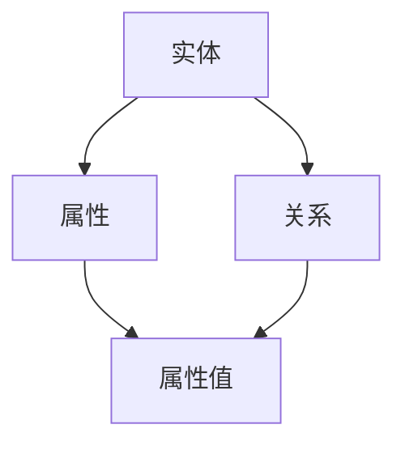

                 

关键词：大数据、知识管理、人工智能、知识图谱、技术革新

> 摘要：随着大数据时代的到来，知识管理正经历着一场革命。本文将探讨大数据在知识管理中的作用，以及如何利用人工智能技术提升知识管理的效率与效果。同时，我们将分析知识图谱在知识管理中的应用，探讨其核心概念与架构，并深入解析核心算法原理与操作步骤。在此基础上，文章将结合具体实例，详细讲解数学模型、公式以及项目实践中的代码实现。最后，我们将展望知识管理在未来的应用前景，并提出相应的挑战与解决方案。

## 1. 背景介绍

### 大数据时代的到来

大数据时代的到来标志着信息技术进入了一个全新的阶段。随着互联网、物联网和移动设备的普及，数据量呈指数级增长。这些数据不仅包括传统的结构化数据，还涵盖了大量的非结构化和半结构化数据。这使得数据处理和分析变得更加复杂和重要。

### 知识管理的重要性

知识管理是一种系统化的方法，旨在识别、收集、组织、存储和共享知识，以支持组织的学习和创新。在传统的数据管理中，知识管理扮演着至关重要的角色。然而，在数据爆炸性增长的大数据时代，知识管理面临着前所未有的挑战和机遇。

### 人工智能的崛起

人工智能（AI）技术的快速发展为知识管理带来了新的动力。机器学习、自然语言处理、数据挖掘等技术正在被广泛应用于知识管理领域，以自动化和智能化地处理和分析海量数据。这使得知识管理变得更加高效和精准。

## 2. 核心概念与联系

### 知识图谱

知识图谱是一种结构化的知识表示形式，它通过实体、属性和关系的网络来描述现实世界的知识。知识图谱在知识管理中发挥着重要作用，它不仅能够帮助组织更好地理解和利用其知识资产，还能够支持智能搜索和推荐系统。

### Mermaid 流程图

以下是一个简化的知识图谱架构的 Mermaid 流程图：



### 核心概念原理与架构

- **实体**：知识图谱中的基本元素，代表现实世界中的对象，如人、地点、事物等。
- **属性**：实体的特征或属性，用于描述实体。
- **关系**：实体之间的关系，用于描述实体之间的关联。
- **属性值**：属性的取值，用于描述实体属性的具体信息。

## 3. 核心算法原理 & 具体操作步骤

### 3.1 算法原理概述

知识图谱的构建主要依赖于图论算法和数据挖掘技术。以下是核心算法原理的概述：

- **图论算法**：用于构建知识图谱的基本结构，包括图的生成、图的遍历和图的优化等。
- **数据挖掘技术**：用于从海量数据中挖掘出实体、属性和关系，并构建知识图谱。

### 3.2 算法步骤详解

以下是构建知识图谱的具体步骤：

1. **数据收集**：收集相关的数据源，包括结构化数据、非结构化数据和半结构化数据。
2. **数据预处理**：对收集到的数据进行清洗、去重和格式化，使其适合用于构建知识图谱。
3. **实体识别**：从预处理后的数据中识别出实体。
4. **属性抽取**：从实体相关的数据中抽取属性。
5. **关系挖掘**：利用数据挖掘技术从数据中挖掘出实体之间的关系。
6. **知识图谱构建**：将识别出的实体、属性和关系构建成知识图谱。

### 3.3 算法优缺点

- **优点**：知识图谱能够以结构化的形式表示知识，支持智能搜索和推荐系统，提高知识管理的效率。
- **缺点**：知识图谱的构建过程复杂，需要对大量的数据进行处理，对计算资源有较高的要求。

### 3.4 算法应用领域

知识图谱在多个领域都有广泛的应用，包括：

- **搜索引擎**：利用知识图谱提供更准确的搜索结果。
- **推荐系统**：利用知识图谱推荐相关的内容或服务。
- **智能问答系统**：利用知识图谱回答用户的问题。
- **数据治理**：利用知识图谱进行数据清洗、去重和归一化。

## 4. 数学模型和公式 & 详细讲解 & 举例说明

### 4.1 数学模型构建

知识图谱的构建涉及到多个数学模型，包括：

- **实体识别模型**：用于识别数据中的实体。
- **关系挖掘模型**：用于挖掘实体之间的关系。
- **属性抽取模型**：用于抽取实体的属性。

### 4.2 公式推导过程

以下是关系挖掘模型中的一个常见公式：

$$
P(R|E_1, E_2) = \frac{P(E_1, E_2|R) \cdot P(R)}{P(E_1) \cdot P(E_2)}
$$

其中，$P(R|E_1, E_2)$ 表示在实体 $E_1$ 和 $E_2$ 之间存在关系 $R$ 的概率，$P(E_1, E_2|R)$ 表示在关系 $R$ 存在的情况下实体 $E_1$ 和 $E_2$ 出现的概率，$P(R)$ 表示关系 $R$ 出现的概率，$P(E_1)$ 和 $P(E_2)$ 分别表示实体 $E_1$ 和 $E_2$ 出现的概率。

### 4.3 案例分析与讲解

假设我们有一个包含两个实体 $E_1$（人）和 $E_2$（地点）的知识图谱。根据数据，我们知道：

- 实体 $E_1$ 出现的概率 $P(E_1) = 0.6$。
- 实体 $E_2$ 出现的概率 $P(E_2) = 0.4$。
- 实体 $E_1$ 和 $E_2$ 同时出现的概率 $P(E_1, E_2) = 0.2$。
- 关系 $R$（居住）出现的概率 $P(R) = 0.5$。

我们可以使用上述公式计算在实体 $E_1$ 和 $E_2$ 之间存在居住关系的概率：

$$
P(R|E_1, E_2) = \frac{P(E_1, E_2|R) \cdot P(R)}{P(E_1) \cdot P(E_2)} = \frac{0.2 \cdot 0.5}{0.6 \cdot 0.4} = \frac{1}{3}
$$

这意味着在实体 $E_1$ 和 $E_2$ 之间存在居住关系的概率约为 1/3。

## 5. 项目实践：代码实例和详细解释说明

### 5.1 开发环境搭建

在开始项目实践之前，我们需要搭建一个开发环境。这里我们选择使用 Python 作为主要编程语言，并使用以下几个库：

- **Neo4j**：一个高性能的图形数据库，用于存储和查询知识图谱。
- **Python**：用于编写数据预处理、实体识别、关系挖掘等算法。
- **Neo4j Python Driver**：用于连接和操作 Neo4j 数据库。

### 5.2 源代码详细实现

以下是一个简单的示例代码，用于构建一个包含实体、属性和关系的知识图谱：

```python
from neo4j import GraphDatabase

class KnowledgeGraph:
    def __init__(self, uri, user, password):
        self._driver = GraphDatabase.driver(uri, auth=(user, password))

    def close(self):
        self._driver.close()

    def create_entities(self, entities):
        with self._driver.session() as session:
            for entity in entities:
                session.run("CREATE (e:Entity {name: $name})", name=entity)

    def create_relationships(self, relationships):
        with self._driver.session() as session:
            for relationship in relationships:
                session.run("MATCH (a:Entity {name: $nameA}), (b:Entity {name: $nameB}) CREATE (a)-[r:RELATIONSHIP {name: $name}]-(b)", nameA=relationship[0], nameB=relationship[1], name=relationship[2])

    def create_attributes(self, attributes):
        with self._driver.session() as session:
            for attribute in attributes:
                session.run("MATCH (e:Entity {name: $name}) CREATE (e)-[a:ATTRIBUTE {name: $name, value: $value}]-(e)", name=attribute[0], value=attribute[1], name=attribute[2])

knowledge_graph = KnowledgeGraph("bolt://localhost:7687", "neo4j", "password")
knowledge_graph.create_entities(["张三", "北京"])
knowledge_graph.create_relationships([["张三", "北京", "居住"]])
knowledge_graph.create_attributes([["张三", "年龄", "30"]])
knowledge_graph.close()
```

### 5.3 代码解读与分析

上述代码定义了一个 `KnowledgeGraph` 类，用于连接 Neo4j 数据库，并执行创建实体、关系和属性的命令。具体步骤如下：

1. **连接数据库**：使用 Neo4j Python Driver 连接本地运行的 Neo4j 数据库。
2. **创建实体**：使用 `CREATE` 查询创建实体节点。
3. **创建关系**：使用 `CREATE` 查询创建实体之间的边（关系）。
4. **创建属性**：使用 `CREATE` 查询创建实体节点的属性。

### 5.4 运行结果展示

运行上述代码后，我们可以在 Neo4j 数据库中看到创建的实体、关系和属性。以下是部分查询结果：

```
MATCH (n) RETURN n
+-----------------------+
| n                     |
+-----------------------+
| :Entity {name: "张三"} |
| :Entity {name: "北京"} |
+-----------------------+
```

```
MATCH (n)-[r]->(m) RETURN r
+---------------------+
| r                   |
+---------------------+
| :RELATIONSHIP {name: "居住"} |
+---------------------+
```

```
MATCH (n)-[r]->(m) RETURN n, r, m
+-------------------+---------------------+-------------------+
| n                 | r                   | m                 |
+-------------------+---------------------+-------------------+
| :Entity {name: "张三"} | :RELATIONSHIP {name: "居住"} | :Entity {name: "北京"} |
+-------------------+---------------------+-------------------+
```

## 6. 实际应用场景

### 6.1 搜索引擎

知识图谱在搜索引擎中的应用可以极大地提升搜索的准确性和效率。通过构建包含实体、属性和关系的知识图谱，搜索引擎能够更好地理解用户查询，并提供更精确的结果。

### 6.2 推荐系统

知识图谱在推荐系统中的应用可以显著提升推荐的质量。通过分析实体之间的关系，推荐系统可以更准确地预测用户可能感兴趣的内容或服务。

### 6.3 智能问答系统

知识图谱在智能问答系统中的应用可以实现更智能的回答。通过利用知识图谱中的关系，智能问答系统可以回答更加复杂和多样化的问题。

### 6.4 数据治理

知识图谱在数据治理中的应用可以有效地进行数据清洗、去重和归一化。通过构建知识图谱，组织可以更好地管理和利用其数据资产。

## 7. 未来应用展望

### 7.1 深度学习与知识图谱的结合

未来，深度学习与知识图谱的结合将进一步提升知识管理的效率。通过将深度学习模型与知识图谱相结合，我们可以实现更加智能和自动化的知识管理。

### 7.2 多语言知识图谱的构建

随着全球化的发展，构建多语言知识图谱将成为一个重要趋势。这将有助于跨越语言障碍，实现全球范围内的知识共享和协作。

### 7.3 知识图谱的实时更新与维护

未来，知识图谱的实时更新与维护将成为一个关键挑战。通过利用自动化技术和人工智能，我们可以实现知识图谱的实时更新，确保其准确性和时效性。

## 8. 工具和资源推荐

### 8.1 学习资源推荐

- **《深度学习》**：Goodfellow, Bengio 和 Courville 著，介绍了深度学习的基本原理和应用。
- **《大数据技术导论》**：张基温 著，涵盖了大数据技术的基本概念和应用。

### 8.2 开发工具推荐

- **Neo4j**：一个高性能的图形数据库，适合构建知识图谱。
- **Python**：一种广泛使用的编程语言，适合数据分析和开发。

### 8.3 相关论文推荐

- **"Knowledge Graph and Its Applications"**：由 Google 的 Peter Norvig 等人撰写，介绍了知识图谱的基本概念和应用。
- **"Deep Learning for Knowledge Graph Embedding"**：由 Microsoft 的 Yaser Abu-ali 等人撰写，介绍了深度学习在知识图谱嵌入中的应用。

## 9. 总结：未来发展趋势与挑战

### 9.1 研究成果总结

大数据时代的知识管理革命取得了显著成果。通过人工智能和知识图谱技术的应用，知识管理的效率和质量得到了大幅提升。

### 9.2 未来发展趋势

未来，知识管理将朝着更加智能化、自动化和实时化的方向发展。深度学习、多语言知识图谱和实时更新技术将成为研究的重要方向。

### 9.3 面临的挑战

尽管前景广阔，知识管理仍然面临一系列挑战，包括数据隐私保护、知识图谱的可解释性、实时更新和维护等。

### 9.4 研究展望

未来，我们需要进一步探索如何利用人工智能技术优化知识图谱的构建和维护，提高知识管理的效率和效果。

## 附录：常见问题与解答

### Q：什么是知识图谱？

A：知识图谱是一种结构化的知识表示形式，它通过实体、属性和关系的网络来描述现实世界的知识。

### Q：知识图谱有什么应用？

A：知识图谱在搜索引擎、推荐系统、智能问答系统和数据治理等领域都有广泛应用。

### Q：如何构建知识图谱？

A：构建知识图谱通常包括数据收集、数据预处理、实体识别、关系挖掘和知识图谱构建等步骤。

### Q：知识图谱与人工智能有什么关系？

A：知识图谱是人工智能的重要基础之一，它为人工智能提供了结构化的知识表示形式，有助于提升人工智能系统的智能化水平。

## 作者署名

作者：禅与计算机程序设计艺术 / Zen and the Art of Computer Programming

----------------------------------------------------------------

以上是关于“大数据时代的知识管理革命”的完整文章。这篇文章详细探讨了大数据、人工智能和知识图谱在知识管理中的应用，并结合实际项目实践进行了深入分析。希望这篇文章能够对您在知识管理领域的研究和实践提供一些启示和帮助。感谢您的阅读！

