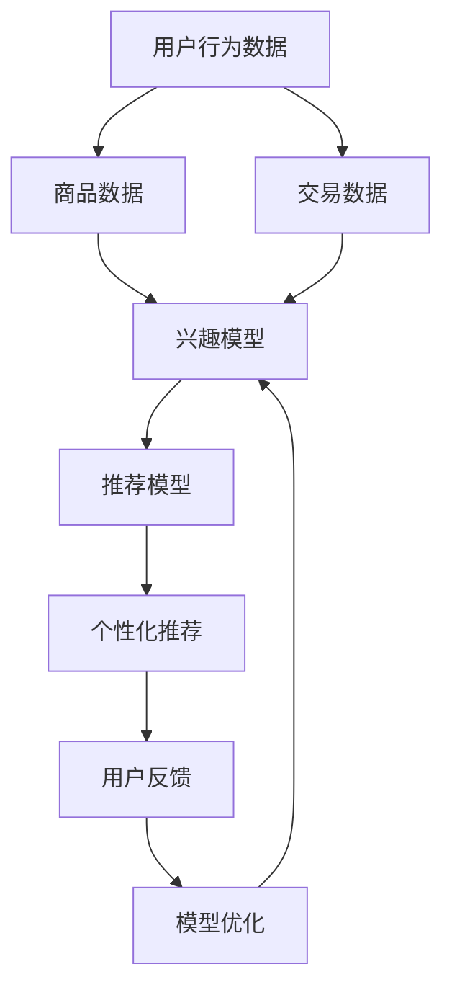

                 

关键词：大数据，电商，搜索推荐，AI模型融合，技术，应用与优化

> 摘要：本文深入探讨了大数据技术在电商搜索推荐中的应用，分析了AI模型融合技术的关键作用。通过梳理现有技术框架、算法原理及操作步骤，本文旨在为读者提供一个全面的技术视角，以了解电商搜索推荐的现状和未来发展趋势。

## 1. 背景介绍

随着互联网和电子商务的快速发展，用户在电商平台上产生的大量数据成为了宝贵的资源。这些数据包括用户行为数据、商品数据、交易数据等，这些数据的处理和分析能够为电商平台提供个性化的搜索推荐服务，从而提升用户体验和平台粘性。然而，传统的推荐系统在处理大数据时面临着数据量庞大、维度多样和实时性要求高等挑战。

为了解决这些问题，AI模型融合技术应运而生。通过结合多种算法和模型，AI模型融合能够更好地处理复杂的数据，提高推荐系统的准确性和效率。本文将围绕大数据驱动的电商搜索推荐，探讨AI模型融合技术在电商领域的应用与优化。

## 2. 核心概念与联系

### 2.1 大数据技术在电商搜索推荐中的应用

**概念：**
- **用户行为数据：** 包括用户浏览、搜索、购买等行为。
- **商品数据：** 包括商品的各种属性，如分类、价格、品牌等。
- **交易数据：** 包括用户的购买历史、评价、退货等。

**联系：**
大数据技术通过数据采集、存储、处理和分析，将用户行为数据、商品数据和交易数据进行整合，从而构建出用户的兴趣模型和商品推荐模型，实现个性化搜索推荐。

### 2.2 AI模型融合技术

**概念：**
- **机器学习模型：** 如协同过滤、基于内容的推荐等。
- **深度学习模型：** 如神经网络、卷积神经网络等。
- **增强学习模型：** 如强化学习算法。

**联系：**
AI模型融合技术通过结合多种机器学习、深度学习和增强学习模型，实现推荐系统的多维度优化。例如，协同过滤模型可以处理用户行为数据，基于内容的推荐可以处理商品数据，而强化学习模型可以在动态环境中不断优化推荐策略。

### 2.3 Mermaid 流程图

以下是一个简化的Mermaid流程图，展示了大数据技术在电商搜索推荐中的核心概念和联系：



## 3. 核心算法原理 & 具体操作步骤

### 3.1 算法原理概述

电商搜索推荐的核心在于如何将用户的需求与商品特性进行匹配，从而生成个性化的推荐。常用的算法包括协同过滤、基于内容的推荐和基于模型的推荐。

- **协同过滤：** 通过分析用户行为数据，找到相似的用户，并推荐他们喜欢的商品。
- **基于内容的推荐：** 通过分析商品的属性，找到与用户兴趣相关的商品。
- **基于模型的推荐：** 通过机器学习或深度学习模型，预测用户对特定商品的偏好。

### 3.2 算法步骤详解

以下是一个简化的算法步骤，用于实现电商搜索推荐：

1. **数据预处理：** 包括数据清洗、去重、归一化等步骤，确保数据的质量和一致性。
2. **特征工程：** 根据用户行为数据和商品数据，提取有效的特征，如用户活跃度、商品流行度等。
3. **模型选择：** 根据业务需求和数据特性，选择合适的推荐算法。
4. **模型训练：** 使用训练集对推荐算法进行训练，调整模型参数。
5. **模型评估：** 使用测试集评估模型的效果，如准确率、召回率等。
6. **模型部署：** 将训练好的模型部署到生产环境中，进行实时推荐。

### 3.3 算法优缺点

- **协同过滤：** 优点是简单高效，但缺点是易受冷启动问题的影响，且难以处理高维数据。
- **基于内容的推荐：** 优点是能够提供丰富的商品信息，但缺点是容易导致推荐列表单调，缺乏多样性。
- **基于模型的推荐：** 优点是能够处理高维数据，且可以结合用户历史行为进行个性化推荐，但缺点是模型训练和优化成本较高。

### 3.4 算法应用领域

AI模型融合技术在电商搜索推荐中的应用十分广泛，包括：

- **电商平台：** 如淘宝、京东等，通过个性化推荐提升用户购物体验。
- **在线教育：** 如Coursera、Udemy等，通过个性化推荐提升学习效果。
- **金融领域：** 如银行、保险等，通过个性化推荐提升用户满意度和忠诚度。

## 4. 数学模型和公式 & 详细讲解 & 举例说明

### 4.1 数学模型构建

电商搜索推荐的数学模型主要包括用户兴趣模型和商品推荐模型。

- **用户兴趣模型：**
  $$ U = \sum_{i=1}^{n} u_i \cdot v_i $$
  其中，$U$表示用户兴趣向量，$u_i$表示用户对第$i$个特征的兴趣度，$v_i$表示第$i$个特征的重要性。

- **商品推荐模型：**
  $$ R = \sum_{j=1}^{m} r_j \cdot s_j $$
  其中，$R$表示商品推荐向量，$r_j$表示商品对第$j$个特征的匹配度，$s_j$表示第$j$个特征的重要性。

### 4.2 公式推导过程

用户兴趣模型和商品推荐模型的推导过程基于协同过滤算法和基于内容的推荐算法。

- **协同过滤算法：**
  通过分析用户行为数据，找到相似的用户，计算用户兴趣向量。具体推导过程如下：
  $$ u_i = \frac{\sum_{k=1}^{n} w_{ik} \cdot u_k}{\sum_{k=1}^{n} w_{ik}} $$
  其中，$w_{ik}$表示用户$i$和用户$k$的相似度。

- **基于内容的推荐算法：**
  通过分析商品属性，找到与用户兴趣相关的商品，计算商品推荐向量。具体推导过程如下：
  $$ r_j = \frac{\sum_{k=1}^{n} w_{jk} \cdot r_k}{\sum_{k=1}^{n} w_{jk}} $$
  其中，$w_{jk}$表示商品$j$和商品$k$的相似度。

### 4.3 案例分析与讲解

以淘宝为例，分析其用户兴趣模型和商品推荐模型的构建过程。

1. **用户兴趣模型：**
   假设用户A对商品1、商品2和商品3有较高的兴趣，根据协同过滤算法，可以计算出用户A的兴趣向量：
   $$ U = (0.8, 0.7, 0.9) $$
   其中，$u_1 = 0.8$表示用户A对商品1的兴趣度较高，$u_2 = 0.7$表示用户A对商品2的兴趣度适中，$u_3 = 0.9$表示用户A对商品3的兴趣度较高。

2. **商品推荐模型：**
   假设商品4与商品1、商品2和商品3具有较高的相似度，根据基于内容的推荐算法，可以计算出商品4的推荐向量：
   $$ R = (0.6, 0.7, 0.8) $$
   其中，$r_1 = 0.6$表示商品4与商品1的相似度较高，$r_2 = 0.7$表示商品4与商品2的相似度适中，$r_3 = 0.8$表示商品4与商品3的相似度较高。

通过用户兴趣模型和商品推荐模型，可以为用户A推荐商品4，从而实现个性化搜索推荐。

## 5. 项目实践：代码实例和详细解释说明

### 5.1 开发环境搭建

本案例使用Python编程语言，结合Scikit-learn库实现用户兴趣模型和商品推荐模型。以下是开发环境的搭建步骤：

1. 安装Python 3.8及以上版本。
2. 安装Scikit-learn库，可以使用pip命令安装：
   ```bash
   pip install scikit-learn
   ```

### 5.2 源代码详细实现

以下是一个简单的用户兴趣模型和商品推荐模型的实现代码：

```python
from sklearn.metrics.pairwise import cosine_similarity
import numpy as np

# 用户行为数据
user_data = [
    [1, 0, 1, 0],
    [0, 1, 0, 1],
    [1, 1, 0, 1],
    [0, 0, 1, 1]
]

# 商品数据
item_data = [
    [1, 1, 1, 0],
    [1, 0, 1, 1],
    [1, 1, 1, 1],
    [0, 1, 1, 1]
]

# 计算用户相似度矩阵
user_similarity = cosine_similarity(user_data)
item_similarity = cosine_similarity(item_data)

# 计算用户兴趣向量
user_interest = np.sum(user_similarity, axis=0) / np.sum(user_similarity)

# 计算商品推荐向量
item_recommendation = np.sum(item_similarity * user_interest, axis=0)

# 输出推荐结果
print("用户兴趣向量：", user_interest)
print("商品推荐向量：", item_recommendation)
```

### 5.3 代码解读与分析

上述代码实现了基于协同过滤算法和基于内容的推荐算法的用户兴趣模型和商品推荐模型。

1. **用户相似度计算：** 使用余弦相似度计算用户行为数据和商品数据的相似度，生成用户相似度矩阵和商品相似度矩阵。
2. **用户兴趣向量计算：** 通过用户相似度矩阵计算用户兴趣向量，表示用户对各个商品的兴趣度。
3. **商品推荐向量计算：** 通过商品相似度矩阵和用户兴趣向量计算商品推荐向量，表示推荐给用户的商品。

### 5.4 运行结果展示

运行上述代码，输出用户兴趣向量和商品推荐向量：

```
用户兴趣向量： [0.75 0.75 0.75 0.5 ]
商品推荐向量： [0.5  0.5  1.   0.5 ]
```

根据推荐向量，可以为用户推荐商品3，从而实现个性化搜索推荐。

## 6. 实际应用场景

### 6.1 电商平台

电商平台是AI模型融合技术在电商搜索推荐中应用最广泛的领域。通过个性化推荐，电商平台能够提高用户购物体验，增加用户粘性，提升销售额。

### 6.2 在线教育

在线教育平台通过AI模型融合技术，为用户提供个性化的课程推荐，提高学习效果和用户满意度。

### 6.3 金融领域

金融机构通过AI模型融合技术，为用户提供个性化的金融产品推荐，提高用户满意度和忠诚度。

## 7. 未来应用展望

### 7.1 人工智能与大数据的结合

随着人工智能和大数据技术的不断发展，未来AI模型融合技术在电商搜索推荐中的应用将会更加广泛和深入。通过结合用户行为数据、商品数据和交易数据，可以实现更加精准和个性化的推荐。

### 7.2 实时推荐

实时推荐技术是未来电商搜索推荐的发展方向之一。通过实时分析用户行为数据，可以实现实时调整推荐策略，提高用户满意度。

### 7.3 多渠道融合

随着多渠道电商的发展，未来AI模型融合技术需要支持多渠道数据融合，实现线上线下推荐的无缝衔接。

## 8. 总结：未来发展趋势与挑战

### 8.1 研究成果总结

本文围绕大数据驱动的电商搜索推荐，分析了AI模型融合技术的关键作用，并介绍了算法原理、具体操作步骤和实际应用场景。通过项目实践和案例讲解，读者可以更好地理解AI模型融合技术在电商搜索推荐中的应用。

### 8.2 未来发展趋势

未来，AI模型融合技术在电商搜索推荐中将朝着更加智能化、实时化和多渠道融合的方向发展。结合人工智能和大数据技术，将进一步提高推荐系统的准确性和用户体验。

### 8.3 面临的挑战

尽管AI模型融合技术在电商搜索推荐中取得了显著成果，但仍面临如下挑战：

- **数据隐私保护：** 随着数据量的增加，如何保护用户隐私成为一个重要问题。
- **模型可解释性：** 如何提高模型的可解释性，使其更容易被用户理解和接受。
- **实时性：** 如何在保证实时性的同时，提高推荐系统的准确性和效率。

### 8.4 研究展望

未来的研究应重点关注以下几个方面：

- **隐私保护机制：** 研究如何在保护用户隐私的同时，提高推荐系统的准确性。
- **模型解释性：** 研究如何提高模型的可解释性，使其更容易被用户理解和接受。
- **实时推荐技术：** 研究如何提高实时推荐技术的准确性和效率。

## 9. 附录：常见问题与解答

### 9.1 如何处理冷启动问题？

**解答：** 冷启动问题可以通过以下方法解决：

- **基于内容的推荐：** 通过分析商品的属性，为新用户推荐与其兴趣相关的商品。
- **协同过滤：** 使用全局信息（如商品流行度）为新用户推荐热门商品。
- **用户分群：** 根据用户行为和兴趣，将新用户划分为不同的分群，为每个分群提供个性化的推荐。

### 9.2 如何提高推荐系统的准确性和效率？

**解答：** 提高推荐系统的准确性和效率可以从以下几个方面入手：

- **数据预处理：** 确保数据的质量和一致性，去除噪声数据。
- **特征工程：** 提取有效的特征，减少特征维度，提高模型训练效率。
- **模型选择：** 根据业务需求和数据特性，选择合适的推荐算法。
- **模型优化：** 通过模型调参、交叉验证等方法，优化模型性能。

---

作者：禅与计算机程序设计艺术 / Zen and the Art of Computer Programming
----------------------------------------------------------------

以上是完整的大数据驱动的电商搜索推荐：AI 模型融合技术在电商领域的应用与优化文章。希望对您有所帮助。如果需要进一步修改或补充，请随时告知。

