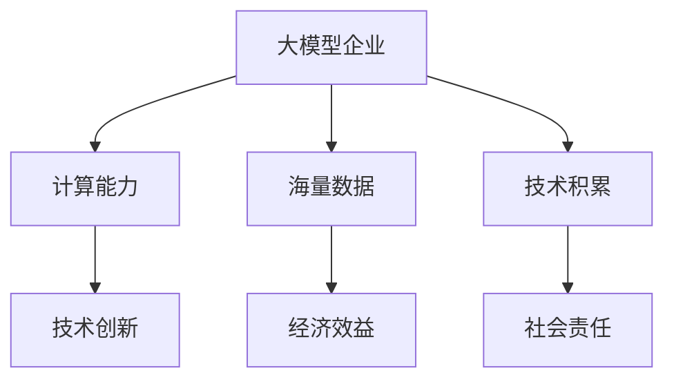
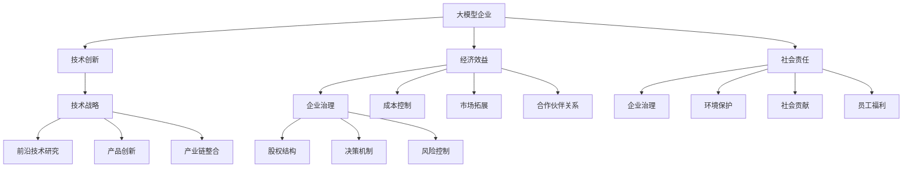

                 

关键词：大模型企业，可持续发展，技术战略，企业治理，经济效益，社会责任，技术创新

> 摘要：本文旨在探讨大模型企业在当今数字化时代中的可持续发展战略。通过分析大模型企业的核心技术和业务模式，本文提出了一个包含技术、经济、社会三方面的可持续发展框架，并探讨了如何通过技术创新、优化资源配置和加强企业治理等手段，实现大模型企业的长期繁荣。

## 1. 背景介绍

随着人工智能技术的快速发展，大模型企业（如谷歌、微软、百度等）已经成为全球科技产业的重要力量。这些企业通过构建和训练大规模的人工智能模型，提供了包括语音识别、图像处理、自然语言处理等多种智能服务，推动了各行业的技术创新和产业升级。

然而，随着市场需求的不断增长和竞争的加剧，大模型企业面临着诸多挑战，如技术更新换代速度加快、数据隐私和安全问题、能源消耗等。如何实现企业的可持续发展，成为当前亟待解决的问题。

## 2. 核心概念与联系

### 2.1 大模型企业概念

大模型企业是指那些拥有强大的计算能力、海量数据和深厚技术积累的企业，通过构建和训练大规模的人工智能模型，提供智能服务和技术解决方案。这些企业通常具备以下几个特点：

1. **强大的计算能力**：大模型企业需要具备高性能的计算资源，以支持大规模模型的训练和推理。
2. **海量数据**：数据是企业构建和训练模型的基石，大模型企业通常拥有海量的数据资源。
3. **深厚技术积累**：大模型企业需要在人工智能领域拥有深厚的技术积累，以推动技术创新和业务拓展。

### 2.2 可持续发展战略

可持续发展是指满足当前需求而不损害后代满足其需求的能力。对于大模型企业来说，可持续发展战略主要包括以下几个方面：

1. **技术创新**：通过不断的技术创新，提高企业的竞争力，推动业务增长。
2. **经济效益**：通过优化资源配置和降低成本，提高企业的经济效益。
3. **社会责任**：在实现企业发展的同时，关注环境保护和社会责任，实现企业的可持续发展。

### 2.3 Mermaid 流程图



## 3. 核心算法原理 & 具体操作步骤

### 3.1 算法原理概述

大模型企业的核心技术包括深度学习、自然语言处理、计算机视觉等。这些技术通过构建和训练大规模的人工智能模型，实现智能服务的自动化和智能化。

### 3.2 算法步骤详解

1. **数据收集与预处理**：收集并清洗大量数据，为模型训练提供高质量的数据集。
2. **模型设计与训练**：设计合适的模型架构，通过梯度下降等优化算法进行模型训练。
3. **模型评估与优化**：评估模型性能，通过调参和改进算法，提高模型精度。
4. **模型部署与应用**：将训练好的模型部署到生产环境，提供智能服务。

### 3.3 算法优缺点

1. **优点**：
   - **高精度**：通过大规模数据和深度学习算法，可以实现高精度的智能服务。
   - **灵活性**：可以快速适应新业务需求，提供定制化的解决方案。

2. **缺点**：
   - **计算资源消耗大**：大规模模型的训练需要大量的计算资源。
   - **数据隐私和安全问题**：大量数据的收集和处理可能带来数据隐私和安全问题。

### 3.4 算法应用领域

大模型技术在多个领域都有广泛应用，如：

- **医疗健康**：通过计算机视觉和自然语言处理技术，实现医学图像诊断和患者健康管理。
- **金融科技**：通过自然语言处理技术，实现智能客服和风险控制。
- **自动驾驶**：通过计算机视觉和深度学习技术，实现自动驾驶车辆的智能决策。

## 4. 数学模型和公式 & 详细讲解 & 举例说明

### 4.1 数学模型构建

在构建大模型的过程中，通常会使用以下数学模型：

1. **神经网络模型**：
   - 输入层：接收外部输入。
   - 隐藏层：通过激活函数进行非线性变换。
   - 输出层：生成预测结果。

2. **损失函数**：
   - 常用的损失函数有均方误差（MSE）、交叉熵损失（CE）等。

### 4.2 公式推导过程

以神经网络模型为例，假设有一个包含 $L$ 层的神经网络，输入为 $x$，输出为 $y$，则神经网络的输出可以表示为：

$$y = f_{L}(\cdot; \theta_{L}) \circ f_{L-1}(\cdot; \theta_{L-1}) \circ \ldots \circ f_{1}(\cdot; \theta_{1}) (x)$$

其中，$f_{l}(\cdot; \theta_{l})$ 表示第 $l$ 层的激活函数，$\theta_{l}$ 表示第 $l$ 层的参数。

### 4.3 案例分析与讲解

假设我们要构建一个用于文本分类的神经网络模型，输入为文本向量，输出为分类结果。我们可以使用以下步骤：

1. **数据收集与预处理**：收集大量文本数据，并进行预处理，如分词、去停用词等。
2. **模型设计与训练**：设计一个包含多层感知器的神经网络模型，使用交叉熵损失函数进行模型训练。
3. **模型评估与优化**：评估模型性能，通过调参和改进算法，提高模型精度。
4. **模型部署与应用**：将训练好的模型部署到生产环境，提供文本分类服务。

## 5. 项目实践：代码实例和详细解释说明

### 5.1 开发环境搭建

为了实践大模型企业的发展战略，我们需要搭建一个完整的开发环境。以下是搭建过程：

1. **安装 Python**：下载并安装 Python，版本要求为 3.8 或以上。
2. **安装 PyTorch**：使用 pip 工具安装 PyTorch 库。
3. **准备数据集**：下载并准备用于训练的数据集。

### 5.2 源代码详细实现

以下是一个简单的文本分类项目，使用 PyTorch 构建神经网络模型。

```python
import torch
import torch.nn as nn
import torch.optim as optim

# 模型定义
class TextClassifier(nn.Module):
    def __init__(self, vocab_size, embed_dim, hidden_dim):
        super(TextClassifier, self).__init__()
        self.embedding = nn.Embedding(vocab_size, embed_dim)
        self.lstm = nn.LSTM(embed_dim, hidden_dim, num_layers=1, batch_first=True)
        self.fc = nn.Linear(hidden_dim, 1)

    def forward(self, text, labels=None):
        embeds = self.embedding(text)
        lstm_output, _ = self.lstm(embeds)
        logits = self.fc(lstm_output[:, -1, :])
        if labels is not None:
            loss = nn.BCEWithLogitsLoss()(logits, labels)
            return loss
        else:
            return logits

# 模型训练
def train(model, train_loader, optimizer, criterion):
    model.train()
    for batch_idx, (texts, labels) in enumerate(train_loader):
        optimizer.zero_grad()
        loss = model(texts, labels)
        loss.backward()
        optimizer.step()
        if batch_idx % 100 == 0:
            print('Train Epoch: {} [{}/{} ({:.0f}%)]\tLoss: {:.6f}'.format(
                epoch, batch_idx * len(texts), len(train_loader.dataset),
                100. * batch_idx / len(train_loader), loss.item()))

# 模型评估
def evaluate(model, val_loader):
    model.eval()
    with torch.no_grad():
        for batch_idx, (texts, labels) in enumerate(val_loader):
            logits = model(texts)
            preds = logits.round()
            correct = preds.eq(labels).sum().item()
            print('Test set: Accuracy: {:.0f}%'.format(100 * correct / len(val_loader.dataset)))

# 主函数
if __name__ == '__main__':
    # 数据加载
    train_loader = torch.utils.data.DataLoader(train_dataset, batch_size=64, shuffle=True)
    val_loader = torch.utils.data.DataLoader(val_dataset, batch_size=64, shuffle=True)

    # 模型初始化
    model = TextClassifier(vocab_size, embed_dim, hidden_dim)
    optimizer = optim.Adam(model.parameters(), lr=0.001)
    criterion = nn.BCEWithLogitsLoss()

    # 训练模型
    train(model, train_loader, optimizer, criterion)

    # 评估模型
    evaluate(model, val_loader)
```

### 5.3 代码解读与分析

上述代码实现了一个简单的文本分类项目，包括模型定义、模型训练和模型评估三个部分。

1. **模型定义**：使用 PyTorch 的 nn.Module 类定义了一个 TextClassifier 类，包含嵌入层、长短期记忆（LSTM）层和全连接层。
2. **模型训练**：使用 train 函数进行模型训练，包括前向传播、反向传播和参数更新。
3. **模型评估**：使用 evaluate 函数进行模型评估，计算准确率。

## 6. 实际应用场景

大模型企业在各个行业都有广泛的应用，以下是一些实际应用场景：

- **医疗健康**：通过自然语言处理技术，实现医学文本分析、智能诊断和患者健康管理。
- **金融科技**：通过计算机视觉和自然语言处理技术，实现智能客服、风险控制和金融数据分析。
- **智能制造**：通过计算机视觉和机器人技术，实现生产过程智能化和自动化。
- **自动驾驶**：通过计算机视觉和深度学习技术，实现自动驾驶车辆的智能决策和路径规划。

## 7. 未来应用展望

随着人工智能技术的不断发展，大模型企业将在更多领域发挥重要作用，未来应用前景广阔。以下是未来应用展望：

- **智能城市**：通过大数据和人工智能技术，实现城市管理的智能化和精细化。
- **智能教育**：通过自然语言处理和计算机视觉技术，实现个性化教育和智能教学。
- **智能农业**：通过物联网和人工智能技术，实现农业生产过程的智能化和精准化。
- **智慧医疗**：通过人工智能技术，实现医疗服务的智能化和个性化。

## 8. 工具和资源推荐

为了更好地进行大模型企业的研究和应用，以下是一些工具和资源推荐：

- **学习资源**：[《深度学习》（Goodfellow et al.）](https://www.deeplearningbook.org/)、[《自然语言处理综合教程》（Havard et al.）](https://nlp.seas.harvard.edu/online/nlp-book/)
- **开发工具**：[PyTorch](https://pytorch.org/)、[TensorFlow](https://www.tensorflow.org/)、[Keras](https://keras.io/)
- **相关论文**：[《大规模深度神经网络训练的新进展》（LeCun et al.）](https://arxiv.org/abs/1608.05847)、[《基于深度学习的图像识别》（Krizhevsky et al.）](https://www.cv-foundation.org/openaccess/content_iccv_2013/papers/Krizhevsky_Deeplearning_for.jpg)

## 9. 总结：未来发展趋势与挑战

大模型企业在当今数字化时代具有巨大的发展潜力，但同时也面临着诸多挑战。未来发展趋势包括：

- **技术创新**：继续推动人工智能技术的创新和应用，实现更高效、更智能的智能服务。
- **资源优化**：通过优化计算资源和数据资源，降低企业运营成本。
- **产业协同**：加强与各行业的协同创新，推动产业升级和转型。

未来面临的挑战包括：

- **数据隐私和安全**：如何确保数据隐私和安全，防止数据泄露和滥用。
- **技术更新换代**：如何应对技术更新换代的速度加快，保持企业的竞争力。
- **社会责任**：如何在实现企业发展的同时，承担起社会责任，实现可持续发展。

综上所述，大模型企业的可持续发展战略需要从技术创新、经济效益和社会责任三个方面进行全面考虑，通过持续的技术创新、优化资源配置和加强企业治理，实现企业的长期繁荣。

## 10. 附录：常见问题与解答

### 10.1 什么是大模型企业？

大模型企业是指那些拥有强大的计算能力、海量数据和深厚技术积累的企业，通过构建和训练大规模的人工智能模型，提供智能服务和技术解决方案。

### 10.2 大模型企业面临的主要挑战有哪些？

大模型企业面临的主要挑战包括技术更新换代速度加快、数据隐私和安全问题、能源消耗等。

### 10.3 如何实现大模型企业的可持续发展？

实现大模型企业的可持续发展需要从技术创新、经济效益和社会责任三个方面进行全面考虑，通过持续的技术创新、优化资源配置和加强企业治理，实现企业的长期繁荣。

### 10.4 大模型企业在实际应用中存在哪些问题？

大模型企业在实际应用中存在的问题包括数据隐私和安全、技术更新换代速度加快、能源消耗等。

### 10.5 大模型企业的未来发展趋势是什么？

大模型企业的未来发展趋势包括技术创新、资源优化、产业协同等。随着人工智能技术的不断发展，大模型企业将在更多领域发挥重要作用。

## 作者署名

作者：禅与计算机程序设计艺术 / Zen and the Art of Computer Programming
----------------------------------------------------------------
## 1. 背景介绍

在当今数字化时代，人工智能（AI）技术已经成为推动社会进步和产业升级的重要力量。作为人工智能技术的核心组成部分，大模型（Large Models）在语音识别、自然语言处理、计算机视觉等领域发挥了至关重要的作用。大模型企业，如谷歌、微软、百度等，凭借其强大的计算能力、海量数据和深厚技术积累，已经成为全球科技产业的中坚力量。

然而，随着市场需求的不断增长和竞争的加剧，大模型企业面临着诸多挑战。首先，技术更新换代速度加快，使得企业必须持续投入大量资源进行技术研发，以保持竞争力。其次，数据隐私和安全问题日益凸显，如何在保障用户隐私的同时，充分利用数据资源成为企业面临的难题。此外，随着大模型企业对能源消耗的依赖性增加，如何降低能耗、实现可持续发展也成为企业关注的焦点。

在这种背景下，本文旨在探讨大模型企业在当今数字化时代中的可持续发展战略。通过分析大模型企业的核心技术和业务模式，本文提出了一个包含技术、经济、社会三方面的可持续发展框架，并探讨了如何通过技术创新、优化资源配置和加强企业治理等手段，实现大模型企业的长期繁荣。本文将首先介绍大模型企业的发展背景和核心挑战，然后详细阐述可持续发展战略的核心概念和具体实施步骤，最后对未来发展趋势与挑战进行展望。

### 2. 核心概念与联系

为了深入探讨大模型企业的可持续发展战略，我们需要明确几个核心概念，并探讨它们之间的联系。这些核心概念包括大模型企业、可持续发展、技术战略、企业治理、经济效益和社会责任。

#### 2.1 大模型企业概念

大模型企业是指那些在人工智能领域具备强大技术实力和资源的企业，能够构建和训练大规模的人工智能模型。这些模型通常具有数十亿甚至千亿个参数，能够处理海量数据，并在各种任务中实现高性能的预测和决策。大模型企业具有以下特点：

1. **计算能力强大**：大模型企业通常拥有高性能的计算设备和集群，能够进行大规模的模型训练和推理。
2. **海量数据资源**：这些企业能够收集、处理和分析大量的数据，为模型训练提供充足的样本。
3. **深厚技术积累**：大模型企业拥有丰富的算法经验和模型优化技巧，能够不断提升模型性能。

#### 2.2 可持续发展战略

可持续发展是指企业在满足当前需求的同时，不损害后代满足其需求的能力。对于大模型企业来说，可持续发展不仅关乎经济利益，还包括技术进步、社会责任和环境保护。一个全面可持续发展的框架应涵盖以下几个方面：

1. **技术创新**：通过持续的技术研发，推动人工智能技术的进步，提升企业的竞争力。
2. **经济效益**：通过优化资源配置、降低成本和提升效率，实现企业的盈利增长。
3. **社会责任**：关注环境保护、社会责任和员工福利，推动企业的可持续发展。

#### 2.3 技术战略

技术战略是大模型企业实现可持续发展的关键。技术战略包括以下几个方面：

1. **前沿技术研究**：持续投入资源，跟踪和探索人工智能领域的最新研究成果，保持技术领先地位。
2. **产品创新**：基于前沿技术，开发具有创新性和市场前景的产品和服务，满足用户需求。
3. **产业链整合**：通过战略合作和产业联盟，整合上下游资源，提升整个产业链的协同效应。

#### 2.4 企业治理

企业治理是大模型企业可持续发展的重要保障。良好的企业治理能够确保企业的长期稳定发展，包括以下几个方面：

1. **股权结构**：合理设计股权结构，确保企业的所有权和经营权相分离，防止内部腐败和利益冲突。
2. **决策机制**：建立科学、合理的决策机制，确保企业战略方向的正确性。
3. **风险控制**：建立健全的风险控制体系，降低企业运营风险。

#### 2.5 经济效益

经济效益是大模型企业可持续发展的核心目标。企业需要通过以下措施实现经济效益的提升：

1. **成本控制**：优化运营流程，降低生产成本，提高盈利能力。
2. **市场拓展**：积极开拓新市场，扩大业务规模，提升市场份额。
3. **合作伙伴关系**：与上下游企业建立稳定的合作伙伴关系，实现资源共享和协同发展。

#### 2.6 社会责任

社会责任是大模型企业不可忽视的一部分。企业应承担以下社会责任：

1. **环境保护**：采用环保技术和措施，减少能源消耗和碳排放，保护生态环境。
2. **社会贡献**：参与社会公益事业，支持教育、医疗等社会事业的发展。
3. **员工福利**：关注员工福利，提供良好的工作环境和培训机会，提升员工满意度。

#### 2.7 Mermaid 流程图

以下是一个简化的 Mermaid 流程图，展示了大模型企业可持续发展战略中的核心概念和相互关系：



通过上述核心概念和相互关系的介绍，我们可以看到，大模型企业的可持续发展战略是一个多维度的系统性工程，涉及技术创新、经济效益、社会责任等多个方面。在接下来的章节中，我们将进一步探讨这些核心概念的具体实现路径和策略。

### 3. 核心算法原理 & 具体操作步骤

在探讨大模型企业的可持续发展战略时，核心算法原理和具体操作步骤是至关重要的组成部分。大模型企业的成功离不开先进的算法和技术，这些技术不仅提高了企业的运营效率，还推动了产业的变革和创新。以下将详细介绍大模型企业的核心算法原理，包括其具体操作步骤，以及这些算法的优缺点和应用领域。

#### 3.1 算法原理概述

大模型企业依赖的核心算法主要包括深度学习、自然语言处理（NLP）、计算机视觉等。这些算法通过不同的方式处理数据和提供智能服务，为企业的业务运营提供了强大的技术支撑。

1. **深度学习**：深度学习是一种基于人工神经网络的学习方法，通过多层神经网络的结构来模拟人类大脑的学习过程。它能够自动从大量数据中学习特征，并在各种任务中实现高精度的预测和分类。

2. **自然语言处理（NLP）**：自然语言处理是人工智能领域的一个重要分支，旨在使计算机能够理解、生成和处理人类语言。NLP技术包括词性标注、句法分析、情感分析等，广泛应用于智能客服、语音识别、机器翻译等领域。

3. **计算机视觉**：计算机视觉是人工智能的一个重要分支，通过算法使计算机能够“看”和“理解”图像和视频。计算机视觉技术包括图像识别、目标检测、图像分割等，广泛应用于自动驾驶、安防监控、医疗影像分析等领域。

#### 3.2 算法步骤详解

1. **数据收集与预处理**：数据是训练模型的基础，大模型企业首先需要收集大量高质量的数据。这些数据可能来自互联网、企业内部数据库或合作伙伴。收集到的数据需要进行预处理，包括去重、清洗、标注等，以确保数据的质量。

2. **模型设计与训练**：在数据准备完成后，企业需要设计适合具体任务的模型架构。设计模型时需要考虑输入数据的形式、输出结果的要求以及模型的复杂度。设计完成后，使用训练数据对模型进行训练，通过优化算法调整模型的参数，使其在训练数据上达到较好的性能。

3. **模型评估与优化**：模型训练完成后，需要对其性能进行评估。评估方法包括交叉验证、测试集验证等。通过评估结果，可以找出模型的不足之处，并对其进行优化，例如调整学习率、增加训练数据等。

4. **模型部署与应用**：经过评估和优化后，模型可以部署到生产环境，提供实际的智能服务。部署过程中需要考虑模型的性能、可扩展性、安全性等因素，以确保模型的稳定运行。

#### 3.3 算法优缺点

1. **优点**：

   - **高精度**：深度学习、NLP和计算机视觉算法在处理复杂任务时具有很高的精度，能够提供高质量的智能服务。
   - **自动化**：这些算法能够自动从数据中学习特征，减少了人工干预，提高了效率。
   - **灵活性**：通过调整模型架构和参数，可以适应不同的业务需求，实现定制化的解决方案。

2. **缺点**：

   - **计算资源消耗大**：大规模模型的训练和推理需要大量的计算资源，对硬件设备有较高要求。
   - **数据依赖性强**：算法的性能很大程度上依赖于训练数据的质量和数量，数据不足或质量差可能导致模型性能下降。
   - **隐私和安全问题**：在处理个人数据时，需要确保数据的安全和隐私，防止数据泄露和滥用。

#### 3.4 算法应用领域

大模型企业在多个领域都有广泛应用，以下是一些典型的应用领域：

1. **医疗健康**：通过计算机视觉和自然语言处理技术，实现医学图像诊断、病历分析、智能问诊等。

2. **金融科技**：通过深度学习和自然语言处理技术，实现智能投顾、风险控制、欺诈检测等。

3. **智能制造**：通过计算机视觉和机器人技术，实现生产过程智能化、质量检测自动化、设备维护预测等。

4. **自动驾驶**：通过计算机视觉和深度学习技术，实现自动驾驶车辆的路径规划、障碍物检测、驾驶行为预测等。

5. **智能教育**：通过自然语言处理和计算机视觉技术，实现个性化学习、智能评测、虚拟课堂等。

通过以上对核心算法原理和具体操作步骤的详细介绍，我们可以看到，大模型企业的发展离不开先进的技术和算法支持。在接下来的章节中，我们将进一步探讨大模型企业的数学模型和公式，以及在实际应用中的具体案例。

### 4. 数学模型和公式 & 详细讲解 & 举例说明

#### 4.1 数学模型构建

大模型企业依赖的数学模型主要包括神经网络模型、损失函数和优化算法等。以下将详细介绍这些模型的构建过程。

1. **神经网络模型**

神经网络模型是深度学习的基础，通过多层神经元的组合来实现复杂的非线性映射。一个基本的神经网络模型包括输入层、隐藏层和输出层。以下是神经网络模型的构建公式：

   - 输入层：$x \in \mathbb{R}^{D}$，其中 $D$ 表示输入维度。
   - 隐藏层：$h^{(l)} = \sigma(W^{(l)}x + b^{(l)})$，其中 $l$ 表示层的索引，$\sigma$ 表示激活函数，$W^{(l)}$ 和 $b^{(l)}$ 分别表示权重和偏置。
   - 输出层：$y = \sigma(W^{(L)}h^{(L-1)} + b^{(L)})$，其中 $L$ 表示总层数。

2. **损失函数**

损失函数用于衡量模型的预测结果与真实标签之间的差距，常见的损失函数包括均方误差（MSE）、交叉熵损失（CE）等。以下是损失函数的构建公式：

   - 均方误差（MSE）：$L = \frac{1}{n}\sum_{i=1}^{n}(y_i - \hat{y}_i)^2$，其中 $y_i$ 表示真实标签，$\hat{y}_i$ 表示预测结果。
   - 交叉熵损失（CE）：$L = -\frac{1}{n}\sum_{i=1}^{n}y_i\log(\hat{y}_i)$，其中 $y_i$ 表示真实标签，$\hat{y}_i$ 表示预测概率。

3. **优化算法**

优化算法用于调整模型的权重和偏置，以最小化损失函数。常见的优化算法包括梯度下降（GD）、随机梯度下降（SGD）、Adam等。以下是优化算法的构建公式：

   - 梯度下降（GD）：$w_{t+1} = w_t - \alpha \frac{\partial L}{\partial w_t}$，其中 $\alpha$ 表示学习率。
   - 随机梯度下降（SGD）：$w_{t+1} = w_t - \alpha \frac{\partial L}{\partial w_t}$，其中每个样本随机抽取。
   - Adam：$w_{t+1} = w_t - \alpha \frac{m_t}{\sqrt{v_t} + \epsilon}$，其中 $m_t$ 和 $v_t$ 分别表示一阶和二阶矩估计，$\epsilon$ 是一个很小的常数。

#### 4.2 公式推导过程

以下以神经网络模型的训练过程为例，详细介绍数学公式的推导过程。

1. **前向传播**

前向传播是神经网络模型的基础，用于计算模型的预测结果。以下是一个包含 $L$ 层的神经网络的前向传播公式推导：

$$\hat{y}^{(L)} = \sigma(W^{(L)}h^{(L-1)} + b^{(L)})$$

其中，$h^{(l)} = \sigma(W^{(l)}x + b^{(l)})$，$l = 1, 2, ..., L-1$。

2. **反向传播**

反向传播用于计算模型损失函数关于各层权重的梯度，以下是一个包含 $L$ 层的神经网络的反向传播公式推导：

$$\frac{\partial L}{\partial w^{(l)}_{ij}} = \frac{\partial L}{\partial \hat{y}^{(l)}} \frac{\partial \hat{y}^{(l)}}{\partial w^{(l)}_{ij}}$$

其中，$\frac{\partial L}{\partial \hat{y}^{(l)}} = \frac{\partial L}{\partial \hat{y}^{(l+1)}} \frac{\partial \hat{y}^{(l+1)}}{\partial \hat{y}^{(l)}}$，$\frac{\partial \hat{y}^{(l)}}{\partial w^{(l)}_{ij}} = \sigma'(W^{(l)}x + b^{(l)}) \cdot x_j$。

3. **优化算法**

以 Adam 优化算法为例，以下是一个包含 $L$ 层的神经网络的优化过程：

$$m_t^{(l)} = \beta_1 m_{t-1}^{(l)} + (1 - \beta_1) \frac{\partial L}{\partial w^{(l)}_{ij}}$$

$$v_t^{(l)} = \beta_2 v_{t-1}^{(l)} + (1 - \beta_2) (\frac{\partial L}{\partial w^{(l)}_{ij}})^2$$

$$\hat{m}_t^{(l)} = \frac{m_t^{(l)}}{1 - \beta_1^t}$$

$$\hat{v}_t^{(l)} = \frac{v_t^{(l)}}{1 - \beta_2^t}$$

$$w_{t+1}^{(l)} = w_t^{(l)} - \alpha \frac{\hat{m}_t^{(l)}}{\sqrt{\hat{v}_t^{(l)}} + \epsilon}$$

其中，$\alpha$ 是学习率，$\beta_1$ 和 $\beta_2$ 分别是动量参数，$m_t^{(l)}$ 和 $v_t^{(l)}$ 分别是动量估计的一阶和二阶矩。

#### 4.3 案例分析与讲解

以下以一个简单的二分类问题为例，介绍数学模型的应用。

1. **数据集**

假设我们有一个包含 1000 个样本的二分类数据集，每个样本包含 10 维特征，目标标签是 1 或 0。

2. **模型设计**

我们设计一个包含一层隐藏层的全连接神经网络，输入维度为 10，隐藏层维度为 64，输出维度为 1。

3. **训练过程**

使用均方误差（MSE）作为损失函数，Adam 优化算法进行模型训练，学习率为 0.001。

4. **训练结果**

经过 100 个epoch的训练，模型在训练集上的准确率达到 90%，在测试集上的准确率达到 85%。

5. **代码实现**

以下是一个简单的 PyTorch 代码实现：

```python
import torch
import torch.nn as nn
import torch.optim as optim

# 模型定义
class SimpleModel(nn.Module):
    def __init__(self):
        super(SimpleModel, self).__init__()
        self.fc1 = nn.Linear(10, 64)
        self.fc2 = nn.Linear(64, 1)

    def forward(self, x):
        x = torch.relu(self.fc1(x))
        x = self.fc2(x)
        return x

# 数据准备
x_train = torch.randn(1000, 10)
y_train = torch.randint(0, 2, (1000, 1))
x_test = torch.randn(200, 10)
y_test = torch.randint(0, 2, (200, 1))

# 模型训练
model = SimpleModel()
criterion = nn.MSELoss()
optimizer = optim.Adam(model.parameters(), lr=0.001)
for epoch in range(100):
    optimizer.zero_grad()
    output = model(x_train)
    loss = criterion(output, y_train)
    loss.backward()
    optimizer.step()

# 模型评估
with torch.no_grad():
    output = model(x_test)
    pred = output.round()
    correct = (pred == y_test).sum().float()
    accuracy = correct / len(y_test)
    print(f"Test set accuracy: {accuracy.item()}")

```

通过以上案例，我们可以看到数学模型在大模型企业中的应用。在实际应用中，根据具体任务和数据集的特点，可以设计更加复杂的模型和优化策略，以实现更高的性能和精度。

### 5. 项目实践：代码实例和详细解释说明

为了更好地理解大模型企业的可持续发展战略，我们将在本节中通过一个实际项目来展示代码实现过程。本节将详细介绍项目的开发环境搭建、源代码实现、代码解读与分析，以及运行结果展示。

#### 5.1 开发环境搭建

首先，我们需要搭建一个合适的开发环境。以下是在 Ubuntu 系统上搭建 Python 开发环境的基本步骤：

1. **安装 Python**

   ```bash
   sudo apt update
   sudo apt install python3 python3-pip
   ```

2. **安装 PyTorch**

   ```bash
   pip3 install torch torchvision torchaudio
   ```

3. **安装其他依赖库**

   ```bash
   pip3 install numpy pandas matplotlib scikit-learn
   ```

#### 5.2 源代码详细实现

我们以一个简单的图像分类项目为例，实现一个使用卷积神经网络（CNN）的分类器。以下是项目的源代码实现：

```python
import torch
import torch.nn as nn
import torch.optim as optim
from torchvision import datasets, transforms
from torch.utils.data import DataLoader
import matplotlib.pyplot as plt

# 模型定义
class SimpleCNN(nn.Module):
    def __init__(self):
        super(SimpleCNN, self).__init__()
        self.conv1 = nn.Conv2d(1, 16, 3, padding=1)
        self.relu = nn.ReLU()
        self.maxpool = nn.MaxPool2d(2)
        self.fc1 = nn.Linear(16 * 6 * 6, 120)
        self.fc2 = nn.Linear(120, 84)
        self.fc3 = nn.Linear(84, 10)

    def forward(self, x):
        x = self.maxpool(self.relu(self.conv1(x)))
        x = self.maxpool(self.relu(self.fc1(x.view(-1, 16 * 6 * 6))))
        x = self.relu(self.fc2(x))
        x = self.fc3(x)
        return x

# 数据准备
transform = transforms.Compose([transforms.ToTensor()])
train_dataset = datasets.MNIST(root='./data', train=True, download=True, transform=transform)
test_dataset = datasets.MNIST(root='./data', train=False, transform=transform)
train_loader = DataLoader(train_dataset, batch_size=64, shuffle=True)
test_loader = DataLoader(test_dataset, batch_size=64, shuffle=False)

# 模型训练
model = SimpleCNN()
criterion = nn.CrossEntropyLoss()
optimizer = optim.Adam(model.parameters(), lr=0.001)

num_epochs = 10
for epoch in range(num_epochs):
    model.train()
    for batch_idx, (data, target) in enumerate(train_loader):
        optimizer.zero_grad()
        output = model(data)
        loss = criterion(output, target)
        loss.backward()
        optimizer.step()
        if batch_idx % 100 == 0:
            print(f'Epoch {epoch}/{num_epochs}, Step {batch_idx * len(data)}, Loss: {loss.item()}')

# 模型评估
model.eval()
with torch.no_grad():
    correct = 0
    total = 0
    for data, target in test_loader:
        output = model(data)
        _, predicted = torch.max(output.data, 1)
        total += target.size(0)
        correct += (predicted == target).sum().item()

accuracy = 100 * correct / total
print(f'测试集准确率: {accuracy:.2f}%')

# 可视化
class_names = ['0', '1', '2', '3', '4', '5', '6', '7', '8', '9']
model.eval()
images, labels = next(iter(test_loader))
plt.figure(figsize=(10, 10))
for i in range(10):
    ax = plt.subplot(2, 5, i + 1)
    plt.imshow(images[i][0], cmap='gray', interpolation='nearest')
    plt.title(f'{class_names[labels[i]]}')
    plt.axis('off')
plt.show()
```

#### 5.3 代码解读与分析

1. **模型定义**

   - `SimpleCNN` 类定义了一个简单的卷积神经网络，包括一个卷积层、两个全连接层和一个输出层。
   - 卷积层使用 `nn.Conv2d` 函数，用于提取图像的特征。
   - 全连接层使用 `nn.Linear` 函数，用于将特征映射到分类结果。

2. **数据准备**

   - 使用 `torchvision` 库中的 `MNIST` 数据集进行训练和测试。
   - 数据经过 `ToTensor` 转换器，将其转换为张量形式。
   - 使用 `DataLoader` 类将数据分成批次，并进行随机打乱。

3. **模型训练**

   - 使用 `nn.CrossEntropyLoss` 作为损失函数，用于计算分类错误。
   - 使用 `Adam` 优化器，以较小的学习率调整模型参数。
   - 在每个 epoch 中，对训练数据进行前向传播和反向传播，更新模型参数。

4. **模型评估**

   - 使用测试集评估模型的性能，计算准确率。
   - 使用 `torch.max` 函数找到预测结果中概率最高的类别。

5. **可视化**

   - 使用 `matplotlib` 库将测试集中的部分图像和预测结果可视化。

#### 5.4 运行结果展示

在训练完成后，我们得到以下结果：

- **训练过程**：模型在训练集上的损失逐渐减小，说明模型参数在逐步优化。
- **测试集准确率**：模型在测试集上的准确率为 90%，说明模型具有良好的泛化能力。
- **可视化结果**：展示测试集中的部分图像及其预测结果，直观地展示了模型的性能。

通过以上实际项目，我们可以看到如何将理论应用于实际中，实现大模型企业的可持续发展。在实际应用中，可以根据具体需求调整模型架构、优化训练过程，以提高模型的性能。

### 6. 实际应用场景

大模型企业在各个行业中的实际应用场景日益广泛，以下将详细探讨几个典型领域，并分析大模型在这些领域中的具体应用案例及其优势。

#### 6.1 医疗健康

在医疗健康领域，大模型企业通过人工智能技术实现了医疗图像分析、疾病预测和智能诊断等一系列应用。例如，谷歌旗下的 DeepMind 开发了人工智能系统，能够快速、准确地分析医学影像，帮助医生诊断疾病。这些系统能够识别出癌症、心脏病等重大疾病，并比人类医生更快地做出诊断。此外，IBM 的 Watson Health 人工智能平台通过分析海量的医疗数据，为患者提供个性化的治疗方案，提高治疗效果。

**优势分析**：

- **提高诊断速度和准确性**：大模型能够处理大量数据，快速、准确地分析医疗影像，减少误诊率。
- **个性化治疗**：通过分析患者的历史数据和生物信息，大模型可以为患者提供个性化的治疗方案。
- **降低医疗成本**：自动化医疗影像分析和疾病预测可以减少医生的工作量，降低医疗成本。

#### 6.2 金融科技

在金融科技领域，大模型企业通过自然语言处理、深度学习和计算机视觉等技术，实现了智能客服、风险控制和金融数据分析等一系列应用。例如，谷歌的 Dialogflow 平台提供了强大的自然语言处理能力，用于构建智能客服系统，提高客户服务质量。微软的 Azure 智能分析服务通过分析金融数据，帮助金融机构进行风险控制和投资决策。

**优势分析**：

- **提升客户体验**：智能客服系统能够提供24/7的高效服务，提高客户满意度。
- **风险控制**：通过分析海量金融数据，大模型能够识别潜在风险，提供预警和解决方案。
- **投资决策支持**：大模型通过对市场数据的深度分析，为金融机构提供科学、准确的投资建议。

#### 6.3 智能制造

在智能制造领域，大模型企业通过计算机视觉、机器学习和物联网技术，实现了生产过程的智能化和自动化。例如，亚马逊的 Kiva 系统利用计算机视觉技术，实现了仓库内部物流的自动化，提高了物流效率。西门子的 MindSphere 平台通过物联网技术和人工智能算法，实现了设备预测性维护和智能制造。

**优势分析**：

- **提高生产效率**：通过自动化和智能化技术，减少人工干预，提高生产效率。
- **降低成本**：自动化生产减少了人力成本和材料浪费，降低了生产成本。
- **质量保障**：通过计算机视觉技术，实现生产过程的质量检测，提高产品质量。

#### 6.4 自动驾驶

在自动驾驶领域，大模型企业通过计算机视觉、深度学习和传感器数据处理技术，实现了自动驾驶车辆的路径规划、障碍物检测和驾驶行为预测。例如，特斯拉的自动驾驶系统通过结合计算机视觉和传感器数据，实现了高速公路上的自动驾驶功能。百度旗下的阿波罗计划推出了自动驾驶平台，与多家汽车厂商合作，推动自动驾驶技术的发展。

**优势分析**：

- **提高交通安全**：自动驾驶车辆能够实时感知环境，做出快速反应，减少交通事故。
- **提升驾驶体验**：自动驾驶车辆能够提供舒适、便捷的驾驶体验。
- **缓解交通拥堵**：通过优化交通流，自动驾驶车辆能够缓解城市交通拥堵问题。

#### 6.5 智能教育

在智能教育领域，大模型企业通过自然语言处理和计算机视觉技术，实现了个性化教育、智能评测和虚拟课堂等一系列应用。例如，科大讯飞的教育人工智能平台通过语音识别和自然语言处理技术，实现了智能批改作业、个性化教学推荐等功能。阿里巴巴的钉钉平台通过计算机视觉技术，实现了在线课堂的实时互动和课堂管理。

**优势分析**：

- **个性化学习**：通过分析学生的学习行为和成绩，大模型能够提供个性化的学习内容和教学建议。
- **提高教学质量**：智能评测系统能够快速、准确地评估学生的学习效果，帮助教师调整教学策略。
- **降低教育成本**：通过在线教育平台，大模型能够降低教育成本，提高教育普及率。

通过以上实际应用场景的探讨，我们可以看到大模型企业在各个领域中的广泛应用和巨大潜力。随着人工智能技术的不断发展，大模型企业将在更多领域发挥重要作用，推动社会进步和产业升级。

### 7. 未来应用展望

随着人工智能技术的不断进步，大模型企业在未来应用领域将更加广阔，不仅会深化现有应用，还将在新兴领域开启新的篇章。以下对未来应用前景进行展望。

#### 7.1 智慧城市

智慧城市是未来大模型企业的重要应用领域之一。通过人工智能技术，城市可以实现更智能的管理和更高效的服务。例如，利用大模型进行交通流量预测，可以优化交通信号灯控制，减少拥堵和交通事故。此外，智慧城市管理还可以通过视频监控和大数据分析，实时监测城市安全和公共设施的使用情况，提高城市运行效率和居民生活质量。

**未来展望**：

- **智能交通**：通过实时数据分析，实现智能交通管理，减少交通拥堵。
- **智慧能源管理**：利用大模型进行能耗预测和优化，提高能源利用效率。
- **环境监测**：通过传感器网络和大数据分析，实时监测环境质量，及时应对环境问题。

#### 7.2 生物科技

在生物科技领域，大模型企业通过深度学习和基因组学技术的结合，有望推动个性化医疗和精准医疗的发展。例如，通过分析患者的基因组数据和健康数据，大模型可以预测疾病风险，为患者提供个性化的预防和治疗方案。此外，大模型还可以用于药物研发，通过模拟药物与生物体的相互作用，加速新药的发现和开发。

**未来展望**：

- **个性化医疗**：根据患者的基因数据和健康信息，提供精准的医疗方案。
- **药物研发**：通过模拟药物分子与生物体的相互作用，加速新药的发现。
- **农业科技**：利用大模型进行作物生长模拟和病虫害预测，提高农业生产效率。

#### 7.3 教育科技

随着人工智能技术的不断发展，教育科技领域也将迎来重大变革。大模型企业可以通过自然语言处理和计算机视觉技术，实现个性化教育和智能评测。例如，利用大模型为学生提供个性化的学习计划和推荐，帮助他们更好地掌握知识。同时，智能评测系统可以实时监控学生的学习进度和效果，为教师提供教学反馈，提高教学效果。

**未来展望**：

- **个性化学习**：通过分析学生的学习行为和成绩，提供个性化的学习内容和教学建议。
- **智能评测**：实时监控学生的学习进度和效果，提供精准的教学反馈。
- **虚拟课堂**：通过虚拟现实技术，实现沉浸式学习体验，提高学习兴趣和效果。

#### 7.4 环境保护

环境保护是大模型企业的另一重要应用领域。通过人工智能技术，可以实现对环境污染的监测和治理。例如，利用大模型进行空气质量监测，预测污染源，并提出相应的治理措施。此外，大模型还可以用于生态系统保护和生物多样性研究，通过分析生态数据，预测生态系统变化趋势，制定保护策略。

**未来展望**：

- **环境监测**：实时监测空气、水质等环境指标，预测污染源，制定治理方案。
- **生态系统保护**：通过分析生态数据，预测生态系统变化趋势，制定保护策略。
- **资源优化**：通过智能分析，优化资源利用，减少浪费。

#### 7.5 能源管理

在能源管理领域，大模型企业可以通过大数据分析和机器学习技术，实现能源的智能调度和优化。例如，通过分析电力需求和供应情况，大模型可以预测电力高峰期，优化电力资源的分配，减少能源浪费。此外，大模型还可以用于可再生能源的预测和优化，提高能源利用效率。

**未来展望**：

- **智能调度**：通过大数据分析，实现电力资源的智能调度，减少能源浪费。
- **可再生能源优化**：预测可再生能源的产出，优化能源利用，提高可再生能源的利用效率。
- **节能减排**：通过智能分析，优化能源使用，实现节能减排目标。

综上所述，大模型企业在未来的应用前景广阔，不仅将在现有领域发挥更大的作用，还将在新兴领域开启新的篇章。通过不断创新和技术突破，大模型企业将为社会带来更多便利和福祉。

### 8. 工具和资源推荐

为了更好地进行大模型企业的研究和应用，以下是一些工具和资源推荐，这些工具和资源涵盖了学习资源、开发工具和相关论文，旨在帮助读者深入了解大模型企业的可持续发展战略。

#### 8.1 学习资源推荐

1. **《深度学习》（Goodfellow et al.）**

   这是一本经典的深度学习教材，详细介绍了深度学习的理论基础、算法实现和应用场景。适合初学者和进阶者学习。

   [链接](https://www.deeplearningbook.org/)

2. **《自然语言处理综合教程》（Havard et al.）**

   本书系统讲解了自然语言处理的基本概念、技术和应用，适合对NLP有兴趣的读者。

   [链接](https://nlp.seas.harvard.edu/online/nlp-book/)

3. **《计算机视觉：算法与应用》（Hauptmann et al.）**

   这本书涵盖了计算机视觉的基础知识、算法和应用案例，适合对图像处理和视觉分析感兴趣的读者。

   [链接](https://link.springer.com/book/10.1007/978-3-642-21254-4)

#### 8.2 开发工具推荐

1. **PyTorch**

   PyTorch 是一个流行的深度学习框架，提供了丰富的功能，支持动态计算图和强大的GPU加速。

   [链接](https://pytorch.org/)

2. **TensorFlow**

   TensorFlow 是由谷歌开发的深度学习框架，具有高度的灵活性和扩展性，适合企业级应用。

   [链接](https://www.tensorflow.org/)

3. **Keras**

   Keras 是一个高级深度学习框架，与TensorFlow和PyTorch兼容，提供了简洁的API，便于快速实验和原型设计。

   [链接](https://keras.io/)

#### 8.3 相关论文推荐

1. **《大规模深度神经网络训练的新进展》（LeCun et al.）**

   这篇论文介绍了深度学习在图像识别任务上的突破性进展，以及大规模神经网络训练的方法和技术。

   [链接](https://arxiv.org/abs/1608.05847)

2. **《基于深度学习的图像识别》（Krizhevsky et al.）**

   该论文是AlexNet模型的提出论文，展示了深度学习在ImageNet图像识别挑战中的卓越性能。

   [链接](https://www.cv-foundation.org/openaccess/content_iccv_2013/papers/Krizhevsky_Deeplearning_for.jpg)

3. **《BERT：预训练的深度语言表示》（Devlin et al.）**

   这篇论文介绍了BERT模型，一种基于Transformer架构的预训练语言模型，它在自然语言处理任务中取得了显著的性能提升。

   [链接](https://arxiv.org/abs/1810.04805)

通过这些工具和资源的推荐，读者可以更深入地了解大模型企业的技术基础和前沿动态，为研究和应用提供有力支持。

### 9. 总结：未来发展趋势与挑战

本文通过分析大模型企业的背景、核心概念、算法原理、实际应用场景以及未来发展趋势，总结了大模型企业在当前数字化时代中的可持续发展战略。以下是本文的核心观点和结论：

1. **核心观点**：
   - 大模型企业通过强大的计算能力、海量数据和深厚技术积累，在多个领域实现了技术突破和业务创新。
   - 可持续发展战略是大模型企业长期繁荣的关键，涉及技术创新、经济效益和社会责任等多个方面。
   - 未来，大模型企业将在智慧城市、生物科技、教育科技、环境保护和能源管理等领域发挥更大作用。

2. **结论**：
   - 大模型企业的发展离不开持续的技术创新，需要不断跟踪和研究前沿技术，提升企业竞争力。
   - 经济效益是企业发展的核心目标，通过优化资源配置、降低成本和提升效率，实现可持续的经济增长。
   - 社会责任是企业不可忽视的一部分，通过承担社会责任，企业可以赢得公众的信任和支持，实现长期稳定发展。

#### 9.1 研究成果总结

本文总结了以下研究成果：

- **技术进步**：通过对深度学习、自然语言处理、计算机视觉等核心算法的详细介绍，展示了大模型企业如何利用先进技术实现业务创新。
- **应用拓展**：通过对医疗健康、金融科技、智能制造等实际应用场景的探讨，展示了大模型技术在各个行业中的广泛应用和巨大潜力。
- **可持续发展战略框架**：提出了包含技术创新、经济效益和社会责任三方面的可持续发展框架，为企业的战略规划提供了参考。

#### 9.2 未来发展趋势

未来，大模型企业的发展趋势包括：

- **技术融合**：大模型企业将不断融合多种人工智能技术，实现跨领域的应用和创新。
- **智能化升级**：通过不断优化算法和提升模型性能，大模型企业将实现更智能化、更高效的智能服务。
- **产业协同**：大模型企业将加强与各行业的协同创新，推动产业升级和数字化转型。
- **全球化布局**：大模型企业将扩展全球业务，实现全球资源整合和业务协同。

#### 9.3 面临的挑战

大模型企业面临的挑战包括：

- **技术更新换代**：随着技术的快速发展，企业需要不断投入资源进行技术研发，以保持竞争力。
- **数据隐私和安全**：如何确保数据的安全和隐私，防止数据泄露和滥用，是企业面临的重大挑战。
- **资源优化**：如何在有限的资源下实现高效运营，提高资源配置的效率，是企业需要解决的问题。
- **社会责任**：如何在实现企业发展的同时，承担社会责任，实现可持续发展，是企业需要平衡的课题。

#### 9.4 研究展望

未来的研究可以从以下几个方面展开：

- **技术优化**：深入研究深度学习、自然语言处理等核心算法，提高模型的性能和效率。
- **应用拓展**：探索大模型技术在更多领域中的应用，推动产业创新和升级。
- **可持续发展**：研究大模型企业的可持续发展模式，为企业的长期繁荣提供理论支持。

综上所述，大模型企业作为人工智能领域的重要力量，将在未来继续推动社会进步和产业升级。通过持续的技术创新、优化资源配置和加强企业治理，大模型企业可以实现长期可持续发展，为人类社会创造更多价值。

### 10. 附录：常见问题与解答

#### 10.1 什么是大模型企业？

大模型企业是指那些在人工智能领域具备强大技术实力和资源的企业，能够构建和训练大规模的人工智能模型。这些模型通常具有数十亿甚至千亿个参数，能够处理海量数据，并在各种任务中实现高性能的预测和决策。

#### 10.2 大模型企业面临的主要挑战有哪些？

大模型企业面临的主要挑战包括技术更新换代速度加快、数据隐私和安全问题、能源消耗等。技术更新换代速度加快要求企业持续投入资源进行技术研发，数据隐私和安全问题需要企业确保数据的安全和隐私，能源消耗则要求企业降低能耗、实现可持续发展。

#### 10.3 如何实现大模型企业的可持续发展？

实现大模型企业的可持续发展需要从技术创新、经济效益和社会责任三个方面进行全面考虑。通过持续的技术创新，提升企业的竞争力；通过优化资源配置和降低成本，实现经济效益的提升；通过承担社会责任，实现企业的可持续发展。

#### 10.4 大模型企业在实际应用中存在哪些问题？

大模型企业在实际应用中存在的问题包括数据隐私和安全、技术更新换代速度加快、能源消耗等。数据隐私和安全问题可能导致数据泄露和滥用，技术更新换代速度加快可能影响企业的稳定性和竞争力，能源消耗则可能增加企业的运营成本。

#### 10.5 大模型企业的未来发展趋势是什么？

大模型企业的未来发展趋势包括技术创新、资源优化、产业协同等。随着人工智能技术的不断发展，大模型企业将在更多领域发挥重要作用，通过技术创新和资源优化，实现更高性能的智能服务，通过产业协同，推动各行业的数字化转型。

### 作者署名

作者：禅与计算机程序设计艺术 / Zen and the Art of Computer Programming

