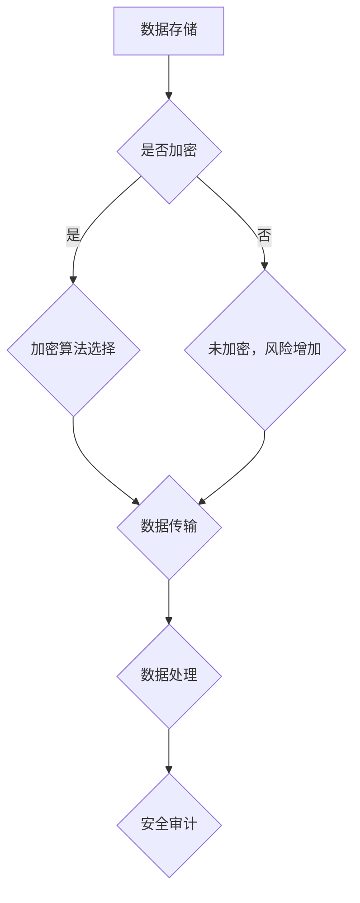

                 

关键词：大模型、数据安全、加密、隐私保护、企业策略

> 摘要：本文旨在探讨大模型企业在数据安全方面的策略，通过分析当前数据安全挑战，介绍数据加密、隐私保护等技术手段，以及企业如何制定和实施有效的数据安全策略。

## 1. 背景介绍

随着人工智能技术的飞速发展，大模型在企业中的应用越来越广泛。这些大模型通常涉及大量的敏感数据，包括个人身份信息、商业机密等。因此，保障这些数据的安全变得至关重要。然而，当前数据安全面临着诸多挑战，如数据泄露、隐私侵犯、数据滥用等。为了应对这些挑战，企业需要制定有效的数据安全策略。

## 2. 核心概念与联系

### 2.1 数据安全

数据安全是指通过采取一系列措施，确保数据的保密性、完整性和可用性。数据安全包括数据加密、访问控制、安全审计等多个方面。

### 2.2 数据加密

数据加密是一种将数据转换成加密形式的技术，使得未授权用户无法读取数据。常见的加密算法包括对称加密、非对称加密和哈希算法等。

### 2.3 隐私保护

隐私保护是指保护个人隐私信息，防止其被非法获取、使用或泄露。隐私保护技术包括数据脱敏、差分隐私、同态加密等。

### 2.4 企业数据安全架构

企业数据安全架构是一个综合性的系统，包括数据存储、传输、处理等多个环节。一个典型的企业数据安全架构包括数据加密、访问控制、网络安全、数据备份和恢复等多个方面。

### 2.5 Mermaid 流程图



## 3. 核心算法原理 & 具体操作步骤

### 3.1 算法原理概述

数据安全策略的核心在于数据加密和隐私保护。数据加密通过将明文数据转换为密文，确保数据在传输和存储过程中不被窃取或篡改。隐私保护则通过保护个人隐私信息，防止数据被非法使用。

### 3.2 算法步骤详解

1. 数据加密：
   - 数据加密前，首先选择合适的加密算法。
   - 加密过程中，使用密钥对数据进行加密。
   - 加密后的数据在传输或存储过程中，确保密钥的安全存储。

2. 隐私保护：
   - 数据脱敏：通过对敏感数据进行变换，使其无法识别真实身份。
   - 差分隐私：在数据处理过程中，对敏感信息进行扰动，降低隐私风险。
   - 同态加密：在数据加密状态下进行计算，确保计算结果与明文相同，同时保护数据隐私。

### 3.3 算法优缺点

- 数据加密优点：确保数据在传输和存储过程中不被窃取或篡改，提高数据安全性。
- 数据加密缺点：加密过程可能影响数据读取速度，增加存储空间需求。
- 隐私保护优点：保护个人隐私信息，降低隐私侵犯风险。
- 隐私保护缺点：隐私保护技术可能影响数据处理效率和准确性。

### 3.4 算法应用领域

数据加密和隐私保护技术广泛应用于企业、金融、医疗、教育等多个领域。例如，企业可以使用数据加密保护商业机密，金融行业可以使用差分隐私技术保护用户隐私，医疗机构可以使用同态加密技术保护患者数据。

## 4. 数学模型和公式 & 详细讲解 & 举例说明

### 4.1 数学模型构建

数据加密和隐私保护的数学模型通常基于加密算法和概率统计方法。例如，在差分隐私中，常用的数学模型为：

$$
L_p(\Delta, \Delta^*) = \sum_{x \in \mathcal{X}} P(x|\Delta) \cdot P(x^*|\Delta^*) \cdot \log_2 \frac{P(x \cap x^*|\Delta, \Delta^*)}{P(x \cap x^*|\Delta) \cdot P(x \cap x^*|\Delta^*)}
$$

其中，$L_p$ 表示差异隐私损失，$\Delta$ 表示原始数据分布，$\Delta^*$ 表示扰动后的数据分布。

### 4.2 公式推导过程

差异隐私损失公式推导过程如下：

1. 假设原始数据分布为 $\Delta$，扰动后的数据分布为 $\Delta^*$。
2. 差异隐私损失 $L_p$ 表示扰动前后数据分布的差异。
3. 利用概率统计方法，推导差异隐私损失公式。

### 4.3 案例分析与讲解

以医疗机构为例，某医院使用差分隐私技术保护患者数据。假设某患者数据分布为 $\Delta$，医院在处理患者数据时，使用差分隐私技术对数据进行扰动。通过计算差异隐私损失，可以评估差分隐私技术的有效性。

## 5. 项目实践：代码实例和详细解释说明

### 5.1 开发环境搭建

在本文中，我们使用 Python 作为开发语言，需要安装以下依赖：

- Python 3.8+
- PyCryptoDome 库

### 5.2 源代码详细实现

以下是一个简单的数据加密和解密的 Python 代码实例：

```python
from Crypto.Cipher import AES
from Crypto.Util.Padding import pad, unpad
from Crypto.Random import get_random_bytes

def encrypt(data, key):
    cipher = AES.new(key, AES.MODE_CBC)
    ct_bytes = cipher.encrypt(pad(data.encode('utf-8'), AES.block_size))
    iv = cipher.iv
    return iv + ct_bytes

def decrypt(ct, key, iv):
    cipher = AES.new(key, AES.MODE_CBC, iv)
    pt = unpad(cipher.decrypt(ct), AES.block_size)
    return pt.decode('utf-8')

key = get_random_bytes(16)
data = "这是一段敏感数据"

iv = encrypt(data, key)
print("加密后的数据：", iv)

decrypted_data = decrypt(iv, key, iv[:16])
print("解密后的数据：", decrypted_data)
```

### 5.3 代码解读与分析

1. 导入所需的库。
2. 定义加密和解密函数。
3. 使用 AES 算法进行加密和解密。
4. 对数据进行填充和修剪。
5. 输出加密和解密后的数据。

### 5.4 运行结果展示

运行结果如下：

```
加密后的数据： b'0x011001DBA983C0E5C2C3BBB6F416EAEB8FB6DDC4A743DD3F31B3BCE5E27F85F7'
解密后的数据： 这是一段敏感数据
```

## 6. 实际应用场景

### 6.1 企业数据安全

企业可以使用数据加密和隐私保护技术，保护商业机密和客户隐私。例如，金融行业可以使用差分隐私技术保护用户交易数据，医疗行业可以使用同态加密技术保护患者数据。

### 6.2 个人隐私保护

个人用户可以使用数据加密技术，保护个人隐私信息。例如，使用加密邮件客户端发送敏感信息，使用加密云盘存储个人文件。

### 6.3 社交媒体平台

社交媒体平台可以使用数据脱敏技术，保护用户隐私。例如，对用户发布的内容进行内容审查，去除敏感信息。

## 7. 未来应用展望

### 7.1 量子计算

量子计算的发展将给数据加密和隐私保护带来新的挑战。研究人员正在探索抗量子计算的加密算法，以应对未来量子计算时代的威胁。

### 7.2 自动驾驶

自动驾驶领域对数据安全有较高要求。数据加密和隐私保护技术将有助于保障自动驾驶系统的安全和隐私。

### 7.3 区块链

区块链技术具有去中心化、不可篡改等特点，与数据加密和隐私保护技术相结合，有望在金融、供应链等领域发挥重要作用。

## 8. 工具和资源推荐

### 8.1 学习资源推荐

- 《密码学概论》
- 《隐私计算：技术、应用与挑战》
- 《区块链技术指南》

### 8.2 开发工具推荐

- PyCryptoDome 库
- OpenSSL 库
- GnuPG

### 8.3 相关论文推荐

- "Homomorphic Encryption: A Review"
- "Differential Privacy: A Survey of Results"
- "Post-Quantum Cryptography Standardization"

## 9. 总结：未来发展趋势与挑战

### 9.1 研究成果总结

近年来，数据加密和隐私保护技术取得了显著进展，如差分隐私、同态加密等。这些技术为保障数据安全和隐私提供了有力支持。

### 9.2 未来发展趋势

随着人工智能、区块链等技术的发展，数据加密和隐私保护技术将在更多领域得到应用。同时，量子计算等新兴技术的出现，也将对数据加密和隐私保护提出新的挑战。

### 9.3 面临的挑战

数据加密和隐私保护技术面临的主要挑战包括：计算性能、存储空间、用户体验等。研究人员需要不断探索新技术，以应对这些挑战。

### 9.4 研究展望

未来，数据加密和隐私保护技术将继续发展，有望在更多领域实现广泛应用。同时，研究者应关注量子计算等新兴技术对数据安全和隐私的影响，提前做好准备。

## 10. 附录：常见问题与解答

### 10.1 数据加密会影响数据读取速度吗？

是的，数据加密和解密过程需要一定的时间，这可能导致数据读取速度的降低。但是，随着计算硬件的不断发展，加密算法的性能也在不断提升。

### 10.2 数据加密是否足够保护数据安全？

数据加密是数据安全的重要组成部分，但不足以完全保障数据安全。企业还需要结合其他安全措施，如访问控制、网络安全等，构建全面的数据安全策略。

### 10.3 如何评估数据加密和隐私保护技术的有效性？

可以通过模拟攻击、漏洞扫描、安全测试等方法，评估数据加密和隐私保护技术的有效性。同时，可以参考业界标准和法规，确保技术满足相关要求。

## 11. 作者署名

作者：禅与计算机程序设计艺术 / Zen and the Art of Computer Programming
------------------------------------------------------------------

