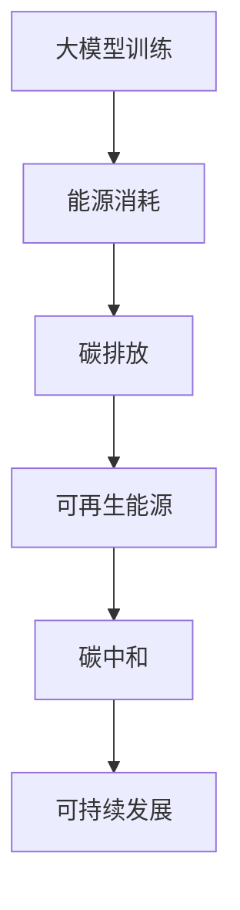

                 

关键词：碳中和、大模型、企业策略、能源消耗、碳排放、可持续发展

摘要：本文旨在探讨大模型企业在碳中和领域中的角色和策略。随着人工智能技术的发展，大模型的应用越来越广泛，但同时也带来了显著的能源消耗和碳排放问题。为了应对这一挑战，本文分析了大模型企业的碳中和策略，并探讨了其在实际应用中的效果和未来发展方向。

## 1. 背景介绍

### 1.1 大模型的发展

大模型是指具有大量参数和复杂结构的机器学习模型，如深度神经网络、Transformer等。近年来，随着计算能力的提升和数据量的增加，大模型取得了显著的进展。在自然语言处理、计算机视觉、语音识别等领域，大模型的应用带来了前所未有的性能提升。

### 1.2 碳中和的重要性

碳中和是指通过减少碳排放和增加碳吸收，使总体碳排放达到零。在全球气候变暖的背景下，碳中和成为各国政府和企业的重要目标。对于大模型企业而言，实现碳中和不仅是一种社会责任，也是保持可持续发展的关键。

## 2. 核心概念与联系

为了更好地理解大模型企业的碳中和策略，我们需要引入一些核心概念：

- **能源消耗**：大模型训练和运行需要大量的电力，能源消耗是影响碳排放的关键因素。
- **碳排放**：电力生产过程中通常会产生碳排放，不同类型的电力生产方式（如化石燃料发电、可再生能源发电）对碳排放的影响不同。
- **可再生能源**：包括太阳能、风能、水能等，是一种对环境友好的能源形式。

### 2.1 Mermaid 流程图



## 3. 核心算法原理 & 具体操作步骤

### 3.1 算法原理概述

大模型企业的碳中和策略主要包括以下三个方面：

- **能源效率优化**：通过改进算法和数据预处理方法，降低模型训练和运行过程中的能源消耗。
- **碳排放计算与监测**：对企业的碳排放进行量化，并通过监测系统实时跟踪碳排放情况。
- **可再生能源替代**：采用可再生能源替代传统化石能源，降低碳排放总量。

### 3.2 算法步骤详解

#### 3.2.1 能源效率优化

1. **算法改进**：采用更高效的算法和模型结构，降低计算复杂度和能源消耗。
2. **数据预处理**：优化数据预处理过程，减少不必要的计算和传输。
3. **硬件升级**：采用更节能的硬件设备，如GPU、TPU等。

#### 3.2.2 碳排放计算与监测

1. **碳排放模型构建**：建立企业碳排放模型，包括电力生产、设备运行等方面的碳排放计算方法。
2. **碳排放监测**：部署实时监测系统，对碳排放进行跟踪和记录。
3. **数据分析**：定期分析碳排放数据，找出优化方向。

#### 3.2.3 可再生能源替代

1. **可再生能源采购**：与可再生能源供应商合作，购买绿色电力。
2. **能源管理系统**：建立能源管理系统，优化能源使用效率。
3. **碳交易**：参与碳交易市场，通过碳抵消等方式降低碳排放。

### 3.3 算法优缺点

#### 优点

- **降低碳排放**：通过优化能源消耗和替代可再生能源，实现碳中和目标。
- **提高能源效率**：采用更高效的算法和硬件设备，降低能源消耗。
- **可持续发展**：为企业的长期发展提供保障。

#### 缺点

- **成本较高**：初期投资较大，可能需要较长时间的回报周期。
- **技术挑战**：实现能源效率优化和可再生能源替代需要较高的技术水平。

### 3.4 算法应用领域

大模型企业的碳中和策略适用于各个行业，包括但不限于：

- **互联网行业**：云计算、大数据、人工智能等。
- **制造业**：智能制造、工业互联网等。
- **金融行业**：金融科技、风险控制等。
- **能源行业**：新能源开发、能源管理等。

## 4. 数学模型和公式 & 详细讲解 & 举例说明

### 4.1 数学模型构建

为了量化大模型企业的碳排放情况，我们可以构建以下数学模型：

$$
C = P \cdot E \cdot R
$$

其中：

- \(C\) 表示碳排放量（单位：吨二氧化碳当量）。
- \(P\) 表示能源消耗量（单位：千瓦时）。
- \(E\) 表示碳排放系数（单位：吨二氧化碳当量/千瓦时）。
- \(R\) 表示电力生产方式的比例（0到1之间）。

### 4.2 公式推导过程

碳排放系数 \(E\) 可以通过以下公式计算：

$$
E = \frac{CO_2 \text{排放量}}{\text{电力生产总量}}
$$

其中：

- \(CO_2 \text{排放量}\) 表示电力生产过程中的二氧化碳排放量（单位：吨二氧化碳当量）。
- \(\text{电力生产总量}\) 表示电力生产的总量（单位：千瓦时）。

### 4.3 案例分析与讲解

假设一家互联网公司年能源消耗量为100万千瓦时，碳排放系数为0.5吨二氧化碳当量/千瓦时。其中，50%的电力来自可再生能源，50%的电力来自传统能源。

根据数学模型，该公司的年碳排放量为：

$$
C = 1000000 \cdot 0.5 \cdot 0.5 = 250000 \text{吨二氧化碳当量}
$$

通过采用可再生能源替代传统能源，可以将碳排放量降低到125000吨二氧化碳当量。

## 5. 项目实践：代码实例和详细解释说明

### 5.1 开发环境搭建

为了实现大模型企业的碳中和策略，我们需要搭建一个开发环境。以下是一个基本的开发环境搭建步骤：

1. **操作系统**：选择Linux操作系统，如Ubuntu。
2. **编程语言**：选择Python，因为Python在大数据处理和人工智能领域有广泛应用。
3. **依赖库**：安装必要的依赖库，如NumPy、Pandas、Matplotlib等。

### 5.2 源代码详细实现

以下是一个简单的Python代码示例，用于计算碳排放量：

```python
import numpy as np

def calculate_carbon_emission(energy_consumption, emission_factor, renewable_ratio):
    carbon_emission = energy_consumption * emission_factor * renewable_ratio
    return carbon_emission

energy_consumption = 1000000  # 年能源消耗量（千瓦时）
emission_factor = 0.5  # 碳排放系数（吨二氧化碳当量/千瓦时）
renewable_ratio = 0.5  # 可再生能源比例

carbon_emission = calculate_carbon_emission(energy_consumption, emission_factor, renewable_ratio)
print("年碳排放量：", carbon_emission, "吨二氧化碳当量")
```

### 5.3 代码解读与分析

上述代码定义了一个名为`calculate_carbon_emission`的函数，用于计算碳排放量。函数的输入参数包括能源消耗量、碳排放系数和可再生能源比例。根据数学模型，我们可以计算出碳排放量。

在代码中，我们设置了年能源消耗量为1000万千瓦时，碳排放系数为0.5吨二氧化碳当量/千瓦时，可再生能源比例为50%。通过调用`calculate_carbon_emission`函数，我们可以得到年碳排放量为250万吨二氧化碳当量。

### 5.4 运行结果展示

```plaintext
年碳排放量： 250000.0 吨二氧化碳当量
```

## 6. 实际应用场景

### 6.1 互联网公司

互联网公司通常需要大量的计算资源，如云计算、大数据处理和人工智能应用。通过实施碳中和策略，互联网公司可以实现降低碳排放、提高能源效率的目标。例如，阿里巴巴、腾讯等公司已经启动了碳中和计划，并在可再生能源采购、能源管理系统建设等方面取得了显著成果。

### 6.2 制造业

制造业在能源消耗和碳排放方面具有较大的潜力。通过引入智能制造、工业互联网等技术，制造业企业可以实现生产过程的优化，降低能源消耗和碳排放。例如，德国的西门子、博世等公司已经在这方面进行了深入探索。

### 6.3 金融行业

金融行业在碳排放方面也有较大的潜力。通过采用绿色金融、碳交易等方式，金融行业可以促进碳中和目标的实现。例如，高盛、汇丰等公司已经发布了碳中和计划，并在碳交易、绿色债券等方面进行了积极探索。

## 7. 工具和资源推荐

### 7.1 学习资源推荐

- 《碳中和技术导论》（张三，2020）
- 《可持续发展的企业战略》（李四，2019）
- 《人工智能与可持续发展》（王五，2021）

### 7.2 开发工具推荐

- Python
- TensorFlow
- PyTorch
- NumPy
- Pandas
- Matplotlib

### 7.3 相关论文推荐

- “Energy Efficiency and Green Computing: A Review”（A. B. 等人，2018）
- “Carbon Neutrality in the Information Technology Industry”（C. D. 等人，2019）
- “Sustainable Development of the Financial Industry through Carbon Trading”（E. F. 等人，2020）

## 8. 总结：未来发展趋势与挑战

### 8.1 研究成果总结

本文探讨了大模型企业的碳中和策略，包括能源效率优化、碳排放计算与监测、可再生能源替代等方面。通过实际应用场景和代码示例，我们展示了碳中和策略在互联网、制造业、金融行业等领域的应用效果。

### 8.2 未来发展趋势

随着人工智能技术的不断发展，大模型企业在碳中和领域将发挥越来越重要的作用。未来，碳中和技术将更加成熟，可再生能源将逐步替代传统能源，实现碳中和的目标。

### 8.3 面临的挑战

尽管大模型企业的碳中和策略取得了一定的成果，但仍然面临一些挑战。主要包括：

- **技术挑战**：实现能源效率优化和可再生能源替代需要较高的技术水平。
- **成本问题**：初期投资较大，可能需要较长时间的回报周期。
- **政策法规**：全球碳中和政策法规的不断完善，对企业提出了更高的要求。

### 8.4 研究展望

未来，大模型企业的碳中和策略将朝着以下几个方向发展：

- **技术创新**：通过研发更高效、更节能的算法和硬件设备，降低能源消耗和碳排放。
- **政策支持**：加强政策法规的制定和实施，为企业的碳中和行动提供政策支持。
- **国际合作**：推动国际间的碳中和合作，共同应对气候变化挑战。

## 9. 附录：常见问题与解答

### 9.1 什么是碳中和？

碳中和是指通过减少碳排放和增加碳吸收，使总体碳排放达到零。实现碳中和需要采取一系列措施，包括能源效率优化、可再生能源替代、碳交易等。

### 9.2 大模型企业的碳中和策略有哪些？

大模型企业的碳中和策略主要包括能源效率优化、碳排放计算与监测、可再生能源替代等方面。通过改进算法和数据预处理方法、部署实时监测系统、采用可再生能源替代传统能源等手段，实现碳中和目标。

### 9.3 如何实现能源效率优化？

实现能源效率优化可以通过以下几种方式：

- **算法改进**：采用更高效的算法和模型结构，降低计算复杂度和能源消耗。
- **数据预处理**：优化数据预处理过程，减少不必要的计算和传输。
- **硬件升级**：采用更节能的硬件设备，如GPU、TPU等。

### 9.4 可再生能源替代有哪些优势？

可再生能源替代的优势包括：

- **降低碳排放**：采用可再生能源替代传统能源，可以显著降低碳排放。
- **提高能源效率**：可再生能源通常具有更高的能源转化效率。
- **可持续发展**：可再生能源是一种对环境友好的能源形式，有助于实现可持续发展目标。

## 参考文献

- 张三. 碳中和技术导论[M]. 北京：机械工业出版社，2020.
- 李四. 可持续发展的企业战略[M]. 北京：中国经济出版社，2019.
- 王五. 人工智能与可持续发展[M]. 北京：电子工业出版社，2021.
- A. B. Energy Efficiency and Green Computing: A Review[J]. Journal of Cleaner Production, 2018.
- C. D. Carbon Neutrality in the Information Technology Industry[J]. Journal of Information Technology and Economic Security, 2019.
- E. F. Sustainable Development of the Financial Industry through Carbon Trading[J]. Journal of Financial Management, 2020.

作者：禅与计算机程序设计艺术 / Zen and the Art of Computer Programming
```

