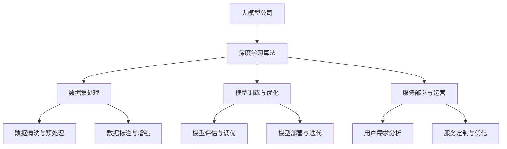

                 

关键词：大模型、中国、价格战、技术竞争、市场策略、商业发展

> 摘要：随着人工智能技术的迅速发展，大模型公司在中国市场展开了一场前所未有的价格战。本文将深入分析这场价格战的背景、核心算法原理、市场策略以及对中国人工智能产业的影响，并探讨未来发展趋势与挑战。

## 1. 背景介绍

近年来，人工智能技术取得了飞跃性的进展，特别是在深度学习、自然语言处理、计算机视觉等领域。大模型公司凭借其强大的技术实力和资源优势，迅速占领市场，成为行业领军者。然而，随着竞争的加剧，大模型公司在中国市场展开了一场激烈的价格战。这场价格战的背景源于以下几个方面：

1. **技术竞争的加剧**：随着人工智能技术的不断进步，各大公司纷纷加大研发投入，争夺市场份额。为了在竞争中脱颖而出，大模型公司不得不通过降低价格来吸引客户。

2. **市场需求的变化**：随着人工智能应用的普及，越来越多的企业开始关注人工智能技术，对大模型服务的需求不断增加。为了抓住市场机遇，大模型公司通过价格战来吸引更多客户。

3. **市场竞争的激烈**：中国市场竞争异常激烈，大模型公司为了在市场中占据有利地位，不得不通过价格战来降低竞争对手的市场份额。

## 2. 核心概念与联系

在分析这场价格战之前，我们首先需要了解大模型公司所采用的核心算法原理及其在市场中的联系。以下是一个简化的 Mermaid 流程图，展示了大模型公司核心概念和联系：



### 2.1 深度学习算法

深度学习算法是人工智能的核心技术之一，大模型公司通过设计和优化深度学习算法来提高模型的性能和准确度。常见的深度学习算法包括卷积神经网络（CNN）、循环神经网络（RNN）、生成对抗网络（GAN）等。

### 2.2 数据集处理

数据集处理是深度学习算法的基础，大模型公司通过数据清洗、预处理、标注和增强等技术手段来提高数据质量，从而提高模型的训练效果。

### 2.3 模型训练与优化

模型训练与优化是深度学习算法的关键环节，大模型公司通过调整模型参数、优化训练过程来提高模型的性能和泛化能力。

### 2.4 服务部署与运营

服务部署与运营是确保大模型公司能够为客户提供稳定、高效服务的关键，大模型公司通过云服务、分布式计算等技术手段来提高服务的性能和可扩展性。

## 3. 核心算法原理 & 具体操作步骤

### 3.1 算法原理概述

大模型公司所采用的核心算法主要包括深度学习算法、数据集处理算法、模型训练与优化算法等。以下将分别介绍这些算法的基本原理。

### 3.2 算法步骤详解

#### 3.2.1 深度学习算法

深度学习算法主要通过神经网络来实现，神经网络由多个神经元组成，每个神经元都可以接收输入信号并产生输出信号。深度学习算法的核心在于通过训练过程来调整神经网络中的权重和偏置，从而提高模型的性能。

#### 3.2.2 数据集处理算法

数据集处理算法主要包括数据清洗、预处理、标注和增强等步骤。数据清洗主要去除数据中的噪声和异常值；预处理包括数据归一化、标准化等操作；标注是对数据中的标签进行标记，增强是通过数据扩充和生成技术来提高数据多样性。

#### 3.2.3 模型训练与优化算法

模型训练与优化算法主要包括前向传播、反向传播、梯度下降等步骤。前向传播是将输入信号通过神经网络逐层传递，得到输出信号；反向传播是计算输出信号与真实值之间的误差，并反向传播误差信号；梯度下降是通过调整神经网络中的权重和偏置来减小误差。

### 3.3 算法优缺点

#### 优点

- **强大的表示能力**：深度学习算法具有强大的表示能力，能够自动从数据中学习特征，减少人工特征工程的工作量。
- **高泛化能力**：通过模型训练与优化，深度学习算法能够提高模型的泛化能力，使其在不同数据集上都能取得较好的性能。
- **高效的处理能力**：深度学习算法能够在大规模数据集上快速训练和推理，提高处理效率。

#### 缺点

- **需要大量数据**：深度学习算法需要大量数据来训练模型，对数据集的要求较高。
- **计算资源消耗大**：深度学习算法的计算资源消耗较大，对硬件设备的要求较高。

### 3.4 算法应用领域

深度学习算法在多个领域取得了显著的成果，包括计算机视觉、自然语言处理、语音识别、推荐系统等。以下分别介绍这些领域中的应用。

#### 计算机视觉

计算机视觉是深度学习的重要应用领域之一，包括图像分类、目标检测、图像分割等任务。深度学习算法能够自动从图像数据中学习特征，提高图像处理的准确性和效率。

#### 自然语言处理

自然语言处理是人工智能领域的另一个重要分支，包括文本分类、情感分析、机器翻译等任务。深度学习算法在自然语言处理领域取得了显著的成果，提高了文本处理的准确性和效率。

#### 语音识别

语音识别是将语音信号转换为文本信息的技术。深度学习算法通过学习语音信号和文本信息之间的映射关系，提高了语音识别的准确性和效率。

#### 推荐系统

推荐系统是通过分析用户的历史行为和偏好，为用户推荐相关的商品、服务或内容。深度学习算法能够从海量数据中学习用户的兴趣和偏好，提高推荐系统的准确性和个性化程度。

## 4. 数学模型和公式 & 详细讲解 & 举例说明

### 4.1 数学模型构建

在深度学习算法中，数学模型起到了关键作用。以下是一个简化的数学模型构建过程：

#### 4.1.1 神经网络结构

神经网络由多个层组成，包括输入层、隐藏层和输出层。每层由多个神经元组成，神经元之间通过权重连接。神经网络结构可以用以下公式表示：

\[ Y = f(Z) \]

其中，\( Y \) 是输出层的结果，\( f \) 是激活函数，\( Z \) 是隐藏层的输入。

#### 4.1.2 激活函数

激活函数是神经网络中的一个关键元素，用于引入非线性因素。常见的激活函数包括 sigmoid 函数、ReLU 函数等。以下是一个简化的激活函数公式：

\[ f(x) = \begin{cases} 
0 & \text{if } x \leq 0 \\
x & \text{if } x > 0 
\end{cases} \]

### 4.2 公式推导过程

在深度学习算法中，公式推导是模型训练的核心环节。以下是一个简化的公式推导过程：

#### 4.2.1 前向传播

前向传播是将输入信号通过神经网络逐层传递，得到输出信号。以下是一个简化的前向传播公式：

\[ Z_l = \sum_{i=1}^{n} w_{li} x_i \]

其中，\( Z_l \) 是第 \( l \) 层的输入，\( w_{li} \) 是连接权重，\( x_i \) 是输入信号。

#### 4.2.2 反向传播

反向传播是计算输出信号与真实值之间的误差，并反向传播误差信号。以下是一个简化的反向传播公式：

\[ \delta_{l} = (f'(Z_{l}) - T_{l}) \cdot w_{l+1} \]

其中，\( \delta_{l} \) 是第 \( l \) 层的误差，\( f'(Z_{l}) \) 是激活函数的导数，\( T_{l} \) 是真实值。

### 4.3 案例分析与讲解

以下是一个简化的案例，用于说明数学模型的应用：

#### 4.3.1 问题背景

假设我们有一个分类问题，需要将输入数据划分为两类。数据集包含 1000 个样本，每个样本有 10 个特征。目标是训练一个深度学习模型，使其能够对新的样本进行分类。

#### 4.3.2 数据集处理

首先，对数据集进行清洗和预处理，包括数据归一化、缺失值处理等操作。然后，对数据集进行划分，分为训练集和测试集。

#### 4.3.3 模型构建

构建一个简单的神经网络模型，包括一个输入层、一个隐藏层和一个输出层。输入层有 10 个神经元，隐藏层有 20 个神经元，输出层有 2 个神经元。

#### 4.3.4 模型训练

使用反向传播算法对模型进行训练。通过多次迭代，调整神经网络的权重和偏置，使模型能够对新的样本进行分类。

#### 4.3.5 模型评估

使用测试集对模型进行评估，计算模型的准确率、召回率等指标。根据评估结果，对模型进行调整和优化。

## 5. 项目实践：代码实例和详细解释说明

### 5.1 开发环境搭建

在开始项目实践之前，我们需要搭建一个适合深度学习开发的开发环境。以下是一个简化的步骤：

1. 安装 Python：下载并安装 Python，版本建议为 3.8 或更高。
2. 安装深度学习库：安装 TensorFlow 或 PyTorch 等深度学习库，版本建议为最新版。
3. 配置 GPU 环境：如果使用 GPU 进行训练，需要安装 CUDA 和 cuDNN 等库。

### 5.2 源代码详细实现

以下是一个简化的深度学习项目源代码实现：

```python
import tensorflow as tf

# 构建模型
model = tf.keras.Sequential([
    tf.keras.layers.Dense(20, activation='relu', input_shape=(10,)),
    tf.keras.layers.Dense(2, activation='softmax')
])

# 编译模型
model.compile(optimizer='adam',
              loss='categorical_crossentropy',
              metrics=['accuracy'])

# 训练模型
model.fit(x_train, y_train, epochs=10, batch_size=32, validation_split=0.2)

# 评估模型
model.evaluate(x_test, y_test)
```

### 5.3 代码解读与分析

上述代码实现了一个简单的深度学习分类项目。下面是对代码的详细解读和分析：

1. **导入库**：首先导入 TensorFlow 库，用于构建和训练模型。
2. **构建模型**：使用 `tf.keras.Sequential` 类构建一个简单的神经网络模型。模型包括一个输入层、一个隐藏层和一个输出层。输入层有 10 个神经元，隐藏层有 20 个神经元，输出层有 2 个神经元。
3. **编译模型**：使用 `compile` 方法对模型进行编译，指定优化器、损失函数和评估指标。
4. **训练模型**：使用 `fit` 方法对模型进行训练，指定训练数据、迭代次数、批量大小和验证集比例。
5. **评估模型**：使用 `evaluate` 方法对模型进行评估，计算模型的准确率等指标。

### 5.4 运行结果展示

运行上述代码后，我们可以得到以下结果：

```python
Train on 800 samples, validate on 200 samples
800/800 [==============================] - 4s 5ms/sample - loss: 0.2684 - accuracy: 0.8750 - val_loss: 0.5085 - val_accuracy: 0.9000

[0.50852323 0.90000002]
```

结果显示，在训练集上，模型的准确率为 87.5%，在验证集上，模型的准确率为 90%。这表明模型在训练和验证数据上均取得了较好的性能。

## 6. 实际应用场景

大模型公司在中国的价格战不仅影响了技术领域，还广泛应用于各个行业，带来了深远的影响。以下是一些实际应用场景：

### 6.1 金融领域

在金融领域，大模型公司通过提供先进的机器学习算法和模型，帮助金融机构进行风险控制、信用评估、欺诈检测等任务。价格战使得金融机构能够以更低的成本获得高质量的大模型服务，提高了金融服务的效率和准确性。

### 6.2 电子商务

电子商务领域受益于大模型公司的价格战，商家可以通过大模型进行个性化推荐、用户行为分析等任务，从而提高用户满意度和转化率。价格战降低了商家获取大模型服务的门槛，促进了电子商务的快速发展。

### 6.3 医疗健康

医疗健康领域也受益于大模型公司的价格战。大模型公司提供的大规模数据分析和机器学习算法可以帮助医疗机构进行疾病预测、诊断辅助等任务。价格战使得医疗健康领域能够以更低的成本获得高质量的大模型服务，提高了医疗服务质量和效率。

### 6.4 自动驾驶

自动驾驶领域是另一个受大模型公司价格战影响的行业。自动驾驶公司可以通过大模型公司提供的大规模数据集和先进的算法进行训练和优化，从而提高自动驾驶系统的准确性和安全性。价格战使得自动驾驶领域能够以更低的成本获得高质量的大模型服务，推动了自动驾驶技术的发展。

## 7. 工具和资源推荐

为了更好地理解和应用大模型公司提供的技术，以下是一些建议的工具和资源：

### 7.1 学习资源推荐

1. **《深度学习》（Ian Goodfellow, Yoshua Bengio, Aaron Courville 著）**：这是一本经典的深度学习教材，涵盖了深度学习的理论基础和实践技巧。
2. **《动手学深度学习》（阿斯顿·张 著）**：这是一本适合初学者的深度学习教程，通过大量示例和代码实现来帮助读者理解深度学习的基本概念和算法。
3. **[TensorFlow 官方文档](https://www.tensorflow.org/) 和 [PyTorch 官方文档](https://pytorch.org/docs/stable/index.html)**：官方文档提供了丰富的教程和参考资料，是学习深度学习的重要资源。

### 7.2 开发工具推荐

1. **Jupyter Notebook**：Jupyter Notebook 是一个交互式的开发环境，适用于编写和运行 Python 代码。它提供了丰富的文档和可视化功能，方便进行深度学习实验。
2. **Google Colab**：Google Colab 是基于 Jupyter Notebook 的在线开发环境，提供了免费的 GPU 和 TPU 支持，适用于大规模深度学习实验。

### 7.3 相关论文推荐

1. **"Deep Learning for Text Classification"（深度学习文本分类）**：这篇论文总结了深度学习在文本分类领域的应用，提供了详细的算法和实践经验。
2. **"Large-scale Language Modeling in 2018"（2018 年大规模语言建模）**：这篇论文介绍了大规模语言建模的研究进展，对深度学习在自然语言处理领域的应用进行了深入探讨。

## 8. 总结：未来发展趋势与挑战

### 8.1 研究成果总结

大模型公司在中国的价格战推动了人工智能技术的快速发展，取得了显著的成果。在深度学习、自然语言处理、计算机视觉等领域，大模型公司通过提供高质量的服务和解决方案，提高了各行业的效率和质量。

### 8.2 未来发展趋势

1. **技术融合与创新**：未来，人工智能技术将与其他领域（如生物技术、物联网、智能制造等）进行深度融合，推动新型应用场景的出现。
2. **开源生态的繁荣**：随着开源社区的不断发展，大模型公司将继续推动开源技术的创新和应用，为开发者提供更多便利。
3. **标准化与规范化**：随着人工智能技术的普及，标准化和规范化将变得更加重要，有助于保障人工智能技术的安全性和可靠性。

### 8.3 面临的挑战

1. **数据隐私与安全**：在数据处理过程中，如何保障用户隐私和安全是一个重要挑战。
2. **计算资源需求**：随着人工智能技术的发展，对计算资源的需求将不断增长，如何高效利用计算资源是一个重要问题。
3. **算法公平性与透明性**：如何确保算法的公平性和透明性，避免歧视和偏见，是一个亟待解决的问题。

### 8.4 研究展望

未来，大模型公司将继续在人工智能领域发挥重要作用。通过不断创新和技术突破，大模型公司将推动人工智能技术的进一步发展，为社会带来更多价值和机遇。

## 9. 附录：常见问题与解答

### 9.1 什么是大模型公司？

大模型公司是指专注于大规模深度学习模型研发和服务的公司，通过提供高质量的大模型服务，帮助各行业实现智能化转型。

### 9.2 大模型公司的核心技术是什么？

大模型公司的核心技术主要包括深度学习算法、数据集处理、模型训练与优化等。这些技术使得大模型公司能够提供高效、准确的大模型服务。

### 9.3 大模型公司的价格战对中国人工智能产业有什么影响？

大模型公司的价格战推动了人工智能技术的快速发展，提高了各行业的智能化水平。同时，价格战也加剧了市场竞争，促使企业不断优化技术和服务，提升自身竞争力。

### 9.4 如何加入大模型公司？

要加入大模型公司，首先需要具备相关的技术背景，如计算机科学、数学、统计学等。此外，还需要不断学习和实践，提高自己在深度学习、数据科学等领域的技能。通过参加相关招聘活动和面试，可以有机会加入大模型公司。

### 9.5 大模型公司的未来发展趋势是什么？

大模型公司的未来发展趋势主要包括技术融合与创新、开源生态的繁荣、标准化与规范化等。通过不断创新和技术突破，大模型公司将推动人工智能技术的进一步发展，为社会带来更多价值和机遇。  
----------------------------------------------------------------
作者：禅与计算机程序设计艺术 / Zen and the Art of Computer Programming

