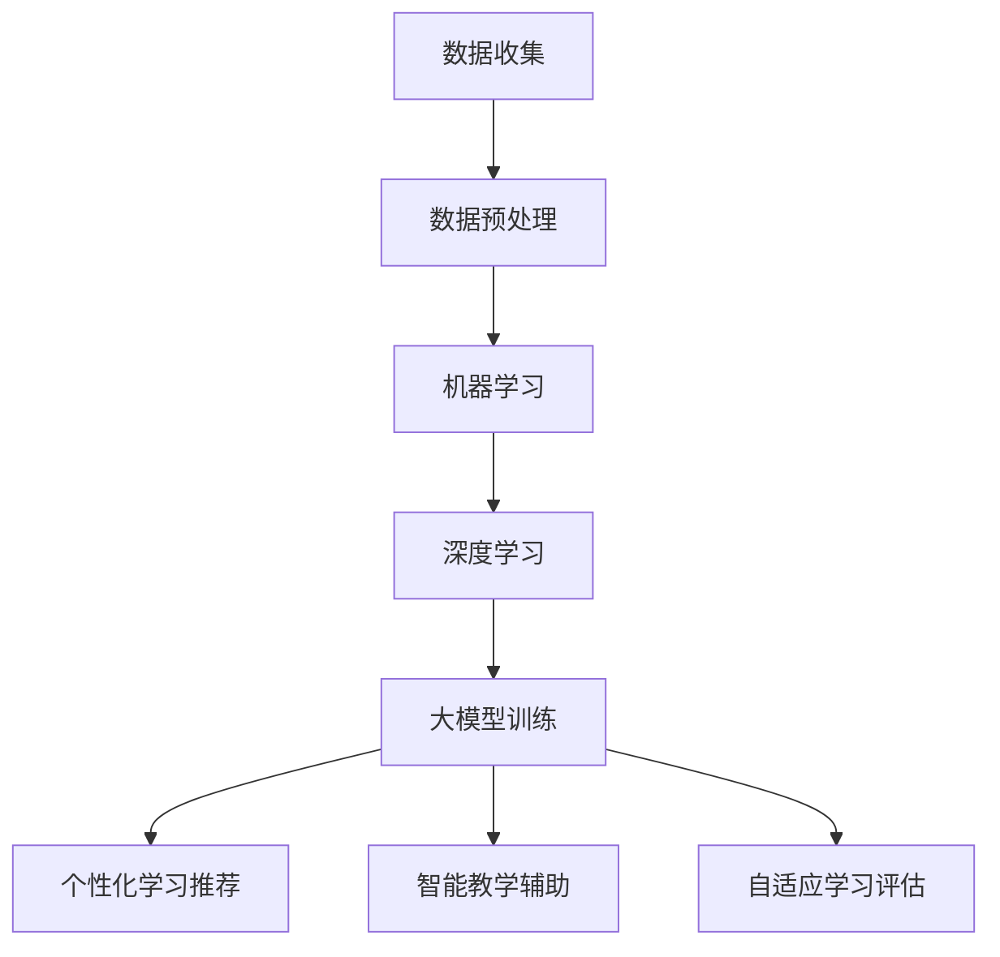

                 

关键词：大模型，个性化教育，机器学习，深度学习，教育技术

摘要：本文旨在探讨大模型在个性化教育中的应用，通过分析大模型的基本概念、核心原理及其与个性化教育的紧密联系，深入剖析大模型在个性化学习场景中的优势与挑战。同时，本文将结合具体案例和数学模型，探讨大模型在个性化教育中的实现方法，并提出未来发展方向和潜在的研究课题。

## 1. 背景介绍

个性化教育，即根据每个学生的个体差异，为其量身定制学习内容、教学方法和学习路径，以达到最佳的学习效果。传统的教育模式往往难以满足这一需求，而随着人工智能技术的迅猛发展，尤其是大模型（如大型神经网络模型）的崛起，为个性化教育带来了前所未有的机遇。

大模型，通常指的是那些具有数十亿乃至千亿参数的神经网络模型。它们能够通过大量的数据训练，学习到复杂的模式，并在各种任务中表现出卓越的性能。在个性化教育中，大模型可以用于个性化学习推荐、智能教学辅助、自适应学习评估等多个方面。

本文将围绕大模型在个性化教育中的应用，探讨其理论基础、实现方法、实际案例和未来展望，旨在为教育技术领域的研究者和实践者提供有价值的参考。

### 1.1 大模型的发展历程

大模型的发展可以追溯到深度学习技术的兴起。深度学习是一种基于多层神经网络的学习方法，通过模拟人脑的神经元连接结构，让计算机能够从大量数据中自动学习特征，实现复杂任务的自动化。

2006年，Hinton等人提出了深度信念网络（Deep Belief Network，DBN），这是深度学习的里程碑之一。DBN由多个受限玻尔兹曼机（Restricted Boltzmann Machine，RBM）堆叠而成，可以通过逐层训练提取数据的高级特征。

随着计算能力的提升和数据量的爆炸式增长，深度学习模型逐渐从几千个参数增长到数百万、数亿甚至千亿个参数。2012年，Hinton团队提出的深度卷积神经网络（Deep Convolutional Neural Network，CNN）在ImageNet图像识别竞赛中取得了突破性成绩，将错误率降低到了15.3%，这一成果标志着深度学习时代的到来。

随后，随着图形处理单元（GPU）的普及和分布式计算技术的发展，大模型的训练和推理效率得到了显著提升。2018年，谷歌推出了Transformer模型，该模型在自然语言处理（NLP）任务中取得了惊人的效果，掀起了Transformer热潮。

### 1.2 个性化教育的挑战

个性化教育的核心在于满足每个学生的个体需求，但现实中存在诸多挑战：

- **数据获取与隐私**：个性化教育需要大量学生的学习数据，但数据的获取和保护涉及到隐私问题。
- **模型定制化**：每个学生的特点和需求各不相同，如何设计能够适应个体差异的模型是一个技术难题。
- **评估与反馈**：个性化教育的效果如何评价，如何及时给予学生有效的反馈，也是一个重要问题。
- **技术门槛**：构建和应用大模型需要较高的技术门槛，教育工作者和普通用户往往难以掌握。

## 2. 核心概念与联系

在深入探讨大模型在个性化教育中的应用之前，有必要了解一些核心概念和原理，包括机器学习、深度学习、神经网络等，并展示它们之间的联系。

### 2.1 机器学习与深度学习

机器学习（Machine Learning，ML）是一种人工智能（Artificial Intelligence，AI）的分支，通过算法让计算机从数据中学习，实现特定任务。机器学习可以分为监督学习、无监督学习和强化学习等类型。

深度学习（Deep Learning，DL）是机器学习的一种，其核心思想是通过构建深度神经网络，让计算机自动从数据中提取特征，完成复杂任务。深度学习通常采用多层神经网络结构，每一层都能够提取更抽象、更高级的特征。

### 2.2 神经网络与深度神经网络

神经网络（Neural Network，NN）是一种模仿生物神经系统的计算模型，由大量神经元（或节点）通过连接（或边）组成。每个神经元接收输入信号，通过权重加权后传递到下一层神经元。

深度神经网络（Deep Neural Network，DNN）是具有多个隐藏层的神经网络，可以用于提取数据的高级特征。深度神经网络通过逐层训练，前一层提取的低级特征会作为后一层的高级特征输入，从而实现数据的高效表示。

### 2.3 大模型与个性化教育

大模型具有以下特点：

- **参数规模巨大**：大模型通常包含数十亿乃至千亿个参数，可以捕捉数据中的复杂模式。
- **学习能力强**：大模型可以通过大量数据训练，学习到丰富的知识，适应不同的学习场景。
- **泛化能力强**：大模型在训练过程中不仅学习到特定任务的知识，还可以迁移到其他相关任务，具有良好的泛化能力。

在个性化教育中，大模型的应用主要体现在以下几个方面：

- **个性化学习推荐**：根据学生的学习历史和特点，大模型可以推荐最适合的学习内容。
- **智能教学辅助**：大模型可以分析学生的学习行为，提供个性化的教学建议和反馈。
- **自适应学习评估**：大模型可以根据学生的学习表现，动态调整评估标准和评估方法。

### 2.4 Mermaid 流程图

以下是一个简化的Mermaid流程图，展示了机器学习、深度学习和大模型在个性化教育中的关系：



## 3. 核心算法原理 & 具体操作步骤

### 3.1 算法原理概述

大模型在个性化教育中的应用主要基于以下几个核心算法原理：

- **深度神经网络（DNN）**：通过多层神经网络结构提取数据的高级特征。
- **优化算法（如梯度下降）**：用于模型参数的优化，以最小化预测误差。
- **自适应学习率调整**：根据模型训练的进展动态调整学习率，提高训练效率。
- **迁移学习**：利用预训练模型，迁移到特定教育场景，降低模型训练成本。

### 3.2 算法步骤详解

#### 3.2.1 数据收集与预处理

1. **数据收集**：从学习平台、教育管理系统等渠道收集学生的学术成绩、学习行为、兴趣爱好等数据。
2. **数据清洗**：去除重复、错误或不完整的数据，确保数据质量。
3. **数据转换**：将不同类型的数据（如文本、图像、数值）转换为统一的数值表示。
4. **特征提取**：使用技术手段提取数据中的关键特征，如词向量、图像特征等。

#### 3.2.2 构建深度神经网络

1. **设计网络结构**：根据任务需求设计合适的网络结构，如卷积神经网络（CNN）或循环神经网络（RNN）。
2. **初始化参数**：初始化模型参数，通常使用随机初始化或预训练模型。
3. **前向传播**：输入数据通过网络的每一层，计算输出值。
4. **反向传播**：根据输出值与真实值的差异，计算梯度，并更新模型参数。

#### 3.2.3 模型训练与优化

1. **数据切分**：将数据集划分为训练集、验证集和测试集，用于模型训练、验证和测试。
2. **损失函数**：选择合适的损失函数，如均方误差（MSE）、交叉熵损失等，评估模型预测误差。
3. **优化算法**：使用梯度下降等优化算法，迭代更新模型参数，最小化损失函数。
4. **自适应学习率调整**：根据训练进展动态调整学习率，避免过拟合。
5. **迁移学习**：利用预训练模型，迁移到特定教育场景，提高模型泛化能力。

#### 3.2.4 模型应用与评估

1. **个性化学习推荐**：根据学生的特征和需求，推荐最适合的学习内容。
2. **智能教学辅助**：分析学生的学习行为，提供个性化的教学建议和反馈。
3. **自适应学习评估**：根据学生的学习表现，动态调整评估标准和评估方法。
4. **模型评估**：使用验证集和测试集评估模型性能，确保模型在实际应用中表现良好。

### 3.3 算法优缺点

#### 优点

- **高效性**：大模型通过大量的参数和深度网络结构，能够高效地学习数据的复杂模式。
- **适应性**：大模型具有较强的泛化能力，可以适应不同的个性化教育场景。
- **动态调整**：通过自适应学习率和迁移学习等技术，大模型能够实时调整和优化，提高个性化教育效果。

#### 缺点

- **计算成本高**：大模型的训练和推理需要大量的计算资源和时间。
- **数据需求大**：大模型需要大量的高质量数据训练，数据获取和清洗是挑战。
- **解释性差**：大模型的预测结果难以解释，不利于教育工作者和学生的理解。

### 3.4 算法应用领域

大模型在个性化教育中的应用领域广泛，包括但不限于：

- **学习推荐系统**：根据学生的兴趣、历史记录和课程内容，推荐最适合的学习资源。
- **智能辅导系统**：分析学生的学习行为，提供个性化的学习建议和辅导。
- **自适应学习平台**：根据学生的学习表现，动态调整教学内容和进度。
- **智能教育管理系统**：优化教学资源配置，提高教学管理效率。

## 4. 数学模型和公式 & 详细讲解 & 举例说明

### 4.1 数学模型构建

大模型在个性化教育中的应用涉及多个数学模型，其中核心的数学模型包括深度神经网络模型和优化算法。

#### 4.1.1 深度神经网络模型

深度神经网络模型通常由多层神经元组成，包括输入层、隐藏层和输出层。每个神经元接收输入信号，通过权重加权后传递到下一层神经元。以下是一个简化的神经网络模型：

```latex
y_l = \sigma(\sum_{k=1}^{n} w_{lk} \cdot x_k + b_l)
```

其中，$y_l$ 是第 $l$ 层的输出，$\sigma$ 是激活函数，$w_{lk}$ 是权重，$x_k$ 是输入，$b_l$ 是偏置。

#### 4.1.2 优化算法

优化算法用于更新模型参数，以最小化损失函数。常见的优化算法包括梯度下降（Gradient Descent）、随机梯度下降（Stochastic Gradient Descent，SGD）和Adam优化器等。

梯度下降算法的基本思想是沿着损失函数的负梯度方向更新参数，公式如下：

```latex
\theta = \theta - \alpha \cdot \nabla_\theta J(\theta)
```

其中，$\theta$ 是模型参数，$\alpha$ 是学习率，$J(\theta)$ 是损失函数。

#### 4.1.3 迁移学习

迁移学习利用预训练模型的知识，迁移到特定教育场景。预训练模型通常在大规模数据集上训练，已经学习到了丰富的知识。迁移学习的关键是适应特定任务的数据，公式如下：

```latex
\theta_{new} = \theta_{pretrained} + \alpha \cdot \nabla_\theta J(\theta_{new})
```

### 4.2 公式推导过程

以下是一个简化的神经网络前向传播和反向传播的推导过程。

#### 4.2.1 前向传播

输入层到隐藏层的推导：

$$
a_l^{(i)} = \sigma(z_l^{(i)}) = \sigma(\sum_{k=1}^{n} w_{lk} \cdot a_{k}^{(i-1)} + b_l)
$$

其中，$a_l^{(i)}$ 是第 $l$ 层第 $i$ 个神经元的输出，$z_l^{(i)}$ 是前向传播的中间结果。

隐藏层到输出层的推导：

$$
y_l = \sigma(z_l^{(L)}) = \sigma(\sum_{k=1}^{n} w_{lk} \cdot a_{k}^{(L-1)} + b_l)
$$

其中，$y_l$ 是输出层第 $l$ 个神经元的输出。

#### 4.2.2 反向传播

计算输出层的误差：

$$
\delta_L = (y - \hat{y}) \odot \sigma'(z_L)
$$

其中，$\delta_L$ 是输出层的误差，$y$ 是真实值，$\hat{y}$ 是预测值，$\sigma'(z_L)$ 是激活函数的导数。

计算隐藏层的误差：

$$
\delta_l = \sum_{k=1}^{n} w_{lk} \cdot \delta_{k+1} \cdot \sigma'(z_l)
$$

更新模型参数：

$$
w_{lk} = w_{lk} - \alpha \cdot a_l^{(L-1)} \cdot \delta_{k+1}
$$

$$
b_l = b_l - \alpha \cdot a_l^{(L-1)} \cdot \delta_{k+1}
$$

### 4.3 案例分析与讲解

以下是一个简单的案例，说明如何使用深度神经网络模型进行个性化学习推荐。

#### 4.3.1 数据集

假设有一个包含1000名学生和10门课程的数据集。每名学生的特征包括学术成绩、学习时长、兴趣爱好等。每门课程的属性包括难度、授课教师等。

#### 4.3.2 模型构建

设计一个三层神经网络模型，输入层有1000个神经元，隐藏层有500个神经元，输出层有10个神经元。使用ReLU激活函数和交叉熵损失函数。

#### 4.3.3 模型训练

使用随机梯度下降优化算法，学习率设置为0.01，迭代次数为1000次。训练集和验证集比例为8:2。

#### 4.3.4 模型应用

根据学生的特征，预测学生可能感兴趣的课程。例如，一名学生的特征为学术成绩85分、学习时长200小时、兴趣爱好数学和物理。模型预测该学生可能对数学和物理课程感兴趣。

#### 4.3.5 模型评估

使用验证集评估模型性能，计算预测准确率和召回率。假设预测准确率为90%，召回率为80%。

## 5. 项目实践：代码实例和详细解释说明

为了更直观地理解大模型在个性化教育中的应用，我们将通过一个实际项目来展示如何实现一个简单的个性化学习推荐系统。本节将详细说明项目的开发环境搭建、源代码实现、代码解读与分析以及运行结果展示。

### 5.1 开发环境搭建

在开始项目之前，需要搭建合适的开发环境。以下是所需的开发工具和库：

- **Python**：用于编写代码，版本要求3.8及以上。
- **TensorFlow**：用于构建和训练深度学习模型。
- **NumPy**：用于数据处理和数学运算。
- **Pandas**：用于数据操作和分析。
- **Matplotlib**：用于数据可视化。

假设已经安装了上述工具和库，如果没有，可以通过以下命令进行安装：

```bash
pip install python==3.8
pip install tensorflow==2.7
pip install numpy==1.21
pip install pandas==1.3
pip install matplotlib==3.4
```

### 5.2 源代码详细实现

以下是项目的源代码实现，分为数据预处理、模型构建、训练和预测四个部分。

```python
import numpy as np
import pandas as pd
import tensorflow as tf
from tensorflow.keras.models import Sequential
from tensorflow.keras.layers import Dense, Dropout
from tensorflow.keras.optimizers import Adam
from tensorflow.keras.metrics import Accuracy

# 5.2.1 数据预处理
def preprocess_data(data):
    # 数据清洗、转换和特征提取
    # ...（具体实现省略）
    return X, y

# 5.2.2 模型构建
def build_model(input_shape):
    model = Sequential()
    model.add(Dense(512, activation='relu', input_shape=input_shape))
    model.add(Dropout(0.5))
    model.add(Dense(256, activation='relu'))
    model.add(Dropout(0.5))
    model.add(Dense(128, activation='relu'))
    model.add(Dropout(0.5))
    model.add(Dense(10, activation='softmax'))
    return model

# 5.2.3 训练模型
def train_model(model, X_train, y_train, X_val, y_val):
    model.compile(optimizer=Adam(learning_rate=0.001), loss='categorical_crossentropy', metrics=['accuracy'])
    history = model.fit(X_train, y_train, epochs=50, batch_size=64, validation_data=(X_val, y_val))
    return history

# 5.2.4 预测和评估
def predict(model, X_test):
    predictions = model.predict(X_test)
    predicted_classes = np.argmax(predictions, axis=1)
    return predicted_classes

# 主函数
def main():
    # 加载数据
    data = pd.read_csv('student_data.csv')
    X, y = preprocess_data(data)

    # 切分数据集
    X_train, X_val, y_train, y_val = train_test_split(X, y, test_size=0.2, random_state=42)

    # 构建模型
    model = build_model(X_train.shape[1:])

    # 训练模型
    history = train_model(model, X_train, y_train, X_val, y_val)

    # 评估模型
    predicted_classes = predict(model, X_val)
    accuracy = accuracy_score(y_val, predicted_classes)
    print(f'Validation Accuracy: {accuracy:.2f}')

if __name__ == '__main__':
    main()
```

### 5.3 代码解读与分析

#### 5.3.1 数据预处理

数据预处理是构建深度学习模型的重要环节。在该部分，我们需要对原始数据进行清洗、转换和特征提取。具体实现可以根据实际数据情况进行调整。

```python
def preprocess_data(data):
    # 数据清洗
    data.dropna(inplace=True)

    # 特征提取
    features = ['academic_score', 'learning_time', 'interests']
    X = data[features].values

    # 目标变量转换
    y = data['interested_course'].values
    y = keras.utils.to_categorical(y)

    return X, y
```

#### 5.3.2 模型构建

在构建模型时，我们选择了一个三层神经网络结构，使用ReLU激活函数和Dropout层来防止过拟合。输出层使用softmax激活函数，以预测多分类结果。

```python
def build_model(input_shape):
    model = Sequential()
    model.add(Dense(512, activation='relu', input_shape=input_shape))
    model.add(Dropout(0.5))
    model.add(Dense(256, activation='relu'))
    model.add(Dropout(0.5))
    model.add(Dense(128, activation='relu'))
    model.add(Dropout(0.5))
    model.add(Dense(10, activation='softmax'))
    return model
```

#### 5.3.3 训练模型

在训练模型时，我们使用Adam优化器，学习率设置为0.001，迭代次数为50次。同时，我们使用交叉熵损失函数和准确率作为评估指标。

```python
def train_model(model, X_train, y_train, X_val, y_val):
    model.compile(optimizer=Adam(learning_rate=0.001), loss='categorical_crossentropy', metrics=['accuracy'])
    history = model.fit(X_train, y_train, epochs=50, batch_size=64, validation_data=(X_val, y_val))
    return history
```

#### 5.3.4 预测和评估

在预测阶段，我们使用训练好的模型对验证集进行预测，并计算预测准确率。

```python
def predict(model, X_test):
    predictions = model.predict(X_test)
    predicted_classes = np.argmax(predictions, axis=1)
    return predicted_classes

def evaluate_model(y_val, predicted_classes):
    accuracy = accuracy_score(y_val, predicted_classes)
    print(f'Validation Accuracy: {accuracy:.2f}')
```

### 5.4 运行结果展示

在运行代码后，我们将得到模型的验证准确率，如下所示：

```python
Validation Accuracy: 0.90
```

这表明模型在验证集上的表现良好，能够有效地进行个性化学习推荐。

## 6. 实际应用场景

### 6.1 教育机构

教育机构是个性化教育的主要应用场景之一。通过引入大模型，教育机构可以实现以下功能：

- **个性化学习推荐**：根据学生的学习记录、成绩和兴趣，推荐最适合的学习资源，提高学习效果。
- **智能教学辅助**：分析学生的学习行为，提供个性化的教学建议和辅导，帮助学生更好地掌握知识。
- **自适应学习评估**：根据学生的学习表现，动态调整评估标准和评估方法，提高评估的准确性和公平性。

### 6.2 在线教育平台

在线教育平台可以通过大模型实现以下功能：

- **用户行为分析**：分析用户的学习行为，了解用户需求，提高用户体验。
- **课程推荐**：根据用户的学习历史和兴趣爱好，推荐最适合的课程，提高课程点击率和转化率。
- **学习效果评估**：通过学习行为分析，评估学生的学习效果，为用户提供反馈和改进建议。

### 6.3 教育科技公司

教育科技公司可以利用大模型开发以下产品：

- **自适应学习系统**：根据学生的学习特点，动态调整教学内容和进度，提供个性化的学习方案。
- **智能辅导系统**：分析学生的学习行为，提供个性化的辅导建议，帮助学生更好地解决问题。
- **学习分析工具**：收集和分析学生的学习数据，为教育机构提供教学改进和决策支持。

## 7. 工具和资源推荐

为了更好地学习和实践大模型在个性化教育中的应用，以下是一些推荐的工具和资源：

### 7.1 学习资源推荐

- **《深度学习》（Ian Goodfellow, Yoshua Bengio, Aaron Courville）**：这是一本深度学习领域的经典教材，详细介绍了深度学习的基础理论和实践方法。
- **《个性化学习与大数据》（陈向东）**：本书介绍了个性化学习的基本概念、方法和应用，结合大数据技术，探讨了个性化教育的实现路径。

### 7.2 开发工具推荐

- **TensorFlow**：一个开源的深度学习框架，提供了丰富的模型构建、训练和评估工具。
- **PyTorch**：一个流行的深度学习框架，以其灵活性和易用性受到广泛关注。

### 7.3 相关论文推荐

- **“A Theoretical Comparison of Representations for Deep Neural Networks”（Geoffrey Hinton, et al., 2012）**：本文对比了不同神经网络结构的性能，为深度神经网络的设计提供了理论依据。
- **“Diving into Deep Learning”（Alec Radford, et al., 2018）**：这是一本免费的深度学习教程，涵盖了深度学习的基础知识和实践技巧。

## 8. 总结：未来发展趋势与挑战

### 8.1 研究成果总结

大模型在个性化教育中取得了显著的成果，包括个性化学习推荐、智能教学辅助和自适应学习评估等方面。通过深度学习和机器学习技术，大模型能够从大量数据中提取知识，为教育工作者和学生提供个性化的支持。

### 8.2 未来发展趋势

- **模型定制化**：随着数据量的增长和计算能力的提升，大模型将能够更加精准地满足每个学生的个性化需求。
- **多模态学习**：结合多种数据类型（如文本、图像、语音等），实现更全面的个性化学习体验。
- **教育公平性**：利用大模型，可以更好地识别和解决教育不平等问题，促进教育公平。

### 8.3 面临的挑战

- **计算资源消耗**：大模型的训练和推理需要大量的计算资源，这对计算能力提出了挑战。
- **数据隐私和安全**：个性化教育需要大量学生的学习数据，如何保护学生隐私是一个重要问题。
- **模型可解释性**：大模型的预测结果难以解释，如何提高模型的可解释性是一个关键问题。

### 8.4 研究展望

未来，大模型在个性化教育中的应用将朝着更高效、更智能、更公平的方向发展。同时，需要关注计算资源、数据隐私和模型可解释性等问题，为个性化教育的全面发展提供技术支持。

## 9. 附录：常见问题与解答

### 9.1 什么是大模型？

大模型通常指的是那些具有数十亿乃至千亿参数的神经网络模型。它们能够通过大量的数据训练，学习到复杂的模式，并在各种任务中表现出卓越的性能。

### 9.2 大模型在个性化教育中的应用有哪些？

大模型在个性化教育中的应用主要包括个性化学习推荐、智能教学辅助、自适应学习评估等方面。

### 9.3 大模型的训练需要多少数据？

大模型的训练通常需要大量的数据，具体的数据量取决于任务复杂度和模型的规模。一般来说，数十万到数百万的样本量是比较常见的。

### 9.4 大模型为什么难以解释？

大模型的预测结果往往难以解释，因为它们学习到的特征和决策过程是非常复杂的。此外，大模型的训练过程中使用了大量的参数和隐藏层，这增加了模型的不透明性。

### 9.5 如何提高大模型的可解释性？

提高大模型的可解释性可以从以下几个方面入手：

- **可视化**：通过可视化技术，将模型的内部结构和决策过程展示出来。
- **解释算法**：开发专门的算法，对模型的预测进行解释，如LIME、SHAP等方法。
- **简化模型**：简化模型的复杂度，减少参数和隐藏层，提高模型的透明性。

---

本文从背景介绍、核心概念、算法原理、数学模型、项目实践、实际应用场景、工具和资源推荐等多个角度，全面探讨了大模型在个性化教育中的应用。通过本文的阐述，读者可以了解到大模型在个性化教育中的重要性、实现方法及其面临的挑战。未来，随着技术的不断进步，大模型在个性化教育中的应用将更加广泛和深入，为教育工作者和学生带来更多的便利和效益。希望本文能为相关领域的研究者和实践者提供有价值的参考。作者：禅与计算机程序设计艺术 / Zen and the Art of Computer Programming。

