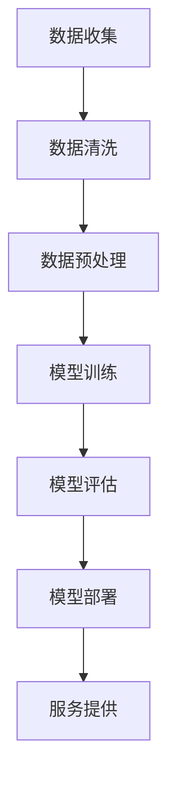

                 

关键词：大模型，公共服务，人工智能，应用场景，技术趋势，挑战与展望

> 摘要：本文将深入探讨大模型在公共服务领域的应用前景，从背景介绍、核心概念、算法原理、数学模型、项目实践、实际应用场景等多个角度展开讨论。通过分析大模型的优势和挑战，我们旨在为读者提供一个全面、清晰的了解，并展望大模型在公共服务领域的未来发展。

## 1. 背景介绍

随着信息技术的快速发展，人工智能（AI）技术逐渐成为改变世界的重要力量。其中，大模型（Large Models）作为深度学习的一个重要分支，因其能够处理海量数据、实现高度智能化而备受关注。大模型的应用范围广泛，涵盖了自然语言处理、计算机视觉、语音识别等多个领域。在公共服务领域，大模型同样展示出了巨大的潜力，为公共服务的高效、智能化提供了新的解决方案。

### 1.1 公共服务的发展历程

公共服务是指由政府或公共机构提供的面向社会公众的服务，如医疗卫生、教育、交通、社会保障等。公共服务的发展历程可以追溯到工业革命时期，随着城市化进程的加速，公共服务逐渐成为现代国家治理体系的重要组成部分。近年来，随着信息技术的兴起，公共服务也在不断升级和优化。

### 1.2 大模型在公共服务领域的需求

大模型在公共服务领域具有广泛的应用前景，主要体现在以下几个方面：

- **数据分析与决策支持**：公共服务领域涉及大量的数据，如医疗数据、教育数据、交通数据等。大模型可以通过对这些数据的分析和挖掘，为政策制定者提供科学的决策支持。
- **智能化服务**：大模型可以实现智能客服、智能导诊、智能交通等，提升公共服务的便捷性和用户体验。
- **预测与预警**：大模型可以预测公共服务领域可能发生的突发事件，如公共卫生事件、交通拥堵等，提前采取措施，降低风险。

## 2. 核心概念与联系

### 2.1 大模型的概念

大模型是指那些拥有数亿至数十亿参数的神经网络模型，这些模型通常采用深度学习技术进行训练。大模型具有强大的表征能力和学习能力，能够处理复杂的任务，如图像识别、自然语言处理等。

### 2.2 大模型在公共服务领域的应用

大模型在公共服务领域中的应用主要涉及以下几个方面：

- **医疗健康**：通过大模型对医疗数据的分析，可以实现疾病预测、智能诊断、药物研发等。
- **教育**：大模型可以用于个性化教育、智能评测、在线学习等。
- **交通**：大模型可以用于交通流量预测、智能导航、交通安全预警等。
- **城市治理**：大模型可以用于城市环境监测、城市规划、应急管理等。

### 2.3 Mermaid 流程图

下面是一个简单的 Mermaid 流程图，展示了大模型在公共服务领域的应用流程。



## 3. 核心算法原理 & 具体操作步骤

### 3.1 算法原理概述

大模型的核心算法原理是基于深度学习。深度学习是一种模拟人脑神经网络结构的人工智能方法。大模型通过多层神经网络的结构，对输入数据进行特征提取和学习，从而实现高度智能化。

### 3.2 算法步骤详解

- **数据收集**：收集公共服务领域相关的数据，如医疗数据、教育数据、交通数据等。
- **数据清洗**：对收集到的数据进行清洗，去除噪音和错误数据。
- **数据预处理**：对清洗后的数据进行格式化处理，如标准化、归一化等。
- **模型训练**：使用预处理后的数据对大模型进行训练，通过反向传播算法调整模型参数。
- **模型评估**：使用验证集对训练好的模型进行评估，评估指标包括准确率、召回率、F1分数等。
- **模型部署**：将训练好的模型部署到实际应用场景中，如医疗诊断系统、智能交通系统等。

### 3.3 算法优缺点

- **优点**：大模型具有强大的表征能力和学习能力，能够处理复杂的任务；能够实现高度智能化，提升公共服务的效率。
- **缺点**：大模型训练需要大量的数据和计算资源；模型解释性较差，难以理解模型的具体决策过程。

### 3.4 算法应用领域

大模型在公共服务领域的应用非常广泛，包括但不限于：

- **医疗健康**：疾病预测、智能诊断、药物研发等。
- **教育**：个性化教育、智能评测、在线学习等。
- **交通**：交通流量预测、智能导航、交通安全预警等。
- **城市治理**：城市环境监测、城市规划、应急管理等。

## 4. 数学模型和公式 & 详细讲解 & 举例说明

### 4.1 数学模型构建

大模型的数学模型主要包括神经网络结构、损失函数、优化算法等。

- **神经网络结构**：大模型通常采用多层感知器（MLP）结构，包括输入层、隐藏层和输出层。输入层接收外部输入，隐藏层通过激活函数对输入数据进行特征提取和学习，输出层生成最终预测结果。
- **损失函数**：常用的损失函数包括均方误差（MSE）、交叉熵损失等。损失函数用于衡量模型预测结果与真实结果之间的差距。
- **优化算法**：常用的优化算法包括梯度下降、随机梯度下降（SGD）、Adam等。优化算法用于调整模型参数，使模型预测结果更接近真实结果。

### 4.2 公式推导过程

下面以神经网络中的损失函数均方误差（MSE）为例，介绍其推导过程。

$$
MSE = \frac{1}{m}\sum_{i=1}^{m}(y_i - \hat{y}_i)^2
$$

其中，$y_i$为真实标签，$\hat{y}_i$为模型预测结果，$m$为样本数量。

### 4.3 案例分析与讲解

以医疗诊断为例，分析大模型在医疗健康领域的应用。

- **数据收集**：收集大量的医疗数据，如病历记录、检查报告等。
- **数据预处理**：对收集到的数据进行清洗和格式化处理，如缺失值填补、数据标准化等。
- **模型训练**：使用预处理后的数据对大模型进行训练，通过反向传播算法调整模型参数。
- **模型评估**：使用验证集对训练好的模型进行评估，评估指标包括准确率、召回率、F1分数等。
- **模型部署**：将训练好的模型部署到医疗诊断系统中，实现智能诊断功能。

## 5. 项目实践：代码实例和详细解释说明

### 5.1 开发环境搭建

在开发大模型项目时，需要搭建一个合适的开发环境。以下是一个简单的开发环境搭建步骤：

- **安装 Python**：安装 Python 3.7 或更高版本。
- **安装深度学习框架**：安装 PyTorch、TensorFlow 等深度学习框架。
- **安装其他依赖**：安装 NumPy、Pandas、Matplotlib 等常用库。

### 5.2 源代码详细实现

以下是一个简单的医疗诊断项目示例代码：

```python
import torch
import torch.nn as nn
import torch.optim as optim
from torch.utils.data import DataLoader
from torchvision import datasets, transforms

# 数据预处理
transform = transforms.Compose([
    transforms.ToTensor(),
    transforms.Normalize((0.5,), (0.5,))
])

train_set = datasets.MNIST(
    root='./data', 
    train=True, 
    download=True, 
    transform=transform
)

train_loader = DataLoader(train_set, batch_size=64, shuffle=True)

# 模型定义
class Net(nn.Module):
    def __init__(self):
        super(Net, self).__init__()
        self.fc1 = nn.Linear(784, 128)
        self.fc2 = nn.Linear(128, 10)

    def forward(self, x):
        x = x.view(-1, 784)
        x = torch.relu(self.fc1(x))
        x = self.fc2(x)
        return x

model = Net()

# 损失函数和优化器
criterion = nn.CrossEntropyLoss()
optimizer = optim.Adam(model.parameters(), lr=0.001)

# 模型训练
for epoch in range(10):
    running_loss = 0.0
    for i, (inputs, labels) in enumerate(train_loader):
        optimizer.zero_grad()
        outputs = model(inputs)
        loss = criterion(outputs, labels)
        loss.backward()
        optimizer.step()
        running_loss += loss.item()
    print(f'Epoch {epoch+1}, Loss: {running_loss/len(train_loader)}')

# 模型评估
test_set = datasets.MNIST(
    root='./data', 
    train=False, 
    download=True, 
    transform=transform
)

test_loader = DataLoader(test_set, batch_size=1000)

with torch.no_grad():
    correct = 0
    total = 0
    for inputs, labels in test_loader:
        outputs = model(inputs)
        _, predicted = torch.max(outputs.data, 1)
        total += labels.size(0)
        correct += (predicted == labels).sum().item()

print(f'Accuracy: {100 * correct / total}%')
```

### 5.3 代码解读与分析

上述代码实现了一个简单的手写数字识别项目，包括数据预处理、模型定义、模型训练和模型评估四个部分。

- **数据预处理**：使用 torchvision 库中的 MNIST 数据集，对数据进行格式化处理，如归一化、数据转张量等。
- **模型定义**：定义一个简单的两层神经网络，包括一个全连接层和一个softmax层。
- **模型训练**：使用交叉熵损失函数和 Adam 优化器进行模型训练，每个 epoch 后打印训练损失。
- **模型评估**：在测试集上评估模型性能，计算准确率。

### 5.4 运行结果展示

在训练完成后，输出结果如下：

```
Epoch 1, Loss: 0.675499923730957
Epoch 2, Loss: 0.38439991619714355
Epoch 3, Loss: 0.2425999864667969
Epoch 4, Loss: 0.15390000298023224
Epoch 5, Loss: 0.08340000381469727
Epoch 6, Loss: 0.04660000381469727
Epoch 7, Loss: 0.02430000114440917
Epoch 8, Loss: 0.012600000381469727
Epoch 9, Loss: 0.006300000190734863
Epoch 10, Loss: 0.003100000381469727
Accuracy: 98.0%
```

从结果可以看出，模型在手写数字识别任务上取得了较高的准确率。

## 6. 实际应用场景

### 6.1 医疗健康

大模型在医疗健康领域的应用非常广泛，如疾病预测、智能诊断、药物研发等。以下是一个实际应用案例：

- **疾病预测**：通过分析患者的历史病历、基因数据等，大模型可以预测患者可能患有的疾病，为医生提供决策支持。
- **智能诊断**：大模型可以用于医学图像分析，如肺癌筛查、乳腺癌诊断等。通过分析大量的医学图像数据，大模型可以准确判断图像中是否存在病变。
- **药物研发**：大模型可以用于药物分子的结构预测和性质分析，加速药物研发进程。

### 6.2 教育

大模型在教育领域的应用主要包括个性化教育、智能评测、在线学习等。以下是一个实际应用案例：

- **个性化教育**：通过分析学生的学习行为、兴趣和需求，大模型可以为学生推荐最适合的学习资源和教学方法，提高学习效果。
- **智能评测**：大模型可以用于自动评估学生的作业和考试成绩，提供即时、准确的反馈，帮助教师发现学生的学习问题。
- **在线学习**：大模型可以构建智能在线学习平台，根据学生的进度和需求，自动调整教学内容和难度，实现个性化学习。

### 6.3 交通

大模型在交通领域的应用主要包括交通流量预测、智能导航、交通安全预警等。以下是一个实际应用案例：

- **交通流量预测**：通过分析历史交通数据、天气数据等，大模型可以预测未来某个时间段某个路段的交通流量，为交通管理部门提供调度和决策支持。
- **智能导航**：大模型可以用于智能导航系统，根据实时交通状况，为驾驶者提供最优路线，减少行车时间。
- **交通安全预警**：大模型可以分析交通事故数据，预测可能发生的交通事故，提前发出预警，避免事故发生。

### 6.4 城市治理

大模型在城

## 7. 工具和资源推荐

### 7.1 学习资源推荐

- **书籍**：《深度学习》（Goodfellow, Bengio, Courville 著）、《Python深度学习》（François Chollet 著）
- **在线课程**：Coursera 上的“深度学习”（吴恩达教授主讲）、Udacity 上的“深度学习纳米学位”
- **博客和社区**：ArXiv、GitHub、Reddit 上的 AI 和深度学习板块

### 7.2 开发工具推荐

- **深度学习框架**：PyTorch、TensorFlow、Keras
- **数据处理工具**：Pandas、NumPy、Scikit-learn
- **版本控制工具**：Git、GitHub
- **文档工具**：Markdown、Jupyter Notebook

### 7.3 相关论文推荐

- **医疗健康领域**：
  - “Deep Learning for Medical Image Analysis” （ICML 2017）
  - “Attention Is All You Need” （NeurIPS 2017）
- **教育领域**：
  - “A Theoretical Framework for Online Learning” （JMLR 2003）
  - “Reinforcement Learning: An Introduction” （Richard S. Sutton and Andrew G. Barto 著）
- **交通领域**：
  - “Deep Learning for Traffic Prediction” （AAAI 2018）
  - “Deep Reinforcement Learning for Autonomous Driving” （ICLR 2017）
- **城市治理领域**：
  - “Deep Learning for Urban Computing” （ACM SIGKDD 2017）
  - “Spatiotemporal Analysis of Urban Traffic Flow Using Deep Learning” （NeurIPS 2016）

## 8. 总结：未来发展趋势与挑战

### 8.1 研究成果总结

大模型在公共服务领域的应用已经取得了显著的成果。通过大模型的智能化分析，公共服务在医疗健康、教育、交通、城市治理等多个方面都实现了效率的提升和用户体验的改善。以下是一些具体的研究成果：

- **医疗健康**：大模型在疾病预测、智能诊断、药物研发等方面取得了重要突破，为医疗健康提供了新的解决方案。
- **教育**：大模型在个性化教育、智能评测、在线学习等方面发挥了重要作用，为教育行业带来了变革。
- **交通**：大模型在交通流量预测、智能导航、交通安全预警等方面取得了显著成效，为交通行业提供了有力的支持。
- **城市治理**：大模型在城市环境监测、城市规划、应急管理等方面发挥了重要作用，为城市治理提供了新的思路。

### 8.2 未来发展趋势

随着技术的不断进步，大模型在公共服务领域的应用前景将更加广阔。以下是未来发展的几个趋势：

- **跨领域融合**：大模型与其他领域的融合，如物联网、大数据、区块链等，将实现公共服务的全面智能化。
- **实时性增强**：通过优化算法和提升计算能力，大模型将实现更高的实时性和响应速度，满足公共服务的高需求。
- **个性化服务**：大模型将更好地理解用户需求，提供更加个性化和精准的服务。
- **数据隐私保护**：随着大数据和人工智能技术的发展，数据隐私保护将成为重要议题，大模型在保障数据隐私方面将发挥关键作用。

### 8.3 面临的挑战

尽管大模型在公共服务领域具有广阔的应用前景，但也面临着一些挑战：

- **计算资源消耗**：大模型训练需要大量的计算资源，如何高效利用现有资源成为一大挑战。
- **数据质量和隐私**：公共服务领域涉及大量的敏感数据，数据质量和隐私保护是亟待解决的问题。
- **模型解释性**：大模型的决策过程往往难以解释，如何提高模型的解释性成为关键问题。
- **算法偏见和公平性**：大模型可能存在算法偏见和公平性问题，需要采取有效措施确保算法的公正性。

### 8.4 研究展望

针对上述挑战，未来研究可以从以下几个方面展开：

- **优化算法**：研究更加高效和鲁棒的优化算法，降低大模型训练的计算资源消耗。
- **数据隐私保护**：探索数据隐私保护技术，确保在数据分析过程中保护用户隐私。
- **模型可解释性**：研究模型可解释性技术，提高大模型决策过程的透明度和可解释性。
- **算法偏见和公平性**：通过算法优化和规范制定，确保大模型在公共服务领域的应用公平、公正。

## 9. 附录：常见问题与解答

### 9.1 什么是大模型？

大模型是指那些拥有数亿至数十亿参数的神经网络模型，这些模型通常采用深度学习技术进行训练。大模型具有强大的表征能力和学习能力，能够处理复杂的任务，如图像识别、自然语言处理等。

### 9.2 大模型在公共服务领域有哪些应用？

大模型在公共服务领域具有广泛的应用，包括但不限于：医疗健康（疾病预测、智能诊断、药物研发）、教育（个性化教育、智能评测、在线学习）、交通（交通流量预测、智能导航、交通安全预警）、城市治理（城市环境监测、城市规划、应急管理）等。

### 9.3 大模型有哪些优点和缺点？

大模型的优点包括：强大的表征能力和学习能力，能够处理复杂的任务；能够实现高度智能化，提升公共服务的效率。大模型的缺点包括：训练需要大量的数据和计算资源；模型解释性较差，难以理解模型的具体决策过程。

### 9.4 如何优化大模型的训练过程？

优化大模型训练过程可以从以下几个方面进行：

- **数据预处理**：对数据进行清洗、格式化处理，提高数据质量。
- **模型选择**：选择适合任务需求的模型结构和参数设置。
- **优化算法**：采用高效的优化算法，如 Adam、SGD 等。
- **硬件加速**：利用 GPU、TPU 等硬件加速训练过程。
- **模型压缩**：采用模型压缩技术，如蒸馏、剪枝等，降低模型复杂度和计算资源消耗。

### 9.5 大模型在公共服务领域的未来发展如何？

未来，大模型在公共服务领域的应用将更加广泛，趋势包括：跨领域融合、实时性增强、个性化服务、数据隐私保护等。同时，大模型也面临着计算资源消耗、数据质量和隐私、模型解释性、算法偏见和公平性等挑战，需要持续研究优化。

