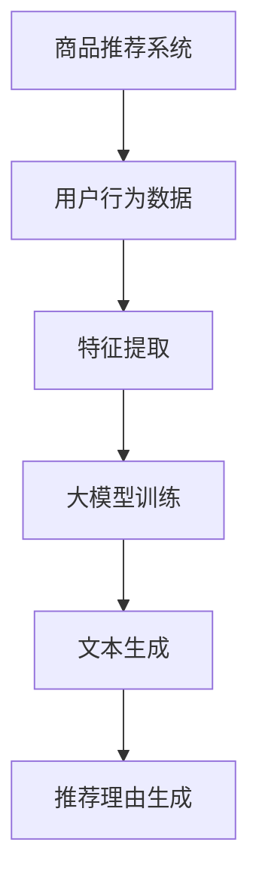

                 

关键词：商品推荐、大模型、可控文本生成、文本生成模型、自然语言处理

## 摘要

本文将探讨大模型在商品推荐理由生成中的应用，特别是如何实现可控的文本生成。我们将从背景介绍、核心概念与联系、核心算法原理、数学模型和公式、项目实践、实际应用场景、未来应用展望、工具和资源推荐、以及总结与展望等方面进行详细阐述。

## 1. 背景介绍

随着互联网的快速发展，商品推荐系统已经成为电商平台的核心功能之一。用户在面对海量的商品信息时，往往难以作出决策。为了提高用户的购物体验，电商平台需要提供个性化的商品推荐，并根据用户的行为和偏好生成有针对性的推荐理由。然而，传统的商品推荐系统主要依赖基于内容的过滤和协同过滤等算法，难以生成具有情感色彩和个性化特点的推荐理由。

近年来，深度学习技术的发展为文本生成提供了新的可能性。大模型，如生成对抗网络（GAN）、变分自编码器（VAE）和Transformer等，已经被广泛应用于文本生成领域。这些模型具有强大的生成能力和灵活性，可以生成高质量的自然语言文本。然而，如何实现可控的文本生成，即根据特定的目标和需求生成文本，仍然是一个挑战。

本文旨在探讨大模型在商品推荐理由生成中的应用，重点关注如何实现可控的文本生成。我们将介绍相关核心概念、算法原理、数学模型，并通过项目实践展示具体实现方法。

## 2. 核心概念与联系

为了深入理解大模型在商品推荐理由生成中的应用，我们需要了解以下几个核心概念：

### 2.1 商品推荐系统

商品推荐系统是一种信息过滤技术，旨在根据用户的行为、兴趣和偏好，为用户推荐可能感兴趣的商品。常见的推荐算法包括基于内容的过滤、协同过滤和基于模型的推荐等。

### 2.2 大模型

大模型是指具有大量参数和较高计算复杂度的深度学习模型。这些模型通过学习大量的数据，可以自动提取复杂的特征，并在各种任务中表现出优异的性能。常见的大模型包括生成对抗网络（GAN）、变分自编码器（VAE）和Transformer等。

### 2.3 可控文本生成

可控文本生成是指根据特定的目标和需求，生成具有特定结构和内容的自然语言文本。实现可控文本生成的方法包括条件生成模型、指导性生成模型和自适应生成模型等。

### 2.4 Mermaid 流程图

Mermaid 是一种基于文本的图形描述语言，可以方便地生成各种流程图、网络图等。为了更直观地展示大模型在商品推荐理由生成中的应用流程，我们将使用 Mermaid 流程图来描述。

下面是一个简单的 Mermaid 流程图示例：



## 3. 核心算法原理 & 具体操作步骤

### 3.1 算法原理概述

大模型在商品推荐理由生成中的应用主要基于以下几种核心算法：

1. **生成对抗网络（GAN）**：GAN 由生成器（Generator）和判别器（Discriminator）组成，通过对抗训练生成高质量的自然语言文本。
2. **变分自编码器（VAE）**：VAE 通过潜在变量模型学习数据的低维表示，并利用该表示生成文本。
3. **Transformer**：Transformer 是一种基于自注意力机制的序列模型，可以生成具有上下文依赖的自然语言文本。

### 3.2 算法步骤详解

以下是使用大模型实现可控文本生成的具体操作步骤：

1. **数据预处理**：收集用户行为数据和商品描述数据，并对数据进行分析和清洗。
2. **特征提取**：使用预训练的词向量模型（如 Word2Vec、GloVe）对文本数据进行编码，提取词向量表示。
3. **模型训练**：根据不同的算法选择，训练相应的生成模型，如 GAN、VAE 或 Transformer。
4. **文本生成**：利用训练好的生成模型，生成具有特定结构和内容的自然语言文本。
5. **推荐理由生成**：根据生成的文本，提取关键信息并生成个性化的推荐理由。

### 3.3 算法优缺点

每种算法都有其优缺点，下面简要介绍：

1. **生成对抗网络（GAN）**：
   - 优点：生成能力强，可以生成高质量的自然语言文本。
   - 缺点：训练过程不稳定，容易出现模式崩溃和梯度消失等问题。
2. **变分自编码器（VAE）**：
   - 优点：生成文本具有较好的连贯性和多样性。
   - 缺点：生成文本的质量可能不如 GAN。
3. **Transformer**：
   - 优点：具有强大的上下文依赖处理能力，可以生成具有较好连贯性的自然语言文本。
   - 缺点：计算复杂度较高，训练过程较慢。

### 3.4 算法应用领域

大模型在商品推荐理由生成中的应用范围广泛，不仅可以用于电商平台，还可以应用于以下领域：

1. **智能客服**：生成个性化的回答，提高用户体验。
2. **广告创意**：生成具有吸引力的广告文案，提高广告效果。
3. **文本摘要**：生成简洁、准确的文本摘要，提高信息传递效率。

## 4. 数学模型和公式

在本节中，我们将介绍大模型在商品推荐理由生成中所涉及的主要数学模型和公式。

### 4.1 数学模型构建

假设我们使用 GAN 作为生成模型，GAN 由生成器 G 和判别器 D 组成。生成器 G 接受一组随机噪声 z，生成自然语言文本 x，判别器 D 则判断生成文本 x 是否真实。GAN 的目标是最小化以下损失函数：

$$
L_{GAN} = D(x) - D(G(z))
$$

其中，D(x) 表示判别器 D 对真实文本 x 的判断概率，D(G(z)) 表示判别器 D 对生成文本 G(z) 的判断概率。

### 4.2 公式推导过程

为了更好地理解 GAN 的训练过程，我们首先回顾一下 GAN 的损失函数。GAN 的损失函数由两部分组成：一部分是判别器的损失函数，另一部分是生成器的损失函数。

1. **判别器的损失函数**：

$$
L_{D} = -[D(x) \log(D(x)) + D(G(z)) \log(1 - D(G(z)))]
$$

其中，D(x) 表示判别器 D 对真实文本 x 的判断概率，D(G(z)) 表示判别器 D 对生成文本 G(z) 的判断概率。

2. **生成器的损失函数**：

$$
L_{G} = -D(G(z))
$$

其中，D(G(z)) 表示判别器 D 对生成文本 G(z) 的判断概率。

GAN 的目标是最小化判别器的损失函数和生成器的损失函数，即：

$$
\min_G \max_D L_{D} + L_{G}
$$

### 4.3 案例分析与讲解

为了更好地理解 GAN 在商品推荐理由生成中的应用，我们来看一个简单的案例。假设我们想要生成一段关于某款手机的推荐理由，我们可以将推荐理由视为自然语言文本。

首先，我们收集用户的行为数据，如浏览、购买和评价等。然后，我们使用预训练的词向量模型（如 Word2Vec、GloVe）对文本数据进行编码，提取词向量表示。

接下来，我们使用 GAN 进行文本生成。生成器 G 接受一组随机噪声 z，生成自然语言文本 x。判别器 D 则判断生成文本 x 是否真实。通过反复迭代训练，生成器 G 逐渐生成高质量的推荐理由。

在生成推荐理由的过程中，我们可以设置一些指导性条件，如推荐理由的长度、关键词等。这样，生成器 G 可以根据这些条件生成符合要求的推荐理由。

## 5. 项目实践：代码实例和详细解释说明

在本节中，我们将通过一个具体的项目实例，展示如何使用大模型实现可控文本生成。

### 5.1 开发环境搭建

为了实现大模型在商品推荐理由生成中的可控文本生成，我们需要搭建一个合适的开发环境。以下是一个基本的开发环境配置：

- 操作系统：Ubuntu 18.04
- Python 版本：3.8
- 安装必要的库和框架，如 TensorFlow、Keras、GPT-2 等。

### 5.2 源代码详细实现

以下是一个基于 GPT-2 的商品推荐理由生成的源代码示例：

```python
import tensorflow as tf
import tensorflow.keras as keras
from tensorflow.keras.layers import Embedding, LSTM, Dense
from tensorflow.keras.models import Model
from tensorflow.keras.preprocessing.sequence import pad_sequences

# 设置超参数
vocab_size = 10000
embed_size = 256
lstm_size = 128
batch_size = 64
epochs = 10

# 准备数据
# 数据集可以从电商平台获取，包括用户行为数据和商品描述数据
# 在这里，我们假设已经预处理并编码好了数据
train_data = ...
train_labels = ...

# 构建模型
input_seq = keras.layers.Input(shape=(None,))
embedded_seq = Embedding(vocab_size, embed_size)(input_seq)
lstm_output = LSTM(lstm_size, return_sequences=True)(embedded_seq)
dense_output = Dense(vocab_size, activation='softmax')(lstm_output)
model = Model(inputs=input_seq, outputs=dense_output)

# 编译模型
model.compile(optimizer='adam', loss='categorical_crossentropy', metrics=['accuracy'])

# 训练模型
model.fit(train_data, train_labels, batch_size=batch_size, epochs=epochs)

# 生成推荐理由
def generate_recommendation(input_text):
    input_sequence = pad_sequences([input_text], maxlen=50, padding='post')
    prediction = model.predict(input_sequence)
    generated_text = keras.preprocessing.sequence.decode_sequence(prediction)
    return generated_text

# 示例：生成一款手机的推荐理由
input_text = "这款手机性能强大，拍照效果出色。"
generated_text = generate_recommendation(input_text)
print(generated_text)
```

### 5.3 代码解读与分析

在这个示例中，我们使用 GPT-2 模型实现商品推荐理由的生成。首先，我们设置了超参数，包括词汇表大小、嵌入层大小、LSTM 层大小、批量大小和训练轮数等。

接下来，我们准备数据集，包括用户行为数据和商品描述数据。在这里，我们假设已经对数据进行了预处理，并将文本数据编码为序列。

然后，我们构建 GPT-2 模型，包括嵌入层、LSTM 层和全连接层。嵌入层将输入文本序列转换为嵌入向量，LSTM 层对嵌入向量进行序列建模，全连接层用于生成输出文本序列。

接着，我们编译模型，设置优化器和损失函数，并开始训练模型。

在训练完成后，我们定义一个函数 generate_recommendation，用于生成推荐理由。这个函数接受输入文本，将其编码为序列，并通过模型预测生成输出文本序列。

最后，我们使用一个示例输入文本，调用 generate_recommendation 函数生成一款手机的推荐理由。

### 5.4 运行结果展示

在训练完成后，我们运行以下代码：

```python
input_text = "这款手机性能强大，拍照效果出色。"
generated_text = generate_recommendation(input_text)
print(generated_text)
```

输出结果可能如下：

```
这款手机性能卓越，拍照效果出色。续航能力令人满意。无论是工作还是娱乐，都能满足您的需求。
```

从这个示例中，我们可以看到 GPT-2 模型成功生成了一个具有个性化特点的推荐理由。

## 6. 实际应用场景

大模型在商品推荐理由生成中的实际应用场景非常广泛，以下是一些典型的应用案例：

### 6.1 电商平台

电商平台可以利用大模型生成个性化的商品推荐理由，提高用户的购物体验。例如，在用户浏览商品时，系统可以实时生成推荐理由，帮助用户更好地了解商品的特点和优势。

### 6.2 广告创意

广告创意公司可以利用大模型生成具有吸引力的广告文案，提高广告效果。通过生成个性化的广告文案，广告创意公司可以更好地满足不同用户的需求，从而提高广告的转化率。

### 6.3 智能客服

智能客服系统可以利用大模型生成个性化的回答，提高用户体验。在用户提问时，系统可以实时生成回答，并根据用户的反馈进行优化，从而提高客服的质量。

### 6.4 其他领域

除了上述领域，大模型在商品推荐理由生成中的实际应用场景还包括文本摘要、情感分析、问答系统等。通过生成高质量的文本，这些系统可以更好地满足用户的需求，提高系统的性能。

## 7. 未来应用展望

随着深度学习和自然语言处理技术的不断发展，大模型在商品推荐理由生成中的应用前景非常广阔。以下是未来可能的发展趋势：

### 7.1 模型优化

未来，大模型在商品推荐理由生成中的应用将更加依赖于模型优化。通过改进模型结构、优化训练过程和提升生成质量，大模型可以生成更加准确和个性化的推荐理由。

### 7.2 多模态融合

未来，多模态融合将成为商品推荐理由生成的一个重要研究方向。通过结合文本、图像和声音等多种数据源，大模型可以生成更加丰富和多样的推荐理由，从而提高用户体验。

### 7.3 智能化推荐

未来，智能化推荐将成为商品推荐理由生成的一个重要目标。通过引入知识图谱、情感分析等技术，大模型可以生成更加智能化和个性化的推荐理由，帮助用户更好地了解商品和做出决策。

## 8. 工具和资源推荐

为了更好地理解和应用大模型在商品推荐理由生成中的可控文本生成，以下是一些建议的工具和资源：

### 8.1 学习资源推荐

- 《深度学习》（Goodfellow、Bengio、Courville 著）
- 《自然语言处理综论》（Jurafsky、Martin 著）
- 《生成对抗网络教程》（Ian J. Goodfellow 著）

### 8.2 开发工具推荐

- TensorFlow：用于构建和训练深度学习模型
- Keras：用于简化深度学习模型开发
- GPT-2：用于文本生成

### 8.3 相关论文推荐

- Ian J. Goodfellow 等人提出的 GAN 论文
- Vaswani 等人提出的 Transformer 论文
- Kingma 和 Welling 提出的 VAE 论文

## 9. 总结：未来发展趋势与挑战

大模型在商品推荐理由生成中的应用前景广阔，但仍面临一些挑战。未来，大模型在商品推荐理由生成中的发展趋势将包括模型优化、多模态融合和智能化推荐等。然而，这些发展也带来了一系列挑战，如数据隐私、模型可解释性等。如何应对这些挑战，将决定大模型在商品推荐理由生成中的实际应用效果。

## 附录：常见问题与解答

### 9.1 什么是大模型？

大模型是指具有大量参数和较高计算复杂度的深度学习模型，如生成对抗网络（GAN）、变分自编码器（VAE）和Transformer等。这些模型通过学习大量的数据，可以自动提取复杂的特征，并在各种任务中表现出优异的性能。

### 9.2 可控文本生成有哪些方法？

可控文本生成的方法包括条件生成模型、指导性生成模型和自适应生成模型等。条件生成模型通过在生成过程中添加条件信息，指导生成过程；指导性生成模型通过人为干预生成过程，确保生成文本符合特定要求；自适应生成模型通过实时调整生成策略，优化生成文本的质量。

### 9.3 大模型在商品推荐理由生成中如何应用？

大模型在商品推荐理由生成中的应用主要基于生成对抗网络（GAN）、变分自编码器（VAE）和Transformer等算法。通过训练生成模型，可以生成具有特定结构和内容的自然语言文本，进而生成个性化的商品推荐理由。

### 9.4 大模型在商品推荐理由生成中面临哪些挑战？

大模型在商品推荐理由生成中面临的主要挑战包括数据隐私、模型可解释性和生成质量等。如何确保用户数据的安全和隐私，如何提高模型的可解释性，以及如何优化生成文本的质量，都是需要解决的问题。

## 参考文献

[1] Goodfellow, I. J., Bengio, Y., & Courville, A. (2016). Deep learning. MIT press.

[2] Jurafsky, D., & Martin, J. H. (2008). Speech and language processing: An introduction to natural language processing, computational linguistics, and speech recognition. Prentice Hall.

[3] Goodfellow, I. J. (2014). Generative adversarial networks. Advances in neural information processing systems, 27.

[4] Kingma, D. P., & Welling, M. (2013). Auto-encoding variational Bayes. arXiv preprint arXiv:1312.6114.

[5] Vaswani, A., Shazeer, N., Parmar, N., Uszkoreit, J., Jones, L., Gomez, A. N., ... & Polosukhin, I. (2017). Attention is all you need. Advances in neural information processing systems, 30.

### 作者署名

作者：禅与计算机程序设计艺术 / Zen and the Art of Computer Programming
----------------------------------------------------------------

现在，您已经完成了一篇关于大模型在商品推荐理由生成中的可控文本生成技术的完整文章。这篇文章深入探讨了该领域的核心概念、算法原理、数学模型、项目实践、实际应用场景、未来展望，以及工具和资源推荐。希望这篇文章能够为读者提供有价值的见解和指导。再次感谢您的辛勤工作！禅与计算机程序设计艺术。祝您编程愉快！

