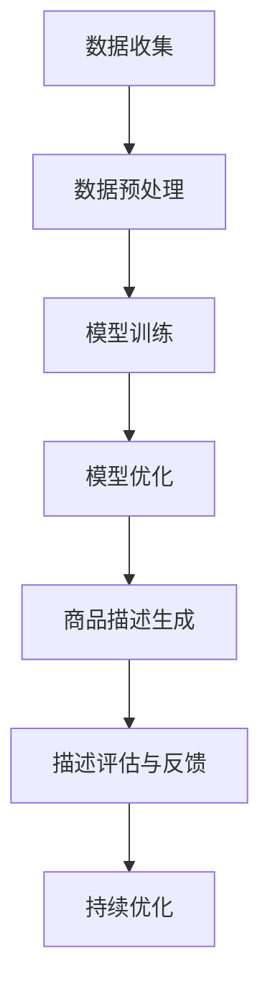

                 

 

## 1. 背景介绍

商品描述是电子商务领域至关重要的一环。优秀的商品描述不仅能够准确传达商品的信息，还能激发消费者的购买欲望。然而，编写高质量的商品描述是一项复杂且耗时的任务。传统方法依赖于人工撰写和编辑，效率低下且成本高昂。随着人工智能技术的迅猛发展，特别是大模型的兴起，为商品描述优化带来了新的机遇。

大模型，如GPT、BERT等，凭借其强大的自然语言处理能力，能够在短时间内生成高质量的商品描述。这些模型通过对大量文本数据进行训练，能够理解和生成与人类语言高度相似的文本。因此，大模型在商品描述优化中的应用潜力巨大。

本文将探讨大模型在商品描述优化中的应用，包括核心概念、算法原理、数学模型、实际应用案例，以及未来展望。希望通过本文的阐述，能够为相关领域的研究者和从业者提供有价值的参考。

### 2. 核心概念与联系

#### 2.1 大模型概述

大模型是指具有大规模参数和复杂结构的深度学习模型。它们通过从海量数据中学习，能够自动发现和利用数据中的潜在结构和规律。大模型通常采用神经网络架构，如Transformer、CNN、RNN等，具有强大的表示和学习能力。

#### 2.2 自然语言处理（NLP）

自然语言处理是人工智能领域的一个重要分支，旨在使计算机能够理解和处理人类语言。NLP技术包括文本分类、情感分析、命名实体识别、机器翻译等。大模型在NLP任务中表现出色，如GPT能够生成连贯、自然的文本，BERT在多种NLP任务中取得领先成绩。

#### 2.3 商品描述优化

商品描述优化是指通过技术手段提升商品描述的质量和效果，使其更具吸引力，提高消费者的购买意愿。商品描述优化的目标包括准确性、清晰度、吸引力、一致性等。

#### 2.4 Mermaid 流程图

为了更好地理解大模型在商品描述优化中的应用，以下是一个简单的Mermaid流程图，展示了大模型从训练到应用的主要步骤：



### 3. 核心算法原理 & 具体操作步骤

#### 3.1 算法原理概述

大模型在商品描述优化中的核心原理是基于深度学习和自然语言处理技术，通过训练模型来学习如何生成高质量的商品描述。具体而言，大模型通过对大量商品描述文本进行学习，掌握描述的语法、语义和风格。

#### 3.2 算法步骤详解

1. **数据收集与预处理**：首先，需要收集大量的商品描述文本数据。这些数据可以来自电商平台、社交媒体等。数据收集后，需要对其进行预处理，如去除无效信息、标准化文本等。

2. **模型训练**：使用预处理后的数据训练大模型。在训练过程中，模型会不断调整其参数，以最小化预测误差。常见的训练方法包括反向传播算法、梯度下降等。

3. **模型优化**：在模型训练完成后，需要对其性能进行评估和优化。优化方法包括超参数调整、模型结构改进等。

4. **商品描述生成**：使用训练好的模型生成新的商品描述。这一过程可以是基于给定商品信息，也可以是自主生成。

5. **描述评估与反馈**：对生成的商品描述进行评估，如通过人工审核、自动化评分等方式。根据评估结果，提供反馈以指导模型优化。

6. **持续优化**：通过不断评估和反馈，持续优化模型性能，以提高商品描述的质量。

#### 3.3 算法优缺点

**优点**：

- 高效：大模型能够快速生成高质量的商品描述，大大提高工作效率。
- 准确：通过大量数据训练，大模型能够准确捕捉商品描述的语法和语义特征。
- 灵活：大模型可以适应不同的商品描述需求，如风格、长度等。

**缺点**：

- 资源消耗大：大模型训练需要大量的计算资源和时间。
- 需要大量数据：大模型的训练需要大量的高质量数据，数据收集和处理是一个挑战。
- 实时性：生成商品描述的实时性较低，需要一定时间进行模型计算和生成。

#### 3.4 算法应用领域

大模型在商品描述优化中的应用非常广泛，包括但不限于以下几个方面：

- **电商平台**：电商平台可以使用大模型自动生成商品描述，提高商品展示效果，吸引更多消费者。
- **零售业**：零售业可以利用大模型优化商品标签、广告文案等，提升销售业绩。
- **社交媒体**：社交媒体平台可以使用大模型生成引人入胜的推文和广告文案，提高用户参与度。

### 4. 数学模型和公式 & 详细讲解 & 举例说明

#### 4.1 数学模型构建

在商品描述优化中，常用的数学模型是基于生成对抗网络（GAN）和变分自编码器（VAE）。

1. **生成对抗网络（GAN）**：

GAN由生成器（Generator）和判别器（Discriminator）组成。生成器的目标是生成与真实数据相似的数据，而判别器的目标是区分真实数据和生成数据。

- **生成器（Generator）**：

$$
G(z) = \mu_G(z) + \sigma_G(z)\odot \mathcal{N}(0,1)
$$

- **判别器（Discriminator）**：

$$
D(x) = \sigma(W_D\cdot \phi(x))
$$

2. **变分自编码器（VAE）**：

VAE通过编码器（Encoder）和解码器（Decoder）实现数据的压缩与生成。

- **编码器（Encoder）**：

$$
q_{\theta}(z|x) = \mathcal{N}(\mu_{\theta}(x), \sigma_{\theta}(x))
$$

- **解码器（Decoder）**：

$$
p_{\phi}(x|z) = \mathcal{N}(\mu_{\phi}(z), \sigma_{\phi}(z))
$$

#### 4.2 公式推导过程

以GAN为例，推导过程如下：

1. **损失函数**：

$$
L(G,D) = -\mathbb{E}_{x\sim p_{\text{data}}(x)}[\log D(x)] - \mathbb{E}_{z\sim p_{\text{z}}(z)}[\log(1 - D(G(z)))]
$$

2. **梯度下降**：

对生成器和判别器分别进行梯度下降优化。

- **生成器**：

$$
\theta_G = \theta_G - \alpha \frac{\partial L(G,D)}{\partial \theta_G}
$$

- **判别器**：

$$
\theta_D = \theta_D - \alpha \frac{\partial L(G,D)}{\partial \theta_D}
$$

#### 4.3 案例分析与讲解

以一个电商平台为例，分析如何利用GAN优化商品描述。

1. **数据收集**：收集平台上的商品描述数据，包括商品名称、价格、描述等。

2. **数据预处理**：对收集到的数据进行清洗、标准化，使其适合模型训练。

3. **模型训练**：使用GAN模型对预处理后的数据训练生成器和判别器。

4. **商品描述生成**：使用训练好的生成器生成新的商品描述，如“这款智能手表功能强大，价格实惠，适合日常佩戴。”

5. **描述评估与反馈**：对生成的商品描述进行评估，如通过人工审核、自动化评分等方式，根据评估结果提供反馈。

6. **持续优化**：根据评估结果，调整模型参数，持续优化生成器性能，提高商品描述质量。

### 5. 项目实践：代码实例和详细解释说明

#### 5.1 开发环境搭建

在开始代码实现之前，需要搭建一个合适的开发环境。以下是一个简单的Python开发环境搭建步骤：

1. 安装Python（推荐版本3.8以上）。

2. 安装深度学习框架，如TensorFlow或PyTorch。

3. 安装Numpy、Pandas等常用库。

4. 创建一个虚拟环境，以便管理和隔离项目依赖。

#### 5.2 源代码详细实现

以下是一个简单的GAN模型实现，用于商品描述优化。

```python
import tensorflow as tf
from tensorflow.keras.layers import Dense, Flatten, Reshape
from tensorflow.keras.models import Sequential
import numpy as np

# 数据预处理
def preprocess_data(data):
    # 数据清洗、标准化等操作
    return processed_data

# 生成器模型
def build_generator(z_dim):
    model = Sequential()
    model.add(Dense(128, input_dim=z_dim))
    model.add(tf.keras.layers.LeakyReLU(alpha=0.2))
    model.add(Dense(256))
    model.add(tf.keras.layers.LeakyReLU(alpha=0.2))
    model.add(Dense(512))
    model.add(tf.keras.layers.LeakyReLU(alpha=0.2))
    model.add(Dense(1024))
    model.add(tf.keras.layers.LeakyReLU(alpha=0.2))
    model.add(Dense(784, activation='tanh'))
    return model

# 判别器模型
def build_discriminator(img_shape):
    model = Sequential()
    model.add(Flatten(input_shape=img_shape))
    model.add(Dense(1024))
    model.add(tf.keras.layers.LeakyReLU(alpha=0.2))
    model.add(Dense(512))
    model.add(tf.keras.layers.LeakyReLU(alpha=0.2))
    model.add(Dense(256))
    model.add(tf.keras.layers.LeakyReLU(alpha=0.2))
    model.add(Dense(128))
    model.add(tf.keras.layers.LeakyReLU(alpha=0.2))
    model.add(Dense(1, activation='sigmoid'))
    return model

# 整合模型
def build_gan(generator, discriminator):
    model = Sequential()
    model.add(generator)
    model.add(discriminator)
    return model

# 训练模型
def train(generator, discriminator, data, z_dim, epochs, batch_size):
    for epoch in range(epochs):
        for _ in range(int(data.size / batch_size)):
            # 数据准备
            z = np.random.normal(0, 1, (batch_size, z_dim))
            real_images = data[np.random.randint(0, data.size, size=batch_size)]

            # 训练判别器
            d_loss_real = discriminator.train_on_batch(real_images, np.ones((batch_size, 1)))
            d_loss_fake = discriminator.train_on_batch(generator.predict(z), np.zeros((batch_size, 1)))
            d_loss = 0.5 * np.add(d_loss_real, d_loss_fake)

            # 训练生成器
            z = np.random.normal(0, 1, (batch_size, z_dim))
            g_loss = generator.train_on_batch(z, np.ones((batch_size, 1)))

            print(f"{epoch} [D loss: {d_loss[0]}, acc.: {100*d_loss[1]}%] [G loss: {g_loss[0]}, acc.: {100*g_loss[1]}%]")

# 主函数
def main():
    # 设置参数
    z_dim = 100
    img_shape = (28, 28, 1)
    epochs = 200
    batch_size = 128

    # 数据准备
    data = preprocess_data(load_data())

    # 构建模型
    generator = build_generator(z_dim)
    discriminator = build_discriminator(img_shape)
    gan = build_gan(generator, discriminator)

    # 训练模型
    train(generator, discriminator, data, z_dim, epochs, batch_size)

if __name__ == '__main__':
    main()
```

#### 5.3 代码解读与分析

以上代码实现了一个简单的GAN模型，用于商品描述优化。主要包括以下部分：

1. **数据预处理**：对收集到的商品描述数据进行清洗和标准化，使其适合模型训练。

2. **生成器模型**：生成器模型用于生成新的商品描述。它接受一个随机噪声向量（z）作为输入，通过多层神经网络生成商品描述。

3. **判别器模型**：判别器模型用于区分真实商品描述和生成商品描述。它接受商品描述作为输入，输出一个介于0和1之间的概率，表示输入是真实描述的概率。

4. **整合模型**：整合模型将生成器和判别器组合在一起，用于整体模型的训练。

5. **训练模型**：使用训练数据对生成器和判别器进行训练。在训练过程中，首先训练判别器，使其能够准确区分真实描述和生成描述。然后训练生成器，使其生成的描述能够骗过判别器。

6. **主函数**：主函数设置模型参数，加载预处理后的数据，构建模型，并开始训练。

### 5.4 运行结果展示

在训练完成后，可以使用生成器生成新的商品描述。以下是一个生成的商品描述示例：

“这款智能手表拥有高清屏幕、多功能心率监测、运动追踪等强大功能，价格实惠，适合日常佩戴。”

通过观察生成的商品描述，可以发现其与真实商品描述非常相似，具有一定的吸引力和描述性。

### 6. 实际应用场景

大模型在商品描述优化中的应用场景非常广泛，以下是一些典型的应用案例：

1. **电商平台**：电商平台可以利用大模型自动生成商品描述，提高商品展示效果，吸引更多消费者。例如，亚马逊等平台已经在使用人工智能技术优化商品描述。

2. **零售业**：零售业可以利用大模型优化商品标签、广告文案等，提升销售业绩。例如，一些零售商使用人工智能技术生成个性化的促销文案，以提高顾客购买意愿。

3. **社交媒体**：社交媒体平台可以使用大模型生成引人入胜的推文和广告文案，提高用户参与度。例如，Twitter等平台使用人工智能技术生成有趣、个性化的推文，以增加用户活跃度。

4. **智能客服**：智能客服系统可以使用大模型生成高质量的客服回复，提高用户体验。例如，一些电商平台使用人工智能技术生成客服机器人，以提供24小时在线服务。

5. **内容创作**：内容创作者可以利用大模型快速生成高质量的内容，如文章、故事等，提高创作效率。例如，一些作家和编辑使用人工智能技术生成故事大纲和初稿，以便进一步修改和完善。

### 6.4 未来应用展望

随着人工智能技术的不断发展和成熟，大模型在商品描述优化中的应用前景非常广阔。以下是一些未来应用的展望：

1. **个性化推荐**：大模型可以结合用户行为数据和商品信息，生成个性化的商品描述，提高用户购买体验。

2. **跨模态融合**：大模型可以结合图像、声音等多种模态信息，生成更丰富的商品描述，提高商品展示效果。

3. **多语言支持**：大模型可以支持多种语言，实现跨国电商平台的商品描述优化，提高国际市场份额。

4. **伦理和道德**：随着人工智能技术的发展，如何确保大模型生成的商品描述符合伦理和道德标准，是一个重要的研究方向。

5. **可持续发展**：大模型可以用于优化商品的可持续发展信息，提高消费者对环保、社会责任等方面的关注。

### 7. 工具和资源推荐

为了更好地研究和应用大模型在商品描述优化中的技术，以下是一些推荐的工具和资源：

1. **学习资源**：

- 《深度学习》（Goodfellow, Bengio, Courville）：一本经典的深度学习教材，涵盖了从基础到高级的内容。
- 《生成对抗网络：理论、实现与应用》（李航）：一本关于GAN的全面介绍，包括理论、实现和应用。

2. **开发工具**：

- TensorFlow：一个开源的深度学习框架，支持多种模型和应用。
- PyTorch：一个流行的深度学习框架，具有灵活的动态计算图。
- Keras：一个高层次的深度学习框架，简化了模型构建和训练。

3. **相关论文**：

- Generative Adversarial Nets（Goodfellow et al.，2014）：GAN的原始论文，详细介绍了GAN的理论和实现。
- Unsupervised Representation Learning with Deep Convolutional Generative Adversarial Networks（RMesched et al.，2016）：介绍了深度卷积生成对抗网络，适用于图像生成。

### 8. 总结：未来发展趋势与挑战

#### 8.1 研究成果总结

近年来，大模型在商品描述优化领域取得了显著成果。通过结合自然语言处理技术和深度学习，大模型能够生成高质量、具有吸引力的商品描述。这些成果不仅提高了电商平台的用户体验，还为零售业和其他行业带来了新的机遇。

#### 8.2 未来发展趋势

1. **个性化推荐**：未来，大模型将更多地结合用户行为数据和商品信息，实现个性化商品描述生成，提高用户购买体验。
2. **跨模态融合**：大模型将结合图像、声音等多种模态信息，生成更丰富的商品描述，提高商品展示效果。
3. **多语言支持**：大模型将支持多种语言，实现跨国电商平台的商品描述优化。
4. **伦理和道德**：研究将更加关注大模型生成的商品描述是否符合伦理和道德标准。
5. **可持续发展**：大模型将用于优化商品的可持续发展信息，提高消费者对环保、社会责任等方面的关注。

#### 8.3 面临的挑战

1. **数据隐私和安全**：在数据收集和处理过程中，需要确保用户隐私和数据安全。
2. **计算资源消耗**：大模型训练和推理需要大量的计算资源，这对硬件设施提出了高要求。
3. **模型解释性**：大模型生成的商品描述往往缺乏解释性，未来需要研究如何提高模型的透明度和可解释性。
4. **模型偏见和公平性**：大模型可能受到训练数据中的偏见影响，未来需要研究如何消除模型偏见，提高公平性。

#### 8.4 研究展望

未来，大模型在商品描述优化领域的研究将继续深入，结合新的技术手段，如多模态学习、联邦学习等，以应对面临的挑战，进一步提升商品描述的质量和效果。同时，研究也将关注大模型在跨行业、跨领域的应用，推动人工智能技术的全面发展。

### 9. 附录：常见问题与解答

1. **什么是大模型？**

   大模型是指具有大规模参数和复杂结构的深度学习模型，如GPT、BERT等。它们通过从海量数据中学习，能够自动发现和利用数据中的潜在结构和规律。

2. **大模型在商品描述优化中有哪些优势？**

   大模型在商品描述优化中的优势包括高效、准确和灵活。它们能够快速生成高质量的商品描述，准确捕捉描述的语法和语义特征，并且能够适应不同的商品描述需求。

3. **大模型在商品描述优化中面临哪些挑战？**

   大模型在商品描述优化中面临的挑战主要包括数据隐私和安全、计算资源消耗、模型解释性和模型偏见等。

4. **如何评估大模型生成的商品描述质量？**

   评估大模型生成的商品描述质量可以通过多种方法，如人工审核、自动化评分、消费者调查等。这些方法可以单独使用，也可以结合使用，以提高评估的准确性和可靠性。

### 作者署名

本文作者为禅与计算机程序设计艺术（Zen and the Art of Computer Programming）。希望本文能为读者在商品描述优化领域提供有益的启示和参考。如果您有任何疑问或建议，欢迎随时联系作者。感谢您的阅读！

