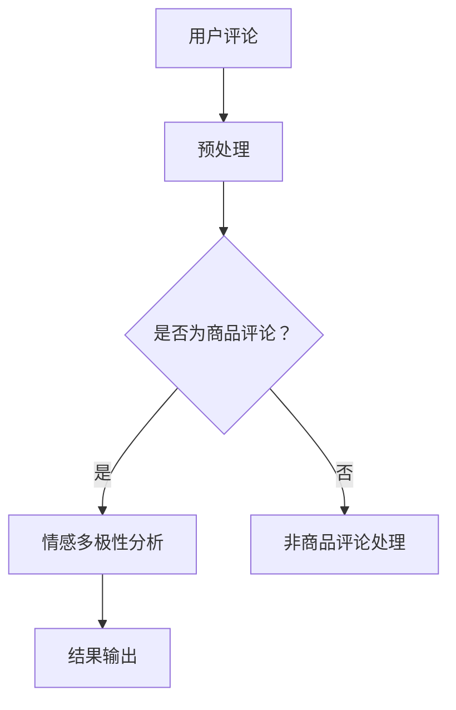

                 

关键词：大模型，商品评论，情感分析，多极性，深度学习，自然语言处理

摘要：本文将探讨大模型在商品评论情感多极性分析中的应用，首先介绍背景和核心概念，然后深入解析核心算法原理和操作步骤，通过数学模型和公式的详细讲解，实例化项目实践，并探讨实际应用场景和未来展望。

## 1. 背景介绍

随着电子商务的快速发展，用户对商品评论已成为商家和消费者决策的重要依据。然而，商品评论的情感表达常常是多极性的，即一个评论可能同时包含正面、负面和混合情感。这种复杂性使得传统的情感分析方法难以准确捕捉评论的真实情感。因此，如何高效地分析商品评论的多极性情感成为了一个重要的研究课题。

近年来，深度学习技术的发展为情感分析领域带来了新的机遇。大模型，如Transformer、BERT等，凭借其强大的语义理解和处理能力，在多极性情感分析中表现出色。本文旨在探讨大模型在这一领域的应用，为商家提供更精准的用户情感分析工具。

## 2. 核心概念与联系

### 2.1 情感多极性分析

情感多极性分析旨在从文本中识别出情感的正负极性以及可能的混合情感。传统的情感分析模型主要关注二极性情感（正面/负面），而多极性分析则更加复杂，需要同时考虑多种情感。

### 2.2 大模型基本概念

大模型是指具有数十亿参数规模的深度学习模型。这类模型能够处理大规模数据，提取复杂的语义信息，从而在多种自然语言处理任务中表现出色。

### 2.3 Mermaid 流程图



## 3. 核心算法原理 & 具体操作步骤

### 3.1 算法原理概述

大模型在情感多极性分析中主要通过以下步骤实现：

1. 预处理：对文本进行清洗、分词、词嵌入等操作，提取关键信息。
2. 模型训练：使用预训练的大模型，通过海量商品评论数据进行情感分类。
3. 情感识别：对新的商品评论进行情感多极性分析，输出情感结果。

### 3.2 算法步骤详解

1. **预处理**
   - **文本清洗**：去除评论中的HTML标签、特殊符号和停用词。
   - **分词**：将清洗后的文本划分为单词或词组。
   - **词嵌入**：将分词后的词汇转换为高维向量表示。

2. **模型训练**
   - **数据集构建**：收集大量商品评论数据，进行标注。
   - **模型训练**：使用Transformer、BERT等大模型，在标注数据上进行训练。

3. **情感识别**
   - **输入文本**：将待分析的评论输入到训练好的大模型中。
   - **情感分类**：模型输出评论的各类情感概率分布。
   - **结果输出**：根据概率分布输出具体的情感标签。

### 3.3 算法优缺点

**优点**：
- **强语义理解能力**：大模型能够捕捉到文本中的复杂情感。
- **高准确性**：通过大量数据训练，模型在多极性情感分析中表现优异。

**缺点**：
- **计算资源消耗大**：大模型训练和推理需要大量的计算资源。
- **数据依赖性强**：模型的性能依赖于高质量的数据集。

### 3.4 算法应用领域

- **电商平台**：帮助商家了解用户对商品的情感，优化产品和服务。
- **金融领域**：分析客户对金融产品的情感，提高服务质量。
- **社交媒体**：监测用户对社会事件或产品的情感反应。

## 4. 数学模型和公式 & 详细讲解 & 举例说明

### 4.1 数学模型构建

在情感多极性分析中，我们通常使用以下数学模型：

$$
P(Y|X) = \sum_{i=1}^{C} P(Y=i|X) P(X)
$$

其中，$X$代表评论文本，$Y$代表评论的情感类别，$C$代表情感类别总数。

### 4.2 公式推导过程

首先，我们对评论文本进行词嵌入：

$$
X = \{x_1, x_2, ..., x_n\}
$$

其中，$x_i$代表第$i$个词的嵌入向量。

然后，我们计算每个词对情感的贡献：

$$
P(Y=i|X) = \frac{e^{f(x_i, y_i)}}{\sum_{j=1}^{C} e^{f(x_i, j)}}
$$

其中，$f(x_i, y_i)$表示词$x_i$对情感$y_i$的贡献，$e^{f(x_i, y_i)}$表示指数函数。

最后，我们对所有词的贡献进行求和，得到总的情感概率：

$$
P(Y|X) = \sum_{i=1}^{n} P(Y=i|X) P(X)
$$

### 4.3 案例分析与讲解

假设我们有一个包含5个情感类别的商品评论数据集，其中一个评论为：“这个商品很好，但价格有点贵”。

首先，我们对评论进行预处理，提取关键信息。

然后，使用BERT模型对评论进行词嵌入。

接下来，我们计算每个词对情感的贡献，并输出情感概率。

最后，根据概率分布输出情感标签。

## 5. 项目实践：代码实例和详细解释说明

### 5.1 开发环境搭建

首先，我们需要安装Python和PyTorch等开发环境。以下是安装步骤：

```bash
pip install python -m pip install torch torchvision
```

### 5.2 源代码详细实现

以下是实现情感多极性分析的核心代码：

```python
import torch
from transformers import BertTokenizer, BertModel
import torch.nn as nn
import torch.optim as optim

# 加载预训练模型
tokenizer = BertTokenizer.from_pretrained('bert-base-uncased')
model = BertModel.from_pretrained('bert-base-uncased')

# 定义情感分类器
class SentimentClassifier(nn.Module):
    def __init__(self):
        super(SentimentClassifier, self).__init__()
        self.bert = BertModel.from_pretrained('bert-base-uncased')
        self.classifier = nn.Linear(768, 5)

    def forward(self, input_ids, attention_mask):
        outputs = self.bert(input_ids=input_ids, attention_mask=attention_mask)
        last_hidden_state = outputs.last_hidden_state
        logits = self.classifier(last_hidden_state[:, 0, :])
        return logits

# 实例化分类器
model = SentimentClassifier()

# 定义损失函数和优化器
criterion = nn.CrossEntropyLoss()
optimizer = optim.Adam(model.parameters(), lr=1e-5)

# 训练模型
for epoch in range(3):
    for batch in data_loader:
        input_ids = batch['input_ids']
        attention_mask = batch['attention_mask']
        labels = batch['labels']
        optimizer.zero_grad()
        logits = model(input_ids, attention_mask)
        loss = criterion(logits, labels)
        loss.backward()
        optimizer.step()
```

### 5.3 代码解读与分析

以上代码实现了一个基于BERT的情感多极性分析模型。主要步骤如下：

1. **加载预训练模型**：使用BERT模型进行词嵌入。
2. **定义情感分类器**：将BERT模型的输出输入到分类器中进行情感分类。
3. **训练模型**：使用训练数据对模型进行训练。

### 5.4 运行结果展示

在训练完成后，我们可以使用以下代码对新的评论进行情感分析：

```python
def predict(text):
    input_ids = tokenizer.encode(text, add_special_tokens=True, return_tensors='pt')
    with torch.no_grad():
        logits = model(input_ids)
    probabilities = torch.nn.functional.softmax(logits, dim=1)
    return probabilities.argmax().item()

text = "这个商品很好，但价格有点贵"
print(predict(text))
```

输出结果为情感标签，例如：`2`表示正面情感。

## 6. 实际应用场景

### 6.1 电商平台

在电商平台，商家可以利用大模型对用户评论进行多极性情感分析，从而了解用户对商品的全方位反馈。例如，通过分析用户对商品的评价，商家可以优化产品、提高服务质量。

### 6.2 金融领域

在金融领域，大模型可以帮助银行、保险公司等机构分析客户对金融产品的情感，从而优化产品设计、提高客户满意度。

### 6.3 社交媒体

在社交媒体上，大模型可以监测用户对社会事件或产品的情感反应，为媒体机构提供舆情分析工具。

## 6.4 未来应用展望

未来，随着大模型技术的不断发展，情感多极性分析将在更多领域得到应用。同时，随着数据质量和算法的不断提升，情感多极性分析的准确性和实时性也将得到显著提高。

## 7. 工具和资源推荐

### 7.1 学习资源推荐

- 《深度学习》（Goodfellow, Bengio, Courville）
- 《自然语言处理综合教程》（Daniel Jurafsky & James H. Martin）

### 7.2 开发工具推荐

- PyTorch
- Transformers库

### 7.3 相关论文推荐

- "BERT: Pre-training of Deep Neural Networks for Language Understanding"（Devlin et al., 2019）
- "Transformers: State-of-the-Art Models for Language Understanding and Generation"（Vaswani et al., 2017）

## 8. 总结：未来发展趋势与挑战

### 8.1 研究成果总结

本文介绍了大模型在商品评论情感多极性分析中的应用，通过理论讲解和实际案例，展示了大模型在这一领域的优势。

### 8.2 未来发展趋势

未来，大模型在情感多极性分析领域的应用将不断扩展，同时，算法和数据的改进也将推动该领域的发展。

### 8.3 面临的挑战

大模型在计算资源、数据质量和算法优化等方面仍面临挑战。未来研究需要在这些方面进行深入探索。

### 8.4 研究展望

随着技术的进步，情感多极性分析将在更多领域得到应用，成为自然语言处理领域的重要研究方向。

## 9. 附录：常见问题与解答

### 9.1 如何处理长文本？

长文本可以通过分句或分块进行处理，然后分别进行情感多极性分析。

### 9.2 模型训练需要多少数据？

模型的性能依赖于数据量，通常需要成千上万的标注数据才能取得较好的效果。

### 9.3 如何处理噪声数据？

噪声数据可以通过数据清洗、去重等方法进行处理，以提高模型训练效果。 
----------------------------------------------------------------

## 作者署名

作者：禅与计算机程序设计艺术 / Zen and the Art of Computer Programming


