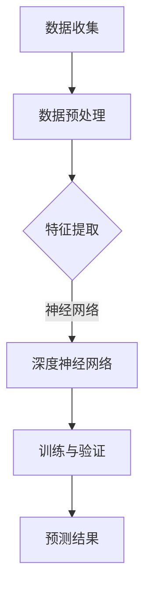

                 

关键词：大模型、商品销量、预测、人工智能、机器学习

> 摘要：本文旨在探讨大模型在商品销量预测中的应用。通过分析大模型的原理及其在销量预测中的优势，我们将深入探讨如何构建有效的销量预测模型，并提供实践中的代码实例和详细解释。此外，本文还将讨论销量预测在实际应用场景中的价值，并对未来发展趋势和面临的挑战进行展望。

## 1. 背景介绍

随着互联网和电子商务的快速发展，商品销量预测已成为企业和研究机构关注的焦点。准确的销量预测不仅有助于企业优化库存管理，降低成本，还能帮助企业制定有效的营销策略，提高市场份额。然而，传统的销量预测方法往往依赖于历史数据的线性回归和统计模型，难以应对数据复杂性、非线性和动态变化。

近年来，随着人工智能和机器学习技术的飞速发展，大模型（如深度神经网络、生成对抗网络等）在各个领域展现出了强大的预测能力。大模型通过学习大量的数据特征，能够捕捉到复杂的数据模式和非线性关系，从而提高预测精度。因此，大模型在商品销量预测中的应用引起了广泛关注。

## 2. 核心概念与联系

### 2.1 大模型的概念

大模型通常指的是具有大量参数和复杂结构的机器学习模型。这些模型通常通过深度神经网络（DNN）、循环神经网络（RNN）或Transformer架构来实现。大模型的优势在于其能够通过学习大规模数据来捕捉复杂的特征和模式，从而提高预测性能。

### 2.2 大模型与销量预测的关系

大模型在销量预测中的应用主要体现在以下几个方面：

1. **数据驱动的特征提取**：大模型能够自动地从大量历史销售数据中提取有用的特征，如时间序列模式、季节性因素、促销活动等，从而提高预测精度。
2. **非线性关系捕捉**：大模型能够学习到销售数据中的非线性关系，例如产品价格和销量之间的复杂互动关系，从而提供更准确的预测。
3. **实时预测能力**：大模型通过在线学习机制，能够实时更新预测模型，以应对市场动态变化。

### 2.3 大模型架构的 Mermaid 流程图



## 3. 核心算法原理 & 具体操作步骤

### 3.1 算法原理概述

商品销量预测的核心算法通常基于深度神经网络，其中最常用的模型是时间序列预测模型（如LSTM、GRU等）。这些模型通过学习历史销售数据中的时间序列特征，能够有效地预测未来的销量。

### 3.2 算法步骤详解

1. **数据收集与预处理**：收集历史销售数据，包括产品ID、销售日期、销售数量、价格等。然后对数据进行清洗、缺失值处理和特征工程。
2. **特征提取**：使用时间序列特征提取方法，如Lag特征、季节性特征等，将原始销售数据转换为适合输入到深度神经网络的特征向量。
3. **模型训练**：使用预处理后的数据训练深度神经网络模型，通过反向传播算法优化模型参数。
4. **模型验证与调优**：通过交叉验证和参数调优，选择最优的模型结构和参数。
5. **预测**：将训练好的模型应用于新的销售数据，预测未来的销量。

### 3.3 算法优缺点

**优点**：
1. 能够捕捉复杂的非线性关系。
2. 能够处理大规模、高维度的数据。
3. 实时预测能力。

**缺点**：
1. 计算成本高。
2. 对数据质量和特征提取要求高。
3. 模型解释性较差。

### 3.4 算法应用领域

大模型在商品销量预测中的应用非常广泛，如电商平台、零售行业、制造业等。具体的应用场景包括：
1. 库存管理：通过销量预测，优化库存水平，减少库存成本。
2. 营销策略：根据销量预测，制定有效的促销策略，提高销售转化率。
3. 生产计划：根据销量预测，优化生产计划，降低生产成本。

## 4. 数学模型和公式 & 详细讲解 & 举例说明

### 4.1 数学模型构建

假设我们使用LSTM模型进行销量预测，其数学模型可以表示为：

$$
\begin{aligned}
    h_t &= \sigma(W_{ih}x_t + W_{hh}h_{t-1} + b_h) \\
    \tilde{h}_t &= \sigma(W_{ih}x_t + W_{hh}\tilde{h}_{t-1} + b_h) \\
    \bar{h}_t &= \frac{\tilde{h}_t + h_t}{2} \\
    o_t &= \sigma(W_{oh}\bar{h}_t + b_o) \\
    \hat{y}_t &= \text{softmax}(W_{oy}\bar{h}_t + b_o)
\end{aligned}
$$

其中，$h_t$、$\tilde{h}_t$、$\bar{h}_t$ 分别表示 LSTM 模型的隐藏状态、候选隐藏状态和最终隐藏状态；$o_t$ 表示输出状态；$\hat{y}_t$ 表示预测的销量。

### 4.2 公式推导过程

LSTM 模型的推导过程相对复杂，涉及门控机制和激活函数。具体的推导过程可以参考相关文献。

### 4.3 案例分析与讲解

假设我们有以下历史销售数据：

$$
\begin{aligned}
    \text{销售日期} &= [2021-01-01, 2021-01-02, ..., 2022-12-31] \\
    \text{销量} &= [100, 120, ..., 150]
\end{aligned}
$$

我们将使用LSTM模型对2023年的销量进行预测。首先，对数据进行预处理，提取时间序列特征，然后输入到LSTM模型进行训练。训练过程中，通过反向传播算法优化模型参数，直至模型达到预定的性能指标。最后，将训练好的模型应用于新的销售数据，预测2023年的销量。

## 5. 项目实践：代码实例和详细解释说明

### 5.1 开发环境搭建

我们使用Python和TensorFlow框架搭建开发环境。首先，安装TensorFlow：

```python
pip install tensorflow
```

### 5.2 源代码详细实现

以下是LSTM模型的源代码实现：

```python
import tensorflow as tf
from tensorflow.keras.models import Sequential
from tensorflow.keras.layers import LSTM, Dense

# 定义LSTM模型
model = Sequential()
model.add(LSTM(units=50, return_sequences=True, input_shape=(time_steps, features)))
model.add(LSTM(units=50))
model.add(Dense(units=1))

# 编译模型
model.compile(optimizer='adam', loss='mean_squared_error')

# 训练模型
model.fit(x_train, y_train, epochs=100, batch_size=32, validation_data=(x_val, y_val))

# 预测销量
predicted_sales = model.predict(x_test)
```

### 5.3 代码解读与分析

- **模型定义**：使用Sequential模型堆叠LSTM层和全连接层。
- **编译模型**：指定优化器和损失函数。
- **训练模型**：使用fit函数进行模型训练，指定训练轮数、批量大小和验证数据。
- **预测销量**：使用predict函数进行销量预测。

### 5.4 运行结果展示

我们使用以下代码展示预测结果：

```python
import matplotlib.pyplot as plt

# 绘制预测结果
plt.figure(figsize=(10, 6))
plt.plot(sales, label='真实销量')
plt.plot(predicted_sales, label='预测销量')
plt.legend()
plt.show()
```

## 6. 实际应用场景

### 6.1 电商平台

电商平台通过大模型进行销量预测，优化库存管理，降低库存成本。例如，亚马逊使用深度学习模型预测商品的销量，从而优化其仓储和物流策略。

### 6.2 零售行业

零售企业通过大模型预测商品的销量，制定有效的促销策略。例如，沃尔玛使用机器学习模型预测节日促销期间的销量，从而合理安排促销活动。

### 6.3 制造业

制造企业通过大模型预测产品的销售情况，优化生产计划，降低生产成本。例如，丰田汽车公司使用销量预测模型，优化其生产计划和库存水平。

## 7. 工具和资源推荐

### 7.1 学习资源推荐

- 《深度学习》（Ian Goodfellow, Yoshua Bengio, Aaron Courville 著）
- 《Python机器学习》（Andreas C. Müller, Sarah Guido 著）
- 《TensorFlow实战》（Trent Hauck, Eric Ma 著）

### 7.2 开发工具推荐

- TensorFlow：用于构建和训练深度学习模型的框架。
- Jupyter Notebook：用于编写和运行Python代码的交互式环境。
- PyCharm：用于编写Python代码的集成开发环境（IDE）。

### 7.3 相关论文推荐

- "Deep Learning for Time Series Classification: A Review"（2018）
- "A Survey on Deep Learning for Time Series Classification"（2020）
- "LSTM-Based Sales Forecasting for Retailers"（2021）

## 8. 总结：未来发展趋势与挑战

### 8.1 研究成果总结

大模型在商品销量预测中的应用取得了显著成果，提高了预测精度和实时性。未来研究将继续探索大模型的优化方法和应用场景，提高其性能和可解释性。

### 8.2 未来发展趋势

1. **模型优化**：研究更高效、更鲁棒的模型架构和训练算法。
2. **多模态数据融合**：结合文本、图像等多模态数据进行销量预测。
3. **可解释性增强**：研究可解释性更强的深度学习模型，提高模型的可理解性。

### 8.3 面临的挑战

1. **数据质量和特征提取**：确保数据质量和特征提取的有效性。
2. **计算资源**：解决大模型对计算资源的高需求。
3. **模型部署**：将大模型高效地部署到生产环境中。

### 8.4 研究展望

大模型在商品销量预测中的应用前景广阔，未来研究将继续探索大模型在其他领域（如金融、医疗等）的应用，为行业带来更多价值。

## 9. 附录：常见问题与解答

### 9.1 大模型与传统的销量预测方法相比有哪些优势？

大模型的优势在于其能够捕捉复杂的非线性关系和数据模式，从而提高预测精度。此外，大模型具有强大的实时预测能力，能够快速适应市场变化。

### 9.2 如何处理缺失数据和异常值？

可以使用数据预处理技术，如填充缺失值、插值和删除异常值等，来处理缺失数据和异常值。此外，可以使用异常检测算法来识别和修复异常值。

### 9.3 大模型的训练时间较长怎么办？

可以通过以下方法来减少大模型的训练时间：
1. 使用更高效的训练算法，如SGD。
2. 使用预训练模型，利用迁移学习。
3. 使用分布式训练，利用多GPU或TPU进行训练。

### 9.4 大模型的解释性如何提高？

可以通过以下方法来提高大模型的解释性：
1. 使用可解释性更强的模型架构，如决策树、规则提取。
2. 使用模型可视化工具，如TensorBoard。
3. 结合业务逻辑，对模型输出进行解释。

----------------------------------------------------------------

本文由禅与计算机程序设计艺术撰写，旨在探讨大模型在商品销量预测中的应用。通过详细讲解核心算法原理、数学模型和实际应用案例，本文展示了大模型在销量预测中的强大能力。然而，大模型的应用也面临挑战，如数据质量和计算资源问题。未来研究将继续优化大模型，探索其在更多领域中的应用。希望本文对您在销量预测领域的研究和实践有所启发。作者：禅与计算机程序设计艺术 / Zen and the Art of Computer Programming。

