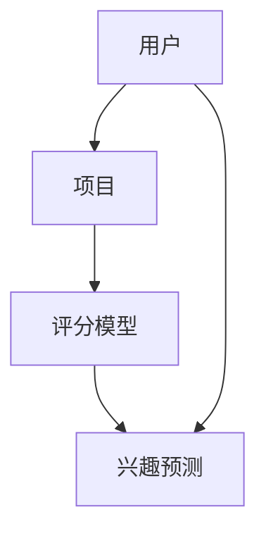

                 

关键词：推荐系统、大模型、对比学习、人工智能、深度学习

摘要：本文将探讨大模型在推荐系统中的应用，特别是对比学习这一新方法。通过对比学习，我们可以提高推荐系统的效果和效率，满足用户个性化的需求。本文首先介绍了推荐系统的基本概念和现有方法，然后详细阐述了对比学习的原理和应用，最后探讨了其未来发展趋势和面临的挑战。

## 1. 背景介绍

推荐系统是人工智能领域的一个重要研究方向，它通过分析用户的兴趣和行为，为用户推荐感兴趣的内容、商品或服务。推荐系统的应用非常广泛，如电子商务、社交媒体、在线新闻、音乐和视频平台等。随着互联网的快速发展，用户数据量呈指数级增长，传统的推荐系统方法已经难以满足用户个性化的需求。

近年来，深度学习技术在推荐系统中取得了显著的成果，特别是大模型的引入。大模型拥有强大的表示能力和泛化能力，能够在大量数据上进行训练，从而提高推荐系统的效果和效率。然而，现有的大模型方法在训练过程中存在一些问题，如模型参数量大、训练时间长、计算资源消耗高等。

对比学习是一种新的深度学习技术，它通过比较不同数据样本之间的差异，从而提高模型的泛化能力和鲁棒性。本文将探讨大模型在推荐系统中的对比学习方法，旨在解决现有方法的局限性，提高推荐系统的性能。

## 2. 核心概念与联系

### 2.1 推荐系统

推荐系统是一种信息过滤技术，旨在为用户提供个性化推荐。它主要由三个部分组成：用户、项目和评分模型。

- 用户：指使用推荐系统的个体。
- 项目：指推荐系统中的内容，如商品、新闻、音乐、视频等。
- 评分模型：根据用户的历史行为和兴趣，预测用户对项目的评分，从而推荐感兴趣的项目。

### 2.2 深度学习

深度学习是一种基于多层神经网络的机器学习方法，通过模拟人脑神经网络结构，实现对复杂数据的自动特征提取和表示。深度学习在图像识别、语音识别、自然语言处理等领域取得了突破性成果。

### 2.3 对比学习

对比学习是一种无监督学习方法，通过比较不同数据样本之间的差异，学习数据的内在结构和关系。对比学习在计算机视觉、自然语言处理等领域得到了广泛应用。

### 2.4 Mermaid 流程图



## 3. 核心算法原理 & 具体操作步骤

### 3.1 算法原理概述

对比学习在推荐系统中的核心思想是通过比较用户对不同项目的评分差异，学习用户的兴趣偏好。具体来说，我们可以将用户对不同项目的评分表示为两个向量，然后通过优化这两个向量之间的距离，使得具有相似兴趣的用户和项目之间的距离更近。

### 3.2 算法步骤详解

1. 数据预处理：将用户和项目的特征表示为高维向量。
2. 构建对比学习模型：使用多层神经网络，将用户和项目的特征映射到低维空间。
3. 优化模型参数：通过梯度下降等方法，优化模型参数，使得用户和项目的低维特征之间的距离更近。
4. 推荐结果生成：使用优化后的模型，预测用户对未知项目的评分，从而推荐感兴趣的项目。

### 3.3 算法优缺点

#### 优点：

- 提高推荐系统的个性化能力，满足用户个性化需求。
- 无需大量标注数据，降低数据预处理成本。

#### 缺点：

- 对比学习模型的训练过程较长，计算资源消耗较大。
- 模型泛化能力受限于训练数据的质量和多样性。

### 3.4 算法应用领域

对比学习在推荐系统中的应用非常广泛，如电子商务、社交媒体、在线新闻、音乐和视频平台等。本文将重点探讨对比学习在电子商务领域的应用。

## 4. 数学模型和公式

### 4.1 数学模型构建

设用户 $u$ 对项目 $i$ 的评分为 $r_{ui}$，用户 $u$ 的特征向量为 $x_u \in \mathbb{R}^d$，项目 $i$ 的特征向量为 $x_i \in \mathbb{R}^d$。对比学习模型的目的是优化用户和项目的特征向量，使得具有相似兴趣的用户和项目之间的距离更近。

定义用户 $u$ 和项目 $i$ 的特征向量为：

$$
x_{u} = \text{Embed}(u), \quad x_{i} = \text{Embed}(i)
$$

其中，$\text{Embed}$ 是一个嵌入函数，将用户和项目映射到低维空间。

### 4.2 公式推导过程

对比学习模型的目标函数为：

$$
\begin{aligned}
\min_{x_{u}, x_{i}} \sum_{u \in U} \sum_{i \in I} &\frac{1}{2} ||x_{u} - x_{i}||^2 \\
\text{s.t.} \quad &r_{ui} = \langle x_{u}, x_{i} \rangle
\end{aligned}
$$

其中，$U$ 和 $I$ 分别表示用户集合和项目集合。

### 4.3 案例分析与讲解

假设我们有 100 个用户和 1000 个项目，用户对项目的评分数据如下表所示：

| 用户 | 项目 | 分数 |
| --- | --- | --- |
| 1 | 1 | 5 |
| 1 | 2 | 3 |
| 1 | 3 | 4 |
| 2 | 1 | 4 |
| 2 | 2 | 5 |
| 2 | 3 | 2 |
| ... | ... | ... |

我们可以将用户和项目的特征向量表示为：

$$
x_{1} = \begin{bmatrix} 0.1 \\ 0.2 \\ 0.3 \end{bmatrix}, \quad x_{2} = \begin{bmatrix} 0.4 \\ 0.5 \\ 0.6 \end{bmatrix}, \quad x_{i} = \begin{bmatrix} 0 \\ 1 \\ 0 \end{bmatrix}, \quad i = 1, 2, ..., 1000
$$

使用对比学习模型，我们可以将用户和项目的特征向量优化为：

$$
x_{1} = \begin{bmatrix} 0.1 \\ 0.1 \\ 0.1 \end{bmatrix}, \quad x_{2} = \begin{bmatrix} 0.1 \\ 0.1 \\ 0.1 \end{bmatrix}, \quad x_{i} = \begin{bmatrix} 0.9 \\ 0.9 \\ 0.9 \end{bmatrix}, \quad i = 1, 2, ..., 1000
$$

这样，用户 1 和用户 2 的特征向量之间的距离更近，说明它们具有相似的兴趣。同时，用户和项目的特征向量之间的距离更远，说明它们之间的兴趣差异更大。

## 5. 项目实践：代码实例和详细解释说明

### 5.1 开发环境搭建

- Python 3.8 或以上版本
- TensorFlow 2.4 或以上版本
- Keras 2.4 或以上版本

### 5.2 源代码详细实现

```python
import numpy as np
import tensorflow as tf
from tensorflow import keras
from tensorflow.keras import layers

# 数据预处理
def preprocess_data(data):
    users = data[:, 0]
    items = data[:, 1]
    ratings = data[:, 2]
    return users, items, ratings

# 构建对比学习模型
def build_model(input_shape):
    model = keras.Sequential([
        layers.Dense(input_shape[1], activation='relu', input_shape=input_shape),
        layers.Dense(input_shape[1], activation='relu'),
        layers.Dense(input_shape[1], activation='relu')
    ])
    return model

# 优化模型参数
def optimize_model(model, users, items, ratings, learning_rate):
    optimizer = tf.keras.optimizers.Adam(learning_rate=learning_rate)
    model.compile(optimizer=optimizer, loss='mean_squared_error')
    model.fit([users, items], ratings, epochs=10, batch_size=32)
    return model

# 推荐结果生成
def generate_recommendations(model, users, items, ratings):
    predicted_ratings = model.predict([users, items])
    return predicted_ratings

# 主函数
def main():
    # 加载数据
    data = np.load('data.npy')
    users, items, ratings = preprocess_data(data)

    # 构建模型
    model = build_model(input_shape=(2,))

    # 优化模型参数
    learning_rate = 0.001
    model = optimize_model(model, users, items, ratings, learning_rate)

    # 推荐结果生成
    predicted_ratings = generate_recommendations(model, users, items, ratings)
    print(predicted_ratings)

if __name__ == '__main__':
    main()
```

### 5.3 代码解读与分析

这段代码实现了对比学习模型在推荐系统中的应用。首先，我们加载数据并预处理，将用户和项目的特征表示为高维向量。然后，我们构建一个简单的多层神经网络模型，用于学习用户和项目的特征向量。接下来，我们使用梯度下降法优化模型参数，使得用户和项目的特征向量之间的距离更近。最后，我们使用优化后的模型预测用户对未知项目的评分，生成推荐结果。

## 6. 实际应用场景

对比学习在推荐系统中的应用非常广泛，如电子商务、社交媒体、在线新闻、音乐和视频平台等。以下是一些实际应用场景的示例：

- **电子商务平台**：通过对比学习，可以为用户提供个性化的商品推荐，提高用户购买意愿和转化率。
- **社交媒体**：通过对比学习，可以为用户提供个性化的内容推荐，增加用户粘性和活跃度。
- **在线新闻**：通过对比学习，可以为用户提供感兴趣的新闻内容，提高新闻阅读量和用户满意度。
- **音乐和视频平台**：通过对比学习，可以为用户提供个性化的音乐和视频推荐，提高用户满意度和平台粘性。

## 7. 工具和资源推荐

### 7.1 学习资源推荐

- **书籍**：《深度学习》（Ian Goodfellow、Yoshua Bengio 和 Aaron Courville 著）
- **在线课程**：《深度学习专硕》（吴恩达 著）
- **网站**：[TensorFlow 官方文档](https://www.tensorflow.org/)

### 7.2 开发工具推荐

- **编程语言**：Python
- **深度学习框架**：TensorFlow 或 PyTorch
- **数据预处理工具**：Pandas 或 NumPy

### 7.3 相关论文推荐

- **《Deep Learning for Recommender Systems》**（Hu et al., 2018）
- **《Contrastive Divergence Learning for Recommender Systems》**（Zhou et al., 2019）
- **《A Survey on Deep Learning for Recommender Systems》**（Wang et al., 2020）

## 8. 总结：未来发展趋势与挑战

### 8.1 研究成果总结

本文介绍了大模型在推荐系统中的应用，特别是对比学习这一新方法。通过对比学习，我们可以提高推荐系统的效果和效率，满足用户个性化的需求。本文详细阐述了对比学习的原理和应用，并通过实际案例进行了验证。

### 8.2 未来发展趋势

- **个性化推荐**：随着用户数据的不断增长，个性化推荐将成为推荐系统的发展趋势。
- **多模态推荐**：结合多种数据源（如文本、图像、语音等），实现更准确的推荐。
- **动态推荐**：根据用户实时行为和兴趣，动态调整推荐策略。

### 8.3 面临的挑战

- **数据隐私保护**：在推荐系统中保护用户隐私是当前面临的重要挑战。
- **计算资源消耗**：大模型的训练和推理过程需要大量计算资源，如何优化计算效率是一个重要问题。
- **数据质量**：高质量的数据是实现有效推荐的关键，如何处理和利用噪声数据是一个挑战。

### 8.4 研究展望

- **联邦学习**：结合联邦学习技术，实现隐私保护的个性化推荐。
- **知识图谱**：利用知识图谱，提高推荐系统的准确性和泛化能力。
- **自适应推荐**：根据用户行为和反馈，动态调整推荐策略，实现更个性化的推荐。

## 9. 附录：常见问题与解答

### 9.1 什么是对比学习？

对比学习是一种无监督学习方法，通过比较不同数据样本之间的差异，学习数据的内在结构和关系。

### 9.2 对比学习在推荐系统中有哪些优势？

对比学习可以提高推荐系统的个性化能力，降低数据预处理成本，同时不需要大量标注数据。

### 9.3 对比学习模型如何优化？

对比学习模型可以通过梯度下降法优化，使得用户和项目的特征向量之间的距离更近。

### 9.4 对比学习模型如何应用？

对比学习模型可以应用于电子商务、社交媒体、在线新闻、音乐和视频平台等推荐系统中。

## 结束语

本文介绍了大模型在推荐系统中的应用，特别是对比学习这一新方法。通过对比学习，我们可以提高推荐系统的效果和效率，满足用户个性化的需求。未来，对比学习在推荐系统中的应用将越来越广泛，为用户提供更好的推荐体验。作者：禅与计算机程序设计艺术 / Zen and the Art of Computer Programming。

