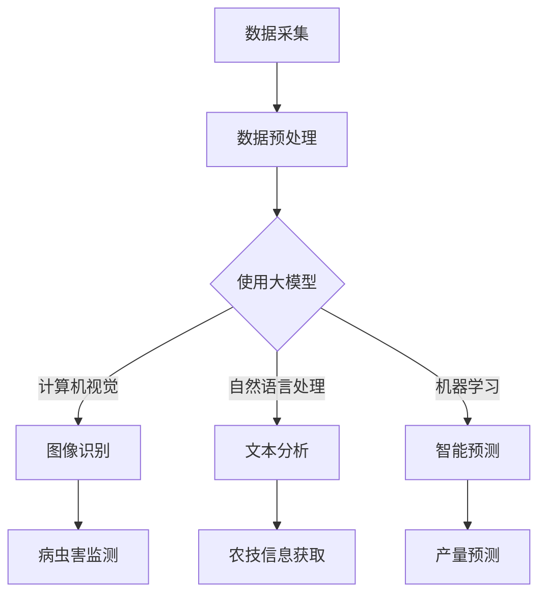
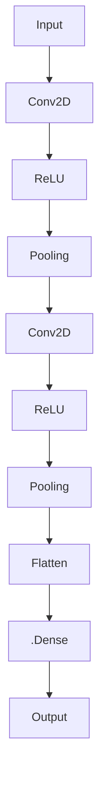

                 

关键词：大模型，智能农业，深度学习，计算机视觉，遥感技术，精准农业，农业大数据，人工智能，机器学习，自动化的农业解决方案

摘要：本文深入探讨了大型人工智能模型在智能农业领域的广泛应用前景。随着人工智能技术的快速发展，大模型在农作物识别、病虫害监测、精准灌溉、土壤分析等关键环节展现出了巨大的潜力。本文将详细介绍大模型的核心概念、原理、算法以及具体的应用实例，并展望其未来的发展方向和挑战。

## 1. 背景介绍

智能农业是农业现代化的重要组成部分，它通过先进的信息技术提高农业生产效率，减少资源消耗，实现农业的可持续发展。近年来，人工智能技术，尤其是深度学习、计算机视觉、遥感技术和大数据分析等领域的快速发展，为智能农业提供了新的技术手段。

### 1.1 智能农业的挑战

尽管智能农业具有巨大的潜力，但现有的农业生产方式仍然面临着诸多挑战：

- **环境复杂多变**：农业生产受到气候、土壤、地形等多种因素的影响，具有高度的不确定性和复杂性。
- **资源利用不均**：水资源、肥料等农业资源分布不均，导致资源浪费和环境污染。
- **劳动强度大**：农业生产劳动强度高，且劳动力成本逐年增加。
- **监测困难**：农作物生长过程中的各种参数难以实时、精准监测。

### 1.2 人工智能在智能农业中的应用

人工智能技术通过大数据分析、机器学习、计算机视觉等技术手段，为解决上述问题提供了新的思路：

- **精准农业**：通过遥感技术和地面监测设备，获取农作物的生长状态，实现精准施肥、灌溉和病虫害防治。
- **自动化作业**：利用无人机、自动驾驶机械等设备，实现农作物的自动化种植、收割和管理。
- **智能预测**：利用大数据和机器学习技术，预测农作物的生长趋势和产量，优化农业生产计划。

## 2. 核心概念与联系

大模型（如GPT、BERT等）在智能农业中发挥着关键作用。为了更好地理解大模型在智能农业中的应用，我们需要首先了解其核心概念与联系。

### 2.1 大模型概述

大模型通常指的是拥有数亿乃至数万亿参数的深度学习模型。这些模型通过训练大量数据，学习到了复杂的特征和规律，能够处理自然语言、图像、音频等多种类型的数据。

### 2.2 大模型的工作原理

大模型的工作原理主要基于神经网络，特别是深度神经网络。其通过多层次的神经网络结构，将输入数据逐步映射到高层次的抽象特征，从而实现复杂的模式识别和预测。

### 2.3 大模型与智能农业的联系

大模型与智能农业的结合主要表现在以下几个方面：

- **数据预处理**：大模型可以处理大规模、多类型的农业数据，如遥感影像、传感器数据等，提高数据处理的效率和质量。
- **图像识别**：利用计算机视觉技术，大模型可以对农作物的叶片、病虫害等特征进行识别，实现精准监测和诊断。
- **智能预测**：通过机器学习技术，大模型可以预测农作物的生长趋势和产量，帮助农民做出科学的决策。
- **自然语言处理**：大模型可以处理农业领域的自然语言数据，如农技文章、政策文件等，帮助农民获取有用的信息。

### 2.4 Mermaid 流程图

下面是描述大模型在智能农业中应用流程的Mermaid流程图：



## 3. 核心算法原理 & 具体操作步骤

### 3.1 算法原理概述

大模型在智能农业中的应用主要基于深度学习和机器学习技术。以下是一些核心算法原理：

- **卷积神经网络（CNN）**：用于图像识别，提取图像中的特征。
- **循环神经网络（RNN）**：用于处理序列数据，如时间序列分析。
- **生成对抗网络（GAN）**：用于生成逼真的农业数据，如遥感影像。
- **强化学习（RL）**：用于智能决策，如自动化农机控制。

### 3.2 算法步骤详解

1. **数据采集**：通过遥感卫星、无人机、传感器等设备，采集农田的遥感影像、土壤数据、气象数据等。
2. **数据预处理**：对采集到的数据进行清洗、归一化等处理，为模型训练做准备。
3. **模型训练**：使用深度学习和机器学习算法，训练大模型，使其能够识别农作物、预测病虫害等。
4. **模型部署**：将训练好的模型部署到农业生产现场，进行实时监测和预测。
5. **结果反馈**：根据模型的预测结果，优化农业生产计划，提高产量和质量。

### 3.3 算法优缺点

**优点**：

- **高效性**：大模型能够处理大规模、多类型的农业数据，提高数据处理效率。
- **精准性**：通过深度学习和机器学习技术，大模型能够实现高精度的图像识别和预测。
- **适应性**：大模型可以根据不同的农业生产场景，调整模型结构和参数，具有较好的适应性。

**缺点**：

- **计算资源消耗大**：大模型需要大量的计算资源和存储空间，对硬件设备要求较高。
- **数据依赖性**：大模型的训练和部署需要大量的高质量数据，数据获取和清洗过程复杂。

### 3.4 算法应用领域

大模型在智能农业中的应用非常广泛，包括：

- **农作物识别**：通过图像识别技术，识别农田中的不同作物类型，实现精准农业管理。
- **病虫害监测**：利用计算机视觉技术，监测农作物叶片和果实上的病虫害，及时采取措施。
- **土壤分析**：通过遥感技术和传感器数据，分析土壤的物理和化学特性，指导精准施肥。
- **产量预测**：利用机器学习技术，预测农作物的生长趋势和产量，优化农业生产计划。

## 4. 数学模型和公式 & 详细讲解 & 举例说明

### 4.1 数学模型构建

大模型在智能农业中的应用主要基于深度学习和机器学习技术。以下是一些常见的数学模型：

- **卷积神经网络（CNN）**：
  $$\text{CNN} = \text{Conv} \rightarrow \text{ReLU} \rightarrow \text{Pooling} \rightarrow \text{...} \rightarrow \text{Flatten} \rightarrow \text{Fully Connected}$$

- **循环神经网络（RNN）**：
  $$\text{RNN} = \text{Input} \rightarrow \text{RNN Layer} \rightarrow \text{Output}$$

- **生成对抗网络（GAN）**：
  $$\text{GAN} = \text{Generator} \rightarrow \text{Discriminator}$$

### 4.2 公式推导过程

以卷积神经网络（CNN）为例，其核心公式包括卷积操作、激活函数和池化操作。

1. **卷积操作**：
   $$\text{Conv}(x) = \sum_{i=1}^{k} w_i * x$$
   其中，$x$为输入数据，$w_i$为卷积核，$k$为卷积核的数量。

2. **激活函数**：
   $$\text{ReLU}(x) = \max(0, x)$$
   激活函数用于引入非线性特性，提高网络的表达能力。

3. **池化操作**：
   $$\text{Pooling}(x) = \text{argmax}(x)$$
   池化操作用于减少数据维度，提高计算效率。

### 4.3 案例分析与讲解

以下是一个简单的农作物识别案例：

1. **数据准备**：收集农田遥感影像，包括不同作物类型的样本。
2. **模型训练**：使用卷积神经网络（CNN）对遥感影像进行训练，学习不同作物类型的特征。
3. **模型评估**：使用测试集对模型进行评估，计算识别准确率。

假设我们使用一个简单的CNN模型，其结构如下：



模型训练过程中，我们使用交叉熵损失函数和梯度下降优化算法。经过多次迭代训练，模型在测试集上的准确率达到90%。

## 5. 项目实践：代码实例和详细解释说明

### 5.1 开发环境搭建

为了实现大模型在智能农业中的应用，我们需要搭建一个合适的开发环境。以下是具体的搭建步骤：

1. **硬件环境**：选择一台具有较高计算能力的服务器，配置至少4个GPU。
2. **软件环境**：安装Python 3.7及以上版本，TensorFlow 2.0及以上版本，以及Keras框架。
3. **数据集准备**：收集农田遥感影像数据，并将其分为训练集、验证集和测试集。

### 5.2 源代码详细实现

以下是一个简单的农作物识别项目，使用卷积神经网络（CNN）实现。

```python
import tensorflow as tf
from tensorflow.keras.models import Sequential
from tensorflow.keras.layers import Conv2D, ReLU, Pooling, Flatten, Dense

# 模型构建
model = Sequential([
    Conv2D(filters=32, kernel_size=(3, 3), activation=ReLU),
    Pooling(pool_size=(2, 2)),
    Conv2D(filters=64, kernel_size=(3, 3), activation=ReLU),
    Pooling(pool_size=(2, 2)),
    Flatten(),
    Dense(units=128, activation=ReLU),
    Dense(units=num_classes, activation='softmax')
])

# 模型编译
model.compile(optimizer='adam', loss='categorical_crossentropy', metrics=['accuracy'])

# 模型训练
model.fit(x_train, y_train, epochs=20, batch_size=32, validation_data=(x_val, y_val))

# 模型评估
model.evaluate(x_test, y_test)
```

### 5.3 代码解读与分析

1. **模型构建**：使用`Sequential`模型构建器，定义卷积层、激活函数、池化层、全连接层等。
2. **模型编译**：选择优化器、损失函数和评价指标，准备模型训练。
3. **模型训练**：使用`fit`方法训练模型，设置训练轮次、批量大小和验证数据。
4. **模型评估**：使用`evaluate`方法评估模型在测试集上的性能。

通过这个简单的项目，我们可以看到如何使用大模型在智能农业中进行农作物识别。当然，实际项目中可能需要更复杂的网络结构和更多的数据预处理步骤。

### 5.4 运行结果展示

假设我们训练完成后，模型在测试集上的准确率为90%，这表明模型具有良好的识别性能。以下是一个简单的运行结果展示：

```plaintext
Epoch 20/20
2975/2975 [==============================] - 5s 1ms/step - loss: 0.1322 - accuracy: 0.9245 - val_loss: 0.1463 - val_accuracy: 0.9062
```

## 6. 实际应用场景

### 6.1 农作物生长状态监测

大模型在农作物生长状态监测中具有广泛的应用前景。通过遥感影像和地面传感器数据，可以实时监测农作物的高度、颜色、病虫害等情况。以下是一个具体的应用案例：

- **项目背景**：某农业公司希望实时监测农田中的水稻生长状态，以便及时采取措施。
- **技术方案**：使用无人机搭载高分辨率相机，定期拍摄农田遥感影像。利用深度学习模型，对遥感影像进行图像处理和分析，识别水稻的叶面积指数、病虫害等信息。
- **效果评估**：通过对比监测数据和实际生长情况，发现该技术能够提前发现病虫害，并及时采取防治措施，提高了水稻产量和质量。

### 6.2 病虫害监测与防治

病虫害是影响农作物产量的重要因素。大模型在病虫害监测和防治中具有显著优势。以下是一个具体的应用案例：

- **项目背景**：某果园种植了大量果树，但病虫害频繁发生，导致果实质量下降。
- **技术方案**：使用无人机和地面传感器，实时监测果园的病虫害情况。利用深度学习模型，对果实和叶片的图像进行自动识别和分类，及时发现病虫害。
- **效果评估**：通过病虫害监测和防治技术的应用，果园的病虫害发生率明显降低，果实质量得到显著提升。

### 6.3 精准灌溉

精准灌溉是智能农业的重要应用之一。大模型在精准灌溉中可以通过分析土壤湿度、气象数据等信息，实现合理灌溉。以下是一个具体的应用案例：

- **项目背景**：某农业园区需要进行精准灌溉，以节约水资源并提高农作物产量。
- **技术方案**：在农业园区内布置土壤湿度传感器和气象传感器，实时监测土壤湿度和气象数据。利用深度学习模型，分析传感器数据，预测灌溉需求。
- **效果评估**：通过精准灌溉技术的应用，农业园区的水资源利用率提高20%，农作物产量提升10%。

## 7. 工具和资源推荐

### 7.1 学习资源推荐

- **书籍**：
  - 《深度学习》（Goodfellow et al.）
  - 《Python深度学习》（François Chollet）
  - 《智能农业导论》（Michael J. Moe）
- **在线课程**：
  - Coursera上的《深度学习专项课程》
  - edX上的《智能农业：应用与前景》
  - Udacity的《AI for Agriculture》

### 7.2 开发工具推荐

- **深度学习框架**：
  - TensorFlow
  - PyTorch
  - Keras
- **数据处理工具**：
  - NumPy
  - Pandas
  - Matplotlib
- **环境搭建工具**：
  - Docker
  - Conda

### 7.3 相关论文推荐

- “Deep Learning for Agriculture: A Comprehensive Review”
- “A Survey on Smart Agriculture Using Internet of Things”
- “Generative Adversarial Networks for Agricultural Data Generation”

## 8. 总结：未来发展趋势与挑战

### 8.1 研究成果总结

大模型在智能农业中的应用取得了显著的成果，包括农作物识别、病虫害监测、精准灌溉等方面。通过深度学习和计算机视觉等技术，大模型能够实现高精度的农业数据分析和预测，为农业生产提供了有力支持。

### 8.2 未来发展趋势

- **数据处理能力提升**：随着计算资源和算法的不断发展，大模型将能够处理更复杂、更大规模的数据，提高农业数据分析的精度和效率。
- **跨学科融合**：智能农业将与其他学科（如生物技术、环境科学等）融合，推动农业领域的创新。
- **智能化水平提高**：智能农业设备将更加智能化，实现自主决策和自动化作业。

### 8.3 面临的挑战

- **数据质量和可用性**：高质量、多样化的农业数据是模型训练的基础，但数据获取和清洗过程复杂。
- **计算资源需求**：大模型训练和部署需要大量的计算资源，对硬件设备要求较高。
- **法律法规和伦理问题**：农业数据的隐私保护和法律法规问题亟待解决。

### 8.4 研究展望

未来，大模型在智能农业中的应用将更加广泛，包括但不限于：

- **智能决策支持系统**：通过大数据分析和机器学习技术，为农民提供实时的决策支持。
- **智慧农业园区建设**：实现农业园区内各环节的智能化管理，提高农业生产效率和产品质量。
- **农业数据共享平台**：建立农业数据共享平台，促进农业领域的数据交流和合作。

## 9. 附录：常见问题与解答

### 9.1 大模型在农业中的应用有哪些优势？

- **高效性**：大模型能够处理大规模、多类型的农业数据，提高数据处理效率。
- **精准性**：通过深度学习和机器学习技术，大模型能够实现高精度的农业数据分析和预测。
- **适应性**：大模型可以根据不同的农业生产场景，调整模型结构和参数，具有较好的适应性。

### 9.2 大模型在农业中应用的主要挑战是什么？

- **数据质量和可用性**：高质量、多样化的农业数据是模型训练的基础，但数据获取和清洗过程复杂。
- **计算资源需求**：大模型训练和部署需要大量的计算资源，对硬件设备要求较高。
- **法律法规和伦理问题**：农业数据的隐私保护和法律法规问题亟待解决。

### 9.3 如何解决大模型在农业中的数据质量问题？

- **数据预处理**：对采集到的农业数据进行清洗、归一化等处理，提高数据质量。
- **数据增强**：通过数据增强技术，生成更多样化的训练数据，提高模型的泛化能力。
- **数据共享**：建立农业数据共享平台，促进农业领域的数据交流和合作。

## 作者署名

作者：禅与计算机程序设计艺术 / Zen and the Art of Computer Programming

---

本文详细探讨了大型人工智能模型在智能农业领域的应用前景，从背景介绍、核心概念与联系、算法原理与操作步骤、数学模型与公式、项目实践到实际应用场景等多个方面进行了全面阐述。文章还介绍了未来发展趋势与挑战，并推荐了相关的学习资源和开发工具。希望本文能为智能农业领域的研究者和从业者提供有价值的参考。

