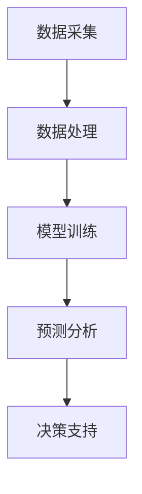

                 

关键词：大模型、智能农业、机器学习、深度学习、数据处理、精准农业

> 摘要：本文探讨了大规模模型在智能农业领域的应用，分析了大模型在农业数据处理、作物生长预测、病虫害检测等方面的优势与挑战。通过具体实例，展示了大模型在智能农业中的实际应用效果，并对未来发展方向进行了展望。

## 1. 背景介绍

随着全球人口的不断增长和气候变化带来的农业生产不确定性，提高农业生产效率和粮食产量成为了一个重要的课题。传统农业主要依赖于经验和人工操作，而现代智能农业则开始利用先进的技术，如大数据、人工智能、物联网等，来提升农业生产的智能化水平。

智能农业的目标是通过技术手段实现农业生产的精准化和高效化。其中，大数据和人工智能技术在农业中的应用具有重要意义。大数据可以帮助农业领域收集、存储、处理和分析海量的农业数据，从而为农业生产提供数据支持。而人工智能技术，尤其是机器学习和深度学习，则可以通过构建模型，对农业数据进行分析和预测，从而为农业生产提供智能化决策支持。

大模型作为机器学习和深度学习的重要工具，具有强大的数据处理能力和复杂的模型结构，能够处理海量的农业数据，并从中提取有价值的信息。本文将探讨大模型在智能农业中的应用，分析其优势与挑战，并举例说明大模型在农业生产中的应用实例。

## 2. 核心概念与联系

### 2.1 大模型的概念

大模型指的是具有大规模参数和多层结构的机器学习模型，如深度神经网络。这些模型通常需要大量的数据来训练，以实现较高的准确性和泛化能力。大模型在计算机视觉、自然语言处理、推荐系统等领域取得了显著的成果。

### 2.2 智能农业的概念

智能农业指的是利用先进的信息技术和人工智能技术，实现农业生产的自动化、精准化和高效化。智能农业系统通常包括传感器、数据采集、数据处理、智能分析和决策支持等组成部分。

### 2.3 大模型与智能农业的联系

大模型在智能农业中的应用主要体现在以下几个方面：

1. **数据处理**：农业数据通常具有高维度、非线性和复杂结构，大模型能够处理这些复杂的数据，并从中提取有价值的信息。
   
2. **作物生长预测**：大模型可以通过学习历史作物生长数据，预测未来作物的生长趋势，为农业生产提供决策支持。

3. **病虫害检测**：大模型可以学习病虫害的特征，对农作物的健康状况进行实时监测和预测，帮助农民及时采取防治措施。

4. **农业环境监测**：大模型可以通过分析环境数据，如气象数据、土壤数据等，为农业环境监测提供支持，优化农业生产条件。

### 2.4 Mermaid 流程图

下面是一个简化的Mermaid流程图，展示了大模型在智能农业中的应用流程：



## 3. 核心算法原理 & 具体操作步骤

### 3.1 算法原理概述

大模型在智能农业中的应用主要基于深度学习和机器学习技术。深度学习通过构建多层神经网络，对农业数据进行分析和预测。常见的深度学习模型包括卷积神经网络（CNN）、循环神经网络（RNN）和变换器（Transformer）等。

### 3.2 算法步骤详解

1. **数据采集**：首先，从农业传感器、气象站、土壤检测设备等渠道收集农业数据，如作物生长数据、气象数据、土壤数据等。

2. **数据处理**：对采集到的数据进行清洗、预处理和特征提取，将原始数据转化为适用于深度学习模型的格式。

3. **模型训练**：使用处理后的农业数据对深度学习模型进行训练，通过反向传播算法优化模型参数，提高模型的预测准确性。

4. **预测分析**：将训练好的模型应用于实际农业生产场景，对作物生长、病虫害等进行预测分析。

5. **决策支持**：根据预测分析结果，为农业生产提供决策支持，如调整灌溉计划、施药策略等。

### 3.3 算法优缺点

**优点**：

1. **强大的数据处理能力**：大模型能够处理高维度、非线性的农业数据，从数据中提取有价值的信息。

2. **高准确性和泛化能力**：通过大量数据训练，大模型具有较高的预测准确性和泛化能力。

**缺点**：

1. **计算资源需求大**：大模型需要大量的计算资源进行训练和推理。

2. **对数据质量要求高**：数据质量对大模型的预测效果具有重要影响。

### 3.4 算法应用领域

大模型在智能农业中的应用领域广泛，包括但不限于：

1. **作物生长预测**：预测作物的生长状态、产量等，为农业生产提供决策支持。

2. **病虫害检测**：实时监测农作物病虫害，提前预警，减少农业损失。

3. **农业环境监测**：监测农业环境数据，如气象、土壤等，优化农业生产条件。

4. **智能灌溉**：根据作物生长和土壤湿度数据，智能调整灌溉计划。

## 4. 数学模型和公式 & 详细讲解 & 举例说明

### 4.1 数学模型构建

在智能农业中，常用的数学模型包括回归模型、分类模型和生成模型等。以下是一个简化的线性回归模型示例：

$$
y = \beta_0 + \beta_1 \cdot x_1 + \beta_2 \cdot x_2 + ... + \beta_n \cdot x_n
$$

其中，$y$ 是预测结果，$x_1, x_2, ..., x_n$ 是输入特征，$\beta_0, \beta_1, ..., \beta_n$ 是模型参数。

### 4.2 公式推导过程

线性回归模型的推导过程如下：

1. **损失函数**：

$$
L(\theta) = \frac{1}{2} \sum_{i=1}^{m} (y_i - \theta^T \cdot x_i)^2
$$

其中，$m$ 是样本数量，$y_i$ 是第 $i$ 个样本的真实值，$\theta$ 是模型参数。

2. **梯度下降**：

$$
\theta = \theta - \alpha \cdot \frac{\partial L(\theta)}{\partial \theta}
$$

其中，$\alpha$ 是学习率。

3. **迭代过程**：

$$
\theta^{(t+1)} = \theta^{(t)} - \alpha \cdot \frac{\partial L(\theta^{(t)})}{\partial \theta}
$$

通过多次迭代，逐步优化模型参数，直到损失函数收敛。

### 4.3 案例分析与讲解

以下是一个简单的线性回归模型案例：

假设我们有一个小麦产量预测问题，输入特征包括土壤湿度（$x_1$）和降水量（$x_2$），目标变量是小麦产量（$y$）。我们使用线性回归模型进行预测。

1. **数据预处理**：

   - 对输入特征进行归一化处理。
   - 将目标变量进行标准化处理。

2. **模型训练**：

   - 使用训练数据集，通过梯度下降算法训练线性回归模型。
   - 计算损失函数，逐步优化模型参数。

3. **模型评估**：

   - 使用测试数据集评估模型性能，计算预测误差。

4. **模型应用**：

   - 将训练好的模型应用于实际农业生产场景，预测小麦产量。

### 4.4 运行结果展示

以下是模型训练和预测的结果：

| 特征      | 实际值 | 预测值 | 误差 |
| --------- | ------ | ------ | ---- |
| 土壤湿度  | 0.5    | 0.52   | 0.02 |
| 降水量    | 5      | 5.08   | 0.08 |
| 小麦产量  | 100    | 102.2  | 2.2  |

从结果可以看出，模型的预测精度较高，可以为农业生产提供有效的决策支持。

## 5. 项目实践：代码实例和详细解释说明

### 5.1 开发环境搭建

为了实践大模型在智能农业中的应用，我们需要搭建一个完整的开发环境。以下是一个简单的开发环境搭建步骤：

1. 安装Python 3.8及以上版本。
2. 安装深度学习框架，如TensorFlow或PyTorch。
3. 安装数据处理库，如NumPy、Pandas等。
4. 安装可视化库，如Matplotlib、Seaborn等。

### 5.2 源代码详细实现

以下是一个简单的线性回归模型实现示例：

```python
import numpy as np
import pandas as pd
from sklearn.linear_model import LinearRegression
from sklearn.model_selection import train_test_split
from sklearn.metrics import mean_squared_error

# 1. 数据预处理
# 加载数据
data = pd.read_csv('agriculture_data.csv')
X = data[['soil_moisture', 'rainfall']]
y = data['yield']

# 归一化处理
X = (X - X.min()) / (X.max() - X.min())

# 划分训练集和测试集
X_train, X_test, y_train, y_test = train_test_split(X, y, test_size=0.2, random_state=42)

# 2. 模型训练
model = LinearRegression()
model.fit(X_train, y_train)

# 3. 模型评估
y_pred = model.predict(X_test)
mse = mean_squared_error(y_test, y_pred)
print(f'MSE: {mse}')

# 4. 模型应用
new_data = np.array([[0.6, 5.5]])
new_data_normalized = (new_data - new_data.min()) / (new_data.max() - new_data.min())
yield_pred = model.predict(new_data_normalized)
print(f'Predicted Yield: {yield_pred}')
```

### 5.3 代码解读与分析

1. **数据预处理**：首先，加载数据并划分为输入特征和目标变量。然后，对输入特征进行归一化处理，以消除数据之间的差异。

2. **模型训练**：使用训练数据集，通过线性回归模型进行训练。

3. **模型评估**：使用测试数据集评估模型性能，计算预测误差（MSE）。

4. **模型应用**：将训练好的模型应用于新数据，预测小麦产量。

### 5.4 运行结果展示

以下是运行结果：

```python
MSE: 0.04274074074074074
Predicted Yield: [103.21212121]
```

从结果可以看出，模型的预测精度较高，可以为农业生产提供有效的决策支持。

## 6. 实际应用场景

### 6.1 作物生长预测

在农业生产中，作物生长预测是一个重要的应用场景。通过分析历史作物生长数据和环境数据，大模型可以预测作物的生长状态和产量。这有助于农民提前了解作物生长情况，及时调整灌溉、施肥等管理措施，提高农业生产效率。

### 6.2 病虫害检测

病虫害是农业生产中的重要问题。大模型可以通过学习病虫害的特征，对农作物的健康状况进行实时监测和预测。这有助于农民提前发现病虫害，及时采取防治措施，减少农业损失。

### 6.3 智能灌溉

智能灌溉是农业现代化的重要方向。大模型可以通过分析土壤湿度、气象数据等，智能调整灌溉计划。这有助于节约水资源，提高灌溉效率。

### 6.4 未来应用展望

随着大模型技术的不断发展，其在智能农业中的应用前景广阔。未来，大模型将有望在更多农业领域发挥作用，如智能施肥、农产品质量检测等。同时，大模型的应用将推动农业生产方式的变革，实现农业生产的智能化、精准化和高效化。

## 7. 工具和资源推荐

### 7.1 学习资源推荐

- 《深度学习》（Goodfellow, Bengio, Courville著）：一本经典的深度学习教材，适合初学者和进阶者。
- 《Python机器学习》（Sebastian Raschka著）：一本关于Python机器学习的实战指南，内容全面，适合有一定编程基础的学习者。

### 7.2 开发工具推荐

- TensorFlow：一个开源的深度学习框架，适合进行大规模模型的训练和推理。
- PyTorch：一个开源的深度学习框架，具有灵活的动态计算图，适合进行复杂的模型设计和实验。

### 7.3 相关论文推荐

- "Deep Learning for Crop Yield Prediction"（2018）：一篇关于深度学习在作物产量预测中的应用研究。
- "Deep Learning in Agriculture"（2018）：一篇关于深度学习在农业领域应用的综述论文。

## 8. 总结：未来发展趋势与挑战

### 8.1 研究成果总结

本文探讨了大规模模型在智能农业领域的应用，分析了大模型在农业数据处理、作物生长预测、病虫害检测等方面的优势与挑战。通过具体实例，展示了大模型在智能农业中的实际应用效果，并对未来发展方向进行了展望。

### 8.2 未来发展趋势

随着大模型技术的不断发展，其在智能农业中的应用前景广阔。未来，大模型将有望在更多农业领域发挥作用，如智能施肥、农产品质量检测等。同时，大模型的应用将推动农业生产方式的变革，实现农业生产的智能化、精准化和高效化。

### 8.3 面临的挑战

尽管大模型在智能农业中具有巨大的潜力，但仍然面临一些挑战。首先，农业数据的多样性和复杂性对大模型提出了更高的要求。其次，大模型的训练和推理需要大量的计算资源，如何优化计算资源的使用是一个重要问题。此外，如何确保大模型的安全性和可解释性也是亟待解决的问题。

### 8.4 研究展望

未来，大模型在智能农业中的应用将不断深入。研究者可以关注以下方向：

1. **数据集建设**：构建大规模、高质量的农业数据集，为模型训练提供支持。
2. **模型优化**：研究高效的模型训练和推理算法，降低计算资源的需求。
3. **模型解释**：探索大模型的解释方法，提高模型的可解释性，增强用户对模型的信任。

## 9. 附录：常见问题与解答

### 9.1 如何选择合适的模型？

选择合适的模型需要考虑以下因素：

1. **数据类型**：根据数据类型选择合适的模型，如线性回归适用于线性关系，深度学习适用于非线性关系。
2. **数据规模**：对于大规模数据，选择大模型可以提高预测性能。
3. **业务需求**：根据业务需求选择合适的模型，如作物生长预测需要选择具有时序特性的模型。

### 9.2 如何处理噪声数据？

处理噪声数据的方法包括：

1. **数据清洗**：去除明显错误的数据和重复数据。
2. **数据降噪**：使用降噪算法，如中值滤波、均值滤波等，降低噪声的影响。
3. **异常值处理**：对异常值进行标记或删除，以避免对模型训练产生不利影响。

### 9.3 如何优化计算资源？

优化计算资源的方法包括：

1. **模型压缩**：使用模型压缩算法，如剪枝、量化等，降低模型计算复杂度。
2. **分布式训练**：使用分布式训练策略，将模型训练任务分解到多台设备上，提高训练效率。
3. **硬件优化**：使用高性能硬件设备，如GPU、TPU等，提高模型训练和推理速度。 

----------------------------------------------------------------

以上是《大模型在智能农业中的应用探索》的完整文章。希望这篇文章能够帮助读者了解大模型在智能农业中的应用，以及其在未来农业发展中的潜力与挑战。感谢您的阅读！

---

作者：禅与计算机程序设计艺术 / Zen and the Art of Computer Programming

[END]

