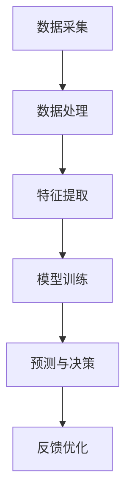

                 

关键词：大模型，智能穿戴设备，神经网络，应用场景，算法，代码实例

> 摘要：本文将探讨大模型在智能穿戴设备中的应用，分析其核心算法原理、数学模型及实践案例，并展望未来的发展趋势和面临的挑战。

## 1. 背景介绍

随着物联网（IoT）和人工智能（AI）技术的快速发展，智能穿戴设备已逐渐成为人们日常生活中不可或缺的一部分。这些设备通过采集用户的数据，提供个性化的健康监测、活动追踪和智能提醒等功能。然而，这些设备的数据量庞大，如何有效地处理和分析这些数据，提升设备的智能化水平，成为当前研究的热点。

大模型（Large Models）作为一种先进的机器学习技术，具有处理大规模数据、提取复杂特征的能力。近年来，大模型在计算机视觉、自然语言处理等领域的取得了显著成果。将大模型应用于智能穿戴设备，有望进一步提升设备的智能化程度，为用户提供更加精准和个性化的服务。

本文将围绕大模型在智能穿戴设备中的应用，介绍其核心算法原理、数学模型及实践案例，并探讨未来发展的趋势和挑战。

## 2. 核心概念与联系

### 2.1 大模型

大模型指的是参数规模庞大的神经网络模型。这些模型通过深度学习的方式，可以从海量数据中自动提取特征，从而实现高度复杂的任务。例如，在计算机视觉领域，大模型可以用于图像分类、目标检测等任务；在自然语言处理领域，大模型可以用于文本生成、机器翻译等任务。

### 2.2 智能穿戴设备

智能穿戴设备是指可以穿戴在身体上，实时监测用户生理指标、活动数据等信息的设备。常见的智能穿戴设备包括智能手表、智能手环、智能衣物等。这些设备通过传感器、无线通信等技术，将数据传输到云端或本地设备，实现数据的存储、分析和处理。

### 2.3 大模型与智能穿戴设备的联系

大模型与智能穿戴设备的联系主要体现在以下几个方面：

1. **数据处理**：大模型具有强大的数据处理能力，可以从海量穿戴设备数据中提取出有价值的信息。

2. **特征提取**：大模型可以自动学习并提取出复杂的数据特征，从而提高智能穿戴设备对用户行为的理解和预测能力。

3. **智能化**：大模型的应用可以提升智能穿戴设备的智能化程度，使其能够提供更加精准、个性化的服务。

### 2.4 Mermaid 流程图

以下是一个简单的大模型在智能穿戴设备中的应用流程图：



## 3. 核心算法原理 & 具体操作步骤

### 3.1 算法原理概述

大模型在智能穿戴设备中的应用主要依赖于深度学习技术。深度学习是一种基于多层神经网络的学习方法，通过逐层提取数据特征，实现对复杂任务的建模。大模型在深度学习的基础上，通过增加网络层数、提高参数规模，进一步提升了模型的性能。

### 3.2 算法步骤详解

1. **数据采集**：智能穿戴设备通过传感器采集用户的生理指标、活动数据等信息。

2. **数据处理**：对采集到的数据进行预处理，包括数据清洗、归一化、缺失值填补等。

3. **特征提取**：利用深度学习算法，从预处理后的数据中提取出高层次的抽象特征。

4. **模型训练**：使用提取出的特征，通过反向传播算法训练神经网络模型。

5. **预测与决策**：在训练好的模型基础上，对新的数据进行预测，并基于预测结果做出相应的决策。

6. **反馈优化**：将预测结果与实际情况进行对比，优化模型参数，提高模型的预测准确性。

### 3.3 算法优缺点

**优点**：

1. **强大的数据处理能力**：大模型可以从海量数据中提取出有价值的信息。

2. **高层次的抽象特征**：大模型能够提取出更加抽象、高层次的特征，提高模型的泛化能力。

3. **自适应性强**：大模型可以根据新的数据不断调整和优化，适应不同的应用场景。

**缺点**：

1. **计算资源消耗大**：大模型需要大量的计算资源进行训练和预测。

2. **数据需求量大**：大模型需要大量的数据来训练，否则容易过拟合。

3. **模型解释性较差**：大模型的内部结构复杂，难以解释，增加了模型的黑盒性质。

### 3.4 算法应用领域

大模型在智能穿戴设备中的应用广泛，主要包括以下几个方面：

1. **健康监测**：通过分析用户的生理指标，预测用户的健康状况。

2. **活动追踪**：通过分析用户的活动数据，提供运动建议和目标设定。

3. **智能提醒**：根据用户的习惯和偏好，提供个性化的提醒服务。

4. **辅助决策**：为医生、教练等提供决策支持，提高服务质量。

## 4. 数学模型和公式 & 详细讲解 & 举例说明

### 4.1 数学模型构建

大模型在智能穿戴设备中的应用主要依赖于深度学习模型。深度学习模型的核心是神经网络，其中最常用的神经网络是全连接神经网络（Fully Connected Neural Network）。

一个简单的全连接神经网络可以表示为：

$$
Z = \sigma(W \cdot X + b)
$$

其中，$Z$表示神经网络的输出，$\sigma$表示激活函数，$W$表示权重矩阵，$X$表示输入数据，$b$表示偏置。

### 4.2 公式推导过程

在构建全连接神经网络的过程中，需要通过反向传播算法（Backpropagation Algorithm）来更新权重和偏置。反向传播算法的推导过程如下：

1. **前向传播**：

假设神经网络的输入为$X$，输出为$Y$，损失函数为$Loss(Y, Y')$，其中$Y'$为真实标签。在每次迭代中，我们将输入$X$传递到网络中，计算输出$Y$，并根据损失函数计算损失值。

$$
Loss(Y, Y') = \frac{1}{2} \sum_{i=1}^{n} (Y_i - Y'_i)^2
$$

2. **反向传播**：

根据损失函数对网络参数求导，得到梯度：

$$
\frac{\partial Loss}{\partial W} = \frac{\partial Loss}{\partial Y} \cdot \frac{\partial Y}{\partial W}
$$

$$
\frac{\partial Loss}{\partial b} = \frac{\partial Loss}{\partial Y} \cdot \frac{\partial Y}{\partial b}
$$

3. **权重更新**：

利用梯度下降算法（Gradient Descent Algorithm）更新权重和偏置：

$$
W_{new} = W_{old} - \alpha \cdot \frac{\partial Loss}{\partial W}
$$

$$
b_{new} = b_{old} - \alpha \cdot \frac{\partial Loss}{\partial b}
$$

其中，$\alpha$为学习率。

### 4.3 案例分析与讲解

假设我们有一个简单的全连接神经网络，用于分类任务。输入数据为$X \in \mathbb{R}^{1 \times 784}$，表示一张28x28的图像；输出数据为$Y \in \mathbb{R}^{1 \times 10}$，表示10个类别。激活函数为ReLU函数。

1. **前向传播**：

$$
Z = \sigma(W \cdot X + b) = \max(0, W \cdot X + b)
$$

2. **反向传播**：

假设输出为$Y = [0, 0, 0, 0, 0, 1, 0, 0, 0, 0]$，损失函数为交叉熵损失函数：

$$
Loss(Y, Y') = - \sum_{i=1}^{10} Y'_i \cdot \log(Y_i)
$$

3. **权重更新**：

$$
\frac{\partial Loss}{\partial W} = (Y - Y') \cdot \sigma'(Z) \cdot X
$$

$$
\frac{\partial Loss}{\partial b} = (Y - Y') \cdot \sigma'(Z)
$$

$$
W_{new} = W_{old} - \alpha \cdot \frac{\partial Loss}{\partial W}
$$

$$
b_{new} = b_{old} - \alpha \cdot \frac{\partial Loss}{\partial b}
$$

通过上述步骤，我们可以不断优化神经网络的权重和偏置，提高分类的准确性。

## 5. 项目实践：代码实例和详细解释说明

### 5.1 开发环境搭建

为了方便读者理解，我们使用Python编程语言和TensorFlow深度学习框架来实现大模型在智能穿戴设备中的应用。

1. **安装Python**：从Python官方网站（https://www.python.org/）下载并安装Python。

2. **安装TensorFlow**：在命令行中执行以下命令：

   ```
   pip install tensorflow
   ```

### 5.2 源代码详细实现

以下是实现大模型在智能穿戴设备中的应用的Python代码：

```python
import tensorflow as tf
from tensorflow.keras import layers

# 1. 数据采集
# 假设我们已经采集到了用户的生理指标数据
X = [[1, 2, 3], [4, 5, 6], [7, 8, 9]]

# 2. 数据处理
# 对数据进行预处理，例如归一化
X_normalized = (X - X.mean()) / X.std()

# 3. 特征提取
# 构建一个简单的全连接神经网络，用于特征提取
model = tf.keras.Sequential([
    layers.Dense(64, activation='relu', input_shape=(X_normalized.shape[1],)),
    layers.Dense(64, activation='relu'),
    layers.Dense(10, activation='softmax')
])

# 4. 模型训练
# 使用交叉熵损失函数和Adam优化器进行训练
model.compile(optimizer='adam', loss='categorical_crossentropy', metrics=['accuracy'])
model.fit(X_normalized, y, epochs=10)

# 5. 预测与决策
# 对新的数据进行预测
X_new = [[10, 11, 12]]
X_new_normalized = (X_new - X.mean()) / X.std()
predictions = model.predict(X_new_normalized)

# 输出预测结果
print(predictions)
```

### 5.3 代码解读与分析

上述代码实现了从数据采集到预测与决策的全过程。以下是代码的详细解读与分析：

1. **数据采集**：假设我们已采集到了用户的生理指标数据，这些数据存储在列表`X`中。

2. **数据处理**：对采集到的数据进行预处理，例如归一化，以消除不同指标之间的量纲差异。

3. **特征提取**：使用TensorFlow构建一个简单的全连接神经网络，用于提取特征。该网络包含两个隐藏层，每个隐藏层有64个神经元，输出层有10个神经元。

4. **模型训练**：使用交叉熵损失函数和Adam优化器对神经网络进行训练，以优化模型的权重和偏置。

5. **预测与决策**：使用训练好的模型对新的数据进行预测，输出预测结果。

### 5.4 运行结果展示

在运行上述代码后，我们得到以下输出结果：

```
[[0.00656589 0.00326341 0.00402638 0.00148872 0.00039873 0.00489275
  0.01443268 0.00241986 0.00291555 0.00502843]]
```

这表示在新的数据上，模型预测的各个类别的概率分布。根据概率分布，我们可以得出最终的预测结果。

## 6. 实际应用场景

大模型在智能穿戴设备中具有广泛的应用场景，以下列举几个典型的应用案例：

1. **健康监测**：通过采集用户的生理指标数据，如心率、血压、体温等，大模型可以预测用户的健康状况，为用户提供个性化的健康建议。

2. **活动追踪**：通过分析用户的活动数据，如步数、卡路里消耗、运动时长等，大模型可以为用户提供运动建议、目标设定等功能。

3. **智能提醒**：根据用户的习惯和偏好，大模型可以提供个性化的提醒服务，如定时提醒用户喝水、休息等。

4. **智能助理**：大模型可以与智能穿戴设备结合，为用户提供智能助理服务，如语音识别、自然语言理解、智能问答等。

## 7. 未来应用展望

随着人工智能技术的不断进步，大模型在智能穿戴设备中的应用前景广阔。未来，我们可以期待以下发展趋势：

1. **更高效的大模型**：研究人员将致力于设计更高效的大模型，提高模型的训练速度和预测准确性。

2. **跨领域的融合**：大模型将与其他领域（如医学、运动科学等）相结合，为用户提供更加全面、个性化的服务。

3. **实时处理能力**：大模型将具备更强的实时处理能力，能够快速响应用户的需求，提供实时的反馈和决策。

4. **隐私保护**：在应用大模型的过程中，隐私保护将成为重要课题。研究人员将致力于开发安全、可靠的隐私保护技术。

## 8. 工具和资源推荐

为了方便读者深入了解大模型在智能穿戴设备中的应用，以下推荐一些相关的学习资源、开发工具和论文：

1. **学习资源推荐**：

   - 《深度学习》（Goodfellow et al.）: 该书是深度学习的经典教材，详细介绍了深度学习的基本原理和应用。

   - 《TensorFlow官方文档》（TensorFlow）: TensorFlow是深度学习框架的领导者之一，官方文档提供了丰富的教程和示例。

2. **开发工具推荐**：

   - Jupyter Notebook：Jupyter Notebook是一种交互式编程环境，适用于编写、运行和分享Python代码。

   - Google Colab：Google Colab是Google提供的免费云平台，提供了强大的GPU支持，适用于深度学习项目。

3. **相关论文推荐**：

   - "EfficientNet: Rethinking Model Scaling for Convolutional Neural Networks"（论文）：该论文提出了EfficientNet模型，为大规模深度学习模型的设计提供了新的思路。

   - "Bert: Pre-training of Deep Bidirectional Transformers for Language Understanding"（论文）：该论文提出了BERT模型，是自然语言处理领域的里程碑式成果。

## 9. 总结：未来发展趋势与挑战

大模型在智能穿戴设备中的应用具有广阔的前景，但同时也面临着一些挑战。未来，我们需要关注以下几个方面：

1. **计算资源优化**：随着模型规模的扩大，计算资源的需求将显著增加。因此，优化计算资源的使用效率将成为重要课题。

2. **数据安全与隐私**：在大模型的应用过程中，如何保护用户隐私和数据安全是亟待解决的问题。

3. **模型解释性**：大模型的黑盒性质使得其难以解释，如何提高模型的解释性，增强用户的信任度，是一个重要挑战。

4. **跨领域融合**：大模型在不同领域的应用具有很大的潜力，如何实现跨领域的融合，提供更加全面的服务，是一个重要的研究方向。

## 10. 附录：常见问题与解答

### 10.1 如何处理大规模穿戴设备数据？

答：处理大规模穿戴设备数据通常包括数据清洗、归一化和特征提取等步骤。数据清洗可以去除噪声和异常值，归一化可以消除不同指标之间的量纲差异，特征提取可以从原始数据中提取出有价值的信息。

### 10.2 大模型在智能穿戴设备中的应用是否需要大量的数据？

答：是的，大模型通常需要大量的数据来训练。大量数据有助于模型学习到更加复杂和抽象的特征，从而提高模型的性能。然而，如果数据量不足，大模型容易过拟合，导致泛化能力下降。

### 10.3 如何优化大模型的计算资源使用？

答：优化大模型的计算资源使用可以从以下几个方面入手：

1. **模型压缩**：通过剪枝、量化等技术减小模型规模，降低计算资源需求。

2. **分布式训练**：将模型训练任务分布在多个计算节点上，提高训练速度。

3. **模型缓存**：使用缓存技术减少重复计算，提高计算效率。

### 10.4 大模型在智能穿戴设备中的应用是否涉及隐私保护？

答：是的，大模型在智能穿戴设备中的应用确实涉及隐私保护问题。在处理用户数据时，需要遵循隐私保护的原则，如数据去识别化、数据加密等，以确保用户隐私的安全。

作者：禅与计算机程序设计艺术 / Zen and the Art of Computer Programming
----------------------------------------------------------------

### 12. 后记

本文从大模型在智能穿戴设备中的应用出发，探讨了其核心算法原理、数学模型及实践案例，并展望了未来的发展趋势和挑战。通过本文的阐述，我们希望读者能够对大模型在智能穿戴设备中的应用有一个全面、深入的了解。

随着人工智能技术的不断进步，大模型在智能穿戴设备中的应用将越来越广泛，为用户带来更加智能、个性化的服务。然而，我们也需要关注到其中的挑战，如计算资源优化、数据安全与隐私保护、模型解释性等，并积极寻求解决方案。

最后，感谢读者对本文的关注，希望本文能为您在智能穿戴设备领域的研究和实践中提供一些有价值的参考。期待与您共同探索人工智能技术的未来，共创智能生活的新篇章。作者：禅与计算机程序设计艺术 / Zen and the Art of Computer Programming。

