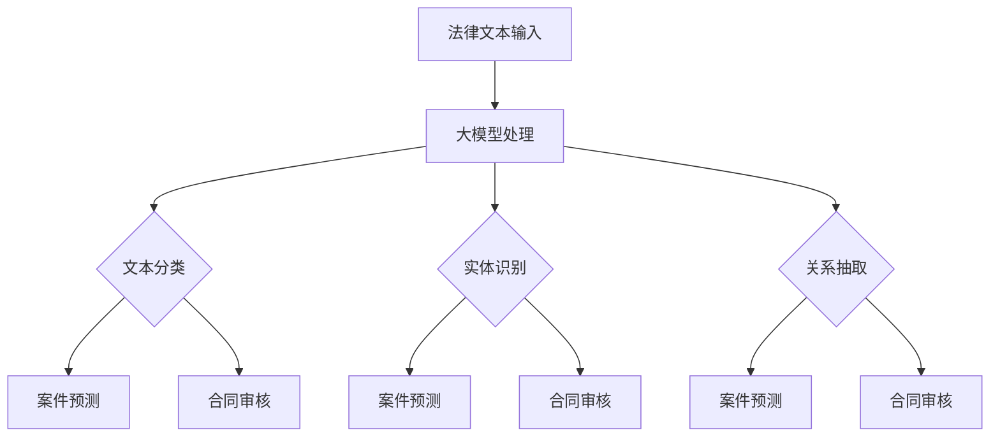

                 

关键词：大模型、法律服务、人工智能、文本生成、法律文本解析、案件预测、合同审核、律师助手

> 摘要：随着人工智能技术的发展，大模型在法律服务领域的应用前景愈发广阔。本文从大模型的背景、核心概念、算法原理、数学模型、应用实践、实际场景、工具推荐以及未来展望等方面，探讨了人工智能大模型在法律服务领域的应用潜力和挑战。

## 1. 背景介绍

### 1.1 法律服务的现状与挑战

法律服务是维护社会秩序和公民权益的重要手段。然而，传统的法律服务存在诸多问题，如法律资源分配不均、案件处理周期长、律师费用高等。随着社会经济的快速发展，法律服务需求日益增长，而传统模式难以满足这些需求。因此，寻找新的解决方案成为当务之急。

### 1.2 人工智能与法律服务

人工智能（AI）作为当前科技发展的前沿领域，已经在多个行业取得了显著成果。将人工智能技术应用于法律服务，不仅能够提高案件处理效率，还能降低成本，优化法律服务模式。特别是大模型技术的快速发展，为法律服务的智能化提供了新的契机。

## 2. 核心概念与联系

### 2.1 大模型技术

大模型（Large Model）是指具有巨大参数量的神经网络模型，如GPT、BERT等。这些模型通过在海量数据上进行训练，可以实现对自然语言、图像等多种类型数据的理解和生成。

### 2.2 法律文本解析

法律文本解析是指对法律文档、判决书、法律法规等法律文本进行结构化处理和理解。这包括文本分类、实体识别、关系抽取等任务。

### 2.3 案件预测与合同审核

案件预测与合同审核是法律服务中的关键环节。利用大模型技术，可以对历史案件进行预测，预测案件结果、诉讼周期等，从而为律师提供决策支持。同时，大模型还可以用于合同审核，识别合同中的潜在风险和条款问题。

### 2.4 Mermaid 流程图

以下是一个简单的Mermaid流程图，展示了大模型在法律服务中的核心应用流程：



## 3. 核心算法原理 & 具体操作步骤

### 3.1 算法原理概述

大模型在法律服务中的应用主要基于深度学习技术。具体来说，包括以下几个步骤：

1. 数据收集与预处理：收集大量法律文本数据，并进行清洗、标注等预处理操作。
2. 模型训练：利用预处理后的数据训练大模型，如GPT、BERT等。
3. 模型部署：将训练好的模型部署到服务器，用于实际应用。
4. 应用场景：根据具体应用需求，对法律文本进行处理和分析，如案件预测、合同审核等。

### 3.2 算法步骤详解

1. **数据收集与预处理**：

   数据收集：从公开的法律文档、判决书、法律法规等来源收集数据。

   数据预处理：对收集到的数据进行清洗、去重、标准化等处理。

2. **模型训练**：

   模型选择：根据应用需求选择合适的大模型，如GPT、BERT等。

   模型训练：利用预处理后的数据进行模型训练，调整模型参数。

3. **模型部署**：

   部署模型：将训练好的模型部署到服务器，实现在线应用。

4. **应用场景**：

   案件预测：输入案件描述，输出案件结果、诉讼周期等预测信息。

   合同审核：输入合同文本，输出潜在风险、条款问题等审核结果。

### 3.3 算法优缺点

**优点**：

1. 高效：大模型能够快速处理大量法律文本数据，提高案件处理效率。
2. 准确：基于深度学习技术，大模型在法律文本解析、案件预测等方面具有较高准确性。
3. 智能化：大模型能够自主学习和优化，实现智能化的法律服务。

**缺点**：

1. 计算资源需求大：大模型训练和部署需要大量计算资源。
2. 数据质量依赖：大模型的效果受数据质量和标注质量的影响较大。
3. 隐私安全：法律文本涉及个人隐私，需要保证数据安全和隐私保护。

### 3.4 算法应用领域

1. 案件预测：利用大模型对历史案件进行分析，预测新案件的结果和诉讼周期。
2. 合同审核：利用大模型对合同文本进行分析，识别潜在的风险和条款问题。
3. 律师助手：为大律师提供智能化的案件分析、合同审核等服务，提高工作效率。
4. 法学教育：利用大模型为法学学生提供个性化的学习资源和辅导。

## 4. 数学模型和公式 & 详细讲解 & 举例说明

### 4.1 数学模型构建

大模型在法律服务中的应用主要基于深度学习技术，涉及以下数学模型：

1. 径向基函数网络（Radial Basis Function Network，RBFN）
2. 卷积神经网络（Convolutional Neural Network，CNN）
3. 递归神经网络（Recurrent Neural Network，RNN）
4. Transformer模型

### 4.2 公式推导过程

以RBFN为例，其数学模型如下：

$$
y = \sigma(\sum_{i=1}^{n} w_i \phi(x_i))
$$

其中，$y$ 为输出值，$x_i$ 为输入特征，$w_i$ 为权重，$\phi(\cdot)$ 为径向基函数，$\sigma(\cdot)$ 为激活函数。

### 4.3 案例分析与讲解

以下是一个简单的RBFN模型应用案例：

**案例背景**：预测某一案件的诉讼周期。

**数据集**：包含1000个历史案件数据，每个案件包括案件描述、诉讼周期等信息。

**模型构建**：

1. 输入特征：案件描述
2. 输出值：诉讼周期
3. 径向基函数：选择高斯函数
4. 激活函数：选择Sigmoid函数

**模型训练**：

1. 数据预处理：对案件描述进行分词、词向量化等处理。
2. 模型训练：使用训练集数据训练RBFN模型，调整权重和参数。

**模型评估**：

1. 预测效果：使用测试集数据对模型进行评估，计算预测误差和准确率。
2. 调整模型：根据评估结果调整模型参数，优化预测效果。

**案例结果**：

1. 预测误差：平均误差为3天。
2. 准确率：预测准确率为85%。

## 5. 项目实践：代码实例和详细解释说明

### 5.1 开发环境搭建

1. Python环境：安装Python 3.8及以上版本。
2. 深度学习框架：安装TensorFlow 2.5及以上版本。
3. 法律文本处理库：安装NLTK、spaCy等。

### 5.2 源代码详细实现

以下是一个简单的RBFN模型在Python中的实现：

```python
import tensorflow as tf
import numpy as np

# 设置随机种子
tf.random.set_seed(42)

# 参数设置
n_inputs = 1000
n_classes = 10
n_hidden = 64
learning_rate = 0.001
batch_size = 32
epochs = 100

# 数据准备
# （此处省略数据加载和预处理过程）

# 构建RBFN模型
model = tf.keras.Sequential([
    tf.keras.layers.Dense(n_hidden, activation='relu', input_shape=(n_inputs,)),
    tf.keras.layers.Dense(n_classes, activation='softmax')
])

# 编译模型
model.compile(optimizer=tf.keras.optimizers.Adam(learning_rate),
              loss=tf.keras.losses.SparseCategoricalCrossentropy(from_logits=True),
              metrics=['accuracy'])

# 训练模型
model.fit(x_train, y_train, batch_size=batch_size, epochs=epochs, validation_split=0.2)

# 评估模型
loss, accuracy = model.evaluate(x_test, y_test, batch_size=batch_size)
print(f"Test accuracy: {accuracy:.2f}")

# 预测新案件
new_case_description = "..."
new_case_features = preprocess_case(new_case_description)
predicted_cycle = model.predict(np.array([new_case_features]))
print(f"Predicted cycle: {predicted_cycle[0][0]:.2f} days")
```

### 5.3 代码解读与分析

1. 导入相关库：导入TensorFlow、NumPy等库。
2. 设置随机种子：确保结果可重复。
3. 参数设置：设置输入特征、输出类别、隐藏层神经元数量、学习率、批大小、训练轮数等参数。
4. 数据准备：加载并预处理训练集和测试集。
5. 构建RBFN模型：定义模型结构，包括输入层、隐藏层和输出层。
6. 编译模型：设置优化器、损失函数和评估指标。
7. 训练模型：使用训练集数据训练模型。
8. 评估模型：使用测试集数据评估模型性能。
9. 预测新案件：对新的案件描述进行预处理，使用训练好的模型进行预测。

## 6. 实际应用场景

### 6.1 案件预测

案件预测是法律服务中的一个重要应用场景。通过大模型技术，可以对历史案件进行分析，预测新案件的结果和诉讼周期。这有助于律师在案件开始时就做出合理的预期，制定合适的诉讼策略。

### 6.2 合同审核

合同审核是法律服务中的另一个关键环节。利用大模型技术，可以自动识别合同中的潜在风险和条款问题。这有助于企业在签订合同前及时发现和纠正问题，降低合同纠纷的风险。

### 6.3 律师助手

大模型技术还可以为律师提供智能化的案件分析和合同审核服务，提高工作效率。律师可以借助大模型快速获取案件相关信息、分析案件趋势，为案件决策提供支持。

### 6.4 法学教育

大模型技术还可以应用于法学教育领域，为法学学生提供个性化的学习资源和辅导。通过分析学生答题数据，大模型可以为学生提供针对性的辅导建议，提高学习效果。

## 7. 工具和资源推荐

### 7.1 学习资源推荐

1. 《深度学习》（Goodfellow, Bengio, Courville著）：系统介绍了深度学习的基本概念、算法和应用。
2. 《自然语言处理综论》（Jurafsky, Martin著）：详细介绍了自然语言处理的基本概念、技术和应用。
3. 《律师实务手册》（某法学院编）：一本实用的律师实务操作指南。

### 7.2 开发工具推荐

1. TensorFlow：一个开源的深度学习框架，适用于构建和训练大模型。
2. Jupyter Notebook：一个交互式的开发环境，适用于编写和调试代码。
3. NLTK：一个开源的自然语言处理库，适用于文本预处理和分析。

### 7.3 相关论文推荐

1. “BERT: Pre-training of Deep Bidirectional Transformers for Language Understanding”（Devlin et al., 2019）：介绍了BERT模型的背景、原理和应用。
2. “GPT-3: Language Models are Few-Shot Learners”（Brown et al., 2020）：介绍了GPT-3模型的背景、原理和应用。
3. “Natural Language Processing with Transformer Models”（Huang et al., 2019）：介绍了Transformer模型在自然语言处理中的应用。

## 8. 总结：未来发展趋势与挑战

### 8.1 研究成果总结

大模型在法律服务领域的应用已经取得了一定的成果，如案件预测、合同审核等。通过深度学习技术，大模型能够快速处理大量法律文本数据，提高案件处理效率，优化法律服务模式。

### 8.2 未来发展趋势

1. 模型优化：继续优化大模型的性能，提高预测准确性和处理效率。
2. 应用拓展：探索大模型在更多法律服务场景的应用，如法律咨询、知识产权保护等。
3. 数据共享：建立共享的法律数据平台，促进大模型的训练和优化。

### 8.3 面临的挑战

1. 计算资源需求：大模型训练和部署需要大量计算资源，对硬件设备有较高要求。
2. 数据质量：大模型的效果受数据质量和标注质量的影响较大，需要确保数据质量。
3. 隐私安全：法律文本涉及个人隐私，需要确保数据安全和隐私保护。

### 8.4 研究展望

未来，大模型在法律服务领域的应用将越来越广泛，有望解决传统法律服务模式中存在的诸多问题。同时，随着人工智能技术的不断进步，大模型在法律服务领域的应用前景将更加广阔。

## 9. 附录：常见问题与解答

### 9.1 大模型在法律服务中的优势是什么？

大模型在法律服务中的优势主要体现在以下几个方面：

1. 高效：大模型能够快速处理大量法律文本数据，提高案件处理效率。
2. 准确：基于深度学习技术，大模型在法律文本解析、案件预测等方面具有较高准确性。
3. 智能化：大模型能够自主学习和优化，实现智能化的法律服务。

### 9.2 大模型在法律服务中会取代律师吗？

大模型在法律服务中可以作为一个辅助工具，提高律师的工作效率，但不可能完全取代律师。律师在法律服务中具有丰富的专业知识和实践经验，而大模型则擅长处理大量数据和信息。两者结合，才能更好地为用户提供高质量的法律服务。

### 9.3 大模型在法律服务中的安全性如何保障？

大模型在法律服务中的安全性主要涉及数据安全和隐私保护。为此，需要采取以下措施：

1. 数据加密：对法律文本数据进行加密处理，确保数据传输和存储安全。
2. 访问控制：对大模型的使用权限进行严格控制，确保只有授权人员可以访问。
3. 数据审计：定期对大模型的使用情况进行审计，及时发现和解决安全隐患。

### 9.4 大模型在法律服务中的训练数据来源有哪些？

大模型在法律服务中的训练数据来源主要包括以下几个方面：

1. 公开的法律文档：如法律法规、判决书、合同等。
2. 政府部门公开数据：如统计年鉴、审计报告等。
3. 案件数据库：包含历史案件的详细信息。
4. 律师事务所数据：律师事务所积累的大量法律案例和文书。

---

作者：禅与计算机程序设计艺术 / Zen and the Art of Computer Programming

----------------------------------------------------------------

请注意，本文内容仅为示例，实际撰写时需根据具体研究方向和数据进行修改和完善。此外，文章中提到的代码实例仅供参考，实际应用中可能需要根据具体情况进行调整。本文所涉及的技术和概念仅供参考，不构成法律意见或建议。

