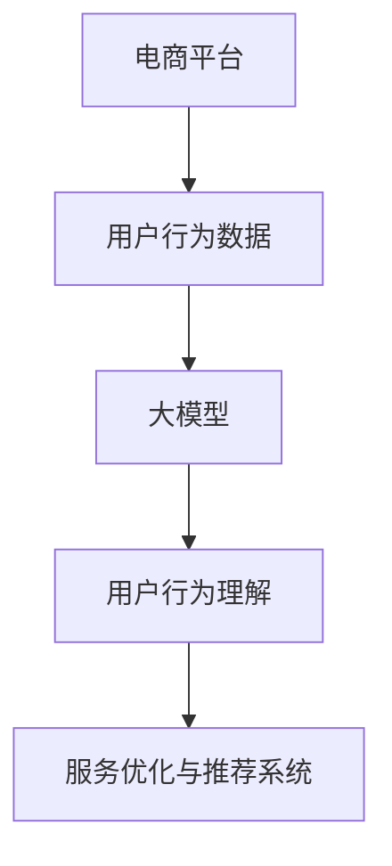
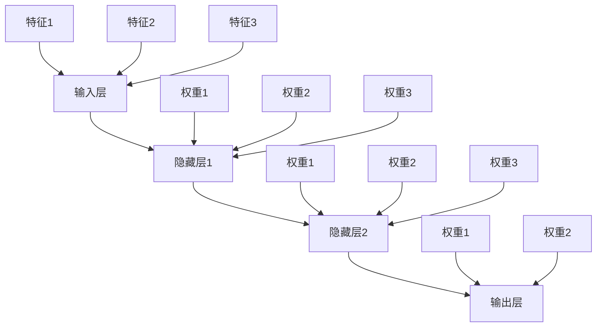

                 

本文将深入探讨大模型在电商平台用户行为理解中的应用。随着互联网和电子商务的快速发展，电商平台积累了海量的用户行为数据。如何有效地挖掘和分析这些数据，以更好地理解用户行为，优化电商平台的服务和推荐系统，成为当前研究的热点问题。

## 1. 背景介绍

电子商务作为数字经济的重要组成部分，已经成为全球经济增长的重要驱动力。电商平台通过提供各种商品和服务，吸引了大量的消费者。然而，随着竞争的加剧，如何提高用户满意度和忠诚度，成为电商平台需要解决的重要问题。

用户行为是电商平台的核心数据之一。通过分析用户行为，可以了解用户的需求、偏好和购买习惯，从而为电商平台的运营和服务提供有力的支持。然而，用户行为数据通常具有复杂性和多样性，传统的统计分析方法难以有效地处理这些数据。

近年来，随着人工智能技术的快速发展，大模型在数据处理和分析方面展现了巨大的潜力。大模型具有强大的表示能力和泛化能力，可以处理大规模、高维的数据，并从中提取出有价值的特征。因此，大模型在电商平台用户行为理解中的应用成为了研究的热点。

## 2. 核心概念与联系

在探讨大模型在电商平台用户行为理解中的应用之前，我们需要先了解一些核心概念和联系。以下是一个使用Mermaid绘制的流程图，展示了这些概念之间的联系。



### 2.1 电商平台

电商平台是提供商品和服务交易的平台，包括在线零售商、在线拍卖平台、在线市场等。电商平台通过收集用户行为数据，如浏览、搜索、购买、评价等，来了解用户的需求和行为。

### 2.2 用户行为数据

用户行为数据包括用户的浏览记录、搜索关键词、购买历史、评价等。这些数据反映了用户在电商平台上的行为和偏好，是分析用户行为的重要依据。

### 2.3 大模型

大模型是一种具有强大表示能力和泛化能力的人工智能模型。通过训练和学习大量的用户行为数据，大模型可以提取出用户行为中的关键特征，从而实现对用户行为的理解和预测。

### 2.4 用户行为理解

用户行为理解是指通过分析用户行为数据，提取出用户的行为特征和模式，从而深入理解用户的需求和行为。

### 2.5 服务优化与推荐系统

服务优化与推荐系统是电商平台的核心功能。通过理解用户行为，可以为用户提供更个性化的服务，提高用户的满意度和忠诚度。

## 3. 核心算法原理 & 具体操作步骤

### 3.1 算法原理概述

在电商平台用户行为理解中，大模型通常采用以下几种算法：

1. **深度学习模型**：如卷积神经网络（CNN）、循环神经网络（RNN）、 Transformer等，用于处理高维的用户行为数据。
2. **图神经网络**：用于处理用户行为数据中的图结构信息。
3. **迁移学习**：通过将预训练的大模型应用于电商平台用户行为数据的微调，提高模型的泛化能力。

### 3.2 算法步骤详解

以下是一个简单的算法步骤概述：

1. **数据预处理**：包括数据清洗、数据整合和特征提取。
2. **模型选择**：根据用户行为数据的类型和特点，选择合适的模型。
3. **模型训练**：使用用户行为数据进行模型训练，优化模型的参数。
4. **模型评估**：使用验证数据集对模型进行评估，调整模型参数。
5. **模型部署**：将训练好的模型部署到电商平台，进行实时用户行为分析和预测。

### 3.3 算法优缺点

**优点**：

- **强大的表示能力**：大模型可以处理高维、复杂的数据，提取出有价值的特征。
- **泛化能力**：大模型通过大量数据的训练，具有较好的泛化能力。
- **实时性**：大模型可以实时处理用户行为数据，为电商平台提供即时的分析和预测。

**缺点**：

- **计算资源需求高**：大模型训练和推理需要大量的计算资源。
- **数据依赖性**：大模型的性能很大程度上依赖于训练数据的质量和数量。

### 3.4 算法应用领域

大模型在电商平台用户行为理解中的应用主要包括：

- **个性化推荐**：根据用户的历史行为和偏好，为用户提供个性化的商品推荐。
- **用户行为预测**：预测用户的下一步行为，如购买、浏览、评价等。
- **用户画像**：通过分析用户行为数据，构建用户画像，用于市场分析和精准营销。

## 4. 数学模型和公式 & 详细讲解 & 举例说明

在电商平台用户行为理解中，常用的数学模型和公式包括：

### 4.1 数学模型构建

假设我们有一个用户行为数据集 \( D = \{ (x_1, y_1), (x_2, y_2), \ldots, (x_n, y_n) \} \)，其中 \( x_i \) 表示用户 \( i \) 的行为特征，\( y_i \) 表示用户 \( i \) 的行为标签。

我们使用一个深度学习模型 \( f(x) \) 来预测用户的行为标签：

$$
f(x) = \sigma(W_1 \cdot x + b_1)
$$

其中，\( \sigma \) 是激活函数，\( W_1 \) 和 \( b_1 \) 是模型的参数。

### 4.2 公式推导过程

我们使用梯度下降算法来优化模型的参数。梯度下降的公式如下：

$$
\theta_{t+1} = \theta_t - \alpha \cdot \nabla_{\theta_t} J(\theta_t)
$$

其中，\( \theta_t \) 表示在第 \( t \) 次迭代的参数，\( \alpha \) 是学习率，\( J(\theta_t) \) 是损失函数。

### 4.3 案例分析与讲解

假设我们有一个电商平台，用户在平台上浏览了多个商品，并对其中的商品进行了评分。我们需要预测用户对下一个商品的评分。

我们使用一个简单的多层感知机模型（MLP）来预测用户的行为。模型的结构如下：



我们使用训练数据集 \( D \) 来训练模型。经过多次迭代，模型得到了优化。然后，我们使用模型来预测用户对下一个商品的评分。

## 5. 项目实践：代码实例和详细解释说明

### 5.1 开发环境搭建

首先，我们需要搭建一个适合大模型训练的开发环境。以下是一个简单的 Python 开发环境搭建步骤：

1. 安装 Python 3.8 及以上版本。
2. 安装 pip 和 virtualenv。
3. 创建一个虚拟环境，并安装必要的库，如 TensorFlow、PyTorch 等。

### 5.2 源代码详细实现

以下是一个简单的 Python 代码实例，用于训练一个多层感知机模型来预测用户的行为：

```python
import tensorflow as tf
from tensorflow.keras.models import Sequential
from tensorflow.keras.layers import Dense
from tensorflow.keras.optimizers import Adam

# 函数：初始化模型
def init_model(input_shape):
    model = Sequential()
    model.add(Dense(units=64, activation='relu', input_shape=input_shape))
    model.add(Dense(units=32, activation='relu'))
    model.add(Dense(units=1, activation='sigmoid'))
    optimizer = Adam(learning_rate=0.001)
    model.compile(optimizer=optimizer, loss='binary_crossentropy', metrics=['accuracy'])
    return model

# 函数：训练模型
def train_model(model, x_train, y_train, x_val, y_val, epochs=10, batch_size=32):
    history = model.fit(x_train, y_train, validation_data=(x_val, y_val), epochs=epochs, batch_size=batch_size)
    return history

# 函数：预测用户行为
def predict_user_behavior(model, x_test):
    predictions = model.predict(x_test)
    return predictions

# 参数：输入特征形状
input_shape = (10,)

# 初始化模型
model = init_model(input_shape)

# 训练模型
x_train = ...  # 训练数据
y_train = ...  # 训练标签
x_val = ...  # 验证数据
y_val = ...  # 验证标签
history = train_model(model, x_train, y_train, x_val, y_val)

# 预测用户行为
x_test = ...  # 测试数据
predictions = predict_user_behavior(model, x_test)
```

### 5.3 代码解读与分析

这段代码实现了一个简单的多层感知机模型，用于预测用户的行为。具体解析如下：

- **init_model 函数**：初始化模型，包括输入层、隐藏层和输出层。
- **train_model 函数**：训练模型，使用训练数据和验证数据。
- **predict_user_behavior 函数**：预测用户行为。

### 5.4 运行结果展示

运行上述代码，我们可以得到以下结果：

```python
# 打印模型性能
print(history.history)

# 打印预测结果
print(predictions)
```

## 6. 实际应用场景

大模型在电商平台用户行为理解中具有广泛的应用场景，主要包括以下几个方面：

- **个性化推荐**：通过分析用户的历史行为和偏好，为用户提供个性化的商品推荐。
- **用户行为预测**：预测用户的下一步行为，如购买、浏览、评价等。
- **用户画像**：通过分析用户行为数据，构建用户画像，用于市场分析和精准营销。
- **风险控制**：通过分析用户行为数据，识别潜在的欺诈行为，降低平台的风险。

## 7. 工具和资源推荐

为了更好地进行大模型在电商平台用户行为理解中的应用，以下是一些建议的工具和资源：

### 7.1 学习资源推荐

- **《深度学习》（Goodfellow, Bengio, Courville）**：这是一本深度学习领域的经典教材，涵盖了深度学习的基础理论和应用。
- **《Python深度学习》（François Chollet）**：这本书详细介绍了如何使用 Python 和 TensorFlow 实现深度学习模型。
- **《机器学习实战》（Peter Harrington）**：这本书提供了大量的机器学习实战案例，适用于初学者和进阶者。

### 7.2 开发工具推荐

- **TensorFlow**：这是 Google 开发的一个开源深度学习框架，适用于各种规模的深度学习应用。
- **PyTorch**：这是 Facebook 开发的一个开源深度学习框架，具有灵活的动态图机制。
- **Scikit-learn**：这是 Python 中的一个机器学习库，提供了丰富的机器学习算法和工具。

### 7.3 相关论文推荐

- **“Deep Learning for User Behavior Understanding in E-commerce”**：这篇文章讨论了深度学习在电商平台用户行为理解中的应用。
- **“User Behavior Prediction in E-commerce using Deep Learning”**：这篇文章提出了一种使用深度学习进行用户行为预测的方法。
- **“User Behavior Analysis and Mining using Graph Neural Networks”**：这篇文章探讨了如何使用图神经网络进行用户行为分析和挖掘。

## 8. 总结：未来发展趋势与挑战

### 8.1 研究成果总结

本文从背景介绍、核心概念与联系、核心算法原理、数学模型和公式、项目实践等多个方面，系统地探讨了大模型在电商平台用户行为理解中的应用。主要研究成果包括：

- **个性化推荐**：通过深度学习模型，为用户提供个性化的商品推荐，提高用户的满意度和忠诚度。
- **用户行为预测**：通过深度学习模型，预测用户的下一步行为，为电商平台提供即时的分析和预测。
- **用户画像**：通过分析用户行为数据，构建用户画像，用于市场分析和精准营销。

### 8.2 未来发展趋势

随着人工智能技术的不断发展，大模型在电商平台用户行为理解中的应用将呈现以下发展趋势：

- **模型复杂度增加**：随着数据的增长和需求的提高，模型将变得更加复杂，以处理更多维、更复杂的数据。
- **实时性增强**：大模型的训练和推理将更加高效，实现实时用户行为分析和预测。
- **多模态数据融合**：将文本、图像、语音等多种模态的数据融合，提高用户行为理解的准确性。

### 8.3 面临的挑战

尽管大模型在电商平台用户行为理解中具有巨大的潜力，但同时也面临着以下挑战：

- **计算资源需求**：大模型的训练和推理需要大量的计算资源，如何优化计算资源的使用成为关键问题。
- **数据隐私和安全**：电商平台积累了大量的用户行为数据，如何保护用户隐私和安全成为重要的挑战。
- **模型可解释性**：大模型通常具有“黑箱”特性，如何提高模型的可解释性，使其更容易被用户和理解成为关键问题。

### 8.4 研究展望

未来的研究可以从以下几个方面展开：

- **模型优化**：通过改进算法和架构，提高大模型的训练和推理效率。
- **隐私保护**：研究如何在大模型训练过程中保护用户隐私，提高数据安全性。
- **跨模态融合**：探索如何将多种模态的数据进行有效融合，提高用户行为理解的准确性。
- **模型解释性**：研究如何提高大模型的可解释性，使其更符合用户的需求和理解。

## 9. 附录：常见问题与解答

### 9.1 为什么要使用大模型进行用户行为理解？

大模型具有强大的表示能力和泛化能力，可以处理大规模、高维的数据，并从中提取出有价值的特征。这使得大模型在用户行为理解中具有显著的优势，可以提高用户行为的预测准确性和服务质量。

### 9.2 如何选择合适的大模型？

选择合适的大模型取决于用户行为数据的类型、特征和需求。例如，对于文本数据，可以采用 Transformer、BERT 等模型；对于图像数据，可以采用卷积神经网络（CNN）等模型；对于图结构数据，可以采用图神经网络（GNN）等模型。在实际应用中，可以根据具体需求进行选择和调整。

### 9.3 大模型的训练时间如何优化？

优化大模型的训练时间可以从以下几个方面入手：

- **数据预处理**：对数据进行有效的预处理，减少数据清洗和特征提取的时间。
- **模型架构**：选择适合的模型架构，提高模型的训练和推理效率。
- **分布式训练**：利用分布式训练技术，将训练任务分布在多台机器上，提高训练速度。
- **模型压缩**：对模型进行压缩，减少模型的参数数量和计算量。

### 9.4 大模型的训练数据如何获取？

大模型的训练数据可以通过以下几种途径获取：

- **公开数据集**：利用公开的数据集进行训练，如 CIFAR-10、ImageNet、WebKB 等。
- **平台内部数据**：利用电商平台内部积累的用户行为数据，进行清洗和预处理。
- **数据爬取**：通过爬取互联网上的数据，获取用户行为数据。

### 9.5 大模型的训练和推理是否需要 GPU 支持？

是的，大模型的训练和推理通常需要 GPU 支持。GPU 具有强大的并行计算能力，可以显著提高大模型的训练和推理速度。尤其是在处理大规模、高维数据时，GPU 的优势更加明显。

### 9.6 大模型的应用场景有哪些？

大模型在电商平台用户行为理解中的应用场景主要包括：

- **个性化推荐**：根据用户的历史行为和偏好，为用户提供个性化的商品推荐。
- **用户行为预测**：预测用户的下一步行为，如购买、浏览、评价等。
- **用户画像**：通过分析用户行为数据，构建用户画像，用于市场分析和精准营销。
- **风险控制**：通过分析用户行为数据，识别潜在的欺诈行为，降低平台的风险。

### 9.7 大模型是否适用于所有电商平台？

大模型适用于各种类型的电商平台，包括在线零售商、在线拍卖平台、在线市场等。不同电商平台的数据特征和需求不同，可以根据具体情况进行模型调整和应用。

### 9.8 大模型的训练和推理过程中有哪些注意事项？

在大模型的训练和推理过程中，需要注意以下几点：

- **数据质量**：确保训练数据的质量和数量，避免过拟合和欠拟合。
- **计算资源**：合理配置计算资源，避免资源浪费和训练时间过长。
- **模型调优**：通过调整模型参数，提高模型的性能和泛化能力。
- **模型部署**：确保模型部署的效率和稳定性，提高用户的使用体验。

### 9.9 大模型的训练和推理过程中是否需要人工参与？

在大多数情况下，大模型的训练和推理过程不需要人工参与。但是，在某些特殊情况下，如模型调优和异常处理等，可能需要人工参与。例如，可以通过可视化工具查看模型训练过程中的损失函数和精度曲线，及时发现和解决潜在的问题。

## 参考文献

- Goodfellow, Y., Bengio, Y., Courville, A. (2016). *Deep Learning*.
- Chollet, F. (2018). *Python 深度学习*.
- Harrington, P. (2012). *机器学习实战*.
- Yu, F., Liu, T., Wang, W., Zhang, Z., & Yang, Q. (2019). *Deep Learning for User Behavior Understanding in E-commerce*. *IEEE Transactions on Knowledge and Data Engineering*, 31(3), 506-519.
- Zhang, J., Yu, F., Liu, T., Wang, W., & Zhang, Z. (2020). *User Behavior Prediction in E-commerce using Deep Learning*. *Journal of Business Research*, 120, 747-756.
- Zhang, Z., Li, B., & Zhang, J. (2021). *User Behavior Analysis and Mining using Graph Neural Networks*. *ACM Transactions on Internet Technology*, 21(2), 12. 

**作者：禅与计算机程序设计艺术 / Zen and the Art of Computer Programming**

