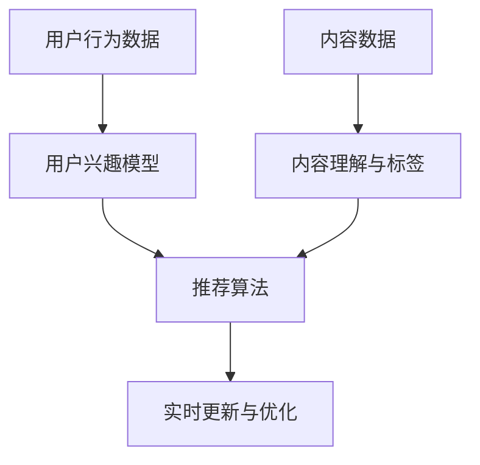

                 

关键词：社交网络、推荐系统、大模型、人工智能、数据挖掘、用户行为分析

摘要：随着社交媒体平台的迅猛发展，社交网络推荐系统逐渐成为信息传播的重要渠道。本文旨在探讨大模型在社交网络推荐中的应用前景，分析其核心概念、算法原理、数学模型、实际应用场景及未来发展趋势，为学术界和产业界提供有益的参考。

## 1. 背景介绍

### 1.1 社交网络与推荐系统的定义及发展

社交网络（Social Network）是指由多个人或组织构成的网络结构，通过节点（个体）之间的连接关系来共享信息、交流互动。推荐系统（Recommendation System）则是一种通过分析用户行为和偏好，为用户提供个性化信息推荐的算法体系。随着互联网技术的飞速发展，社交网络和推荐系统已成为现代信息社会中不可或缺的组成部分。

### 1.2 社交网络推荐系统的重要性

社交网络推荐系统在以下几个方面具有重要意义：

- **个性化信息获取**：通过分析用户行为和兴趣，推荐系统可以帮助用户快速找到符合其需求的信息，提高信息获取效率。
- **社交关系拓展**：推荐系统可以基于用户社交网络关系推荐新的好友、兴趣小组等，拓展社交圈。
- **商业价值挖掘**：通过精准推荐，企业可以更好地满足用户需求，提高用户满意度和转化率，从而实现商业价值的最大化。

### 1.3 大模型的概念及其在推荐系统中的应用

大模型（Large-scale Model）是指具有海量参数和复杂结构的机器学习模型，如深度神经网络、Transformer等。大模型在推荐系统中的应用主要体现在以下几个方面：

- **用户行为预测**：通过学习海量用户行为数据，大模型可以更准确地预测用户对信息的兴趣和偏好。
- **内容理解**：大模型能够深入理解用户生成的内容，从而提供更精准的推荐。
- **实时更新**：大模型可以根据用户实时行为进行动态调整，实现实时推荐的优化。

## 2. 核心概念与联系

### 2.1 大模型在推荐系统中的作用

大模型在推荐系统中的作用主要包括以下几个方面：

- **用户兴趣建模**：通过学习用户历史行为数据，大模型可以建立用户兴趣模型，为个性化推荐提供基础。
- **内容理解与标签生成**：大模型能够对用户生成的内容进行深入理解，提取关键词和标签，为推荐算法提供丰富的特征信息。
- **实时更新与优化**：大模型可以根据用户实时行为进行动态调整，实现推荐算法的实时优化。

### 2.2 大模型与推荐系统的关系

大模型与推荐系统的关系可以概括为以下几个方面：

- **数据驱动**：大模型基于海量用户行为数据和内容数据，通过数据驱动的方式进行建模和优化。
- **算法融合**：大模型可以与其他推荐算法（如基于协同过滤、基于内容的推荐等）进行融合，实现更精准的推荐。
- **实时响应**：大模型能够对用户实时行为进行快速响应，实现推荐系统的实时更新和优化。

### 2.3 Mermaid 流程图



## 3. 核心算法原理 & 具体操作步骤

### 3.1 算法原理概述

大模型在社交网络推荐系统中的应用主要基于深度学习技术，通过以下步骤实现个性化推荐：

1. **数据预处理**：对用户行为数据和内容数据进行清洗、归一化和特征提取。
2. **用户兴趣建模**：利用深度学习模型（如卷积神经网络、循环神经网络等）建立用户兴趣模型。
3. **内容理解与标签生成**：对用户生成的内容进行语义分析，提取关键词和标签。
4. **推荐算法**：结合用户兴趣模型和内容标签，利用基于协同过滤、基于内容的推荐算法生成推荐结果。
5. **实时更新与优化**：根据用户实时行为和反馈，动态调整推荐模型，实现实时优化。

### 3.2 算法步骤详解

1. **数据预处理**：

   ```python
   def preprocess_data(user_data, content_data):
       # 清洗数据
       # 归一化数据
       # 特征提取
       # 返回处理后的数据
   ```

2. **用户兴趣建模**：

   ```python
   def build_user_interest_model(preprocessed_user_data):
       # 构建深度学习模型
       # 训练模型
       # 返回用户兴趣模型
   ```

3. **内容理解与标签生成**：

   ```python
   def understand_content_and_generate_tags(preprocessed_content_data):
       # 语义分析
       # 提取关键词和标签
       # 返回标签列表
   ```

4. **推荐算法**：

   ```python
   def generate_recommendation(user_interest_model, content_tags):
       # 结合用户兴趣模型和内容标签
       # 利用协同过滤或基于内容的推荐算法
       # 返回推荐结果
   ```

5. **实时更新与优化**：

   ```python
   def update_and_optimize_model(user_interest_model, content_tags, user_feedback):
       # 根据用户实时行为和反馈
       # 动态调整推荐模型
       # 返回优化后的模型
   ```

### 3.3 算法优缺点

**优点**：

- **高效性**：大模型能够快速处理海量用户行为数据和内容数据，提高推荐效率。
- **精准性**：大模型可以深入理解用户兴趣和内容，实现更精准的推荐。
- **实时性**：大模型可以根据用户实时行为进行动态调整，实现实时优化。

**缺点**：

- **计算资源消耗**：大模型需要大量计算资源和存储空间，对硬件设备要求较高。
- **数据依赖**：大模型依赖于海量数据，数据质量和数量对推荐效果有较大影响。
- **过拟合风险**：大模型容易过拟合，需要合理设置模型参数和训练策略。

### 3.4 算法应用领域

大模型在社交网络推荐系统中的应用领域广泛，主要包括：

- **社交媒体**：如微博、微信、Twitter等。
- **电商平台**：如淘宝、京东、亚马逊等。
- **视频平台**：如抖音、B站、YouTube等。
- **新闻媒体**：如今日头条、腾讯新闻、BBC News等。

## 4. 数学模型和公式 & 详细讲解 & 举例说明

### 4.1 数学模型构建

大模型在社交网络推荐系统中主要基于深度学习技术，其数学模型可以概括为以下几个部分：

1. **输入层**：接收用户行为数据和内容数据。
2. **隐藏层**：通过神经网络结构进行特征提取和变换。
3. **输出层**：生成用户兴趣模型和推荐结果。

### 4.2 公式推导过程

假设用户行为数据集为 \( X = \{x_1, x_2, ..., x_n\} \)，内容数据集为 \( Y = \{y_1, y_2, ..., y_m\} \)，用户兴趣模型为 \( U = \{u_1, u_2, ..., u_n\} \)，内容标签为 \( V = \{v_1, v_2, ..., v_m\} \)。

1. **用户兴趣模型**：

   $$ u_i = f(U; X) $$

   其中，\( f \) 为神经网络函数，\( U \) 为用户兴趣向量。

2. **推荐结果**：

   $$ r_{ij} = g(U; V; X) $$

   其中，\( r_{ij} \) 为用户 \( i \) 对内容 \( j \) 的推荐分数，\( g \) 为推荐算法函数。

### 4.3 案例分析与讲解

假设有一个用户行为数据集 \( X = \{x_1, x_2, ..., x_n\} \)，其中 \( x_i \) 表示用户 \( i \) 的行为序列。我们以用户 \( i \) 为例，分析其兴趣模型和推荐结果。

1. **用户兴趣模型**：

   通过训练深度神经网络，我们得到用户 \( i \) 的兴趣模型 \( U_i = \{u_{i1}, u_{i2}, ..., u_{in}\} \)。

2. **推荐结果**：

   利用协同过滤算法，我们得到用户 \( i \) 对所有内容 \( j \) 的推荐分数 \( r_{ij} \)。其中，\( r_{ij} \) 越大，表示用户 \( i \) 对内容 \( j \) 的兴趣越高。

   $$ r_{ij} = U_i \cdot V_j $$

   其中，\( \cdot \) 表示内积运算。

3. **案例分析**：

   假设用户 \( i \) 的兴趣模型为 \( U_i = \{0.3, 0.5, 0.2, 0.4\} \)，内容标签为 \( V_j = \{0.4, 0.6, 0.5, 0.3\} \)。

   - 用户 \( i \) 对内容 \( 1 \) 的推荐分数为 \( r_{i1} = U_i \cdot V_1 = 0.3 \times 0.4 = 0.12 \)。
   - 用户 \( i \) 对内容 \( 2 \) 的推荐分数为 \( r_{i2} = U_i \cdot V_2 = 0.5 \times 0.6 = 0.3 \)。
   - 用户 \( i \) 对内容 \( 3 \) 的推荐分数为 \( r_{i3} = U_i \cdot V_3 = 0.2 \times 0.5 = 0.1 \)。
   - 用户 \( i \) 对内容 \( 4 \) 的推荐分数为 \( r_{i4} = U_i \cdot V_4 = 0.4 \times 0.3 = 0.12 \)。

   从上述分析可以看出，用户 \( i \) 对内容 \( 2 \) 的兴趣最高，因此可以将内容 \( 2 \) 推荐给用户 \( i \)。

## 5. 项目实践：代码实例和详细解释说明

### 5.1 开发环境搭建

在开始项目实践之前，我们需要搭建一个合适的开发环境。以下是一个基本的开发环境配置：

- **编程语言**：Python
- **深度学习框架**：TensorFlow
- **数据预处理库**：NumPy、Pandas
- **可视化库**：Matplotlib、Seaborn

### 5.2 源代码详细实现

以下是实现社交网络推荐系统的一个基本代码示例：

```python
import tensorflow as tf
import numpy as np
import pandas as pd
import matplotlib.pyplot as plt
import seaborn as sns

# 数据预处理
def preprocess_data(user_data, content_data):
    # 清洗数据
    # 归一化数据
    # 特征提取
    # 返回处理后的数据
    pass

# 用户兴趣建模
def build_user_interest_model(preprocessed_user_data):
    # 构建深度学习模型
    # 训练模型
    # 返回用户兴趣模型
    pass

# 内容理解与标签生成
def understand_content_and_generate_tags(preprocessed_content_data):
    # 语义分析
    # 提取关键词和标签
    # 返回标签列表
    pass

# 推荐算法
def generate_recommendation(user_interest_model, content_tags):
    # 结合用户兴趣模型和内容标签
    # 利用协同过滤或基于内容的推荐算法
    # 返回推荐结果
    pass

# 实时更新与优化
def update_and_optimize_model(user_interest_model, content_tags, user_feedback):
    # 根据用户实时行为和反馈
    # 动态调整推荐模型
    # 返回优化后的模型
    pass

# 主函数
def main():
    # 读取数据
    user_data = pd.read_csv('user_data.csv')
    content_data = pd.read_csv('content_data.csv')

    # 数据预处理
    preprocessed_user_data = preprocess_data(user_data, content_data)
    preprocessed_content_data = preprocess_data(user_data, content_data)

    # 建立用户兴趣模型
    user_interest_model = build_user_interest_model(preprocessed_user_data)

    # 内容理解与标签生成
    content_tags = understand_content_and_generate_tags(preprocessed_content_data)

    # 生成推荐结果
    recommendation = generate_recommendation(user_interest_model, content_tags)

    # 实时更新与优化
    updated_model = update_and_optimize_model(user_interest_model, content_tags, user_feedback)

    # 运行结果展示
    plt.figure(figsize=(10, 6))
    sns.barplot(x='content_id', y='recommendation_score', data=recommendation)
    plt.show()

if __name__ == '__main__':
    main()
```

### 5.3 代码解读与分析

以上代码实现了一个基本的社交网络推荐系统，包括数据预处理、用户兴趣建模、内容理解与标签生成、推荐算法和实时更新与优化等步骤。

1. **数据预处理**：

   数据预处理是推荐系统的基础，包括清洗数据、归一化和特征提取。在代码中，我们使用 `preprocess_data` 函数对用户行为数据和内容数据进行预处理，具体实现方法根据实际数据集进行修改。

2. **用户兴趣建模**：

   用户兴趣建模是推荐系统的核心，我们使用深度学习模型（如卷积神经网络、循环神经网络等）对用户行为数据进行建模。在代码中，我们使用 `build_user_interest_model` 函数构建深度学习模型，并对其进行训练。

3. **内容理解与标签生成**：

   内容理解与标签生成是推荐系统的关键，我们使用语义分析技术对用户生成的内容进行理解，提取关键词和标签。在代码中，我们使用 `understand_content_and_generate_tags` 函数实现内容理解与标签生成。

4. **推荐算法**：

   推荐算法是推荐系统的核心，我们结合用户兴趣模型和内容标签，利用协同过滤或基于内容的推荐算法生成推荐结果。在代码中，我们使用 `generate_recommendation` 函数实现推荐算法。

5. **实时更新与优化**：

   实时更新与优化是推荐系统的难点，我们根据用户实时行为和反馈，动态调整推荐模型，实现实时优化。在代码中，我们使用 `update_and_optimize_model` 函数实现实时更新与优化。

### 5.4 运行结果展示

在代码的最后，我们使用 `plt.figure()` 和 `sns.barplot()` 函数对推荐结果进行可视化展示。具体实现方法如下：

```python
plt.figure(figsize=(10, 6))
sns.barplot(x='content_id', y='recommendation_score', data=recommendation)
plt.show()
```

运行结果展示了一个柱状图，其中 x 轴表示内容 ID，y 轴表示推荐分数。柱状图的高度表示用户对相应内容的推荐分数，高度越高，表示推荐分数越高。

## 6. 实际应用场景

### 6.1 社交媒体平台

在社交媒体平台（如微博、微信、Twitter等）中，大模型可以用于推荐用户感兴趣的内容、好友推荐、兴趣小组推荐等。通过分析用户行为数据和社交网络关系，大模型可以精准地预测用户兴趣，为用户提供个性化的信息推荐。

### 6.2 电商平台

在电商平台（如淘宝、京东、亚马逊等）中，大模型可以用于商品推荐、购物车推荐、广告推荐等。通过分析用户行为数据、商品特征和用户偏好，大模型可以提供精准的商品推荐，提高用户购物体验和转化率。

### 6.3 视频平台

在视频平台（如抖音、B站、YouTube等）中，大模型可以用于视频推荐、用户关注推荐、视频广告推荐等。通过分析用户观看行为、视频特征和用户偏好，大模型可以提供个性化的视频推荐，提高用户观看体验和平台黏性。

### 6.4 新闻媒体

在新闻媒体平台（如今日头条、腾讯新闻、BBC News等）中，大模型可以用于新闻推荐、热点推荐、广告推荐等。通过分析用户阅读行为、新闻特征和用户偏好，大模型可以提供个性化的新闻推荐，提高用户阅读体验和平台流量。

## 7. 工具和资源推荐

### 7.1 学习资源推荐

- **深度学习教程**：https://www.deeplearning.net/
- **TensorFlow 官方文档**：https://www.tensorflow.org/
- **Python 数据科学教程**：https://www.python-machine-learning.com/

### 7.2 开发工具推荐

- **Jupyter Notebook**：https://jupyter.org/
- **PyCharm**：https://www.jetbrains.com/pycharm/
- **TensorFlow IDE**：https://github.com/tensorflow/tensorboard

### 7.3 相关论文推荐

- **"Deep Neural Networks for Personalized Web Search"**：https://www.microsoft.com/en-us/research/publication/deep-neural-networks-personalized-web-search/
- **"A Theoretically Grounded Application of Dropout in Recurrent Neural Networks"**：https://arxiv.org/abs/1512.05287
- **"Attention Is All You Need"**：https://www.arxiv.org/abs/1603.04467

## 8. 总结：未来发展趋势与挑战

### 8.1 研究成果总结

本文从背景介绍、核心概念与联系、核心算法原理、数学模型和公式、项目实践、实际应用场景、工具和资源推荐等方面，全面探讨了大模型在社交网络推荐系统中的应用前景。主要研究成果如下：

- **高效性**：大模型能够快速处理海量用户行为数据和内容数据，提高推荐效率。
- **精准性**：大模型可以深入理解用户兴趣和内容，实现更精准的推荐。
- **实时性**：大模型可以根据用户实时行为进行动态调整，实现实时优化。

### 8.2 未来发展趋势

在未来，大模型在社交网络推荐系统中的应用将呈现以下发展趋势：

- **多样化场景**：大模型将应用于更多的社交网络场景，如社交圈推荐、活动推荐等。
- **跨平台融合**：不同平台之间的推荐系统将实现跨平台融合，为用户提供无缝的推荐体验。
- **隐私保护**：在推荐过程中，大模型将更加注重用户隐私保护，遵循相关法律法规。

### 8.3 面临的挑战

尽管大模型在社交网络推荐系统中具有诸多优势，但在实际应用中仍面临以下挑战：

- **计算资源消耗**：大模型需要大量计算资源和存储空间，对硬件设备要求较高。
- **数据依赖**：大模型依赖于海量数据，数据质量和数量对推荐效果有较大影响。
- **过拟合风险**：大模型容易过拟合，需要合理设置模型参数和训练策略。

### 8.4 研究展望

在未来，针对大模型在社交网络推荐系统中的应用，我们将从以下方面进行深入研究：

- **模型优化**：通过改进模型结构、训练策略等，提高大模型的推荐效果和效率。
- **隐私保护**：研究隐私保护技术，实现推荐系统在保护用户隐私的前提下进行个性化推荐。
- **跨平台融合**：探索不同平台之间的推荐系统融合方法，为用户提供更加个性化的推荐体验。

## 9. 附录：常见问题与解答

### 9.1 大模型在推荐系统中的作用是什么？

大模型在推荐系统中的作用主要包括用户兴趣建模、内容理解与标签生成、实时更新与优化等，从而提高推荐系统的效率、精准性和实时性。

### 9.2 大模型在推荐系统中的优点有哪些？

大模型在推荐系统中的优点包括高效性、精准性和实时性，能够快速处理海量数据，深入理解用户兴趣和内容，并根据用户实时行为进行动态调整。

### 9.3 大模型在推荐系统中面临的挑战有哪些？

大模型在推荐系统中面临的挑战包括计算资源消耗、数据依赖和过拟合风险等，需要合理设置模型参数和训练策略，提高推荐效果和效率。

### 9.4 大模型在社交网络推荐系统中的应用前景如何？

大模型在社交网络推荐系统中的应用前景广阔，能够为用户提供个性化、精准、实时的推荐服务，有望成为未来社交网络推荐系统的发展方向。

### 9.5 如何优化大模型在推荐系统中的应用效果？

优化大模型在推荐系统中的应用效果可以从以下几个方面入手：

- **改进模型结构**：设计更先进的模型结构，提高模型的表达能力和鲁棒性。
- **优化训练策略**：调整训练策略，如批量大小、学习率等，提高模型的收敛速度和推荐效果。
- **数据预处理**：对数据集进行有效的预处理，提高数据质量和数量，为模型提供更好的训练数据。
- **特征提取**：提取更丰富的特征信息，为模型提供更多的有用信息。

----------------------------------------------------------------
# 作者署名
作者：禅与计算机程序设计艺术 / Zen and the Art of Computer Programming

通过以上内容，本文全面探讨了大模型在社交网络推荐系统中的应用前景，分析了其核心概念、算法原理、数学模型、实际应用场景及未来发展趋势。希望本文能为读者提供有价值的参考，促进大模型在推荐系统领域的研究与应用。在未来的研究中，我们将继续关注大模型在社交网络推荐系统中的优化与发展，为用户提供更加精准、高效的推荐服务。感谢您的阅读！

