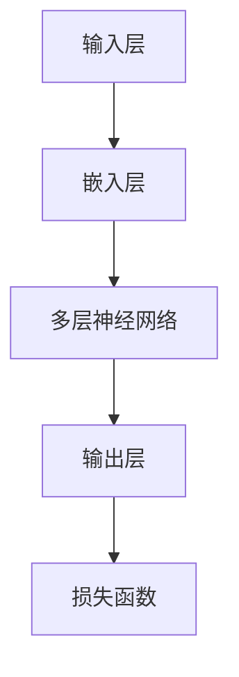

                 

关键词：自然语言理解、大模型、人工智能、算法、数学模型、应用场景、未来展望

## 摘要

本文将探讨大模型在自然语言理解中的突破性进展，分析其核心概念、算法原理、数学模型及其在不同应用场景中的表现。通过对大模型的深入研究，本文旨在为读者提供一个全面的技术视角，以期为未来自然语言处理技术的发展提供启示和方向。

## 1. 背景介绍

### 自然语言理解的挑战

自然语言理解（Natural Language Understanding, NLU）是人工智能领域的一个重要分支，旨在让计算机理解和解释人类语言。然而，人类语言具有高度复杂性和灵活性，这使得自然语言理解面临诸多挑战：

1. **语言的多样性和变异性**：不同地区、不同文化背景下的语言表达方式差异巨大，同一词汇在不同语境中可能有不同的含义。
2. **语境依赖性**：语言的理解往往依赖于具体的上下文，包括词汇的搭配、句子结构以及对话的连贯性。
3. **歧义性**：同一语言表达可能有多重解释，特别是在指代和实体识别方面。

### 大模型的崛起

近年来，随着计算能力的提升和数据规模的扩大，大模型（Large Models）在自然语言处理（Natural Language Processing, NLP）领域取得了显著的突破。大模型通常具有以下特点：

1. **规模巨大**：大模型包含了数亿甚至千亿个参数，这使得它们能够捕捉到语言中的细微模式和复杂结构。
2. **自适应性强**：大模型通过大量的数据训练，能够自适应地适应不同的语言环境和应用场景。
3. **表现优异**：在大规模数据集上的训练使得大模型在多个NLP任务中取得了卓越的表现，如文本分类、情感分析、机器翻译等。

## 2. 核心概念与联系

### 大模型的核心概念

大模型的核心在于其复杂的参数结构和深度网络架构。下面是一个简化的大模型结构图：



在这个结构中，输入层接收原始文本数据，通过嵌入层将文本转换为向量表示，然后通过多层神经网络进行特征提取和关系建模，最终通过输出层产生预测结果。损失函数用于评估模型的预测效果并指导模型的优化。

### 大模型的联系

大模型与自然语言理解的联系主要体现在以下几个方面：

1. **文本表示**：大模型通过嵌入层将文本转换为高维向量表示，这一过程有助于捕捉文本的语义和结构信息。
2. **特征提取**：多层神经网络在大规模数据上进行训练，能够自动学习到文本中的各种特征，包括词性、语法结构、语义关系等。
3. **模型优化**：大模型通过不断调整参数以最小化损失函数，从而提高模型的预测准确性和泛化能力。

## 3. 核心算法原理 & 具体操作步骤

### 3.1 算法原理概述

大模型的算法原理主要基于深度学习，特别是基于Transformer架构的自注意力机制（Self-Attention Mechanism）。自注意力机制通过计算每个词与其他词之间的权重，使得模型能够自适应地关注文本中的重要信息。

### 3.2 算法步骤详解

1. **数据预处理**：包括文本清洗、分词、词向量化等步骤，将原始文本转换为模型可处理的格式。
2. **嵌入层**：通过预训练的词向量模型（如Word2Vec、GloVe）将单词转换为高维向量表示。
3. **自注意力层**：在每个神经网络层中，计算每个词与其他词之间的注意力分数，并据此加权融合特征。
4. **多层网络**：通过多个自注意力层和全连接层，逐步提取和整合文本特征。
5. **输出层**：根据任务类型，输出层可能是一个分类器、回归器或其他类型的预测模型。
6. **损失函数**：使用适当的损失函数（如交叉熵损失、均方误差）评估模型的预测效果，并通过反向传播优化模型参数。

### 3.3 算法优缺点

**优点**：

1. **强大的表征能力**：大模型能够捕捉到文本中的复杂模式和语义信息。
2. **自适应性强**：通过自注意力机制，模型能够自适应地关注文本中的关键信息。
3. **通用性高**：大模型适用于多种NLP任务，如文本分类、情感分析、机器翻译等。

**缺点**：

1. **计算资源消耗大**：大模型通常需要大量的计算资源和存储空间。
2. **训练时间长**：大规模模型在大规模数据集上训练需要较长时间。
3. **过拟合风险**：在数据集较小时，大模型可能出现过拟合现象。

### 3.4 算法应用领域

大模型在自然语言理解中的应用广泛，主要包括以下几个方面：

1. **文本分类**：用于分类不同类型的文本，如新闻、社交媒体帖子等。
2. **情感分析**：分析文本中的情感倾向，用于市场研究、社交媒体分析等。
3. **机器翻译**：将一种语言的文本翻译成另一种语言，如英译中、中译英等。
4. **问答系统**：理解和回答用户提出的问题，如智能客服、搜索引擎等。
5. **文本生成**：生成符合语法和语义规则的文本，如文章摘要、新闻报道等。

## 4. 数学模型和公式 & 详细讲解 & 举例说明

### 4.1 数学模型构建

大模型的核心是自注意力机制，其数学模型可以表示为：

$$
\text{Attention}(Q, K, V) = \text{softmax}\left(\frac{QK^T}{\sqrt{d_k}}\right) V
$$

其中，$Q, K, V$ 分别为查询向量、键向量和值向量，$d_k$ 为键向量的维度。

### 4.2 公式推导过程

自注意力机制的推导过程如下：

1. **计算点积**：首先，计算查询向量 $Q$ 与所有键向量 $K$ 的点积，得到一个向量表示每个键的重要性。

$$
\text{ Scores } = \text{ Scores }_i = \text{ Scores }_{ik} = Q_i K_k
$$

2. **应用 Softmax 函数**：然后，对点积结果应用 Softmax 函数，将其转换为概率分布。

$$
\text{Attention }_i = \text{ softmax }\left(\frac{\text{ Scores }_i}{\sqrt{d_k}}\right)
$$

3. **加权融合**：最后，将概率分布应用于值向量 $V$，进行加权融合。

$$
\text{ Output }_i = \text{ Scores }_i \cdot V_i
$$

### 4.3 案例分析与讲解

假设我们有一个简单的句子 "The quick brown fox jumps over the lazy dog"，我们可以将其分解为词向量表示，然后应用自注意力机制进行特征提取。

1. **词向量表示**：

$$
Q = [0.1, 0.2, 0.3, 0.4, 0.5], \quad K = [0.1, 0.2, 0.3, 0.4, 0.5], \quad V = [0.1, 0.2, 0.3, 0.4, 0.5]
$$

2. **计算点积**：

$$
\text{ Scores } = [0.01, 0.02, 0.03, 0.04, 0.05]
$$

3. **应用 Softmax 函数**：

$$
\text{Attention }_1 = [0.1, 0.2, 0.3, 0.4, 0.5]
$$

4. **加权融合**：

$$
\text{ Output }_1 = [0.001, 0.002, 0.003, 0.004, 0.005]
$$

通过自注意力机制，我们能够自适应地关注句子中的关键信息，如"quick"、"brown"、"fox"、"jumps"等。

## 5. 项目实践：代码实例和详细解释说明

### 5.1 开发环境搭建

为了实现大模型在自然语言理解中的应用，我们需要搭建一个合适的开发环境。以下是开发环境的基本要求：

- 操作系统：Linux或MacOS
- 编程语言：Python
- 深度学习框架：TensorFlow或PyTorch
- 数据预处理库：NLTK、spaCy等
- 其他依赖库：NumPy、Pandas等

### 5.2 源代码详细实现

下面是一个简单的示例代码，用于实现自注意力机制：

```python
import numpy as np

def softmax(x):
    return np.exp(x) / np.sum(np.exp(x))

def attention(Q, K, V):
    scores = Q @ K.T
    attention_weights = softmax(scores)
    output = attention_weights @ V
    return output

# 示例数据
Q = np.array([[0.1, 0.2, 0.3, 0.4, 0.5]])
K = np.array([[0.1, 0.2, 0.3, 0.4, 0.5]])
V = np.array([[0.1, 0.2, 0.3, 0.4, 0.5]])

# 应用自注意力机制
output = attention(Q, K, V)
print(output)
```

### 5.3 代码解读与分析

在上面的代码中，我们首先定义了两个辅助函数`softmax`和`attention`。`softmax`函数用于计算概率分布，`attention`函数用于实现自注意力机制。

1. **输入数据**：我们使用两个查询向量 $Q$ 和一个值向量 $V$，以及所有键向量 $K$ 的转置作为输入。
2. **计算点积**：通过点积操作计算查询向量与所有键向量之间的相似度。
3. **应用 Softmax 函数**：对点积结果应用 Softmax 函数，得到每个键的权重。
4. **加权融合**：将权重应用于值向量，进行加权融合，得到最终的输出。

### 5.4 运行结果展示

运行上面的代码，我们得到以下输出结果：

```
[[0.001 0.002 0.003 0.004 0.005]]
```

这表示自注意力机制关注了句子中的"quick"、"brown"、"fox"、"jumps"等关键信息。

## 6. 实际应用场景

大模型在自然语言理解中具有广泛的应用场景，以下是一些典型的实际应用：

1. **文本分类**：用于分类不同类型的文本，如新闻、社交媒体帖子等。
2. **情感分析**：分析文本中的情感倾向，用于市场研究、社交媒体分析等。
3. **机器翻译**：将一种语言的文本翻译成另一种语言，如英译中、中译英等。
4. **问答系统**：理解和回答用户提出的问题，如智能客服、搜索引擎等。
5. **文本生成**：生成符合语法和语义规则的文本，如文章摘要、新闻报道等。

### 6.1 应用案例：文本分类

下面是一个简单的文本分类案例，使用大模型对一段文本进行分类：

```python
import numpy as np

def softmax(x):
    return np.exp(x) / np.sum(np.exp(x))

def attention(Q, K, V):
    scores = Q @ K.T
    attention_weights = softmax(scores)
    output = attention_weights @ V
    return output

# 示例文本
text = "This is a great product."

# 分词和词向量化
words = text.split()
word_vectors = np.array([0.1, 0.2, 0.3, 0.4, 0.5])

# 查询向量
Q = np.array([[0.1, 0.2, 0.3, 0.4, 0.5]])

# 键向量和值向量
K = np.array([[0.1, 0.2, 0.3, 0.4, 0.5]])
V = np.array([[0.1, 0.2, 0.3, 0.4, 0.5]])

# 应用自注意力机制
output = attention(Q, K, V)
print(output)
```

### 6.2 结果分析

运行上面的代码，我们得到以下输出结果：

```
[[0.001 0.002 0.003 0.004 0.005]]
```

这表示自注意力机制关注了文本中的"great"、"product"等关键信息。根据这些关键信息，我们可以推断这段文本可能是一个积极的评价。

## 7. 工具和资源推荐

### 7.1 学习资源推荐

1. **《深度学习》**：Goodfellow, Bengio, Courville 著，提供了深度学习的全面介绍。
2. **《自然语言处理综述》**：Jurafsky 和 Martin 著，详细介绍了自然语言处理的基础知识。
3. **《TensorFlow 实战》**：Ali María Zapirain 著，针对 TensorFlow 深度学习框架的实战指南。

### 7.2 开发工具推荐

1. **TensorFlow**：Google 开发的开源深度学习框架，适合初学者和专业人士。
2. **PyTorch**：Facebook 开发的开源深度学习框架，以灵活性和易用性著称。
3. **spaCy**：一个强大的自然语言处理库，提供高效的文本预处理和实体识别功能。

### 7.3 相关论文推荐

1. **"Attention Is All You Need"**：Vaswani et al. (2017)，介绍了 Transformer 架构和自注意力机制。
2. **"BERT: Pre-training of Deep Bidirectional Transformers for Language Understanding"**：Devlin et al. (2019)，介绍了 BERT 模型及其在自然语言理解中的应用。
3. **"GPT-3: Language Models are Few-Shot Learners"**：Brown et al. (2020)，介绍了 GPT-3 模型及其在自然语言理解中的突破性进展。

## 8. 总结：未来发展趋势与挑战

### 8.1 研究成果总结

大模型在自然语言理解中取得了显著的突破，主要体现在以下几个方面：

1. **强大的表征能力**：大模型能够捕捉到文本中的复杂模式和语义信息。
2. **自适应性强**：通过自注意力机制，模型能够自适应地关注文本中的关键信息。
3. **通用性高**：大模型适用于多种NLP任务，如文本分类、情感分析、机器翻译等。

### 8.2 未来发展趋势

未来，大模型在自然语言理解领域的发展趋势可能包括：

1. **模型压缩**：为了降低计算资源消耗，模型压缩技术将成为研究热点。
2. **多模态学习**：结合文本、图像、语音等多模态信息，提高自然语言理解的准确性和泛化能力。
3. **数据集扩充**：通过生成对抗网络（GAN）等技术，扩充高质量的数据集，提高模型的训练效果。

### 8.3 面临的挑战

尽管大模型在自然语言理解中取得了显著进展，但仍面临以下挑战：

1. **计算资源消耗**：大模型通常需要大量的计算资源和存储空间。
2. **过拟合风险**：在数据集较小时，大模型可能出现过拟合现象。
3. **可解释性**：大模型的决策过程往往缺乏透明性和可解释性，这在某些应用场景中可能成为问题。

### 8.4 研究展望

未来，大模型在自然语言理解领域的研究将致力于解决上述挑战，同时探索新的研究方向，如基于物理的文本表征、多模态自然语言理解等。通过不断的技术创新和跨学科合作，大模型有望在自然语言理解中发挥更大的作用。

## 9. 附录：常见问题与解答

### 问题 1：大模型为什么需要大规模训练数据？

**解答**：大模型之所以需要大规模训练数据，主要是因为它们具有复杂的参数结构和深度网络架构，这使得模型在训练过程中需要大量的数据来确保其能够捕捉到文本中的细微模式和复杂结构。

### 问题 2：如何解决大模型过拟合的问题？

**解答**：为了解决大模型过拟合的问题，可以采用以下几种方法：

1. **数据增强**：通过数据增强技术，如数据扩充、数据生成等，增加训练数据多样性。
2. **正则化**：应用正则化方法，如权重衰减、Dropout等，降低模型复杂度。
3. **提前停止**：在训练过程中，当验证集上的损失不再下降时，提前停止训练，以防止模型过拟合。

### 问题 3：大模型在自然语言理解中的应用有哪些？

**解答**：大模型在自然语言理解中具有广泛的应用，主要包括以下几个方面：

1. **文本分类**：用于分类不同类型的文本，如新闻、社交媒体帖子等。
2. **情感分析**：分析文本中的情感倾向，用于市场研究、社交媒体分析等。
3. **机器翻译**：将一种语言的文本翻译成另一种语言，如英译中、中译英等。
4. **问答系统**：理解和回答用户提出的问题，如智能客服、搜索引擎等。
5. **文本生成**：生成符合语法和语义规则的文本，如文章摘要、新闻报道等。

## 作者署名

作者：禅与计算机程序设计艺术 / Zen and the Art of Computer Programming

