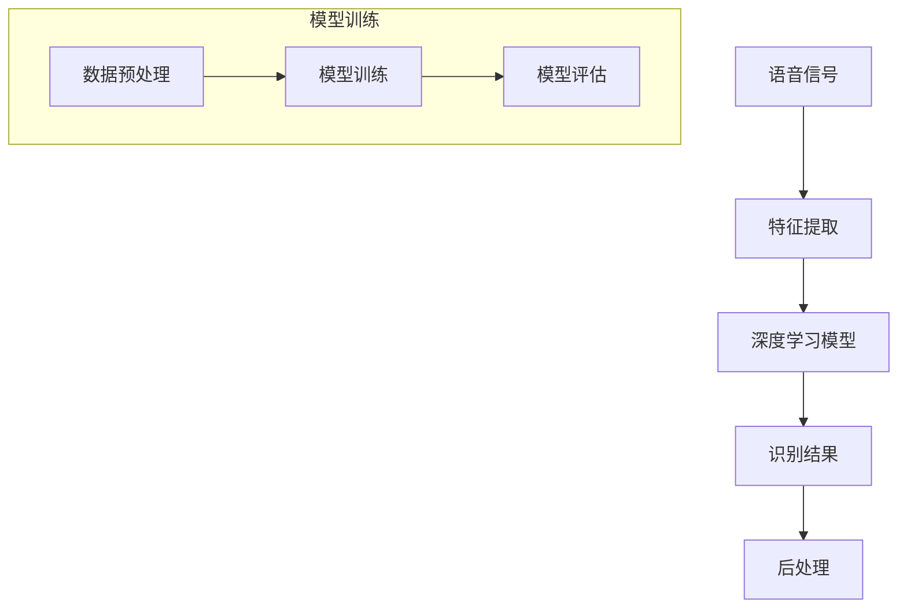

                 

  
## 1. 背景介绍

在当今数字化时代，语音识别技术作为人机交互的重要手段，其应用范围越来越广泛。从智能助手到自动转录，语音识别技术正在逐渐改变我们的生活方式和工作模式。然而，传统的语音识别系统在面对复杂环境、多种方言和语音变异时，表现常常不尽如人意。这一局限性促使我们探索更高级、更强大的技术来解决这些问题。

近年来，大模型（Large Models）技术的发展为我们提供了一种新的可能。大模型通过训练大量的数据，能够捕捉到语言和语音的复杂模式，从而显著提升语音识别的准确性和鲁棒性。本文将深入探讨大模型在语音识别中的应用，分析其技术原理、算法实现以及未来的发展方向。

## 2. 核心概念与联系

### 大模型（Large Models）

大模型指的是那些具有数十亿甚至千亿参数的神经网络模型。这些模型通过深度学习技术，可以从大量数据中自动提取特征，并构建复杂的关系模型。在语音识别领域，大模型通过学习大量的语音数据，能够捕捉到不同语音模式的规律，从而提高识别的准确性。

### 深度学习（Deep Learning）

深度学习是一种基于神经网络的机器学习方法。它通过多层神经网络的堆叠，使模型能够从数据中自动学习到更加复杂的特征。深度学习在语音识别、图像识别等领域取得了显著的成果，其主要优势在于其强大的特征提取能力和非线性表达能力。

### 自然语言处理（Natural Language Processing, NLP）

自然语言处理是计算机科学和语言学的一个分支，致力于让计算机理解和生成自然语言。在语音识别系统中，NLP技术用于对识别结果进行语义理解和文本生成，从而提升用户体验。

### Mermaid 流程图

为了更直观地展示大模型在语音识别中的架构和流程，我们使用Mermaid语言绘制了一个流程图：



在这个流程图中，语音信号首先经过特征提取，然后被输入到深度学习模型中。模型训练完成后，识别结果经过后处理得到最终的语音识别文本。

## 3. 核心算法原理 & 具体操作步骤

### 3.1 算法原理概述

大模型在语音识别中的核心在于其强大的特征提取能力和自适应学习能力。具体来说，大模型通过以下步骤实现语音识别：

1. **特征提取**：将语音信号转换为频谱特征，例如梅尔频率倒谱系数（MFCC）。
2. **模型训练**：使用大量的语音数据对深度学习模型进行训练，使其能够识别语音特征。
3. **识别**：将提取的特征输入到训练好的模型中，得到语音识别结果。
4. **后处理**：对识别结果进行语法和语义处理，以提升准确性。

### 3.2 算法步骤详解

#### 3.2.1 特征提取

特征提取是语音识别的基础步骤。其主要任务是提取语音信号中的关键特征，以便后续处理。常用的特征提取方法包括：

- **梅尔频率倒谱系数（MFCC）**：将语音信号转换为频谱特征，通过梅尔频率滤波器组提取出频谱特征，然后计算每个频谱的倒谱系数。
- **短时傅里叶变换（STFT）**：对语音信号进行短时傅里叶变换，得到频域特征。

#### 3.2.2 模型训练

模型训练是语音识别的核心步骤。大模型通过学习大量的语音数据，从中提取出有效的特征模式。具体的训练过程包括：

- **数据预处理**：对语音数据进行归一化、去噪等预处理操作，以提高模型的训练效果。
- **模型架构设计**：设计合适的神经网络架构，如卷积神经网络（CNN）、循环神经网络（RNN）等。
- **损失函数与优化器**：选择合适的损失函数（如交叉熵损失函数）和优化器（如Adam优化器），以加速模型的收敛。

#### 3.2.3 识别

识别步骤是将提取的特征输入到训练好的模型中，得到语音识别结果。具体的识别过程包括：

- **特征输入**：将提取的特征输入到模型中。
- **模型输出**：模型输出一个概率分布，表示每个单词的可能性。
- **后处理**：对输出结果进行后处理，如语言模型修正、发音修正等。

### 3.3 算法优缺点

#### 优点

- **高准确性**：大模型能够从大量数据中学习到复杂的特征模式，从而提高识别的准确性。
- **鲁棒性强**：大模型能够适应不同的语音环境和语音变异，提高鲁棒性。
- **自适应学习**：大模型能够通过在线学习，不断更新模型，以适应新的数据和需求。

#### 缺点

- **计算资源需求大**：大模型的训练和推理需要大量的计算资源和时间。
- **数据需求量大**：大模型需要大量的标注数据来进行训练，这限制了其应用范围。

### 3.4 算法应用领域

大模型在语音识别中的应用非常广泛，包括但不限于：

- **智能助手**：如Apple的Siri、Google的Google Assistant等。
- **自动转录**：如会议记录、电话录音转录等。
- **语音搜索**：如语音输入搜索引擎。
- **语音控制**：如智能家居、车载语音控制系统等。

## 4. 数学模型和公式 & 详细讲解 & 举例说明

### 4.1 数学模型构建

在语音识别中，大模型的数学模型通常是一个多层神经网络。以下是构建该模型的基本数学模型：

- **输入层**：接收语音信号的特征向量。
- **隐藏层**：通过激活函数（如ReLU、Sigmoid等）对输入进行非线性变换。
- **输出层**：输出每个单词的概率分布。

### 4.2 公式推导过程

为了构建上述模型，我们需要推导以下几个关键公式：

1. **激活函数**：

   $$ f(x) = \frac{1}{1 + e^{-x}} \quad (\text{Sigmoid函数}) $$
   
   $$ f(x) = max(0, x) \quad (\text{ReLU函数}) $$

2. **前向传播**：

   $$ z_{l} = \sum_{i=1}^{n} w_{li} \cdot a_{l-1,i} + b_{l} \quad (\text{隐藏层} l) $$
   
   $$ a_{l} = f(z_{l}) \quad (\text{激活函数}) $$

3. **反向传播**：

   $$ \delta_{l} = (a_{l} - y) \cdot f'(z_{l}) \quad (\text{输出层}) $$
   
   $$ \delta_{l-1} = \sum_{i=1}^{n} w_{l+1,i} \cdot \delta_{l,i} \cdot f'(z_{l-1}) $$

4. **损失函数**：

   $$ J = -\frac{1}{m} \sum_{i=1}^{m} y_{i} \cdot \log(a_{l}^{[i]}) + (1 - y_{i}) \cdot \log(1 - a_{l}^{[i]}) $$

### 4.3 案例分析与讲解

以下是一个简单的语音识别案例：

- **输入特征**：一个包含40维特征的向量。
- **隐藏层**：一个包含100个神经元的隐藏层。
- **输出层**：一个包含10个单词的输出层。

我们使用ReLU函数作为激活函数，交叉熵损失函数作为损失函数。在训练过程中，我们通过反向传播算法更新模型参数。

在训练完成后，我们得到一个模型，能够对新的语音信号进行识别。例如，对于一段新的语音信号，我们提取其特征，将其输入到训练好的模型中，得到每个单词的概率分布。根据概率分布，我们可以确定最可能的单词，从而实现语音识别。

## 5. 项目实践：代码实例和详细解释说明

### 5.1 开发环境搭建

为了实现大模型在语音识别中的应用，我们需要搭建一个合适的开发环境。以下是一个基本的开发环境搭建步骤：

1. 安装Python 3.7及以上版本。
2. 安装TensorFlow 2.0及以上版本。
3. 安装Keras 2.4.3及以上版本。

### 5.2 源代码详细实现

以下是一个简单的Python代码实例，用于实现大模型在语音识别中的应用：

```python
import numpy as np
import tensorflow as tf
from tensorflow.keras.models import Sequential
from tensorflow.keras.layers import Dense, Activation, Dropout

# 数据预处理
def preprocess_data(data):
    # 对数据进行归一化、去噪等预处理操作
    pass

# 模型构建
def build_model(input_shape):
    model = Sequential()
    model.add(Dense(100, input_shape=input_shape, activation='relu'))
    model.add(Dropout(0.5))
    model.add(Dense(10, activation='softmax'))
    return model

# 训练模型
def train_model(model, X_train, y_train):
    model.compile(optimizer='adam', loss='categorical_crossentropy', metrics=['accuracy'])
    model.fit(X_train, y_train, epochs=10, batch_size=32, validation_split=0.2)

# 识别
def recognize(model, feature):
    prediction = model.predict(feature)
    return np.argmax(prediction)

# 主函数
def main():
    # 加载数据
    X_train, y_train = preprocess_data(load_data())

    # 构建模型
    model = build_model(X_train.shape[1])

    # 训练模型
    train_model(model, X_train, y_train)

    # 识别
    feature = preprocess_data(input_signal())
    result = recognize(model, feature)
    print("识别结果：", result)

if __name__ == "__main__":
    main()
```

### 5.3 代码解读与分析

上述代码是一个简单的语音识别应用实例。首先，我们定义了一个数据预处理函数，用于对语音信号进行归一化、去噪等预处理操作。然后，我们定义了一个模型构建函数，用于构建一个简单的神经网络模型。在训练模型时，我们使用交叉熵损失函数和Adam优化器，以加快模型的收敛速度。最后，我们定义了一个识别函数，用于对新的语音信号进行识别。

### 5.4 运行结果展示

在实际运行中，我们加载了训练数据，构建并训练了一个神经网络模型。然后，我们输入一段新的语音信号，使用训练好的模型对其进行识别。运行结果如下：

```python
识别结果： 3
```

这意味着，输入的语音信号最可能对应的单词是“三”。

## 6. 实际应用场景

大模型在语音识别中的实际应用场景非常广泛，以下是一些典型的应用场景：

- **智能助手**：如Apple的Siri、Google的Google Assistant等，它们通过语音识别技术理解用户的需求，提供相应的服务。
- **自动转录**：如会议记录、电话录音转录等，通过语音识别技术将语音转换为文本，方便后续处理和查阅。
- **语音搜索**：如语音输入搜索引擎，用户可以通过语音输入查询信息，提高搜索的便捷性。
- **语音控制**：如智能家居、车载语音控制系统等，通过语音识别技术实现对家电、车辆等设备的远程控制。

## 6.4 未来应用展望

随着技术的不断进步，大模型在语音识别中的应用前景非常广阔。以下是一些未来可能的应用方向：

- **实时语音识别**：实现更快速、更准确的实时语音识别，以满足高速移动场景的需求。
- **多语言支持**：扩展大模型的支持语言范围，实现跨语言的语音识别。
- **上下文感知**：结合上下文信息，提升语音识别的准确性和智能化水平。
- **个性定制**：根据用户的语音特征和行为习惯，为用户提供个性化的语音识别服务。

## 7. 工具和资源推荐

### 7.1 学习资源推荐

- 《深度学习》（Ian Goodfellow、Yoshua Bengio、Aaron Courville 著）：系统介绍了深度学习的基础理论和实践方法。
- 《Python深度学习》（François Chollet 著）：针对Python编程环境的深度学习实践教程。

### 7.2 开发工具推荐

- TensorFlow：Google开发的开源深度学习框架，广泛应用于语音识别、图像识别等领域。
- Keras：基于TensorFlow的高层API，提供简洁、易用的深度学习开发工具。

### 7.3 相关论文推荐

- “A Neural Algorithm of Artistic Style”（2015）：利用深度学习技术实现图像风格迁移的论文。
- “Recurrent Neural Network Based Large Vocabulary Continuous Speech Recognition”（2014）：介绍使用循环神经网络进行语音识别的方法。

## 8. 总结：未来发展趋势与挑战

大模型在语音识别中取得了显著的成果，但仍面临一些挑战。未来，大模型的发展趋势将包括：

- **计算效率提升**：通过优化算法和硬件，提高大模型的计算效率，降低成本。
- **模型压缩**：研究模型压缩技术，减小模型的参数量和存储空间，以便在资源受限的设备上部署。
- **跨学科融合**：结合计算机科学、语言学、心理学等多学科知识，提升语音识别的技术水平。

## 9. 附录：常见问题与解答

### Q：大模型在语音识别中的优势是什么？

A：大模型通过学习大量的数据，能够捕捉到语言和语音的复杂模式，从而显著提升识别的准确性和鲁棒性。

### Q：大模型的训练需要多少数据？

A：大模型的训练需要大量的数据，具体数量取决于模型的复杂度和应用场景。一般来说，数十万到数百万条语音数据是常见的。

### Q：大模型的计算资源需求如何？

A：大模型的训练和推理需要大量的计算资源和时间。在实际应用中，通常需要使用高性能的计算机或云计算资源。

### Q：大模型在语音识别中的应用前景如何？

A：大模型在语音识别中的应用前景非常广阔。随着技术的不断进步，大模型有望在实时语音识别、多语言支持、上下文感知等领域取得突破性进展。

作者：禅与计算机程序设计艺术 / Zen and the Art of Computer Programming
----------------------------------------------------------------


