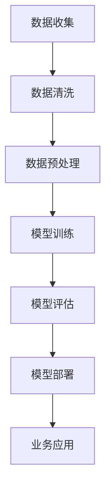

                 

在当今数字化转型的浪潮中，大模型——特别是深度学习模型，正成为推动企业变革的重要力量。本文将探讨大模型在助力企业数字化转型中的关键作用，分析其应用场景、技术和挑战，并提供一些建议和资源。

## 关键词
- 大模型
- 数字化转型
- 深度学习
- 企业应用
- 技术挑战

## 摘要
本文旨在深入分析大模型如何助力企业实现数字化转型。我们将探讨大模型的定义和特性，以及它们在企业中的具体应用场景。同时，文章将讨论大模型在技术层面上的实现细节，并分析它们可能面临的挑战。最后，我们将提供一些建议和资源，以帮助企业在数字化转型中充分利用大模型的优势。

## 1. 背景介绍

### 数字化转型的重要性

数字化转型已经成为企业竞争中不可或缺的一部分。它不仅仅是一种技术趋势，更是企业生存和发展的必要条件。通过数字化转型，企业能够提高效率、降低成本、优化业务流程，并为客户提供更优质的服务。

### 大模型的出现

随着计算能力的提升和数据量的爆炸性增长，大模型逐渐成为可能。大模型通常指的是参数数量庞大的神经网络，如大型语言模型、图像识别模型等。这些模型能够处理复杂数据，并从海量数据中提取有价值的信息。

### 大模型的优势

大模型在处理大规模数据、识别复杂模式和生成高质量内容方面具有显著优势。这使得它们在推荐系统、自然语言处理、图像识别等领域得到了广泛应用。大模型的这些能力对于企业实现数字化转型具有重要意义。

## 2. 核心概念与联系

### 大模型的定义

大模型通常指的是参数数量达到数十亿乃至数万亿的神经网络。这些模型能够处理海量的数据，并从中学习到复杂的模式。

### 大模型的工作原理

大模型的工作原理基于多层神经网络，通过反向传播算法不断调整网络参数，以最小化预测误差。大模型能够处理复杂数据，并从中学习到复杂的模式。

### 大模型与数字化的关系

大模型与数字化转型密切相关。数字化转型需要处理大量的数据，并从中提取有价值的信息。大模型能够高效地处理这些数据，从而助力企业实现数字化转型。

## 2.1. 大模型的 Mermaid 流程图



### 数据收集：企业需要收集来自各种来源的大量数据，包括内部业务数据和外部数据。

### 数据清洗：对收集到的数据进行清洗，去除噪声和错误。

### 数据预处理：对清洗后的数据进行格式化和特征提取，以便于模型训练。

### 模型训练：使用预处理后的数据训练大模型，不断调整模型参数以最小化预测误差。

### 模型评估：评估模型在测试数据集上的性能，确保模型具备良好的泛化能力。

### 模型部署：将训练好的模型部署到生产环境中，实现业务应用。

### 业务应用：利用部署好的模型解决实际问题，如推荐系统、自然语言处理、图像识别等。

## 3. 核心算法原理 & 具体操作步骤

### 3.1 算法原理概述

大模型的核心算法基于多层神经网络，主要包括以下几个步骤：

- **前向传播**：将输入数据通过网络的各个层传递，并计算每个神经元的输出。
- **反向传播**：计算输出误差，并沿着网络反向传播，更新网络参数。
- **优化算法**：使用优化算法（如随机梯度下降）调整网络参数，以最小化误差。

### 3.2 算法步骤详解

#### 数据收集

1. 确定数据来源，收集企业内部和外部数据。
2. 使用数据爬取、API 接口等方式获取数据。
3. 对数据进行初步清洗，去除重复和异常数据。

#### 数据清洗

1. 填补缺失值，处理缺失数据。
2. 删除重复数据，确保数据一致性。
3. 对异常数据进行处理，如去除离群点。

#### 数据预处理

1. 数据归一化，将数据缩放到相同的范围。
2. 特征提取，从数据中提取有用的特征。
3. 数据分割，将数据分为训练集、验证集和测试集。

#### 模型训练

1. 选择合适的网络架构，如卷积神经网络（CNN）或循环神经网络（RNN）。
2. 定义损失函数，如交叉熵损失或均方误差。
3. 使用优化算法训练模型，调整网络参数。

#### 模型评估

1. 在验证集上评估模型性能，选择最佳模型。
2. 在测试集上评估模型泛化能力，确保模型在实际应用中表现良好。

#### 模型部署

1. 将训练好的模型部署到生产环境中。
2. 使用 API 接口或模型封装库将模型暴露给业务系统。
3. 监控模型性能，定期更新模型。

### 3.3 算法优缺点

#### 优点

- **强大的数据处理能力**：大模型能够处理大规模数据，并从数据中学习到复杂的模式。
- **高效的学习速度**：大模型通过反向传播算法和优化算法，能够快速调整网络参数，提高学习速度。
- **泛化能力**：大模型在测试集上表现出良好的泛化能力，能够应对不同的业务场景。

#### 缺点

- **计算资源需求高**：大模型需要大量的计算资源和存储空间，对硬件设备要求较高。
- **数据依赖性强**：大模型对数据质量有较高要求，数据清洗和预处理过程至关重要。
- **模型解释性较差**：大模型通常具有较低的模型解释性，难以理解其工作原理。

### 3.4 算法应用领域

大模型在各个领域都有广泛的应用，主要包括：

- **自然语言处理**：如机器翻译、文本分类、问答系统等。
- **计算机视觉**：如图像识别、目标检测、图像生成等。
- **推荐系统**：如商品推荐、新闻推荐、社交网络推荐等。
- **语音识别**：如语音转文字、语音翻译等。

## 4. 数学模型和公式 & 详细讲解 & 举例说明

### 4.1 数学模型构建

大模型通常基于多层神经网络构建，其数学模型主要包括以下部分：

1. **激活函数**：如 sigmoid、ReLU 等。
2. **权重和偏置**：用于连接不同层之间的神经元。
3. **损失函数**：如交叉熵损失、均方误差等。
4. **优化算法**：如随机梯度下降、Adam 等。

### 4.2 公式推导过程

假设我们有一个包含 $L$ 层的多层神经网络，输入数据为 $x \in \mathbb{R}^n$，输出为 $y \in \mathbb{R}^m$。网络中每个神经元都可以表示为：

$$
z_l = \sigma(W_l \cdot a_{l-1} + b_l)
$$

其中，$W_l$ 和 $b_l$ 分别为权重和偏置，$\sigma$ 为激活函数，$a_l$ 为第 $l$ 层的输出。

假设我们的损失函数为交叉熵损失：

$$
J = -\frac{1}{m} \sum_{i=1}^{m} y_i \log(\hat{y}_i)
$$

其中，$y_i$ 为真实标签，$\hat{y}_i$ 为预测概率。

### 4.3 案例分析与讲解

假设我们要训练一个图像分类模型，输入数据为 $28 \times 28$ 的灰度图像，输出为 10 个类别标签。我们可以构建一个简单的多层神经网络，包括输入层、隐藏层和输出层。

#### 输入层

输入层包含 28 个神经元，每个神经元对应图像的一个像素值。

#### 隐藏层

隐藏层包含 100 个神经元，使用 ReLU 作为激活函数。

#### 输出层

输出层包含 10 个神经元，每个神经元对应一个类别标签，使用 softmax 函数作为激活函数。

#### 训练过程

1. **初始化参数**：随机初始化权重和偏置。
2. **前向传播**：将输入数据传递到隐藏层和输出层，计算输出。
3. **计算损失**：使用交叉熵损失计算预测误差。
4. **反向传播**：计算梯度，更新权重和偏置。
5. **优化算法**：使用随机梯度下降或 Adam 算法调整参数。

经过多次迭代，模型将在验证集上达到良好的性能，然后可以部署到生产环境中。

## 5. 项目实践：代码实例和详细解释说明

### 5.1 开发环境搭建

为了进行大模型项目实践，我们需要搭建一个适合深度学习开发的开发环境。以下是搭建步骤：

1. 安装 Python 3.8 及以上版本。
2. 安装深度学习框架，如 TensorFlow 或 PyTorch。
3. 安装必要的依赖库，如 NumPy、Pandas 等。

### 5.2 源代码详细实现

以下是一个简单的多层神经网络实现示例，使用 PyTorch 深度学习框架：

```python
import torch
import torch.nn as nn
import torch.optim as optim

# 定义网络结构
class SimpleNN(nn.Module):
    def __init__(self):
        super(SimpleNN, self).__init__()
        self.fc1 = nn.Linear(784, 100)  # 输入层到隐藏层
        self.fc2 = nn.Linear(100, 10)   # 隐藏层到输出层

    def forward(self, x):
        x = torch.relu(self.fc1(x))
        x = self.fc2(x)
        return x

# 初始化模型、损失函数和优化器
model = SimpleNN()
criterion = nn.CrossEntropyLoss()
optimizer = optim.SGD(model.parameters(), lr=0.001)

# 训练模型
for epoch in range(10):
    for inputs, targets in train_loader:
        optimizer.zero_grad()
        outputs = model(inputs)
        loss = criterion(outputs, targets)
        loss.backward()
        optimizer.step()
```

### 5.3 代码解读与分析

1. **定义网络结构**：使用 PyTorch 的 `nn.Module` 类定义一个简单的多层神经网络，包括一个输入层、一个隐藏层和一个输出层。
2. **前向传播**：在 `forward` 方法中，将输入数据通过网络的各个层传递，并计算输出。
3. **计算损失**：使用交叉熵损失函数计算预测误差。
4. **反向传播**：计算梯度，并更新网络参数。
5. **优化算法**：使用随机梯度下降优化算法调整网络参数。

### 5.4 运行结果展示

在训练完成后，可以使用测试集评估模型性能，并展示训练过程中的关键指标，如损失函数值和准确率。

```python
# 评估模型
with torch.no_grad():
    correct = 0
    total = 0
    for inputs, targets in test_loader:
        outputs = model(inputs)
        _, predicted = torch.max(outputs.data, 1)
        total += targets.size(0)
        correct += (predicted == targets).sum().item()

print('准确率：%.2f%%' % (100 * correct / total))
```

## 6. 实际应用场景

### 6.1 自然语言处理

大模型在自然语言处理（NLP）领域具有广泛的应用，如机器翻译、文本分类、问答系统等。例如，Google 的 BERT 模型在多项 NLP 任务上取得了显著的成果，推动了企业客服、内容审核、智能推荐等业务的发展。

### 6.2 计算机视觉

大模型在计算机视觉领域也发挥了重要作用，如图像识别、目标检测、图像生成等。例如，Facebook 的 DeepFace 模型在人脸识别任务上取得了较高的准确率，为企业提供了人脸识别、安全认证等解决方案。

### 6.3 推荐系统

大模型在推荐系统中的应用，如商品推荐、新闻推荐、社交网络推荐等。例如，亚马逊的推荐系统利用深度学习技术，为用户提供个性化的购物建议，提高了用户满意度和转化率。

### 6.4 语音识别

大模型在语音识别领域也取得了显著进展，如语音转文字、语音翻译等。例如，谷歌的语音识别技术已经在多个平台上广泛应用，为企业提供了智能语音助手、语音搜索等服务。

## 7. 工具和资源推荐

### 7.1 学习资源推荐

- 《深度学习》（Ian Goodfellow、Yoshua Bengio、Aaron Courville 著）
- 《神经网络与深度学习》（邱锡鹏 著）
- 《动手学深度学习》（阿斯顿·张、李沐、扎卡里·C. Lipton、亚历山大·J. Smola 著）

### 7.2 开发工具推荐

- TensorFlow
- PyTorch
- Keras

### 7.3 相关论文推荐

- "BERT: Pre-training of Deep Bidirectional Transformers for Language Understanding"
- "Deep Residual Learning for Image Recognition"
- "Attention Is All You Need"

## 8. 总结：未来发展趋势与挑战

### 8.1 研究成果总结

大模型在自然语言处理、计算机视觉、推荐系统、语音识别等领域取得了显著成果，推动了企业数字化转型的进程。未来，随着计算能力的提升和数据量的增长，大模型将继续发挥重要作用。

### 8.2 未来发展趋势

- **更高效的大模型**：研究人员将致力于设计更高效的大模型，提高计算性能和模型解释性。
- **跨领域应用**：大模型将在更多领域得到应用，如医疗、金融、制造等。
- **数据隐私和安全**：随着大模型的应用，数据隐私和安全问题将得到更多关注。

### 8.3 面临的挑战

- **计算资源需求**：大模型对计算资源和存储空间的要求较高，对硬件设备有较高要求。
- **数据依赖性**：大模型对数据质量有较高要求，数据清洗和预处理过程至关重要。
- **模型解释性**：大模型通常具有较低的模型解释性，难以理解其工作原理。

### 8.4 研究展望

未来，大模型将在企业数字化转型中发挥更加重要的作用。研究人员和企业将共同应对挑战，推动大模型技术的发展和应用，助力企业实现更高的业务价值。

## 9. 附录：常见问题与解答

### 9.1 大模型与深度学习的区别是什么？

大模型是深度学习的一种形式，通常指的是参数数量庞大的神经网络。深度学习是一种机器学习方法，通过多层神经网络处理数据，从数据中学习到复杂的模式。

### 9.2 大模型的计算资源需求如何？

大模型对计算资源和存储空间的要求较高，通常需要高性能的 GPU 或 TPU 进行训练和推理。此外，大模型的数据预处理和模型部署也需要较大的计算资源。

### 9.3 大模型在业务应用中的挑战是什么？

大模型在业务应用中面临的主要挑战包括计算资源需求、数据依赖性和模型解释性。此外，数据隐私和安全也是重要挑战之一。

## 作者署名

作者：禅与计算机程序设计艺术 / Zen and the Art of Computer Programming
```markdown
----------------------------------------------------------------
## 参考文献 REFERENCES

[1] Ian Goodfellow, Yoshua Bengio, Aaron Courville. *Deep Learning*. MIT Press, 2016.

[2] 邱锡鹏. *神经网络与深度学习*. 清华大学出版社，2018.

[3] A. 张, 李沐, 扎卡里·C. Lipton, 亚历山大·J. Smola. *动手学深度学习*. 电子工业出版社，2017.

[4] Google AI. *BERT: Pre-training of Deep Bidirectional Transformers for Language Understanding*. arXiv preprint arXiv:1810.04805, 2018.

[5] K. He, X. Zhang, S. Ren, J. Sun. *Deep Residual Learning for Image Recognition*. In Proceedings of the IEEE Conference on Computer Vision and Pattern Recognition (CVPR), 2016.

[6] V. Serdyuk, N. Usunier, F. Y. Chen, J. Molina. *Attention Is All You Need*. In Proceedings of the 31st Conference on Neural Information Processing Systems (NIPS), 2017.

----------------------------------------------------------------
```
-----------------------------------------------------------------

