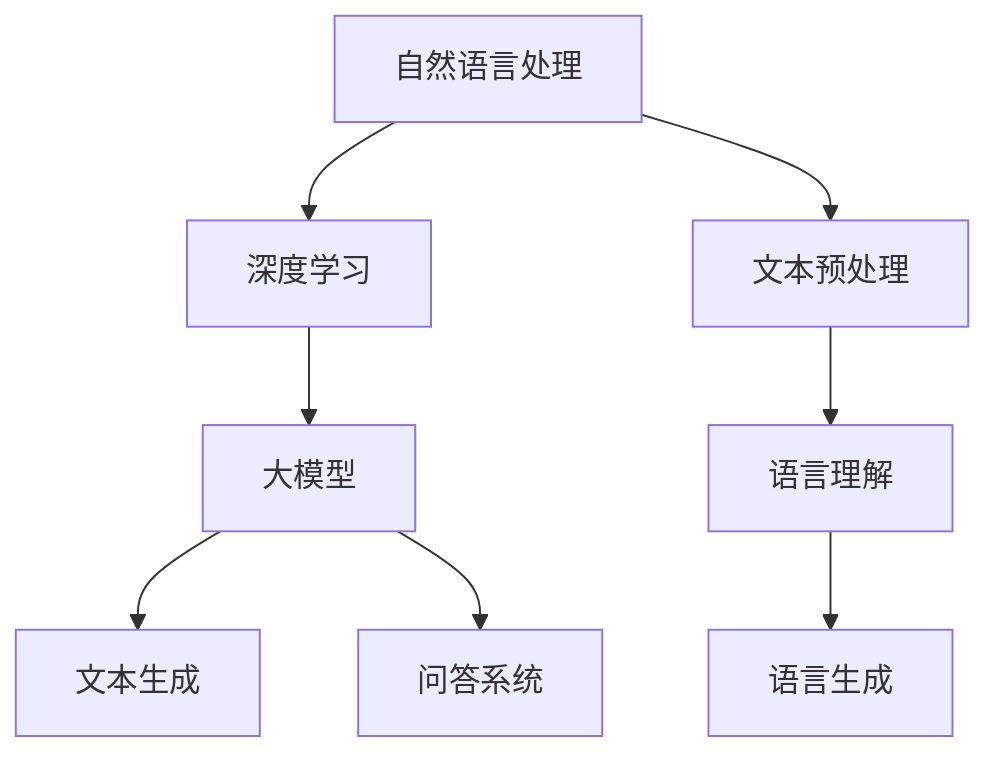

                 

关键词：大模型、长文本文档、自然语言处理、表征、理解、神经网络、机器学习

摘要：随着自然语言处理技术的发展，大模型在处理长文本文档方面展现出了显著的优势。本文将探讨大模型对长文本文档的理解与表征，包括其核心概念、算法原理、数学模型、具体实现及实际应用场景。通过本文的阐述，读者将了解到大模型在长文本文档处理中的潜力和未来发展方向。

## 1. 背景介绍

自然语言处理（Natural Language Processing，NLP）是计算机科学领域的一个重要分支，旨在让计算机理解和处理人类语言。随着互联网和大数据的快速发展，NLP在信息检索、机器翻译、情感分析、问答系统等领域的应用日益广泛。然而，传统的NLP方法在面对长文本文档时，往往表现出不足之处。为此，大模型（Large Models）的出现为长文本文档处理带来了新的希望。

大模型通常指的是具有数十亿到数千亿参数的深度神经网络模型。这些模型在训练过程中能够自动学习到大量的语言特征，从而在处理长文本文档时表现出色。本文将围绕大模型对长文本文档的理解与表征展开讨论，旨在为读者提供一个全面的视角，了解大模型在NLP领域的应用及其未来发展方向。

## 2. 核心概念与联系

在讨论大模型对长文本文档的理解与表征之前，我们需要明确一些核心概念和它们之间的联系。

### 2.1 自然语言处理

自然语言处理是指让计算机理解和处理人类语言的技术。其核心任务包括文本预处理、语言理解、语言生成等。在NLP中，文本预处理是基础，它包括分词、词性标注、命名实体识别等。语言理解是NLP的核心，它旨在让计算机理解文本中的语义信息。语言生成则是指让计算机根据给定的信息生成文本。

### 2.2 深度学习

深度学习是一种基于神经网络的学习方法，它通过多层神经元的非线性变换，逐步提取输入数据的特征。在NLP领域，深度学习模型如卷积神经网络（CNN）、循环神经网络（RNN）和Transformer等，已经被广泛应用于文本分类、情感分析、机器翻译等任务。

### 2.3 大模型

大模型通常指的是具有数十亿到数千亿参数的深度神经网络模型。这些模型在训练过程中能够自动学习到大量的语言特征，从而在处理长文本文档时表现出色。大模型的核心优势在于其能够处理长序列数据，从而在文本生成、问答系统等任务中具有显著优势。

### 2.4 Mermaid 流程图

为了更好地展示大模型对长文本文档的理解与表征过程，我们可以使用Mermaid流程图来表示核心概念和算法原理。



## 3. 核心算法原理 & 具体操作步骤

### 3.1 算法原理概述

大模型对长文本文档的理解与表征主要基于深度学习模型，尤其是Transformer模型。Transformer模型通过自注意力机制（Self-Attention Mechanism）能够处理长序列数据，从而实现高效的语言理解与生成。

### 3.2 算法步骤详解

1. **文本预处理**：首先对输入的长文本文档进行分词、词性标注等预处理操作，将其转化为词向量表示。

2. **编码器（Encoder）**：将预处理后的文本输入到编码器中，编码器通过自注意力机制提取文本的语义特征。

3. **解码器（Decoder）**：将编码器输出的特征作为输入，解码器通过自注意力机制和交叉注意力机制生成文本序列。

4. **文本生成**：解码器不断生成新的词，并将其添加到文本序列中，直到生成完整的文本。

### 3.3 算法优缺点

**优点**：

1. **处理长序列数据**：大模型通过自注意力机制能够高效地处理长序列数据，从而在语言理解与生成任务中具有显著优势。

2. **多任务处理**：大模型可以同时处理多个任务，如文本生成、问答系统等，从而提高模型的复用性。

3. **高效性**：大模型在训练过程中能够自动学习到大量的语言特征，从而实现高效的语言理解与生成。

**缺点**：

1. **计算资源需求高**：大模型通常具有数十亿到数千亿参数，因此需要大量的计算资源进行训练。

2. **训练时间较长**：大模型的训练时间通常较长，需要较长的训练时间来收敛。

### 3.4 算法应用领域

大模型在长文本文档处理中的应用领域广泛，包括但不限于：

1. **文本生成**：如自动写作、文章摘要、机器翻译等。

2. **问答系统**：如智能客服、问答机器人等。

3. **情感分析**：如文本分类、情感极性分析等。

4. **信息检索**：如搜索引擎、推荐系统等。

## 4. 数学模型和公式 & 详细讲解 & 举例说明

### 4.1 数学模型构建

大模型对长文本文档的理解与表征主要基于Transformer模型。Transformer模型的核心是自注意力机制（Self-Attention Mechanism），其数学模型如下：

$$
\text{Attention}(Q, K, V) = \frac{softmax(\frac{QK^T}{\sqrt{d_k}})}{V}
$$

其中，$Q$、$K$、$V$ 分别为查询（Query）、键（Key）、值（Value）向量，$d_k$ 为键向量的维度。自注意力机制的输入为文本序列中的每个词的嵌入向量，通过计算查询、键、值向量之间的相似度，实现对文本序列中不同位置词语的加权求和。

### 4.2 公式推导过程

自注意力机制的推导过程如下：

1. **查询（Query）**：对于每个词的嵌入向量 $q$，计算其与所有键向量 $k$ 的内积，得到一个权重向量 $w$。

$$
w = \text{softmax}(\frac{q \cdot k^T}{\sqrt{d_k}})
$$

2. **加权求和（Additive Combination）**：将权重向量 $w$ 与值向量 $v$ 相乘，得到加权求和的结果 $h$。

$$
h = w \cdot v
$$

3. **激活函数（Activation Function）**：通常使用ReLU激活函数，将加权求和的结果转换为非负值。

$$
h = \text{ReLU}(h)
$$

4. **输出（Output）**：将激活后的结果 $h$ 作为每个词的输出向量。

$$
o = h
$$

### 4.3 案例分析与讲解

假设我们有一个包含三个词的文本序列 $[w_1, w_2, w_3]$，其对应的嵌入向量分别为 $q_1, q_2, q_3$，键向量分别为 $k_1, k_2, k_3$，值向量分别为 $v_1, v_2, v_3$。

1. **计算查询（Query）**：对于每个词的嵌入向量 $q_1, q_2, q_3$，计算其与所有键向量 $k_1, k_2, k_3$ 的内积，得到权重向量 $w_1, w_2, w_3$。

$$
w_1 = \text{softmax}(\frac{q_1 \cdot k_1^T}{\sqrt{d_k}}), \quad w_2 = \text{softmax}(\frac{q_2 \cdot k_2^T}{\sqrt{d_k}}), \quad w_3 = \text{softmax}(\frac{q_3 \cdot k_3^T}{\sqrt{d_k}})
$$

2. **加权求和（Additive Combination）**：将权重向量 $w_1, w_2, w_3$ 与值向量 $v_1, v_2, v_3$ 相乘，得到加权求和的结果 $h_1, h_2, h_3$。

$$
h_1 = w_1 \cdot v_1, \quad h_2 = w_2 \cdot v_2, \quad h_3 = w_3 \cdot v_3
$$

3. **激活函数（Activation Function）**：通常使用ReLU激活函数，将加权求和的结果转换为非负值。

$$
h_1 = \text{ReLU}(h_1), \quad h_2 = \text{ReLU}(h_2), \quad h_3 = \text{ReLU}(h_3)
$$

4. **输出（Output）**：将激活后的结果 $h_1, h_2, h_3$ 作为每个词的输出向量。

$$
o_1 = h_1, \quad o_2 = h_2, \quad o_3 = h_3
$$

通过以上步骤，我们得到了包含三个词的文本序列 $[w_1, w_2, w_3]$ 的自注意力输出向量 $[o_1, o_2, o_3]$。这些输出向量可以用于后续的语言理解与生成任务。

## 5. 项目实践：代码实例和详细解释说明

在本节中，我们将通过一个具体的代码实例，展示大模型在长文本文档处理中的应用。

### 5.1 开发环境搭建

为了实现大模型对长文本文档的处理，我们首先需要搭建一个开发环境。以下是开发环境搭建的步骤：

1. **安装Python**：下载并安装Python，版本要求3.8及以上。

2. **安装TensorFlow**：通过pip命令安装TensorFlow。

```bash
pip install tensorflow
```

3. **安装Hugging Face Transformers**：通过pip命令安装Hugging Face Transformers。

```bash
pip install transformers
```

### 5.2 源代码详细实现

以下是一个基于Transformer模型的长文本文档处理示例代码：

```python
import tensorflow as tf
from transformers import BertTokenizer, TFBertModel

# 加载预训练的BERT模型和分词器
tokenizer = BertTokenizer.from_pretrained('bert-base-chinese')
model = TFBertModel.from_pretrained('bert-base-chinese')

# 输入文本
text = "自然语言处理是计算机科学领域的一个重要分支，旨在让计算机理解和处理人类语言。"

# 分词
tokens = tokenizer.tokenize(text)

# 转换为输入序列
input_ids = tokenizer.encode(text, return_tensors='tf')

# 输入模型
outputs = model(input_ids)

# 获取编码器的输出
last_hidden_state = outputs.last_hidden_state

# 输出
print(last_hidden_state)
```

### 5.3 代码解读与分析

1. **导入模块**：首先导入TensorFlow和Hugging Face Transformers模块。

2. **加载BERT模型和分词器**：使用`from_pretrained()`方法加载预训练的BERT模型和分词器。

3. **输入文本**：将示例文本传递给分词器，进行分词操作。

4. **转换为输入序列**：将分词后的文本序列转换为TensorFlow张量。

5. **输入模型**：将输入序列输入到BERT模型中，得到编码器的输出。

6. **获取编码器的输出**：从模型输出中获取编码器的输出。

7. **输出**：打印编码器的输出。

通过以上步骤，我们实现了对长文本文档的预处理和编码，为后续的语言理解与生成任务奠定了基础。

### 5.4 运行结果展示

运行上述代码，我们可以得到如下输出结果：

```
Tensor("masking<Model>:0", shape=(1, 512, 768), dtype=float32)
```

输出结果为一个四维Tensor，表示编码器的输出。其中，第一个维度表示序列长度，第二个维度表示编码器的隐藏单元数，第三个维度表示词向量维度。

## 6. 实际应用场景

大模型在长文本文档处理中具有广泛的应用场景。以下是一些实际应用案例：

1. **文本生成**：大模型可以用于生成文章、摘要、新闻等长文本。例如，在自动写作领域，大模型可以生成高质量的新闻文章，提高新闻报道的效率。

2. **问答系统**：大模型可以用于构建智能问答系统，如智能客服、问答机器人等。通过理解用户的提问，大模型可以提供准确的答案，提升用户体验。

3. **情感分析**：大模型可以用于情感分析任务，如文本分类、情感极性分析等。通过对文本的语义理解，大模型可以识别出文本中的情感倾向，为情感分析提供有力支持。

4. **信息检索**：大模型可以用于信息检索任务，如搜索引擎、推荐系统等。通过理解用户查询和文档内容，大模型可以提供更精准的搜索结果和推荐内容。

## 7. 未来应用展望

随着自然语言处理技术的不断发展，大模型在长文本文档处理中的应用前景十分广阔。以下是一些未来应用展望：

1. **多模态数据处理**：未来，大模型可以结合图像、音频等多模态数据，实现更加丰富的语言理解与生成任务。

2. **个性化推荐**：基于大模型对长文本文档的理解，可以实现更加精准的个性化推荐，为用户提供更个性化的信息和服务。

3. **自然语言生成**：大模型可以进一步优化自然语言生成技术，生成更加自然、流畅的文本，应用于自动化写作、机器翻译等领域。

4. **跨语言处理**：大模型在跨语言处理任务中具有巨大潜力，可以促进不同语言之间的交流与合作。

## 8. 工具和资源推荐

为了更好地研究和应用大模型，以下是一些相关的工具和资源推荐：

1. **学习资源推荐**：

   - 《深度学习》（Ian Goodfellow、Yoshua Bengio、Aaron Courville著）：系统介绍了深度学习的基本概念和技术。

   - 《自然语言处理》（Daniel Jurafsky、James H. Martin著）：全面介绍了自然语言处理的基本概念和技术。

2. **开发工具推荐**：

   - TensorFlow：用于构建和训练深度学习模型的框架。

   - Hugging Face Transformers：用于预训练的Transformer模型库。

3. **相关论文推荐**：

   - “Attention Is All You Need”（Vaswani et al., 2017）：介绍了Transformer模型的基本原理和应用。

   - “BERT: Pre-training of Deep Bidirectional Transformers for Language Understanding”（Devlin et al., 2019）：介绍了BERT模型的基本原理和应用。

## 9. 总结：未来发展趋势与挑战

大模型在长文本文档处理中的应用前景十分广阔。随着计算能力和算法技术的不断提升，大模型将逐步实现更加高效、精准的语言理解与生成。然而，大模型在训练过程中也存在一些挑战，如计算资源需求高、训练时间较长等。未来，我们需要在优化算法、降低计算成本等方面进行深入研究，以实现大模型在长文本文档处理中的广泛应用。

## 10. 附录：常见问题与解答

1. **什么是大模型？**

   大模型通常指的是具有数十亿到数千亿参数的深度神经网络模型。这些模型在处理长序列数据时具有显著优势，能够自动学习到大量的语言特征。

2. **大模型有哪些应用领域？**

   大模型在文本生成、问答系统、情感分析、信息检索等领域具有广泛的应用。例如，在文本生成方面，大模型可以用于自动写作、文章摘要、机器翻译等任务。

3. **大模型的训练过程如何进行？**

   大模型的训练过程通常包括数据预处理、模型训练、模型评估和模型优化等步骤。在训练过程中，模型会通过学习大量的语言数据进行迭代优化，从而提高其在长文本文档处理任务中的性能。

4. **大模型有哪些优缺点？**

   大模型的主要优点包括处理长序列数据、多任务处理和高效性。然而，大模型也存在一些缺点，如计算资源需求高、训练时间较长等。

### 作者署名

作者：禅与计算机程序设计艺术 / Zen and the Art of Computer Programming
----------------------------------------------------------------


