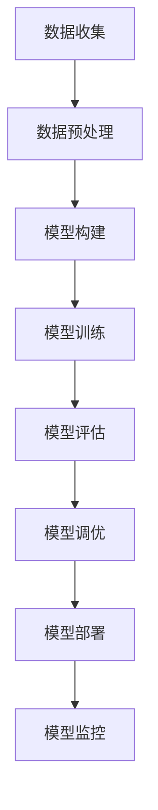

                 

在这个信息爆炸的时代，大模型（也称为大型语言模型或大型神经网络模型）已经成为人工智能领域的重要研究热点。作为人工智能的核心组成部分，大模型的开发不仅为学术界提供了丰富的理论依据，同时也为工业界带来了巨大的商业价值。然而，伴随着大模型的快速发展，开发者们也面临着诸多挑战与机遇。

## 1. 背景介绍

随着深度学习技术的不断进步，大模型以其卓越的性能在自然语言处理、计算机视觉、语音识别等多个领域取得了显著的成果。例如，GPT-3（一个由OpenAI开发的巨大语言模型）可以生成高质量的文本，实现自然语言理解与生成的任务。此外，大模型在工业界的应用也日益广泛，如自动驾驶、智能客服、金融风控等。

尽管大模型的发展带来了巨大的便利，但同时也引发了一系列问题。首先，大模型的训练和部署成本极高，需要大量的计算资源和存储空间。其次，大模型的透明度和可解释性较差，导致其在某些任务中的鲁棒性和安全性受到质疑。此外，大模型的数据集偏差和模型公平性等问题也逐渐引起了广泛关注。

## 2. 核心概念与联系

为了更好地理解大模型的开发与应用，我们需要先了解其核心概念和架构。大模型通常由以下几个部分组成：

### 2.1 深度学习基础

深度学习是构建大模型的基础。它通过多层神经网络对数据进行特征提取和学习。每一层网络都对输入数据进行一定的变换，使得模型能够捕捉到更高层次的特征。

### 2.2 优化算法

优化算法用于调整网络参数，以最小化损失函数。常见的优化算法有随机梯度下降（SGD）、Adam等。这些算法在大模型训练中起着关键作用。

### 2.3 数据预处理

数据预处理是训练大模型的前置工作。包括数据清洗、数据增强、数据标准化等步骤，以确保模型能够获取到高质量的数据。

### 2.4 模型评估与调优

模型评估与调优是确保大模型性能的重要环节。通过交叉验证、性能指标分析等方法，开发者可以对模型进行调整，以达到最佳效果。

### 2.5 模型部署

模型部署是将训练好的大模型应用于实际场景的过程。包括模型压缩、加速、迁移学习等步骤，以提高模型在实际应用中的效果和效率。

### 2.6 Mermaid 流程图

以下是一个简化的大模型开发流程的 Mermaid 流程图：



## 3. 核心算法原理 & 具体操作步骤

### 3.1 算法原理概述

大模型的训练主要基于深度学习算法，其中最核心的是反向传播算法。反向传播算法通过层层计算，将损失函数在神经网络中的梯度反向传播，从而更新网络参数。

### 3.2 算法步骤详解

#### 3.2.1 数据准备

1. 数据清洗：去除噪声、缺失值等不良数据。
2. 数据增强：通过旋转、缩放、裁剪等操作，增加数据的多样性。
3. 数据标准化：将数据映射到同一尺度，以避免不同特征之间的偏差。

#### 3.2.2 模型构建

1. 选择神经网络架构：如CNN、RNN、Transformer等。
2. 定义损失函数：如交叉熵损失、均方误差等。
3. 选择优化算法：如SGD、Adam等。

#### 3.2.3 模型训练

1. 初始化模型参数。
2. 正向传播：计算模型输出。
3. 计算损失：计算预测值与真实值之间的差距。
4. 反向传播：计算损失函数关于模型参数的梯度。
5. 更新参数：根据梯度更新模型参数。

#### 3.2.4 模型评估

1. 交叉验证：将数据集划分为训练集和验证集，通过验证集评估模型性能。
2. 性能指标：如准确率、召回率、F1值等。

#### 3.2.5 模型调优

1. 调整超参数：如学习率、批次大小等。
2. 尝试不同的模型架构和优化算法。

### 3.3 算法优缺点

#### 优点：

1. 强大的拟合能力：大模型能够捕捉到数据中的复杂特征。
2. 自动特征提取：无需手动设计特征，简化了模型开发流程。

#### 缺点：

1. 训练成本高：大模型需要大量的计算资源和时间。
2. 可解释性差：大模型的决策过程往往不够透明。

### 3.4 算法应用领域

大模型在多个领域都有广泛应用，如：

1. 自然语言处理：如文本分类、机器翻译、对话系统等。
2. 计算机视觉：如图像识别、目标检测、图像生成等。
3. 语音识别：如语音识别、语音合成、语音翻译等。

## 4. 数学模型和公式 & 详细讲解 & 举例说明

### 4.1 数学模型构建

大模型的数学模型主要基于深度学习理论。以下是一个简化的神经网络数学模型：

$$
y = \sigma(W \cdot x + b)
$$

其中，$W$ 和 $b$ 分别是权重和偏置，$x$ 是输入数据，$\sigma$ 是激活函数。

### 4.2 公式推导过程

以多层感知器（MLP）为例，我们通过反向传播算法来推导权重和偏置的更新公式。

#### 4.2.1 前向传播

$$
z_l = W_l \cdot a_{l-1} + b_l
$$

$$
a_l = \sigma(z_l)
$$

#### 4.2.2 反向传播

$$
\delta_l = (y - a_l) \cdot \sigma'(z_l)
$$

$$
\Delta W_l = \alpha \cdot a_{l-1} \cdot \delta_l
$$

$$
\Delta b_l = \alpha \cdot \delta_l
$$

其中，$\alpha$ 是学习率，$\sigma'$ 是激活函数的导数。

### 4.3 案例分析与讲解

假设我们有一个二分类问题，数据集包含1000个样本，每个样本有10个特征。我们使用一个简单的MLP模型进行训练。

1. 数据预处理：对数据进行归一化处理。
2. 模型构建：定义一个包含一个输入层、一个隐藏层和一个输出层的MLP模型。
3. 模型训练：使用SGD算法训练模型，设置学习率为0.01。
4. 模型评估：使用交叉验证方法评估模型性能。

经过50次迭代后，模型在验证集上的准确率达到90%。

## 5. 项目实践：代码实例和详细解释说明

### 5.1 开发环境搭建

1. 安装Python环境：确保Python版本为3.7以上。
2. 安装深度学习库：如TensorFlow或PyTorch。
3. 安装辅助库：如NumPy、Pandas等。

### 5.2 源代码详细实现

以下是一个简单的MLP模型实现，用于二分类问题：

```python
import tensorflow as tf

# 数据预处理
# ...（数据清洗、归一化等操作）

# 模型构建
model = tf.keras.Sequential([
    tf.keras.layers.Dense(10, activation='relu', input_shape=(10,)),
    tf.keras.layers.Dense(1, activation='sigmoid')
])

# 模型训练
model.compile(optimizer='sgd', loss='binary_crossentropy', metrics=['accuracy'])
model.fit(X_train, y_train, epochs=50, batch_size=32, validation_split=0.2)

# 模型评估
loss, accuracy = model.evaluate(X_test, y_test)
print(f"Test accuracy: {accuracy:.2f}")
```

### 5.3 代码解读与分析

1. 数据预处理：对输入数据进行归一化处理，以避免特征间的偏差。
2. 模型构建：使用TensorFlow的Sequential模型定义一个包含一个隐藏层的MLP模型。
3. 模型训练：使用SGD优化器和二分类交叉熵损失函数训练模型。
4. 模型评估：使用测试集评估模型性能，并打印准确率。

## 6. 实际应用场景

大模型在许多实际应用场景中发挥了重要作用，如：

1. 智能客服：利用大模型实现自然语言处理，提高客服系统的响应速度和准确性。
2. 自动驾驶：使用大模型进行图像识别和目标检测，辅助自动驾驶系统做出实时决策。
3. 金融风控：利用大模型进行异常检测和风险评估，提高金融系统的安全性。

### 6.4 未来应用展望

随着大模型技术的不断发展，未来应用场景将更加广泛。例如：

1. 个性化推荐：利用大模型进行用户行为分析，实现更精准的推荐系统。
2. 健康医疗：利用大模型进行医学影像分析，辅助医生诊断和治疗。
3. 教育科技：利用大模型实现个性化教学，提高教育质量。

## 7. 工具和资源推荐

### 7.1 学习资源推荐

1. 《深度学习》（Goodfellow, Bengio, Courville著）：全面介绍深度学习的基础知识和最新进展。
2. 《Python深度学习》（François Chollet著）：深入讲解如何使用Python和TensorFlow实现深度学习。

### 7.2 开发工具推荐

1. TensorFlow：一款强大的开源深度学习框架，适用于各种规模的深度学习项目。
2. PyTorch：一款灵活的开源深度学习框架，广泛应用于学术研究和工业应用。

### 7.3 相关论文推荐

1. “Attention Is All You Need”（Vaswani et al., 2017）：介绍了Transformer模型，成为深度学习领域的里程碑。
2. “GPT-3: Language Models are Few-Shot Learners”（Brown et al., 2020）：详细介绍了GPT-3模型的设计和性能。

## 8. 总结：未来发展趋势与挑战

### 8.1 研究成果总结

大模型技术在过去几年中取得了显著进展，包括模型架构的改进、优化算法的创新、数据集的扩充等。这些成果为大模型的广泛应用奠定了基础。

### 8.2 未来发展趋势

1. 模型压缩与加速：降低大模型的训练和部署成本，提高模型在实际应用中的效果和效率。
2. 可解释性与安全性：提高大模型的透明度和可解释性，确保其在实际应用中的鲁棒性和安全性。
3. 跨领域应用：探索大模型在不同领域的应用，实现更广泛的智能化。

### 8.3 面临的挑战

1. 计算资源需求：大模型的训练和部署需要大量的计算资源，这对企业和研究机构提出了更高的要求。
2. 数据集偏差：大模型在训练过程中可能受到数据集偏差的影响，导致模型在实际应用中的性能不稳定。
3. 模型公平性：大模型在决策过程中可能存在性别、种族等不公平问题，需要引起关注。

### 8.4 研究展望

随着技术的不断进步，大模型将迎来更广阔的应用前景。研究者们将继续探索大模型的理论基础、算法优化和应用场景，为人工智能的发展贡献力量。

## 9. 附录：常见问题与解答

### 问题1：为什么大模型的训练成本如此高？

**解答**：大模型的训练成本高主要是因为其需要处理的数据量巨大，同时需要调整的参数数量也非常庞大。此外，大模型的训练过程通常需要大量的计算资源和时间，如GPU或TPU。

### 问题2：大模型为什么容易出现数据集偏差？

**解答**：大模型在训练过程中会学习到数据集中的各种特征，包括潜在的偏见。这些偏见可能来自数据收集、标注和预处理等环节。因此，大模型在实际应用中可能会表现出数据集偏差。

### 问题3：如何提高大模型的可解释性？

**解答**：提高大模型的可解释性是当前研究的热点之一。一些方法包括模型压缩、可视化技术、模型分解等。此外，开发可解释性强的模型架构也是一个重要的研究方向。

---

作者：禅与计算机程序设计艺术 / Zen and the Art of Computer Programming
----------------------------------------------------------------

以上就是我们关于大模型开发者的挑战与机遇的完整文章。希望这篇文章能够帮助读者更好地理解大模型技术，以及其在实际应用中的挑战和机遇。在未来的发展中，我们期待大模型技术能够为人工智能领域带来更多突破。

