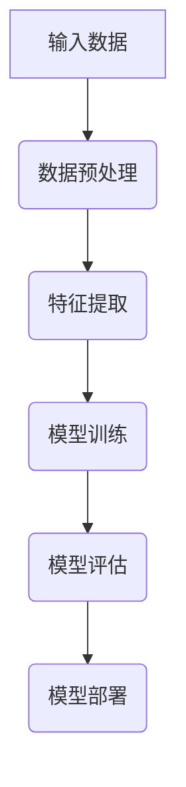

                 

在当今这个数字化时代，大模型（Large-scale Models）的开发已成为人工智能领域的一个热门话题。这些大模型，如GPT-3、BERT等，以其卓越的性能和广泛的应用场景，吸引了众多研究者和开发者的关注。然而，大模型开发并非易事，它既带来了巨大的机遇，也伴随着诸多挑战。本文将深入探讨大模型开发者面临的挑战与机遇，以期为您提供一个全面而深刻的理解。

## 关键词

- 大模型开发
- 挑战
- 机遇
- 人工智能
- 算法
- 数学模型
- 项目实践

## 摘要

本文将从背景介绍、核心概念与联系、核心算法原理与具体操作步骤、数学模型和公式、项目实践、实际应用场景、工具和资源推荐、总结：未来发展趋势与挑战等方面，全面解析大模型开发的挑战与机遇。通过本文，读者可以了解到大模型开发的复杂性，以及如何在不断变化的技术环境中抓住机遇，应对挑战。

## 1. 背景介绍

大模型开发的历史可以追溯到20世纪80年代，当时研究人员开始探索如何通过深度学习技术来构建大规模的人工神经网络。随着时间的推移，计算能力的提升和数据量的增加，大模型的性能也得到了显著提升。特别是在2018年，OpenAI发布的GPT-2模型引起了广泛关注，它展示了在自然语言处理任务上的强大能力。此后，GPT-3、BERT等大模型相继问世，进一步推动了人工智能技术的发展。

大模型的开发不仅需要强大的计算资源和海量的数据，还需要对算法、架构和优化方法有深刻的理解。目前，大模型已经在多个领域展现出其潜力，包括自然语言处理、计算机视觉、语音识别等。然而，随着大模型规模的扩大，开发者们也面临着前所未有的挑战。

## 2. 核心概念与联系

为了更好地理解大模型开发，我们首先需要了解一些核心概念，包括深度学习、神经网络、注意力机制等。

### 2.1 深度学习

深度学习是一种机器学习技术，它通过多层神经网络来模拟人脑的感知和学习过程。深度学习模型可以通过对大量数据进行训练，从而自动提取特征和规律，实现对未知数据的预测和分类。

### 2.2 神经网络

神经网络是由大量简单的人工神经元组成的计算模型。每个神经元都与其他神经元相连，并通过加权的方式传递信息。神经网络可以通过调整这些权重来学习数据中的特征和模式。

### 2.3 注意力机制

注意力机制是深度学习中的一个关键概念，它通过动态调整模型对输入数据的关注程度，从而提高模型的性能。在自然语言处理任务中，注意力机制可以使得模型更关注于重要的单词或短语，从而提高文本的理解能力。

### 2.4 Mermaid 流程图

下面是一个简单的Mermaid流程图，展示了深度学习模型的基本架构：



## 3. 核心算法原理 & 具体操作步骤

### 3.1 算法原理概述

大模型开发的核心算法是深度学习算法，它通过多层神经网络来模拟人脑的感知和学习过程。深度学习算法的基本原理包括：

- 前向传播：将输入数据通过神经网络的前向传递过程，得到输出结果。
- 反向传播：通过计算输出结果与实际结果之间的差异，反向传播误差，并调整网络的权重。

### 3.2 算法步骤详解

1. **数据预处理**：对输入数据进行清洗、归一化等处理，以便于模型训练。
2. **模型构建**：设计并构建深度学习模型，包括选择合适的神经网络架构、设置超参数等。
3. **模型训练**：使用训练数据对模型进行训练，通过反向传播算法不断调整模型的权重，使其性能逐步提升。
4. **模型评估**：使用验证数据对模型进行评估，检查模型的泛化能力。
5. **模型部署**：将训练好的模型部署到实际应用环境中，用于预测和决策。

### 3.3 算法优缺点

**优点**：

- **强大的性能**：深度学习算法在图像识别、自然语言处理等领域取得了显著的成果。
- **自动特征提取**：深度学习模型可以通过对大量数据进行训练，自动提取出有用的特征，减少了人工设计的复杂性。

**缺点**：

- **计算资源消耗大**：深度学习模型通常需要大量的计算资源和时间来进行训练。
- **数据依赖性高**：深度学习模型的性能对数据质量有很大的依赖，数据不足或质量差可能会导致模型效果不佳。

### 3.4 算法应用领域

大模型算法在多个领域都有广泛的应用，包括：

- **自然语言处理**：如文本分类、机器翻译、情感分析等。
- **计算机视觉**：如图像分类、目标检测、人脸识别等。
- **语音识别**：如语音识别、语音合成等。
- **推荐系统**：如商品推荐、新闻推荐等。

## 4. 数学模型和公式 & 详细讲解 & 举例说明

### 4.1 数学模型构建

在深度学习算法中，常用的数学模型包括损失函数、优化算法等。

### 4.2 公式推导过程

以损失函数为例，常见的损失函数有均方误差（MSE）和交叉熵（Cross Entropy）。

1. **均方误差（MSE）**：

$$
MSE = \frac{1}{n}\sum_{i=1}^{n}(y_i - \hat{y}_i)^2
$$

其中，$y_i$表示实际输出，$\hat{y}_i$表示预测输出，$n$表示样本数量。

2. **交叉熵（Cross Entropy）**：

$$
CE = -\frac{1}{n}\sum_{i=1}^{n}y_i\log(\hat{y}_i)
$$

其中，$y_i$表示实际输出，$\hat{y}_i$表示预测输出，$n$表示样本数量。

### 4.3 案例分析与讲解

以一个简单的线性回归问题为例，我们使用均方误差（MSE）作为损失函数，并使用梯度下降（Gradient Descent）算法来优化模型。

1. **数据集**：

假设我们有一个包含100个样本的数据集，每个样本包括一个特征$x$和一个标签$y$。

2. **模型**：

我们使用一个线性模型$y = wx + b$，其中$w$是权重，$b$是偏置。

3. **损失函数**：

均方误差（MSE）：

$$
MSE = \frac{1}{100}\sum_{i=1}^{100}(y_i - wx_i - b)^2
$$

4. **优化算法**：

梯度下降（Gradient Descent）：

$$
w := w - \alpha \frac{\partial}{\partial w}MSE
$$

$$
b := b - \alpha \frac{\partial}{\partial b}MSE
$$

其中，$\alpha$是学习率。

## 5. 项目实践：代码实例和详细解释说明

### 5.1 开发环境搭建

在本文中，我们将使用Python和TensorFlow框架来构建和训练一个简单的线性回归模型。

### 5.2 源代码详细实现

```python
import numpy as np
import tensorflow as tf

# 模型参数
w = tf.Variable(0.0, name='weights')
b = tf.Variable(0.0, name='biases')

# 输入和输出
x = tf.placeholder(tf.float32, shape=[None])
y = tf.placeholder(tf.float32, shape=[None])

# 模型计算
y_pred = w * x + b

# 损失函数
loss = tf.reduce_mean(tf.square(y - y_pred))

# 优化算法
optimizer = tf.train.GradientDescentOptimizer(learning_rate=0.01)
train_op = optimizer.minimize(loss)

# 初始化变量
init = tf.global_variables_initializer()

# 训练模型
with tf.Session() as sess:
    sess.run(init)
    for step in range(1000):
        sess.run(train_op, feed_dict={x: x_train, y: y_train})
        if step % 100 == 0:
            loss_val = sess.run(loss, feed_dict={x: x_train, y: y_train})
            print(f"Step {step}: Loss = {loss_val}")

    # 输出模型参数
    w_val, b_val = sess.run([w, b])
    print(f"Weight: {w_val}, Bias: {b_val}")
```

### 5.3 代码解读与分析

在这段代码中，我们首先导入了所需的库和模块。然后定义了模型参数、输入和输出，并构建了线性回归模型。接下来，我们定义了损失函数和优化算法，并初始化了变量。在训练过程中，我们使用梯度下降算法来优化模型参数，并在每个步骤输出损失值。最后，我们输出训练好的模型参数。

## 6. 实际应用场景

大模型在实际应用场景中具有广泛的应用。以下是一些具体的应用场景：

- **自然语言处理**：如文本分类、机器翻译、情感分析等。
- **计算机视觉**：如图像分类、目标检测、人脸识别等。
- **语音识别**：如语音识别、语音合成等。
- **推荐系统**：如商品推荐、新闻推荐等。
- **金融风控**：如信用评估、交易预测等。

在这些应用场景中，大模型通过其强大的学习和推理能力，可以显著提高任务的准确性和效率。

## 7. 工具和资源推荐

### 7.1 学习资源推荐

- **书籍**：《深度学习》（Goodfellow, Bengio, Courville）、《神经网络与深度学习》（邱锡鹏）
- **在线课程**：Coursera上的“深度学习”、“机器学习”课程
- **博客**：Google AI、Deep Learning AI

### 7.2 开发工具推荐

- **框架**：TensorFlow、PyTorch
- **工具**：Jupyter Notebook、Google Colab

### 7.3 相关论文推荐

- **GPT-3**：[Language Models are Few-Shot Learners](https://arxiv.org/abs/2005.14165)
- **BERT**：[BERT: Pre-training of Deep Bidirectional Transformers for Language Understanding](https://arxiv.org/abs/1810.04805)

## 8. 总结：未来发展趋势与挑战

大模型开发作为人工智能领域的一个热点，未来将继续发展。一方面，随着计算能力的提升和数据量的增加，大模型的性能和效率将得到进一步提升。另一方面，大模型在应用领域的拓展也将带来新的机遇和挑战。

### 8.1 研究成果总结

- **模型性能提升**：大模型在多个任务上取得了显著的成果，如自然语言处理、计算机视觉等。
- **应用领域拓展**：大模型在金融、医疗、教育等领域的应用越来越广泛。

### 8.2 未来发展趋势

- **模型压缩与优化**：为了提高大模型的效率和可部署性，研究者们将继续探索模型压缩与优化技术。
- **多模态学习**：大模型将朝着多模态学习的方向发展，如融合文本、图像和语音等多模态信息。

### 8.3 面临的挑战

- **计算资源消耗**：大模型训练和推理需要大量的计算资源和时间，如何优化算法和提高效率是一个重要挑战。
- **数据隐私与安全**：随着大模型的应用范围扩大，数据隐私与安全问题日益凸显。

### 8.4 研究展望

大模型开发是一个充满挑战和机遇的领域。未来，研究者们将不断探索新的算法和技术，以应对这些挑战，并推动人工智能技术的进步。

## 9. 附录：常见问题与解答

### Q：大模型训练需要哪些计算资源？

A：大模型训练通常需要高性能的计算资源和大量的数据存储空间。GPU或TPU是常见的计算资源，它们可以显著加速模型训练过程。

### Q：如何优化大模型训练的效率？

A：优化大模型训练的效率可以从以下几个方面进行：

- **数据预处理**：对输入数据进行预处理，如归一化、去噪声等，可以提高模型的训练速度。
- **模型压缩**：使用模型压缩技术，如剪枝、量化等，可以减小模型的体积，提高训练速度。
- **分布式训练**：使用分布式训练可以将模型训练任务分解到多个计算节点上，从而提高训练速度。

### Q：大模型在哪些领域有广泛的应用？

A：大模型在自然语言处理、计算机视觉、语音识别、推荐系统、金融风控等领域有广泛的应用。

## 结束语

大模型开发是一个充满挑战和机遇的领域。本文从背景介绍、核心概念与联系、核心算法原理与具体操作步骤、数学模型和公式、项目实践、实际应用场景、工具和资源推荐、总结：未来发展趋势与挑战等方面，全面解析了大模型开发的挑战与机遇。希望通过本文，读者可以对这个领域有一个全面而深入的理解，并能够抓住机遇，应对挑战。

作者：禅与计算机程序设计艺术 / Zen and the Art of Computer Programming
----------------------------------------------------------------


