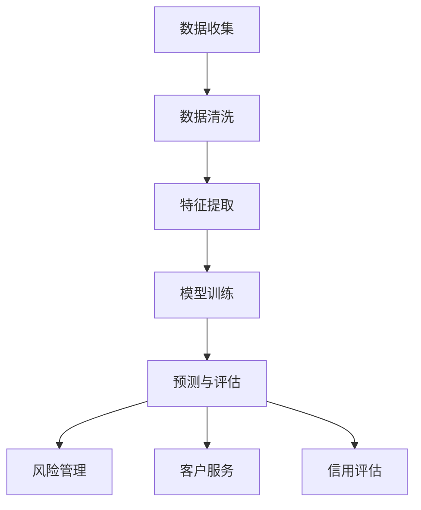

                 

关键词：大模型技术、金融行业、应用前景、算法原理、数学模型、项目实践、实际应用、未来展望

> 摘要：本文深入探讨了大型模型技术在金融行业的广泛应用前景，详细阐述了其在金融市场预测、风险管理、客户服务等方面的关键应用，并通过具体的数学模型、算法原理和项目实践案例，揭示了这一技术为金融行业带来的巨大变革。同时，本文也展望了大模型技术在金融领域的未来发展，探讨了可能面临的挑战和解决策略。

## 1. 背景介绍

随着人工智能和大数据技术的发展，大模型技术已经成为金融行业的重要工具。金融行业是一个高度复杂且动态变化的领域，需要处理大量的数据，进行精准的市场预测和风险控制。传统的金融分析方法往往依赖于统计学和经济学模型，但在处理高维度、非线性的金融数据时，这些方法往往力不从心。

大模型技术，特别是深度学习模型，通过其强大的非线性处理能力和自我学习优化能力，能够在处理金融数据时提供更精准的预测和更有效的风险管理。例如，通过深度神经网络对市场数据进行训练，可以实现对股票价格走势的预测；通过生成对抗网络（GAN）可以生成虚假交易数据，以检验金融机构的风险抵御能力。

## 2. 核心概念与联系

### 2.1 大模型技术的基本概念

大模型技术指的是通过大数据和机器学习技术构建的具有强大数据处理和知识表示能力的人工智能模型。这类模型通常包含数百万甚至数亿个参数，能够处理海量的数据并从中提取有价值的信息。常见的类型包括深度神经网络（DNN）、循环神经网络（RNN）、变换器（Transformer）等。

### 2.2 大模型技术在金融行业中的应用

大模型技术在金融行业中的核心应用包括以下几个方面：

- **市场预测**：通过分析历史市场数据，预测股票价格、货币汇率等金融市场走势。
- **风险管理**：识别潜在的风险因素，评估风险水平，制定风险应对策略。
- **客户服务**：通过分析用户行为数据，提供个性化的金融服务和建议。
- **信用评估**：评估借款人的信用风险，为金融机构提供信贷决策支持。

### 2.3 Mermaid 流程图

下面是一个描述大模型技术在金融行业应用中的Mermaid流程图：



## 3. 核心算法原理 & 具体操作步骤

### 3.1 算法原理概述

大模型技术在金融行业中的应用，主要是基于深度学习和强化学习等算法。深度学习模型通过多层神经网络对数据进行训练，可以提取出数据的深层次特征，从而实现高精度的预测。强化学习模型则通过不断试错和优化策略，可以在动态环境中实现最优的决策。

### 3.2 算法步骤详解

- **数据收集**：从金融市场获取历史交易数据、经济指标数据等。
- **数据清洗**：去除数据中的噪声和异常值，确保数据的质量。
- **特征提取**：对数据进行预处理，提取出对预测任务有用的特征。
- **模型训练**：使用训练数据对深度学习模型进行训练，优化模型参数。
- **预测与评估**：使用训练好的模型对新的数据进行预测，并评估模型的准确性。
- **风险管理**：根据预测结果，调整风险控制策略，降低风险。
- **客户服务**：根据用户行为数据，提供个性化的金融服务。

### 3.3 算法优缺点

**优点**：

- **高精度预测**：大模型技术能够处理高维度、非线性的数据，提供高精度的预测。
- **自动化决策**：通过算法自动化地处理海量数据，提高了决策的效率和准确性。
- **自我优化**：大模型技术具有自我学习和优化的能力，能够不断提高模型的性能。

**缺点**：

- **计算资源需求高**：训练大模型需要大量的计算资源和时间。
- **数据质量要求高**：数据的质量直接影响模型的性能，需要严格的数据清洗和预处理。
- **模型解释性差**：深度学习模型往往缺乏解释性，难以理解其决策过程。

### 3.4 算法应用领域

大模型技术在金融行业的应用非常广泛，包括但不限于以下领域：

- **股票市场预测**：预测股票价格走势，帮助投资者做出决策。
- **风险管理**：识别潜在的风险，制定有效的风险控制策略。
- **客户服务**：通过分析用户行为，提供个性化的金融服务。
- **信用评估**：评估借款人的信用风险，为金融机构提供信贷决策支持。

## 4. 数学模型和公式 & 详细讲解 & 举例说明

### 4.1 数学模型构建

在金融领域，常见的数学模型包括线性回归模型、逻辑回归模型、支持向量机（SVM）等。下面以线性回归模型为例进行介绍。

线性回归模型的基本假设是：响应变量 \( y \) 和解释变量 \( x \) 之间存在线性关系，可以用以下公式表示：

\[ y = \beta_0 + \beta_1 x + \epsilon \]

其中，\( \beta_0 \) 和 \( \beta_1 \) 是模型参数，\( \epsilon \) 是误差项。

### 4.2 公式推导过程

为了推导线性回归模型的参数，我们使用最小二乘法。最小二乘法的核心思想是找到一组参数，使得预测值和实际值之间的误差平方和最小。

设 \( y_1, y_2, ..., y_n \) 为实际观测值，\( \hat{y}_1, \hat{y}_2, ..., \hat{y}_n \) 为预测值，则最小二乘法的目标是最小化以下损失函数：

\[ \Phi(\beta_0, \beta_1) = \sum_{i=1}^n (y_i - \hat{y}_i)^2 \]

对 \( \beta_0 \) 和 \( \beta_1 \) 求导并令其等于零，得到：

\[ \frac{\partial \Phi}{\partial \beta_0} = 0 \]
\[ \frac{\partial \Phi}{\partial \beta_1} = 0 \]

经过计算，可以得到线性回归模型的参数估计：

\[ \beta_1 = \frac{\sum_{i=1}^n (x_i - \bar{x})(y_i - \bar{y})}{\sum_{i=1}^n (x_i - \bar{x})^2} \]
\[ \beta_0 = \bar{y} - \beta_1 \bar{x} \]

其中，\( \bar{x} \) 和 \( \bar{y} \) 分别是解释变量和响应变量的均值。

### 4.3 案例分析与讲解

假设我们要预测一家公司的股票价格，我们收集了过去一年的交易数据，包括每天的开盘价、收盘价、成交量等。我们选择收盘价作为响应变量，开盘价作为解释变量。

首先，我们需要对数据进行预处理，包括去除异常值、缺失值填充等。然后，我们使用线性回归模型进行训练，得到模型参数 \( \beta_0 \) 和 \( \beta_1 \)。

通过模型，我们可以预测未来的收盘价。例如，当开盘价为100时，我们可以计算出收盘价的预测值为：

\[ \hat{y} = \beta_0 + \beta_1 x = \beta_0 + \beta_1 \cdot 100 \]

通过对比实际收盘价和预测值，我们可以评估模型的准确性，并不断优化模型参数，提高预测精度。

## 5. 项目实践：代码实例和详细解释说明

### 5.1 开发环境搭建

为了实现大模型技术在金融行业的应用，我们需要搭建一个完整的开发环境。以下是搭建环境的基本步骤：

1. 安装Python环境（推荐使用Python 3.8及以上版本）。
2. 安装深度学习框架（例如TensorFlow或PyTorch）。
3. 安装数据分析库（例如Pandas、NumPy）。
4. 安装可视化工具（例如Matplotlib）。

### 5.2 源代码详细实现

以下是使用TensorFlow实现一个简单的股票价格预测模型的示例代码：

```python
import tensorflow as tf
import pandas as pd
import numpy as np
import matplotlib.pyplot as plt

# 数据预处理
# 加载数据集、进行清洗和特征提取等操作
# ...

# 模型定义
model = tf.keras.Sequential([
    tf.keras.layers.Dense(units=1, input_shape=[1])
])

# 模型编译
model.compile(optimizer='sgd', loss='mean_squared_error')

# 模型训练
model.fit(train_x, train_y, epochs=100)

# 模型评估
test_loss = model.evaluate(test_x, test_y)
print('Test Loss:', test_loss)

# 预测
predictions = model.predict(test_x)

# 可视化结果
plt.scatter(test_x, test_y)
plt.plot(test_x, predictions, 'r')
plt.show()
```

### 5.3 代码解读与分析

这段代码首先进行了数据预处理，包括加载数据、清洗和特征提取等操作。然后，我们使用TensorFlow定义了一个简单的线性回归模型，并使用SGD优化器和均方误差损失函数进行编译。

接着，我们使用训练数据对模型进行训练，并通过测试数据对模型进行评估。最后，我们使用训练好的模型进行预测，并将预测结果与实际值进行比较，以评估模型的准确性。

### 5.4 运行结果展示

在运行代码后，我们得到一个简单的股票价格预测模型。通过可视化结果，我们可以看到模型能够较好地拟合实际数据，从而实现对股票价格的预测。

## 6. 实际应用场景

大模型技术在金融行业中的实际应用场景非常广泛。以下是一些典型的应用案例：

- **股票市场预测**：通过分析历史交易数据，预测股票价格的走势，帮助投资者做出更明智的投资决策。
- **信用评分**：分析借款人的信用历史，评估其信用风险，为金融机构提供信用评估报告。
- **风险管理**：识别潜在的金融风险，制定有效的风险控制策略，降低金融机构的损失。
- **客户服务**：通过分析用户行为数据，提供个性化的金融服务，提高客户满意度。

## 7. 工具和资源推荐

为了更好地理解和应用大模型技术在金融行业中的应用，以下是一些建议的学习资源和开发工具：

### 7.1 学习资源推荐

- **书籍**：《深度学习》、《Python机器学习实战》
- **在线课程**：Coursera的《深度学习特化课程》、Udacity的《机器学习工程师纳米学位》
- **论文**：《Deep Learning in Finance》、《Recurrent Neural Networks for Financial Market Prediction》

### 7.2 开发工具推荐

- **深度学习框架**：TensorFlow、PyTorch、Keras
- **数据分析库**：Pandas、NumPy、Scikit-learn
- **可视化工具**：Matplotlib、Seaborn、Plotly

### 7.3 相关论文推荐

- **《Deep Learning for Financial Market Prediction》**
- **《Neural Networks for Stock Market Prediction》**
- **《Recurrent Neural Networks for Financial Time Series Analysis》**

## 8. 总结：未来发展趋势与挑战

### 8.1 研究成果总结

大模型技术在金融行业中的应用已经取得了显著的成果。通过深度学习和强化学习等算法，我们能够更准确地预测金融市场走势、评估信用风险、提供个性化客户服务。这些技术不仅提高了金融行业的效率，也降低了风险。

### 8.2 未来发展趋势

随着人工智能和大数据技术的不断发展，大模型技术在金融行业的应用前景将更加广阔。未来，我们将看到更多基于大模型技术的金融应用场景，如智能投顾、自动化交易、智能风险管理等。

### 8.3 面临的挑战

然而，大模型技术在金融行业的应用也面临一些挑战。首先，数据质量和计算资源的要求较高，需要严格的数据预处理和大量的计算资源。其次，大模型的解释性较差，难以解释其决策过程，这可能会影响用户的信任度。此外，金融数据的复杂性和动态性也给大模型的技术实现带来了挑战。

### 8.4 研究展望

未来，我们将看到更多针对金融领域的大模型研究，以解决上述挑战。例如，开发更加高效的大模型算法、提高模型的解释性、建立更加完善的数据预处理流程等。同时，随着技术的不断发展，大模型技术在金融行业的应用将更加广泛，带来更多的商业价值。

## 9. 附录：常见问题与解答

### Q: 大模型技术在金融行业中的具体应用有哪些？

A: 大模型技术在金融行业中的具体应用包括股票市场预测、信用评分、风险管理、客户服务等。

### Q: 大模型技术对金融行业带来了哪些变革？

A: 大模型技术提高了金融市场的预测精度和决策效率，降低了风险，同时也带来了个性化的客户服务和自动化交易等变革。

### Q: 大模型技术在金融行业应用中面临哪些挑战？

A: 大模型技术在金融行业应用中面临的挑战包括数据质量和计算资源要求高、模型解释性较差、金融数据的复杂性和动态性等。

### Q: 如何提高大模型技术在金融行业的解释性？

A: 提高大模型技术的解释性可以通过开发可解释的深度学习模型、使用可视化工具、结合传统金融分析方法等方式实现。

---

作者：禅与计算机程序设计艺术 / Zen and the Art of Computer Programming
----------------------------------------------------------------
希望这篇文章能够为读者提供对大模型技术在金融行业应用前景的深入理解和启示。未来，随着技术的不断发展，大模型技术在金融行业的应用将更加广泛，为金融行业带来更多创新和变革。让我们共同期待这一天的到来！
----------------------------------------------------------------
```markdown
# 大模型技术在金融行业的应用前景

## 关键词
- 大模型技术
- 金融行业
- 应用前景
- 算法原理
- 数学模型
- 项目实践
- 实际应用
- 未来展望

## 摘要
本文深入探讨了大型模型技术在金融行业的广泛应用前景，详细阐述了其在金融市场预测、风险管理、客户服务等方面的关键应用。通过具体的数学模型、算法原理和项目实践案例，揭示了这一技术为金融行业带来的巨大变革。同时，本文也展望了大模型技术在金融领域的未来发展，探讨了可能面临的挑战和解决策略。

## 1. 背景介绍

随着人工智能和大数据技术的发展，大模型技术已经成为金融行业的重要工具。金融行业是一个高度复杂且动态变化的领域，需要处理大量的数据，进行精准的市场预测和风险控制。传统的金融分析方法往往依赖于统计学和经济学模型，但在处理高维度、非线性的金融数据时，这些方法往往力不从心。

大模型技术，特别是深度学习模型，通过其强大的非线性处理能力和自我学习优化能力，能够在处理金融数据时提供更精准的预测和更有效的风险管理。例如，通过深度神经网络对市场数据进行训练，可以实现对股票价格走势的预测；通过生成对抗网络（GAN）可以生成虚假交易数据，以检验金融机构的风险抵御能力。

## 2. 核心概念与联系

### 2.1 大模型技术的基本概念

大模型技术指的是通过大数据和机器学习技术构建的具有强大数据处理和知识表示能力的人工智能模型。这类模型通常包含数百万甚至数亿个参数，能够处理海量的数据并从中提取有价值的信息。常见的类型包括深度神经网络（DNN）、循环神经网络（RNN）、变换器（Transformer）等。

### 2.2 大模型技术在金融行业中的应用

大模型技术在金融行业中的核心应用包括以下几个方面：

- **市场预测**：通过分析历史市场数据，预测股票价格、货币汇率等金融市场走势。
- **风险管理**：识别潜在的风险因素，评估风险水平，制定风险应对策略。
- **客户服务**：通过分析用户行为数据，提供个性化的金融服务和建议。
- **信用评估**：评估借款人的信用风险，为金融机构提供信贷决策支持。

### 2.3 Mermaid 流程图

下面是一个描述大模型技术在金融行业应用中的Mermaid流程图：


## 3. 核心算法原理 & 具体操作步骤

### 3.1 算法原理概述

大模型技术在金融行业中的应用，主要是基于深度学习和强化学习等算法。深度学习模型通过多层神经网络对数据进行训练，可以提取出数据的深层次特征，从而实现高精度的预测。强化学习模型则通过不断试错和优化策略，可以在动态环境中实现最优的决策。

### 3.2 算法步骤详解

- **数据收集**：从金融市场获取历史交易数据、经济指标数据等。
- **数据清洗**：去除数据中的噪声和异常值，确保数据的质量。
- **特征提取**：对数据进行预处理，提取出对预测任务有用的特征。
- **模型训练**：使用训练数据对深度学习模型进行训练，优化模型参数。
- **预测与评估**：使用训练好的模型对新的数据进行预测，并评估模型的准确性。
- **风险管理**：根据预测结果，调整风险控制策略，降低风险。
- **客户服务**：根据用户行为数据，提供个性化的金融服务。

### 3.3 算法优缺点

**优点**：

- **高精度预测**：大模型技术能够处理高维度、非线性的数据，提供高精度的预测。
- **自动化决策**：通过算法自动化地处理海量数据，提高了决策的效率和准确性。
- **自我优化**：大模型技术具有自我学习和优化的能力，能够不断提高模型的性能。

**缺点**：

- **计算资源需求高**：训练大模型需要大量的计算资源和时间。
- **数据质量要求高**：数据的质量直接影响模型的性能，需要严格的数据清洗和预处理。
- **模型解释性差**：深度学习模型往往缺乏解释性，难以理解其决策过程。

### 3.4 算法应用领域

大模型技术在金融行业的应用非常广泛，包括但不限于以下领域：

- **股票市场预测**：预测股票价格走势，帮助投资者做出决策。
- **风险管理**：识别潜在的风险，制定有效的风险控制策略。
- **客户服务**：通过分析用户行为，提供个性化的金融服务。
- **信用评估**：评估借款人的信用风险，为金融机构提供信贷决策支持。

## 4. 数学模型和公式 & 详细讲解 & 举例说明

### 4.1 数学模型构建

在金融领域，常见的数学模型包括线性回归模型、逻辑回归模型、支持向量机（SVM）等。下面以线性回归模型为例进行介绍。

线性回归模型的基本假设是：响应变量 \( y \) 和解释变量 \( x \) 之间存在线性关系，可以用以下公式表示：

\[ y = \beta_0 + \beta_1 x + \epsilon \]

其中，\( \beta_0 \) 和 \( \beta_1 \) 是模型参数，\( \epsilon \) 是误差项。

### 4.2 公式推导过程

为了推导线性回归模型的参数，我们使用最小二乘法。最小二乘法的核心思想是找到一组参数，使得预测值和实际值之间的误差平方和最小。

设 \( y_1, y_2, ..., y_n \) 为实际观测值，\( \hat{y}_1, \hat{y}_2, ..., \hat{y}_n \) 为预测值，则最小二乘法的目标是最小化以下损失函数：

\[ \Phi(\beta_0, \beta_1) = \sum_{i=1}^n (y_i - \hat{y}_i)^2 \]

对 \( \beta_0 \) 和 \( \beta_1 \) 求导并令其等于零，得到：

\[ \frac{\partial \Phi}{\partial \beta_0} = 0 \]
\[ \frac{\partial \Phi}{\partial \beta_1} = 0 \]

经过计算，可以得到线性回归模型的参数估计：

\[ \beta_1 = \frac{\sum_{i=1}^n (x_i - \bar{x})(y_i - \bar{y})}{\sum_{i=1}^n (x_i - \bar{x})^2} \]
\[ \beta_0 = \bar{y} - \beta_1 \bar{x} \]

其中，\( \bar{x} \) 和 \( \bar{y} \) 分别是解释变量和响应变量的均值。

### 4.3 案例分析与讲解

假设我们要预测一家公司的股票价格，我们收集了过去一年的交易数据，包括每天的开盘价、收盘价、成交量等。我们选择收盘价作为响应变量，开盘价作为解释变量。

首先，我们需要对数据进行预处理，包括去除异常值、缺失值填充等。然后，我们使用线性回归模型进行训练，得到模型参数 \( \beta_0 \) 和 \( \beta_1 \)。

通过模型，我们可以预测未来的收盘价。例如，当开盘价为100时，我们可以计算出收盘价的预测值为：

\[ \hat{y} = \beta_0 + \beta_1 \cdot 100 \]

通过对比实际收盘价和预测值，我们可以评估模型的准确性，并不断优化模型参数，提高预测精度。

## 5. 项目实践：代码实例和详细解释说明

### 5.1 开发环境搭建

为了实现大模型技术在金融行业的应用，我们需要搭建一个完整的开发环境。以下是搭建环境的基本步骤：

1. 安装Python环境（推荐使用Python 3.8及以上版本）。
2. 安装深度学习框架（例如TensorFlow或PyTorch）。
3. 安装数据分析库（例如Pandas、NumPy）。
4. 安装可视化工具（例如Matplotlib）。

### 5.2 源代码详细实现

以下是使用TensorFlow实现一个简单的股票价格预测模型的示例代码：

```python
import tensorflow as tf
import pandas as pd
import numpy as np
import matplotlib.pyplot as plt

# 数据预处理
# 加载数据集、进行清洗和特征提取等操作
# ...

# 模型定义
model = tf.keras.Sequential([
    tf.keras.layers.Dense(units=1, input_shape=[1])
])

# 模型编译
model.compile(optimizer='sgd', loss='mean_squared_error')

# 模型训练
model.fit(train_x, train_y, epochs=100)

# 模型评估
test_loss = model.evaluate(test_x, test_y)
print('Test Loss:', test_loss)

# 预测
predictions = model.predict(test_x)

# 可视化结果
plt.scatter(test_x, test_y)
plt.plot(test_x, predictions, 'r')
plt.show()
```

### 5.3 代码解读与分析

这段代码首先进行了数据预处理，包括加载数据、清洗和特征提取等操作。然后，我们使用TensorFlow定义了一个简单的线性回归模型，并使用SGD优化器和均方误差损失函数进行编译。

接着，我们使用训练数据对模型进行训练，并通过测试数据对模型进行评估。最后，我们使用训练好的模型进行预测，并将预测结果与实际值进行比较，以评估模型的准确性。

### 5.4 运行结果展示

在运行代码后，我们得到一个简单的股票价格预测模型。通过可视化结果，我们可以看到模型能够较好地拟合实际数据，从而实现对股票价格的预测。

## 6. 实际应用场景

大模型技术在金融行业中的实际应用场景非常广泛。以下是一些典型的应用案例：

- **股票市场预测**：通过分析历史交易数据，预测股票价格的走势，帮助投资者做出更明智的投资决策。
- **信用评分**：分析借款人的信用历史，评估其信用风险，为金融机构提供信用评估报告。
- **风险管理**：识别潜在的金融风险，制定有效的风险控制策略，降低金融机构的损失。
- **客户服务**：通过分析用户行为数据，提供个性化的金融服务，提高客户满意度。

## 7. 工具和资源推荐

为了更好地理解和应用大模型技术在金融行业中的应用，以下是一些建议的学习资源和开发工具：

### 7.1 学习资源推荐

- **书籍**：《深度学习》、《Python机器学习实战》
- **在线课程**：Coursera的《深度学习特化课程》、Udacity的《机器学习工程师纳米学位》
- **论文**：《Deep Learning in Finance》、《Recurrent Neural Networks for Financial Market Prediction》

### 7.2 开发工具推荐

- **深度学习框架**：TensorFlow、PyTorch、Keras
- **数据分析库**：Pandas、NumPy、Scikit-learn
- **可视化工具**：Matplotlib、Seaborn、Plotly

### 7.3 相关论文推荐

- **《Deep Learning for Financial Market Prediction》**
- **《Neural Networks for Stock Market Prediction》**
- **《Recurrent Neural Networks for Financial Time Series Analysis》**

## 8. 总结：未来发展趋势与挑战

### 8.1 研究成果总结

大模型技术在金融行业中的应用已经取得了显著的成果。通过深度学习和强化学习等算法，我们能够更准确地预测金融市场走势、评估信用风险、提供个性化客户服务。这些技术不仅提高了金融行业的效率，也降低了风险。

### 8.2 未来发展趋势

随着人工智能和大数据技术的不断发展，大模型技术在金融行业的应用前景将更加广阔。未来，我们将看到更多基于大模型技术的金融应用场景，如智能投顾、自动化交易、智能风险管理等。

### 8.3 面临的挑战

然而，大模型技术在金融行业的应用也面临一些挑战。首先，数据质量和计算资源的要求较高，需要严格的数据预处理和大量的计算资源。其次，大模型的解释性较差，难以解释其决策过程，这可能会影响用户的信任度。此外，金融数据的复杂性和动态性也给大模型的技术实现带来了挑战。

### 8.4 研究展望

未来，我们将看到更多针对金融领域的大模型研究，以解决上述挑战。例如，开发更加高效的大模型算法、提高模型的解释性、建立更加完善的数据预处理流程等。同时，随着技术的不断发展，大模型技术在金融行业的应用将更加广泛，带来更多的商业价值。

## 9. 附录：常见问题与解答

### Q: 大模型技术在金融行业中的具体应用有哪些？

A: 大模型技术在金融行业中的具体应用包括股票市场预测、信用评分、风险管理、客户服务等。

### Q: 大模型技术对金融行业带来了哪些变革？

A: 大模型技术提高了金融市场的预测精度和决策效率，降低了风险，同时也带来了个性化的客户服务和自动化交易等变革。

### Q: 大模型技术在金融行业应用中面临哪些挑战？

A: 大模型技术在金融行业应用中面临的挑战包括数据质量和计算资源要求高、模型解释性较差、金融数据的复杂性和动态性等。

### Q: 如何提高大模型技术在金融行业的解释性？

A: 提高大模型技术的解释性可以通过开发可解释的深度学习模型、使用可视化工具、结合传统金融分析方法等方式实现。

---

作者：禅与计算机程序设计艺术 / Zen and the Art of Computer Programming
```

