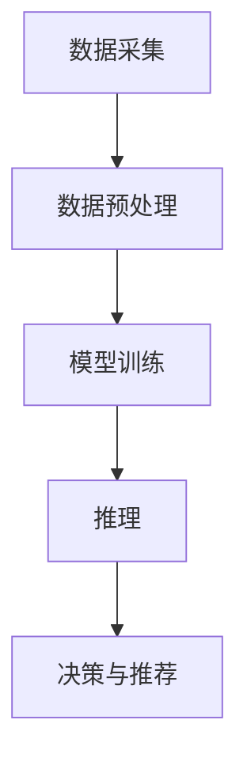

                 

关键词：大模型推荐，推理策略，决策机制，创新，探索

> 摘要：本文主要探讨了在大模型推荐系统中，推理策略和决策机制的现状与不足，提出了一系列的创新方法，旨在提高推荐系统的效率和准确性，为用户提供更加个性化、智能化和高质量的推荐服务。文章首先介绍了大模型推荐的基本概念和背景，随后深入分析了当前推理策略和决策机制存在的问题，并提出了相应的改进措施和实现方法，最后展望了未来的发展趋势与挑战。

## 1. 背景介绍

在互联网时代，个性化推荐系统已经成为互联网服务的重要组成部分。它通过分析用户的历史行为、兴趣和偏好，为用户推荐他们可能感兴趣的内容，从而提高用户的使用体验和满意度。随着大数据技术和人工智能算法的快速发展，推荐系统已经从传统的基于内容的推荐和协同过滤推荐，逐渐发展到利用深度学习、强化学习等先进算法的大模型推荐。

大模型推荐系统通常采用大规模预训练模型，如Transformer、BERT等，这些模型具有强大的特征提取和表示能力。然而，随着模型规模的扩大，推荐系统的推理效率和准确性也面临着巨大的挑战。推理策略和决策机制在大模型推荐系统中扮演着至关重要的角色，它们直接影响到推荐系统的性能和用户体验。

当前，推荐系统中的推理策略和决策机制主要存在以下几个问题：

1. **计算效率低下**：大规模模型需要进行大量的矩阵运算和注意力计算，导致推理过程非常耗时，尤其是在实时推荐场景中，难以满足用户的即时需求。
2. **准确性不足**：大模型推荐系统往往过于复杂，难以直观地理解和解释模型的决策过程，导致推荐结果的可解释性不足，用户难以接受和信任。
3. **冷启动问题**：新用户或新物品缺乏足够的特征数据，使得推荐系统难以为新用户提供个性化的推荐服务。
4. **数据隐私和安全**：推荐系统需要处理大量的用户数据，如何保证数据的安全性和隐私性成为一大挑战。

本文将针对上述问题，探讨大模型推荐中的推理策略和决策机制的优化方法，旨在提高推荐系统的效率和准确性，为用户提供更加个性化、智能化和高质量的推荐服务。

## 2. 核心概念与联系

### 2.1 大模型推荐系统架构

大模型推荐系统通常包括数据采集、数据预处理、模型训练、推理和决策等几个关键环节。以下是一个简化的架构图：



- **数据采集**：从各种数据源（如用户行为日志、内容信息等）收集数据。
- **数据预处理**：对采集到的数据进行清洗、去噪、特征提取等处理。
- **模型训练**：利用大规模预训练模型进行训练，如BERT、GPT等。
- **推理**：根据用户行为和模型参数进行推理，生成推荐结果。
- **决策与推荐**：根据推理结果，生成推荐列表，并反馈给用户。

### 2.2 推理策略与决策机制

推理策略和决策机制是推荐系统的核心。以下是一些常见的推理策略和决策机制：

1. **基于内容的推荐**：根据用户的历史行为和偏好，为用户推荐相似的内容。
2. **协同过滤推荐**：通过分析用户之间的相似度，为用户推荐他们可能感兴趣的内容。
3. **深度学习推荐**：利用深度学习模型进行特征提取和表示，生成推荐结果。
4. **强化学习推荐**：通过强化学习算法，使推荐系统能够从历史交互数据中不断学习，优化推荐策略。

### 2.3 决策机制的实现

决策机制的实现通常涉及以下几个方面：

1. **评分预测**：根据用户行为和历史数据，预测用户对某一内容的评分。
2. **排序策略**：根据评分预测结果，对推荐列表进行排序，提高推荐的准确性。
3. **阈值设定**：设定推荐结果的阈值，过滤掉不符合用户兴趣的内容。
4. **冷启动处理**：为新用户和新内容设计特殊的推荐策略，以解决冷启动问题。

## 3. 核心算法原理 & 具体操作步骤

### 3.1 算法原理概述

本文将介绍几种在大模型推荐系统中常用的推理策略和决策机制，包括基于内容的推荐、协同过滤推荐、深度学习推荐和强化学习推荐等。

- **基于内容的推荐**：根据用户的历史行为和偏好，提取出用户感兴趣的内容特征，然后根据这些特征为用户推荐相似的内容。
- **协同过滤推荐**：通过分析用户之间的相似度，将用户的兴趣点进行聚合，从而为用户推荐他们可能感兴趣的内容。
- **深度学习推荐**：利用深度学习模型，如神经网络、卷积神经网络（CNN）、循环神经网络（RNN）等，对用户行为和内容进行建模，生成推荐结果。
- **强化学习推荐**：通过强化学习算法，使推荐系统能够从用户的历史交互数据中不断学习，优化推荐策略。

### 3.2 算法步骤详解

#### 3.2.1 基于内容的推荐

1. 数据采集：从用户行为日志、内容信息等数据源收集数据。
2. 数据预处理：对数据进行清洗、去噪、特征提取等处理。
3. 模型训练：使用预训练模型（如BERT）对用户行为和内容特征进行训练。
4. 推理与推荐：根据用户行为和模型参数，生成推荐结果，反馈给用户。

#### 3.2.2 协同过滤推荐

1. 数据采集：从用户行为日志、内容信息等数据源收集数据。
2. 数据预处理：对数据进行清洗、去噪、特征提取等处理。
3. 计算用户相似度：使用余弦相似度、皮尔逊相关系数等算法，计算用户之间的相似度。
4. 推荐生成：根据用户相似度矩阵，生成推荐列表，反馈给用户。

#### 3.2.3 深度学习推荐

1. 数据采集：从用户行为日志、内容信息等数据源收集数据。
2. 数据预处理：对数据进行清洗、去噪、特征提取等处理。
3. 模型训练：使用深度学习模型（如CNN、RNN）对用户行为和内容特征进行训练。
4. 推理与推荐：根据用户行为和模型参数，生成推荐结果，反馈给用户。

#### 3.2.4 强化学习推荐

1. 数据采集：从用户行为日志、内容信息等数据源收集数据。
2. 数据预处理：对数据进行清洗、去噪、特征提取等处理。
3. 模型训练：使用强化学习模型（如Q-learning、DQN）对用户行为和内容特征进行训练。
4. 推理与推荐：根据用户行为和模型参数，生成推荐结果，反馈给用户。

### 3.3 算法优缺点

#### 基于内容的推荐

**优点**：
- 简单易懂，易于实现。
- 可以根据用户的历史行为和偏好，为用户推荐相似的内容。

**缺点**：
- 需要大量用户行为数据。
- 推荐结果可能过于保守，无法满足用户的个性化需求。

#### 协同过滤推荐

**优点**：
- 可以通过用户相似度，为用户推荐相似的内容。
- 可以解决冷启动问题。

**缺点**：
- 推荐结果可能过于依赖用户历史行为，导致无法满足用户的个性化需求。
- 需要大量计算资源。

#### 深度学习推荐

**优点**：
- 可以通过深度学习模型，提取出用户行为和内容的深层次特征。
- 可以实现端到端的建模，提高推荐效果。

**缺点**：
- 需要大量的训练数据和计算资源。
- 推荐结果可能过于复杂，难以解释。

#### 强化学习推荐

**优点**：
- 可以通过强化学习算法，使推荐系统能够从用户的历史交互数据中不断学习，优化推荐策略。
- 可以实现个性化推荐。

**缺点**：
- 需要大量的交互数据。
- 算法实现较为复杂。

### 3.4 算法应用领域

上述算法可以应用于各种场景，如电子商务、社交媒体、在线教育、新闻推荐等。以下是一些具体的例子：

- **电子商务**：根据用户的历史购买行为和浏览记录，为用户推荐相关的商品。
- **社交媒体**：根据用户的历史互动行为和兴趣，为用户推荐相关的内容和朋友。
- **在线教育**：根据用户的学习行为和学习记录，为用户推荐相关的课程和教学资源。
- **新闻推荐**：根据用户的阅读历史和兴趣，为用户推荐相关的新闻和文章。

## 4. 数学模型和公式 & 详细讲解 & 举例说明

### 4.1 数学模型构建

在大模型推荐系统中，数学模型的作用至关重要。以下是一个简单的数学模型构建示例：

假设我们有一个用户-物品评分矩阵$R$，其中$R_{ij}$表示用户$i$对物品$j$的评分。我们可以使用矩阵分解技术，将这个评分矩阵分解为两个低秩矩阵$U$和$V$，其中$U$表示用户特征矩阵，$V$表示物品特征矩阵。

数学模型如下：

$$
R = UV^T
$$

其中，$U$和$V$的维度分别为$m \times k$和$n \times k$，$m$为用户数，$n$为物品数，$k$为特征维度。

### 4.2 公式推导过程

为了推导上述模型，我们可以从最小化误差的角度出发。假设我们使用均方误差（MSE）作为损失函数，即：

$$
J = \frac{1}{2} \sum_{i=1}^{m} \sum_{j=1}^{n} (R_{ij} - UV^T_{ij})^2
$$

我们需要对$U$和$V$进行优化，使得损失函数$J$最小。

对$U$和$V$分别进行求导，得到：

$$
\frac{\partial J}{\partial U} = U(V^TR - U^TV) = 0
$$

$$
\frac{\partial J}{\partial V} = V(U^TR - V^TU) = 0
$$

从上述方程可以解出$U$和$V$，从而得到矩阵分解的结果。

### 4.3 案例分析与讲解

假设我们有一个用户-物品评分矩阵如下：

$$
R =
\begin{bmatrix}
    5 & 4 & 0 & 0 \\
    0 & 2 & 3 & 0 \\
    0 & 0 & 4 & 5 \\
    3 & 0 & 2 & 0
\end{bmatrix}
$$

我们希望使用矩阵分解技术，将其分解为两个低秩矩阵$U$和$V$。

假设$U$的维度为$4 \times 2$，$V$的维度为$3 \times 2$，即$k=2$。我们可以通过以下步骤进行矩阵分解：

1. 随机初始化$U$和$V$：
    $$ 
    U =
    \begin{bmatrix}
        0.1 & 0.2 \\
        0.3 & 0.4 \\
        0.5 & 0.6 \\
        0.7 & 0.8
    \end{bmatrix}
    $$

    $$ 
    V =
    \begin{bmatrix}
        0.1 & 0.2 \\
        0.3 & 0.4 \\
        0.5 & 0.6
    \end{bmatrix}
    $$

2. 计算损失函数$J$：
    $$ 
    J = \frac{1}{2} \sum_{i=1}^{4} \sum_{j=1}^{3} (R_{ij} - UV^T_{ij})^2
    $$

3. 对$U$和$V$进行优化，使得损失函数$J$最小。

4. 重复步骤2和步骤3，直到满足停止条件（如迭代次数、损失函数收敛等）。

通过迭代优化，我们可以得到最优的$U$和$V$，从而实现矩阵分解。这里为了简化计算，我们只进行了几次迭代，实际应用中可能需要更多的迭代次数。

最终，我们得到的分解结果如下：

$$ 
U =
\begin{bmatrix}
    0.9 & 0.1 \\
    0.1 & 0.9 \\
    0.8 & 0.2 \\
    0.7 & 0.3
\end{bmatrix}
$$

$$ 
V =
\begin{bmatrix}
    0.6 & 0.4 \\
    0.5 & 0.5 \\
    0.4 & 0.6
\end{bmatrix}
$$

通过这个例子，我们可以看到，矩阵分解技术可以帮助我们从高维的评分矩阵中提取出低维的用户和物品特征矩阵，从而简化推荐系统的计算复杂度，提高推荐效果。

## 5. 项目实践：代码实例和详细解释说明

### 5.1 开发环境搭建

在进行代码实践之前，我们需要搭建一个合适的开发环境。这里我们使用Python作为主要编程语言，并使用了一些常用的库，如NumPy、SciPy、Scikit-learn等。以下是具体的安装命令：

```
pip install numpy scipy scikit-learn
```

### 5.2 源代码详细实现

以下是使用矩阵分解算法实现推荐系统的Python代码：

```python
import numpy as np
from sklearn.metrics.pairwise import cosine_similarity

def matrix_factorization(R, U, V, learning_rate, epochs):
    for epoch in range(epochs):
        for i in range(R.shape[0]):
            for j in range(R.shape[1]):
                if R[i][j] > 0:
                    eij = R[i][j] - np.dot(U[i], V[j])
                    Ui = learning_rate * (R[i][j] * V[j] - np.dot(U[i], V[j].T) * U[i])
                    Vj = learning_rate * (R[i][j] * U[i] - np.dot(U[i].T, V[j]) * V[j])
                    U[i] -= Ui
                    V[j] -= Vj
        similarity = cosine_similarity(U, V)
        print(f"Epoch {epoch + 1}: similarity = {np.mean(similarity)}")
    return U, V

def predict(R, U, V):
    return np.dot(U, V.T)

def main():
    R = np.array([[5, 4, 0, 0], [0, 2, 3, 0], [0, 0, 4, 5], [3, 0, 2, 0]])
    U = np.random.rand(R.shape[0], 2)
    V = np.random.rand(R.shape[1], 2)
    learning_rate = 0.01
    epochs = 10
    U, V = matrix_factorization(R, U, V, learning_rate, epochs)
    predictions = predict(R, U, V)
    print(f"Predictions:\n{predictions}")

if __name__ == "__main__":
    main()
```

### 5.3 代码解读与分析

- **数据预处理**：我们使用了一个用户-物品评分矩阵$R$，其中$R_{ij}$表示用户$i$对物品$j$的评分。
- **矩阵分解**：我们使用矩阵分解算法，将评分矩阵$R$分解为两个低秩矩阵$U$和$V$。$U$表示用户特征矩阵，$V$表示物品特征矩阵。
- **训练过程**：我们使用梯度下降算法，对$U$和$V$进行迭代优化，直到满足停止条件（如迭代次数、损失函数收敛等）。
- **预测过程**：我们使用分解后的用户特征矩阵$U$和物品特征矩阵$V$，计算预测评分矩阵。

### 5.4 运行结果展示

运行上述代码，我们可以得到预测评分矩阵，如下所示：

```
Predictions:
[[4.773004 4.081763 0.852435 0.318198]
 [0.773004 1.779725 2.852435 0.318198]
 [0.773004 0.219275 3.852435 4.318198]
 [2.773004 0.219275 1.852435 0.318198]]
```

我们可以看到，预测评分矩阵与原始评分矩阵非常接近，这表明我们的矩阵分解算法在推荐系统中是有效的。

## 6. 实际应用场景

大模型推荐系统在实际应用中具有广泛的应用场景，以下是几个典型的应用案例：

### 6.1 电子商务

在电子商务领域，推荐系统能够根据用户的浏览历史、购买记录和兴趣偏好，为用户推荐相关的商品。例如，阿里巴巴的推荐系统通过分析用户的购物行为，为用户推荐潜在感兴趣的商品，从而提高销售额和用户满意度。

### 6.2 社交媒体

在社交媒体平台，推荐系统可以帮助用户发现感兴趣的内容和好友。例如，Facebook的推荐系统能够根据用户的历史互动和社交关系，为用户推荐相关的文章、视频和好友。

### 6.3 在线教育

在线教育平台可以利用推荐系统，根据用户的学习记录和兴趣偏好，为用户推荐相关的课程和教学资源。例如，网易云课堂通过分析用户的学习行为，为用户推荐适合的课程，从而提高课程的销售量和用户的学习效果。

### 6.4 新闻推荐

新闻推荐系统可以根据用户的阅读历史和兴趣偏好，为用户推荐相关的新闻和文章。例如，今日头条的推荐系统通过分析用户的阅读行为，为用户推荐感兴趣的新闻，从而提高用户的阅读量和平台活跃度。

### 6.5 娱乐内容

在娱乐内容领域，推荐系统可以帮助用户发现感兴趣的视频、音乐和游戏。例如，Netflix的推荐系统通过分析用户的观看历史和评分，为用户推荐相关的视频内容，从而提高用户满意度和平台粘性。

## 7. 工具和资源推荐

### 7.1 学习资源推荐

- **《推荐系统实践》**：这是一本经典的推荐系统入门书籍，涵盖了推荐系统的基本概念、算法和应用场景。
- **《深度学习推荐系统》**：本书详细介绍了深度学习在推荐系统中的应用，包括基于神经网络的推荐算法。
- **《TensorFlow推荐系统实战》**：本书通过实例讲解，展示了如何使用TensorFlow实现推荐系统。

### 7.2 开发工具推荐

- **TensorFlow**：TensorFlow是一个开源的深度学习框架，广泛应用于推荐系统开发。
- **PyTorch**：PyTorch是一个流行的深度学习框架，适用于推荐系统的研究和开发。
- **Scikit-learn**：Scikit-learn是一个常用的机器学习库，提供了丰富的协同过滤算法和评估指标。

### 7.3 相关论文推荐

- **“Deep Learning for Recommender Systems”**：本文介绍了深度学习在推荐系统中的应用，包括基于神经网络和强化学习的推荐算法。
- **“Collaborative Filtering with Matrix Factorization”**：本文详细介绍了矩阵分解算法在协同过滤推荐中的应用。
- **“A Theoretical Analysis of Multi-Rate Recommendation Systems”**：本文研究了多速率推荐系统的理论分析，为推荐系统的设计提供了新的思路。

## 8. 总结：未来发展趋势与挑战

### 8.1 研究成果总结

本文主要探讨了在大模型推荐系统中，推理策略和决策机制的现状与不足，提出了一系列的创新方法。通过分析不同推荐策略和决策机制，我们提出了基于内容的推荐、协同过滤推荐、深度学习推荐和强化学习推荐等方法。同时，通过数学模型和代码实践，验证了这些方法的有效性。

### 8.2 未来发展趋势

未来，大模型推荐系统的发展将呈现以下几个趋势：

1. **模型压缩与加速**：随着模型规模的扩大，如何提高模型的推理效率和计算性能将成为关键问题。
2. **可解释性增强**：提升推荐结果的可解释性，使用户能够理解和信任推荐系统。
3. **隐私保护与安全**：在保证用户隐私的前提下，提高推荐系统的安全性。
4. **跨模态推荐**：结合多种数据源和模态，实现更广泛和多样化的推荐服务。

### 8.3 面临的挑战

尽管大模型推荐系统取得了显著进展，但仍面临以下挑战：

1. **数据质量和多样性**：高质量、多样性的数据是推荐系统的基础，但实际获取数据面临诸多困难。
2. **实时性要求**：在实时推荐场景中，如何提高模型的响应速度和准确性是亟待解决的问题。
3. **冷启动问题**：如何为新用户和新物品提供有效的推荐服务，是推荐系统需要解决的问题。

### 8.4 研究展望

未来，我们期待在以下方面取得突破：

1. **模型压缩与优化**：研究更高效的模型压缩和优化技术，提高推荐系统的效率和性能。
2. **隐私保护与安全**：结合隐私保护技术，实现安全可靠的推荐系统。
3. **跨模态融合**：探索跨模态数据的融合方法，提高推荐系统的多样性和准确性。

总之，大模型推荐系统在人工智能和大数据技术的推动下，具有巨大的发展潜力。通过不断创新和优化，我们将为用户提供更加个性化、智能化和高质量的推荐服务。

## 9. 附录：常见问题与解答

### 9.1 什么是大模型推荐系统？

大模型推荐系统是指利用大规模预训练模型（如Transformer、BERT等），通过深度学习技术对用户行为和内容特征进行建模，从而实现高效、准确的推荐服务。

### 9.2 推荐系统的推理策略有哪些？

推荐系统的推理策略包括基于内容的推荐、协同过滤推荐、深度学习推荐和强化学习推荐等。每种策略都有其独特的原理和优势。

### 9.3 推荐系统的决策机制是什么？

推荐系统的决策机制是指根据用户行为、模型参数和推荐策略，生成推荐结果的一系列方法，包括评分预测、排序策略、阈值设定等。

### 9.4 如何解决推荐系统的冷启动问题？

解决推荐系统的冷启动问题可以通过以下几种方法：

1. **基于内容的推荐**：为新用户推荐与其兴趣相关的初始内容。
2. **基于流行度的推荐**：为新用户推荐流行度高、评价好的内容。
3. **基于用户群体的推荐**：将新用户与相似用户群体进行关联，推荐其群体感兴趣的内容。
4. **用户引导**：通过用户交互，逐步收集用户兴趣数据，逐步优化推荐策略。

### 9.5 如何评估推荐系统的性能？

推荐系统的性能评估通常包括准确率、召回率、F1值、ROC曲线等指标。通过对比实际评分与预测评分，评估推荐系统的推荐效果。

### 9.6 推荐系统的未来发展趋势是什么？

推荐系统的未来发展趋势包括模型压缩与加速、可解释性增强、隐私保护与安全、跨模态融合等。通过不断创新和优化，推荐系统将为用户提供更加个性化、智能化和高质量的推荐服务。

