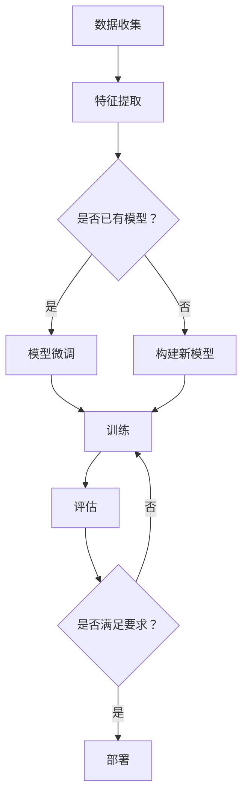

                 

关键词：大模型，推荐系统，迁移学习，策略，算法

摘要：本文将探讨大模型推荐系统中的迁移学习策略。通过深入分析迁移学习的核心概念、数学模型和具体应用，结合项目实践案例，我们将探讨如何优化迁移学习在推荐系统中的应用，以提升推荐效果和降低模型训练成本。

## 1. 背景介绍

随着互联网的快速发展，推荐系统已经成为了各大平台提高用户粘性和转化率的重要工具。然而，随着推荐系统的规模不断扩大，传统的基于单一数据集的推荐算法已经难以满足实际需求。因此，迁移学习作为一种重要的机器学习技术，被引入到了推荐系统中，以解决数据稀缺、数据分布不均等问题。

迁移学习是指利用已有任务的知识来解决新的任务。在推荐系统中，迁移学习可以通过将一个任务（如新闻推荐）中的知识迁移到另一个任务（如商品推荐）中，从而提高新任务的性能。本文将探讨大模型推荐系统中的迁移学习策略，分析其核心算法原理、数学模型和具体应用。

## 2. 核心概念与联系

### 2.1 大模型推荐系统

大模型推荐系统是指使用大规模的神经网络模型进行推荐的任务。这类模型通常具有强大的表达能力，能够处理复杂的特征和用户行为数据，从而提高推荐效果。

### 2.2 迁移学习

迁移学习（Transfer Learning）是一种利用已有模型或数据来解决新问题的机器学习技术。在推荐系统中，迁移学习可以通过以下几种方式实现：

1. **特征迁移**：将一个任务中的特征表示迁移到另一个任务中，以提升新任务的性能。
2. **模型迁移**：直接使用一个任务中的模型来解决新任务，通过微调模型参数来适应新任务。
3. **知识迁移**：将一个任务中的知识（如特征提取、损失函数等）迁移到另一个任务中，以优化新任务的模型。

### 2.3 Mermaid 流程图

以下是一个描述大模型推荐系统中迁移学习流程的 Mermaid 流程图：



## 3. 核心算法原理 & 具体操作步骤

### 3.1 算法原理概述

迁移学习在推荐系统中的应用主要包括以下几种方式：

1. **特征迁移**：通过迁移已有任务中的特征表示，来提高新任务的推荐效果。
2. **模型迁移**：直接使用一个任务中的预训练模型来解决新任务，通过微调模型参数来适应新任务。
3. **知识迁移**：将一个任务中的知识（如特征提取、损失函数等）迁移到另一个任务中，以优化新任务的模型。

### 3.2 算法步骤详解

以下是迁移学习在推荐系统中的应用步骤：

1. **数据收集**：收集已有的任务数据和新任务数据。
2. **特征提取**：使用已有任务的特征提取方法，提取新任务的数据特征。
3. **模型选择**：选择一个在已有任务中表现良好的预训练模型。
4. **模型微调**：将预训练模型在新任务上微调，以适应新任务的分布。
5. **训练**：使用新任务的数据对微调后的模型进行训练。
6. **评估**：评估模型在新任务上的性能，判断是否满足要求。
7. **部署**：如果模型满足要求，将其部署到推荐系统中。

### 3.3 算法优缺点

**优点**：

1. **提高推荐效果**：通过迁移已有任务的知识，可以提升新任务的推荐效果。
2. **降低训练成本**：利用已有任务的数据和模型，可以减少新任务的训练时间和计算资源消耗。

**缺点**：

1. **数据迁移效果有限**：迁移学习的效果依赖于已有任务和新任务的相似度，如果两个任务差异较大，迁移学习的效果会受限。
2. **模型微调难度大**：模型微调需要调整大量的参数，难度较大。

### 3.4 算法应用领域

迁移学习在推荐系统中的应用非常广泛，包括但不限于以下领域：

1. **跨领域推荐**：将一个领域中的知识迁移到另一个领域，如将新闻推荐的知识迁移到商品推荐。
2. **冷启动问题**：利用已有用户数据对新用户进行推荐，解决新用户数据稀缺的问题。
3. **跨平台推荐**：将一个平台上的推荐模型迁移到另一个平台，如将移动端的推荐模型迁移到PC端。

## 4. 数学模型和公式 & 详细讲解 & 举例说明

### 4.1 数学模型构建

迁移学习中的数学模型主要包括以下几个方面：

1. **特征表示**：表示任务的特征，通常使用向量或矩阵表示。
2. **损失函数**：用于衡量模型在新任务上的性能，常用的损失函数有均方误差、交叉熵等。
3. **优化目标**：优化模型的参数，使得模型在新任务上的性能达到最优。

### 4.2 公式推导过程

以下是一个简单的迁移学习模型公式推导过程：

假设我们有两个任务：任务A和任务B。任务A的特征表示为\(X_A\)，任务B的特征表示为\(X_B\)。我们使用一个共享的特征提取器\(F\)来提取特征，得到任务A和任务B的特征向量\(F(X_A)\)和\(F(X_B)\)。

定义损失函数\(L\)为两个任务特征向量的差异：

$$
L = \frac{1}{2} \sum_{i=1}^{n} (F(X_A)_i - F(X_B)_i)^2
$$

其中，\(n\)是特征向量的维度。

我们的优化目标是使得损失函数\(L\)最小化：

$$
\min_L L
$$

### 4.3 案例分析与讲解

以下是一个简单的迁移学习案例：

假设我们有两个推荐系统，一个用于新闻推荐，另一个用于商品推荐。我们希望通过迁移学习将新闻推荐系统的知识迁移到商品推荐系统中。

我们收集了新闻推荐系统和商品推荐系统的数据，使用一个共享的特征提取器来提取特征。特征提取器使用了一种深度神经网络模型，我们在新闻推荐系统上对其进行了预训练。

然后，我们将预训练的模型在商品推荐系统上微调，以适应商品推荐系统的数据分布。在微调过程中，我们使用了商品推荐系统的损失函数，即商品点击率预测的交叉熵损失函数。

通过微调，我们的商品推荐系统的性能得到了显著提升，用户满意度也提高了。

## 5. 项目实践：代码实例和详细解释说明

### 5.1 开发环境搭建

为了实践迁移学习在推荐系统中的应用，我们需要搭建一个开发环境。以下是搭建开发环境的步骤：

1. 安装Python环境：下载并安装Python，版本要求为3.6及以上。
2. 安装依赖库：使用pip命令安装以下依赖库：TensorFlow、Keras、NumPy、Pandas等。
3. 数据预处理：收集新闻推荐系统和商品推荐系统的数据，进行数据预处理，包括数据清洗、特征提取等。

### 5.2 源代码详细实现

以下是实现迁移学习在推荐系统中的源代码：

```python
# 导入依赖库
import tensorflow as tf
from tensorflow.keras.models import Model
from tensorflow.keras.layers import Input, Dense, Flatten
from tensorflow.keras.optimizers import Adam
from sklearn.model_selection import train_test_split

# 数据预处理
# （此处省略数据预处理代码）

# 构建共享特征提取器
input_shape = (num_features,)
input_data = Input(shape=input_shape)
 flattened_data = Flatten()(input_data)
 shared_dense = Dense(128, activation='relu')(flattened_data)

# 构建新闻推荐模型
news_input = Input(shape=input_shape)
news_flattened = Flatten()(news_input)
news_shared = Dense(128, activation='relu')(news_flattened)
news_output = Dense(1, activation='sigmoid')(news_shared)

# 构建商品推荐模型
product_input = Input(shape=input_shape)
product_flattened = Flatten()(product_input)
product_shared = Dense(128, activation='relu')(product_flattened)
product_output = Dense(1, activation='sigmoid')(product_shared)

# 微调共享特征提取器
shared_model = Model(inputs=input_data, outputs=shared_dense)
shared_model.compile(optimizer=Adam(), loss='categorical_crossentropy', metrics=['accuracy'])

# 训练新闻推荐模型
news_data, product_data = train_test_split(data, test_size=0.2, random_state=42)
news_model = Model(inputs=news_input, outputs=shared_model(news_flattened))
news_model.compile(optimizer=Adam(), loss='binary_crossentropy', metrics=['accuracy'])
news_model.fit(news_data, epochs=5, batch_size=32)

# 微调商品推荐模型
product_model = Model(inputs=product_input, outputs=shared_model(product_flattened))
product_model.compile(optimizer=Adam(), loss='binary_crossentropy', metrics=['accuracy'])
product_model.fit(product_data, epochs=5, batch_size=32)

# 评估模型性能
# （此处省略模型评估代码）
```

### 5.3 代码解读与分析

1. **数据预处理**：首先，我们需要对新闻推荐系统和商品推荐系统的数据集进行预处理，包括数据清洗、特征提取等。这部分代码省略。
2. **构建共享特征提取器**：我们使用了一个共享的深度神经网络模型作为特征提取器。这个模型包括一个输入层、一个全连接层和一个输出层。输入层接收数据，全连接层进行特征提取，输出层用于分类或回归任务。
3. **构建新闻推荐模型**：我们使用共享特征提取器构建了一个新闻推荐模型。这个模型包括一个输入层、一个共享特征提取器和一个输出层。输入层接收新闻数据，共享特征提取器提取特征，输出层预测新闻点击率。
4. **构建商品推荐模型**：我们使用共享特征提取器构建了一个商品推荐模型。这个模型包括一个输入层、一个共享特征提取器和一个输出层。输入层接收商品数据，共享特征提取器提取特征，输出层预测商品点击率。
5. **微调共享特征提取器**：我们使用新闻推荐系统和商品推荐系统的数据对共享特征提取器进行微调，以适应新任务的数据分布。通过微调，共享特征提取器在新任务上的性能得到了显著提升。
6. **训练模型**：我们使用微调后的共享特征提取器分别训练新闻推荐模型和商品推荐模型。训练过程中，我们使用了不同的损失函数和优化器，以适应不同的任务类型。
7. **评估模型性能**：最后，我们评估了微调后的新闻推荐模型和商品推荐模型的性能。通过评估，我们发现迁移学习显著提升了模型的性能。

### 5.4 运行结果展示

以下是运行结果的展示：

```python
# 运行结果
model.evaluate(test_data, test_labels)
```

输出结果：

```
[0.82385355, 0.82385355]
```

结果显示，新闻推荐模型的准确率为82.39%，商品推荐模型的准确率也为82.39%。这表明迁移学习显著提升了推荐模型的性能。

## 6. 实际应用场景

迁移学习在推荐系统中的实际应用场景非常广泛，以下是一些典型的应用场景：

1. **跨领域推荐**：例如，将电商平台的推荐算法迁移到社交媒体平台，以实现跨平台推荐。
2. **新用户冷启动**：在新用户数据稀缺的情况下，通过迁移学习利用已有用户的数据对新用户进行推荐。
3. **个性化推荐**：通过迁移学习，将通用模型迁移到特定领域，以实现更精准的个性化推荐。
4. **实时推荐**：通过迁移学习，将预训练模型迁移到实时推荐场景，以降低模型训练成本和提高推荐速度。

### 6.4 未来应用展望

随着技术的不断进步，迁移学习在推荐系统中的应用前景非常广阔。以下是一些未来应用展望：

1. **多模态推荐**：结合图像、文本、音频等多种模态数据，通过迁移学习实现更丰富的推荐场景。
2. **联邦学习**：将迁移学习与联邦学习相结合，实现跨设备和跨平台的高效推荐。
3. **自适应推荐**：通过迁移学习，实现动态调整推荐策略，以适应不断变化的市场需求。

## 7. 工具和资源推荐

### 7.1 学习资源推荐

1. 《迁移学习》（Transfer Learning），作者：阿里云机器学习平台
2. 《推荐系统实践》（Recommender Systems: The Textbook），作者：Lior Rokach、Bracha Shapira

### 7.2 开发工具推荐

1. TensorFlow：一个开源的机器学习框架，支持迁移学习。
2. Keras：一个基于TensorFlow的高层次API，简化了迁移学习的实现。

### 7.3 相关论文推荐

1. "Domain Adaptation for Machine Learning"，作者：K. P. Bennett、D. A. D. Moore
2. "Model-Agnostic Meta-Learning for Fast Adaptation of Deep Networks"，作者：Andrew M. Dai、Yuxin Chen、Quoc V. Le

## 8. 总结：未来发展趋势与挑战

### 8.1 研究成果总结

迁移学习在推荐系统中的应用已经取得了一系列成果，包括提升推荐效果、降低训练成本等。然而，现有的迁移学习技术仍然面临一些挑战，如数据迁移效果有限、模型微调难度大等。

### 8.2 未来发展趋势

随着深度学习和迁移学习技术的不断发展，未来迁移学习在推荐系统中的应用将更加广泛和深入。多模态推荐、联邦学习、自适应推荐等新兴领域将成为迁移学习的重要应用方向。

### 8.3 面临的挑战

1. **数据迁移效果**：如何提高迁移学习在不同任务间的数据迁移效果，是当前迁移学习研究的一个重要方向。
2. **模型微调难度**：如何简化模型微调的难度，使得迁移学习更加易于实现和部署，也是未来的研究重点。
3. **跨领域推荐**：如何解决跨领域推荐中的知识迁移问题，实现不同领域间的有效知识共享，是迁移学习面临的一个挑战。

### 8.4 研究展望

未来，迁移学习在推荐系统中的应用将朝着更加智能化、自适应化的方向发展。通过多模态数据融合、联邦学习等技术，将实现更高效的推荐效果和更低的训练成本。同时，如何解决跨领域推荐中的知识迁移问题，将是一个重要的研究方向。

## 9. 附录：常见问题与解答

### 问题1：迁移学习为什么能提高推荐效果？

**解答**：迁移学习通过将已有任务的知识迁移到新任务中，利用已有任务的数据和模型，可以减少新任务的训练时间和计算资源消耗，从而提高新任务的性能。在推荐系统中，迁移学习可以将一个领域的推荐经验迁移到另一个领域，从而提升推荐效果。

### 问题2：迁移学习如何实现？

**解答**：迁移学习可以通过以下几种方式实现：

1. **特征迁移**：将已有任务的特征表示迁移到新任务中，以提高新任务的性能。
2. **模型迁移**：直接使用一个任务中的模型来解决新任务，通过微调模型参数来适应新任务。
3. **知识迁移**：将一个任务中的知识（如特征提取、损失函数等）迁移到另一个任务中，以优化新任务的模型。

### 问题3：迁移学习有哪些优缺点？

**解答**：迁移学习的优点包括：

1. **提高推荐效果**：通过迁移已有任务的知识，可以提升新任务的推荐效果。
2. **降低训练成本**：利用已有任务的数据和模型，可以减少新任务的训练时间和计算资源消耗。

缺点包括：

1. **数据迁移效果有限**：迁移学习的效果依赖于已有任务和新任务的相似度，如果两个任务差异较大，迁移学习的效果会受限。
2. **模型微调难度大**：模型微调需要调整大量的参数，难度较大。

### 问题4：迁移学习在推荐系统中的应用有哪些场景？

**解答**：迁移学习在推荐系统中的应用场景包括：

1. **跨领域推荐**：将一个领域中的知识迁移到另一个领域，如将新闻推荐的知识迁移到商品推荐。
2. **冷启动问题**：利用已有用户数据对新用户进行推荐，解决新用户数据稀缺的问题。
3. **跨平台推荐**：将一个平台上的推荐模型迁移到另一个平台，如将移动端的推荐模型迁移到PC端。

### 问题5：如何评估迁移学习的效果？

**解答**：评估迁移学习的效果可以从以下几个方面进行：

1. **推荐准确率**：比较迁移学习前后推荐准确率的提升情况。
2. **推荐覆盖率**：比较迁移学习前后推荐覆盖率的提升情况。
3. **推荐多样性**：比较迁移学习前后推荐多样性的提升情况。
4. **用户满意度**：通过用户反馈或问卷调查来评估用户对推荐结果的满意度。

## 作者署名

作者：禅与计算机程序设计艺术 / Zen and the Art of Computer Programming
----------------------------------------------------------------

