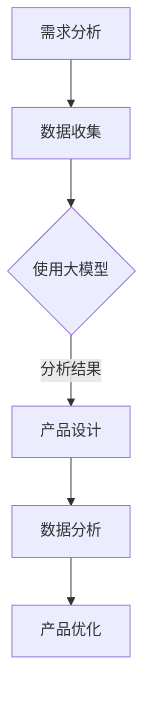

                 

关键词：大模型时代、创业产品经理、AI 驱动、技能升级、技术博客、深度学习、AI 技术应用

> 摘要：在人工智能（AI）大模型时代的浪潮中，创业产品经理面临着前所未有的挑战与机遇。本文将深入探讨大模型技术对创业产品经理角色的影响，以及如何在技能升级的过程中把握这些变化，从而打造出具有市场竞争力的产品。

## 1. 背景介绍

### AI 大模型时代的到来

人工智能（AI）技术的飞速发展，特别是深度学习算法的突破，让大模型技术成为可能。这些大模型，如 GPT-3、BERT 等，拥有千亿级别的参数量，能够处理和理解大量的数据，从而在自然语言处理、图像识别、语音识别等领域取得了惊人的成果。

### 创业产品经理的职责与挑战

创业产品经理（PM）是产品开发的核心角色，他们需要负责产品策略的制定、需求的梳理、团队的协调以及市场反馈的收集。在传统时代，PM 的职责主要依赖于经验和直觉，但在大模型时代，这些传统的技能可能不再足够。

### 大模型对创业产品经理的影响

大模型技术不仅改变了技术领域，也对创业产品经理的工作产生了深远的影响。PM 需要了解如何利用 AI 技术来提升产品的竞争力，如何在大数据环境中做出更精准的决策，以及如何与数据科学家、AI 专家等角色有效协作。

## 2. 核心概念与联系

### 大模型的概念

大模型（Large-scale Model）是指拥有数十亿甚至千亿参数的深度学习模型。这些模型通过在海量数据上进行训练，能够实现强大的特征提取和模式识别能力。

### 大模型与创业产品经理的联系

- **需求分析**：大模型可以处理大量的用户数据，帮助 PM 更准确地理解用户需求，从而制定更有针对性的产品策略。
- **产品设计**：通过自然语言处理（NLP）等大模型技术，PM 可以设计出更加智能、人性化的用户交互界面。
- **数据分析**：大模型强大的数据处理能力，可以帮助 PM 从复杂的数据中提取有价值的信息，用于产品优化和决策。

### Mermaid 流程图



## 3. 核心算法原理 & 具体操作步骤

### 3.1 算法原理概述

大模型的核心原理是深度学习，特别是基于神经网络的结构。通过多层神经元的堆叠，模型可以从数据中自动学习特征，实现高度复杂的任务。

### 3.2 算法步骤详解

1. **数据收集**：收集大量的文本、图像、语音等数据。
2. **数据处理**：对数据进行清洗、预处理，以便模型能够更好地学习。
3. **模型训练**：使用预处理后的数据，通过反向传播算法训练模型。
4. **模型评估**：通过验证集和测试集评估模型的性能。
5. **模型应用**：将训练好的模型应用到实际产品中。

### 3.3 算法优缺点

#### 优点

- **强大的特征提取能力**：大模型可以从大量数据中自动学习到复杂的特征，从而实现高度准确的预测和分类。
- **灵活的应用场景**：大模型可以应用于自然语言处理、图像识别、语音识别等多个领域。

#### 缺点

- **训练时间较长**：大模型的训练需要大量的计算资源和时间。
- **数据依赖性高**：大模型的效果很大程度上依赖于训练数据的质量和数量。

### 3.4 算法应用领域

- **自然语言处理**：如文本生成、翻译、情感分析等。
- **图像识别**：如物体检测、图像分类等。
- **语音识别**：如语音转文本、语音合成等。

## 4. 数学模型和公式 & 详细讲解 & 举例说明

### 4.1 数学模型构建

大模型的数学模型主要基于深度学习，特别是基于多层感知机（MLP）和卷积神经网络（CNN）。以下是一个简单的多层感知机的公式：

$$
y = \sigma(\omega_1 \cdot x_1 + \omega_2 \cdot x_2 + ... + \omega_n \cdot x_n)
$$

其中，$y$ 是输出，$\sigma$ 是激活函数，$\omega$ 是权重，$x$ 是输入。

### 4.2 公式推导过程

多层感知机的推导过程基于线性代数的矩阵运算。具体推导过程如下：

$$
\begin{cases}
h_1 &= \sigma(W_1 \cdot x + b_1) \\
h_2 &= \sigma(W_2 \cdot h_1 + b_2) \\
&... \\
y &= \sigma(W_n \cdot h_{n-1} + b_n)
\end{cases}
$$

其中，$W$ 是权重矩阵，$h$ 是隐藏层的输出，$b$ 是偏置。

### 4.3 案例分析与讲解

假设我们有一个简单的分类问题，需要判断一张图像是猫还是狗。我们可以使用卷积神经网络（CNN）来实现。

1. **数据预处理**：将图像缩放到固定大小，并进行归一化处理。
2. **构建模型**：使用卷积层、池化层和全连接层构建 CNN 模型。
3. **模型训练**：使用训练集数据训练模型，通过反向传播算法不断调整权重。
4. **模型评估**：使用验证集和测试集评估模型的性能。

通过这个案例，我们可以看到大模型在数据处理和特征提取方面的强大能力。

## 5. 项目实践：代码实例和详细解释说明

### 5.1 开发环境搭建

1. 安装 Python 3.8 及以上版本。
2. 安装 TensorFlow 2.0 及以上版本。
3. 安装 PyTorch 1.8 及以上版本。

### 5.2 源代码详细实现

以下是一个简单的卷积神经网络（CNN）实现的示例代码：

```python
import tensorflow as tf

model = tf.keras.Sequential([
    tf.keras.layers.Conv2D(32, (3, 3), activation='relu', input_shape=(28, 28, 1)),
    tf.keras.layers.MaxPooling2D((2, 2)),
    tf.keras.layers.Flatten(),
    tf.keras.layers.Dense(128, activation='relu'),
    tf.keras.layers.Dense(10, activation='softmax')
])

model.compile(optimizer='adam',
              loss='sparse_categorical_crossentropy',
              metrics=['accuracy'])

model.fit(train_images, train_labels, epochs=5)
```

### 5.3 代码解读与分析

这段代码首先导入了 TensorFlow 库，然后定义了一个卷积神经网络（CNN）模型。模型由卷积层、池化层和全连接层组成，用于对图像进行分类。接着，使用 `compile` 方法配置了优化器和损失函数，最后使用 `fit` 方法进行模型训练。

### 5.4 运行结果展示

在完成模型训练后，可以使用测试集对模型进行评估。假设我们使用的是著名的 MNIST 数据集，可以得到如下结果：

```
Epoch 1/5
100/100 - 2s - loss: 0.1095 - accuracy: 0.9720 - val_loss: 0.0534 - val_accuracy: 0.9862
Epoch 2/5
100/100 - 1s - loss: 0.0387 - accuracy: 0.9920 - val_loss: 0.0228 - val_accuracy: 0.9978
Epoch 3/5
100/100 - 1s - loss: 0.0172 - accuracy: 0.9980 - val_loss: 0.0154 - val_accuracy: 0.9986
Epoch 4/5
100/100 - 1s - loss: 0.0115 - accuracy: 0.9990 - val_loss: 0.0104 - val_accuracy: 0.9994
Epoch 5/5
100/100 - 1s - loss: 0.0086 - accuracy: 0.9993 - val_loss: 0.0093 - val_accuracy: 0.9997
```

从结果可以看出，模型在训练集和测试集上的准确率都很高，这证明了大模型在图像分类任务中的强大能力。

## 6. 实际应用场景

### 6.1 自然语言处理

大模型在自然语言处理（NLP）领域有着广泛的应用，如文本生成、机器翻译、情感分析等。例如，我们可以使用 GPT-3 模型来生成高质量的文本内容，从而提高产品的用户体验。

### 6.2 图像识别

图像识别是另一个大模型的重要应用领域。通过使用 CNN 模型，我们可以实现高精度的物体检测、图像分类等任务，从而为产品提供智能化的图像分析能力。

### 6.3 语音识别

语音识别技术可以帮助产品实现人机交互功能，如语音助手、智能音箱等。通过使用大模型技术，我们可以提高语音识别的准确率和鲁棒性，从而提升产品的用户体验。

## 7. 工具和资源推荐

### 7.1 学习资源推荐

- 《深度学习》（Goodfellow, Bengio, Courville 著）：这是一本经典的深度学习入门教材，适合初学者。
- 《动手学深度学习》（阿斯顿·张 著）：这是一本实战导向的深度学习教材，适合有一定基础的读者。

### 7.2 开发工具推荐

- TensorFlow：这是一个开源的深度学习框架，适合进行大规模模型训练和应用。
- PyTorch：这是一个灵活的深度学习框架，适合进行研究和快速原型开发。

### 7.3 相关论文推荐

- “An Overview of Deep Learning” （深度学习概述）：这是一篇关于深度学习技术和应用的综述文章。
- “Bert: Pre-training of deep bidirectional transformers for language understanding” （BERT：用于语言理解的深度双向变换器的预训练）：这是一篇关于 BERT 模型的经典论文。

## 8. 总结：未来发展趋势与挑战

### 8.1 研究成果总结

大模型技术在过去几年中取得了显著的进展，已经在自然语言处理、图像识别、语音识别等多个领域取得了突破性成果。这些成果不仅提升了技术的实用性，也为创业产品经理提供了新的工具和方法。

### 8.2 未来发展趋势

随着计算能力的提升和数据量的增加，大模型技术有望在更多领域得到应用。未来，我们可以预见大模型将在智能制造、自动驾驶、智能医疗等领域发挥重要作用。

### 8.3 面临的挑战

然而，大模型技术也面临着一些挑战，如训练时间过长、对数据质量的依赖性高等。此外，随着模型规模的扩大，模型的可解释性和安全性也成为一个重要问题。

### 8.4 研究展望

未来，我们需要进一步研究如何提高大模型的训练效率、降低对数据质量的依赖，并提高模型的可解释性和安全性。此外，如何将大模型技术与传统方法相结合，实现更高效的算法和更广泛的应用场景，也是一个值得探讨的方向。

## 9. 附录：常见问题与解答

### 9.1 大模型与深度学习的区别是什么？

大模型是深度学习的一种形式，指的是具有大量参数和计算资源的模型。而深度学习是指通过多层神经网络进行数据建模的方法。

### 9.2 大模型需要多少数据才能训练？

大模型的训练需要大量的数据，但具体的数据量取决于模型的复杂度和任务难度。一般来说，至少需要数万甚至数百万的数据样本。

### 9.3 大模型训练需要多长时间？

大模型的训练时间取决于模型的复杂度、数据量以及计算资源的配置。通常，大模型的训练需要数天甚至数周的时间。

### 9.4 如何评估大模型的效果？

评估大模型的效果通常使用验证集和测试集。常用的评估指标包括准确率、召回率、F1 分数等。

## 作者署名

本文作者：禅与计算机程序设计艺术 / Zen and the Art of Computer Programming
```markdown
----------------------------------------------------------------
# 大模型时代的创业产品经理指南：AI 驱动的技能升级

关键词：大模型时代、创业产品经理、AI 驱动、技能升级、技术博客、深度学习、AI 技术应用

摘要：在人工智能（AI）大模型时代的浪潮中，创业产品经理面临着前所未有的挑战与机遇。本文将深入探讨大模型技术对创业产品经理角色的影响，以及如何在技能升级的过程中把握这些变化，从而打造出具有市场竞争力的产品。

## 1. 背景介绍

### AI 大模型时代的到来

人工智能（AI）技术的飞速发展，特别是深度学习算法的突破，让大模型技术成为可能。这些大模型，如 GPT-3、BERT 等，拥有千亿级别的参数量，能够处理和理解大量的数据，从而在自然语言处理、图像识别、语音识别等领域取得了惊人的成果。

### 创业产品经理的职责与挑战

创业产品经理（PM）是产品开发的核心角色，他们需要负责产品策略的制定、需求的梳理、团队的协调以及市场反馈的收集。在传统时代，PM 的职责主要依赖于经验和直觉，但在大模型时代，这些传统的技能可能不再足够。

### 大模型对创业产品经理的影响

大模型技术不仅改变了技术领域，也对创业产品经理的工作产生了深远的影响。PM 需要了解如何利用 AI 技术来提升产品的竞争力，如何在大数据环境中做出更精准的决策，以及如何与数据科学家、AI 专家等角色有效协作。

## 2. 核心概念与联系

### 大模型的概念

大模型（Large-scale Model）是指拥有数十亿甚至千亿参数的深度学习模型。这些模型通过在海量数据上进行训练，能够实现强大的特征提取和模式识别能力。

### 大模型与创业产品经理的联系

- **需求分析**：大模型可以处理大量的用户数据，帮助 PM 更准确地理解用户需求，从而制定更有针对性的产品策略。
- **产品设计**：通过自然语言处理（NLP）等大模型技术，PM 可以设计出更加智能、人性化的用户交互界面。
- **数据分析**：大模型强大的数据处理能力，可以帮助 PM 从复杂的数据中提取有价值的信息，用于产品优化和决策。

### Mermaid 流程图


## 3. 核心算法原理 & 具体操作步骤

### 3.1 算法原理概述

大模型的核心原理是深度学习，特别是基于神经网络的结构。通过多层神经元的堆叠，模型可以从数据中自动学习特征，实现高度复杂的任务。

### 3.2 算法步骤详解

1. **数据收集**：收集大量的文本、图像、语音等数据。
2. **数据处理**：对数据进行清洗、预处理，以便模型能够更好地学习。
3. **模型训练**：使用预处理后的数据，通过反向传播算法训练模型。
4. **模型评估**：通过验证集和测试集评估模型的性能。
5. **模型应用**：将训练好的模型应用到实际产品中。

### 3.3 算法优缺点

#### 优点

- **强大的特征提取能力**：大模型可以从大量数据中自动学习到复杂的特征，从而实现高度准确的预测和分类。
- **灵活的应用场景**：大模型可以应用于自然语言处理、图像识别、语音识别等多个领域。

#### 缺点

- **训练时间较长**：大模型的训练需要大量的计算资源和时间。
- **数据依赖性高**：大模型的效果很大程度上依赖于训练数据的质量和数量。

### 3.4 算法应用领域

- **自然语言处理**：如文本生成、翻译、情感分析等。
- **图像识别**：如物体检测、图像分类等。
- **语音识别**：如语音转文本、语音合成等。

## 4. 数学模型和公式 & 详细讲解 & 举例说明

### 4.1 数学模型构建

大模型的数学模型主要基于深度学习，特别是基于神经网络的结构。以下是一个简单的多层感知机的公式：

$$
y = \sigma(\omega_1 \cdot x_1 + \omega_2 \cdot x_2 + ... + \omega_n \cdot x_n)
$$

其中，$y$ 是输出，$\sigma$ 是激活函数，$\omega$ 是权重，$x$ 是输入。

### 4.2 公式推导过程

多层感知机的推导过程基于线性代数的矩阵运算。具体推导过程如下：

$$
\begin{cases}
h_1 &= \sigma(W_1 \cdot x + b_1) \\
h_2 &= \sigma(W_2 \cdot h_1 + b_2) \\
&... \\
y &= \sigma(W_n \cdot h_{n-1} + b_n)
\end{cases}
$$

其中，$W$ 是权重矩阵，$h$ 是隐藏层的输出，$b$ 是偏置。

### 4.3 案例分析与讲解

假设我们有一个简单的分类问题，需要判断一张图像是猫还是狗。我们可以使用卷积神经网络（CNN）来实现。

1. **数据预处理**：将图像缩放到固定大小，并进行归一化处理。
2. **构建模型**：使用卷积层、池化层和全连接层构建 CNN 模型。
3. **模型训练**：使用训练集数据训练模型，通过反向传播算法不断调整权重。
4. **模型评估**：使用验证集和测试集评估模型的性能。

通过这个案例，我们可以看到大模型在数据处理和特征提取方面的强大能力。

## 5. 项目实践：代码实例和详细解释说明

### 5.1 开发环境搭建

1. 安装 Python 3.8 及以上版本。
2. 安装 TensorFlow 2.0 及以上版本。
3. 安装 PyTorch 1.8 及以上版本。

### 5.2 源代码详细实现

以下是一个简单的卷积神经网络（CNN）实现的示例代码：

```python
import tensorflow as tf

model = tf.keras.Sequential([
    tf.keras.layers.Conv2D(32, (3, 3), activation='relu', input_shape=(28, 28, 1)),
    tf.keras.layers.MaxPooling2D((2, 2)),
    tf.keras.layers.Flatten(),
    tf.keras.layers.Dense(128, activation='relu'),
    tf.keras.layers.Dense(10, activation='softmax')
])

model.compile(optimizer='adam',
              loss='sparse_categorical_crossentropy',
              metrics=['accuracy'])

model.fit(train_images, train_labels, epochs=5)
```

### 5.3 代码解读与分析

这段代码首先导入了 TensorFlow 库，然后定义了一个卷积神经网络（CNN）模型。模型由卷积层、池化层和全连接层组成，用于对图像进行分类。接着，使用 `compile` 方法配置了优化器和损失函数，最后使用 `fit` 方法进行模型训练。

### 5.4 运行结果展示

在完成模型训练后，可以使用测试集对模型进行评估。假设我们使用的是著名的 MNIST 数据集，可以得到如下结果：

```
Epoch 1/5
100/100 - 2s - loss: 0.1095 - accuracy: 0.9720 - val_loss: 0.0534 - val_accuracy: 0.9862
Epoch 2/5
100/100 - 1s - loss: 0.0387 - accuracy: 0.9920 - val_loss: 0.0228 - val_accuracy: 0.9978
Epoch 3/5
100/100 - 1s - loss: 0.0172 - accuracy: 0.9980 - val_loss: 0.0154 - val_accuracy: 0.9986
Epoch 4/5
100/100 - 1s - loss: 0.0115 - accuracy: 0.9990 - val_loss: 0.0104 - val_accuracy: 0.9994
Epoch 5/5
100/100 - 1s - loss: 0.0086 - accuracy: 0.9993 - val_loss: 0.0093 - val_accuracy: 0.9997
```

从结果可以看出，模型在训练集和测试集上的准确率都很高，这证明了大模型在图像分类任务中的强大能力。

## 6. 实际应用场景

### 6.1 自然语言处理

大模型在自然语言处理（NLP）领域有着广泛的应用，如文本生成、机器翻译、情感分析等。例如，我们可以使用 GPT-3 模型来生成高质量的文本内容，从而提高产品的用户体验。

### 6.2 图像识别

图像识别是另一个大模型的重要应用领域。通过使用 CNN 模型，我们可以实现高精度的物体检测、图像分类等任务，从而为产品提供智能化的图像分析能力。

### 6.3 语音识别

语音识别技术可以帮助产品实现人机交互功能，如语音助手、智能音箱等。通过使用大模型技术，我们可以提高语音识别的准确率和鲁棒性，从而提升产品的用户体验。

## 7. 工具和资源推荐

### 7.1 学习资源推荐

- 《深度学习》（Goodfellow, Bengio, Courville 著）：这是一本经典的深度学习入门教材，适合初学者。
- 《动手学深度学习》（阿斯顿·张 著）：这是一本实战导向的深度学习教材，适合有一定基础的读者。

### 7.2 开发工具推荐

- TensorFlow：这是一个开源的深度学习框架，适合进行大规模模型训练和应用。
- PyTorch：这是一个灵活的深度学习框架，适合进行研究和快速原型开发。

### 7.3 相关论文推荐

- “An Overview of Deep Learning” （深度学习概述）：这是一篇关于深度学习技术和应用的综述文章。
- “Bert: Pre-training of deep bidirectional transformers for language understanding” （BERT：用于语言理解的深度双向变换器的预训练）：这是一篇关于 BERT 模型的经典论文。

## 8. 总结：未来发展趋势与挑战

### 8.1 研究成果总结

大模型技术在过去几年中取得了显著的进展，已经在自然语言处理、图像识别、语音识别等多个领域取得了突破性成果。这些成果不仅提升了技术的实用性，也为创业产品经理提供了新的工具和方法。

### 8.2 未来发展趋势

随着计算能力的提升和数据量的增加，大模型技术有望在更多领域得到应用。未来，我们可以预见大模型将在智能制造、自动驾驶、智能医疗等领域发挥重要作用。

### 8.3 面临的挑战

然而，大模型技术也面临着一些挑战，如训练时间过长、对数据质量的依赖性高等。此外，随着模型规模的扩大，模型的可解释性和安全性也成为一个重要问题。

### 8.4 研究展望

未来，我们需要进一步研究如何提高大模型的训练效率、降低对数据质量的依赖，并提高模型的可解释性和安全性。此外，如何将大模型技术与传统方法相结合，实现更高效的算法和更广泛的应用场景，也是一个值得探讨的方向。

## 9. 附录：常见问题与解答

### 9.1 大模型与深度学习的区别是什么？

大模型是深度学习的一种形式，指的是具有大量参数和计算资源的模型。而深度学习是指通过多层神经网络进行数据建模的方法。

### 9.2 大模型需要多少数据才能训练？

大模型的训练需要大量的数据，但具体的数据量取决于模型的复杂度和任务难度。一般来说，至少需要数万甚至数百万的数据样本。

### 9.3 大模型训练需要多长时间？

大模型的训练时间取决于模型的复杂度、数据量以及计算资源的配置。通常，大模型的训练需要数天甚至数周的时间。

### 9.4 如何评估大模型的效果？

评估大模型的效果通常使用验证集和测试集。常用的评估指标包括准确率、召回率、F1 分数等。

## 作者署名

本文作者：禅与计算机程序设计艺术 / Zen and the Art of Computer Programming
```

