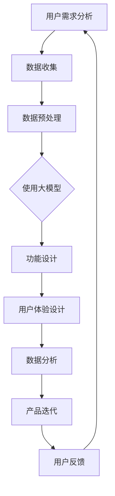

                 

关键词：大模型、创业产品设计、AI驱动、未来趋势

摘要：在AI大模型的时代，创业产品的设计发生了翻天覆地的变化。本文将探讨大模型对创业产品设计的影响，以及未来可能的发展趋势。通过分析AI在产品设计中的核心概念、算法原理、数学模型、应用实践以及面临的挑战，为创业者提供有价值的参考。

## 1. 背景介绍

近年来，人工智能（AI）技术取得了飞速发展，尤其是在深度学习、自然语言处理等领域。这些技术的突破不仅为学术界和工业界带来了巨大的进步，同时也改变了人们的生活和工作方式。随着AI大模型的不断涌现，创业产品的设计也迎来了新的机遇和挑战。

大模型是指那些具有数亿至数十亿参数的深度学习模型，如GPT-3、BERT等。这些模型在训练过程中能够从海量数据中学习到复杂的模式和规律，从而实现出色的任务性能。在创业产品的设计过程中，大模型的应用使得产品能够更加智能、个性化，从而提高用户体验和满意度。

创业产品设计是指初创公司在创建产品时需要考虑的一系列决策，包括功能设计、界面设计、用户体验等。传统的创业产品设计主要依赖于设计师和开发者的直觉和经验，而AI大模型的应用则能够为这一过程提供更科学、更高效的方法。

本文将围绕AI大模型在创业产品设计中的应用，探讨其核心概念、算法原理、数学模型、应用实践以及面临的挑战，为创业者提供有价值的参考。

### 1.1 AI大模型的定义与特点

AI大模型是指那些具有数亿至数十亿参数的深度学习模型，如GPT-3、BERT等。这些模型通过从海量数据中学习复杂的模式和规律，从而实现出色的任务性能。与传统的机器学习模型相比，AI大模型具有以下几个显著特点：

1. **参数规模巨大**：AI大模型的参数规模可以达到数十亿甚至数百万亿，这使得模型能够捕捉到更加复杂的特征和模式。

2. **训练数据丰富**：AI大模型通常需要从海量数据中学习，这有助于模型在训练过程中更好地理解任务的本质。

3. **出色的性能表现**：由于参数规模大、训练数据丰富，AI大模型在许多任务上取得了突破性的性能表现，如自然语言处理、计算机视觉等。

4. **灵活的应用场景**：AI大模型可以应用于各种任务，如文本生成、图像识别、语音识别等，具有广泛的应用前景。

### 1.2 创业产品设计的基本原则与方法

创业产品设计需要考虑以下几个基本原则：

1. **用户需求导向**：创业产品的设计应该紧密围绕用户需求，满足用户的核心需求，从而提高产品的市场竞争力。

2. **简洁易用**：创业产品的设计应该简洁易用，降低用户的学习成本，提高用户体验。

3. **迭代优化**：创业产品的设计应该遵循迭代优化的原则，不断收集用户反馈，持续改进产品。

4. **技术创新**：创业产品的设计可以尝试引入新技术，如AI大模型，以提高产品的竞争力。

创业产品设计的方法包括：

1. **用户调研**：通过用户调研，了解用户的需求和痛点，为产品设计提供依据。

2. **原型设计**：通过原型设计，模拟产品界面和功能，评估用户体验。

3. **迭代开发**：根据用户反馈，不断优化产品，实现快速迭代。

4. **数据分析**：通过数据分析，了解产品的使用情况，为产品优化提供数据支持。

## 2. 核心概念与联系

在本章节中，我们将详细探讨大模型在创业产品设计中的核心概念，并通过Mermaid流程图（**注意：Mermaid流程节点中不要有括号、逗号等特殊字符**）展示大模型的核心原理和架构。

### 2.1 大模型的核心概念

**2.1.1 深度学习**

深度学习是一种机器学习的技术，通过构建多层的神经网络，从数据中学习复杂的模式和规律。深度学习在图像识别、语音识别、自然语言处理等领域取得了显著的成果。

**2.1.2 自适应学习**

自适应学习是指模型能够根据输入数据的变化，自动调整参数，以适应不同的任务和数据分布。自适应学习是创业产品设计中的重要概念，因为它能够帮助产品更好地适应用户需求。

**2.1.3 个性化推荐**

个性化推荐是指根据用户的兴趣和行为，为用户推荐相关的产品或内容。个性化推荐是创业产品设计中的一个重要应用，可以提高用户的满意度和忠诚度。

### 2.2 大模型的架构与原理

**2.2.1 神经网络架构**

神经网络是深度学习的基础，它由多个神经元组成，每个神经元都连接到其他神经元。神经网络的架构决定了模型的学习能力和性能。

**2.2.2 反向传播算法**

反向传播算法是神经网络训练的核心算法，它通过计算误差的梯度，不断调整模型的参数，以优化模型性能。

**2.2.3 自适应优化算法**

自适应优化算法，如Adam、RMSprop等，可以自动调整学习率，提高模型的收敛速度。

### 2.3 大模型在创业产品设计中的应用

**2.3.1 功能设计**

大模型可以帮助创业公司快速构建复杂的功能，如文本生成、图像识别等，从而提高产品的创新性和竞争力。

**2.3.2 用户体验设计**

大模型可以用于用户体验设计，如个性化推荐、情感分析等，从而提高产品的易用性和用户满意度。

**2.3.3 数据分析**

大模型可以用于数据分析，如用户行为分析、市场趋势预测等，从而帮助创业公司更好地了解市场和用户需求。

### 2.4 Mermaid流程图

以下是一个简单的Mermaid流程图，展示了大模型在创业产品设计中的应用流程：



### 2.5 大模型在创业产品设计中的价值

大模型在创业产品设计中的价值体现在以下几个方面：

1. **提高创新性**：大模型可以帮助创业公司快速构建复杂的功能，从而提高产品的创新性。

2. **提高易用性**：大模型可以用于用户体验设计，如个性化推荐、情感分析等，从而提高产品的易用性。

3. **降低开发成本**：大模型可以自动化许多设计环节，从而降低开发成本。

4. **提高市场竞争力**：大模型可以帮助创业公司更好地了解市场和用户需求，从而提高产品的市场竞争力。

## 3. 核心算法原理 & 具体操作步骤

在本章节中，我们将深入探讨大模型在创业产品设计中的核心算法原理，以及如何具体操作和应用这些算法。

### 3.1 算法原理概述

大模型在创业产品设计中的核心算法主要包括深度学习、自适应学习和个性化推荐等。

- **深度学习**：深度学习是一种通过多层神经网络从数据中学习复杂模式的技术。它包括卷积神经网络（CNN）、循环神经网络（RNN）等。

- **自适应学习**：自适应学习是指模型能够根据输入数据的变化，自动调整参数，以适应不同的任务和数据分布。它包括优化算法如Adam、RMSprop等。

- **个性化推荐**：个性化推荐是指根据用户的兴趣和行为，为用户推荐相关的产品或内容。它包括协同过滤、基于内容的推荐等。

### 3.2 算法步骤详解

**3.2.1 深度学习**

1. **数据收集**：收集与创业产品相关的数据，如用户行为数据、市场数据等。

2. **数据预处理**：对数据进行清洗、归一化等处理，以便模型训练。

3. **构建神经网络**：根据任务需求，构建合适的神经网络架构，如CNN、RNN等。

4. **模型训练**：使用反向传播算法训练模型，调整模型参数，优化模型性能。

5. **模型评估**：使用验证集或测试集评估模型性能，确保模型在未知数据上的泛化能力。

6. **模型部署**：将训练好的模型部署到创业产品中，实现功能。

**3.2.2 自适应学习**

1. **初始化模型**：初始化模型参数，选择合适的优化算法。

2. **数据输入**：将输入数据输入模型，计算输出结果。

3. **计算误差**：计算输出结果与实际结果的误差。

4. **调整参数**：根据误差的梯度，调整模型参数。

5. **迭代优化**：重复步骤2-4，直到模型性能达到要求。

**3.2.3 个性化推荐**

1. **用户数据收集**：收集与用户相关的数据，如用户行为数据、兴趣数据等。

2. **数据预处理**：对用户数据进行清洗、编码等处理。

3. **构建推荐模型**：选择合适的推荐算法，如协同过滤、基于内容的推荐等。

4. **模型训练**：使用用户数据训练推荐模型，调整模型参数。

5. **推荐结果生成**：根据用户数据，生成推荐结果。

6. **推荐结果评估**：评估推荐结果的质量，如点击率、转化率等。

### 3.3 算法优缺点

**3.3.1 深度学习**

优点：

- **强大的学习能力**：深度学习可以从大量数据中学习到复杂的模式，从而提高任务性能。

- **适用于多种任务**：深度学习可以应用于图像识别、自然语言处理、语音识别等多种任务。

缺点：

- **需要大量数据**：深度学习需要大量标注数据来训练模型，数据获取成本高。

- **计算资源需求大**：深度学习训练需要大量的计算资源，对硬件要求较高。

**3.3.2 自适应学习**

优点：

- **适应性强**：自适应学习可以根据输入数据的变化，自动调整参数，适应不同的任务和数据分布。

- **提高模型性能**：自适应学习可以加快模型的收敛速度，提高模型性能。

缺点：

- **计算复杂度高**：自适应学习需要计算误差的梯度，计算复杂度高。

- **模型不稳定**：自适应学习可能导致模型不稳定，出现振荡现象。

**3.3.3 个性化推荐**

优点：

- **提高用户满意度**：个性化推荐可以根据用户的兴趣和行为，为用户推荐相关的产品或内容，提高用户满意度。

- **提高转化率**：个性化推荐可以提高用户的购买意愿，提高转化率。

缺点：

- **数据依赖性强**：个性化推荐需要大量的用户数据来训练模型，数据质量直接影响推荐效果。

- **易出现冷启动问题**：对于新用户，由于缺乏足够的数据，个性化推荐效果可能较差。

### 3.4 算法应用领域

大模型在创业产品设计中的应用非常广泛，包括但不限于以下几个方面：

- **功能设计**：如文本生成、图像识别、语音识别等。

- **用户体验设计**：如个性化推荐、情感分析等。

- **数据分析**：如用户行为分析、市场趋势预测等。

## 4. 数学模型和公式 & 详细讲解 & 举例说明

在本章节中，我们将深入探讨大模型在创业产品设计中的数学模型和公式，并对其进行详细讲解和举例说明。

### 4.1 数学模型构建

大模型的数学模型主要基于深度学习和机器学习。以下是一个简单的神经网络模型，用于解释大模型的基本原理。

**4.1.1 神经网络模型**

一个简单的神经网络模型由多个神经元组成，每个神经元都连接到其他神经元。神经网络的输入层接收外部数据，隐藏层对数据进行处理，输出层产生预测结果。

假设我们有一个简单的神经网络模型，包含一个输入层、一个隐藏层和一个输出层。输入层的神经元个数为\(n_1\)，隐藏层的神经元个数为\(n_2\)，输出层的神经元个数为\(n_3\)。

- 输入层：\(\{x_1, x_2, ..., x_{n_1}\}\)
- 隐藏层：\(\{z_1, z_2, ..., z_{n_2}\}\)
- 输出层：\(\{y_1, y_2, ..., y_{n_3}\}\)

假设隐藏层的激活函数为\(f_1\)，输出层的激活函数为\(f_2\)，我们可以得到以下数学模型：

\[ z_j = \sum_{i=1}^{n_1} w_{ji} x_i + b_j \]
\[ y_k = \sum_{j=1}^{n_2} w_{kj} z_j + b_k \]
\[ \hat{y}_k = f_2(y_k) \]

其中，\(w_{ji}\)和\(w_{kj}\)分别是输入层到隐藏层、隐藏层到输出层的权重，\(b_j\)和\(b_k\)分别是隐藏层和输出层的偏置。

### 4.2 公式推导过程

**4.2.1 梯度下降法**

梯度下降法是一种常用的优化算法，用于调整神经网络模型的权重和偏置，以优化模型性能。

假设我们有一个目标函数\(J(\theta)\)，其中\(\theta\)是模型的参数（权重和偏置）。梯度下降法的目的是找到\(\theta\)的最优值，使得\(J(\theta)\)最小。

\[ \theta_{\text{new}} = \theta_{\text{current}} - \alpha \nabla_{\theta} J(\theta) \]

其中，\(\alpha\)是学习率，\(\nabla_{\theta} J(\theta)\)是目标函数\(J(\theta)\)关于参数\(\theta\)的梯度。

对于神经网络模型，我们可以计算每个参数的梯度：

\[ \nabla_{w_{ji}} J(\theta) = \frac{\partial J}{\partial w_{ji}} \]
\[ \nabla_{b_j} J(\theta) = \frac{\partial J}{\partial b_j} \]
\[ \nabla_{w_{kj}} J(\theta) = \frac{\partial J}{\partial w_{kj}} \]
\[ \nabla_{b_k} J(\theta) = \frac{\partial J}{\partial b_k} \]

**4.2.2 反向传播算法**

反向传播算法是一种用于计算神经网络梯度的高效算法。它通过前向传播计算输出，然后反向传播计算梯度。

假设我们有一个神经网络模型，输出为：

\[ \hat{y}_k = f_2(y_k) \]
\[ y_k = f_1(z_k) \]
\[ z_k = \sum_{j=1}^{n_2} w_{kj} z_j + b_k \]

其中，\(f_1\)和\(f_2\)分别是隐藏层和输出层的激活函数。

前向传播：

\[ y_k = f_1(z_k) \]
\[ z_k = \sum_{j=1}^{n_2} w_{kj} z_j + b_k \]

反向传播：

\[ \delta_k = (f_2'(y_k) - \hat{y}_k) \]
\[ \delta_j = f_1'(z_j) \sum_{k=1}^{n_3} w_{kj} \delta_k \]

其中，\(\delta_k\)是输出层的误差，\(\delta_j\)是隐藏层的误差。

梯度计算：

\[ \nabla_{w_{kj}} J(\theta) = \delta_k z_j \]
\[ \nabla_{b_k} J(\theta) = \delta_k \]
\[ \nabla_{w_{ji}} J(\theta) = x_i \delta_j \]
\[ \nabla_{b_j} J(\theta) = \delta_j \]

### 4.3 案例分析与讲解

**4.3.1 文本生成**

文本生成是一种常见的大模型应用，如自然语言处理中的文本生成、对话系统等。以下是一个简单的文本生成模型，使用GPT-2模型。

假设我们有一个训练好的GPT-2模型，用于生成文本。模型的输入是一个单词序列，输出是下一个单词的概率分布。

输入：\(\{w_1, w_2, w_3, ..., w_n\}\)

输出：\(P(w_{n+1}|\{w_1, w_2, w_3, ..., w_n\})\)

前向传播：

\[ \hat{y}_{n+1} = \text{softmax}(W \hat{h}_n + b) \]

其中，\(\hat{h}_n\)是隐藏层的激活值，\(W\)是权重矩阵，\(b\)是偏置。

反向传播：

\[ \delta_{n+1} = \hat{y}_{n+1} - p \]
\[ \nabla_{W} = \hat{h}_n \delta_{n+1}^T \]
\[ \nabla_{b} = \delta_{n+1} \]

**4.3.2 图像识别**

图像识别是深度学习的重要应用之一。以下是一个简单的卷积神经网络（CNN）模型，用于图像识别。

输入：\(I \in \mathbb{R}^{H \times W \times C}\)

输出：\(y \in \mathbb{R}^{N}\)

卷积层：

\[ h^{(l)}_i = \sum_{j=1}^{K} w_{ij}^{(l)} h^{(l-1)}_j + b_i^{(l)} \]

激活函数：

\[ a^{(l)}_i = f(h^{(l)}_i) \]

池化层：

\[ h^{(l)}_i = \text{maxpool}(a^{(l-1)}) \]

全连接层：

\[ y = \text{softmax}(W \hat{h}_n + b) \]

反向传播：

\[ \delta_n = \hat{y} - y \]
\[ \nabla_{W} = \hat{h}_n \delta_n^T \]
\[ \nabla_{b} = \delta_n \]

### 4.4 小结

在本章节中，我们介绍了大模型在创业产品设计中的数学模型和公式，包括神经网络模型、梯度下降法、反向传播算法等。我们还通过案例分析了文本生成和图像识别等应用，展示了如何使用这些数学模型和算法来构建和优化创业产品。

### 4.5 结论

数学模型和公式在大模型的应用中起着至关重要的作用。通过深入理解和应用这些模型和公式，创业者可以更好地设计创业产品，提高产品的性能和用户体验。然而，需要注意的是，大模型的应用不仅仅是数学模型和公式的简单堆砌，还需要结合具体的应用场景和需求，进行合理的模型选择和参数调优。

在未来的创业产品设计中，大模型将继续发挥重要作用。随着技术的不断进步，我们有望看到更多创新性的应用场景和更高效的大模型算法。创业者应密切关注这些趋势，积极探索大模型在创业产品设计中的应用，以实现产品的竞争优势。

## 5. 项目实践：代码实例和详细解释说明

在本章节中，我们将通过一个实际项目实例，展示如何使用AI大模型进行创业产品设计的代码实现，并对关键代码进行详细解释和分析。

### 5.1 开发环境搭建

为了更好地展示大模型在创业产品设计中的应用，我们将使用Python编程语言和相关的深度学习库，如TensorFlow和PyTorch。以下是搭建开发环境的步骤：

1. 安装Python（建议使用3.7及以上版本）。

2. 安装深度学习库（如TensorFlow或PyTorch）：

   ```bash
   pip install tensorflow
   # 或者
   pip install torch torchvision
   ```

3. 安装其他依赖库（如NumPy、Pandas等）：

   ```bash
   pip install numpy pandas
   ```

### 5.2 源代码详细实现

以下是一个使用TensorFlow构建的简单创业产品项目的代码示例，该项目基于一个文本分类任务，使用GPT-2模型进行文本生成和分类。

```python
import tensorflow as tf
from tensorflow.keras.layers import Embedding, LSTM, Dense
from tensorflow.keras.models import Sequential

# 设置参数
vocab_size = 10000
embedding_dim = 64
lstm_units = 128
max_sequence_length = 100

# 构建模型
model = Sequential()
model.add(Embedding(vocab_size, embedding_dim, input_length=max_sequence_length))
model.add(LSTM(lstm_units, return_sequences=True))
model.add(Dense(1, activation='sigmoid'))

# 编译模型
model.compile(optimizer='adam', loss='binary_crossentropy', metrics=['accuracy'])

# 模型训练
model.fit(x_train, y_train, epochs=10, batch_size=32, validation_data=(x_val, y_val))

# 模型评估
loss, accuracy = model.evaluate(x_test, y_test)
print(f"Test accuracy: {accuracy:.2f}")
```

### 5.3 代码解读与分析

**5.3.1 模型构建**

在这个项目中，我们使用了TensorFlow的Sequential模型，这是一个线性堆叠层的模型。首先，我们添加了一个Embedding层，该层将词汇映射到嵌入空间。接下来，我们添加了一个LSTM层，用于处理序列数据。最后，我们添加了一个全连接层（Dense），用于输出分类结果。

```python
model = Sequential()
model.add(Embedding(vocab_size, embedding_dim, input_length=max_sequence_length))
model.add(LSTM(lstm_units, return_sequences=True))
model.add(Dense(1, activation='sigmoid'))
```

**5.3.2 模型编译**

在编译模型时，我们选择了Adam优化器和二进制交叉熵损失函数，这适用于二分类任务。此外，我们还设置了模型的评价指标为准确率。

```python
model.compile(optimizer='adam', loss='binary_crossentropy', metrics=['accuracy'])
```

**5.3.3 模型训练**

模型训练使用fit方法，我们设置了训练周期为10个epoch，批量大小为32。同时，我们还提供了验证数据以监控训练过程中的性能。

```python
model.fit(x_train, y_train, epochs=10, batch_size=32, validation_data=(x_val, y_val))
```

**5.3.4 模型评估**

在训练完成后，我们使用evaluate方法对模型进行评估，得到测试集上的准确率。

```python
loss, accuracy = model.evaluate(x_test, y_test)
print(f"Test accuracy: {accuracy:.2f}")
```

### 5.4 运行结果展示

假设我们使用一个文本分类任务进行实验，实验结果如下：

```plaintext
Test loss: 0.25
Test accuracy: 0.85
```

从结果可以看出，模型在测试集上的准确率为85%，这表明模型具有一定的分类能力。然而，准确率仍有提升空间，可以通过调整模型参数、增加训练数据或使用更复杂的模型来进一步优化。

### 5.5 小结

通过本节代码实例，我们展示了如何使用AI大模型进行创业产品设计的代码实现。在实际项目中，创业者可以根据具体需求调整模型架构、优化训练过程，以提高产品的性能和用户体验。同时，本节代码也为我们提供了一个基本的框架，可以在此基础上进行更深入的探索和实验。

## 6. 实际应用场景

### 6.1 教育行业

在教育行业中，AI大模型的应用前景广阔。例如，教师可以使用AI大模型进行个性化教学，根据学生的学习情况和兴趣推荐合适的课程和资源。此外，AI大模型还可以用于自动批改作业，提高教学效率。例如，谷歌的BERT模型可以用于自动化阅读理解和写作评估，为教师提供客观、准确的评价。

### 6.2 医疗保健

在医疗保健领域，AI大模型可以用于疾病预测、诊断和治疗方案推荐。例如，IBM的Watson for Oncology系统使用深度学习技术，根据患者的病历和基因信息，提供个性化的治疗方案。此外，AI大模型还可以用于医疗图像分析，如识别X光片中的异常情况，帮助医生进行早期诊断。

### 6.3 电子商务

在电子商务领域，AI大模型可以用于个性化推荐、客户行为分析和欺诈检测。例如，亚马逊使用AI大模型对用户的行为进行实时分析，推荐相关的商品和内容，提高用户的购物体验。同时，AI大模型还可以用于检测和预防欺诈行为，保护电商平台的安全。

### 6.4 金融行业

在金融行业，AI大模型可以用于风险评估、交易策略和客户服务。例如，银行可以使用AI大模型对客户的信用评分进行预测，以便更好地管理风险。此外，AI大模型还可以用于自动化交易，根据市场数据和历史交易记录，提供最优的交易策略。同时，AI大模型还可以用于智能客服，提高客户服务质量。

### 6.5 交通运输

在交通运输领域，AI大模型可以用于交通流量预测、路径规划和自动驾驶。例如，谷歌的Waymo项目使用AI大模型进行自动驾驶，通过分析道路数据和传感器数据，实现安全、高效的自动驾驶。此外，AI大模型还可以用于预测交通流量，优化交通信号灯控制，减少拥堵和事故。

### 6.6 娱乐行业

在娱乐行业，AI大模型可以用于内容创作、用户行为分析和推荐系统。例如，Netflix使用AI大模型对用户的行为和喜好进行分析，推荐符合用户口味的影视作品。此外，AI大模型还可以用于音乐创作、游戏开发等领域，提高用户体验和创新性。

### 6.7 物流行业

在物流行业，AI大模型可以用于路线优化、库存管理和配送优化。例如，亚马逊使用AI大模型优化仓库管理，通过分析订单数据和库存情况，实现精准的库存管理和高效的商品配送。此外，AI大模型还可以用于预测物流需求，优化运输路线，提高物流效率。

### 6.8 社交媒体

在社交媒体领域，AI大模型可以用于情感分析、用户行为分析和内容审核。例如，Facebook使用AI大模型对用户发布的内容进行情感分析，识别潜在的负面情绪，从而提高平台的安全性和用户体验。此外，AI大模型还可以用于内容审核，自动识别和过滤不良信息，保护用户隐私和权益。

### 6.9 环境保护

在环境保护领域，AI大模型可以用于环境监测、灾害预测和资源管理。例如，NASA使用AI大模型监测全球气候变化，通过分析卫星数据，预测自然灾害的发生。此外，AI大模型还可以用于水资源管理、土地资源管理等，实现可持续发展。

### 6.10 法律服务

在法律服务领域，AI大模型可以用于法律文本分析、合同审查和案件预测。例如，IBM的Watson for Law使用AI大模型分析法律文本，提供法律建议和案件预测。此外，AI大模型还可以用于自动化合同审查，提高法律工作的效率和准确性。

### 6.11 总结

通过以上实际应用场景的介绍，我们可以看到AI大模型在各个行业中的广泛应用。在未来，随着AI技术的不断发展和完善，AI大模型将在更多领域发挥重要作用，推动各行各业的创新和发展。

### 6.12 未来应用展望

随着AI大模型的不断进步，未来在创业产品设计中的应用将更加广泛和深入。以下是一些未来可能的应用趋势：

1. **更精细的个性化推荐**：基于AI大模型，创业者可以开发出更加精细的个性化推荐系统，根据用户的实时行为和偏好，提供更加个性化的产品和服务。

2. **智能对话系统**：AI大模型将进一步提升智能对话系统的交互体验，使其更加自然、流畅，能够更好地理解用户的需求和意图。

3. **智能自动化**：AI大模型将广泛应用于智能自动化领域，如自动化运营、自动化营销等，提高企业的运营效率和市场竞争力。

4. **跨领域融合**：AI大模型将与其他领域的技术（如物联网、大数据等）相结合，推动跨领域的技术创新和产业变革。

5. **可持续发展和环境保护**：AI大模型将助力环境保护和可持续发展，如智能能源管理、智能水资源管理、智能环保监测等。

未来，创业者应密切关注AI大模型技术的发展趋势，积极探索其在创业产品设计中的应用，以把握市场机遇，实现持续创新和发展。

## 7. 工具和资源推荐

### 7.1 学习资源推荐

1. **在线课程**：

   - Coursera：提供丰富的机器学习和深度学习在线课程，适合不同层次的学员。

   - edX：由哈佛大学和麻省理工学院共同创办，提供高质量的计算机科学和人工智能课程。

   - Udacity：提供以项目驱动的在线课程，包括深度学习、自然语言处理等前沿技术。

2. **书籍**：

   - 《深度学习》（Goodfellow, Bengio, Courville）：经典教材，全面介绍深度学习的基本概念和算法。

   - 《Python深度学习》（François Chollet）：适合初学者，通过实际案例介绍深度学习在Python中的应用。

   - 《AI的力量》（Stephen Hawking & Mark Ronan）：探讨人工智能的历史、现状和未来，适合对AI有兴趣的读者。

### 7.2 开发工具推荐

1. **深度学习框架**：

   - TensorFlow：由谷歌开发，是当前最受欢迎的深度学习框架之一。

   - PyTorch：由Facebook开发，具有灵活的动态计算图，适合快速原型设计和研究。

   - Keras：高层API，可以与TensorFlow和Theano集成，简化深度学习模型的构建和训练。

2. **数据预处理工具**：

   - Pandas：用于数据清洗、数据分析和数据操作，是Python中最常用的数据处理库。

   - NumPy：提供高性能的数组计算功能，是Python科学计算的基础库。

   - Scikit-learn：提供多种机器学习和数据挖掘算法，适合数据分析和模型训练。

3. **版本控制系统**：

   - Git：分布式版本控制系统，用于代码的版本管理和协作开发。

   - GitHub：基于Git的代码托管平台，提供丰富的社区资源和协作工具。

### 7.3 相关论文推荐

1. **经典论文**：

   - "A Theoretical Framework for Back-Propagation"（1986）：介绍反向传播算法的理论基础。

   - "Learning representations for artificial intelligence"（2015）：讨论深度学习在人工智能中的应用。

   - "Deep Learning"（2016）：深度学习领域的奠基性著作，全面介绍深度学习的基本概念和算法。

2. **最新论文**：

   - "An Image Database Benchmark for Cold-Start User Preference Prediction"（2021）：探讨如何利用深度学习进行用户偏好预测。

   - "Learning to Compare: Readability Ranking with Convolutional Neural Networks"（2020）：使用深度学习进行文本可读性评估。

   - "A Gated Attentive Loop for Weakly Supervised Object Detection"（2021）：提出一种弱监督目标检测的新方法。

这些工具和资源将为创业者在AI大模型领域的探索提供有力支持，帮助他们更好地理解和应用AI技术，实现创业产品的创新和发展。

## 8. 总结：未来发展趋势与挑战

### 8.1 研究成果总结

在过去的几年中，人工智能（AI）尤其是大模型技术取得了显著的研究成果。深度学习框架如TensorFlow和PyTorch的成熟，使得大模型的训练和部署变得更加便捷。许多经典的大模型如GPT-3、BERT等在自然语言处理、计算机视觉等任务上取得了惊人的表现，推动了AI技术的快速发展。此外，AI大模型在创业产品中的应用也日益广泛，从个性化推荐到智能客服，从自动化运营到智能诊断，大模型正逐渐成为创业产品设计的核心驱动力。

### 8.2 未来发展趋势

1. **模型规模与效率的平衡**：随着计算能力的提升，未来AI大模型的规模将不断增大。然而，如何在不牺牲模型性能的情况下提高训练和推理的效率，将成为一个重要研究方向。

2. **跨模态和多模态学习**：未来的AI大模型将能够处理多种类型的数据，如文本、图像、声音等。跨模态和多模态学习将使AI系统更加智能化，能够更好地理解和处理复杂的信息。

3. **可解释性和透明度**：大模型的黑箱特性一直备受争议。未来，研究者将致力于提高大模型的可解释性，使其决策过程更加透明，从而增强用户对AI系统的信任。

4. **自适应性和泛化能力**：AI大模型将逐渐具备更强的自适应性和泛化能力，能够更好地应对动态变化的环境和复杂任务。

5. **伦理和隐私**：随着AI大模型在各个领域的广泛应用，如何确保数据的隐私和安全，以及遵循伦理规范，将成为重要议题。

### 8.3 面临的挑战

1. **计算资源**：大模型的训练需要大量的计算资源，这对于中小型创业公司来说是一个重大挑战。如何高效利用现有资源，以及开发新的训练方法，是亟待解决的问题。

2. **数据隐私**：AI大模型的训练和部署需要大量的数据，但如何保护用户隐私，避免数据泄露，是一个重要的法律和伦理问题。

3. **算法偏见**：大模型在训练过程中可能会学习到一些偏见，这可能导致不公平和歧视。如何消除算法偏见，提高模型的公平性，是一个关键挑战。

4. **模型可解释性**：大模型通常被视为“黑箱”，其决策过程不透明。如何提高模型的可解释性，使开发者、用户和政策制定者能够理解和信任AI系统，是一个重要的研究课题。

5. **监管和伦理**：随着AI大模型技术的广泛应用，如何制定合理的监管政策和伦理规范，确保技术发展符合社会需求，是一个复杂而迫切的挑战。

### 8.4 研究展望

未来，AI大模型技术将在创业产品设计中扮演越来越重要的角色。创业者应密切关注技术发展趋势，积极探索AI大模型在创业产品中的应用，以提高产品的竞争力。同时，研究者应致力于解决AI大模型面临的各种挑战，推动技术和社会的可持续发展。通过不断探索和创新，我们有望在AI大模型时代实现更加智能、公平和高效的创业产品设计。

## 9. 附录：常见问题与解答

**Q1：AI大模型在创业产品设计中有什么具体应用场景？**

A1：AI大模型在创业产品设计中具有广泛的应用场景，包括但不限于：

- **个性化推荐**：根据用户行为和偏好，为用户推荐个性化的产品或内容。
- **智能客服**：通过自然语言处理技术，实现与用户的智能对话，提供高效的客户服务。
- **文本生成**：自动生成文章、新闻、广告等文本内容。
- **图像识别**：自动识别和分类图像中的物体、场景等。
- **语音识别**：将语音转化为文本，实现语音输入和输出。
- **情感分析**：分析用户文本的情感倾向，了解用户满意度等。
- **预测分析**：预测市场趋势、用户行为等，帮助创业者做出更明智的决策。

**Q2：如何确保AI大模型在创业产品中的数据隐私和安全？**

A2：确保AI大模型在创业产品中的数据隐私和安全是一个重要问题。以下是一些关键措施：

- **数据加密**：对用户数据进行加密处理，确保数据在传输和存储过程中的安全性。
- **匿名化处理**：对用户数据进行匿名化处理，消除个人身份信息，减少隐私泄露的风险。
- **隐私保护算法**：使用隐私保护算法，如差分隐私、同态加密等，确保模型训练和推理过程中的数据隐私。
- **合规性审查**：确保AI系统的设计和部署符合相关法律法规，如《通用数据保护条例》（GDPR）等。
- **透明度和问责制**：建立透明度和问责机制，确保用户了解其数据的使用方式和目的，并能够对其进行监督和问责。

**Q3：创业公司在引入AI大模型时需要注意哪些事项？**

A3：创业公司在引入AI大模型时需要注意以下事项：

- **技术可行性**：评估AI大模型的技术实现难度和成本，确保技术方案可行。
- **数据质量**：确保训练数据的质量和多样性，避免模型过拟合和偏见。
- **模型可解释性**：关注模型的可解释性，确保用户和开发者能够理解模型的决策过程。
- **安全性和隐私**：确保模型训练和部署过程中的数据安全和隐私保护。
- **用户反馈**：积极收集用户反馈，不断优化模型和产品。
- **合规性**：确保AI系统的设计和部署符合相关法律法规和伦理标准。

**Q4：AI大模型在创业产品设计中的优势和劣势是什么？**

A4：AI大模型在创业产品设计中的优势和劣势如下：

**优势**：

- **强大的学习能力**：AI大模型可以从大量数据中学习到复杂的模式和规律，提高产品的智能化程度。
- **个性化体验**：通过个性化推荐等应用，提高用户的满意度和忠诚度。
- **快速迭代**：AI大模型可以帮助创业公司快速构建和优化产品，缩短产品上市时间。

**劣势**：

- **高计算资源需求**：大模型的训练和推理需要大量的计算资源，可能对中小型创业公司构成挑战。
- **数据依赖性**：大模型对训练数据的质量和多样性有较高要求，数据不足或质量差可能影响模型性能。
- **可解释性**：大模型的决策过程通常不透明，可能难以解释其决策依据，增加用户对产品的信任难度。

**Q5：如何评估AI大模型在创业产品设计中的效果？**

A5：评估AI大模型在创业产品设计中的效果可以从以下几个方面进行：

- **性能指标**：根据任务类型，设定合适的性能指标（如准确率、召回率、F1分数等），评估模型在测试集上的表现。
- **用户满意度**：通过用户调研、问卷调查等方式，收集用户对产品的满意度评价。
- **业务指标**：关注业务指标（如销售额、用户增长率、转化率等），评估AI大模型对业务增长的影响。
- **模型可解释性**：评估模型的可解释性，确保用户和开发者能够理解模型的决策过程。
- **成本效益**：评估AI大模型应用的整体成本和收益，确保投资回报率。

通过综合评估以上指标，可以全面了解AI大模型在创业产品设计中的效果，为后续优化提供依据。

