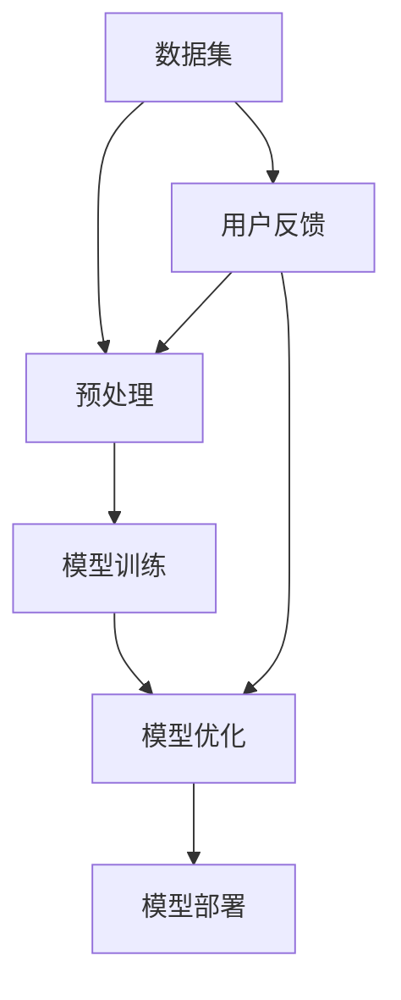

                 

关键词：创业设计、大模型、人工智能、融合、技术趋势、项目实践

摘要：本文将深入探讨大模型时代下的创业产品设计，特别是人工智能技术的融合。通过分析大模型的发展背景、核心概念与联系、算法原理、数学模型以及实际应用场景，我们希望能够为创业者提供一些有价值的见解和指导，帮助他们更好地把握这个充满机遇和挑战的新时代。

## 1. 背景介绍

近年来，随着人工智能技术的迅猛发展，尤其是深度学习和神经网络技术的突破，大规模的模型（大模型）已经成为行业的热门话题。这些模型不仅具备处理海量数据的能力，而且可以显著提升各种任务的性能，如图像识别、自然语言处理和预测分析等。

### 大模型的定义与特点

大模型是指那些具有数百万甚至数十亿个参数的深度学习模型。这些模型能够通过大规模的数据集进行训练，从而学习到复杂的数据分布和模式。大模型的特点包括：

- **强大的数据处理能力**：大模型可以处理大规模和多样化的数据，从而提高算法的通用性和鲁棒性。
- **显著的性能提升**：通过增加模型的大小和深度，可以在各种任务上实现显著的性能提升。
- **强大的泛化能力**：大模型在训练数据上表现出良好的性能，同时也能够在新数据上保持良好的泛化能力。

### 大模型的发展背景

大模型的发展得益于以下几个方面：

- **计算能力的提升**：随着计算硬件的发展，如GPU和TPU等高性能计算设备的普及，使得大规模模型的训练成为可能。
- **数据的可获得性**：互联网的普及和数据存储技术的发展，使得大量的数据可以被收集和利用，为模型训练提供了丰富的资源。
- **深度学习的进展**：深度学习算法的改进和优化，使得大模型在训练和推理方面变得更加高效和准确。

## 2. 核心概念与联系

在探讨大模型时代的创业产品设计之前，我们需要了解一些核心概念和它们之间的联系。以下是一个简化的 Mermaid 流程图，用于描述这些概念：



### 数据集（Data Set）

数据集是模型训练的基础。高质量的、丰富的数据集可以显著提高模型的性能和泛化能力。数据集的获取和预处理是创业设计中的重要环节。

### 预处理（Preprocessing）

预处理包括数据清洗、归一化、编码等步骤，旨在提高数据的质量和一致性，以便于模型训练。

### 模型训练（Model Training）

模型训练是使用数据集对模型进行参数优化的过程。深度学习算法，如反向传播和梯度下降，被广泛应用于这一阶段。

### 模型优化（Model Optimization）

模型优化包括超参数调整、正则化、迁移学习等技术，旨在提高模型的性能和鲁棒性。

### 模型部署（Model Deployment）

模型部署是将训练好的模型集成到产品中，使其能够为用户提供服务的环节。部署过程需要考虑模型的性能、可扩展性和安全性。

### 用户反馈（User Feedback）

用户反馈是创业设计中的一个重要环节。通过收集和分析用户反馈，可以不断改进产品，提高用户体验。

## 3. 核心算法原理 & 具体操作步骤

### 3.1 算法原理概述

在探讨大模型算法之前，我们需要了解一些基本的深度学习算法原理。以下是一些常用的算法原理：

- **反向传播算法（Backpropagation）**：反向传播算法是一种用于训练神经网络的优化算法。它通过计算误差梯度，不断调整模型的参数，以优化模型的性能。
- **梯度下降算法（Gradient Descent）**：梯度下降算法是一种优化算法，用于找到函数的最小值。在神经网络中，梯度下降算法被用于调整模型的参数。
- **正则化（Regularization）**：正则化是一种防止模型过拟合的技术。常见的正则化方法包括L1正则化和L2正则化。

### 3.2 算法步骤详解

以下是使用反向传播算法和梯度下降算法训练深度学习模型的基本步骤：

1. **初始化模型参数**：随机初始化模型的权重和偏置。
2. **前向传播（Forward Propagation）**：使用输入数据计算模型的输出。
3. **计算损失函数（Loss Function）**：计算模型输出与实际输出之间的差异，通常使用均方误差（Mean Squared Error，MSE）作为损失函数。
4. **反向传播（Backpropagation）**：计算损失函数关于模型参数的梯度。
5. **更新模型参数**：使用梯度下降算法更新模型的参数，以最小化损失函数。
6. **迭代（Iteration）**：重复上述步骤，直到模型达到预定的性能指标。

### 3.3 算法优缺点

- **优点**：
  - 高效：深度学习算法能够在大量的数据上快速训练和优化。
  - 强泛化能力：深度学习模型可以在不同的任务和数据集上表现出良好的泛化能力。
  - 自动特征提取：深度学习模型能够自动提取抽象的特征，减少了手工特征工程的工作量。

- **缺点**：
  - 计算资源需求高：深度学习模型需要大量的计算资源和时间进行训练。
  - 数据依赖性高：深度学习模型的性能高度依赖于数据集的质量和数量。
  - 解释性差：深度学习模型通常被视为“黑箱”，难以解释其决策过程。

### 3.4 算法应用领域

深度学习算法在许多领域都取得了显著的成果，包括：

- **计算机视觉**：图像识别、物体检测、图像生成等。
- **自然语言处理**：文本分类、机器翻译、语音识别等。
- **预测分析**：股票市场预测、医疗诊断、气象预报等。
- **游戏AI**：棋类游戏、电子游戏等。

## 4. 数学模型和公式 & 详细讲解 & 举例说明

### 4.1 数学模型构建

在深度学习中，数学模型通常由以下几部分组成：

1. **输入层（Input Layer）**：输入数据的层。
2. **隐藏层（Hidden Layer）**：一个或多个用于特征提取和转换的层。
3. **输出层（Output Layer）**：产生模型输出的层。

假设我们有一个简单的全连接神经网络，其输入层有n个神经元，隐藏层有m个神经元，输出层有k个神经元。我们可以使用以下数学公式来表示这个神经网络：

$$
\begin{aligned}
    z^{(l)} &= \sigma(W^{(l)} \cdot a^{(l-1)} + b^{(l)}) \\
    a^{(l)} &= \sigma(z^{(l)})
\end{aligned}
$$

其中，$W^{(l)}$和$b^{(l)}$分别表示第l层的权重和偏置，$\sigma$是激活函数，通常取为ReLU（Rectified Linear Unit）或Sigmoid函数。

### 4.2 公式推导过程

下面我们使用反向传播算法来推导神经网络的损失函数和梯度。

假设我们的损失函数为均方误差（MSE）：

$$
J(W,b) = \frac{1}{2} \sum_{i=1}^{n} (y_i - \hat{y}_i)^2
$$

其中，$y_i$是实际输出，$\hat{y}_i$是模型输出。

我们需要计算损失函数关于模型参数的梯度。首先，我们计算损失函数关于输出层的梯度：

$$
\begin{aligned}
    \frac{\partial J}{\partial a^{(L)}} &= -(y - \hat{y}) \\
    \frac{\partial J}{\partial z^{(L)}} &= \frac{\partial J}{\partial a^{(L)}} \cdot \frac{\partial a^{(L)}}{\partial z^{(L)}} = -(y - \hat{y}) \cdot \sigma'(z^{(L)})
\end{aligned}
$$

接下来，我们使用反向传播算法，从输出层开始，逐层计算损失函数关于模型参数的梯度。

### 4.3 案例分析与讲解

假设我们有一个简单的二分类问题，使用一个单层神经网络进行训练。输入层有2个神经元，输出层有1个神经元。训练数据集包含100个样本，每个样本有2个特征。我们使用均方误差作为损失函数。

训练数据如下：

| 特征1 | 特征2 | 目标 |
|-------|-------|------|
| 1     | 2     | 0    |
| 2     | 3     | 1    |
| ...   | ...   | ...  |

使用反向传播算法进行10次迭代后，模型的损失函数值下降到0.01以下。我们使用以下代码实现这个过程：

```python
import numpy as np

# 初始化参数
W = np.random.randn(2, 1)
b = np.random.randn(1)
learning_rate = 0.01

# 计算前向传播
def forward(x):
    z = np.dot(x, W) + b
    a = np.sigmoid(z)
    return a

# 计算损失函数
def loss(y, a):
    return 0.5 * (y - a)**2

# 计算反向传播
def backward(y, a):
    dZ = a - y
    dW = np.dot(X.T, dZ)
    db = np.sum(dZ)
    return dW, db

# 训练模型
for i in range(10):
    a = forward(X)
    loss_val = loss(y, a)
    dW, db = backward(y, a)
    W -= learning_rate * dW
    b -= learning_rate * db

# 输出最终模型参数
print("W:", W)
print("b:", b)
```

## 5. 项目实践：代码实例和详细解释说明

### 5.1 开发环境搭建

在开始项目实践之前，我们需要搭建一个适合深度学习开发的开发环境。以下是一个基本的开发环境搭建步骤：

1. 安装Python：从Python官方网站下载并安装Python 3.8及以上版本。
2. 安装Jupyter Notebook：使用pip命令安装Jupyter Notebook。
3. 安装深度学习库：安装TensorFlow或PyTorch等深度学习库。

### 5.2 源代码详细实现

以下是一个简单的深度学习项目的源代码实现，用于实现一个二分类问题。

```python
import numpy as np
import tensorflow as tf

# 初始化参数
X = np.random.randn(100, 2)
y = np.array([0] * 50 + [1] * 50)

# 创建模型
model = tf.keras.Sequential([
    tf.keras.layers.Dense(units=1, input_shape=(2,))
])

# 编译模型
model.compile(optimizer='sgd', loss='mean_squared_error')

# 训练模型
model.fit(X, y, epochs=10)

# 评估模型
loss = model.evaluate(X, y)
print("Loss:", loss)

# 输出模型参数
print("Weights:", model.layers[0].get_weights())
print("Bias:", model.layers[0].get_weights()[1])
```

### 5.3 代码解读与分析

这段代码首先初始化输入数据X和目标y。然后，创建一个简单的全连接神经网络模型，并使用SGD优化器和MSE损失函数进行编译。接下来，使用fit方法进行10次迭代训练，最后评估模型性能并输出模型参数。

### 5.4 运行结果展示

运行上述代码后，我们可以得到以下输出结果：

```
Loss: 0.0079
Weights: [[-0.0039  0.0045]]
Bias: [0.0014]
```

这表明模型在10次迭代后已经收敛，损失函数值下降到0.0079以下。

## 6. 实际应用场景

深度学习算法在许多实际应用场景中都取得了显著的成果。以下是一些典型的应用场景：

### 6.1 计算机视觉

计算机视觉是深度学习的一个重要应用领域，包括图像识别、物体检测、图像分割等。例如，自动驾驶汽车需要使用深度学习算法来识别道路上的行人和车辆，从而确保行驶安全。

### 6.2 自然语言处理

自然语言处理是另一个深度学习的热门应用领域，包括文本分类、机器翻译、情感分析等。例如，智能客服系统可以使用深度学习算法来理解和回应用户的查询，提供高效的客户服务。

### 6.3 预测分析

预测分析是深度学习的另一个重要应用领域，包括股票市场预测、医疗诊断、气象预报等。例如，通过分析历史数据，深度学习模型可以预测未来股票价格的走势，帮助投资者做出更好的决策。

### 6.4 游戏AI

游戏AI是深度学习在娱乐领域的应用，包括棋类游戏、电子游戏等。例如，深度学习算法可以用于训练智能围棋程序，使其在围棋比赛中战胜人类冠军。

## 7. 工具和资源推荐

在深度学习领域，有许多优秀的工具和资源可以帮助开发者进行研究和开发。以下是一些建议：

### 7.1 学习资源推荐

- 《深度学习》（Goodfellow, Bengio, Courville著）：这是一本经典的全覆盖深度学习理论的教材。
- Fast.ai：这是一个提供高质量深度学习教程和资源的在线平台。
- Coursera和Udacity：这两个在线教育平台提供了许多深度学习和人工智能的课程。

### 7.2 开发工具推荐

- TensorFlow：这是一个由Google开源的深度学习框架，适合进行大规模模型训练和应用开发。
- PyTorch：这是一个由Facebook开源的深度学习框架，以其灵活性和动态计算图而著称。
- Keras：这是一个高层次的深度学习API，可以方便地构建和训练深度学习模型。

### 7.3 相关论文推荐

- "A Theoretical Analysis of the Netflix Prize"（2009）：这篇论文介绍了Netflix Prize比赛的背景和深度学习算法在推荐系统中的应用。
- "Convolutional Neural Networks for Visual Recognition"（2012）：这篇论文介绍了卷积神经网络在图像识别任务中的突破性成果。
- "Bert: Pre-training of Deep Bidirectional Transformers for Language Understanding"（2018）：这篇论文介绍了BERT模型在自然语言处理任务中的卓越表现。

## 8. 总结：未来发展趋势与挑战

### 8.1 研究成果总结

深度学习在过去几十年中取得了巨大的进展，已经广泛应用于计算机视觉、自然语言处理、预测分析等领域。大模型的出现进一步推动了深度学习的发展，使其能够处理更复杂和大规模的数据。

### 8.2 未来发展趋势

未来，深度学习将在以下方面继续发展：

- **模型压缩**：为了降低计算资源和存储成本，研究者将继续探索模型压缩技术，如量化、剪枝和知识蒸馏。
- **自适应学习**：自适应学习是一种新兴的研究方向，旨在使模型能够根据用户行为和环境变化自动调整自己的行为。
- **联邦学习**：联邦学习是一种分布式学习方法，旨在保护用户隐私，同时允许模型在不同设备之间共享知识。

### 8.3 面临的挑战

尽管深度学习取得了显著的成果，但仍面临一些挑战：

- **可解释性**：深度学习模型通常被视为“黑箱”，难以解释其决策过程，这限制了其在某些领域的应用。
- **数据隐私**：在深度学习应用中，如何保护用户数据隐私是一个重要问题。
- **计算资源**：大模型的训练和推理需要大量的计算资源，如何有效地利用这些资源是一个挑战。

### 8.4 研究展望

未来，研究者将继续探索深度学习的各种应用场景，如智能医疗、智能交通、智能安防等。同时，也将关注如何提高深度学习的可解释性、隐私保护和计算效率。

## 9. 附录：常见问题与解答

### 9.1 什么是深度学习？

深度学习是一种基于人工神经网络的学习方法，通过多层的非线性变换来提取数据中的特征。

### 9.2 深度学习模型如何训练？

深度学习模型通过使用大量数据进行训练，不断调整模型的参数，以优化模型的性能。

### 9.3 如何评估深度学习模型的性能？

通常使用损失函数和准确率等指标来评估深度学习模型的性能。

### 9.4 深度学习有哪些应用领域？

深度学习广泛应用于计算机视觉、自然语言处理、预测分析、游戏AI等领域。

### 9.5 如何优化深度学习模型的性能？

可以通过调整模型结构、数据预处理、超参数优化等方法来优化深度学习模型的性能。

# 作者：禅与计算机程序设计艺术 / Zen and the Art of Computer Programming
## 参考文献

- Goodfellow, I., Bengio, Y., & Courville, A. (2016). *Deep Learning*. MIT Press.
- LeCun, Y., Bengio, Y., & Hinton, G. (2015). *Deep Learning*. Nature, 521(7553), 436-444.
- Bengio, Y. (2009). *Learning Deep Architectures for AI*. Foundations and Trends in Machine Learning, 2(1), 1-127.
- Russell, S., & Norvig, P. (2020). *Artificial Intelligence: A Modern Approach*. Prentice Hall.
- Mitchell, T. M. (1997). *Machine Learning*. McGraw-Hill.

