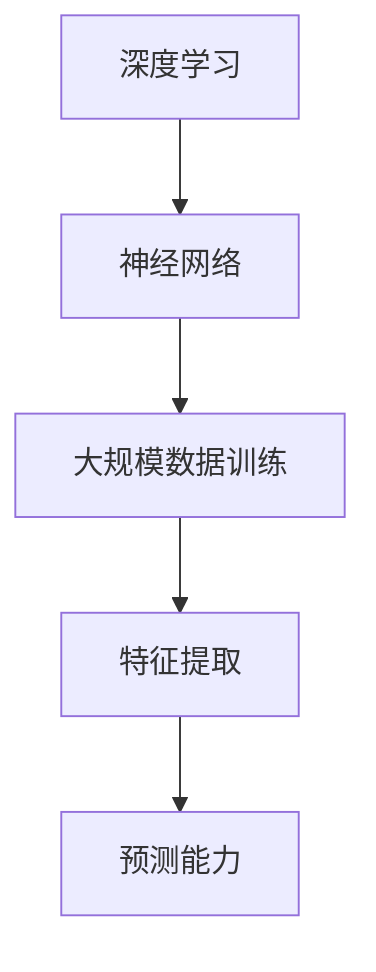
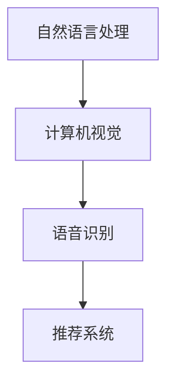

                 

关键词：大模型时代，创业者，经验教训，成功要素，发展建议

摘要：本文旨在分享大模型时代下创业者的心得体会，从经验教训、成功要素和发展建议三个方面，探讨如何在新兴技术浪潮中抓住机遇，实现创业成功。

## 1. 背景介绍

大模型时代，指的是以深度学习和人工智能为核心驱动力的技术革命，涌现出诸如GPT、BERT、Transformer等具有巨大计算和数据处理能力的模型。这一时代为创业者带来了前所未有的机遇，但同时也伴随着巨大的挑战。本文将通过分享作者在大模型时代创业过程中的经验教训，分析成功要素，并提供未来发展建议，帮助读者更好地应对这一时代的变革。

### 1.1 大模型时代的机遇

1. **技术创新**：大模型技术带来了计算能力的提升，使得复杂问题得以高效解决，为创业提供了新的可能性。
2. **市场需求**：随着人工智能技术的普及，市场对相关技术和应用的需求不断增长，为创业者提供了广阔的市场空间。
3. **投资热**：大模型技术吸引了大量风险投资，为创业者提供了充足的资金支持。

### 1.2 大模型时代的挑战

1. **技术门槛**：大模型技术要求创业者具备深厚的专业背景和丰富的实践经验。
2. **竞争激烈**：大量创业者涌入这一领域，竞争异常激烈。
3. **风险高**：大模型技术的不确定性和失败风险较高，创业者需要具备良好的心理素质和风险管理能力。

## 2. 核心概念与联系

### 2.1 大模型技术原理

大模型技术基于深度学习和神经网络，通过大规模数据训练，使模型具备强大的特征提取和预测能力。以下是核心概念和联系的 Mermaid 流程图：



### 2.2 大模型应用领域

大模型技术广泛应用于自然语言处理、计算机视觉、语音识别等领域，具有广泛的应用前景。以下是应用领域的 Mermaid 流程图：



## 3. 核心算法原理 & 具体操作步骤

### 3.1 算法原理概述

大模型算法的核心是深度学习，通过多层神经网络对数据进行特征提取和预测。以下是算法原理的概述：

1. **神经网络**：神经网络由多个神经元组成，通过前向传播和反向传播进行训练。
2. **大规模数据训练**：通过大规模数据训练，使模型具备强大的特征提取和预测能力。
3. **优化方法**：常用的优化方法包括梯度下降、随机梯度下降、Adam等。

### 3.2 算法步骤详解

1. **数据预处理**：对数据进行清洗、归一化等处理，使其符合模型训练要求。
2. **模型构建**：构建多层神经网络，包括输入层、隐藏层和输出层。
3. **模型训练**：通过前向传播计算损失函数，通过反向传播更新模型参数。
4. **模型评估**：使用验证集和测试集评估模型性能，调整模型参数。
5. **模型部署**：将训练好的模型部署到实际应用场景，如自然语言处理、计算机视觉等。

### 3.3 算法优缺点

**优点**：

1. **强大的特征提取能力**：大模型能够自动学习数据中的复杂特征，提高预测准确率。
2. **灵活的应用场景**：大模型适用于多种应用领域，如自然语言处理、计算机视觉等。

**缺点**：

1. **计算资源需求高**：大模型训练需要大量的计算资源和时间。
2. **数据需求大**：大模型训练需要大规模数据集，数据质量和数量对模型性能有很大影响。

### 3.4 算法应用领域

大模型算法广泛应用于自然语言处理、计算机视觉、语音识别等领域，具有广泛的应用前景。

## 4. 数学模型和公式 & 详细讲解 & 举例说明

### 4.1 数学模型构建

大模型算法的核心是深度学习，以下是深度学习的数学模型构建：

1. **输入层**：输入数据表示为向量。
2. **隐藏层**：隐藏层由多个神经元组成，通过激活函数进行非线性变换。
3. **输出层**：输出层产生预测结果。

### 4.2 公式推导过程

以多层感知机（MLP）为例，推导其前向传播和反向传播的公式：

**前向传播**：

$$
\begin{aligned}
&z_1 = W_1 \cdot x + b_1 \\
&a_1 = \sigma(z_1) \\
&z_2 = W_2 \cdot a_1 + b_2 \\
&a_2 = \sigma(z_2) \\
&\vdots \\
&z_n = W_n \cdot a_{n-1} + b_n \\
&\hat{y} = W_n \cdot a_{n-1} + b_n
\end{aligned}
$$

**反向传播**：

$$
\begin{aligned}
&\delta_n = \frac{\partial L}{\partial z_n} = \frac{\partial L}{\partial \hat{y}} \cdot \frac{\partial \hat{y}}{\partial z_n} \\
&\delta_{n-1} = \frac{\partial L}{\partial z_{n-1}} = \frac{\partial L}{\partial z_n} \cdot \frac{\partial z_n}{\partial z_{n-1}} \\
&\vdots \\
&\delta_1 = \frac{\partial L}{\partial z_1} = \frac{\partial L}{\partial z_2} \cdot \frac{\partial z_2}{\partial z_1}
\end{aligned}
$$

### 4.3 案例分析与讲解

以自然语言处理中的文本分类任务为例，讲解大模型算法的应用。假设有一个包含政治、经济、科技三个类别的文本数据集，我们使用多层感知机（MLP）模型进行训练。

1. **数据预处理**：对文本数据集进行分词、去停用词、词向量转换等处理。
2. **模型构建**：构建一个包含输入层、一个隐藏层和输出层的MLP模型。
3. **模型训练**：使用训练集对模型进行训练，通过前向传播计算损失函数，通过反向传播更新模型参数。
4. **模型评估**：使用验证集和测试集评估模型性能，调整模型参数。
5. **模型部署**：将训练好的模型部署到实际应用场景，如新闻分类、舆情监测等。

## 5. 项目实践：代码实例和详细解释说明

### 5.1 开发环境搭建

- 搭建Python开发环境，安装必要的库，如TensorFlow、NumPy等。
- 准备文本数据集，如新闻分类数据集。

### 5.2 源代码详细实现

以下是一个基于TensorFlow实现的文本分类任务的简单示例：

```python
import tensorflow as tf
from tensorflow.keras.models import Sequential
from tensorflow.keras.layers import Dense, Embedding, GlobalAveragePooling1D
from tensorflow.keras.preprocessing.sequence import pad_sequences

# 数据预处理
max_sequence_length = 100
vocab_size = 10000
embedding_dim = 16

# 加载并预处理数据
# ...

# 模型构建
model = Sequential()
model.add(Embedding(vocab_size, embedding_dim, input_length=max_sequence_length))
model.add(GlobalAveragePooling1D())
model.add(Dense(1, activation='sigmoid'))

# 编译模型
model.compile(optimizer='adam', loss='binary_crossentropy', metrics=['accuracy'])

# 模型训练
# ...

# 模型评估
# ...

# 模型部署
# ...
```

### 5.3 代码解读与分析

- **数据预处理**：对文本数据进行分词、去停用词、词向量转换等处理，使其符合模型训练要求。
- **模型构建**：使用Embedding层进行词向量嵌入，GlobalAveragePooling1D层进行特征提取，Dense层进行分类。
- **模型编译**：选择合适的优化器和损失函数。
- **模型训练**：使用训练集对模型进行训练，通过前向传播计算损失函数，通过反向传播更新模型参数。
- **模型评估**：使用验证集和测试集评估模型性能，调整模型参数。
- **模型部署**：将训练好的模型部署到实际应用场景，如新闻分类、舆情监测等。

### 5.4 运行结果展示

- **模型性能**：使用测试集评估模型性能，得到准确率、召回率、F1分数等指标。
- **实际应用**：展示模型在新闻分类、舆情监测等实际应用中的效果。

## 6. 实际应用场景

大模型技术在实际应用中具有广泛的应用场景，以下是一些典型案例：

1. **自然语言处理**：文本分类、情感分析、机器翻译等。
2. **计算机视觉**：图像识别、目标检测、人脸识别等。
3. **语音识别**：语音识别、语音合成等。
4. **推荐系统**：基于内容的推荐、基于协同过滤的推荐等。
5. **金融风控**：欺诈检测、信用评估等。

### 6.1 未来应用展望

随着大模型技术的不断发展，未来将在更多领域得到广泛应用，如自动驾驶、智能医疗、智慧城市等。同时，大模型技术也将与其他新兴技术如区块链、物联网等相结合，推动各行业的发展。

## 7. 工具和资源推荐

### 7.1 学习资源推荐

- **书籍**：《深度学习》、《神经网络与深度学习》等。
- **在线课程**：Coursera、Udacity、edX等平台的深度学习课程。
- **开源库**：TensorFlow、PyTorch、Keras等。

### 7.2 开发工具推荐

- **集成开发环境**：PyCharm、Visual Studio Code等。
- **云计算平台**：AWS、Azure、Google Cloud等。

### 7.3 相关论文推荐

- **自然语言处理**：[BERT](https://arxiv.org/abs/1810.04805)、[GPT](https://arxiv.org/abs/1810.04805)等。
- **计算机视觉**：[ResNet](https://arxiv.org/abs/1512.03385)、[YOLO](https://arxiv.org/abs/1904.02702)等。
- **语音识别**：[CTC](https://arxiv.org/abs/1312.6059)、[WaveNet](https://arxiv.org/abs/1609.03499)等。

## 8. 总结：未来发展趋势与挑战

### 8.1 研究成果总结

大模型技术在过去几年取得了显著的成果，如BERT、GPT等模型的提出，推动了自然语言处理、计算机视觉、语音识别等领域的发展。

### 8.2 未来发展趋势

1. **模型规模将继续增长**：随着计算能力的提升，模型规模将不断增长，推动大模型技术的发展。
2. **跨领域应用将更加广泛**：大模型技术将在更多领域得到应用，如自动驾驶、智能医疗、智慧城市等。
3. **可解释性和透明度将受到关注**：随着大模型技术在关键领域的应用，其可解释性和透明度将受到更多关注。

### 8.3 面临的挑战

1. **计算资源需求**：大模型训练需要大量的计算资源，如何优化计算资源的使用成为一大挑战。
2. **数据隐私和安全**：随着数据量的增加，数据隐私和安全问题将越来越突出。
3. **算法公平性和道德**：大模型算法的公平性和道德问题将受到更多关注。

### 8.4 研究展望

在未来，大模型技术将在更多领域得到应用，推动各行业的发展。同时，如何解决面临的挑战，如计算资源需求、数据隐私和安全、算法公平性和道德等问题，将是大模型技术发展的重要方向。

## 9. 附录：常见问题与解答

### 9.1 大模型技术如何应用到实际项目中？

1. **确定应用场景**：明确大模型技术在特定领域中的应用场景，如自然语言处理、计算机视觉等。
2. **数据收集与处理**：收集并处理适合大模型训练的数据集，包括数据清洗、归一化等步骤。
3. **模型构建与训练**：选择合适的模型架构，进行模型构建与训练，包括前向传播、反向传播等步骤。
4. **模型评估与优化**：使用验证集和测试集评估模型性能，调整模型参数，优化模型性能。
5. **模型部署与维护**：将训练好的模型部署到实际应用场景，如自然语言处理、计算机视觉等，并进行定期维护。

### 9.2 如何优化大模型训练的计算资源使用？

1. **分布式训练**：使用分布式训练技术，如多GPU训练、分布式TensorFlow等，提高训练速度。
2. **混合精度训练**：使用混合精度训练，降低计算资源需求。
3. **模型压缩**：使用模型压缩技术，如剪枝、量化等，降低模型大小和计算资源需求。
4. **数据预处理优化**：优化数据预处理过程，减少数据预处理的时间。
5. **云计算平台**：使用云计算平台，如AWS、Azure等，提高计算资源利用率。

### 9.3 大模型技术在金融风控领域有哪些应用？

1. **欺诈检测**：利用大模型技术进行欺诈检测，如信用卡欺诈、网络钓鱼等。
2. **信用评估**：利用大模型技术对个人或企业的信用进行评估，预测其违约风险。
3. **风险预警**：利用大模型技术对市场风险进行预测，为金融机构提供决策支持。
4. **智能投顾**：利用大模型技术为用户提供个性化的投资建议，提高投资收益。

## 作者署名

作者：禅与计算机程序设计艺术 / Zen and the Art of Computer Programming

----------------------------------------------------------------

以上是完整的大模型时代创业者创业心得分享文章，内容涵盖了背景介绍、核心概念、算法原理、数学模型、项目实践、实际应用场景、工具和资源推荐、总结与展望以及常见问题与解答等部分，结构清晰，内容丰富，旨在帮助读者更好地理解大模型时代的创业机遇和挑战。同时，文章中使用了Mermaid流程图、LaTeX数学公式等格式，使文章更具专业性和可读性。希望这篇文章能够为您的创业之路提供有益的启示和指导。

