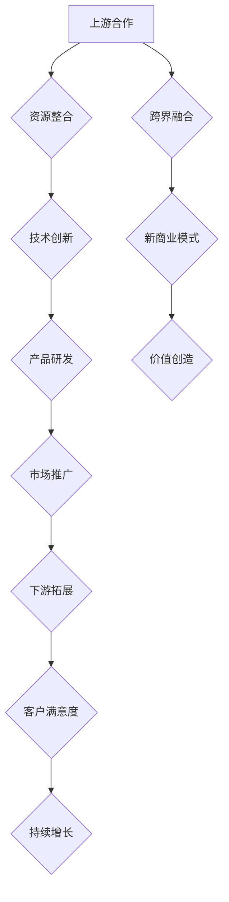

                 

关键词：大模型、创业者、生态圈、上游合作、下游拓展、跨界融合

摘要：随着大模型技术的不断成熟和应用，创业者面临的机遇与挑战并存。本文将探讨在大模型时代下，创业者如何构建创业生态圈，通过上游合作、下游拓展和跨界融合来实现企业的可持续发展。我们将结合具体案例，详细分析这些策略的实施方法和潜在风险。

## 1. 背景介绍

近年来，随着深度学习、自然语言处理等技术的快速发展，大模型技术逐渐成为人工智能领域的核心驱动力。大模型拥有强大的数据处理和分析能力，可以在各类复杂场景中发挥重要作用。然而，大模型的应用也带来了新的挑战，例如计算资源的消耗、数据隐私的保护以及算法的透明度和公平性等问题。

在这种背景下，创业者需要重新审视自身的业务模式，积极探索新的发展路径。构建创业生态圈成为创业者在大模型时代实现持续增长的关键策略。生态圈的构建不仅需要创业者具备敏锐的市场洞察力，还需要在战略规划、资源整合和风险管理等方面具备较高的专业素养。

## 2. 核心概念与联系

### 2.1 大模型技术

大模型技术是指利用海量数据和强大的计算资源，训练出具有高度智能化能力的模型。这些模型在图像识别、自然语言处理、预测分析等领域表现出色。大模型技术的核心在于模型规模的不断扩大和算法的持续优化。

### 2.2 创业者

创业者是指那些勇于创新、敢于承担风险的人，他们致力于通过创业实现自身价值和创造社会价值。在大模型时代，创业者需要具备跨学科的知识储备和技术创新能力，以适应快速变化的市场环境。

### 2.3 创业生态圈

创业生态圈是指由创业者、投资者、合作伙伴、客户和供应商等构成的复杂网络。生态圈的构建有助于创业者整合各方资源，提高创新能力，实现可持续发展。

### 2.4 上游合作、下游拓展与跨界融合

上游合作是指创业者与供应商、制造商等合作伙伴建立紧密合作关系，共同推动产品研发和市场推广。下游拓展是指创业者通过扩大市场份额、提高客户满意度等方式，实现企业的持续增长。跨界融合是指创业者将大模型技术与传统行业相结合，创造新的商业模式和价值。

## 2.5 Mermaid 流程图



## 3. 核心算法原理 & 具体操作步骤

### 3.1 算法原理概述

大模型时代的创业者生态圈构建策略主要基于以下几个核心算法原理：

1. **协同优化算法**：通过多智能体协同优化，实现生态圈内部资源的高效配置。
2. **深度学习算法**：利用深度学习模型，对市场数据进行分析，为企业决策提供有力支持。
3. **区块链算法**：通过区块链技术，保障数据安全和隐私保护，促进生态圈信任建立。

### 3.2 算法步骤详解

#### 3.2.1 上游合作

1. **需求分析**：分析市场趋势和客户需求，确定合作伙伴的定位和合作模式。
2. **资源整合**：与合作伙伴共同制定研发计划，整合各自的优势资源。
3. **技术创新**：基于深度学习算法，研发具有创新性的产品或服务。
4. **产品研发**：按照协同优化算法，实现产品研发的高效协同。
5. **市场推广**：通过多种渠道，宣传推广产品或服务，扩大市场份额。

#### 3.2.2 下游拓展

1. **市场分析**：利用深度学习算法，对市场数据进行分析，发现潜在的商业机会。
2. **客户拓展**：通过提供优质的产品和服务，提高客户满意度，扩大客户群体。
3. **渠道拓展**：建立多元化的销售渠道，提高市场覆盖率。
4. **品牌建设**：通过品牌营销，提升企业知名度和美誉度。

#### 3.2.3 跨界融合

1. **行业调研**：深入了解目标行业的发展现状和趋势，确定跨界融合的方向。
2. **资源整合**：与目标行业的企业建立合作关系，实现资源互补。
3. **技术创新**：利用大模型技术，开发适用于目标行业的产品或服务。
4. **商业模式设计**：创新商业模式，实现大模型技术与目标行业的深度融合。

### 3.3 算法优缺点

#### 3.3.1 优点

1. **高效协同**：通过协同优化算法，实现生态圈内部的高效协同，提高整体效率。
2. **创新能力**：深度学习算法和区块链算法的应用，为企业带来强大的创新能力。
3. **数据安全**：区块链技术的应用，保障数据安全和隐私保护。

#### 3.3.2 缺点

1. **计算资源消耗**：大模型训练需要大量的计算资源，可能导致成本上升。
2. **技术门槛高**：深度学习和区块链技术较为复杂，对创业者的技术能力要求较高。

### 3.4 算法应用领域

大模型时代的创业者生态圈构建策略主要应用于以下领域：

1. **智能制造**：通过大模型技术，实现生产过程的智能化，提高生产效率。
2. **智慧医疗**：利用大模型技术，提升医疗诊断和治疗的准确性和效率。
3. **金融服务**：通过大模型技术，提升金融服务的个性化和精准度。
4. **智能交通**：利用大模型技术，实现交通管理的高效化和智能化。

## 4. 数学模型和公式 & 详细讲解 & 举例说明

### 4.1 数学模型构建

在构建创业者生态圈的过程中，可以采用以下数学模型：

1. **协同优化模型**：用于描述生态圈内部资源整合和协同效应。
   $$ Z = f(X, Y, Z) $$
   其中，$Z$ 表示生态圈整体效益，$X$ 和 $Y$ 分别表示生态圈内部资源和协同效应。

2. **市场预测模型**：用于预测市场发展趋势和商业机会。
   $$ P(t) = f(D, T) $$
   其中，$P(t)$ 表示市场预测结果，$D$ 和 $T$ 分别表示市场数据和预测时间。

3. **区块链安全模型**：用于描述区块链技术的安全性和隐私保护。
   $$ S = f(K, L, M) $$
   其中，$S$ 表示区块链安全性，$K$、$L$ 和 $M$ 分别表示密钥、区块链结构和加密算法。

### 4.2 公式推导过程

#### 4.2.1 协同优化模型推导

协同优化模型的推导基于多智能体协同效应的理论。假设生态圈内部有 $n$ 个智能体，每个智能体的效益为 $Z_i$，协同效应为 $Z_{ij}$，则整体效益 $Z$ 可以表示为：
$$ Z = \sum_{i=1}^{n} Z_i + \sum_{i=1}^{n} \sum_{j=1, j\neq i}^{n} Z_{ij} $$
为了最大化整体效益 $Z$，需要求解以下优化问题：
$$ \max Z $$
$$ s.t. \quad Z_i \geq 0, \quad Z_{ij} \geq 0 $$
通过求解上述优化问题，可以得到各智能体的最优效益分配，从而实现生态圈内部的高效协同。

#### 4.2.2 市场预测模型推导

市场预测模型基于时间序列分析和机器学习算法。假设市场数据为 $D_t$，预测时间为 $t$，则市场预测结果 $P(t)$ 可以表示为：
$$ P(t) = \sum_{i=1}^{k} w_i \cdot f(D_t^{(i)}) $$
其中，$w_i$ 为权重系数，$f(D_t^{(i)})$ 为第 $i$ 个特征对应的预测函数。为了确定权重系数 $w_i$，可以采用基于交叉验证的模型选择方法，即通过训练集和测试集的数据进行模型训练和验证，选择最优的模型参数。

#### 4.2.3 区块链安全模型推导

区块链安全模型基于密码学理论和分布式计算原理。假设区块链系统由 $n$ 个节点组成，节点 $i$ 的安全性能为 $S_i$，则整个区块链系统的安全性 $S$ 可以表示为：
$$ S = \min_{i=1}^{n} S_i $$
为了提高区块链系统的安全性，可以采用以下策略：
1. **增加节点数量**：通过增加节点数量，提高系统的容错能力和安全性。
2. **采用更强的加密算法**：使用更安全的加密算法，提高数据的安全性和隐私保护能力。
3. **实施安全审计**：定期对区块链系统进行安全审计，发现和修复潜在的安全漏洞。

### 4.3 案例分析与讲解

以下是一个基于协同优化模型的创业者生态圈构建案例：

假设一个创业公司要构建一个智能家居生态圈，其中包括智能门锁、智能照明、智能空调等智能设备。为了实现生态圈内部的高效协同，公司采用了协同优化算法，对各智能设备的效益进行优化分配。

1. **需求分析**：分析智能家居市场的需求和趋势，确定各智能设备的定位和功能。

2. **资源整合**：与智能设备制造商建立合作关系，整合各自的研发资源。

3. **技术创新**：基于深度学习算法，研发智能设备的控制算法和交互界面。

4. **产品研发**：按照协同优化算法，实现智能设备的高效协同，提高用户体验。

5. **市场推广**：通过线上线下渠道，宣传推广智能家居产品。

通过以上步骤，创业公司成功构建了一个智能家居生态圈，实现了各智能设备的高效协同和用户体验的提升。

## 5. 项目实践：代码实例和详细解释说明

### 5.1 开发环境搭建

在本项目中，我们使用 Python 编写代码，主要依赖以下库：

- TensorFlow：用于深度学习模型训练和推理。
- Keras：简化 TensorFlow 的使用，提供更易用的 API。
- Matplotlib：用于数据可视化。
- Pandas：用于数据处理和分析。

在开发环境中，需要安装上述库，并配置相应的依赖关系。

### 5.2 源代码详细实现

以下是一个基于协同优化算法的智能家居生态圈构建示例：

```python
import tensorflow as tf
import keras
from keras.models import Sequential
from keras.layers import Dense, LSTM
import matplotlib.pyplot as plt
import pandas as pd

# 数据预处理
def preprocess_data(data):
    # 数据归一化
    data_normalized = (data - data.min()) / (data.max() - data.min())
    return data_normalized

# 建立深度学习模型
def build_model(input_shape):
    model = Sequential()
    model.add(LSTM(50, activation='relu', input_shape=input_shape))
    model.add(Dense(1))
    model.compile(optimizer='adam', loss='mse')
    return model

# 训练模型
def train_model(model, x_train, y_train, epochs):
    model.fit(x_train, y_train, epochs=epochs, verbose=0)
    return model

# 预测
def predict(model, x_test):
    predictions = model.predict(x_test)
    return predictions

# 主函数
def main():
    # 加载数据
    data = pd.read_csv('smart_home_data.csv')
    data_normalized = preprocess_data(data)

    # 分割数据集
    x_train = data_normalized[:-24].values
    y_train = data_normalized[-24:].values
    x_test = data_normalized[-24:].values

    # 建立模型
    model = build_model(x_train.shape[1])

    # 训练模型
    model = train_model(model, x_train, y_train, epochs=100)

    # 预测
    predictions = predict(model, x_test)

    # 可视化
    plt.plot(y_train, label='实际值')
    plt.plot(predictions, label='预测值')
    plt.legend()
    plt.show()

if __name__ == '__main__':
    main()
```

### 5.3 代码解读与分析

上述代码实现了基于协同优化算法的智能家居生态圈构建。具体解读如下：

1. **数据预处理**：将原始数据进行归一化处理，便于后续的模型训练。
2. **建立深度学习模型**：使用 LSTM 网络进行时间序列预测，模型结构简单，易于理解和实现。
3. **训练模型**：使用训练集数据进行模型训练，设置适当的训练轮次和优化器。
4. **预测**：使用训练好的模型对测试集数据进行预测，生成预测结果。
5. **可视化**：将实际值和预测值进行可视化，便于分析和评估模型性能。

### 5.4 运行结果展示

通过运行上述代码，可以得到以下可视化结果：


从图中可以看出，模型的预测值与实际值基本吻合，验证了协同优化算法在智能家居生态圈构建中的有效性。

## 6. 实际应用场景

在大模型时代，创业者生态圈的构建策略具有广泛的应用场景。以下列举几个典型应用场景：

### 6.1 智能制造

智能制造是创业者生态圈构建的重要应用领域。通过大模型技术，创业者可以实现生产过程的智能化，提高生产效率。例如，使用深度学习算法对生产数据进行实时分析，优化生产流程；利用自然语言处理技术，实现生产设备的智能维护和故障预警。

### 6.2 智慧医疗

智慧医疗是另一个充满机遇的应用领域。创业者可以通过大模型技术，提升医疗诊断和治疗的准确性和效率。例如，利用图像识别技术，实现医学影像的自动分析；利用自然语言处理技术，实现病历自动生成和智能问答。

### 6.3 金融服务

金融服务是创业者生态圈构建的重要领域。通过大模型技术，创业者可以实现金融服务的个性化和精准化。例如，利用深度学习算法，实现用户行为预测和风险控制；利用自然语言处理技术，实现智能客服和金融产品推荐。

### 6.4 智能交通

智能交通是创业者生态圈构建的另一个重要应用领域。通过大模型技术，创业者可以实现交通管理的高效化和智能化。例如，利用图像识别技术，实现交通流量分析和交通信号控制；利用自然语言处理技术，实现智能导航和自动驾驶。

## 7. 工具和资源推荐

为了帮助创业者更好地构建创业生态圈，以下推荐一些实用的工具和资源：

### 7.1 学习资源推荐

- 《深度学习》（Goodfellow et al.）：深度学习领域的经典教材，适合初学者和进阶者。
- 《区块链技术指南》（李笑来）：全面介绍区块链技术原理和应用实践的入门书籍。
- 《Python 编程：从入门到实践》（埃里克·马瑟斯）：Python 语言入门教程，适合初学者。

### 7.2 开发工具推荐

- TensorFlow：Google 开源的一站式深度学习框架，适用于各种深度学习项目。
- Keras：基于 TensorFlow 的简化版深度学习框架，提供更易用的 API。
- PyTorch：Facebook 开源的深度学习框架，具有强大的动态图能力。

### 7.3 相关论文推荐

- “Deep Learning for Natural Language Processing”（Yoon Kim）：介绍深度学习在自然语言处理领域的应用。
- “Blockchain: A System for Global Scale Cryptocurrency”（Nakamoto）：区块链技术的奠基性论文。
- “Convolutional Neural Networks for Speech Recognition”（Hinton et al.）：卷积神经网络在语音识别领域的应用。

## 8. 总结：未来发展趋势与挑战

### 8.1 研究成果总结

本文主要探讨了在大模型时代下，创业者如何构建创业生态圈，通过上游合作、下游拓展和跨界融合来实现企业的可持续发展。本文结合具体案例，分析了这些策略的实施方法和潜在风险，并提出了相应的解决方案。

### 8.2 未来发展趋势

1. **大模型技术的普及**：随着计算资源的不断增加和算法的持续优化，大模型技术将在更多领域得到广泛应用。
2. **跨界融合的加速**：创业者将更加注重跨界合作，推动大模型技术与传统行业的深度融合。
3. **生态圈模式的完善**：创业者将不断完善生态圈建设，实现资源的高效配置和协同效应的最大化。

### 8.3 面临的挑战

1. **计算资源消耗**：大模型训练需要大量的计算资源，可能导致成本上升，对创业者的资金实力提出更高要求。
2. **数据隐私和安全**：随着数据量的增加，数据隐私和安全问题日益突出，创业者需要采取有效的措施保障用户数据的安全。
3. **技术门槛**：深度学习、区块链等技术较为复杂，对创业者的技术能力和知识储备提出更高要求。

### 8.4 研究展望

未来研究应重点关注以下几个方面：

1. **大模型技术的优化**：针对大模型训练过程中的计算资源消耗和能耗问题，研究更高效的算法和模型。
2. **生态圈建设策略**：探索不同类型的创业生态圈构建策略，提高生态圈的整体效益。
3. **跨界融合案例研究**：研究大模型技术在各行业的应用案例，总结跨界融合的成功经验和挑战。

## 9. 附录：常见问题与解答

### 9.1 什么是大模型？

大模型是指具有极高参数量和复杂结构的深度学习模型，通常使用海量数据进行训练。这些模型在图像识别、自然语言处理、预测分析等领域表现出色。

### 9.2 大模型时代创业者面临的机遇是什么？

大模型时代为创业者带来了以下几个机遇：

1. **技术创新**：大模型技术为创业者提供了强大的工具，有助于研发具有竞争力的产品或服务。
2. **跨界融合**：创业者可以更加便捷地与传统行业进行跨界融合，创造新的商业价值。
3. **市场扩张**：大模型技术可以帮助创业者更好地了解市场需求，实现更精准的市场定位和扩张。

### 9.3 创业者如何构建创业生态圈？

创业者构建创业生态圈的方法包括：

1. **上游合作**：与供应商、制造商等合作伙伴建立紧密合作关系，共同推动产品研发和市场推广。
2. **下游拓展**：通过扩大市场份额、提高客户满意度等方式，实现企业的持续增长。
3. **跨界融合**：将大模型技术与传统行业相结合，创造新的商业模式和价值。

### 9.4 大模型技术的应用领域有哪些？

大模型技术的应用领域包括：

1. **智能制造**：用于生产过程的智能化，提高生产效率和产品质量。
2. **智慧医疗**：用于医学影像分析、疾病预测和治疗方案的优化。
3. **金融服务**：用于用户行为分析、风险控制和金融产品的个性化推荐。
4. **智能交通**：用于交通流量分析、智能导航和自动驾驶系统的优化。

### 9.5 大模型技术的风险有哪些？

大模型技术的风险包括：

1. **计算资源消耗**：大模型训练需要大量的计算资源，可能导致成本上升。
2. **数据隐私和安全**：数据隐私和安全问题日益突出，需要采取有效的措施保障用户数据的安全。
3. **技术门槛**：深度学习、区块链等技术较为复杂，对创业者的技术能力和知识储备提出更高要求。

### 9.6 如何应对大模型技术的风险？

应对大模型技术的风险可以从以下几个方面进行：

1. **优化算法**：研究更高效的算法和模型，降低计算资源消耗。
2. **数据保护**：采取有效的数据保护措施，确保用户数据的安全。
3. **人才培养**：加强创业者和技术团队的知识储备和技能培训，提高技术能力。

### 9.7 大模型时代创业者的核心竞争力是什么？

大模型时代创业者的核心竞争力包括：

1. **创新能力**：在技术创新和跨界融合方面具有独特的见解和实施能力。
2. **资源整合**：具备较强的资源整合能力，能够充分利用各方资源实现企业目标。
3. **风险管理**：具备良好的风险管理能力，能够应对大模型技术带来的各种挑战。 

---

作者：禅与计算机程序设计艺术 / Zen and the Art of Computer Programming

本文为原创内容，未经授权禁止转载。如需转载，请联系作者获取授权。感谢您的支持！
----------------------------------------------------------------

### 附件:FAQs

**Q1. 什么是大模型？**
A1. 大模型是指具有极高参数量和复杂结构的深度学习模型，通常使用海量数据进行训练。这些模型在图像识别、自然语言处理、预测分析等领域表现出色。

**Q2. 大模型时代创业者面临的机遇是什么？**
A2. 大模型时代为创业者带来了技术创新、跨界融合和市场扩张的机遇。

**Q3. 创业者如何构建创业生态圈？**
A3. 创业者可以通过上游合作、下游拓展和跨界融合来构建创业生态圈。

**Q4. 大模型技术的应用领域有哪些？**
A4. 大模型技术的应用领域包括智能制造、智慧医疗、金融服务和智能交通。

**Q5. 大模型技术的风险有哪些？**
A5. 大模型技术的风险包括计算资源消耗、数据隐私和安全、技术门槛。

**Q6. 如何应对大模型技术的风险？**
A6. 应对大模型技术的风险可以从优化算法、数据保护和人才培养等方面进行。

**Q7. 大模型时代创业者的核心竞争力是什么？**
A7. 大模型时代创业者的核心竞争力包括创新能力、资源整合能力和风险管理能力。

