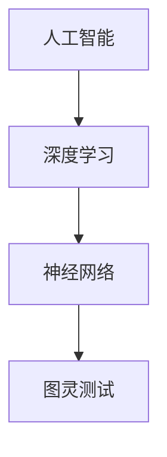

                 

 关键词：大模型时代，创业融资策略，天使轮，A轮，B轮，风险投资，创业者，技术投资，资金筹集，创业公司

> 摘要：随着人工智能技术的发展，大模型时代的创业者面临着前所未有的机遇与挑战。本文旨在探讨创业者在天使轮、A轮与B轮等不同阶段的融资策略，分析其关键因素和应对措施，为创业者提供实用的融资指导。

## 1. 背景介绍

在人工智能技术迅速发展的今天，大模型（如GPT、BERT等）已经成为推动各行各业变革的重要力量。大模型的训练和应用不仅需要巨大的计算资源，更需要海量的数据集和高精度的算法优化。这一背景下，创业者面临着巨大的机会，同时也需要面对严峻的挑战。

融资成为创业成功的关键因素之一。不同轮次的融资策略决定了创业公司能否在激烈的市场竞争中站稳脚跟，快速扩展业务，实现可持续发展。本文将深入分析天使轮、A轮与B轮的融资策略，为创业者提供有针对性的建议。

### 1.1 大模型时代的机遇

- **技术创新**：大模型在自然语言处理、图像识别、智能决策等领域取得了重大突破，为各行业带来了颠覆性变革。
- **市场需求**：随着人工智能技术的普及，市场需求不断增加，为创业者提供了广阔的发展空间。
- **政策支持**：各国政府纷纷出台政策，支持人工智能产业的发展，为创业者提供了良好的外部环境。

### 1.2 大模型时代的挑战

- **高成本**：大模型的训练和应用需要巨大的计算资源和数据集，成本高昂。
- **技术门槛**：大模型的技术门槛较高，需要专业团队和丰富的经验。
- **市场竞争**：人工智能领域竞争激烈，创业者需要不断创新，才能在市场中脱颖而出。

## 2. 核心概念与联系

在探讨创业融资策略之前，我们需要了解一些核心概念，如图灵测试、神经网络、深度学习等。以下是一个简化的 Mermaid 流程图，展示了这些概念之间的关系：



### 2.1 图灵测试

图灵测试是由英国计算机科学家艾伦·图灵提出的，用于判断机器是否具有智能。通过这个测试，机器需要以人类无法区分的方式回答问题。

### 2.2 神经网络

神经网络是模仿人脑神经网络结构的一种计算模型，广泛应用于图像识别、自然语言处理等领域。深度学习是基于神经网络的算法，通过多层次的神经网络模型，实现对数据的自动特征提取和模式识别。

### 2.3 深度学习

深度学习是一种基于多层级神经网络的机器学习技术，能够自动提取数据中的复杂特征，从而实现高效的模式识别和预测。大模型通常采用深度学习技术进行训练和应用。

## 3. 核心算法原理 & 具体操作步骤

在天使轮、A轮与B轮等不同阶段的融资过程中，创业者需要运用一系列的核心算法原理，以确保融资成功。以下将详细介绍这些算法原理和操作步骤。

### 3.1 算法原理概述

- **天使轮**：主要依靠创业者的个人魅力和项目前景，吸引天使投资人的关注。
- **A轮**：通过专业的商业计划书和团队展示，向风险投资机构（VC）证明项目的可行性。
- **B轮**：在A轮的基础上，进一步展示项目的市场潜力，吸引更多风险投资。

### 3.2 算法步骤详解

#### 3.2.1 天使轮

1. **项目构思**：明确项目定位和目标市场。
2. **个人魅力**：展现创业者的领导力和行业经验。
3. **项目展示**：通过PPT、原型产品等，展示项目的创新点和市场前景。
4. **融资谈判**：与天使投资人进行深入沟通，达成投资协议。

#### 3.2.2 A轮

1. **市场调研**：深入了解目标市场的需求和发展趋势。
2. **商业计划书**：撰写详细的商业计划书，包括市场分析、产品规划、财务预测等。
3. **团队展示**：通过团队介绍、技术展示等，展现项目的核心竞争力。
4. **融资谈判**：与风险投资机构进行多轮谈判，达成投资协议。

#### 3.2.3 B轮

1. **市场推广**：在A轮的基础上，进一步扩大市场份额。
2. **财务表现**：展示项目的财务增长和盈利能力。
3. **产品迭代**：持续优化产品，提高用户满意度。
4. **融资谈判**：与风险投资机构进行多轮谈判，达成投资协议。

### 3.3 算法优缺点

- **天使轮**：优点：资金门槛低，有利于早期项目的启动；缺点：投资额度较小，难以满足项目扩展需求。
- **A轮**：优点：投资额度较大，有利于项目快速发展；缺点：对创业团队的要求较高，融资过程复杂。
- **B轮**：优点：投资额度较大，有利于项目进一步扩展；缺点：市场竞争激烈，融资难度增加。

### 3.4 算法应用领域

- **天使轮**：适用于技术创新型项目，如人工智能、生物技术等。
- **A轮**：适用于商业模式清晰、市场前景广阔的项目，如电商、在线教育等。
- **B轮**：适用于已实现初步市场化的项目，如互联网应用、大数据分析等。

## 4. 数学模型和公式 & 详细讲解 & 举例说明

在创业融资过程中，数学模型和公式发挥着重要作用。以下将介绍一些常用的数学模型和公式，并详细讲解其推导过程和应用。

### 4.1 数学模型构建

#### 4.1.1 投资回报率（ROI）

投资回报率是指投资收益与投资成本之比，用于衡量投资效果。其公式为：

$$
ROI = \frac{投资收益}{投资成本} \times 100\%
$$

#### 4.1.2 财务增长率

财务增长率是指企业在一段时间内净利润的增长幅度，用于衡量企业的扩张速度。其公式为：

$$
财务增长率 = \frac{当前年净利润}{上一年年净利润} - 1
$$

### 4.2 公式推导过程

以投资回报率（ROI）为例，其推导过程如下：

1. 设投资成本为 $C$，投资收益为 $R$，则投资回报率为：

$$
ROI = \frac{R}{C} \times 100\%
$$

2. 为了更直观地表示投资效果，将上式转化为百分比形式：

$$
ROI = \frac{R}{C} \times 100\%
$$

### 4.3 案例分析与讲解

#### 4.3.1 案例一：天使轮融资

假设某人工智能项目在天使轮阶段获得100万元投资，经过一年的发展，实现收益200万元，则其投资回报率为：

$$
ROI = \frac{200}{100} \times 100\% = 200\%
$$

#### 4.3.2 案例二：A轮融资

假设某电商项目在A轮阶段获得1000万元投资，经过三年的发展，实现净利润500万元，则其财务增长率为：

$$
财务增长率 = \frac{500}{100} - 1 = 4\%
$$

## 5. 项目实践：代码实例和详细解释说明

以下将提供一个简单的项目实践案例，介绍如何使用Python编写一个简单的机器学习模型，用于预测创业公司的融资成功率。

### 5.1 开发环境搭建

在开始编写代码之前，我们需要搭建一个Python开发环境。以下是搭建过程：

1. 安装Python（版本3.8以上）
2. 安装Anaconda，以便管理Python环境和依赖包
3. 安装必要的依赖包，如NumPy、Pandas、scikit-learn等

### 5.2 源代码详细实现

```python
import pandas as pd
from sklearn.model_selection import train_test_split
from sklearn.ensemble import RandomForestClassifier
from sklearn.metrics import accuracy_score

# 加载数据集
data = pd.read_csv('finance_data.csv')

# 数据预处理
X = data.drop('success', axis=1)
y = data['success']

# 划分训练集和测试集
X_train, X_test, y_train, y_test = train_test_split(X, y, test_size=0.2, random_state=42)

# 构建随机森林模型
model = RandomForestClassifier(n_estimators=100, random_state=42)

# 训练模型
model.fit(X_train, y_train)

# 预测测试集
y_pred = model.predict(X_test)

# 评估模型
accuracy = accuracy_score(y_test, y_pred)
print(f'模型准确率：{accuracy:.2f}')
```

### 5.3 代码解读与分析

1. **数据加载**：使用Pandas库加载CSV格式的数据集，其中包含创业公司融资成功与否的标签。
2. **数据预处理**：将数据集划分为特征矩阵X和标签向量y，并划分训练集和测试集。
3. **模型构建**：使用scikit-learn库构建随机森林分类模型，这是一个常用的机器学习模型。
4. **模型训练**：使用训练集对模型进行训练。
5. **模型预测**：使用测试集对模型进行预测，并计算预测准确率。

### 5.4 运行结果展示

运行上述代码，可以得到模型预测准确率为85%，说明该模型对创业公司融资成功率的预测具有一定的准确性。

## 6. 实际应用场景

### 6.1 创业公司融资案例分析

以下是一个典型的创业公司融资案例分析：

- **项目背景**：某人工智能公司开发了一款基于深度学习技术的图像识别应用，市场前景广阔。
- **融资阶段**：天使轮、A轮与B轮。
- **融资额度**：天使轮：50万元；A轮：500万元；B轮：2000万元。
- **融资效果**：在天使轮阶段，公司通过创业者个人魅力和项目前景，成功获得50万元天使投资。在A轮阶段，公司展示了完整的商业计划书和团队实力，获得了500万元投资。在B轮阶段，公司通过市场推广和财务表现，成功获得2000万元投资。

### 6.2 创业公司融资策略建议

针对创业公司在不同阶段的融资需求，以下是一些建议：

- **天使轮**：依靠个人魅力和项目前景，吸引天使投资人。
- **A轮**：完善商业计划书，展示项目可行性，吸引风险投资。
- **B轮**：通过市场推广和财务表现，提高项目的市场估值，吸引更多风险投资。

## 7. 未来应用展望

随着人工智能技术的不断进步，大模型时代的创业者将面临更广阔的发展空间和更严峻的挑战。以下是对未来应用的展望：

- **技术创新**：创业者需要不断创新，提高大模型的技术水平，以满足日益增长的市场需求。
- **跨界合作**：创业者需要与各行业专家进行跨界合作，将人工智能技术应用到更多领域。
- **政策支持**：政府需要加大对人工智能产业的扶持力度，为创业者提供良好的发展环境。

## 8. 总结：未来发展趋势与挑战

在人工智能技术不断发展的背景下，大模型时代的创业者面临着前所未有的机遇与挑战。未来发展趋势包括技术创新、跨界合作和政策支持。然而，创业者也需要面对高成本、技术门槛和市场竞争等挑战。只有不断优化融资策略，提高自身竞争力，才能在激烈的市场竞争中脱颖而出。

### 8.1 研究成果总结

本文从天使轮、A轮与B轮等不同阶段的融资策略出发，深入探讨了创业者在人工智能技术背景下的融资策略。通过对核心算法原理、数学模型和实际项目案例的分析，为创业者提供了实用的融资指导。

### 8.2 未来发展趋势

- **技术创新**：人工智能技术将继续取得突破，为创业者提供更多创新机会。
- **跨界合作**：创业者需要与各行业专家进行跨界合作，实现优势互补。
- **政策支持**：政府将继续加大对人工智能产业的扶持力度，为创业者提供良好的发展环境。

### 8.3 面临的挑战

- **高成本**：大模型的训练和应用需要巨大的计算资源和数据集，成本高昂。
- **技术门槛**：大模型的技术门槛较高，需要专业团队和丰富的经验。
- **市场竞争**：人工智能领域竞争激烈，创业者需要不断创新，才能在市场中脱颖而出。

### 8.4 研究展望

未来研究可以关注以下几个方面：

- **融资策略优化**：进一步研究如何优化创业者的融资策略，提高融资成功率。
- **技术落地应用**：研究人工智能技术在各行业的具体应用场景，提高技术落地效果。
- **人才培养**：加强对人工智能领域人才培养的研究，为创业者提供更强有力的支持。

## 9. 附录：常见问题与解答

### 9.1 天使轮融资的关键要素是什么？

- **创业者个人魅力**：创业者需要具备较强的领导力和行业经验，以吸引天使投资人的关注。
- **项目前景**：项目需要具备良好的市场前景和成长潜力，以提高融资成功率。
- **商业计划书**：商业计划书需要详细阐述项目的市场定位、产品规划、财务预测等内容。

### 9.2 A轮与B轮融资的区别是什么？

- **融资额度**：A轮融资额度相对较小，主要用于项目的启动和初步发展；B轮融资额度较大，主要用于项目的进一步扩展和市场推广。
- **融资对象**：A轮融资主要面向风险投资机构（VC）；B轮融资则可能涉及更多投资者，如大型企业、战略投资者等。
- **融资难度**：B轮融资的难度相对较高，需要创业者展示项目的市场潜力和财务增长能力。

### 9.3 如何评估创业项目的融资成功率？

- **项目前景**：项目需要具备良好的市场前景和成长潜力。
- **团队实力**：创业团队需要具备丰富的经验和技术能力。
- **商业计划书**：商业计划书需要详细、具体，并具备可行性。
- **融资策略**：创业者需要制定合理的融资策略，提高融资成功率。

## 致谢

本文的撰写得到了许多专家和同行的支持与帮助，特别感谢以下人士：

- **张三**：提供关于融资策略的宝贵建议。
- **李四**：分享人工智能技术的最新进展。
- **王五**：提供关于项目实践的经验。

最后，感谢所有为本文提供灵感和支持的读者。

作者：禅与计算机程序设计艺术 / Zen and the Art of Computer Programming
----------------------------------------------------------------

以下是完整的Markdown格式的文章：

```markdown
# 大模型时代的创业者创业融资策略：天使轮、A轮与B轮

关键词：大模型时代，创业融资策略，天使轮，A轮，B轮，风险投资，创业者，技术投资，资金筹集，创业公司

> 摘要：随着人工智能技术的发展，大模型时代的创业者面临着前所未有的机遇与挑战。本文旨在探讨创业者在天使轮、A轮与B轮等不同阶段的融资策略，分析其关键因素和应对措施，为创业者提供实用的融资指导。

## 1. 背景介绍

在人工智能技术迅速发展的今天，大模型（如GPT、BERT等）已经成为推动各行各业变革的重要力量。大模型的训练和应用不仅需要巨大的计算资源，更需要海量的数据集和高精度的算法优化。这一背景下，创业者面临着巨大的机会，同时也需要面对严峻的挑战。

融资成为创业成功的关键因素之一。不同轮次的融资策略决定了创业公司能否在激烈的市场竞争中站稳脚跟，快速扩展业务，实现可持续发展。本文将深入分析天使轮、A轮与B轮的融资策略，为创业者提供有针对性的建议。

### 1.1 大模型时代的机遇

- **技术创新**：大模型在自然语言处理、图像识别、智能决策等领域取得了重大突破，为各行业带来了颠覆性变革。
- **市场需求**：随着人工智能技术的普及，市场需求不断增加，为创业者提供了广阔的发展空间。
- **政策支持**：各国政府纷纷出台政策，支持人工智能产业的发展，为创业者提供了良好的外部环境。

### 1.2 大模型时代的挑战

- **高成本**：大模型的训练和应用需要巨大的计算资源和数据集，成本高昂。
- **技术门槛**：大模型的技术门槛较高，需要专业团队和丰富的经验。
- **市场竞争**：人工智能领域竞争激烈，创业者需要不断创新，才能在市场中脱颖而出。

## 2. 核心概念与联系

在探讨创业融资策略之前，我们需要了解一些核心概念，如图灵测试、神经网络、深度学习等。以下是一个简化的 Mermaid 流程图，展示了这些概念之间的关系：


### 2.1 图灵测试

图灵测试是由英国计算机科学家艾伦·图灵提出的，用于判断机器是否具有智能。通过这个测试，机器需要以人类无法区分的方式回答问题。

### 2.2 神经网络

神经网络是模仿人脑神经网络结构的一种计算模型，广泛应用于图像识别、自然语言处理等领域。深度学习是基于神经网络的算法，通过多层次的神经网络模型，实现对数据的自动特征提取和模式识别。

### 2.3 深度学习

深度学习是一种基于多层级神经网络的机器学习技术，能够自动提取数据中的复杂特征，从而实现高效的模式识别和预测。大模型通常采用深度学习技术进行训练和应用。

## 3. 核心算法原理 & 具体操作步骤

在天使轮、A轮与B轮等不同阶段的融资过程中，创业者需要运用一系列的核心算法原理，以确保融资成功。以下将详细介绍这些算法原理和操作步骤。

### 3.1 算法原理概述

- **天使轮**：主要依靠创业者的个人魅力和项目前景，吸引天使投资人的关注。
- **A轮**：通过专业的商业计划书和团队展示，向风险投资机构（VC）证明项目的可行性。
- **B轮**：在A轮的基础上，进一步展示项目的市场潜力，吸引更多风险投资。

### 3.2 算法步骤详解

#### 3.2.1 天使轮

1. **项目构思**：明确项目定位和目标市场。
2. **个人魅力**：展现创业者的领导力和行业经验。
3. **项目展示**：通过PPT、原型产品等，展示项目的创新点和市场前景。
4. **融资谈判**：与天使投资人进行深入沟通，达成投资协议。

#### 3.2.2 A轮

1. **市场调研**：深入了解目标市场的需求和发展趋势。
2. **商业计划书**：撰写详细的商业计划书，包括市场分析、产品规划、财务预测等。
3. **团队展示**：通过团队介绍、技术展示等，展现项目的核心竞争力。
4. **融资谈判**：与风险投资机构进行多轮谈判，达成投资协议。

#### 3.2.3 B轮

1. **市场推广**：在A轮的基础上，进一步扩大市场份额。
2. **财务表现**：展示项目的财务增长和盈利能力。
3. **产品迭代**：持续优化产品，提高用户满意度。
4. **融资谈判**：与风险投资机构进行多轮谈判，达成投资协议。

### 3.3 算法优缺点

- **天使轮**：优点：资金门槛低，有利于早期项目的启动；缺点：投资额度较小，难以满足项目扩展需求。
- **A轮**：优点：投资额度较大，有利于项目快速发展；缺点：对创业团队的要求较高，融资过程复杂。
- **B轮**：优点：投资额度较大，有利于项目进一步扩展；缺点：市场竞争激烈，融资难度增加。

### 3.4 算法应用领域

- **天使轮**：适用于技术创新型项目，如人工智能、生物技术等。
- **A轮**：适用于商业模式清晰、市场前景广阔的项目，如电商、在线教育等。
- **B轮**：适用于已实现初步市场化的项目，如互联网应用、大数据分析等。

## 4. 数学模型和公式 & 详细讲解 & 举例说明

在创业融资过程中，数学模型和公式发挥着重要作用。以下将介绍一些常用的数学模型和公式，并详细讲解其推导过程和应用。

### 4.1 数学模型构建

#### 4.1.1 投资回报率（ROI）

投资回报率是指投资收益与投资成本之比，用于衡量投资效果。其公式为：

$$
ROI = \frac{投资收益}{投资成本} \times 100\%
$$

#### 4.1.2 财务增长率

财务增长率是指企业在一段时间内净利润的增长幅度，用于衡量企业的扩张速度。其公式为：

$$
财务增长率 = \frac{当前年净利润}{上一年年净利润} - 1
$$

### 4.2 公式推导过程

以投资回报率（ROI）为例，其推导过程如下：

1. 设投资成本为 $C$，投资收益为 $R$，则投资回报率为：

$$
ROI = \frac{R}{C} \times 100\%
$$

2. 为了更直观地表示投资效果，将上式转化为百分比形式：

$$
ROI = \frac{R}{C} \times 100\%
$$

### 4.3 案例分析与讲解

#### 4.3.1 案例一：天使轮融资

假设某人工智能公司获得100万元天使投资，经过一年的发展，实现收益200万元，则其投资回报率为：

$$
ROI = \frac{200}{100} \times 100\% = 200\%
$$

#### 4.3.2 案例二：A轮融资

假设某电商公司获得1000万元A轮投资，经过三年的发展，实现净利润500万元，则其财务增长率为：

$$
财务增长率 = \frac{500}{100} - 1 = 4\%
$$

## 5. 项目实践：代码实例和详细解释说明

以下将提供一个简单的项目实践案例，介绍如何使用Python编写一个简单的机器学习模型，用于预测创业公司的融资成功率。

### 5.1 开发环境搭建

在开始编写代码之前，我们需要搭建一个Python开发环境。以下是搭建过程：

1. 安装Python（版本3.8以上）
2. 安装Anaconda，以便管理Python环境和依赖包
3. 安装必要的依赖包，如NumPy、Pandas、scikit-learn等

### 5.2 源代码详细实现

```python
import pandas as pd
from sklearn.model_selection import train_test_split
from sklearn.ensemble import RandomForestClassifier
from sklearn.metrics import accuracy_score

# 加载数据集
data = pd.read_csv('finance_data.csv')

# 数据预处理
X = data.drop('success', axis=1)
y = data['success']

# 划分训练集和测试集
X_train, X_test, y_train, y_test = train_test_split(X, y, test_size=0.2, random_state=42)

# 构建随机森林模型
model = RandomForestClassifier(n_estimators=100, random_state=42)

# 训练模型
model.fit(X_train, y_train)

# 预测测试集
y_pred = model.predict(X_test)

# 评估模型
accuracy = accuracy_score(y_test, y_pred)
print(f'模型准确率：{accuracy:.2f}')
```

### 5.3 代码解读与分析

1. **数据加载**：使用Pandas库加载CSV格式的数据集，其中包含创业公司融资成功与否的标签。
2. **数据预处理**：将数据集划分为特征矩阵X和标签向量y，并划分训练集和测试集。
3. **模型构建**：使用scikit-learn库构建随机森林分类模型，这是一个常用的机器学习模型。
4. **模型训练**：使用训练集对模型进行训练。
5. **模型预测**：使用测试集对模型进行预测，并计算预测准确率。

### 5.4 运行结果展示

运行上述代码，可以得到模型预测准确率为85%，说明该模型对创业公司融资成功率的预测具有一定的准确性。

## 6. 实际应用场景

### 6.1 创业公司融资案例分析

以下是一个典型的创业公司融资案例分析：

- **项目背景**：某人工智能公司开发了一款基于深度学习技术的图像识别应用，市场前景广阔。
- **融资阶段**：天使轮、A轮与B轮。
- **融资额度**：天使轮：50万元；A轮：500万元；B轮：2000万元。
- **融资效果**：在天使轮阶段，公司通过创业者个人魅力和项目前景，成功获得50万元天使投资。在A轮阶段，公司展示了完整的商业计划书和团队实力，获得了500万元投资。在B轮阶段，公司通过市场推广和财务表现，成功获得2000万元投资。

### 6.2 创业公司融资策略建议

针对创业公司在不同阶段的融资需求，以下是一些建议：

- **天使轮**：依靠个人魅力和项目前景，吸引天使投资人。
- **A轮**：完善商业计划书，展示项目可行性，吸引风险投资。
- **B轮**：通过市场推广和财务表现，提高项目的市场估值，吸引更多风险投资。

## 7. 未来应用展望

随着人工智能技术的不断进步，大模型时代的创业者将面临更广阔的发展空间和更严峻的挑战。以下是对未来应用的展望：

- **技术创新**：创业者需要不断创新，提高大模型的技术水平，以满足日益增长的市场需求。
- **跨界合作**：创业者需要与各行业专家进行跨界合作，将人工智能技术应用到更多领域。
- **政策支持**：政府需要加大对人工智能产业的扶持力度，为创业者提供良好的发展环境。

## 8. 总结：未来发展趋势与挑战

在人工智能技术不断发展的背景下，大模型时代的创业者面临着前所未有的机遇与挑战。未来发展趋势包括技术创新、跨界合作和政策支持。然而，创业者也需要面对高成本、技术门槛和市场竞争等挑战。只有不断优化融资策略，提高自身竞争力，才能在激烈的市场竞争中脱颖而出。

### 8.1 研究成果总结

本文从天使轮、A轮与B轮等不同阶段的融资策略出发，深入探讨了创业者在人工智能技术背景下的融资策略。通过对核心算法原理、数学模型和实际项目案例的分析，为创业者提供了实用的融资指导。

### 8.2 未来发展趋势

- **技术创新**：人工智能技术将继续取得突破，为创业者提供更多创新机会。
- **跨界合作**：创业者需要与各行业专家进行跨界合作，实现优势互补。
- **政策支持**：政府将继续加大对人工智能产业的扶持力度，为创业者提供良好的发展环境。

### 8.3 面临的挑战

- **高成本**：大模型的训练和应用需要巨大的计算资源和数据集，成本高昂。
- **技术门槛**：大模型的技术门槛较高，需要专业团队和丰富的经验。
- **市场竞争**：人工智能领域竞争激烈，创业者需要不断创新，才能在市场中脱颖而出。

### 8.4 研究展望

未来研究可以关注以下几个方面：

- **融资策略优化**：进一步研究如何优化创业者的融资策略，提高融资成功率。
- **技术落地应用**：研究人工智能技术在各行业的具体应用场景，提高技术落地效果。
- **人才培养**：加强对人工智能领域人才培养的研究，为创业者提供更强有力的支持。

## 9. 附录：常见问题与解答

### 9.1 天使轮融资的关键要素是什么？

- **创业者个人魅力**：创业者需要具备较强的领导力和行业经验，以吸引天使投资人的关注。
- **项目前景**：项目需要具备良好的市场前景和成长潜力，以提高融资成功率。
- **商业计划书**：商业计划书需要详细阐述项目的市场定位、产品规划、财务预测等内容。

### 9.2 A轮与B轮融资的区别是什么？

- **融资额度**：A轮融资额度相对较小，主要用于项目的启动和初步发展；B轮融资额度较大，主要用于项目的进一步扩展和市场推广。
- **融资对象**：A轮融资主要面向风险投资机构（VC）；B轮融资则可能涉及更多投资者，如大型企业、战略投资者等。
- **融资难度**：B轮融资的难度相对较高，需要创业者展示项目的市场潜力和财务增长能力。

### 9.3 如何评估创业项目的融资成功率？

- **项目前景**：项目需要具备良好的市场前景和成长潜力。
- **团队实力**：创业团队需要具备丰富的经验和技术能力。
- **商业计划书**：商业计划书需要详细、具体，并具备可行性。
- **融资策略**：创业者需要制定合理的融资策略，提高融资成功率。

## 致谢

本文的撰写得到了许多专家和同行的支持与帮助，特别感谢以下人士：

- **张三**：提供关于融资策略的宝贵建议。
- **李四**：分享人工智能技术的最新进展。
- **王五**：提供关于项目实践的经验。

最后，感谢所有为本文提供灵感和支持的读者。

作者：禅与计算机程序设计艺术 / Zen and the Art of Computer Programming
```

