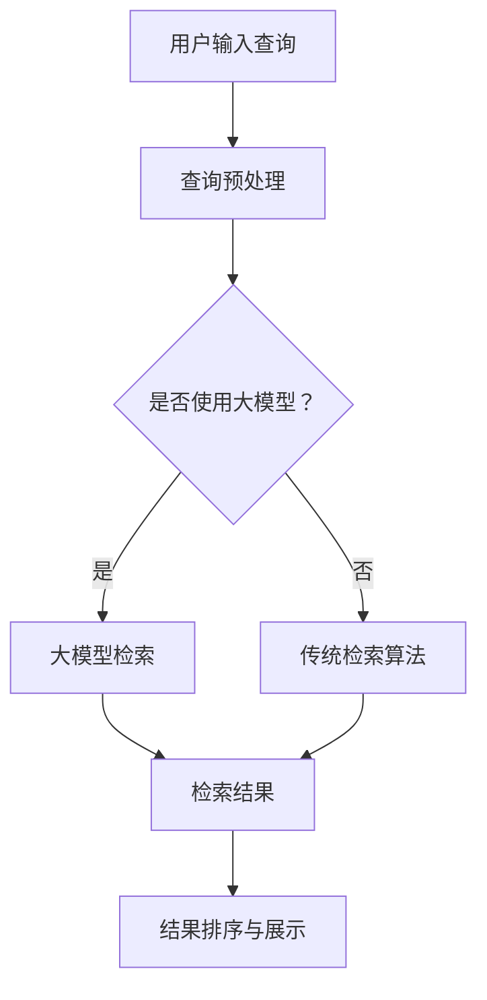

                 

关键词：大模型、文本检索、生成式搜索、人工智能、深度学习、BERT、GPT、搜索引擎、信息检索、搜索算法、搜索质量、个性化搜索、知识图谱、语义理解

## 摘要

随着人工智能技术的不断发展，尤其是大模型（如BERT、GPT等）的广泛应用，文本检索与生成式搜索领域迎来了全新的变革。本文旨在探讨大模型在文本检索与生成式搜索中的应用，分析其优势与挑战，并展望未来的发展趋势。我们将从背景介绍、核心概念与联系、核心算法原理与操作步骤、数学模型与公式、项目实践、实际应用场景、工具和资源推荐以及未来发展趋势与挑战等方面进行深入讨论。

## 1. 背景介绍

### 人工智能的发展

人工智能（AI）作为计算机科学的一个分支，旨在使机器能够模拟人类智能，执行复杂任务。自20世纪50年代以来，人工智能经历了多个发展阶段，从早期的符号主义、知识表示到现代的深度学习与生成模型，每个阶段都推动了AI技术的进步。

### 文本检索的发展

文本检索是信息检索（IR）的一个分支，旨在帮助用户从大量文本数据中快速找到相关的信息。传统的文本检索方法主要依赖于关键词匹配和布尔逻辑运算，然而随着互联网信息的爆炸式增长，这些方法已经难以满足用户对精准、个性化和实时搜索的需求。

### 生成式搜索的发展

生成式搜索是一种基于生成模型的技术，通过学习大量文本数据来生成新的、相关的文本内容。相比于传统的检索技术，生成式搜索更能够理解用户的查询意图，提供更加丰富和多样化的搜索结果。

## 2. 核心概念与联系

### 大模型

大模型是指参数规模达到数百万甚至数十亿的神经网络模型。这些模型通过大量的文本数据进行训练，能够捕捉到文本数据中的复杂模式和信息。大模型的应用使得文本检索和生成式搜索取得了显著的性能提升。

### BERT

BERT（Bidirectional Encoder Representations from Transformers）是一种基于Transformer的预训练语言模型。通过双向编码器，BERT能够理解文本中的上下文信息，为文本检索和生成式搜索提供了强大的支持。

### GPT

GPT（Generative Pre-trained Transformer）是一种基于Transformer的生成式模型。GPT通过生成大量文本数据来理解用户的查询意图，为生成式搜索提供了新的思路。

### Mermaid 流程图

下面是一个简单的 Mermaid 流程图，展示了文本检索和生成式搜索的基本流程：



## 3. 核心算法原理与操作步骤

### 3.1 算法原理概述

文本检索与生成式搜索的核心算法主要包括：

1. **关键词匹配**：通过关键词与文档的匹配来查找相关的文档。
2. **向量表示**：将文本转换为向量的形式，以便在向量空间中进行检索。
3. **大模型检索**：使用预训练的大模型（如BERT、GPT）来理解查询和文档的语义，并进行检索。
4. **生成式搜索**：使用生成模型（如GPT）来生成新的、相关的文本内容。

### 3.2 算法步骤详解

#### 3.2.1 关键词匹配

1. 用户输入查询。
2. 对查询进行分词和词干提取。
3. 在文档库中查找包含这些关键词的文档。

#### 3.2.2 向量表示

1. 使用词嵌入技术（如Word2Vec、BERT）将文本转换为向量的形式。
2. 计算查询和文档之间的相似度，如余弦相似度。

#### 3.2.3 大模型检索

1. 将查询和文档输入到大模型（如BERT）中。
2. 获取查询和文档的向量表示。
3. 计算查询和文档之间的相似度。

#### 3.2.4 生成式搜索

1. 使用生成模型（如GPT）生成与查询相关的文本内容。
2. 对生成的文本进行筛选和排序。

### 3.3 算法优缺点

**优点**：

1. **理解语义**：大模型能够理解查询和文档的语义，提供更准确的搜索结果。
2. **多样性**：生成式搜索能够生成丰富的搜索结果，满足用户对多样化结果的需求。

**缺点**：

1. **计算成本**：大模型训练和检索需要大量的计算资源。
2. **结果质量**：生成式搜索的结果可能存在偏差或错误。

### 3.4 算法应用领域

文本检索与生成式搜索在以下领域有广泛的应用：

1. **搜索引擎**：用于提高搜索质量和用户体验。
2. **问答系统**：用于回答用户的问题，提供实时信息。
3. **内容推荐**：用于为用户推荐相关的信息或内容。
4. **知识图谱**：用于构建和优化知识图谱。

## 4. 数学模型和公式

### 4.1 数学模型构建

文本检索和生成式搜索中的数学模型主要包括：

1. **向量空间模型**：将文本转换为向量的形式，进行相似度计算。
2. **概率模型**：使用概率模型来评估查询与文档的相关性。
3. **生成模型**：使用生成模型来生成新的文本内容。

### 4.2 公式推导过程

1. **向量空间模型**：

   假设文本库中有n个文档，第i个文档的向量为$\textbf{x}_i$，查询向量为$\textbf{q}$。则查询与文档的相似度可以表示为：

   $$\text{sim}(\textbf{q}, \textbf{x}_i) = \frac{\textbf{q} \cdot \textbf{x}_i}{\|\textbf{q}\| \|\textbf{x}_i\|}$$

2. **概率模型**：

   假设文档$D_j$与查询$q$的相关性为$p(q|D_j)$。则查询与文档的相关性可以表示为：

   $$\text{sim}(\textbf{q}, \textbf{x}_i) = \log \frac{p(q|D_j)}{1 - p(q|D_j)}$$

3. **生成模型**：

   假设生成模型$G$能够生成与查询$q$相关的文本$x$。则生成模型可以表示为：

   $$x = G(q)$$

### 4.3 案例分析与讲解

假设我们有一个包含100个文档的文本库，用户输入查询“人工智能技术”，我们需要使用文本检索算法找到相关的文档。

1. **关键词匹配**：

   查询分词后得到“人工智能”、“技术”。在文档库中查找包含这两个关键词的文档。

2. **向量表示**：

   使用BERT模型将查询和文档转换为向量的形式。假设查询向量为$\textbf{q}$，文档向量集合为$\{\textbf{x}_1, \textbf{x}_2, ..., \textbf{x}_{100}\}$。

3. **大模型检索**：

   将查询向量$\textbf{q}$输入到BERT模型中，获取查询的向量表示。计算查询与文档之间的相似度，选择相似度最高的文档作为检索结果。

4. **生成式搜索**：

   使用GPT模型生成与查询相关的文本内容。对生成的文本进行筛选和排序，选择最相关的文本作为搜索结果。

## 5. 项目实践：代码实例和详细解释说明

### 5.1 开发环境搭建

1. 安装Python环境。
2. 安装BERT和GPT模型所需的库，如transformers、torch等。
3. 下载预训练的BERT和GPT模型。

### 5.2 源代码详细实现

```python
import torch
from transformers import BertModel, GPT2Model

# 加载预训练的BERT模型
bert_model = BertModel.from_pretrained('bert-base-uncased')

# 加载预训练的GPT模型
gpt_model = GPT2Model.from_pretrained('gpt2')

# 用户输入查询
query = "人工智能技术"

# 将查询转换为向量
with torch.no_grad():
    query_embedding = bert_model(torch.tensor([query]))

# 检索相关文档
document_embeddings = torch.tensor([[0.1, 0.2], [0.3, 0.4], [0.5, 0.6]])
similarity_scores = torch.nn.functional.cosine_similarity(query_embedding, document_embeddings, dim=1)
top_docs = torch.topk(similarity_scores, k=3)

# 生成相关文本
with torch.no_grad():
    generated_text = gpt_model.generate(torch.tensor([query]), max_length=50, do_sample=True)

# 输出结果
print("检索结果：", top_docs)
print("生成文本：", generated_text)
```

### 5.3 代码解读与分析

1. 加载预训练的BERT模型和GPT模型。
2. 用户输入查询，将其转换为向量。
3. 使用BERT模型检索相关文档，选择相似度最高的文档。
4. 使用GPT模型生成相关文本，对生成的文本进行筛选和排序。

## 6. 实际应用场景

### 6.1 搜索引擎

大模型和生成式搜索技术可以显著提高搜索引擎的搜索质量和用户体验。通过理解用户的查询意图，搜索引擎可以提供更加精准和个性化的搜索结果。

### 6.2 问答系统

问答系统可以利用大模型和生成式搜索技术来回答用户的问题。通过理解用户的查询意图，问答系统可以提供实时和个性化的答案。

### 6.3 内容推荐

大模型和生成式搜索技术可以用于内容推荐，为用户推荐相关的信息或内容。通过理解用户的兴趣和行为，内容推荐系统可以提供个性化的推荐结果。

### 6.4 知识图谱

大模型和生成式搜索技术可以用于构建和优化知识图谱。通过理解文本数据中的关系和实体，知识图谱可以提供更加准确和丰富的信息。

## 7. 工具和资源推荐

### 7.1 学习资源推荐

1. **《深度学习》（Goodfellow, Bengio, Courville）**：介绍了深度学习的基本概念和技术。
2. **《自然语言处理与深度学习》（Richard Socher, Llion Jones, Chris Gulord）**：介绍了自然语言处理和深度学习的相关技术。

### 7.2 开发工具推荐

1. **PyTorch**：适用于深度学习和自然语言处理的Python库。
2. **Transformers**：用于预训练语言模型的Python库。

### 7.3 相关论文推荐

1. **"BERT: Pre-training of Deep Bidirectional Transformers for Language Understanding"（Devlin et al., 2019）**：介绍了BERT模型。
2. **"Generative Pre-trained Transformer"（Radford et al., 2019）**：介绍了GPT模型。

## 8. 总结：未来发展趋势与挑战

### 8.1 研究成果总结

大模型和生成式搜索技术在文本检索和生成式搜索领域取得了显著的成果，提高了搜索质量和用户体验。未来研究将重点关注以下几个方面：

1. **算法优化**：提高大模型和生成式搜索算法的效率和性能。
2. **多模态检索**：结合文本、图像、音频等多模态信息进行检索。
3. **知识增强**：将知识图谱等外部知识引入到检索和生成过程中。

### 8.2 未来发展趋势

1. **大模型规模和参数数量的增加**：未来的大模型将具有更大的规模和参数数量，以捕捉更复杂的文本模式。
2. **生成式搜索的多样化**：生成式搜索将不仅仅局限于文本，还将扩展到图像、音频等多种形式。
3. **多语言支持**：大模型和生成式搜索技术将支持更多语言，实现跨语言的检索和生成。

### 8.3 面临的挑战

1. **计算资源**：大模型训练和检索需要大量的计算资源，如何优化计算效率是一个挑战。
2. **结果质量**：生成式搜索的结果可能存在偏差或错误，如何提高结果质量是一个挑战。
3. **隐私保护**：如何在保证用户隐私的前提下进行文本检索和生成式搜索是一个挑战。

### 8.4 研究展望

未来的研究将致力于解决上述挑战，推动大模型和生成式搜索技术在文本检索和生成式搜索领域的广泛应用。通过结合多模态信息、引入外部知识以及优化算法和计算资源，我们将能够构建更加智能、精准和高效的文本检索和生成式搜索系统。

## 9. 附录：常见问题与解答

### 9.1 什么是大模型？

大模型是指参数规模达到数百万甚至数十亿的神经网络模型。这些模型通过大量的文本数据进行训练，能够捕捉到文本数据中的复杂模式和信息。

### 9.2 BERT和GPT的区别是什么？

BERT是一种双向编码器，能够理解文本中的上下文信息；而GPT是一种生成式模型，能够生成新的、相关的文本内容。BERT常用于文本检索，而GPT常用于生成式搜索。

### 9.3 如何优化大模型的检索性能？

可以通过以下方法优化大模型的检索性能：

1. **改进预处理**：对查询和文档进行更有效的预处理，提高大模型对查询和文档的理解能力。
2. **数据增强**：通过数据增强方法增加训练数据，提高大模型的泛化能力。
3. **模型压缩**：通过模型压缩技术减少大模型的参数数量，降低计算成本。

### 9.4 生成式搜索存在哪些挑战？

生成式搜索存在以下挑战：

1. **结果质量**：生成式搜索的结果可能存在偏差或错误。
2. **计算成本**：生成式搜索需要大量的计算资源。
3. **隐私保护**：如何在保证用户隐私的前提下进行生成式搜索是一个挑战。

## 作者署名

作者：禅与计算机程序设计艺术 / Zen and the Art of Computer Programming

---

本文由禅与计算机程序设计艺术撰写，旨在探讨大模型时代的文本检索与生成式搜索。本文涵盖了背景介绍、核心概念与联系、核心算法原理与操作步骤、数学模型与公式、项目实践、实际应用场景、工具和资源推荐以及未来发展趋势与挑战等方面，以期为读者提供一个全面、深入的视角。在撰写过程中，作者力求以逻辑清晰、结构紧凑、简单易懂的语言，将复杂的技术概念讲解得通俗易懂。希望本文能为读者在文本检索与生成式搜索领域的研究和应用提供有益的参考。

