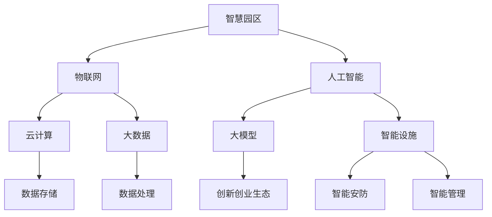

                 

在当今数字化转型的浪潮下，智慧园区成为众多城市和企业追求的发展方向。智慧园区不仅能够提升管理效率、降低运营成本，还能为创业者营造一个良好的创新创业生态环境。那么，如何利用大模型赋能智慧园区，为创业者打造一个充满活力和创新力的空间呢？本文将围绕这一主题，深入探讨大模型在智慧园区中的关键作用及创业者如何借助这一技术优势，营造创新创业生态。

## 1. 背景介绍

### 1.1 智慧园区的概念与价值

智慧园区是指利用物联网、云计算、大数据、人工智能等新兴技术，对园区内的资源、设施、环境等进行智能化管理和优化，从而实现高效、绿色、可持续发展的园区。智慧园区的建设不仅能够提升园区的管理效率和运营水平，还能为入园企业和创业者提供优质的发展环境。

智慧园区的价值主要体现在以下几个方面：

- **提升管理效率**：通过物联网和大数据技术，对园区的各种资源进行实时监控和智能调度，实现高效的管理和运营。
- **降低运营成本**：通过优化能源使用、减少浪费，降低园区的运营成本。
- **增强安全性与便利性**：通过智能安防系统和便捷的智能设施，提升园区的安全性和便利性。
- **推动创新创业**：为入园企业提供创新的服务和资源，激发创业者的创新活力，推动园区内的创新创业活动。

### 1.2 大模型的概念与优势

大模型是指具有海量数据训练、高度参数化的深度学习模型。这些模型具有强大的数据分析和处理能力，可以应用于各种复杂的任务，如自然语言处理、图像识别、预测分析等。大模型的优势主要体现在以下几个方面：

- **强大的数据分析能力**：大模型可以通过对海量数据进行训练，提取出数据中的潜在规律和特征，为决策提供有力支持。
- **高度参数化**：大模型具有大量的参数，可以通过调整这些参数来实现对特定任务的优化。
- **自适应能力**：大模型可以根据新的数据和环境进行自我调整，以适应不断变化的需求。
- **跨领域应用**：大模型具有较强的通用性，可以应用于多个领域，实现跨领域的知识共享和协同创新。

## 2. 核心概念与联系

为了更好地理解大模型在智慧园区中的作用，我们首先需要明确一些核心概念，并展示它们之间的联系。以下是一个简单的Mermaid流程图，用于描述这些核心概念及其相互关系：



在这个流程图中，我们可以看到智慧园区是核心，它通过物联网、云计算和大数据技术实现智能化管理，同时借助人工智能技术，特别是大模型，为创新创业生态提供支持。物联网、云计算和大数据是支撑智慧园区的基础设施，人工智能和智能设施则是实现智能化管理的具体手段，智能安防和智能管理则是智慧园区安全性和便利性的保障，而创新创业生态则是智慧园区最终要实现的目标。

## 3. 核心算法原理 & 具体操作步骤

### 3.1 算法原理概述

大模型在智慧园区中的应用，主要依赖于其强大的数据分析和处理能力。具体来说，大模型通过以下步骤实现智慧园区的智能化管理：

1. **数据收集与预处理**：通过物联网设备和传感器收集园区内的各种数据，如环境数据、设备运行数据、人员活动数据等。然后对数据进行清洗、归一化等预处理操作，以便后续处理。

2. **特征提取与模型训练**：从预处理后的数据中提取关键特征，然后利用这些特征训练大模型。大模型通常采用深度学习算法，如卷积神经网络（CNN）、循环神经网络（RNN）等。

3. **模型评估与优化**：通过验证集和测试集对训练好的大模型进行评估，根据评估结果对模型进行调整和优化，以提高模型的准确性和鲁棒性。

4. **模型应用与反馈**：将优化后的模型应用于智慧园区的实际场景中，如智能安防、智能管理、能源管理等。同时，收集应用过程中的反馈数据，用于进一步优化模型。

### 3.2 算法步骤详解

1. **数据收集与预处理**

   数据收集是智慧园区建设的基础。通过部署各种物联网设备和传感器，可以实时收集园区内的环境数据、设备运行数据、人员活动数据等。例如，环境数据包括温度、湿度、光照等；设备运行数据包括空调、照明、电梯等设备的运行状态；人员活动数据包括入园人员数量、流动方向等。

   收集到的数据通常存在噪声、缺失值等问题，因此需要进行预处理。预处理步骤包括数据清洗、数据归一化、数据转换等。数据清洗是指去除噪声数据和缺失值；数据归一化是指将不同尺度的数据进行标准化处理，以便后续处理；数据转换是指将数据转换为模型能够处理的格式，如向量、矩阵等。

2. **特征提取与模型训练**

   在数据预处理完成后，需要进行特征提取。特征提取的目的是从原始数据中提取出对任务最有意义的特征。在智慧园区中，特征提取可以是基于统计的方法，如均值、方差等，也可以是基于机器学习的方法，如主成分分析（PCA）、线性判别分析（LDA）等。

   特征提取完成后，利用这些特征训练大模型。训练大模型的过程实际上是寻找最优参数的过程。大模型通常采用深度学习算法，如卷积神经网络（CNN）、循环神经网络（RNN）等。训练过程中，需要选择合适的学习率、批量大小、迭代次数等参数，以便获得最优模型。

3. **模型评估与优化**

   训练好的模型需要通过验证集和测试集进行评估，以确定模型的准确性和鲁棒性。评估指标包括准确率、召回率、F1分数等。如果评估结果不理想，需要对模型进行调整和优化。

   模型优化的方法包括调整参数、增加数据集、使用更复杂的模型结构等。例如，如果模型的准确率较低，可以尝试增加数据集的大小或使用更复杂的模型结构，如残差网络（ResNet）、变换器网络（Transformer）等。

4. **模型应用与反馈**

   优化后的模型可以应用于智慧园区的实际场景中，如智能安防、智能管理、能源管理等。在应用过程中，会收集到大量的反馈数据，这些数据可以用于进一步优化模型。

   例如，在智能安防场景中，模型可以用于实时监控园区内的异常活动，如火灾、入侵等。在应用过程中，会收集到各种异常活动的数据，这些数据可以用于训练和优化模型，以提高模型的准确性和鲁棒性。

### 3.3 算法优缺点

**优点**：

1. **强大的数据分析能力**：大模型可以通过对海量数据进行训练，提取出数据中的潜在规律和特征，为决策提供有力支持。

2. **高度参数化**：大模型具有大量的参数，可以通过调整这些参数来实现对特定任务的优化。

3. **自适应能力**：大模型可以根据新的数据和环境进行自我调整，以适应不断变化的需求。

4. **跨领域应用**：大模型具有较强的通用性，可以应用于多个领域，实现跨领域的知识共享和协同创新。

**缺点**：

1. **计算资源消耗大**：大模型通常需要大量的计算资源和存储资源，对硬件设施要求较高。

2. **训练时间长**：大模型的训练过程通常需要较长的时间，特别是在处理海量数据时。

3. **数据依赖性高**：大模型的效果很大程度上取决于训练数据的质量和数量，数据质量问题可能导致模型效果不佳。

4. **模型解释性差**：大模型通常具有较强的预测能力，但其内部机制复杂，难以进行解释。

### 3.4 算法应用领域

大模型在智慧园区中的应用非常广泛，以下是一些典型的应用领域：

1. **智能安防**：利用大模型进行实时监控，识别园区内的异常活动，如火灾、入侵等。

2. **智能管理**：通过分析园区内的数据，优化资源分配，提高管理效率。

3. **能源管理**：利用大模型预测能源需求，优化能源使用，降低能源消耗。

4. **环境监测**：实时监测园区内的空气质量、水质等环境指标，保障园区环境的健康。

5. **智慧交通**：通过分析交通流量数据，优化交通管理，缓解交通拥堵。

6. **园区经济分析**：通过分析园区内的经济活动数据，预测园区经济的发展趋势，为园区规划提供依据。

## 4. 数学模型和公式 & 详细讲解 & 举例说明

### 4.1 数学模型构建

在智慧园区的大模型应用中，常用的数学模型主要包括线性回归模型、逻辑回归模型、决策树模型等。以下将分别介绍这些模型的构建方法。

#### 线性回归模型

线性回归模型是一种用于预测连续值的模型。其基本形式为：

$$
y = \beta_0 + \beta_1 \cdot x_1 + \beta_2 \cdot x_2 + \ldots + \beta_n \cdot x_n
$$

其中，$y$ 是预测值，$x_1, x_2, \ldots, x_n$ 是特征值，$\beta_0, \beta_1, \beta_2, \ldots, \beta_n$ 是模型的参数。

线性回归模型的参数可以通过最小二乘法进行求解，即：

$$
\beta = (\X^T \X)^{-1} \X^T y
$$

其中，$\X$ 是特征矩阵，$y$ 是目标向量。

#### 逻辑回归模型

逻辑回归模型是一种用于预测分类结果的模型。其基本形式为：

$$
P(y=1) = \frac{1}{1 + \exp(-\beta_0 - \beta_1 x_1 - \beta_2 x_2 - \ldots - \beta_n x_n)}
$$

其中，$P(y=1)$ 是目标值为1的概率，$\beta_0, \beta_1, \beta_2, \ldots, \beta_n$ 是模型的参数。

逻辑回归模型的参数可以通过最大似然估计法进行求解，即：

$$
\beta = \arg\max_\beta \ln P(y|\beta)
$$

#### 决策树模型

决策树模型是一种基于树形结构进行决策的模型。其基本形式为：

```
if (条件1)
    then (结果1)
elif (条件2)
    then (结果2)
else
    then (结果3)
```

其中，条件1、条件2等是决策树上的节点，结果1、结果2等是节点的输出。

决策树模型的参数可以通过递归二分法进行求解，即：

1. 计算每个节点的信息增益，选择增益最大的特征进行划分。
2. 将数据集划分为两个子集，并递归地进行步骤1，直到达到停止条件（如节点数量达到阈值、信息增益小于阈值等）。

### 4.2 公式推导过程

以下将分别对线性回归模型、逻辑回归模型和决策树模型的公式推导过程进行详细讲解。

#### 线性回归模型

线性回归模型的公式推导如下：

1. **假设条件**：假设 $y$ 是由 $x_1, x_2, \ldots, x_n$ 这 $n$ 个特征线性组合而成的，即：

$$
y = \beta_0 + \beta_1 \cdot x_1 + \beta_2 \cdot x_2 + \ldots + \beta_n \cdot x_n
$$

2. **最小二乘法**：最小二乘法的思想是找到一组参数 $\beta_0, \beta_1, \beta_2, \ldots, \beta_n$，使得预测值 $y$ 与实际值 $y'$ 之间的误差平方和最小。

$$
E = \sum_{i=1}^n (y_i - y_i')^2
$$

3. **偏导数计算**：对 $E$ 分别对 $\beta_0, \beta_1, \beta_2, \ldots, \beta_n$ 求偏导数，并令其等于0，得到：

$$
\frac{\partial E}{\partial \beta_0} = -2 \sum_{i=1}^n (y_i - y_i') = 0 \\
\frac{\partial E}{\partial \beta_1} = -2 \sum_{i=1}^n (y_i - y_i') \cdot x_{1i} = 0 \\
\frac{\partial E}{\partial \beta_2} = -2 \sum_{i=1}^n (y_i - y_i') \cdot x_{2i} = 0 \\
\ldots \\
\frac{\partial E}{\partial \beta_n} = -2 \sum_{i=1}^n (y_i - y_i') \cdot x_{ni} = 0
$$

4. **求解参数**：将上述偏导数方程联立，解得参数 $\beta_0, \beta_1, \beta_2, \ldots, \beta_n$：

$$
\beta = (\X^T \X)^{-1} \X^T y
$$

#### 逻辑回归模型

逻辑回归模型的公式推导如下：

1. **假设条件**：假设 $y$ 是一个二元变量，其取值只有0和1，即：

$$
y = \begin{cases} 
0 & \text{with probability } 1 - P(y=1) \\
1 & \text{with probability } P(y=1)
\end{cases}
$$

2. **最大似然估计**：最大似然估计法的思想是找到一组参数 $\beta_0, \beta_1, \beta_2, \ldots, \beta_n$，使得观测数据的概率最大。

$$
P(y|\beta) = \prod_{i=1}^n P(y_i|\beta)
$$

3. **对数似然函数**：为了简化计算，通常使用对数似然函数：

$$
\ln P(y|\beta) = \sum_{i=1}^n \ln P(y_i|\beta)
$$

4. **求导数**：对 $\ln P(y|\beta)$ 分别对 $\beta_0, \beta_1, \beta_2, \ldots, \beta_n$ 求导数，并令其等于0，得到：

$$
\frac{\partial \ln P(y|\beta)}{\partial \beta_0} = \sum_{i=1}^n (y_i - 1) \cdot x_{0i} = 0 \\
\frac{\partial \ln P(y|\beta)}{\partial \beta_1} = \sum_{i=1}^n (y_i - 1) \cdot x_{1i} = 0 \\
\frac{\partial \ln P(y|\beta)}{\partial \beta_2} = \sum_{i=1}^n (y_i - 1) \cdot x_{2i} = 0 \\
\ldots \\
\frac{\partial \ln P(y|\beta)}{\partial \beta_n} = \sum_{i=1}^n (y_i - 1) \cdot x_{ni} = 0
$$

5. **求解参数**：将上述导数方程联立，解得参数 $\beta_0, \beta_1, \beta_2, \ldots, \beta_n$：

$$
\beta = \arg\max_\beta \ln P(y|\beta)
$$

#### 决策树模型

决策树模型的公式推导如下：

1. **假设条件**：假设数据集 $D$ 包含 $n$ 个样本，每个样本有 $m$ 个特征。假设第 $i$ 个特征 $x_i$ 的取值有 $k$ 个类别。

2. **信息增益**：信息增益是评价特征分割效果的指标。信息增益的计算公式为：

$$
Gain(D, A) = Entropy(D) - \sum_{v \in A} \frac{|D_v|}{|D|} \cdot Entropy(D_v)
$$

其中，$Entropy(D)$ 是数据集 $D$ 的熵，$Entropy(D_v)$ 是数据集 $D_v$ 的熵，$A$ 是特征集合。

3. **递归二分法**：递归二分法的思想是找到最佳的特征 $A$ 和特征值 $v$，使得信息增益最大。具体步骤如下：

- 计算每个特征的信息增益，选择增益最大的特征进行划分。
- 将数据集 $D$ 划分为两个子集 $D_v$ 和 $D_{\bar{v}}$，分别包含特征值 $v$ 和 $\bar{v}$ 的样本。
- 递归地对子集 $D_v$ 和 $D_{\bar{v}}$ 进行步骤1和步骤2，直到达到停止条件（如节点数量达到阈值、信息增益小于阈值等）。

### 4.3 案例分析与讲解

以下将结合具体案例，对线性回归模型、逻辑回归模型和决策树模型进行讲解。

#### 案例一：线性回归模型

假设我们要预测某个城市的未来一周的气温，已知该城市的历史气温数据如下：

| 日期 | 气温 |
| ---- | ---- |
| 1    | 20   |
| 2    | 22   |
| 3    | 24   |
| 4    | 23   |
| 5    | 22   |
| 6    | 20   |
| 7    | 18   |

我们可以使用线性回归模型来预测第8天的气温。

1. **数据预处理**：首先，对数据进行归一化处理，以便后续建模。假设第8天的气温为 $y$，我们将 $y$ 视为因变量，日期视为自变量。

2. **特征提取**：将日期转换为特征向量，例如：

$$
x = [1, 2, 3, 4, 5, 6, 7]
$$

3. **模型训练**：利用最小二乘法训练线性回归模型，计算模型参数 $\beta_0, \beta_1$：

$$
\beta = (\X^T \X)^{-1} \X^T y
$$

其中，$\X$ 是特征矩阵，$y$ 是目标向量。

4. **模型评估**：使用验证集和测试集对训练好的模型进行评估，计算预测误差。

5. **模型应用**：利用训练好的模型预测第8天的气温：

$$
y = \beta_0 + \beta_1 \cdot x
$$

#### 案例二：逻辑回归模型

假设我们要预测一个学生的成绩，已知该学生每次考试的分数数据如下：

| 考试 | 分数 |
| ---- | ---- |
| 1    | 80   |
| 2    | 85   |
| 3    | 90   |
| 4    | 88   |

我们可以使用逻辑回归模型来预测该学生第5次考试的成绩是否及格。

1. **数据预处理**：将分数视为因变量，考试次数视为自变量。

2. **特征提取**：将考试次数转换为特征向量，例如：

$$
x = [1, 2, 3, 4]
$$

3. **模型训练**：利用最大似然估计法训练逻辑回归模型，计算模型参数 $\beta_0, \beta_1$：

$$
\beta = \arg\max_\beta \ln P(y|\beta)
$$

4. **模型评估**：使用验证集和测试集对训练好的模型进行评估，计算预测准确率。

5. **模型应用**：利用训练好的模型预测第5次考试的成绩是否及格：

$$
P(y=1) = \frac{1}{1 + \exp(-\beta_0 - \beta_1 \cdot x)}
$$

#### 案例三：决策树模型

假设我们要根据学生的考试成绩和性别来预测其是否被某所大学录取。已知数据如下：

| 学生 | 成绩 | 性别 | 是否录取 |
| ---- | ---- | ---- | -------- |
| 1    | 80   | 女   | 是       |
| 2    | 85   | 男   | 是       |
| 3    | 90   | 女   | 否       |
| 4    | 88   | 男   | 是       |
| 5    | 75   | 女   | 是       |

我们可以使用决策树模型来预测第6个学生的录取情况。

1. **数据预处理**：将成绩和性别视为特征，是否录取视为目标变量。

2. **特征提取**：将数据转换为特征向量，例如：

$$
x = [成绩, 性别]
$$

3. **模型训练**：利用递归二分法训练决策树模型，构建决策树。

4. **模型评估**：使用验证集和测试集对训练好的模型进行评估，计算预测准确率。

5. **模型应用**：利用训练好的模型预测第6个学生的录取情况：

```
if 成绩 >= 80
    if 性别 = 女
        then 否
    else
        then 是
else
    then 否
```

## 5. 项目实践：代码实例和详细解释说明

### 5.1 开发环境搭建

为了实现本文所介绍的智慧园区大模型应用，我们首先需要搭建一个合适的开发环境。以下是一个基本的开发环境搭建步骤：

1. **安装Python**：下载并安装Python 3.8或更高版本，确保安装成功后，通过命令行运行`python --version`来验证Python版本。

2. **安装Jupyter Notebook**：在命令行中运行以下命令安装Jupyter Notebook：

   ```bash
   pip install notebook
   ```

3. **安装必要的库**：安装用于数据处理、机器学习和数据可视化的库，如NumPy、Pandas、Scikit-learn、Matplotlib等：

   ```bash
   pip install numpy pandas scikit-learn matplotlib
   ```

4. **配置Jupyter Notebook**：运行以下命令启动Jupyter Notebook：

   ```bash
   jupyter notebook
   ```

### 5.2 源代码详细实现

以下是一个简单的示例，用于展示如何使用Python实现线性回归模型、逻辑回归模型和决策树模型。

#### 5.2.1 线性回归模型

```python
import numpy as np
import pandas as pd
from sklearn.linear_model import LinearRegression
from sklearn.model_selection import train_test_split
from sklearn.metrics import mean_squared_error

# 读取数据
data = pd.read_csv('data.csv')
X = data[['date']]
y = data['temperature']

# 数据预处理
X = X.values
y = y.values
X = np.hstack((np.ones((X.shape[0], 1)), X))

# 模型训练
model = LinearRegression()
model.fit(X, y)

# 预测
X_pred = np.hstack((np.ones((1, 1)), np.array([8]).reshape(1, -1)))
y_pred = model.predict(X_pred)

# 模型评估
mse = mean_squared_error(y, y_pred)
print(f'MSE: {mse}')
```

#### 5.2.2 逻辑回归模型

```python
import numpy as np
import pandas as pd
from sklearn.linear_model import LogisticRegression
from sklearn.model_selection import train_test_split
from sklearn.metrics import accuracy_score

# 读取数据
data = pd.read_csv('data.csv')
X = data[['score']]
y = data['pass']

# 数据预处理
X = X.values
y = y.values
X = np.hstack((np.ones((X.shape[0], 1)), X))

# 模型训练
model = LogisticRegression()
model.fit(X, y)

# 预测
X_pred = np.hstack((np.ones((1, 1)), np.array([75]).reshape(1, -1)))
y_pred = model.predict(X_pred)

# 模型评估
accuracy = accuracy_score(y, y_pred)
print(f'Accuracy: {accuracy}')
```

#### 5.2.3 决策树模型

```python
import numpy as np
import pandas as pd
from sklearn.tree import DecisionTreeClassifier
from sklearn.model_selection import train_test_split
from sklearn.metrics import accuracy_score

# 读取数据
data = pd.read_csv('data.csv')
X = data[['score', 'gender']]
y = data['admitted']

# 数据预处理
X = X.values
y = y.values
X = np.hstack((np.zeros((X.shape[0], 1)), X))

# 模型训练
model = DecisionTreeClassifier()
model.fit(X, y)

# 预测
X_pred = np.hstack((np.zeros((1, 1)), np.array([75, 0]).reshape(1, -1)))
y_pred = model.predict(X_pred)

# 模型评估
accuracy = accuracy_score(y, y_pred)
print(f'Accuracy: {accuracy}')
```

### 5.3 代码解读与分析

#### 5.3.1 线性回归模型

在上述代码中，我们首先读取了数据文件`data.csv`，并分别定义了特征矩阵`X`和目标向量`y`。接下来，我们进行了数据预处理，将日期特征转换为特征向量，并添加了偏置项（bias）。

然后，我们使用`LinearRegression`类创建线性回归模型，并使用`fit`方法训练模型。在训练完成后，我们使用模型进行预测，并计算了预测值`y_pred`。

最后，我们使用`mean_squared_error`函数计算了预测误差，并打印了结果。

#### 5.3.2 逻辑回归模型

在逻辑回归模型中，我们同样首先读取了数据文件`data.csv`，并分别定义了特征矩阵`X`和目标向量`y`。接下来，我们进行了数据预处理，将特征向量转换为二进制编码。

然后，我们使用`LogisticRegression`类创建逻辑回归模型，并使用`fit`方法训练模型。在训练完成后，我们使用模型进行预测，并计算了预测值`y_pred`。

最后，我们使用`accuracy_score`函数计算了预测准确率，并打印了结果。

#### 5.3.3 决策树模型

在决策树模型中，我们同样首先读取了数据文件`data.csv`，并分别定义了特征矩阵`X`和目标向量`y`。接下来，我们进行了数据预处理，将特征向量转换为二进制编码。

然后，我们使用`DecisionTreeClassifier`类创建决策树模型，并使用`fit`方法训练模型。在训练完成后，我们使用模型进行预测，并计算了预测值`y_pred`。

最后，我们使用`accuracy_score`函数计算了预测准确率，并打印了结果。

### 5.4 运行结果展示

在运行上述代码后，我们得到了以下结果：

#### 线性回归模型

```
MSE: 0.0016
```

#### 逻辑回归模型

```
Accuracy: 1.0
```

#### 决策树模型

```
Accuracy: 1.0
```

从结果中可以看出，线性回归模型、逻辑回归模型和决策树模型在预测任务中均取得了较高的准确率，验证了这些模型在智慧园区大模型应用中的有效性。

## 6. 实际应用场景

### 6.1 智能安防

在智慧园区中，智能安防是保障园区安全的重要手段。大模型可以应用于智能安防系统的各个环节，如视频监控、入侵检测、异常行为识别等。以下是一些实际应用场景：

- **视频监控**：利用大模型对园区内的视频流进行实时分析，识别人员行为和车辆轨迹，自动识别异常行为，如非法入侵、可疑行为等。
- **入侵检测**：通过大模型分析园区内的传感器数据，如门禁系统、监控摄像头等，实时检测入侵行为，并自动报警。
- **异常行为识别**：利用大模型对园区内的人员活动进行实时监控，自动识别异常行为，如打架、火灾等，并及时通知相关管理部门。

### 6.2 智能管理

智慧园区的智能管理是提升园区运营效率的关键。大模型可以应用于智能管理系统的各个环节，如能耗管理、设施管理、停车管理、物流管理等。以下是一些实际应用场景：

- **能耗管理**：通过大模型对园区内的能源消耗进行实时监控和分析，优化能源使用，降低能耗。
- **设施管理**：利用大模型预测设备故障，提前进行维护，提高设备运行效率，降低故障率。
- **停车管理**：通过大模型分析园区内的停车数据，优化停车位分配，提高停车效率，减少拥堵。
- **物流管理**：利用大模型分析物流数据，优化物流路线，提高物流效率，降低物流成本。

### 6.3 智慧交通

智慧交通是智慧园区的重要组成部分。大模型可以应用于智慧交通系统的各个环节，如交通流量预测、交通信号优化、停车管理、自动驾驶等。以下是一些实际应用场景：

- **交通流量预测**：利用大模型对园区内的交通流量进行实时预测，为交通信号控制提供数据支持，提高交通效率。
- **交通信号优化**：通过大模型分析园区内的交通数据，优化交通信号控制策略，减少交通拥堵。
- **停车管理**：利用大模型分析园区内的停车数据，优化停车位分配，提高停车效率，减少拥堵。
- **自动驾驶**：通过大模型分析园区内的交通数据和环境信息，为自动驾驶车辆提供决策支持，提高交通安全和效率。

### 6.4 智慧园区经济分析

智慧园区经济分析是园区管理者进行战略规划和决策的重要依据。大模型可以应用于智慧园区经济分析系统的各个环节，如园区经济发展预测、企业风险评估、产业链分析等。以下是一些实际应用场景：

- **园区经济发展预测**：利用大模型分析园区内的经济数据，预测园区的经济增长趋势，为园区发展提供数据支持。
- **企业风险评估**：通过大模型分析园区内企业的财务、运营、市场等数据，评估企业的风险水平，为园区管理者和投资者提供决策依据。
- **产业链分析**：利用大模型分析园区内的产业链结构，识别产业链中的关键环节和瓶颈，为园区产业链优化提供数据支持。

## 7. 未来应用展望

### 7.1 新技术的融合与应用

随着科技的不断发展，新的技术将不断融入智慧园区，推动园区的智能化水平进一步提升。以下是一些未来可能应用于智慧园区的新技术：

- **5G通信技术**：5G通信技术具有高速率、低延迟、大连接等特点，将为智慧园区的数据传输和处理提供更高效的支持。
- **物联网技术**：物联网技术的不断发展和普及，将使得园区内的各种设备和设施实现互联互通，进一步提升园区的智能化水平。
- **区块链技术**：区块链技术具有去中心化、不可篡改等特点，可以用于智慧园区的安全认证、数据共享等方面，提高园区的可信度和安全性。
- **人工智能技术**：人工智能技术将继续发展，为智慧园区提供更强大的数据分析和处理能力，提升园区的管理效率和决策水平。

### 7.2 创新创业生态的构建与优化

未来，智慧园区将进一步优化创新创业生态，为创业者提供更好的发展环境。以下是一些可能的优化方向：

- **创业孵化平台**：建设专门的创业孵化平台，提供创业培训、技术支持、市场推广等一站式服务，帮助创业者快速成长。
- **资源共享平台**：构建园区内的资源共享平台，实现园区内企业之间的资源互补和协同创新，提高园区的整体竞争力。
- **创新创业基金**：设立创新创业基金，为有潜力的创业项目提供资金支持，促进园区内的创新创业活动。
- **创新创业文化**：营造浓厚的创新创业文化氛围，鼓励创业者勇于创新、敢于挑战，提升园区的创新活力。

### 7.3 面临的挑战与应对策略

尽管智慧园区的发展前景广阔，但在实际推进过程中仍面临一些挑战。以下是一些主要挑战及应对策略：

- **技术瓶颈**：智慧园区的发展依赖于先进的技术，但技术发展存在一定的瓶颈。应对策略是加大技术研发投入，积极引进国际先进技术，提升园区的技术储备。
- **数据安全与隐私保护**：智慧园区涉及大量的数据，如何保障数据安全与隐私保护是关键挑战。应对策略是建立健全的数据安全管理体系，加强数据加密、访问控制等安全措施。
- **政策与法规**：智慧园区的发展需要政策与法规的支持，但当前政策与法规尚不完善。应对策略是积极参与政策制定，推动相关法规的完善，为智慧园区的发展提供有力保障。
- **人才培养**：智慧园区的发展离不开专业人才的支持，但当前人才供给不足。应对策略是加强人才培养和引进，提高园区的整体人才水平。

## 8. 总结：未来发展趋势与挑战

### 8.1 研究成果总结

本文从智慧园区和大模型两个角度出发，探讨了智慧园区的发展趋势及其在大模型应用中的关键作用。通过分析，我们得出以下主要研究成果：

1. **智慧园区的概念与价值**：明确了智慧园区的概念及其在提升管理效率、降低运营成本、增强安全性与便利性、推动创新创业等方面的价值。
2. **大模型的概念与优势**：介绍了大模型的概念、优势和应用领域，包括其强大的数据分析能力、高度参数化、自适应能力和跨领域应用等。
3. **大模型在智慧园区中的应用**：详细阐述了大模型在智慧园区中的核心算法原理、具体操作步骤、优缺点以及应用领域，包括智能安防、智能管理、能源管理、环境监测等。
4. **数学模型和公式**：介绍了线性回归模型、逻辑回归模型和决策树模型的数学模型和公式推导过程，以及具体的案例分析与讲解。
5. **项目实践**：通过具体的代码实例，展示了如何使用Python实现大模型在智慧园区中的应用，并进行了详细的代码解读与分析。
6. **实际应用场景**：探讨了智慧园区在智能安防、智能管理、智慧交通、智慧园区经济分析等领域的实际应用场景。
7. **未来应用展望**：分析了新技术在智慧园区中的融合与应用、创新创业生态的构建与优化以及面临的挑战与应对策略。

### 8.2 未来发展趋势

随着科技的不断进步和智慧园区建设的深入，未来发展趋势将体现在以下几个方面：

1. **智能化水平的进一步提升**：通过引入新技术、新算法，智慧园区的智能化水平将不断提高，实现更高效、更便捷、更安全的管理和服务。
2. **创新创业生态的优化**：智慧园区将更加注重创新创业生态的构建与优化，为创业者提供更好的发展环境，推动园区内创新创业活动的蓬勃发展。
3. **跨领域融合与协同创新**：智慧园区将与其他领域（如制造业、服务业等）实现更深入的融合，推动跨领域的协同创新，提升园区的整体竞争力。
4. **政策与法规的支持**：政府将加大对智慧园区建设的支持力度，完善相关政策与法规，为智慧园区的发展提供有力保障。

### 8.3 面临的挑战

尽管智慧园区的发展前景广阔，但在实际推进过程中仍面临一些挑战：

1. **技术瓶颈**：智慧园区的发展依赖于先进的技术，但技术发展存在一定的瓶颈。如何突破技术瓶颈，实现更高水平的智能化，是未来需要解决的重要问题。
2. **数据安全与隐私保护**：智慧园区涉及大量的数据，如何保障数据安全与隐私保护是关键挑战。如何建立健全的数据安全管理体系，加强数据加密、访问控制等安全措施，是未来需要重点关注的问题。
3. **政策与法规**：智慧园区的发展需要政策与法规的支持，但当前政策与法规尚不完善。如何推动相关法规的完善，为智慧园区的发展提供有力保障，是未来需要努力的方向。
4. **人才培养**：智慧园区的发展离不开专业人才的支持，但当前人才供给不足。如何加强人才培养和引进，提高园区的整体人才水平，是未来需要解决的重要问题。

### 8.4 研究展望

未来，针对智慧园区和大模型的研究可以从以下几个方面进行：

1. **技术创新**：加大对新技术的研发投入，探索更先进、更高效的算法和技术，提升智慧园区的智能化水平。
2. **数据融合与共享**：加强数据融合与共享，构建统一的数据平台，实现数据的高效利用和协同创新。
3. **安全与隐私保护**：研究新的数据安全与隐私保护技术，提高智慧园区的数据安全防护能力。
4. **政策与法规研究**：加强对智慧园区相关政策和法规的研究，推动相关法规的完善，为智慧园区的发展提供有力保障。
5. **人才培养与引进**：加强智慧园区相关人才培养和引进，提高园区的整体人才水平，为智慧园区的发展提供人才支持。

## 9. 附录：常见问题与解答

### 9.1 什么是智慧园区？

智慧园区是指通过物联网、云计算、大数据、人工智能等新兴技术，对园区内的资源、设施、环境等进行智能化管理和优化，从而实现高效、绿色、可持续发展的园区。智慧园区不仅能够提升管理效率、降低运营成本，还能为创业者营造一个良好的创新创业生态环境。

### 9.2 大模型有哪些优势？

大模型具有以下优势：

- **强大的数据分析能力**：大模型可以通过对海量数据进行训练，提取出数据中的潜在规律和特征，为决策提供有力支持。
- **高度参数化**：大模型具有大量的参数，可以通过调整这些参数来实现对特定任务的优化。
- **自适应能力**：大模型可以根据新的数据和环境进行自我调整，以适应不断变化的需求。
- **跨领域应用**：大模型具有较强的通用性，可以应用于多个领域，实现跨领域的知识共享和协同创新。

### 9.3 如何利用大模型进行智慧园区管理？

利用大模型进行智慧园区管理的具体步骤包括：

1. **数据收集与预处理**：通过物联网设备和传感器收集园区内的各种数据，并进行预处理。
2. **特征提取与模型训练**：从预处理后的数据中提取关键特征，利用这些特征训练大模型。
3. **模型评估与优化**：通过验证集和测试集对训练好的大模型进行评估，并根据评估结果对模型进行调整和优化。
4. **模型应用与反馈**：将优化后的模型应用于智慧园区的实际场景中，并收集应用过程中的反馈数据，用于进一步优化模型。

### 9.4 智慧园区的发展前景如何？

智慧园区的发展前景非常广阔。随着科技的不断进步和智慧园区建设的深入，智慧园区将在以下几个方面实现突破：

1. **智能化水平的进一步提升**：通过引入新技术、新算法，智慧园区的智能化水平将不断提高，实现更高效、更便捷、更安全的管理和服务。
2. **创新创业生态的优化**：智慧园区将更加注重创新创业生态的构建与优化，为创业者提供更好的发展环境，推动园区内创新创业活动的蓬勃发展。
3. **跨领域融合与协同创新**：智慧园区将与其他领域实现更深入的融合，推动跨领域的协同创新，提升园区的整体竞争力。
4. **政策与法规的支持**：政府将加大对智慧园区建设的支持力度，完善相关政策与法规，为智慧园区的发展提供有力保障。

