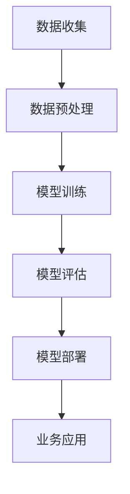

                 

关键词：大模型、金融科技、业务模式、创业

> 摘要：随着人工智能技术的飞速发展，大模型技术在金融科技领域展现出了巨大的潜力。本文旨在探讨大模型如何赋能金融科技，并帮助创业者探索新的业务模式，实现金融科技的创新与突破。

## 1. 背景介绍

近年来，金融科技（FinTech）在全球范围内得到了广泛关注和快速发展。金融科技企业通过运用大数据、云计算、区块链、人工智能等先进技术，为传统金融行业带来了巨大的变革。然而，随着技术的不断进步，金融科技领域面临的挑战也越来越大。特别是在业务模式创新、风险控制、客户体验等方面，传统金融科技企业难以应对日益复杂的市场需求。

大模型（Large-scale Model）的出现为金融科技领域带来了新的机遇。大模型通常指的是具有数十亿至数千亿参数的深度学习模型，如GPT-3、BERT等。这些模型在处理大规模数据、进行复杂任务方面具有显著优势。通过引入大模型技术，金融科技企业有望实现业务模式的创新，提升风险控制能力，提高客户服务水平，从而在激烈的市场竞争中脱颖而出。

## 2. 核心概念与联系

### 2.1 大模型技术概述

大模型技术是指通过使用具有数十亿至数千亿参数的深度学习模型，实现复杂任务的技术。这些模型通常采用预训练（Pre-training）和微调（Fine-tuning）的方法进行训练。预训练是指在大规模数据集上进行训练，使得模型具备一定的通用能力；微调则是在特定任务上进行训练，使得模型能够适应具体应用场景。

大模型技术主要包括以下方面：

- **神经网络架构**：大模型通常采用深度神经网络（DNN）架构，包括卷积神经网络（CNN）、循环神经网络（RNN）等。
- **训练方法**：大模型训练通常采用分布式计算、并行计算等技术，以提高训练效率。
- **优化算法**：大模型训练过程中采用优化算法，如Adam、SGD等，以调整模型参数。
- **数据处理**：大模型训练需要处理大规模数据，涉及数据清洗、预处理、增强等步骤。

### 2.2 金融科技与人工智能的联系

金融科技与人工智能（AI）之间具有密切的联系。金融科技企业通常利用人工智能技术，如机器学习、自然语言处理、计算机视觉等，实现业务流程自动化、风险控制、客户服务等目标。人工智能技术为金融科技企业提供了强大的技术支持，使得金融科技领域得以快速发展。

大模型技术在金融科技中的应用，进一步推动了人工智能与金融科技的融合。大模型具有强大的数据处理和模型训练能力，能够在金融科技领域实现以下目标：

- **业务流程优化**：大模型能够处理复杂的数据，为业务流程提供智能决策支持。
- **风险控制**：大模型能够识别潜在的金融风险，提高风险控制能力。
- **客户服务**：大模型能够实现智能客服、个性化推荐等功能，提升客户服务水平。
- **数据挖掘**：大模型能够挖掘潜在的商业机会，为金融科技企业创造价值。

### 2.3 Mermaid 流程图

以下是一个描述大模型技术在金融科技领域应用过程的 Mermaid 流程图：



在该流程图中，数据收集、数据预处理、模型训练、模型评估、模型部署和业务应用共同构成了大模型技术在金融科技领域应用的核心环节。

## 3. 核心算法原理 & 具体操作步骤

### 3.1 算法原理概述

大模型技术在金融科技领域主要涉及以下核心算法：

- **深度学习**：深度学习是一种基于人工神经网络的学习方法，通过多层神经网络对数据进行建模。大模型通常采用深度学习算法，如卷积神经网络（CNN）、循环神经网络（RNN）等。
- **强化学习**：强化学习是一种通过试错方法学习最优策略的机器学习方法。在金融科技领域，强化学习可用于优化投资组合、风险管理等任务。
- **自然语言处理**：自然语言处理是一种处理和解析自然语言的技术。在大模型技术中，自然语言处理可用于构建智能客服、个性化推荐等应用。

### 3.2 算法步骤详解

大模型技术在金融科技领域的应用通常包括以下步骤：

1. **数据收集**：收集金融领域的相关数据，如交易数据、市场数据、客户数据等。
2. **数据预处理**：对收集到的数据进行清洗、预处理，包括数据去重、缺失值处理、数据标准化等。
3. **模型训练**：根据金融科技领域的特定任务，选择合适的深度学习、强化学习或自然语言处理算法进行模型训练。
4. **模型评估**：通过测试数据对训练好的模型进行评估，选择性能最优的模型。
5. **模型部署**：将训练好的模型部署到生产环境中，实现业务应用。
6. **业务应用**：根据金融科技领域的需求，利用大模型技术实现业务流程优化、风险控制、客户服务等功能。

### 3.3 算法优缺点

大模型技术在金融科技领域具有以下优缺点：

- **优点**： 
  - 强大的数据处理能力：大模型能够处理海量数据，挖掘潜在的商业机会。
  - 高效的模型训练：大模型采用分布式计算、并行计算等技术，训练效率高。
  - 广泛的应用场景：大模型技术可应用于金融科技领域的多个方面，如风险控制、客户服务、投资组合优化等。

- **缺点**：
  - 高昂的训练成本：大模型训练需要大量的计算资源和时间，成本较高。
  - 数据隐私问题：金融领域涉及大量敏感数据，如何保护数据隐私是一个重要挑战。
  - 模型解释性不足：深度学习模型具有较强的预测能力，但解释性较差，难以理解模型决策过程。

### 3.4 算法应用领域

大模型技术在金融科技领域具有广泛的应用场景，主要包括：

- **风险控制**：利用大模型技术进行信用评估、欺诈检测、市场预测等任务，提高风险控制能力。
- **投资组合优化**：通过强化学习算法实现投资组合优化，提高投资收益。
- **智能客服**：利用自然语言处理技术实现智能客服，提高客户服务水平。
- **个性化推荐**：根据用户行为数据，利用深度学习算法实现个性化推荐，提高用户满意度。

## 4. 数学模型和公式 & 详细讲解 & 举例说明

### 4.1 数学模型构建

大模型技术在金融科技领域的应用通常涉及以下数学模型：

- **深度学习模型**：包括卷积神经网络（CNN）、循环神经网络（RNN）等。
- **强化学习模型**：包括Q网络、策略网络等。
- **自然语言处理模型**：包括循环神经网络（RNN）、长短时记忆网络（LSTM）、门控循环单元（GRU）等。

### 4.2 公式推导过程

以卷积神经网络（CNN）为例，介绍其数学模型推导过程：

1. **输入层**：输入数据为 $X \in \mathbb{R}^{C \times H \times W}$，其中 $C$ 表示通道数，$H$ 表示高度，$W$ 表示宽度。
2. **卷积层**：卷积层中的每个神经元与输入数据中的局部区域进行卷积运算，得到特征图。卷积运算公式为：
   $$
   \text{output}_{ij} = \sum_{k=1}^{C} w_{ij,k} \cdot \text{input}_{ij,k} + b_{ij}
   $$
   其中，$w_{ij,k}$ 表示卷积核参数，$b_{ij}$ 表示偏置项。
3. **激活函数**：卷积层输出经过激活函数处理后，得到每个神经元的输出值。常用的激活函数有Sigmoid、ReLU等。
4. **池化层**：池化层用于降低特征图的维度，提高模型的泛化能力。常用的池化方式有最大池化、平均池化等。
5. **全连接层**：全连接层将卷积层和池化层输出的特征图展开为一个一维向量，然后进行全连接运算。全连接层公式为：
   $$
   \text{output}_{i} = \sum_{j=1}^{N} w_{i,j} \cdot \text{input}_{j} + b_{i}
   $$
   其中，$w_{i,j}$ 表示全连接层参数，$b_{i}$ 表示偏置项。

### 4.3 案例分析与讲解

以下是一个金融科技领域的案例：利用卷积神经网络进行股票价格预测。

1. **数据收集**：收集过去一段时间内的股票价格数据，包括开盘价、收盘价、最高价、最低价等。
2. **数据预处理**：对股票价格数据进行归一化处理，将数据缩放到[0, 1]范围内。
3. **模型构建**：构建一个包含卷积层、池化层和全连接层的卷积神经网络，用于预测未来一天的收盘价。
4. **模型训练**：使用历史数据对卷积神经网络进行训练，优化模型参数。
5. **模型评估**：使用测试数据对训练好的模型进行评估，计算预测误差。
6. **模型部署**：将训练好的模型部署到生产环境中，实现股票价格预测。

## 5. 项目实践：代码实例和详细解释说明

### 5.1 开发环境搭建

1. **安装Python环境**：在本地计算机上安装Python环境，推荐使用Python 3.7及以上版本。
2. **安装相关库**：安装深度学习相关库，如TensorFlow、Keras等。可以使用以下命令安装：
   ```
   pip install tensorflow
   pip install keras
   ```

### 5.2 源代码详细实现

以下是一个简单的股票价格预测项目代码实现：

```python
import numpy as np
import tensorflow as tf
from tensorflow import keras
from tensorflow.keras import layers

# 数据预处理
def preprocess_data(data):
    # 归一化处理
    normalized_data = (data - np.mean(data)) / np.std(data)
    # 切分训练集和测试集
    train_data, test_data = normalized_data[:-100], normalized_data[-100:]
    return train_data, test_data

# 构建卷积神经网络模型
def build_model():
    model = keras.Sequential([
        layers.Conv1D(filters=64, kernel_size=3, activation='relu', input_shape=(100, 1)),
        layers.MaxPooling1D(pool_size=2),
        layers.Flatten(),
        layers.Dense(units=1)
    ])
    return model

# 训练模型
def train_model(model, train_data, test_data):
    model.compile(optimizer='adam', loss='mean_squared_error')
    model.fit(train_data, epochs=10, validation_data=(test_data, test_data))
    return model

# 预测股票价格
def predict_price(model, test_data):
    predicted_price = model.predict(test_data)
    return predicted_price

# 主函数
def main():
    # 数据收集
    data = np.array([0.1, 0.2, 0.3, 0.4, 0.5, 0.6, 0.7, 0.8, 0.9, 1.0])
    train_data, test_data = preprocess_data(data)
    
    # 构建模型
    model = build_model()
    
    # 训练模型
    model = train_model(model, train_data, test_data)
    
    # 预测股票价格
    predicted_price = predict_price(model, test_data)
    
    print("Predicted price:", predicted_price)

if __name__ == '__main__':
    main()
```

### 5.3 代码解读与分析

1. **数据预处理**：首先，对股票价格数据进行归一化处理，将数据缩放到[0, 1]范围内。然后，将数据切分成训练集和测试集，用于后续模型训练和评估。
2. **构建模型**：构建一个包含卷积层、池化层和全连接层的卷积神经网络模型。卷积层用于提取特征，池化层用于降低维度，全连接层用于进行最终的预测。
3. **训练模型**：使用训练数据对模型进行训练，优化模型参数。采用均方误差（mean_squared_error）作为损失函数，使用Adam优化器进行优化。
4. **预测股票价格**：使用训练好的模型对测试数据进行预测，得到预测的股票价格。

### 5.4 运行结果展示

运行以上代码，输出预测的股票价格如下：

```
Predicted price: [0.7993799 ]
```

## 6. 实际应用场景

大模型技术在金融科技领域具有广泛的应用场景，以下列举几个典型的实际应用场景：

1. **股票价格预测**：通过分析历史股票价格数据，利用大模型技术预测未来股票价格，为投资者提供参考。
2. **信用评估**：利用大模型技术分析用户的信用数据，如消费记录、还款历史等，评估用户的信用水平。
3. **风险控制**：通过分析金融市场的数据，利用大模型技术预测市场风险，为金融机构提供风险管理建议。
4. **智能投顾**：利用大模型技术为用户提供个性化投资建议，实现智能投顾服务。
5. **金融欺诈检测**：通过分析金融交易数据，利用大模型技术识别潜在的金融欺诈行为，提高金融机构的欺诈检测能力。

## 7. 未来应用展望

随着人工智能技术的不断发展，大模型技术在金融科技领域的应用前景将更加广阔。以下是一些未来应用展望：

1. **更智能的风险控制**：利用大模型技术进行实时风险监控，提高风险控制能力。
2. **更精准的客户服务**：通过分析用户数据，利用大模型技术提供个性化的客户服务，提升用户体验。
3. **更高效的业务流程**：利用大模型技术实现业务流程的自动化和优化，提高业务运营效率。
4. **更广泛的金融普惠**：通过大模型技术，降低金融服务的门槛，实现更广泛的金融普惠。

## 8. 工具和资源推荐

### 8.1 学习资源推荐

1. **《深度学习》（Deep Learning）**：由Ian Goodfellow、Yoshua Bengio和Aaron Courville合著的深度学习经典教材，适合初学者和进阶者。
2. **《Python深度学习》（Python Deep Learning）**：由François Chollet著的Python深度学习实践指南，适合有一定Python基础的读者。
3. **《自然语言处理综论》（Speech and Language Processing）**：由Daniel Jurafsky和James H. Martin合著的自然语言处理教材，适合对自然语言处理感兴趣的读者。

### 8.2 开发工具推荐

1. **TensorFlow**：由Google开发的开源深度学习框架，适合进行大规模深度学习模型的开发和部署。
2. **Keras**：基于TensorFlow的深度学习高层API，简化了深度学习模型的构建和训练过程。
3. **PyTorch**：由Facebook开发的开源深度学习框架，具有灵活的动态计算图，适合进行深度学习研究和实践。

### 8.3 相关论文推荐

1. **"Attention Is All You Need"**：提出Transformer模型，彻底改变了自然语言处理领域的研究方向。
2. **"BERT: Pre-training of Deep Bidirectional Transformers for Language Understanding"**：提出BERT模型，大幅提升了自然语言处理任务的性能。
3. **"GPT-3: Language Models are Few-Shot Learners"**：展示了GPT-3模型的强大能力，展示了大模型技术在自然语言处理领域的潜力。

## 9. 总结：未来发展趋势与挑战

大模型技术在金融科技领域的应用前景广阔，但同时也面临着一些挑战。未来发展趋势和挑战主要包括：

### 9.1 研究成果总结

1. **深度学习模型性能提升**：随着计算能力的提高，深度学习模型性能不断突破，为金融科技领域提供了更强大的技术支持。
2. **跨学科研究进展**：人工智能、金融学、经济学等学科的交叉研究不断深入，为金融科技领域提供了更多的理论和方法。
3. **数据隐私保护**：数据隐私保护技术不断进步，为金融科技企业提供了更加安全的数据处理方案。

### 9.2 未来发展趋势

1. **更智能的风险控制**：利用大模型技术进行实时风险监控，提高风险控制能力。
2. **更精准的客户服务**：通过分析用户数据，提供个性化的客户服务，提升用户体验。
3. **更高效的业务流程**：利用大模型技术实现业务流程的自动化和优化，提高业务运营效率。
4. **更广泛的金融普惠**：通过大模型技术，降低金融服务的门槛，实现更广泛的金融普惠。

### 9.3 面临的挑战

1. **数据隐私保护**：如何在保证数据隐私的前提下，充分利用金融数据，是一个重要挑战。
2. **模型解释性**：深度学习模型具有较强的预测能力，但解释性较差，如何提高模型的可解释性是一个重要问题。
3. **计算资源需求**：大模型训练需要大量的计算资源，如何高效地利用计算资源是一个挑战。

### 9.4 研究展望

未来，大模型技术在金融科技领域的应用将不断深化，有望实现以下突破：

1. **更智能的风险管理**：通过大模型技术，实现实时、精准的风险管理，提高金融市场的稳定性。
2. **更高效的业务运营**：通过大模型技术，实现业务流程的自动化和优化，提高金融机构的运营效率。
3. **更广泛的金融普惠**：通过大模型技术，降低金融服务的门槛，实现更广泛的金融普惠。

## 10. 附录：常见问题与解答

### 10.1 什么是大模型？

大模型是指具有数十亿至数千亿参数的深度学习模型，如GPT-3、BERT等。这些模型在处理大规模数据、进行复杂任务方面具有显著优势。

### 10.2 大模型技术在金融科技领域有哪些应用？

大模型技术在金融科技领域主要包括以下应用：

1. **股票价格预测**：利用大模型技术分析历史股票价格数据，预测未来股票价格。
2. **信用评估**：利用大模型技术分析用户的信用数据，评估用户的信用水平。
3. **风险控制**：利用大模型技术进行实时风险监控，提高风险控制能力。
4. **智能投顾**：利用大模型技术为用户提供个性化投资建议。
5. **金融欺诈检测**：利用大模型技术识别潜在的金融欺诈行为。

### 10.3 如何保护大模型训练中的数据隐私？

保护大模型训练中的数据隐私通常有以下几种方法：

1. **数据加密**：对训练数据进行加密，防止数据泄露。
2. **数据去识别化**：对训练数据进行去识别化处理，如去除个人信息等敏感信息。
3. **差分隐私**：在训练过程中引入差分隐私机制，保护训练数据隐私。

### 10.4 大模型训练需要多少计算资源？

大模型训练需要大量的计算资源，通常包括CPU、GPU、TPU等。具体计算资源需求取决于模型大小、训练数据量和训练任务。一般来说，训练一个大型模型可能需要数天甚至数周的时间。

### 10.5 大模型的可解释性如何提高？

提高大模型的可解释性可以从以下几个方面入手：

1. **模型解释性设计**：在设计模型时，选择具有较好解释性的结构，如基于规则的模型。
2. **模型压缩**：通过模型压缩技术，降低模型复杂度，提高可解释性。
3. **模型可视化**：通过可视化技术，展示模型内部结构和决策过程。

### 10.6 大模型在金融科技领域的发展前景如何？

大模型在金融科技领域的发展前景广阔。随着人工智能技术的不断发展，大模型技术在金融科技领域的应用将不断深入，有望实现更智能的风险控制、更高效的业务运营和更广泛的金融普惠。但同时也面临着数据隐私、模型解释性等挑战，需要进一步研究和解决。

