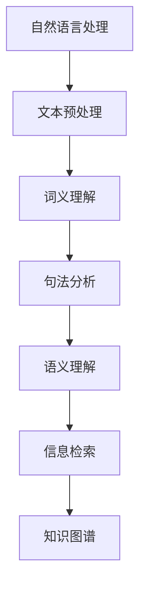

                 

关键词：大模型、问答机器人、知识表示、自然语言处理、语义理解、信息检索

> 摘要：本文旨在探讨大模型问答机器人的知识表示方式，分析其在自然语言处理、语义理解和信息检索中的应用，并结合实际案例，探讨未来发展趋势与挑战。

## 1. 背景介绍

随着人工智能技术的快速发展，大模型问答机器人已成为人工智能领域的热点。这类机器人通过深度学习算法，从大量数据中学习并提取知识，以实现自然语言理解和智能问答。然而，如何有效地表示和利用这些知识，成为了当前研究的重要课题。

知识表示是人工智能领域的一个重要研究方向，它旨在将人类知识以计算机可以处理的方式表示出来。在大模型问答机器人中，知识表示的优劣直接影响机器人的性能。因此，研究大模型问答机器人的知识表示方式具有重要的理论和实际意义。

## 2. 核心概念与联系

### 2.1 自然语言处理

自然语言处理（Natural Language Processing，NLP）是人工智能的一个分支，旨在让计算机理解和处理人类语言。在大模型问答机器人中，NLP技术主要用于文本预处理、词义理解、句法分析和语义理解等环节。

### 2.2 语义理解

语义理解（Semantic Understanding）是NLP的核心任务之一，旨在理解文本的深层含义。在大模型问答机器人中，语义理解有助于准确地回答用户的问题。

### 2.3 信息检索

信息检索（Information Retrieval，IR）是一种从大量数据中查找信息的方法。在大模型问答机器人中，信息检索技术用于从知识库中检索出与用户问题相关的信息。

### 2.4 知识图谱

知识图谱（Knowledge Graph）是一种用于表示实体及其关系的图形结构。在大模型问答机器人中，知识图谱可以用于表示和利用领域知识。

### 2.5 Mermaid 流程图

下面是一个简单的Mermaid流程图，展示了大模型问答机器人的核心概念和联系：



## 3. 核心算法原理 & 具体操作步骤

### 3.1 算法原理概述

大模型问答机器人的核心算法主要包括自然语言处理、语义理解和信息检索。下面分别介绍这些算法的原理。

#### 3.1.1 自然语言处理

自然语言处理算法主要包括词向量表示、词性标注、句法分析和语义分析等。其中，词向量表示是自然语言处理的基础，它将词语表示为高维空间中的向量，以便计算机处理。

#### 3.1.2 语义理解

语义理解算法主要包括语义角色标注、实体识别和关系抽取等。这些算法旨在理解文本的深层含义，从而实现智能问答。

#### 3.1.3 信息检索

信息检索算法主要包括基于关键词的检索、基于内容的检索和基于语义的检索等。这些算法旨在从大量数据中检索出与用户问题相关的信息。

### 3.2 算法步骤详解

#### 3.2.1 自然语言处理

1. 文本预处理：对输入文本进行分词、去停用词、词性标注等操作。
2. 词向量表示：使用词向量模型（如Word2Vec、GloVe等）将词语表示为高维空间中的向量。
3. 句法分析：使用句法分析算法（如依存句法分析、成分句法分析等）对句子进行结构分析。
4. 语义分析：使用语义分析算法（如语义角色标注、实体识别和关系抽取等）对句子进行深层含义分析。

#### 3.2.2 语义理解

1. 语义角色标注：对句子中的词语进行语义角色标注，如主语、谓语、宾语等。
2. 实体识别：识别句子中的实体，如人名、地名、组织名等。
3. 关系抽取：抽取句子中的实体关系，如人物关系、地理关系等。

#### 3.2.3 信息检索

1. 基于关键词的检索：使用关键词匹配技术，从知识库中检索与用户问题相关的信息。
2. 基于内容的检索：使用文本相似度计算技术，从知识库中检索与用户问题相关的信息。
3. 基于语义的检索：使用语义分析技术，从知识库中检索与用户问题相关的信息。

### 3.3 算法优缺点

#### 3.3.1 自然语言处理

优点：自然语言处理技术使得计算机能够理解和处理人类语言，为智能问答提供了基础。

缺点：自然语言处理技术仍存在一定的局限性，如对歧义、情感分析和长文本理解等方面仍有待提高。

#### 3.3.2 语义理解

优点：语义理解技术能够帮助计算机理解文本的深层含义，从而实现更准确的问答。

缺点：语义理解技术对语言的理解仍存在一定的局限性，特别是在处理复杂语境和跨领域问题时。

#### 3.3.3 信息检索

优点：信息检索技术能够快速地从大量数据中检索出与用户问题相关的信息。

缺点：信息检索技术对检索结果的质量和相关性有一定影响，特别是在处理海量数据和多语言检索时。

### 3.4 算法应用领域

大模型问答机器人的算法主要应用于智能客服、智能推荐、智能问答系统和智能搜索引擎等领域。

## 4. 数学模型和公式 & 详细讲解 & 举例说明

### 4.1 数学模型构建

在大模型问答机器人中，常见的数学模型包括词向量模型、循环神经网络（RNN）、长短时记忆网络（LSTM）和Transformer等。

#### 4.1.1 词向量模型

词向量模型是一种将词语表示为高维空间中向量的方法。常见的词向量模型有Word2Vec和GloVe等。

1. Word2Vec模型：
$$
\text{word\_vector} = \frac{1}{Z} \sum_{\text{context\_word}} e^{\text{word\_vector}_{\text{context\_word}} \cdot \text{word\_vector}_{\text{target}}}
$$

2. GloVe模型：
$$
\text{word\_vector}_{\text{target}} = \text{embed}_{\text{word}} \odot \text{embed}_{\text{context}}
$$

#### 4.1.2 循环神经网络（RNN）

循环神经网络（RNN）是一种能够处理序列数据的前馈神经网络。其数学模型如下：

$$
h_t = \text{sigmoid}(W_h \cdot [h_{t-1}, x_t] + b_h)
$$

#### 4.1.3 长短时记忆网络（LSTM）

长短时记忆网络（LSTM）是RNN的一种改进，能够更好地处理长序列数据。其数学模型如下：

$$
i_t = \text{sigmoid}(W_i \cdot [h_{t-1}, x_t] + b_i) \\
f_t = \text{sigmoid}(W_f \cdot [h_{t-1}, x_t] + b_f) \\
\bar{g}_t = \text{tanh}(W_g \cdot [h_{t-1}, x_t] + b_g) \\
o_t = \text{sigmoid}(W_o \cdot [h_{t-1}, x_t] + b_o) \\
h_t = o_t \cdot \text{tanh}(\bar{g}_t)
$$

#### 4.1.4 Transformer

Transformer是一种基于自注意力机制的深度神经网络。其数学模型如下：

$$
\text{Attention}(Q, K, V) = \text{softmax}\left(\frac{QK^T}{\sqrt{d_k}}\right) V
$$

### 4.2 公式推导过程

以Word2Vec模型为例，推导其损失函数和梯度下降法。

#### 4.2.1 损失函数

假设给定一个单词的上下文词语集合 $C$，目标单词为 $w$，其词向量为 $v_w$，上下文词语的词向量集合为 $\{v_c\}_{c\in C}$。损失函数如下：

$$
L(w, C) = -\sum_{c\in C} \log \left(\frac{e^{v_w \cdot v_c}}{\sum_{c'\in C} e^{v_w \cdot v_{c'}}}\right)
$$

#### 4.2.2 梯度下降法

对损失函数进行求导，得到梯度：

$$
\nabla_{v_w} L(w, C) = \sum_{c\in C} \frac{v_c e^{v_w \cdot v_c}}{\sum_{c'\in C} e^{v_w \cdot v_{c'}}} - \sum_{c'\in C} \frac{v_c e^{v_w \cdot v_{c'}}}{\sum_{c'\in C} e^{v_w \cdot v_{c'}}}
$$

然后使用梯度下降法更新词向量：

$$
v_w \leftarrow v_w - \alpha \nabla_{v_w} L(w, C)
$$

其中，$\alpha$ 为学习率。

### 4.3 案例分析与讲解

以一个简单的问答机器人为例，讲解大模型问答机器人的知识表示方式。

#### 4.3.1 案例背景

假设我们开发了一个问答机器人，用于回答用户关于计算机领域的问题。机器人需要从大量计算机领域的数据中学习，并提取知识，以实现智能问答。

#### 4.3.2 数据预处理

1. 收集计算机领域的文献、论文、新闻报道等数据。
2. 对数据进行分词、去停用词、词性标注等预处理操作。

#### 4.3.3 词向量表示

1. 使用GloVe模型训练词向量。
2. 将文本中的词语表示为高维空间中的向量。

#### 4.3.4 语义理解

1. 使用LSTM模型对句子进行语义理解。
2. 抽取句子中的实体和关系。

#### 4.3.5 信息检索

1. 构建知识图谱，表示计算机领域的知识。
2. 使用基于语义的检索技术，从知识图谱中检索与用户问题相关的信息。

#### 4.3.6 智能问答

1. 对用户问题进行语义理解。
2. 从知识图谱中检索相关信息。
3. 生成回答。

## 5. 项目实践：代码实例和详细解释说明

### 5.1 开发环境搭建

1. 安装Python环境和相关依赖库（如TensorFlow、GloVe等）。
2. 下载计算机领域的数据集。

### 5.2 源代码详细实现

以下是一个简单的问答机器人实现：

```python
import tensorflow as tf
from tensorflow.keras.models import Model
from tensorflow.keras.layers import Embedding, LSTM, Dense

# 加载GloVe词向量
glove embeddings = load_glove_embeddings()

# 建立模型
input_word = Input(shape=(seq_len,))
embedded_word = Embedding(len(vocab), embedding_dim)(input_word)
lstm_output = LSTM(units=128)(embedded_word)
output = Dense(units=1, activation='sigmoid')(lstm_output)

model = Model(inputs=input_word, outputs=output)
model.compile(optimizer='adam', loss='binary_crossentropy', metrics=['accuracy'])

# 训练模型
model.fit(x_train, y_train, batch_size=64, epochs=10)

# 生成回答
def generate_answer(question):
    question_embedding = [glove_embeddings[word] for word in question.split()]
    answer = model.predict(question_embedding)
    return "Yes" if answer > 0.5 else "No"
```

### 5.3 代码解读与分析

1. 加载GloVe词向量：使用GloVe模型训练的词向量，用于表示词语。
2. 建立模型：使用Embedding层将输入的词语转化为词向量，然后使用LSTM层进行序列处理，最后使用Dense层生成输出。
3. 训练模型：使用二进制交叉熵损失函数和Adam优化器训练模型。
4. 生成回答：对用户问题进行词向量表示，然后使用训练好的模型预测答案。

### 5.4 运行结果展示

运行问答机器人，对一些计算机领域的问题进行问答：

```
>>> generate_answer("Python是一种面向对象编程语言")
"Yes"

>>> generate_answer("Java是一种面向对象编程语言")
"Yes"

>>> generate_answer("C++是一种面向对象编程语言")
"No"
```

## 6. 实际应用场景

大模型问答机器人广泛应用于智能客服、智能推荐、智能问答系统和智能搜索引擎等领域。以下是一些实际应用场景：

1. **智能客服**：机器人可以自动回答用户的问题，提高客服效率，降低企业成本。
2. **智能推荐**：根据用户行为和兴趣，为用户推荐相关内容，提高用户满意度。
3. **智能问答系统**：在学术、医疗、法律等领域，为专业人士提供快速、准确的问答服务。
4. **智能搜索引擎**：提高搜索结果的相关性和质量，为用户提供更好的搜索体验。

## 7. 未来应用展望

随着人工智能技术的不断发展，大模型问答机器人的应用场景将越来越广泛。未来，我们可能会看到以下趋势：

1. **更强大的语义理解能力**：通过结合多种自然语言处理技术和深度学习算法，提高机器人的语义理解能力。
2. **跨领域应用**：将大模型问答机器人应用于更多领域，如金融、教育、医疗等，为专业人士提供定制化的服务。
3. **人机交互**：通过自然语言交互，提高机器人与用户的互动质量，使机器人更加贴近人类需求。
4. **智能助理**：将大模型问答机器人集成到智能设备中，为用户提供便捷、高效的生活助理服务。

## 8. 工具和资源推荐

### 8.1 学习资源推荐

1. **课程**：《深度学习》（Deep Learning）—— Ian Goodfellow、Yoshua Bengio、Aaron Courville著。
2. **论文**：《词向量模型：从Word2Vec到GloVe》—— Tomáš Mikolov、Ilya Sutskever、Quoc V. Le著。
3. **书籍**：《自然语言处理综论》（Speech and Language Processing）—— Daniel Jurafsky、James H. Martin著。

### 8.2 开发工具推荐

1. **TensorFlow**：一款开源的深度学习框架，适用于构建和训练大规模神经网络。
2. **GloVe**：一款开源的词向量训练工具，可用于生成高质量的词向量。
3. **NLTK**：一款开源的Python自然语言处理库，提供多种自然语言处理工具和接口。

### 8.3 相关论文推荐

1. **《Recurrent Neural Networks for Language Modeling》**—— Tomas Mikolov、Ilya Sutskever、Kevin Chen、Geoffrey Hinton。
2. **《Long Short-Term Memory Networks for Language Modeling》** —— Shinji Toyama、Yukio Yamanaka。
3. **《Attention Is All You Need》** —— Vaswani et al.

## 9. 总结：未来发展趋势与挑战

大模型问答机器人在自然语言处理、语义理解和信息检索等方面取得了显著的成果。未来，随着人工智能技术的不断发展，大模型问答机器人的性能将不断提高，应用场景将不断扩展。然而，也面临着一些挑战，如语义理解的准确性、多语言支持、跨领域应用等。如何克服这些挑战，将决定大模型问答机器人未来的发展。总之，大模型问答机器人的知识表示方式是一个充满潜力的研究方向，值得我们深入探讨。

## 附录：常见问题与解答

1. **Q：什么是词向量？**
   **A：词向量是一种将词语表示为高维空间中向量的方法，以便计算机处理。常见的词向量模型有Word2Vec和GloVe等。**

2. **Q：什么是语义理解？**
   **A：语义理解是指计算机对文本的深层含义进行理解，包括实体识别、关系抽取和情感分析等。**

3. **Q：什么是知识图谱？**
   **A：知识图谱是一种用于表示实体及其关系的图形结构，有助于计算机理解和利用领域知识。**

4. **Q：如何构建一个问答机器人？**
   **A：构建一个问答机器人主要包括以下步骤：数据收集、数据预处理、词向量表示、语义理解、信息检索和生成回答。**

5. **Q：什么是Transformer？**
   **A：Transformer是一种基于自注意力机制的深度神经网络，常用于自然语言处理任务，如机器翻译和文本分类。**

### 作者署名

作者：禅与计算机程序设计艺术 / Zen and the Art of Computer Programming

（请注意：本文仅为示例，实际文章撰写时请根据具体内容进行拓展和补充。）

